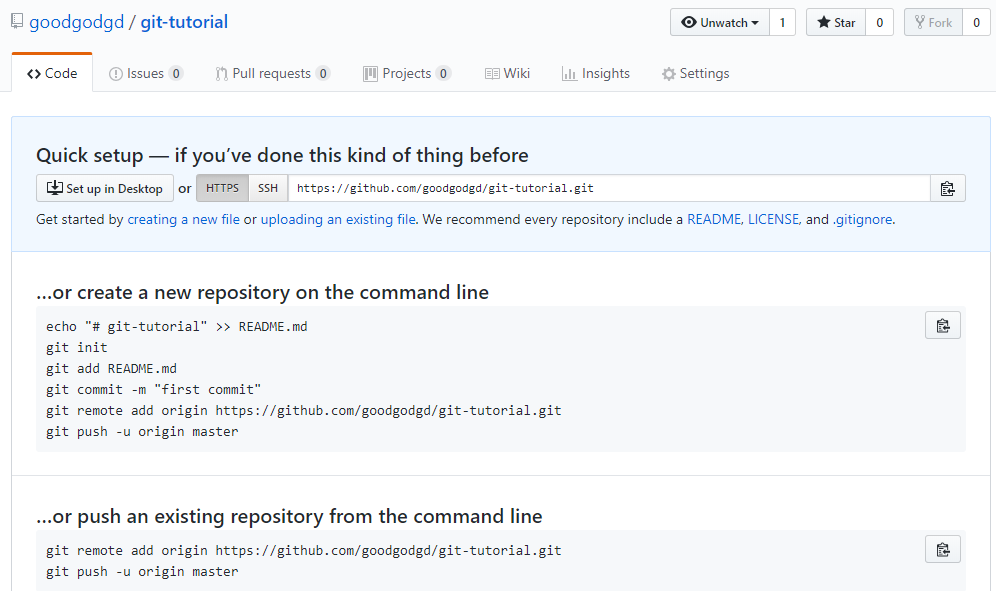

# 0. Git 설치

설명을 듣기 전에 일단 설치부터 눌러놓자. Git을 설치하기 전에 먼저 소스 코드를 위한 텍스트 에디터부터 설치하자. 단순한 예제 소스를 위해 무거운 Visual Studio를 켤 필요는 없고 그렇다고 해서 기본 메모장으로 하기에는 소스 코드 편집에 적합하지 않다. `Notepad++`은 다양한 프로그램 언어에 대해 문법 강조 표시를 해주고 탭 기능, 자동 들여쓰기, 자동 완성을 해줄 수 있는 코드 편집기다. 윈도우에서는 이만큼 가볍고 편리한 코드 편집기가 없다. 

<https://notepad-plus-plus.org/download>

Git은 Mac OS X, Windows, Linux 대부분의 운영체제를 지원하며 윈도우 버전은 아래 주소에서 받을 수 있다. 64-bit 설치 버전을 받아보자.

<https://git-scm.com/download/win>

설치는 대부분 기본 설정을 쓰고 아래 그림에 나온 부분만 그림에 나온 것처럼 설정해주자. 개발자들은 GUI로 Git을 쓰는 것을 좋아하지 않는다.


Notepad++은 Git에서도 권장하는 에디터다. 여기서 설정한 에디터는 Git에서 메시지를 보여줄 때 사용된다.


# 1. About Git

**버전 관리 시스템**은  파일의 변화를 시간에 따라 기록하여 과거 특정 시점의 버전을 다시 불러올 수 있는 시스템이다. 일반적으로 (혹은 자연발생적으로) 사람들이 많이 쓰는 방법은 여러 버전의 파일을 따로 저장하는 것이다. 작업 중이던 파일에 큰 변경사항을 주고 싶은데 이전 버전은 남기고 싶을 때, 파일명에 버전명과 대략의 수정사항을 넣어서 사본을 만든다. 바로 이렇게.


문서 같은 경우는 딱히 다른 방법도 없고 이 방법도 잘 작동한다. 반면 프로그램 소스 코드는 워낙 수정이 잦고 여러 사람이 공동으로 작업하는 경우가 많기 때문에 혼자 취미로 개발하는게 아니라면 이렇게는 관리할 수 없다. 그래서 소스코드를 작업한 메시지와 함께 버전별로 저장하는 데이터베이스 비슷한 시스템이 나타나기 시작했고 `CVS, Subversion, Perforce` 등의 중앙집중식 버전 관리 시스템(CVCS, Centralized Version Control System)이 유행했다. 중앙집중식이라는 것은 하나의 서버에서 여러 사람이 작업한 이력을 모두 가지고 있고 각 client는 서버를 통해 다른 사람이 올린 내용을 받아볼 수 있었다.  

CVCS의 단점은 중앙 서버가 고장나면 모두가 망한다는 것이다. 그래서 나온게 분산 버전 관리 시스템(DVCS, Distributed Version Control System)이다. DVCS는 각 로컬 저장소에 모든 사람의 모든 이력이 다 저장되기 때문에 서버가 폭발한다고 해도 데이터 손실이 없다. DVCS로는 ` Git, Mecurial, Bazaar,Darcs` 등이 있었(다고 전해지)는데 지금은 Git의 점유율이 압도적이다. 왜 그럴까?  

소스 코드의 버전 관리는 소수가 개발하는 프로젝트에서도 고민거리인데 전세계에서 수백명이 개발하던 리눅스 커널 개발도 많은 고민을 했을 것이다. 1991년 태어난 리눅스는 2002년부터 BitKeeper라는 DVCS로 관리를 하다가 BitKeeper가 유료화되면서 리눅스 창시자인 **리누즈 토발즈(Linus Torvalds)**님께서 직접 버전관리 시스템을 만들었다. ~~신계에 오른~~ 최고의 개발자가 대규모 프로젝트를 염두해두고 만들었으니 당연히 성능이 좋았다. Git의 장점을 요약하면

- 대규모 프로젝트를 관리하더라도 **속도가 빠르고 적은 용량**을 유지
- 단순한 구조 (델타가 아닌 스냅샷)
- 동시 다발적인 브랜치 분기와 병합을 통한 효과적인 분산 개발시스템 제공
- 오프라인에서도 과거 이력 조회와 commit 가능
- ... 등 다 적을 수 없다.


그러나 Git에 대한 이러한 찬양은 구식 시스템을 써본 옛날 사람의 "옛날에는 말이야~" 라는 식이라서 Git으로 버전 관리를 시작하는 젊은이들은 공감하기 어렵다. (CVCS가 전화기라면 Git은 스마트폰이다. 요즘 아이들은 스마트폰이 없던 세상을 공감할 수 없다.)  오늘날에는 Git이 공기처럼 당연히 쓰이고 있으므로 소프트웨어를 개발하는 사람이라면 당연히 Git을 쓸 줄 알아야 한다.


# 2. Git과 GitHub

Git은 혼자 쓸 때는 단순히 버전 관리 시스템이지만 팀으로 사용할 때는 여러 사람들 사이의 협업 툴이다. 여러 사람이 작업한 결과를 자동으로 병합해주고 병합 과정에서 conflict가 있으면 개발자가 이를 해결하도록 유도한다. 모든 개발자가 한 근무지에서 개발하는 것이 아니라 근무지가 서로 다르거나 아니면 혼자 개발하더라도 여러 곳을 옮겨 다니면서 개발한다면 언제 어디서나 인터넷을 통해 접근할 수 있는 온라인 저장소가 필수다. 그래서 2007년 온라인 저장소인 GitHub 서비스가 시작되었고 이름처럼 Git과 GitHub은 찰떡이다. GitHub은 단순히 온라인 저장소만 지원하는게 아니라 GitHub에서 소스 코드 작성 및 변경, 브랜치 병합 등을 할 수 있으며 개발자들에게 유용한 다양한 툴들을 지원한다. (코드 변경점 시각화, 이슈 게시판, 위키 문서 등) 이만큼 얘기했으면 군소리 말고 들어가서 가입(Sign up) 하자. 가입 절차도 매우 간단하다.

<https://github.com/>


로그인해서 들어가보면 다음과 같은 화면이 나온다. 이제막 회원 가입을 했다면 아무것도 없겠지만 쓰다보면 왼쪽에는 저장소 목록이 나오고 오른쪽에는 최근 활동들이 보인다. 


상단의 초록색 `New` 버튼을 눌러 새로운 저장소를 만들어보자. 저장소 이름은 자유롭게 지어도 된다. 이 강의자료에서는 `git-tutorial`이라는 저장소를 사용하겠다.



첫 화면에는 저장소를 초기화 하기 위한 간단한 instruction이 적혀있다. 일단은 이 저장소의 주소만 언제든 복사할 수 있게 준비해두면 된다.


# 3. Git 기초 명령어

드디어 `git`으로 시작하는 명령어를 배울 차례다. 윈도우에서 쓰기 편리한 GUI 툴도 있지만 ([GitHub Desktop](<https://desktop.github.com/>), [Source Tree](<https://www.sourcetreeapp.com/>) 등) 가급적 Git은 CLI(command line interface)로 사용하길 권한다. 이유는 다양하다.

- CLI를 써야 Git의 모든 기능을 쓸 수 있다. GUI로 Git의 모든 기능을 구현하려면 버튼이 백개쯤 있어야 할 것이다.
- 문제가 생겼을 때 CLI로 해결 방법을 찾는게 빠르다. 왠만한 문제는 구글에 검색만 잘하면 금방 해결책을 찾을 수 있다. ~~영어로 검색해야 한다는 게 함정~~
- 개발은 윈도우에서만 하는 것이 아니다. 모든 상황에서 동일하게 쓸 수 있는 것은 CLI뿐이다.

(그리고 사소한 이유지만, GUI를 쓰면 멋이 없다;;) 이러한 이유로 수업에서는 CLI로 Git을 사용하는 명령어들을 배울 것이다. 시작하는 단계인만큼 자세한 설명 보다는 Git의 효과를 체감하는데 집중하겠다.


## 3.1 새 저장소를 GitHub에 올리기

### 저장소 만들기

소스 코드를 저장하고 작업할 디렉토리를 하나 만들고 그 안에서 우클릭 후 나오는 메뉴에서  `Git Bash Here`를 클릭하여 터미널을 연다. 터미널의 현재 경로는 git bash를 열었던 그 위치일 것이다. 다음 명령어를 통해 이곳을 Git이 관리하는 저장소로 만들어 보자.

```
$ git init
```

명령을 실행하면 `.git`이라는 디렉토리가 생긴다. 여기에 모든 과거 이력이 저장되므로 이 폴더가 없으면 더이상 Git 저장소가 아니다. 이 저장소를 나중에 GitHub의 원격 저장소와 연결하기 위해 다음 명령어를 실행해보자. 

```
$ git remote add origin https://github.com/goodgodgd/git-tutorial.git
$ git remote -v
origin  https://github.com/goodgodgd/git-tutorial.git (fetch)
origin  https://github.com/goodgodgd/git-tutorial.git (push)
```

첫 번째 명령어의 의미는 `git-tutorial`의 원격 저장소 주소를 `origin`이란 이름으로 추가한다는 것이다. 두 번째 명령어는 현재 가지고 있는 원격저장소 목록을 보여준다.


### 사용자 설정

Git은 사용자의 변경 이력을 저장한다. 그러므로 변경사항을 만들기 전에 사용자가 누구인지 알려줘야 한다. 혼자 쓰는 PC라면 PC전체에 같은 사용자를 적용하도록 `git config --global` 옵션을 쓰겠지만 공용 PC를 쓸 때는 해당 저장소에서만 적용이 되도록 `--global`을 빼고 설정한다. 아래 명령은 사용자의 이름과 이메일을 등록한다. 앞으로 변경사항을 저장할 때 이 이름과 함께 저장될 것이다.

```
$ git config user.name "John Doe"
$ git config user.email "johndoe@example.com"
```


### 파일 추가 후 Commit

아직 아무 파일도 작성하지 않았으므로 파일을 추가해보자. Notepad++을 실행하여 다음과 같은 소개 문구를 만들어 저장소 디렉토리에 `README.md`라는 이름으로 저장해보자.

```
# Git-Tutorial
Welcome to git tutorial
```

저장한 후 다음 명령어로 현재 저장소 상태를 확인해보자.

```bash
$ git status
On branch master

No commits yet

Untracked files:
  (use "git add <file>..." to include in what will be committed)

        README.md

nothing added to commit but untracked files present (use "git add" to track)
```

`git status`를 실행하면 현재 변경된 파일이나 관리되지 않은 파일이 표시가 되고 현재 상황에서 적절한 명령어를 추천해준다. 그 다음에 시키는대로 `git add` 명령어를 통해 `README.MD` 파일을 Git이 관리하도록 추가해보자.

```
# git add <file name, pattern, or directory>
$ git add README.md
```

위 명령어처럼 파일을 하나씩 추가해도 되지만 보통의 경우 모든 파일을 한번에 추가하는 `git add .`이나 `git add *`을 쓴다. 다시 상태를 확인해보자.

```
$ git status
On branch master

No commits yet

Changes to be committed:
  (use "git rm --cached <file>..." to unstage)

        new file:   README.md
```

`git add`는 그 때의 상태를 일시적으로 저장한 것이고 commit을 해야 영구적인 스냅샷으로 저장할 수 있다. commit을 할 때는 항상 `-m` 옵션을 통해 변경 사항에 관한 메시지를 저장하는 것이 좋다.

```
# git commit -m '<commit message>'
$ git commit -m 'first commit'
[master (root-commit) 725faa9] first commit
 1 file changed, 1 insertion(+)
 create mode 100644 README.md
```


### 원격 저장소로 Push

로컬에서 작성한 `README.md`파일을 GitHub로 올려보자. 아마 처음 push 할 때는 GitHub 로그인 창이 뜰 것이다.

```
# git push <원격 저장소> <브랜치>
$ git push origin master
```

다시 GitHub로 돌아가서 방금 작성한 내용이 프로젝트 메인 페이지에 다음과 같이 바뀐것을 볼 수 있다. `README.md` 파일은 GitHub의 해당 저장소에 들어갔을 때 저장소를 소개하는 역할을 한다.


## 3.2 다른 곳에서 받은 후 수정하여 올리기

오늘날 많은 사람들은 집에서 데스크탑도 쓰고 노트북도 쓰고 학교나 회사의 컴퓨터도 쓰는 등 여러 PC를 오가며 사용한다. 여러분이 "학교"에서 올렸던 소스 코드를 "집"에서 받아 수정하여 다시 업로드(push) 하는 상황을 가정하고 연습해보자. 방금 업로드 했던 로컬 저장소를 **학교 저장소**라 부르고 새로 받은 저장소를 **집 저장소**라고 부르기로 하자. GitHub 저장소는 **원격 저장소**다.


### 원격 저장소 복사

"집"에서 원격 저장소를 내 PC로 복사(clone)하는 명령어는 다음과 같다. 실행 후 `git-tutorial-home`으로 들어가보면 원격 저장소와 같은 파일이 있는 것을 볼 수 있다. 

```
# git clone <원격 저장소 주소> (<디렉토리명>)
$ git clone https://github.com/goodgodgd/git-tutorial.git git-tutorial-home
$ git remote -v
```

받은 후 원격 저장소를 확인해보면 자동으로 `origin`이란 이름으로 원격 저장소가 추가되어 있음을 확인할 수 있다.


### 저장소 내용 수정 후 업로드

`README.md` 내용을 마음대로 수정해보자.

```
# Git-Tutorial
Welcome to git tutorial  
$ git init  
$ git add  
$ git commit  
$ git push  
```

수정 후 상태를 확인해 본다.

```
$ git status
On branch master
Your branch is up to date with 'origin/master'.

Changes not staged for commit:
  (use "git add <file>..." to update what will be committed)
  (use "git checkout -- <file>..." to discard changes in working directory)

        modified:   README.md

no changes added to commit (use "git add" and/or "git commit -a")
```

수정했으니 다시 `add`하라는 메시지가 보인다. `add - commit - push`를 연속으로 하여 원격 저장소에 올려보자.

```
$ git add .
$ git commit -m 'update readme.md'
$ git push origin master
```

GitHub에서 수정사항이 올라갔는지 확인해보자.


## 3.3 기존 로컬 저장소 업데이트

"집"에서 내용을 수정하여 GitHub에 올렸는데 다시 "학교"로 돌아와 기존 작업을 계속 이어서 하려면 어떻게 해야할까? 매번 clone을 새로 해야 한다면 시간도 많이 걸리고 불편하기 때문에 기존에 쓰던 "학교 저장소"를 업데이트하는 것이 나을 것이다. 원격 저장소에서 정보를 받아 로컬 저장소를 업데이트 하는 명령은 다음과 같다.

```
# git pull <원격 저장소> <브랜치>
$ git pull origin master
```

`master` 브랜치에서는 사실 `git pull`만 해도 똑같이 동작한다. 이후 "학교 저장소"에서 작업을 하여 수정된 내용을 원격 저장소로 올리는 과정은 동일하다. `README.md` 내용을 아래와 같이 수정한 뒤 원격 저장소로 push 해보자.

```
# Git-Tutorial  
Welcome to git tutorial  
Git is fun!
```

다음은 변경 사항을 원격 저장소로 올리는 과정이다. 실행 후 다시 원격 저장소 내용을 확인해보자.

```
$ git add .
$ git commit -m 'update in school'
$ git push origin master
```


# 4. Quick Review

다음은 상황 별로 Git을 활용한 버전 관리를 하는 흐름을 요약해서 보여준다. 옵션 중 `[]`로 표시된 것은 선택 옵션이고 `<>`로 표시한 것은 필수 옵션이다.

## 4.1. 저장소를 처음 만들 때

1. GitHub에서 새로운 저장소를 만든다.

2. 로컬에서 디렉토리를 만들고 저장소를 초기화 한다.

    `git init`

3. 사용자 설정: 이 로컬 저장소를 수정하는 사람의 정보 등록 -> commit에 기록됨

    `git config [--global] user.name <사용자 이름>`

    `git config [--global] user.email <email 주소>`

4. 원격 저장소 지정하기

    `git remote add <저장소 별명 보통은 origin> <저장소 주소>`

5. 새 파일을 작성하거나 기존 파일을 저장소에 붙여놓고 파일을 **stage**하기 (버전 관리되는 파일로 등록하기)

    `git add <파일>` : 특정 파일만 stage하기

    `git add .` : 현재 폴더 아래 있는 모든 수정 사항 stage 하기

6. 언제나 현재 상태를 확인하고 싶을 땐

    `git status`

7. Stage한 저장소 전체의 상태를 복원 가능한 *버전*으로 메시지와 함께 저장하기

    `git commit -m <변경 사항 메시지>`

8. 파일 변경/추가 - add(5) - commit(7) 반복 하기

9. 원격 저장소에 그 동안 쌓은 commit들 업로드하기

    `git push origin master`


## 4.2. 새로운 환경에서 원격 저장소 받아서 작업하기

1. 원격 저장소를 복사한 로컬 저장소를 만든다. 디렉토리 이름을 지정하지 않으면 저장소 이름과 같은 이름의 디렉토리가 생긴다.

    `git clone <저장소 주소> [로컬 저장소 디렉토리 이름]`

    Git이 관리하는 디렉토리로 들어가야 Git 명령어로 버전을 관리할 수 있다.

    `cd <로컬 저장소 디렉토리 이름>`

2. 사용자 설정: 이 로컬 저장소를 수정하는 사람의 정보 등록 -> commit에 기록됨

    `git config [--global] user.name <사용자 이름>`

    `git config [--global] user.email <email 주소>`

3. Clone을 한 경우 원격 저장소 주소는 자동으로 `origin`이란 별명으로 등록되어 있다. 로컬 저장소에 연결된 원격 저장소를 확인하는 방법은

    `git remote -v`

4. 저장소 내의 파일 수정/추가 후 변경 사항 stage하기

    `git add .`

5. Stage한 저장소 전체의 상태를 복원 가능한 *버전*으로 메시지와 함께 저장하기

    `git commit -m <변경 사항 메시지>`

6. 파일 변경/추가 - add(4) - commit(5) 반복 하기

7. 원격 저장소에 그 동안 쌓은 commit들 업로드하기

    `git push origin master`


## 4.3. 기존 로컬 저장 저장소에서 다시 작업하기

1. A 방법이든 B 방법이든 기존에 작업하던 로컬 저장소가 있는데 (자신이든 다른 사람이든) 다른 로컬 저장소에서 push를 해서 현재 로컬 저장소에 없는 commit이 원격 저장소에 있다면 이를 먼저 받고 작업을 재개해야 한다.

    `git pull`

2. 이후 작업을 하면서 4.2의 4~7을 반복하면 된다.


# 참고자료

[https://git-scm.com/book/ko/v1/%EC%8B%9C%EC%9E%91%ED%95%98%EA%B8%B0](https://git-scm.com/book/ko/v1/시작하기)   

<https://backlog.com/git-tutorial/kr/>   

