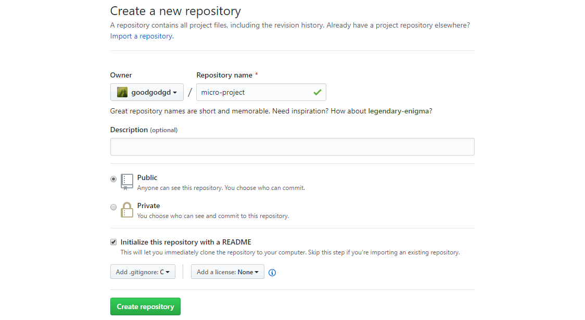
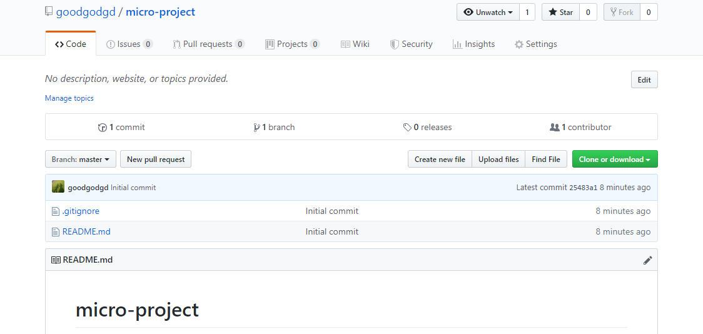

# 1. Git을 이용한 프로젝트 관리

Git을 이용해서 실제 마이크로프로세서 프로젝트를 관리해보자. 이번에는 버전 관리에 필요한 몇가지 명령어들을 더 배운다.


## 1.1 GitHub에서 새 원격 저장소 만들기

GitHub에 접속하여 로그인 후 **New**를 눌러 새 저장소를 만든다. 여기서는 이름을 **micro-project**라고 정했다. `README.md`와 `.gitignore` 파일은 어차피 필요하므로 저장소를 만들때 자동 생성하게 한다. "Initialize this repository with a README"를 체크하고 "Add .gitignore" 에서 "C"를 선택하자.




아래와 같이 기본 파일과 함께 새로운 저장소가 생긴것을 확인한다. 오른쪽에 녹색 "clone or download" 버튼을 누르면 보이는 저장소 주소를 복사한다.




이번에도 저번과 마찬가지로 두 가지 환경에서 작업하는 것을 가정하고 GitHub의 원격 저장소를 두 개의 로컬 저장소로 복사한다. 각자 자신의 개인폴더에서 우클릭 - "Git Bash Here" 를 클릭하여 터미널을 열고 아래 두 명령어를 실행하자.

```
# git clone <원격 저장소 주소> <로컬 저장소 이름1>
$ git clone https://github.com/goodgodgd/micro-project.git micro-prj-home
# git clone <원격 저장소 주소> <로컬 저장소 이름2>
$ git clone https://github.com/goodgodgd/micro-project.git micro-prj-work
```


## 1.2 프로젝트 만들어 Push 하기

CodeVision을 열고 "New - Project" 로 새 프로젝트를 만들자. "Generate, Save and Exit" 할때 새로운 파일들을 로컬 저장소 중 하나인 `micro-prj-home` 에 저장한다. 일단 기본 코드는 다 지우고 아래와 같은 간단한 코드를 작성하여 빌드를 해보자.

```c
#include <mega128.h>
#include <delay.h>

void main(void)
{
    PORTA = 0xff; DDRA = 0xff;
    while(1)
        delay_ms(1);
}
```


이제 여기까지 작업한 상태를 commit으로 만들고자 한다. Commit을 만들기 전에 현재 상태를 `git status`로 확인해보자. 프로젝트를 만들면서 자동으로 생성된 많은 파일들이 빨간색으로 표시될 것이다. 특히 용량이 큰 실행파일이 들어있는 `Debug` 폴더도 Untracked 상태로 표시된다. 

```
$ git status
On branch master
Your branch is up to date with 'origin/master'.

Untracked files:
  (use "git add <file>..." to include in what will be committed)

        Debug/
        micro.atsln
        micro.c
        micro.cci
        micro.cfg
        micro.cof
        micro.cproj
        micro.cwp
        micro.c~
        micro.fct
        micro.prj
        micro.txt
```


Git이 성능이 좋긴하지만 일부러 쓸모없는 파일들을 넣어서 관리할 용량을 키우고 속도를 느리게 할 필요가 없다. 가급적 **Git이 관리하는 파일 수와 용량을 최소화 시켜야** 한다. 이때 사용되는 것이 처음에 만들었던 `.gitignore` 파일이다. 이곳에 등록된 파일들은 말그대로 Git이 무시하게 된다. 프로젝트에 필수 파일만 남기고 나머지는 무시하도록 `.gitignore` 파일을 수정하자. 처음에 만들때 `.gitignore` 파일을 C언어로 설정해서 C언어와 관련된 확장자명들이 잔뜩 있다. 주로 Visual Studio와 관련있는 확장자가 많기 때문에 다 지우고 아래와 같이 다시 쓰자.

```
*.atsln
*~
*.cci
*.cfg
*.cof
*.cproj
*.fct
*.txt
Debug
Release
```


상태를 다시 확인해보면 Untracked 파일이 크게 줄어든 것을 볼 수 있다.

```
$ git status
On branch master
Your branch is up to date with 'origin/master'.

Changes not staged for commit:
  (use "git add <file>..." to update what will be committed)
  (use "git checkout -- <file>..." to discard changes in working directory)

        modified:   .gitignore

Untracked files:
  (use "git add <file>..." to include in what will be committed)

        micro.c
        micro.cwp
        micro.prj
```


이제는 안심하고 파일들을 Stage 해도 된다. 다음 명령어를 통해 원격 저장소까지 코드를 올려보자. 실행 후 GitHub을 확인해보면 추가된 새 파일들을 확인할 수 있을 것이다.

```
$ git add .
$ git commit -m 'create code vision project'
$ git push origin master
```


## 1.3 다른 로컬 저장소에서 작업하기

### git pull로 로컬 저장소 업데이트

이번엔 원격 저장소에 올린 내용을 다른 로컬 저장소에서 받아서 작업을 이어서 하고자한다. 터미널에서 디렉토리 위치를 다른 로컬 저장소인 `micro-prj-work`로 옮긴후 `git pull`을 통해 방금 push한 내용을 받자.

```
# 현재 micro-prj-home 에 있다면
$ cd ..
$ cd micro-prj-work
$ git pull
remote: Enumerating objects: 8, done.
remote: Counting objects: 100% (8/8), done.
remote: Compressing objects: 100% (6/6), done.
remote: Total 6 (delta 0), reused 6 (delta 0), pack-reused 0
Unpacking objects: 100% (6/6), done.
From https://github.com/goodgodgd/micro-project
   25483a1..8bcf948  master     -> origin/master
Updating 25483a1..8bcf948
Fast-forward
 .gitignore |  62 ++------
 micro.c    |   9 ++
 micro.cwp  | 513 +++++++++++++++++++++++++++++++++++++++++++++++++++++++++++++
 micro.prj  | 426 ++++++++++++++++++++++++++++++++++++++++++++++++++
 4 files changed, 958 insertions(+), 52 deletions(-)
 create mode 100644 micro.c
 create mode 100644 micro.cwp
 create mode 100644 micro.prj
```


`git log`를 통해 방금 원격 저장소에 올린 내용을 받았다는 것을 확신할 수 있다. `micro-prj-work`의 프로젝트 파일을 열어서 빌드까지 잘 되는지 확인해보자.

```
$ git log
commit 8bcf948e30c46fdcf6b20ca90825bc70face55b2 (HEAD -> master, origin/master, origin/HEAD)
Author: goodgodgd <goodgodgd@yonsei.ac.kr>
Date:   Fri May 24 02:50:09 2019 +0900

    create code vision project

commit 25483a122130d05a49085abdd53b1926c4172fac
Author: HyukdooChoi <goodgodgd@yonsei.ac.kr>
Date:   Fri May 24 01:58:47 2019 +0900

    Initial commit
```


### 새 파일 등록

새로운 기능을 가진 header 파일을 만들어 사용해보자. 숫자를 세주는 함수를 가진 `micro.h` 라는 파일을 만들고 `micro.c`가 이를 사용하도록 수정하자.  

**micro.h**

```c
int count() {
	static int cnt = 0;
	return cnt++;
}
```

**micro.c**

```c
#include <mega128.h>
#include <delay.h>
#include "micro.h"

void main(void) {
    PORTA = 0xff; DDRA = 0xff;
    while(1) {
        count();
        delay_ms(1);
    }
}
```

상태를 확인해보니 아깐 보이지 않았던 새로운 설정 파일들이 보인다. 이들도 `.gitignore`에 추가한다.

```
$ git status

<생략>

Untracked files:
  (use "git add <file>..." to include in what will be committed)

        micro.cbi
        micro.h
        micro.hci
```

**.gitignore**

```
*.atsln
*~
*.cci
*.cfg
*.cof
*.cproj
*.fct
*.txt
Debug
Release
*.cbi
*.hci
```


현재 상태를 다시 확인하면 `*.cbi, *.hci` 파일이 사라진 것을 볼 수 있다. 여기서 바로 add를 하기전에 무슨 변경 사항이 있었는지 `git diff`로 확인해보자. (빠져 나오는 것은 'q'를 누르면 된다.)

```
index 0d5c07e..f905241 100644
--- a/.gitignore
+++ b/.gitignore
@@ -8,3 +8,5 @@
 *.txt
 Debug
 Release
+*.cbi
+*.hci
\ No newline at end of file
diff --git a/micro.c b/micro.c
index ce301d0..ef94ad5 100644
--- a/micro.c
+++ b/micro.c
@@ -1,9 +1,13 @@
 #include <mega128.h>
 #include <delay.h>
+#include "micro.h"

-void main(void)
-{
+void main(void){
```


현재까지 작업 내용을 commit으로 저장해보자.

```
git add .
git commit -m 'add header file'
```


### 파일 옮기기

`micro-prj-work` 디렉토리에 header 파일이 들어갈 `include` 디렉토리를 만들어주자. header 파일을 `include`로 옮긴뒤 `micro.c`에서도 이를 반영해준다.

```
$ git mv micro.h include
```

**micro.c** 수정

```
#include <mega128.h>
#include <delay.h>
#include "include/micro.h"
<생략>
```

변경 사항을 빌드하여 이상없음을 확인한 뒤 add - commit 한 뒤 log를 확인한다

```
$ git add .
$ git commit -m 'move header to include'
$ git log
commit 6c65a6d6e50a4fd19e62fa079185c8407ede0cd4 (HEAD -> master)
Author: goodgodgd <goodgodgd@yonsei.ac.kr>
Date:   Fri May 24 03:42:06 2019 +0900

    move header to include

commit d0c6973b136a3f8745275075ac9857f41f2f98e2 (HEAD -> master)
Author: goodgodgd <goodgodgd@yonsei.ac.kr>
Date:   Fri May 24 03:26:49 2019 +0900

    add header file
```


### 파일 삭제

작업을 하다보니 아까 만든 header 파일이 필요없게 되었다. header 파일만 지워도 되고 파일이 들어있는 `include` 디렉토리를 지워도 된다. 탐색기에서 직접 지우면 나중에 지운 사실을 다시 stage 해야 아므로 `git rm`을 쓰는것이 좋다.

```
$ git rm -rf include
$ git status
<생략>
Changes to be committed:
  (use "git reset HEAD <file>..." to unstage)

        deleted:    include/micro.h
        
$ git commit -m 'remove header file'
```

그런데 header 파일만 지우면 되는 것이 아니라 `micro.c` 파일에서 header 파일을 사용하는 부분도 정리를 해야한다. 아래와 같이 수정 후 빌드가 잘 되는지 확인해보자.

```c
#include <mega128.h>
#include <delay.h>

void main(void){
    int cnt=0;
    PORTA = 0xff; DDRA = 0xff;
    while(1){
        cnt++;
        PORTA = cnt % 256;
        delay_ms(1);
    }
}
```

원래대로라면 `micro.c`의 수정사항을 저장하기 위해서는 새로운 commit을 만들어야 하지만 왠지 방금 만든 commit에 이 변경 사항까지 넣고 싶다면 다음 명령어를 실행한다.

```
$ git add .
$ git commit --amend -m 'remove header and edit source'
$ git log
commit 2be0f987fb58df0d329703bad26d42c1bbe87065 (HEAD -> master)
Author: goodgodgd <goodgodgd@yonsei.ac.kr>
Date:   Fri May 24 03:45:16 2019 +0900

    remove header and edit source

commit 6c65a6d6e50a4fd19e62fa079185c8407ede0cd4
Author: goodgodgd <goodgodgd@yonsei.ac.kr>
Date:   Fri May 24 03:42:06 2019 +0900

    move header to include
```

아까 만들었던 'remove header file'이란 메시지는 없어지고 새 메시지만 남은 것을 확인할 수 있다.


### 과거 버전 복원

다시 작업을 하다보니 header 파일을 지운건 잘못된 선택이었다. 다시 header 파일이 있는 버전으로 돌아가고 싶다면 다음 명령어를 실행한다. HEAD는 최신 commit을 뜻하고 HEAD~1는 HEAD의 직전 commit을 의미한다. 두 가지 방법이 있는데 `reset --hard`를 쓰면 HEAD 정보를 버리게 되고 `checkout`을 쓰면 HEAD의 위치만 바꾼다. 로그를 보면 과거 commit (HEAD~1)이 현재의 HEAD가 된 것을 볼 수 있다.

```
$ git reset --hard HEAD~1
HEAD is now at 6c65a6d move header to include

$ git log
commit 6c65a6d6e50a4fd19e62fa079185c8407ede0cd4 (HEAD -> master)
Author: goodgodgd <goodgodgd@yonsei.ac.kr>
Date:   Fri May 24 03:42:06 2019 +0900

    move header to include
```


### 작업 결과 올리고 다른 저장소(home)에서 받기

작업 결과를 원격 저장소에 올린다.

```
$ git push origin master
```

다시 `micro-prj-home`에서 작업을 재개하려면 터미널에서 디렉토리를 옮긴 뒤 pull 받는다.

```
$ cd ../micro-prj-home
# git pull이 실패하면 reset 먼저 한다.
# git reset --hard HEAD
$ git pull
```

`micro-prj-home`의 소스를 보면 최신 작업 내용인 것을 확인할 수 있다. 앞으로도 이런식으로 작업을 이어나가면 된다.

