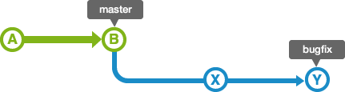

## 1. What is Branch?

지금까지 배운 Git은 주로 혼자 저장소를 관리하고 개발하는 방법이었고 여럿이서 공동으로 프로젝트를 진행한다면 어떻게 저장소를 관리할 수 있을까? 지금까지 한 것 처럼 여러 사람이 master 브랜치에서만 작업을 한다면 여러 문제가 발생할 것이다. 일단 commit 이력에서 여러 가지 작업이 잡다하게 섞일 것이고 누군가 작업 완료되지 않은 상태의 commit을 올린다면 남이 받았을 때 에러가 날 수도 있고 많은 사람들이 너무 자주 원격 저장소를 pull 해줘야 최신 상태를 유지할 수 있을 것이다.  

그래서 대부분의 버전 관리 시스템에는 **브랜치(branch)** 기능이 있다. 메인 브랜치의 특정 시점의 버전에서 분기(branching)하여 새로운 기능을 넣거나 이슈를 해결하는 등의 하나의 **작업 단위**를 진행하며 자유롭게 commit할 수 있는 **독립적인 작업공간**이다. 작업 단위가 어느정도 완성되었을 때 다른 사람들의 동의를 얻어 그동한 구현한 변경사항을 메인 브랜치와 합치고 다시 거기서부터 새로운 브랜치를 분기하여 새로운 작업을 시작하는 것이 일반적인 Git을 활용한 작업 흐름(workflow)이다. 여러 작업자들은 브랜치를 활용해서 동시에 여러 작업을 독립적으로 수행한 후 완성된 작업 단위의 결과를 보고 이를 메인 브랜치에 반영할지를 결정할 수 있다. 다음 그림은 브랜치를 활용한 작업 흐름이다. ([출처](<https://backlog.com/git-tutorial/kr/stepup/stepup1_1.html>)) 여러 사람의 작업 흐름을 브랜치를 통해 한눈에 알 수 있다.


## 2. Branch and Merge

지난번 GitHub에 만들었던 `micro-project`를 다시 받고 디렉토리로 이동해보자. 자신의 프로젝트를 받아도 되고 아래 주소를 그대로 써도 된다.

```
$ git clone https://github.com/goodgodgd/micro-project.git
$ cd micro-project
# 사용자 등록
$ git config user.name "your name"
$ git config user.email "your email"
```

시작하기 전에 `micro.prj` 파일을 Git에서 제외시켜 버리자. 코드와 상관없이 빌드 할 때마다 내용이 변해버려서 버전관리에 적합하지 않은 파일이다. 제외 후에는 Untracked로 표시되므로 이를 무시하기 위해 `.gitignore` 파일에도 `*.prj`를 추가해주자.

```
$ git rm --cached micro.prj
```

현재 "micro.c"의 상태는 다음과 같다. PORTA에 연결된 LED를 켜서 프로그램이 시작했음을 확인한다.

```c
#include <mega128.h>
#include <delay.h>
void main(void) {
    PORTA = 0xff; DDRA = 0xff;
    while(1) {
        delay_ms(1);
    }
}
```


### 2.1 Create Branch

이제 LED를 깜빡이는 **"작업 단위"**를 구현할 `flicker-led`라는 브랜치를 만들어보자. 

```
# 브랜치 만들기
$ git branch flicker-led
# 현재 브랜치 이동
$ git checkout flicker-led
# 브랜치 목록 확인
$ git branch
```

명령어를 실행해도 워킹 트리(working tree)에는 아무것도 변한 것이 없다. 아래 그림을 보면 브랜치를 만들면 같은 commit을 가리키는 브랜치가 추가되었을 뿐이다. 그리고 HEAD의 위치가 새로운 브랜치를 가리키게 된다. HEAD는 현재 사용중인 브랜치의 최신 커밋을 가리키는 포인터다.

  


### 2.2 Add Features on Topic Branch

프로젝트에 새로운 기능을 추가하거나 특정 이슈를 해결하는 브랜치를 토픽 브랜치(Topic branch) 혹은 피쳐 브랜치(Feature branch)라고 부른다. 토픽 브랜치를 새로 만들어서 1초 단위로 PORTB에 연결된 LED들을 깜빡이게 해보자.

```c
#include <mega128.h>
#include <delay.h>
void main(void) {
    PORTB = 0xff; DDRB = 0xff;
    while(1) {
        PORTB ^= 0xff;
        delay_ms(1000);
    }
}
```

여기까지 작업한 내용을 새로운 브랜치에서 commit 해보자.

```
$ git add .
$ git commit -m 'flikering PORTB'
```

이 상태에서 실행을 해보니 PORTB에 연결된 LED들이 깜빡이긴 하는데 모두가 한꺼번에 켜지고 꺼지는 것보다는 반씩 켜지고 꺼지는 것이 좋을것 같고 시간 간격도 더 짧으면 좋겠다. PORTB의 초기 값과 delay 시간을 바꿔보자.

```c
#include <mega128.h>
#include <delay.h>
void main(void) {
    PORTB = 0xf0; DDRB = 0xff;
    while(1) {
        PORTB ^= 0xff;
        delay_ms(500);
    }
}
```

수정한 내용을 다시 commit 한다.

```
$ git add .
$ git commit -m 'change PORTB init status and delay time'
```


### 2.3 Quick Change on Hotfix Branch

다시 `master` 브랜치로 돌아가서 내 안의 다른 인격을 꺼내서 다른 사람이 됐다고 생각해보자. 아까 작업하던 사람은 A였고 지금은 B가 작업을 하고 있다. `master` 브랜치로 돌아가는 일은 `checkout` verb를 이용해 브랜치를 이동할 수 있다.

```
$ git checkout master
```

워킹 트리의 코드도 원래대로 돌아간 것을 볼 수 있다. B는 `master` 코드로 실험을 하다가 PORTA에서 문제를 발견하여 PORTA 대신 PORTC를 켜기로 했다. 이러한 변경사항을 `hotfix-change-port` 라는 브랜치를 만들어 작업하기로 한다. 이번에는 `checkout -b` 옵션을 통해 브랜치를 만드는 동시에 그곳으로 이동한다.

```
$ git checkout -b hotfix-change-port
$ git branch
```

이후 PORTA를 PORTC로 수정한 후 commit 한다.

```
$ git add .
$ git commit -m 'change porta to portc'
```

현재 상태의 `git log` 내용이다.

```
commit 3d520a23260a2591405530d81b5442b4c1adb0c0 (HEAD -> hotfix-change-port)
Author: goodgodgd <goodgodgd@yonsei.ac.kr>
Date:   Thu May 30 22:47:44 2019 +0900

    change porta to portc

commit cccf2ea7e741456f06920b41b6af76f5d10dcdc4 (origin/master, origin/HEAD, master)
Author: goodgodgd <goodgodgd@yonsei.ac.kr>
Date:   Thu May 30 22:25:06 2019 +0900

    ready for branch tutorial
```

여기서 알수 있는 것은 현재 HEAD가 `hotfix-change-port`라는 브랜치를 향하고 있고 이전 commit이 원격 저장소의 HEAD이자 (origin/HEAD) 원격 및 로컬의 `master` 브랜치라는 것을 알 수 있다. 


### 2.4 Merge Hotfix Branch

이제 `master` 브랜치로 이동 후 `hotfix-change-port` 브랜치를 `master`에 합쳐보자.

```
# 브랜치 이동 후 코드가 복원되는지 확인
$ git checkout master
# 브랜치 병합
$ git merge hotfix-change-port
Updating cccf2ea..3d520a2
Fast-forward
 micro.c | 2 +-
 1 file changed, 1 insertion(+), 1 deletion(-)
```

메시지에 나온대로 `hotfix-change-port` 브랜치를 만든 후 `master`에 추가적인 commit이 없었기 때문에 다음 그림과 같은 fast-forward merge가 실행되었다. Fast-forwad란 병합을 시도하는 브랜치(master)의 포인터를 병합 당하는 브랜치(hotfix-)로 옮기는 것이다.




브랜치 병합 후에는 병합된 브랜치를 삭제해도 된다. 삭제는 `branch -d` 옵션을 주면 된다.

```
# 현재 브랜치 목록 확인
$ git branch
# 브랜치 삭제
$ git branch -d hotfix-change-port
# 브랜치 목록 다시 확인
$ git branch
```


### 2.5 Merge Topic Branch

이제 다시 A가 되어 토픽 브랜치로 돌아가보자. A도 아까 작업하던 것이 완료되어 `master`로 브랜치 내용을 합치고자 한다. `master`는 `flicker-led` 가 분기한 이후 `hotfix-`의 commit을 병합하였다. 이 상태에서는 Fast-forward 방식으로는 합칠 수 없고 3-way merge 방식으로 두 개의 브랜치를 합쳐야 한다. 3-way merge는 공통 부모로부터 두 브랜치의 변경 사항을 모두 반영한 새로운 commit을 만드는 것이다. 그림으로 표현하면 다음과 같다.


현재 `master` 브랜치에 있다면 바로 `flicker-led` 브랜치를 병합해보자.

```
$ git merge fliker-led
Auto-merging micro.c
CONFLICT (content): Merge conflict in micro.c
Automatic merge failed; fix conflicts and then commit the result.

HYUKDOO.CHOI@LAPTOP-MHDHK8AC MINGW64 /d/Work/micro-project (master|MERGING)
```

뭔가 메시지가 심상치 않다. 그리고 경로 오른쪽에 나오던 브랜치 이름에 `| MERGING` 이라는 단어가 붙었다. 병합 과정에서 conflict가 발생했으니 빨리 해결하고 add - commit을 하라는 뜻이다. `micro.c` 파일을 열어보니 상태가 이렇다.

```c
#include <mega128.h>
#include <delay.h>
void main(void) {
<<<<<<< HEAD
    PORTC = 0xff; DDRC = 0xff;
=======
    PORTB = 0xf0; DDRB = 0xff;
>>>>>>> fliker-led
    while(1) {
        PORTB ^= 0xff;
        delay_ms(500);
    }
}
```

master에서는 원래 PORTA 였는데 `hotfix-` 브랜치에서는 포트를 C로 수정해서 이를 병합했다. `flicker-led` 브랜치에서는 같은 라인을 PORTB로 수정했기 때문에 어느쪽에 맞춰 병합을 해야할지 컴퓨터로서는 도저히 알 수 없는 상태가 된다. 그래서 병합 시 **CONFLICT** 라는 무서운 메시지를 띄우고 코드에 저런 무지막지한 표시를 해서 개발자가 갈등 상태를 빨리 해결해주길 요청한다. 개발자는 여기서 위쪽의 HEAD (병합 받는 측)의 코드나 아래쪽의 flicker-led (들어오는 측)의 코드 중 하나를 선택하거나 둘 다 지우고 새로운 코드를 넣을 수도 있다. 어쨌든 `<<<<<<<, =======, >>>>>>>` 표시는 없애야한다. 여기서는 `flicker-led`의 코드를 선택해 다음과 같은 상태를 만든다.

```c
#include <mega128.h>
#include <delay.h>
void main(void) {
    PORTB = 0xf0; DDRB = 0xff;
    while(1) {
        PORTB ^= 0xff;
        delay_ms(500);
    }
}
```

Conflict가 해소 되었다면 새로운 merge commit을 만들어주자. 만약 conflict가 없었다면 자동으로 merge commit이 생긴다.

```
$ git add .
$ git commit -m 'fliker-led'
[master 81bc722] merge flicker-led

HYUKDOO.CHOI@LAPTOP-MHDHK8AC MINGW64 /d/Work/micro-project (master)
```

이제 `master` 옆에 `MERGING` 이라는 표시가 사라졌다. 이제 `git log --graph` 명령어를 통해 그 동안의 로그를 확인해보자. `master` 브랜치와 `flicker-led` 브랜치가 합쳐진 것이 보인다. 현재 `HEAD, master, flicker-led`의 위치도 표시가 된다. `hotfix-change-port` 브랜치는 아까 삭제했기 때문에 보이지 않는다.


### 2.6 Why Use Branch?

여기서는 이해하기 쉽게 두 사람이 작업한 결과를 합치는 상황을 가정했지만 실제로는 누구냐가 중요한 것이 아니라 **작업 단위로 브랜치를 만들어야 한다.** 브랜치를 만들면 동시에 여러 작업을 독립적으로 진행할 수 있기 때문에  버전 관리가 쉬워진다. 그래서 혼자서 프로젝트를 관리할 때도 브랜치를 사용하는 것이 좋다. 다음과 같은 상황을 생각해보자.

- (master) commit3: LCD 글자 표시 기능 추가
- (master) commit2: FND 표시 기능 추가
- (master) commit1: LED 켜는 기능 추가

`master`에 3개 작업을 그냥 연결된 commit들로 만들었는데 어떤 이유로 commit2의 기능은 빼고 싶어졌다. 이미 이렇게 commit들이 앞뒤로 연결된 상태에서는 중간 commit만 간편하게 제거할 방법은 없다. 하지만 저들이 `master`의 commit이 아니라 각각 다른 브랜치의 commit 이라면 어떨까?

- (show-lcd) commit3: LCD 글자 표시 기능 추가
- (show-fnd) commit2: FND 표시 기능 추가
- (turnon-led) commit1: LED 켜는 기능 추가

이때는 **원하는 브랜치만 선택해서 병합**하면 된다. (병합은 `git reset --hard HEAD~1`로 취소할 수도 있다.) 이것이 브랜치를 써야하는 이유다. 메인 브랜치(master)가 아닌 다른 브랜치에서 개발을 하면 완성된 한 단위의 작업 결과를 보고 이것을 메인 브랜치에 반영할지를 선택할 수 있다.


