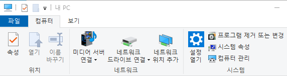
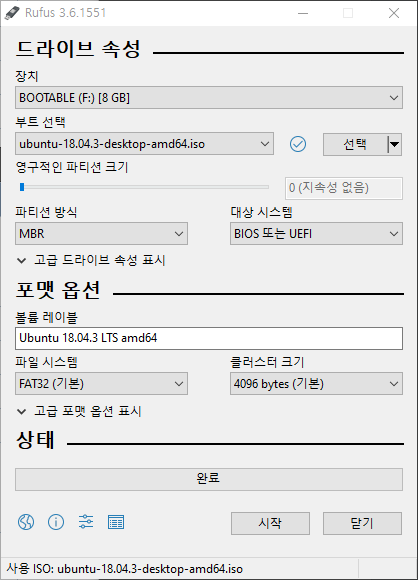
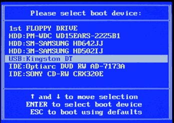
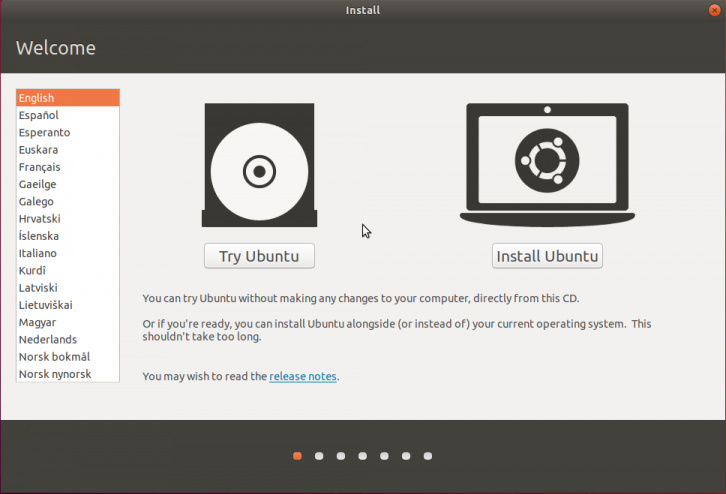
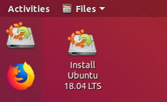
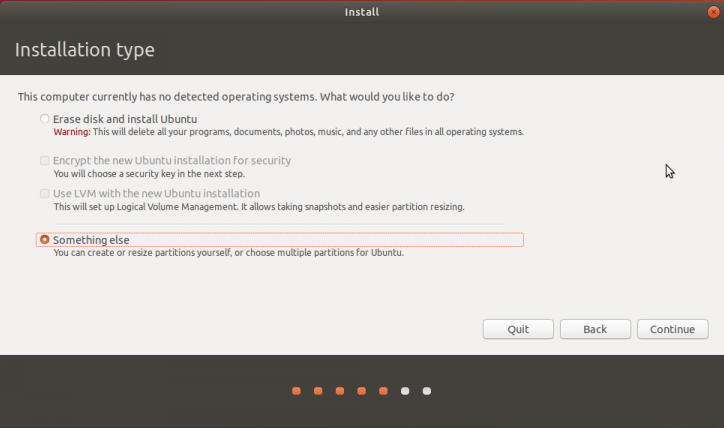
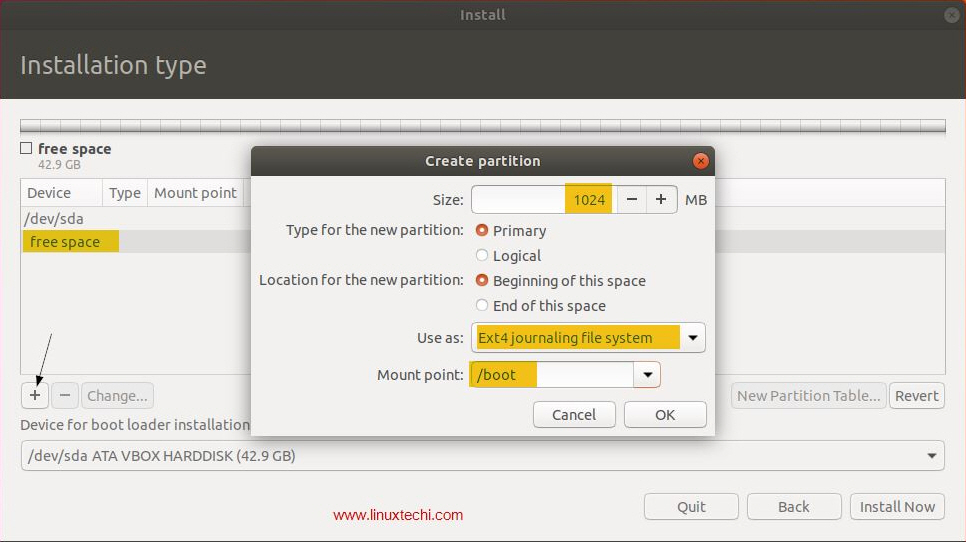
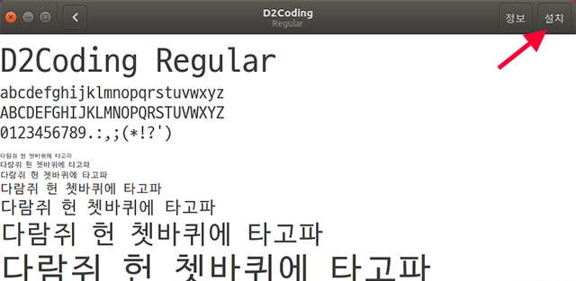

# 1. Ubuntu 18.04 LTS 설치

우분투는 리눅스 배포판 중 가장 인기있는 배포판이고 이용자 커뮤니티도 가장 크다. 서버 운영이나 개발을 하는 경우를 제외하고는 대부분 우분투를 쓰기 때문에 대부분의 리눅스 소프트웨어 설치 가이드도 우분투를 기준으로 설명한다.  여기서는 리눅스의 최신 안정 버전인 Ubuntu 18.04를 설치하는 방법을 설명한다.


## 1.1. 파티션 준비

윈도우 옆에 우분투를 병행 설치하기 위해서는 드라이브에 비어있는 파티션 공간이 필요하다. 보통 윈도우가 설치된 PC는 드라이브가 파티션으로 꽉 차있으므로 특정 파티션을 줄여서 빈 공간을 만들어야 한다.  

"내 PC" - "컴퓨터 관리" - "디스크 관리"로 들어간다.




디스크 관리에서 보이는 파티션 중 여유있는 것을 골라 우클릭 후 "볼륨 축소"를 선택한다.  

대략 50GB (~=52000) 정도를 축소하여 빈 공간을 만든다.  


## 1.2. Bootable USB 준비

어느 운영체제든 설치를 하려면 설치 USB가 필요하다.   

먼저 **우분투 이미지를 다운로드** 한다.  

이곳은 항상 우분투 최신 버전을 제공한다.   

<https://ubuntu.com/download/desktop>

나중에 Ubuntu 18.04가 구버전이 되더라도 이곳에서 받을 수 있다.  

<http://releases.ubuntu.com/bionic/>


**Rufus로 우분투 설치 USB를 만든다.** Rufus는 현재 가장 안정적인 bootable usb를 만들어주는 툴이다. 이곳에서 다운 받을 수 있다.  

<https://rufus.ie/>

Rufus는 설치없이 바로 실행가능하다. USB 드라이브와 설치 이미지를 선택하고 **시작**을 누르고 몇 가지 질문에 확인만 누르면 끝이다.




## 1.3. USB로 부팅

PC를 부팅할 때 나오는 첫 화면에 ~~순간적으로 지나가지만~~ **Booting Priority**를 정할 수 있는 키가 보인다. `Fn`키나 `Del` 등의 키가 쓰이는데 메인보드마다 다르므로 첫 화면을 잘 봐야 한다. 어쨌든 그 키를 눌러서 부팅 드라이브로 우분투가 들어있는 USB를 선택한다. (대략 아래와 같은 화면이다.)




## 1.4 설치 과정

들어가면 아래와 같은 화면이 뜨는데 덥석! `Install Ubuntu`를 누르지 말고 `Try Ubuntu`로 들어간다.




비어있는 드라이브에 우분투를 설치한다면 `Install Ubuntu`로 가도 되지만 경우에 따라 파티션 설정 메뉴가 뜨지 않는 경우가 있다. 일단 `Try Ubuntu`로 들어가본다. 여기서는 우분투를 설치하지 않고 **임시**로 우분투를 써볼 수 있다. 우분투를 마음껏 쓸 수 있지만 다시 부팅하면 상태가 리셋이 되므로 평소에 사용하기는 어렵다. 여기서 필요한 것은 아래 보이는 `Install Ubuntu 18.04 LTS`란 메뉴 뿐이다. 실행하면 우분투 설치 과정이 시작된다.




설정 선택에서 대부분 기본설정으로 넘어간다. **언어도 한글을 선택하지 않고 English 그대로 둔다.** 한글을 선택하면 이후 중요한 디렉토리 경로에 한글이 들어가는데 코딩하다 이것 때문에 오류가 생길 수도 있다. 또한 시스템 에러 메시지가 한글로 뜨게 되면 이걸 구글에 검색해도 해결 방법이 잘 안나온다. 꼭 영어로 설치하자.  

넘어가다 보면 "Installation Type" 설정이 보인다. 새 파티션을 만들어야 하므로 **Something else**를 선택한다.




빈 공간(free space)를 선택하고 아래서 "+" 버튼을 누르면 파티션을 생성할 수 있다. 용량은 기본적으로 빈 공간 크기만큼 잡히니 놔두고 두 가지만 설정하면 된다.



- Use as: Ext4 journaling file system
- Mount point: **/**  (그림처럼 /boot 가 아니다)


"Device for boot loader installation"에 우분투를 설치할 하드 드라이브를 선택 후 "Install Now"를 누른다. 이후 지역 설정, 사용자 계정 설정을 하면 진짜 설치가 시작된다.  


### 사용자 계정 설정

수업의 과정의 일관성을 위하여 사용자 계정을 통일한다. 계정 이름과 비밀번호를 `robot`이라고만 적는다. 컴퓨터 이름은 네트워크 상에서 식별자로 사용되기 때문에 뒤에 짧게 임의의 문자를 덧붙인다. (예: robot-b7) 이름을 짧게 지어야 하는 이유는 이름이 터미널 명령줄 앞에 항상 떠있기 때문에 이름이 길면 명령문을 쓸 공간이 부족해진다.

- Your name: robot
- Your computer's name: robot-xx
- Pick a username: robot
- Choose a password: robot


# 2. 우분투 기본 설정


## 2.1 우분투 업데이트 및 소프트웨어 설치

먼저 우분투의 저장소 정보를 업데이트하고 현재 설치된 소프트웨어들을 업데이트한다. 명령어의 의미는 차차 알아보기로 하자.

```
sudo apt update && sudo apt upgrade -y
```

개발에 필요한 기본적인 소프트웨어들을 설치한다.

```
sudo apt install build-essential git cmake python-dev python-pip python3-dev python3-pip
snap install pycharm-community --classic
```


## 2.2 한글 설치 (option)

영어 버전을 설치했다면 아무리 한/영키를 눌러도 한글이 써지지 않는다. (더 무시무시한 경우는 한글 버전을 설치해서 영어가 써지지 않는 경우다.) 한글을 입력하려면 한글 입력기를 설치해야 한다. 한글 입력기는 여러 종류가 있는데 그 중에 fcitx (fㅘ이틱스 라고 읽는다)가 가장 쓸만하다. 설치 및 설정 방법은 아래 블로그에 자세히 나타나있다.

https://m.blog.naver.com/opusk/220986268503


## 2.3 코딩용 폰트 설치 (option)

무릇 코딩 좀 하는 사람은 폰트에도 신경 쓰기 마련이다. 대표적으로 o(알파벳)과 0(숫자), l(알파벳)과 1(숫자)이 헷갈리므로 이런 것들이 명확하게 구분되고 글자의 크기도 일정하게 맞춰서 코드가 가지런하게 보이도록 만든 코딩 전용 폰트들이 있다.  

... 문제는 대부분 이런 폰트들이 영어 전용 폰트라는 것인데 한글을 쓰면 다른 한글 폰트로 써진다. 같이 쓰면 영어와 한글이 줄간격이 달라서 한글이 들어간 줄은 위아래로 더 넓게 차지해서 한글 주석을 쓰고 나면 코드 줄이 들쭉날쭉해진다.  

다행스럽게도 *위대하신 네이버님*이 한글이 포함된 코딩 폰트를 만들어주셨다. 이름하여 **D2Coding** 폰트다. 아래 링크에서 다운로드 받을 수 있다. 

<https://github.com/naver/d2codingfont/releases>

`~/Downloads` 폴더에서 압축을 풀고 `D2Coding-Ver xxx/D2CodingAll` 폴더로 들어가 `*.ttf` 파일을 더블클릭하면 폰트 샘플이 보이고 "Install"을 누르면 설치된다. 설치된 폰트는 재부팅이나 재로그인을 하면 쓸 수 있다.



