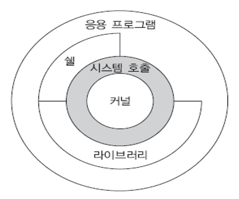
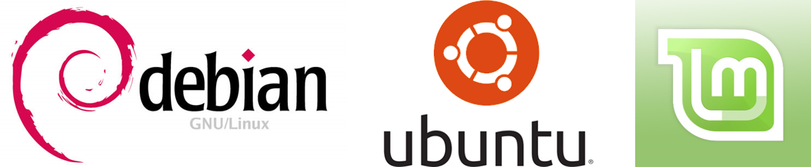
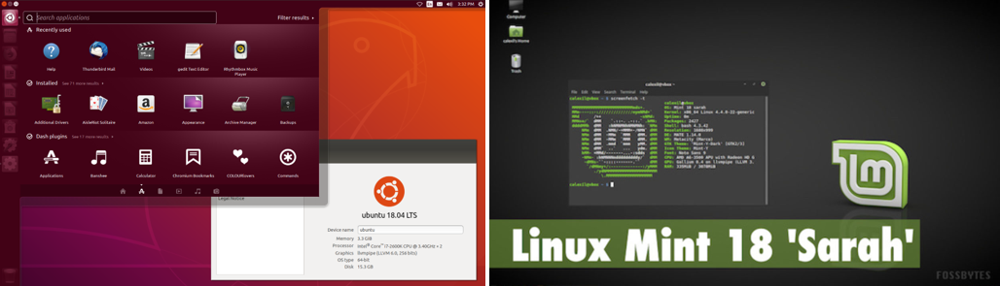
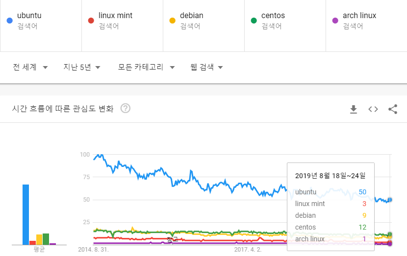

# 1. Unix/Linux 역사

## 1.1 유닉스(Unix) 역사

1960년대 중반 MIT, AT&T의 벨 연구소, General Electric 등은 새로운 컴퓨터 GE645와 MULTICS 라는 새로운 운영체제를 개발을 시작했다. 멀틱스(MULTICS) 프로젝트의 목적은 끊이지 않고 돌아갈 수 있는 다중 사용자, 다중 프로세서, 다중 프로세스 기반의 시스템을 만드는 것이었다. (강력한 보안기능은 덤) 하지만 시스템이 너무 복잡해져서 이 프로젝트는 결국 실패하게 된다.  

1969년 벨 연구소의 켄 톰슨(Ken Thompson)은 멀틱스 개발에 참여하고 있었는데 사무실에 안쓰는 PDP-7이라는 미니컴퓨터(그때 당시의 거대했던 컴퓨터에 비해..)를 쓰기 위해 어셈블리어로 간단한 운영체제를 직접 구현해보게된다. 이에 흥미를 가진 데니스 리치(Dennis Ritchie), Rudd Canaday 등과 함께 멀틱스의 주요 개념들을 가져오면서 단순화 시킨 운영체제인 유닉스(Unix)를 만들게된다.  

1970년대 초반 유닉스를 PDP의 최신 버전인 PDP-11/20에서 작동가능하게 업데이트를 하며 점점 기능을 추가해 나가며 사용자가 늘어나게 된다.  

1973년 데니스 리치가 여러 종류의 컴퓨터에서 사용할 수 있는 C언어를 개발하고 유닉스를 C언어로 다시 쓰게 된다. 기존엔 어셈블리어로 되어있어서 컴퓨터마다 모든 프로그램을 다시 작성해야 했지만 C언어로는 모든 컴퓨터에서 하나의 코드로 작동할 수 있게 되었다. (바로 이식 가능했던 건 아니고 PDP외 다른 컴퓨터에 이식된건 몇 년 후의 일이다.)

1970년대 말에는 여러 대학에서 사용되는데 UC Berkeley의 빌 조이(Bill Joy)와 척 핼리(Chuck Haley)라는 학생들이 유닉스 코드에 수정을 가해서 멀티 태스킹이라던지 네트워크 기능이 추가되었다. 이로부터 발전한 시스템이 BSD (Berkeley Software Distribution) 유닉스가 된다. AT&T에서 개발한 유닉스는 System III, IV, V 등으로 발전하여 업계 표준으로 자리잡지만 BSD도 꾸준히 개발되며 다른 유닉스 배포판에 큰 영향을 미치게 된다. 

1980년대에는 업계 표준으로 자리잡으며 다양한 회사에서 고유의 상업용 유닉스를 개발하며 경쟁하고 합쳐지고 사라지는 등 다양하게 발전하지만 인터페이스가 각각 달라 표준화에 대한 요구가 높아지고 1988년 IEEE에서 유닉스 시스템 표준 API 명세인 POSIX를 발표하게 된다.

## 1.2 리눅스(Linux) 역사

1980년대 리처드 스톨만(Richard Stallman)은 유닉스의 상업화에 반대하여 자유 소프트웨어 재단(Free Software Foundation)을 세우고 유닉스의 무료 버전을 만들기 위해 GNU (GNU is Not Unix) 프로젝트를 시작했다. gcc (C 컴파일러), emacs (에디터) 등 유용한 도구들을 개발했으나 결정적으로 하드웨어를 다루는 커널을 개발하는데 어려움을 겪고 있었다.

한편, 1991년 헬싱키 대학의 21살의 대학생 리누스 토발즈(Linus Tovalds)는 유닉스와 호환되는 커널을 개발했는데 이것이 리눅스의 시초다. 1991년 8월 25일 토발즈는 미닉스(minix) 사용자 게시판에 이런 글을 올렸다.

> Hello everybody out there using minix -
>
> I'm doing a (free) operating system (just a hobby, won't be big and professional like gnu) for 386(486) AT clones. This has been brewing since april, and is starting to get ready. I'd like any feedback on things people like/dislike in minix, as my OS resembles it somewhat (same physical layout of the file-system (due to practical reasons) among other things).
>
> I've currently ported [bash(1.08)](https://en.wikipedia.org/wiki/Bash_(Unix_shell)) and gcc(1.40), and things seem to work. This implies that I'll get something practical within a few months, and I'd like to know what features most people would want. Any suggestions are welcome, but I won't promise I'll implement them :-)
>
> Linus (torvalds@kruuna.helsinki.fi)
>
> PS. Yes - it's free of any minix code, and it has a multi-threaded fs. It is NOT portable (uses 386 task switching etc), and it probably never will support anything other than AT-harddisks, as that's all I have :-(.
>
> — Linus Torvalds

처음엔 자신이 사용하던 컴퓨터에서만 작동가능했다. 그리고 커널만으로는 할 수 있는게 별로 없기 때문에 토발즈는 GNU 소프트웨어가 필요했고 GNU는 커널이 필요했기 때문에 두 프로젝트는 자연스럽게 합쳐진다. 리눅스는 공식적으로 GNU/Linux라고 부르는게 맞다. GNU 소프트웨어들은 곧 리눅스 커널에서 완전히 작동하게 되었고 점점 지원가능한 하드웨어가 많아지고 그에 따라 사용자/개발자가 늘어나 오늘날까지 발전하게 된다.

**출처**

- <https://en.wikipedia.org/wiki/History_of_Unix>
- <https://en.wikipedia.org/wiki/History_of_Linux>
- <http://coffeenix.net/doc/misc/unix-history.html>
- <http://wiki.kldp.org/HOWTO/html/Secure-Programs-HOWTO/history.html>
- <https://rakuraku.tistory.com/107>
- <https://12bme.tistory.com/220>

# 2. 커널(kernel)과 쉘(shell)

운영체제(Operating System, OS)란 컴퓨터 하드웨어 자원을 관리하고 소프트웨어를 실행할 수 있는 환경을 말한다. 유닉스/리눅스에서 이런 역할을 하는 소프트웨어를 **커널(kernel)**이라고 한다. 엄밀히 말해 커널 자체가 유닉스/리눅스(=운영체제)라고 할 수 있으며 커널 외의 다른 소프트웨어들을 응용 프로그램이라고 볼 수 있다.  

아래 그림처럼 커널은 시스템의 핵심이다. 커널의 주요 기능은 다음과 같다.

- 프로세스 관리(Process management):여러 프로그램이 실행될 수 있도록 프로세스들을 CPU 스케줄링하여 동시에 수행되도록 한다. 
- 파일 관리(File management): 디스크와 같은 저장장치에 파일 시스템을 구성하여 파일을 관리한다.
- 메모리 관리(Memory management): 메인 메모리가 효과적으로 사용될 수 있도록 관리한다. 
- 통신 관리(Communication management): 네트워크를 통해 정보를 주고받을 수 있도록 관리한다. 
- 주변장치 관리(Device management): 모니터, 키보드, 마우스와 같은 장치를 사용할 수 있도록 관리한다.

사용자가 리눅스를 다루는 방법은 크게 두 가지 방법이 있다. 하나는 쉘(shell)을 통해 CLI (Command Line Interface)로 직접 시스템을 조작하는 방법과 다른 하나는 프로그램을 통해 시스템을 조작하는 방법이다. 요즘은 GUI도 많이 쓰지만 그건 어디까지나 GUI 입력을 CLI 명령으로 바꿔서 실행해주는 환경일 뿐이다. 두 방법 모두 시스템 호출(System Call)을 통해 커널의 기능을 사용한다. 시스템 호출(System call)은 커널을 제어할 수 있는 프로그래밍 인터페이스다. 사용자는 프로그래밍을 할 때 시스템 호출을 통해 커널의 기능(e. g. 메모리 할당, 파일 읽기/쓰기 등)을 사용할 수 있다.  

사용자가 커널을 직접 사용하는건 불안정하고 비효율적이기 때문에 CLI로 명령을 입력할 때는 쉘(shell)을 쓰고 프로그램으로 명령을 줄 때는 라이브러리를 주로 사용한다. 쉘은 유닉스 계열 시스템을 다루는 가장 기본적인 방법이기 때문에 켄 톰슨이 유닉스를 처음만들때부터 있었으며 리누스 토발즈가 리눅스에 처음 포팅한 소프트웨어가 gcc와 bash였다.  

쉘의 종류도 여러가지가 있고 쓰는 방법도 약간씩 다른데 리눅스에서 기본적으로 쓰는 쉘은 Bash(Bourne Again Shell)다. 우분투에는 기본적으로 Dash(Almquist shell, `/bin/sh`)와 Bash(`/bin/bash`)를 제공한다. 쉘을 명시적으로 지정해서 실행하려면 `ls` 같은 명령어를 `sh -c "ls"`처럼 실행할 수도 있다.

# 3. 배포판 (Distribution)

좁은 의미의 리눅스란 오지 커널만을 말하는 것이다. 그러나 우리는 리눅스를 설치할 때 리눅스 커널 소스를 받지 않고 우분투와 같은 **배포판**을 받아서 설치한다. 리눅스 배포판이란 기본적인 리눅스 커널에 데스크톱 환경(GUI 환경), 여러가지 유틸리티와 응용 프로그램을 묶어서 배포하는 운영체제를 말한다.  

우리가 설치한 우분투는 리눅스 생태계의 수백가지(!) 배포판 중 하나일 뿐이다. [이곳](https://ko.wikipedia.org/wiki/리눅스_배포판)에 가보면 리눅스 배포판의 다양성을 그림으로 볼 수 있다. 수업에서는 일단 우분투를 깔았지만 원래는 용도에 따라 배포판의 선택부터 고민을 해야한다. 리눅스 배포판은 크게 세 개의 계열이 있다.

## 3.1. 데비안(Debian) 계열

데비안(Debian)이란 이름은 최초의 창시자 이안 머독(**Ian** Murdock)과 그의 당시 여자친구인 데브라(**Deb**ra)에서 따와 Debian으로 지었다고 한다. 데비안은 일정한 주체에서 개발하는 것이 아니라 커뮤니티에서 개발하는 거라 개발 주기가 늦고 사후지원이 안되서 데비안 자체는 사용자가 많은 편은 아니지만 데비안으로부터 수많은 배포판들이 파생되었고 가장 인기 있는 배포판들 중에는 데비안 계열이 많다.  

데비안 계열의 공통적인 특징이자 데비안의 자랑은 **DEP**과 **APT**로 대표되는 패키지 관리 시스템이다. 데비안은 **deb**이란 패키지 안에 의존성 정보와 미리 컴파일된 바이너리(binary, 라이브러리와 실행 파일 등)와 소스코드 등을  외부 저장소(repository)에서 관리하고 있다. 사용자는 인터넷만 연결되어 있으면 **apt** 라는 명령어를 통해 데비안에서 관리하는 저장소의 패키지를 쉽게 설치할 수 있다.

#### 파생 배포판

리눅스 배포판 중 단연코 가장 인기있는 **우분투(Ubuntu)**도 데비안 계열이다. 우분투는 쉬운 설치법과 사용자 친화적인 인터페이스로 초기에 리눅스 입문자용 리눅스로 유명했으나 ~~그 입문자들이 말뚝을 박고 안나가는 바람에~~ 현재는 개인용 PC에 가장 범용적으로 사용되는 리눅스 배포판이 됐다. 데비안과의 가장 큰 차이는 일정한 개발 주체가 있다는 것이다. 우분투는 영국의 **캐노니컬**이라는 회사와 **우분투 재단**이 개발, 배포, 유지보수를 맡고 있다. 그렇기 때문에 데비안에 비해 업데이트 주기도 빠르고 사후지원도 잘 되는 편이다. 

우분투의 인기에 따라 우분투에 기반한 변형판, 파생 배포판도 많다. 변형판은 주로 **데스크톱 환경**만 바꾼것들이 많다. 리눅스에서 데스크톱 환경은 커널 위에서 돌아가는 어플리케이션일 뿐이기 때문에 언제든 다른걸로 바꿀 수 있다. 우분투 18.04의 경우 **GNOME3** 를 기본 데스크톱 환경으로 쓰고 있다. KDE를 쓰는 Kubuntu, LXQt를 쓰는 Lubuntu, MATE를 쓰는 Ubuntu MATE 등이 있다. 다른 데스크톱 환경을 쓰는 이유는 취향 문제도 있고 기본 우분투 환경이 SBC 등에서 쓰기는 무겁기 때문에 저사양 PC에서는 Lubuntu나 Ubuntu MATE를 추천한다.

우분투에서 파생된 배포판 중 하나가 우분투 만큼이나 유명한 **리눅스 민트(Linux Mint)**다. 리눅스 민트는 우아함 (elegance)을 강조하며 윈도우와 MacOS를 섞은 듯한 데스크톱 환경과 편리성, 전용 소프트웨어와 드라이버, 높은 완성도를 자랑한다. 우분투와 사용법도 거의 비슷해서 뭔가 설정을 바꾸고 싶다면 사용자가 많은 우분투 설정 방법을 검색해서 그대로 적용해도 된다.

## 3.2. 레드햇(Red Hat) 계열

레드햇(Red Hat)은 미국의 오픈소스 기업으로 RHEL(Red Hat Enterprise Linux)이라는 리눅스 배포판을 개발, 판매한다. 주요 특징으로는 데비안의 **apt**같은 패키지 관리자인 **yum (Yellow dog Updater, Modified)**을 제공하여 쉽게 패키지를 설치할 수 있다. 레드햇과 관련된 주요 배포판은 다음과 같다.

- RHEL (Red Hat Enterprise Linux): 레드햇에서 유료로 사후지원을 해주는 리눅스 배포판이다. 상업용이기 때문에 업데이트 주기가 매우 길고 안정적이고 각종 기술지원을 받을 수 있다. 서버 시장에서 인기있는 배포판이다. 
- 페도라 (fedora): 레드햇에서 커뮤니티의 지원을 받아 무료로 배포하는 기술지향적인 배포판이다. 새로운 기술를 적극적으로 도입하며 릴리즈 주기가 6개월 정도로 짧다. 페도라에서 안정화된 기술을 다음 RHEL에 적용된다. RHEL 자체가 페도라 기반으로 구현된다.
- CentOS: 오픈소스 커뮤니티에서 RHEL을 무료로 사용하기 위해 레드햇이 공개한 RHEL의 소스를 가져와서 레드햇의 브랜드와 로고를 제거하고 컴파일하여 만드는 배포본이다. 철저히 최신 버전의 RHEL을 모방하는데 중점을 두기 때문에 RHEL과는 기능적으로 동일하고 소프트웨어도 100% 호환 가능하다. 레드햇으로부터 기술지원을 받을 수 없다는 차이가 있다. 무료기 때문에 RHEL보다 인기가 많고 서버용으로 많이 쓰인다. 아이러니하게도 2014년 레드햇에 인수되었다.

## 3. 3 그 외 배포판

데비안과 레드햇을 제외한 주요 계열로 아치 리눅스(Arch Linux)와 슬랙웨어(SlackWare) 계열이 있다.  

**슬랙웨어**는 리눅스의 가장 오래된 배포판으로 '가장 유닉스다운 리눅스 배포판'를 지향하여 대부분의 작업을 CLI로 관리하며 데비안처럼 자동으로 패키지들의 의존성과 버전을 관리해주는 툴도 없다. 기본 설치되는 패키지가 적고 CLI와 텍스트 기반으로 모든 설정을 하여 사용자에겐 불친절하지만 사용자가 의도하지 않은 결과는 일어나지 않는 장점이 있다.  

**아치 리눅스**도 슬랙웨어와 비슷하게 기본 패키지가 적고 CLI 위주로 사용하지만 패키지 의존성을 관리해주는 툴이 있고 업데이트 속도가 가장 빠른 배포판이다. 사용자가 직접을 설정을 하며 자신만의 운영체제를 만들어 나간다는 특징이 있다. 아치 리눅스에서 데스크톱 환경을 추가하고 많이 쓰이는 기본 패키지들 포함하여 사용자 편의성을 개선한 **만자로(Manjaro)**도 인기가 높다.

## 3.4 가장 인기있는 배포판?

구글에 `most popular linux distros`를 검색해보면 여러 사람들이 저마다 가장 인기있는 Top 10 혹은 Top 5을 년도별로 정리한 것을 볼 수 있다. 하지만 정리한 사람마다 다 달라서 (순위가 조금 다른게 아니라 순위에 오른 목록이 다르다.) 무엇이 진정 인기있는, 즉 가장 많이 사용되는 배포판인지 알 수 없다. 가장 이상한 점은 리눅스를 오랫동안 쓰면서 우분투 외에 다른 배포판을 꾸준히 쓰는 사람을 본적이 없는데 우분투의 순위가 상당히 낮게 나온다는 것이다. 이것만 보면 나만 우물안의 개구리인가? 하는 생각이 들 수 있다. 배포판의 인기를 말할 때 자주 인용되는 자료는 [디스트로와치](https://distrowatch.com/dwres.php?resource=popularity)에 뜨는 순위다. 배포판과 관련된 사이트의 히트수를 기준으로 랭킹을 정하는데 현재(2019.09)는 듣도 보도 못한 `MX Linux`라는게 1위에 올라있다.

무엇이 진정으로 많이 사용되고 있는지는 [구글 트렌드](https://trends.google.co.kr/trends/?geo=KR)를 통해 엿볼수 있다. 구글 트렌드에서는 다섯 가지 키워드의 검색량을 비교할 수 있는데 아래 그래프는 다섯 가지 배포판의 검색량을 비교한 결과다.

우분투의 영향력이 줄어들고 있긴 하지만 다른 배포판과는 비교할 수 없는 차이가 난다. 다른 배포판도 검색해봤으나 대부분 "1" 이하로 나와서 제외했다. 가장 인기있는 4개의 배포판 중 3개가 데비안 계열이다. 이것이 대부분의 리눅스 소프트웨어의 설치 가이드가 우분투 혹은 데비안을 기준으로 작성된 이유다.

