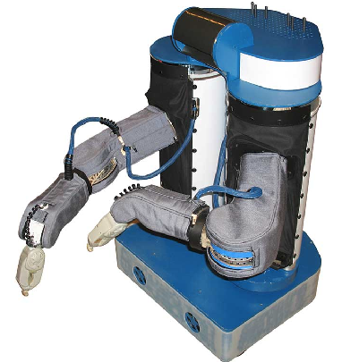

# ROS 소개

## 1. ROS 역사

2006년 스탠포드의 Kenneth Salisbury 교수의 박사과정 학생이던 Keenan Wyrobek와 Eric Berger는 로보틱스 연구를 하면서 반복되는 문제를 해결하고자 Stanford Personal Robotics Program을 시작했다. 로보틱스 연구의 문제는 새로운 프로젝트를 시작할 때마다 새로운 하드웨어 플랫폼 사용법을 익혀야 하고 기존에 구현됐던 소프트웨어를 새로 개발한 후에야 새로운 발전을 이룰 수 있다는 것이었다. Keenan Wyrobek의 표현에 따르면 90%의 시간을 기존에 다른 사람이 개발한 소프트웨어를 개발하는데 쓰고 나머지 10%를 새로운 혁신에 쓸수 있었다. 그들은 이러한 시간 낭비를 줄이기 위해 혁신적인 로봇 소프트웨어 개발 프레임워크을 만들기로 한다. PR1이라는 로봇 플랫폼을 기반으로 가정용 서비스 로봇을 개발하며 이러한 소프트웨어 프레임워크를 적용하고자 했다. (아래 사진) 스탠포드 인공지능연구소의 Morgan Quigley가 기존에 만들었던 **Switchyard**라는 시스템이 소프트웨어 프레임워크 개발의 기초가되었고 이후 Morgan Quigley는 지속적으로 ROS개발에 기여하여 이후 ROS를 관리하는 OSRF의 설립자가 된다.



Stanford Personal Robotics Program을 제대로 하려면 개발 인력을 고용해야했기 때문에 펀드를 얻기 위해 모금을 하러 다녔다. Joanna Hoffman (매킨토시 개발자)에게 5만 달러를 모금 받고 이를 바탕으로 개발을 하며 계속 모금 활동을 했다. 그들은 **"Linux of Robotics"**(로보틱스계의 리눅스)를 개발한다는 비전을 가지고 펀드를 받으려 했으나 "crazy"라는 반응이 다수였다. 그러다 2007년 Scott Hassan(구글의 초기 개발자)이 세운 Willow Garage에서 그 프로젝트를 지원하기로 하면서 두 사람은 Willow Garage로 들어가 충분한 지원아래 ROS와 PR2를 개발하게 된다.  

2008년에 초기 버전인 ROS 0.4 (Mango Tango)를 출시하고 2010년 1월 마침내 ROS 1.0 (Box Turtle)을 출시하고 두 사람의 오랜 목표였던 10대의 PR2를 세계 각지의 연구기관에 배포한다. 이와 더불어 2008년부터 진행한 인턴십 프로그램을 통해 다른 개발자들을 교육하고 개발에 참여시켰다. 그들이 다시 자신의 기관으로 돌아가서 ROS를 사용하고 전파하는 역할을 하게 함으로써 ROS의 확산에 기여하였다. 이후 ROS가 점점 다양한 곳에 쓰이게 되고 커뮤니티가 커지며 지속적으로 버전을 업데이트 시켜나간다.  

2013년에는 Willow Garage가 만든 Open Source Robotics Foundation (OSRF)에서 ROS 관리를 맡게 되고 Willow Garage는 Scott Hassan이 만든 다른 회사인 Suitable Technology로 합병된다. 이때부터 OSRF는 매년 새로운 버전의 ROS를 발표하였다. 2012년 부터는 매년 ROS 개발자들의 컨퍼런스인 ROScon이 열렸고 다양한 ROS관련 서적도 발매되었다. 2014년에는 NASA의 우주용 로봇에도 (Robonut 2) 적용되었다. 2017년에는 OSRF의 이름을 Open Robotics로 변경하였고 ROS의 다음 세대로서 실시간성을 비롯한 다양한 기술적 발전을 담은 ROS2의 첫 번째 버전이 발표되었다.

**출처**

<https://spectrum.ieee.org/automaton/robotics/robotics-software/the-origin-story-of-ros-the-linux-of-robotics>  

<https://en.wikipedia.org/wiki/Robot_Operating_System>


## 2. 그래서 ROS가 뭐라고?

ROS는 "Robot Operating System" 약자로 현재 가장 널리 사용되는 로봇 소프트웨어 프레임워크다. 이름은 운영체제(OS)지만 윈도우, 리눅스 같은 운영체제는 아니며 우분투와 같은 기존 운영체제에 설치하는 미들웨어 (middleware) 혹은 소프트웨어 프레임워크 (software framework)라고 봐야한다. 기존 운영체제의 프로세스 관리, 파일 관리, 유저 인터페이스 등을 그대로 활용하면서 그 위에 로봇 응용프로그램 개발에 필요한 다양한 인프라를 제공한다. 초기 개발의도대로 개발자들이 혁신에만 집중할 수 있도록 개발에 필요한 기본적인 인프라를 제공하고 다른 사람들이 만든 소프트웨어를 공유할 수 있는 생태계를 구축하는 것이 핵심이다. 아래 그림에 ROS의 주요 요소들이 나타나있다.


- Plumbing: ROS는 리눅스처럼 다수의 기본 유틸리티들의 조합으로 복잡한 작업을 수행한다. 그림처럼 ROS 기반으로 개발된 시스템은 다양한 노드(프로세스)가 연결된 그래프 구조를 갖는다. 하나의 프로그램에 다양한 기능을 넣는 것이 아니라 독립적으로 실행되는 단순한 노드들이 서로 유기적으로 연계되어 하나의 시스템을 이룬다.
- Tools: ROS는 개별적으로 설치할 수 있는 다양한 개발 툴을 제공한다. 대표적으로 다양한 데이터를 시각화 할 수 있는 **rviz**나, 작업공간(workspace)를 효율적으로 관리할 수 있는 **catkin** 등이 있다. 
- Capabilities: ROS에서 *Capabilities*란 대부분의 로봇에게 필요한 "능력"(혹은 기능)을 위한 high level interface가 있다는 것이다. 예를 들어 누군가 개발하는 로봇에 특정 좌표로 이동하는 기능이 필요하다고 했을 때 그 기능이 이미 패키지로 있거나 최소한 '좌표'를 전달하는 표준 메시지 형식이 정해져있다는 것이다. "Capabilities"의 중요한 목적은 다른 개발자가 만든 패키지를 사용할 때 그 패키지의 구체적인 내용이나 구현방식을 몰라도 그것을 사용하는데 문제가 없게 하는 것이다. 라이다 센서가 어떤 모델인지 몰라도 표준 라이다 데이터 형식으로 데이터를 받을 수 있기만 하면 라이다 응용 프로그램을 만드는데 문제가 없다.
- Ecosystem: ROS는 전세계의 수많은 개발자들이 참여하여 개발하는 강력한 생태계가 구축되어있다. 앞서 말한 그래프 기반 시스템과 표준화된 메시지 덕분에 다른 사람들이 만든 패키지를 가져다 쓰는게 매우 쉽다. 모든 ROS 버전을 통틀어 약 5000개의 패키지가 올라와있다.

이러한 요소들이 합쳐져 로봇 시스템 개발이 매우 편리해졌다. 예를 들어 자율주행 로봇을 만드려면 대략 다음과 같은 요소들이 필요하다. 

1. 로봇 플랫폼 제어 SW

2. 센서 제어 SW (센서 종류별로)

3. 장애물 인식 알고리즘

4. 경로 생성 알고리즘

5. 위치인식 알고리즘

6. 통합 시스템

이 모든 것은 개인이나 소수의 그룹에서 직접 개발하려면 매우 힘들것이다. 하지만 ROS 생태계에는 이 모든 모듈이 일정수준 이상으로 작동하는 패키지들이 이미 존재한다.(ecosystem) 개발자는 아마도 저 모듈 중 한두개 정도만 성능을 향상시키거나 자신의 목적에 맞게 작동하도록 직접 개발하고 싶을 것이다. 나머지 모듈은 ROS에서 제공하는 패키지를 설치하여 노드로 띄워놓고 그 사이에 자신이 개발한 노드를 연결하여 전체 시스템을 쉽게 구현할 수 있는 것이다.(plumbing) 개발과정을 돕는 빌드 툴이나 시각화 툴도 존재하고(tools) 메시지나 기능에 대한 요구사항이 표준화 되어있어서 자신이 만든 향상된 패키지는 곧 바로 다른 사람이 쓸수도 있다.(capabilities)


## 3. ROS 버전


# ROS 설치 (Desktop)

ROS는 방대한 자체 패키지들을 가지고 있기 때문에 어디까지 설치할 것인지에 따라 설치 시간과 용량이 크게 달라진다. 여기서는 가장 많은 패키지를 설치해주는 `ros-melodic-desktop-full`을 기준으로 설명한다.

## 1. ROS 설치

Ubuntu 18.04에 ROS Melodic을 설치하는 방법에 대한 [공식 가이드](<http://wiki.ros.org/melodic/Installation/Ubuntu>)는 ROS 홈페이지에 있다. 여기서는 공식 가이드를 참고하여 약간 수정된 방법을 설명한다.

### 1.1 ROS 패키지 저장소 추가

ROS 패키지들은 `apt`를 통해서 설치할 수 있는데 그러려면 ROS 저장소를 추가해야 한다.

```
$ sudo sh -c 'echo "deb http://packages.ros.org/ros/ubuntu $(lsb_release -sc) main" \
> /etc/apt/sources.list.d/ros-latest.list'
$ sudo apt update
```

ROS 패키지를 신뢰할만한 패키지로 검증하는데 필요한 키를 등록한다.

```
$ sudo apt-key adv --keyserver 'hkp://keyserver.ubuntu.com:80' --recv-key C1CF6E31E6BADE8868B172B4F42ED6FBAB17C654
Executing: /tmp/apt-key-gpghome.BoHU3zyXWt/gpg.1.sh --keyserver hkp://keyserver.ubuntu.com:80 --recv-key C1CF6E31E6BADE8868B172B4F42ED6FBAB17C654
gpg: key F42ED6FBAB17C654: public key "Open Robotics <info@osrfoundation.org>" imported
gpg: Total number processed: 1
gpg:               imported: 1
```

"Open Robotics"가 키 리스트에 추가됐음을 확인한다.

```
$ sudo apt-key list | grep "Open Robotics"
Warning: apt-key output should not be parsed (stdout is not a terminal)
uid           [ unknown] Open Robotics <info@osrfoundation.org>
```

### 1.2 시간 동기화

PC들 사이에 통신을 하려면 시간이 서버와 동기화 되어있어야 한다. 동기화에 필요한 `ntpdate` 및 필요한 다른 패키지들을 설치한다.

```
$ sudo apt install -y build-essential chrony ntpdate net-tools
$ sudo ntpdate ntp.ubuntu.com
```

### 1.3 ROS 패키지 설치

`ros-melodic-desktop-full`은 ROS, [rqt](http://wiki.ros.org/rqt), [rviz](http://wiki.ros.org/rviz), robot-generic libraries, 2D/3D simulators, navigation and 2D/3D perception 등의 패키지들을 한꺼번에 설치할 수 있는 메타패키지다. `python-catkin-tools`는 catkin workspace를 효과적으로 관리할 수 있는 툴이다.

```
$ sudo apt install ros-melodic-desktop-full python-catkin-tools
```

### 1.4 rosdep 초기화

`rosdep`은 소스 코드로부터 컴파일시 필요한 시스템 dependency를 자동으로 설치해주는 유틸이다.

```
$ sudo rosdep init
$ rosdep update
```

### 1.5 Catkin Workspace 초기화

패키지를 만들고 빌드할 워크스페이스 디렉토리를 만들고 워크스페이스를 초기화한다. 초기화에 사용되는 `catkin` 유틸에 대한 설명은 다음 시간에 한다.

```
$ source /opt/ros/melodic/setup.bash
$ mkdir -p ~/catkin_ws/src
$ cd ~/catkin_ws
$ catkin init
```

### 1.6 IP 확인

ROS는 마스터를 중심으로 통신을 하는데 여러 PC들 사이에 정보를 주고 받는 경우에는 마스터의 IP를 알고 있어야 한다. 하나의 PC만 사용할 때는 `localhost`를 IP 대신 써도된다. IP는 `ifconfig` 명령어로 찾을 수 있다. 여러 주소가 나오는데 그 중 `192.168.`로 시작하는 주소를 메모해둔다.

```
$ ifconfig
...
wlo1: flags=4163<UP,BROADCAST,RUNNING,MULTICAST>  mtu 1500
        inet 192.168.219.189  netmask 255.255.255.0  broadcast 192.168.219.255
        inet6 fe80::e300:7b4b:5a8a:cc5f  prefixlen 64  scopeid 0x20<link>
        ether 0c:54:15:43:bb:0b  txqueuelen 1000  (Ethernet)
        RX packets 348844  bytes 501131238 (501.1 MB)
        RX errors 0  dropped 0  overruns 0  frame 0
        TX packets 65528  bytes 9321861 (9.3 MB)
        TX errors 0  dropped 0 overruns 0  carrier 0  collisions 0
```

### 1.7 초기화 스크립트 추가

`~/.bashrc` 파일은 bash 터미널을 열때 자동으로 실행되는 스크립트다. 여기에 ROS를 위한 기본 세팅을 추가하면 터미널에서 직접 명령을 실행하지 않아도 된다. 특히 `source /opt/ros/melodic/setup.bash`를 해야만 터미널에서 ros 명령어를 쓰고 ros 패키지 빌드도 할 수 있다.  

```
sh -c "echo \"alias eb='nano ~/.bashrc'\" >> ~/.bashrc"
sh -c "echo \"alias sb='source ~/.bashrc'\" >> ~/.bashrc"
sh -c "echo \"alias cw='cd ~/catkin_ws'\" >> ~/.bashrc"
sh -c "echo \"alias cm='cd ~/catkin_ws && catkin build'\" >> ~/.bashrc"
sh -c "echo \"source /opt/ros/melodic/setup.bash\" >> ~/.bashrc"
sh -c "echo \"source ~/catkin_ws/devel/setup.bash\" >> ~/.bashrc"
# put IP address instead of localhost
sh -c "echo \"export ROS_MASTER_URI=http://localhost:11311\" >> ~/.bashrc"
sh -c "echo \"export ROS_HOSTNAME=localhost\" >> ~/.bashrc"
```

마지막 두 줄에서는 **`localhost` 대신 1.6에서 찾은 IP 주소**를 입력한다.