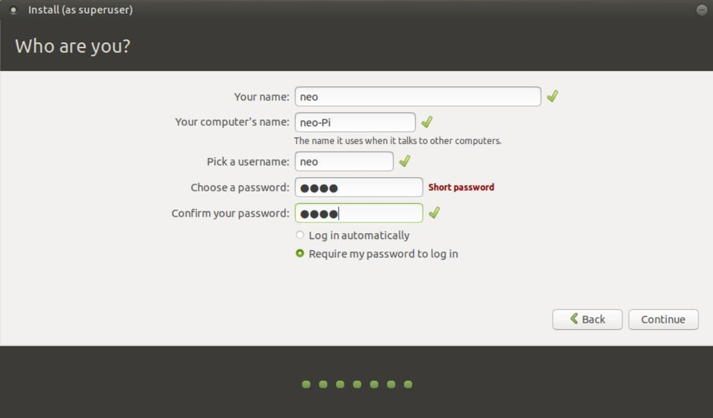
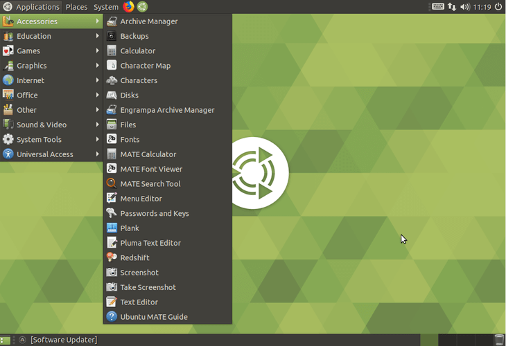

# 터틀봇(Turtlebot) 소개

터틀봇은 Willow Garage 사의 Melonee Wise와 Tully Foote 내부 프로젝트로부터 시작했다. 2010년 Melonee는 새로 나온 Kinect 센서를 이용한 주행알고리즘을 시험하기 위해 iRobot Create에 붙여보았는데 바로 잘 작동하진 않았다. ROS로 작동시킬 수 있는 주행 플랫폼은 PR2와 Lego NXT 등이 있었지만 PR2는 너무 크고 비쌌고 NXT는 다양한 센서를 장착하기 어려웠다. Melonee와 Tully는 Create을 ROS를 위한 주행용 플랫폼으로 만들기 위해 작은 사내 프로젝트를 만들었다. 처음엔 ROS용 Create의 드라이버를 만들고 로봇의 전원이 Kinect 센서를 작동시키기엔 부족해서 전원 보드를 직접 만들었고 Odometry가 정확하지 않아서 Gyro 센서를 장착했다. 그러다 우연히 구글의 클라우드 로봇 프로젝트와 연결이 되어 개발용으로 만들었던 Create 기반 주행 플랫폼을 구글에 판매하게 되었다. 이를 계기로 터틀봇을 상품화시켜 2011년부터 판매하게 되었다.  

기존에는 주행연구를 하려면 Pioneer 3DX 같은 수백~수천만원짜리 로봇이 있어야 로봇을 제어하고 이동정보를 받을수 있었다. 반면 터틀봇은 가격이 저렴하고 다양한 PC나 센서에 연결할 수 있어 확장성이 좋았다. 무엇보다도 ROS를 이용하면 편리하게 제어할 수 있었다. 사람들은 직접 드라이버를 설치하고 로봇을 제어하는 API를 공부하지 않아도 ROS에서 제공하는 드라이버와 표준 메시지를 사용하면 로봇을 제어하고 센서 정보를 얻을 수 있게 되었다. 이러한 장점 덕분에 터틀봇은 많은 연구소에 널리 퍼졌고 이용자가 많아질수록 관련 소프트웨어가 풍부해지고 터틀봇을 사용한 논문도 많이 발표되었다.

2012년에는 국내의 유진 로봇에서 자사의 로봇 청소기 플랫폼을 기반으로 Willow Garage와 협업해 거북이(Kobuki)를 만들었다. 거북이는 터틀봇3(Turtlebot 2)로도 불렸으며 기존 터틀봇보다 플랫폼을 다양하게 확장할 수 있었다.

2017년에는 국내 로보티즈라는 회사에서 터틀봇3(Turtlebot 3)를 출시했다. 터틀봇3는 모듈형 판넬을 이용하여 조립식으로 층을 쌓아갈 수 있어 기존의 정형화된 확장 프레임을 벗어나 사용자가 자유롭게 원하는 모양을 조립할 수 있도록 설계했다. 저렴한 Raspberry Pi와 360도 Lidar 센서가 기본 장착되어 주행 어플리케이션을 더 쉽게 만들수 있게되었다.


**출처**

<https://spectrum.ieee.org/automaton/robotics/diy/interview-turtlebot-inventors-tell-us-everything-about-the-robot>  

<https://www.turtlebot.com/>


# Raspberry Pi Setup

터틀봇3에는 기본적으로 Raspberry Pi가 장착되어있다. 우선 용어의 혼동을 줄이기 위해 용어들을 정리한다.

- Raspberry Pi: 원래는 개발도상국에서의 컴퓨터 교육을 위한 저가형 PC로 개발되었으나 오히려 연구용이나 취미용으로 많이 쓰이면서 판매가 크게 늘었다. 터틀봇3에 장착된 모델은 Raspberry Pi 3 Model B다.
- SBC (Single Board Computer): Raspberry Pi처럼 하나의 보드에 CPU, 메모리, 저장장치 등이 모두 장착되어 하나의 컴퓨터를 구성한 것을 말한다. 로봇공학 수업에서 "SBC"는 Raspberry Pi를 지칭한다.
- Raspbian: Raspberry Pi를 위한 데비안 계열 리눅스 배포판이다. 공식 홈페이지: <https://www.raspberrypi.org/>
- Ubuntu MATE: 우분투 메이트가 아니다! **우분투 마테**다. 기본 우분투는 SBC에서 사용하기에는 GUI 환경이 무겁기 때문에 데스크톱 환경을 가벼운 MATE로 바꾼것이다. Raspberry Pi를 지원하여 Raspberry Pi에서도 많이 쓰인다. 공식 홈페이지: <https://ubuntu-mate.org/>

Raspberry Pi에는 Raspbian과 Ubuntu MATE 둘 다 사용가능하다. ROS Kinetic Kame을 쓸 때는 Raspbian을 쓰는게 문제 없었지만 Melodic Morenia를 쓰려면 ROS를 소스에서부터 빌드해야 한다고 한다. 아무래도 ROS가 Ubuntu와 버전을 맞추다보니 Melodic Morenia와는 호환성 문제가 생긴듯 하다. 따라서 Melodic Morenia를 쓰기 위해서는 Ubuntu MATE 18.04 버전을 쓰는 것이 편할 것이다.

## 1. Ubuntu MATE 설치

### 1.1 직접 설치

우분투 마테를 쓰려면 SBC에 장착된 SD 카드를 꺼내서 PC에서 우분투 마테 부팅 디스크로 만들어야 한다. 먼저 아래 링크에서 Raspberry Pi 버전을 다운 받는다.  

<https://ubuntu-mate.org/download/>  

이후 PC에서 Rufus를 이용해 부팅 디스크를 만든다.

<https://rufus.ie/>  

SD카드를 Raspberry Pi에 끼운후 전원을 넣어서 켜면 설치과정이 시작된다. 우분투 데스크탑과 마찬가지로 언어와 키보드를 영어로 선택하고 사용자 계정을 다음과 같이 정한다.

- Your name, computer's name, username: turtle-xx (xx는 임의로 정함)
- Password: robot



설치가 완료되면 다음과 같은 화면이 나와야한다.



그런데 직접 설치해본 결과 상단의 메뉴 바가 보이지 않는 경우가 있다. 이런 경우에는 다음과 같이 해결한다.

1. 터미널을 열고(ctrl+alt+T)  `mate-tweak` 실행
2. "Panel"에서 "Familar"를 다른 것으로 바꾸면 메뉴바가 활성화 된다.
3. 다시 "Familiar"로 돌아오면 기본 테마의 메뉴바가 활성화 된다.

정상작동하면 업그레이드를 먼저 진행한다.

```
sudo apt-get update
sudo apt-get upgrade -y
```


### 1.2 디스크 복사를 통한 설치

위 과정을 거치는 것은 번거롭기도 하고 시간이 많이 걸린다. 그러므로 미리 저 과정을 통해 SD카드를 하나 만들어 놓고 SD카드를 복제하는 것이 편할수 있다. 여기서는 디스크를 종째로 복사하는 방법을 사용할 것이기 때문에 모든 하드웨어가 동일한 환경에서만 복제가 가능하다.

#### 2.1 설치된 이미지 만들기

이미 우분투 마테가 설치된 SD카드를 이미지 파일로 백업한다. 먼저 SD카드를 리눅스 PC에 연결하고 `lsblk` 명령어를 통해 저장장치의 경로를 알아낸다. 통상 `/dev/sdx` 경로가 생기고 `"x"`만 변한다. 저장장치의 파티션 개수에 따라 아래와 같이 파티션이 표시된다.

```
# A. 하나의 파티션만 있는 경우
sda           8:0    1  58.4G  0 disk /media/ian/IanFastStick

# B. 두 개의 파티션이 있는 경우
sda           8:0    1  14.9G  0 disk 
├─sda1        8:1    1   199M  0 part /media/ian/system-boot
└─sda2        8:2    1  14.7G  0 part /media/ian/writable
```

이미지를 만들기 전에 미리 파티션들을 언마운트(unmount)하는 것이 좋다.

```
# A의 경우
$ umount /dev/sda

# B의 경우
$ umount /dev/sda1
$ umount /dev/sda2
```

예를 들어, SD카드가 `/dev/sda`에 위치한다면 다음 명령어를 통해 이미지를 만든다.

```
sudo dd if=/dev/sda of=~/rp_mate_18.04.iso bs=1024k
```

dd(disk dump)는 디스크 복사에 유용하게 쓸 수 있는 유틸인데 단점이 있다면 비어있는 공간까지 모두 백업한다는 것이다. 16GB 메모리 중에 1GB만 사용했더라도 백업이미지는 16GB가 된다.

#### 2.2 이미지 복원하기

백업이 끝나면 설치된 SD카드를 제거하고 새 SD카드를 연결한다. 마찬가지로 `lsblk` 명령어로 경로를 알아내고 SD카드의 모든 파티션을 언마운트(unmount) 한다.  

예를 들어, SD카드가 `/dev/sda`에 위치한다면 다음 명령어를 통해 SD카드에 이미지를 복원한다.

```
sudo dd if=~/rp_mate_18.04.iso of=/dev/sda bs=1024k
```


## 2. ROS 설치 (SBC)

SBC에 ROS Melodic을 설치하는 과정은 Remote PC와 유사하지만 조금씩 다르니 아래 가이드를 따라 설치한다.


### 2.1 ROS 패키지 저장소 추가

ROS 패키지들은 `apt`를 통해서 설치할 수 있는데 그러려면 ROS 저장소를 추가해야 한다.

```
$ sudo sh -c 'echo "deb http://packages.ros.org/ros/ubuntu $(lsb_release -sc) main" \
> /etc/apt/sources.list.d/ros-latest.list'
$ sudo apt update
```

ROS 패키지를 신뢰할만한 패키지로 검증하는데 필요한 키를 등록한다.

```
$ sudo apt-key adv --keyserver 'hkp://keyserver.ubuntu.com:80' --recv-key C1CF6E31E6BADE8868B172B4F42ED6FBAB17C654
Executing: /tmp/apt-key-gpghome.BoHU3zyXWt/gpg.1.sh --keyserver hkp://keyserver.ubuntu.com:80 --recv-key C1CF6E31E6BADE8868B172B4F42ED6FBAB17C654
gpg: key F42ED6FBAB17C654: public key "Open Robotics <info@osrfoundation.org>" imported
gpg: Total number processed: 1
gpg:               imported: 1
```

"Open Robotics"가 키 리스트에 추가됐음을 확인한다.

```
$ sudo apt-key list | grep "Open Robotics"
Warning: apt-key output should not be parsed (stdout is not a terminal)
uid           [ unknown] Open Robotics <info@osrfoundation.org>
```


### 2.2 패키지 설치

PC들 사이에 통신을 하려면 시간이 서버와 동기화 되어있어야 한다. 동기화에 필요한 `ntpdate`와 원격 접속에 필요한 `openssh` 등 필요한 패키지들을 미리 설치한다.

```
$ sudo apt install -y build-essential chrony ntpdate net-tools gedit git openssh-server openssh-client
$ sudo ntpdate ntp.ubuntu.com
```


### 2.3 ROS 패키지 설치

`ros-melodic-ros-base`는 GUI 관련 패키지를 제외한 최소 설치 세트다. SBC에서는 단순히 로봇과 센서 정보를 Remote PC에 입출력해주는 기능만 하기 때문에 많은 기능이 필요하지 않다.

```
$ sudo apt install ros-melodic-ros-base
```


### 2.4 rosdep 초기화

`rosdep`은 소스 코드로부터 컴파일시 필요한 시스템 dependency를 자동으로 설치해주는 유틸이다.

```
$ sudo rosdep init
$ rosdep update
```


### 2.5 Catkin Workspace 초기화

패키지를 만들고 빌드할 워크스페이스 디렉토리를 만들고 워크스페이스를 초기화한다. 여기서는 ROS에서 기본 제공하는 catkin 시스템을 사용한다.

```
$ source /opt/ros/melodic/setup.bash
$ mkdir -p ~/catkin_ws/src
$ cd ~/catkin_ws
~/catkin_ws$ catkin_init_workspace
~/catkin_ws$ catkin_make
```


### 2.6 IP 확인

ROS는 마스터를 중심으로 통신을 하는데 여러 PC들 사이에 정보를 주고 받는 경우에는 마스터의 IP를 알고 있어야 한다. IP는 `ifconfig` 명령어로 찾을 수 있다. 여러 주소가 나오는데 그 중 `192.168.`로 시작하는 주소를 메모해둔다.

```
$ ifconfig
...
wlo1: flags=4163<UP,BROADCAST,RUNNING,MULTICAST>  mtu 1500
        inet 192.168.219.189  netmask 255.255.255.0  broadcast 192.168.219.255
        inet6 fe80::e300:7b4b:5a8a:cc5f  prefixlen 64  scopeid 0x20<link>
        ether 0c:54:15:43:bb:0b  txqueuelen 1000  (Ethernet)
        RX packets 348844  bytes 501131238 (501.1 MB)
        RX errors 0  dropped 0  overruns 0  frame 0
        TX packets 65528  bytes 9321861 (9.3 MB)
        TX errors 0  dropped 0 overruns 0  carrier 0  collisions 0
```


### 2.7 초기화 스크립트 추가

`~/.bashrc` 파일은 bash 터미널을 열때 자동으로 실행되는 스크립트다. 여기에 ROS를 위한 기본 세팅을 추가하면 터미널에서 직접 명령을 실행하지 않아도 된다. 특히 `source /opt/ros/melodic/setup.bash`를 해야만 터미널에서 ros 명령어를 쓰고 ros 패키지 빌드도 할 수 있다.  

```
$ gedit ~/.bashrc
# .bashrc 아래에 다음 텍스트 추가 후 저장하고(ctrl+s) 닫기
alias cw='cd ~/catkin_ws'
alias cm='cd ~/catkin_ws && catkin_make'
source /opt/ros/melodic/setup.bash
source ~/catkin_ws/devel/setup.bash
export ROS_MASTER_URI=http://localhost:11311
export ROS_HOSTNAME=localhost
export TURTLEBOT3_MODEL=burger

$ source ~/.bashrc
```

SBC는 처리속도가 느려서 자체적으로 알고리즘을 실행하기에는 부담스럽고 Remote PC로 로봇 정보를 입출력해주는 역할을 한다. 따라서 Remote PC과 연동될 수 있도록 주소를 다음과 같이 세팅해야 한다.

- ROS_MASTER_URI: `localhost` 대신에 Remote PC의 IP를 적는다. 이때 Remote PC의 ROS_MASTER_URI도 동일하게 설정되어 있어야 한다.
- ROS_HOSTNAME: `localhost` 대신에 SBC의 IP를 적는다.


### 2.8 터틀봇 패키지 설치

터틀봇 자율주행을 하기 위해서는 로봇에 속도 명령을 내리고 현재 이동량을 읽고 LiDAR 센서 값을 받아올 수 있어야 한다. 이러한 기능을 하기 위해 아래 패키지들을 설치한다.

```
$ cd ~/catkin_ws/src
$ git clone https://github.com/ROBOTIS-GIT/hls_lfcd_lds_driver.git
$ git clone https://github.com/ROBOTIS-GIT/turtlebot3_msgs.git
$ git clone https://github.com/ROBOTIS-GIT/turtlebot3.git
$ cd ~/catkin_ws/src/turtlebot3
$ sudo rm -r turtlebot3_description/ turtlebot3_teleop/ turtlebot3_navigation/ turtlebot3_slam/ turtlebot3_example/
$ sudo apt install ros-melodic-rosserial-python ros-melodic-tf
$ source /opt/ros/melodic/setup.bash
$ cd ~/catkin_ws
$ catkin_make -j1
```

OpenCR이 루트 권한을 얻지 않아도 rosrun를 이용할 수 있도록 설정한다.

```
$ rosrun turtlebot3_bringup create_udev_rules
```


## 3. 원격 제어

리눅스에서는 ssh를 통해 간편하게 다른 컴퓨터의 원격 터미널에 접속할 수 있다. `openssh`는 위에서 미리 설치했지만 설치가 안됐다면 아래 명령어로 설치한다. Remote PC와 SBC 모두 설치되어 있어야 한다.

```
$ sudo apt install -y openssh-server openssh-client
```

접속하는 방법은 `ssh turtle@192.168.xxx.xxx` 를 실행하면 된다. 하지만 되지 않을 것이다. 추가로 설정을 해줘야한다.

### Connection refused

`ssh` 명령어를 실행했을 때 "ssh: connect to host 192.168.xx.xx port 22: Connection refused" 라고 뜬다면 SBC에서 ssh 서비스가 구동중이지 않은 것이다. 이 경우 SBC에서 다음 명령어를 실행한다.

```
$ sudo /etc/init.d/ssh restart
```

### Connection reset by

`ssh` 명령어를 실행했을 때 "Connection reset by 192.168.xx.xx port 22" 라고 뜬다면 SBC에서 ssh 키(key)가 준비되지 않은 것이다. 이 경우 SBC에서 다음 명령어를 실행한다.

```
$ rm /etc/ssh/ssh_host_*
$ dpkg-reconfigure openssh-server
```

### 원격 로봇 제어

두 가지 설정을 해주면 Remote PC에서 ssh 명령어로 SBC의 터미널에 접속할 수 있다. SBC의 비밀번호(robot)를 입력하여 로그인하면 터미널상의 사용자명이 `turtle`로 바뀐다. 아래 명령은 모두 **Remote PC**에서 실행하는 것이다.

```bash
# 현재 마스터가 없다면 실행
$ roscore

# 새 탭 열고(ctrl+shit+T), 원격접속: 192.168.xxx.xxx 는 SBC의 IP 주소
$ ssh turtle@192.168.xxx.xxx

# SBC에 명령: 로봇에서 odometry와 lds 메시지 토픽 발행
turtle@turtle-01:~$ roslaunch turtlebot3_bringup turtlebot3_robot.launch

# 새 탭 열고(ctrl+shit+T), 터틀봇을 원격 조종할 수 있는 노드 실행
$ roslaunch turtlebot3_teleop turtlebot3_teleop_key.launch --screen

# 새 탭 열고(ctrl+shit+T), 터틀봇의 경로와 LiDAR 정보를 볼 수 있는 rqt 실행
$ roslaunch turtlebot3_bringup turtlebot3_model.launch
```

이제 SBC에 모니터, 키보드, 마우스가 없어도 원격 접속을 통해 SBC를 제어 할 수 있다.  
단지 커맨드로만 제어할 수 있어 약간 불편할 수는 있지만 어차피 SBC에서 `roslaunch` 명령어를 내리고 나면 SBC에서는 더이상 할 일이 없다.


## 4. 펌웨어 업데이트

혹시 펌웨어 버전이 오래되어 업데이트를 해야한다면 SBC에서 아래 명령어를 통해 업데이트를 해준다.

출처: https://discourse.ros.org/t/announcing-turtlebot3-software-v1-0-0-and-firmware-v1-2-0-update/4888

```bash
#opencr 업데이트
$ export OPENCR_PORT=/dev/ttyACM0
$ export OPENCR_MODEL=burger
$ rm -rf ./opencr_update.tar.bz2

#한 줄의 명령어
$ wget https://github.com/ROBOTIS-GIT/OpenCR/raw/master/arduino/opencr_release/shell_update/opencr_update.tar.bz2 && tar -xvf opencr_update.tar.bz2 && cd ./opencr_update && ./update.sh $OPENCR_PORT $OPENCR_MODEL.opencr && cd ..
#여기까지

#패키지 소스 지우고 다시 다운로드
$ cd ~/catkin_ws/src/
$ rm -rf turtlebot3/ turtlebot3_msgs/ hls_lfcd_lds_driver/
$ git clone https://github.com/ROBOTIS-GIT/hls_lfcd_lds_driver.git
$ git clone https://github.com/ROBOTIS-GIT/turtlebot3_msgs.git
$ git clone https://github.com/ROBOTIS-GIT/turtlebot3.git

#터틀봇에 불필요한 노드 삭제
$ cd ~/catkin_ws/src/turtlebot3
$ sudo rm -r turtlebot3_description/ turtlebot3_teleop/ turtlebot3_navigation/ turtlebot3_slam/ turtlebot3_example/

#기존 빌드파일 삭제 후 다시 빌드
$ cd ~/catkin_ws/
$ rm -rf build/ devel/
$ cd ~/catkin_ws && catkin_make -j1
```

