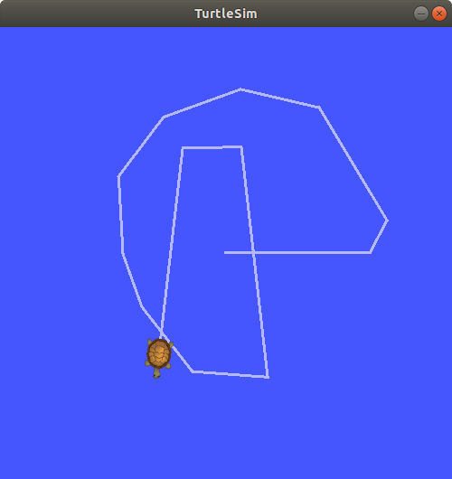
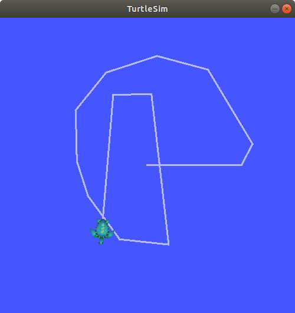

# ROS 개념

## 1. ROS 용어

- ROS: 로봇 응용프로그램을 개발하기 위한 로봇 소프트웨어 플랫폼이다. 로봇 응용프로그램을 개발에 필요한 다양한 기능을 제공한다.
    - 하드웨어 추상화, 디바이스 제어
    - 로보틱스에서 자주 사용되는 센싱, 인식, 지도작성, 경로계획 등의 구현
    - 프로세스 간의 메시지 통신
    - 패키지 관리
    - 다양한 개발 및 디버깅 도구 (catkin 등)
- 마스터(Master): 노드 사이의 연결과 메시지 통신을 위한 서버 역할을 한다. 마스터가 실행 중이어야 노드 사이의 통신이 가능하다. `roscore` 명령어로 실행한다.
- 노드(Node): 최소 단위의 실행 가능한 프로세스 혹은 프로그램이다. ROS 에서는 하나의 목적에 하나의 노드를 작성하길 권하며 그래야 노드를 재사용하기 쉽다. 노드 사이에는 메시지 통신으로 데이터를 주고 받는다.
- 패키지(Package): ROS를 구성하는 기본 단위다. ROS 응용 프로그램은 패키지 단위로 개발되는데 패키지는 하나 이상의 노드를 포함하거나, 다른 패키지의 노드 실행을 위한 설정 파일 등을 포함한다.
- 메시지(Message): 노드 사이에서 주고 받는 데이터 형식이다. 경우에 따라 통신으로 전송되는 데이터 형식을 말하기도 하고 토픽에서 사용하는 데이터 형식만 뜻하기도 한다. int, float 같은 기본 변수 형태부터 시작해서 메시지 안에 다른 메시지를 품은 데이터 구조도 가능하고 메시지의 배열도 사용 가능하다.
- 서비스(Service): ROS에서 "서비스" 두가지 의미가 있는데 경우에 따라서 양방향 통신 방식을 뜻하기도 하고 "서비스" 통신 방식에서 주고 받는 데이터 타입을 말하기도 한다.
- 파라미터(parameter): 마스터에서 관리하는 노드 사이에 공유되는 설정 값이다. 설정 값을 파일에서 읽으려면 다른 패키지에서 파일의 경로를 알아야하는 불편함이 있고 다른 PC에서는 아예 접근이 불가능하다. 마스터에서 관리하므로 연결된 모든 노드에서 쉽게 접근 가능하다. 파라미터는 기본값이 있고 노드에서 수정도 가능하다.
- 네임(Name): 노드, 파라미터, 토픽, 서비스에는 모두 네임이 있다. 네임은 ROS 요소들끼리 서로를 식별하는 ID같은 역할을 한다. 그래서 같은 노드라 할지라도 두 개를 중복 실행하려면 네임을 다르게 지정해야한다.


## 2. 메시지 통신 방식

### 2.1토픽 (Topic)

- **용도**: **토픽은 주기적으로 발생하는 메시지를 지속적으로 전송하는 단방향 통신** 방식이다. 주로 센서 데이터를 알고리즘 노드로 보내거나 센서 주기에 맞춰 한 알고리즘에서 처리된 데이터를 다음 알고리즘으로 보낼때 많이 사용된다.  
- **구성**: 토픽에는 메시지를 보내는 **퍼블리셔**(Publisher, 발행자)와 메시지를 수신하는 **서브스크라이버**(Subscriber, 구독자)가 있다. 하나의 노드에서 다수의 퍼블리셔나 다수의 서브스크라이버를 가질 수 있고 두 가지 다 가질 수도 있다.  
- **방식**: 퍼블리셔 노드는 발행하는 토픽 정보를 마스터에 등록한다. 서브스크라이버 노드는 구독할 토픽을 발행하는 퍼블리셔 노드 정보를 마스터에서 받는다. 서브스크라이버는 퍼블리셔에 직접 접속하여 메시지를 받게 된다.

### 2.2 서비스 (Service)

- **용도**: **서비스는 일회성 요청(메시지)을 보내고 응답(메시지)을 받는 양방향 통신** 방식이다. 주로 특정 조건을 만족했을 때 이를 알리거나 그에 따른 명령을 내리는 수단으로 사용된다.
- **구성**: 서비스를 **요청(request)**하는 **서비스 클라이언트(service client)**와 요청에 대한 **응답(response)**를 해주는 **서비스 서버( service server)**로 구성된다. 
- **방식**: 서비스 서버는 수신할 서비스 메시지를 마스터에 등록한다. 서비스 클라이언트는 마스터에서 메시지를 받을 수 있는 서버 노드를 찾고 요청 메시지를 보낸다. 서버는 요청이 들어오면 이를 처리한 응답 메시지를 클라이언트로 보낸다.

### 2.3 액션 (Action)

- **용도**: **액션은 요청 후 결과를 받기 전에 중간 결과를 받을 수 있는 양방향 통신** 방식이다. 주로 요청 후 응답까지 오랜 시간이 걸리고 중간 결과나 진행상황을 보내야할 때 사용된다.
- **구성**: 서비스처럼 액션도 **액션 서버(action server**와 **액션 클라이언트(action client)**가 있다. 
- **방식**: 액션 클라이언트에서 **목표(goal)**을 보내면 액션 서버에서는 이를 처리하며 중간 결과인 **피드백(feedback)**을 보내고 처리가 끝나면 **결과(result)**를 보낸다.

### 2.4 요약

| 방식   | 동기화 | 방향   | 용도                 |
| ------ | ------ | ------ | -------------------- |
| 토픽   | 비동기 | 단방향 | 지속적인 데이터 전송 |
| 서비스 | 동기   | 양방향 | 일시적인 양방향 통신 |
| 액션   | 동기   | 양방향 | 중간 피드백 제공     |


# ROS 명령어


## 1. ROS 실행 명령어

다음은 ros의 노드를 실행하는 명령어들이다.

| 명령어                                     | 설명                                                         |
| ------------------------------------------ | ------------------------------------------------------------ |
| roscore                                    | 마스터 실행, ros를 구동할 때 가장 먼저 실행되어야 함         |
| rosrun [패키지 이름] [노드 이름] [옵션]    | ros 노드 실행                                                |
| roslaunch [패지키 이름] [launch 파일 이름] | *.launch 파일에서 지정한 노드들을 실행, 여러 노드를 한번에 실행 가능 |
| roscd [패키지 이름]                        | 해당 패키지 디렉토리로 이동                                  |

turtlesim 패키지를 실행해보자.

```
$ roscore
$ rosrun turtlesim turtlesim_node
$ rosrun turtlesim turtle_teleop_key
```


## 2. ROS 정보 명령어

ROS 정보 명령어는 주로 ROS의 현재 상태를 확인할 수 있는 명령어들이다. 

### 2.1 rosnode

| 명령어                   | 설명                                                 |
| ------------------------ | ---------------------------------------------------- |
| rosnode list             | 실행중인 노드 목록 확인                              |
| rosnode info [노드 이름] | 지정한 노드 정보 확인 (연결된 토픽, 서비스, 노드 등) |
| rosnode ping [노드 이름] | 지정한 노드와 연결 테스트                            |
| rosnode kill [노드 이름] | 지정한 노드 실행 중단                                |

```
$ rosnode list
/rosout
/teleop_turtle
/turtlesim
$ rosnode info turtlesim
--------------------------------------------------------------------------------
Node [/turtlesim]
Publications: 
 * /rosout [rosgraph_msgs/Log]
 * /turtle1/color_sensor [turtlesim/Color]
 * /turtle1/pose [turtlesim/Pose]

Subscriptions: 
 * /turtle1/cmd_vel [geometry_msgs/Twist]
# 중략 ...

contacting node http://localhost:34127/ ...
Pid: 7803
Connections:
# 중략 ...
 * topic: /turtle1/cmd_vel
    * to: /teleop_turtle (http://localhost:40865/)
    * direction: inbound
    * transport: TCPROS
```


### 2.2 rostopic

| 명령어                      | 설명                                                         |
| --------------------------- | ------------------------------------------------------------ |
| rostopic list               | 활성화된 토픽 목록 확인                                      |
| rostopic info [토픽 이름]   | 지정한 토픽 정보 확인 (메시지 타입, 연결된 노드 이름)        |
| rostopic type [토픽 이름]   | 지정한 토픽의 메시지 타입 표시                               |
| rostopic find [메시지 타입] | 지정한 메시지 타입을 사용하는 토픽 표시                      |
| rostopic echo [토픽 이름]   | 지정한 토픽으로 발행되는 메시지 내용을 실시간으로 터미널에 표시 |


```
$ rostopic list
/rosout
/rosout_agg
/turtle1/cmd_vel
/turtle1/color_sensor
/turtle1/pose
$ rostopic info /turtle1/cmd_vel 
Type: geometry_msgs/Twist

Publishers: 
 * /teleop_turtle (http://localhost:40865/)

Subscribers: 
 * /turtlesim (http://localhost:34127/)

$ rostopic type /turtle1/cmd_vel 
geometry_msgs/Twist
$ rostopic find geometry_msgs/Twist
/turtle1/cmd_vel
$ rostopic echo /turtle1/cmd_vel 
```


### 2.3 rosservice


| 명령어                                   | 설명                                                      |
| ---------------------------------------- | --------------------------------------------------------- |
| rosservice list                          | 활성화된 서비스 목록 표시                                 |
| rosservice info [서비스 이름]            | 지정한 서비스 정보 확인 (서비스 타입, 사용중인 노드 이름) |
| rosservice type [서비스 이름]            | 지정한 서비스의 서비스 타입 출력                          |
| rosservice find [서비스 타입]            | 지정한 서비스 타입을 쓰는 서비스 출력                     |
| rosservice args [서비스 이름]            | 지정한 서비스의 서비스 파라미터 출력                      |
| rosservice call [서비스 이름] [파라미터] | 입력된 파라미터로 서비스 요청                             |

```
ian@ian:~$ rosservice list
# 중략 ...
/turtle1/set_pen
/turtle1/teleport_absolute
/turtle1/teleport_relative
/turtlesim/get_loggers
/turtlesim/set_logger_level
ian@ian:~$ rosservice info /turtle1/set_pen
Node: /turtlesim
URI: rosrpc://localhost:40365
Type: turtlesim/SetPen
Args: r g b width off
ian@ian:~$ rosservice type /turtle1/set_pen
turtlesim/SetPen
ian@ian:~$ rosservice find turtlesim/SetPen 
/turtle1/set_pen
ian@ian:~$ rosservice args /turtle1/set_pen 
r g b width off
ian@ian:~$ rosservice call /turtle1/set_pen 255 0 0 5 0
```

`rosservice call`을 한 후 터틀봇을 이동시키면 빨간색 선이 그려질 것이다.


### 2.4 rosparam

| 명령어                       | 설명                          |
| ---------------------------- | ----------------------------- |
| rosparam list                | 파라미터 목록 보기            |
| rosparam get [파라미터 이름] | 지정한 파라미터 값 출력       |
| rosparam set [파라미터 이름] | 지정한 파라미터 값 설정       |
| rosparam dump [파일 이름]    | 파라미터를 지정한 파일에 저장 |
| rosparam load [파일 이름]    | 파일에서 파라미터 불러오기    |


```
ian@ian:~$ rosparam list
/background_b
/background_g
/background_r
/rosdistro
/roslaunch/uris/host_localhost__34963
/rosversion
/run_id
ian@ian:~$ rosparam get /background_b
255
ian@ian:~$ rosparam get /
background_b: 255
background_g: 86
background_r: 69
rosdistro: 'melodic
# 중략 ...
ian@ian:~$ rosparam dump /tmp/parameters.yaml
ian@ian:~$ cat /tmp/parameters.yaml 
background_b: 255
background_g: 86
background_r: 69
# 중략 ...
ian@ian:~$ rosparam get / > /tmp/ros_params.yaml
ian@ian:~$ cat /tmp/ros_params.yaml
background_b: 255
background_g: 86
background_r: 69
# 중략 ...

# turtlesim의 배경색 변경 후 적용
ian@ian:~$ rosparam set /background_b 0
ian@ian:~$ rosservice call clear
# 다시 기존 배경색 불러와서 적용
ian@ian:~$ rosparam load /tmp/parameters.yaml
ian@ian:~$ rosservice call clear
```


### 2.5 rosmsg

여기서 "메시지(message)"는 토픽을 전송하는 데이터 형식이다. `rosmsg`는 메시지에 대한 정보를 확인하는 명령어다.

| 명령어                       | 설명                                        |
| ---------------------------- | ------------------------------------------- |
| rosmsg list                  | 모든 메시지 목록 표시                       |
| rosmsg show [메시지 이름]    | 지정한 메시지 정보 표시                     |
| rosmsg package [패키지 이름] | 지정한 패키지에서 사용하는 메시지 목록 표시 |

```
ian@ian:~$ rosmsg list | grep geometry
...
geometry_msgs/Pose
geometry_msgs/Pose2D
geometry_msgs/PoseArray
geometry_msgs/PoseStamped
geometry_msgs/PoseWithCovariance
geometry_msgs/PoseWithCovarianceStamped
geometry_msgs/Quaternion
geometry_msgs/QuaternionStamped
geometry_msgs/Transform
geometry_msgs/TransformStamped
geometry_msgs/Twist
...

ian@ian:~$ rosmsg show geometry_msgs/Twist
geometry_msgs/Vector3 linear
  float64 x
  float64 y
  float64 z
geometry_msgs/Vector3 angular
  float64 x
  float64 y
  float64 z
```


### 2.6 rossrv

`rosservice`는 서비스 통신 방식에 대한 정보를 확인하는 명령어고 `rossrv`는 서비스 메시지 타입에 대한 정보를 확인하는 명령어다.

| 명령어                       | 설명                                        |
| ---------------------------- | ------------------------------------------- |
| rossrv list                  | 모든 서비스 목록 표시                       |
| rossrv show [서비스 이름]    | 지정한 서비스 정보 표시                     |
| rossrv package [패키지 이름] | 지정한 패키지에서 사용하는 서비스 목록 표시 |

```
ian@ian:~$ rossrv list | grep turtlesim
turtlesim/Kill
turtlesim/SetPen
turtlesim/Spawn
turtlesim/TeleportAbsolute
turtlesim/TeleportRelative
ian@ian:~$ rossrv show turtlesim/SetPen 
uint8 r
uint8 g
uint8 b
uint8 width
uint8 off
---

```


## 3. rosbag

`rosbag`은 퍼블리쉬되는 토픽 메시지를 bag 포맷으로 저장하고 필요할 때 이를 재생하여 이전 상황을 그대로 재현할 수 있는 명령어다. 센서 데이터를 이용한 어떤 알고리즘을 개발할때 똑같은 상황을 재현할 수 있어야 문제를 확인하고 해결할 수 있다. 또한 알고리즘을 개발할 때마다 센서를 연결하려면 신경쓸것도 많고 준비하는데 시간도 많이 걸린다. 이러한 문제를 해결하기 위해서 ROS에서는 센서 하드웨어와 연결하여 실제 센서 데이터를 실시간 녹화한 후 녹화된 데이터를 재생하여 알고리즘을 개발/디버깅하는데 활용할 수 있다. 이로서 동일한 상황을 재연할 수 있고 센서를 준비하는데 들이는 수고를 줄일 수 있다.

| 명령어                                    | 설명                                                    |
| ----------------------------------------- | ------------------------------------------------------- |
| rosbag record [옵션] [토픽 이름]          | 지정한 토픽의 메시지를 bag 파일에 기록                  |
| rosbag info [파일 이름]                   | bag 파일의 정보 표시                                    |
| rosbag play [파일 이름]                   | bag 파일 재생                                           |
| rosbag check bag [파일 이름]              | 지정한 bag 파일이 현재 시스템에서 재생 가능한지 확인    |
| rosbag fix [입력 파일] [출력 파일] [옵션] | 버전이 다른 재생 불가능한 bag 파일을 재생 가능하게 수정 |

다음은 TurtleSim에 rosbag을 활용한 예시다. `rosbag record`에 두 가지 옵션을 추가하였다.

- -o 혹은 --output-prefix: bag 파일의 prefix (접두사)를 지정한다. 이 옵션이 없으면 `~/2019-09-28-22-14-33.bag`와 같이 `$HOME` 폴더에 날짜와 시간으로 만들어진 이름의 파일이 자동성성된다. 하지만 `-o ~/catkin_ws/bags/turtle_vel`처럼 옵션을 넣으면 `/home/ian/catkin_ws/bags/turtle_vel_2019-09-28-16-10-40.bag` 저장할 경로와 일시 앞에 붙을 단어를 정할 수 있다.
- `--duration=DURATION`: 녹화할 시간을 지정한다. 기본적으로 초단위지만 숫자 뒤에 `m`이나 `h`를 붙이면 분 단위나 시간 단위로도 지정할 수 있다.

```
ian@ian:~$ mkdir ~/catkin_ws/bags
ian@ian:~$ rosbag record -o ~/catkin_ws/bags/turtle_vel --duration=30 /turtle1/cmd_vel
[ INFO] [1569654640.999447621]: Subscribing to /turtle1/cmd_vel
[ INFO] [1569654641.002193244]: Recording to /home/ian/catkin_ws/bags/turtle_vel_2019-09-28-16-10-40.bag.
ian@ian:~$ rosbag play ~/catkin_ws/bags/turtle_vel_2019-09-28-16-12-41.bag 
[ INFO] [1569654835.355795359]: Opening /home/ian/catkin_ws/bags/turtle_vel_2019-09-28-16-12-41.bag

Waiting 0.2 seconds after advertising topics... done.

Hit space to toggle paused, or 's' to step.
 [RUNNING]  Bag Time: 1569654788.182194   Duration: 21.258344 / 21.365256               
Done.
```


다음은 녹화시의 경로와 재생시의 경로를 비교한 것이다. TurtleSim 자체에 약간 랜덤하게 변하는 부분이 있어서 정확히 똑같진 않지만 비슷한 경로를 복원한다.





`rosbag play`도 유용한 옵션들이 많다.

- `--hz=HZ`: 초당 재생 프레임을 지정한다.
- `-s SEC` 혹은 `--start=SEC`: 재생 시작 시간을 지정한다.
- `-u SEC` 혹은 `--duration=SEC`: 재생 유지 시간을 지정한다.
- `--pause`: pause 모드로 재생한다.

이 옵션들 중에서 `--pause` 옵션은 알고리즘 디버깅에 유용하게 쓰일 수 있다. 데이터가 끊임없이 재생되면 알고리즘이 계속 다음 프레임을 처리해야 하기 때문에 정지상태에서 특정 프레임의 상태를 자세히 볼 수 없다. 하지만 pause 모드에서는 재생을 중간에 멈출 수도 있고 ('space' 키) 프레임 단위로 한 프레임씩 재생할 수도 있다. ('s' 키)

```
ian@ian:~$ rosbag play --pause ~/catkin_ws/bags/turtle_vel_2019-09-28-16-12-41.bag 
[ INFO] [1569676983.802067838]: Opening /home/ian/catkin_ws/bags/turtle_vel_2019-09-28-16-12-41.bag

Waiting 0.2 seconds after advertising topics... done.

Hit space to toggle paused, or 's' to step.
 [PAUSED ]  Bag Time: 1569654788.289106   Duration: 21.365256 / 21.365256               73 
Done.
```


