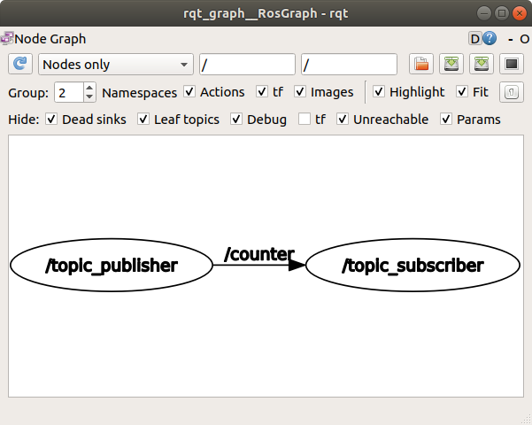

# Create ROS Package in Python

ROS 기반의 로봇 프로그래밍의 핵심은 노드들 사이의 통신을 활용하는 것이다. 통신 방법에는 토픽, 서비스, 액션 세 가지 방법이 있는데 여기서는 토픽과 서비스의 기본적인 사용방법과 새로운 메시지 타입을 만들어 통신하는 방법을 알아볼 것이다. ROS 메시지들은 `int32, float32, string` 등과 같은 기본 타입들의 조합으로 구성되며 기본 타입으로 만들어진 메시지를 묶어서 고수준의 메시지를 만들수도 있다. 기본 메시지 타입은 이곳(<http://wiki.ros.org/msg>)에서 확인할 수 있다. 

토픽 메시지는 패키지의 `msg` 디렉토리 아래 `.msg` 파일 형식으로 저장되어야 하고 서비스 메시지는 `srv` 디렉토리 아래 `.srv` 파일 형식으로 저장되어야 한다. 메시지 타입 빌드에 관한 공식 튜토리얼은 이곳(<http://wiki.ros.org/ROS/Tutorials/CreatingMsgAndSrv>)에 있다.

# Simple Topic Comm.

## Create Package

가장 단순한 형태의 토픽을 사용하는 예제를 통해 토픽 사용법을 알아볼 것이다. 예제에서는 `std_msgs` 패키지의 `Int32`라는 단순한 정수형 데이터를 보내는 연습을 해본다. 먼저 커맨드에서 `topic_simple`이라는 패키지를 만든다.

```bash
$ cd ~/catkin_ws/src
~/catkin_ws/src$ catkin create pkg topic_simple --catkin-deps rospy std_msgs
```

`catkin create pkg`는 패키지 디렉토리를 만들고자 하는 위치에서 실행해야 한다.  

ROS와 무관한 패키지를 개발할 게 아니라면 `--catkin-deps` 옵션은 필수다. 사용하는 언어별 기본 패키지를 추가해야 한다. C++을 쓰면 `roscpp`를 넣어야 하고 파이썬을 쓰면 `rospy`를 넣어야 한다. `std_msgs`는 기본 메시지 타입을 쓰기 위해 필요한 패키지므로 거의 항상 들어간다.  

다음으로 `script` 디렉토리에 퍼블리셔와 서브스크라이버 노드 역할을 할 두 개의 파이썬 스크립트를 만든다. 꼭 `script`라는 디렉토리가 아니라 프로젝트 루트나 다른 디렉토리 명에 저장해도 상관없다. 그리고 실행 권한을 줘야 하는데 `rosrun`으로 노드 실행시 `python script.py`처럼 파이썬 인터프리터를 통해서 실행하는 게 아니라 `./script.py`와 같이 스크립트 자체를 실행하는 것이므로 실행 권한을 부여해야한다.

```bash
~/catkin_ws/src/topic_simple$ cd topic_simple
~/catkin_ws/src/topic_simple$ mkdir script
~/catkin_ws/src/topic_simple/scripts$ cd script
~/catkin_ws/src/topic_simple/scripts$ touch topic_publisher.py topic_subscriber.py
~/catkin_ws/src/topic_simple/scripts$ chmod a+x topic_publisher.py topic_subscriber.py
```


## Scripts

### package.xml

패키지 정보는 자동 생성된 틀을 거의 그대로 쓰면 된다. 아래의 내용을 자신에 맞게 수정해보자.

```xml
<?xml version="1.0"?>
<package format="2">
  <name>topic_simple</name>
  <version>0.1.0</version>
  <description>The topic_simple package</description>
  <maintainer email="email@email.com">ian</maintainer>
  <license>BSD</license>

  <buildtool_depend>catkin</buildtool_depend>
  <build_depend>rospy</build_depend>
  <build_depend>std_msgs</build_depend>
  <build_export_depend>rospy</build_export_depend>
  <build_export_depend>std_msgs</build_export_depend>
  <exec_depend>rospy</exec_depend>
  <exec_depend>std_msgs</exec_depend>
</package>
```

### CMakeLists.txt

cmake는 원래 C/C++ 소스를 빌드하기 위해 있는 것이지만 ROS에서는 패키지를 관리하는 기능도 하기 때문에 아래 네 줄은 반드시 필요하다. `find_package()`를 통해 이 패키지가 의존하는 다른 패키지를 지정할 수 있고 `catkin_package()`를 실행해야 이후  `rosrun`으로 이 패키지의 실행 파일을 노드로서 실행할 수 있다.

```cmake
cmake_minimum_required(VERSION 2.8.3)
project(topic_simple)
find_package(catkin REQUIRED COMPONENTS
  rospy
  std_msgs
)
catkin_package(
  CATKIN_DEPENDS rospy std_msgs
)
```

### topic_publisher.py

다음은 토픽을 발행하는 노드를 구현한 파이썬 스크립트다.

```python
#!/usr/bin/env python

import rospy
from std_msgs.msg import Int32

rospy.init_node('topic_publisher')
pub = rospy.Publisher('counter', Int32, queue_size=1)
rate = rospy.Rate(2)
count = 0
while not rospy.is_shutdown():
    pub.publish(count)
    print "publish: %d" % count
    count += 1
    rate.sleep()
```

한 줄 씩 의미를 살펴보자.  

```python
#!/usr/bin/env python
```

스크립트의 맨 위에 있는 `#!`으로 시작하는 라인을 shebang이라고 한다. 이 스크립트를 어떤 인터프리터로 실행할 것인지를 명시적으로 지정한다. 보통 쉘 스크립트에서 `#!/usr/bin/bash`와 같이 명시적으로 인터프리터의 절대 경로를 지정한다. `/usr/bin/env python`은 시스템의 기본 파이썬을 쓰겠다는 것이다. 시스템 기본 파이썬은 보통 `/usr/bin/python`인데 시스템에 따라 위치가 다를 수 있으니 `env` 명령어와 같이 쓰면 `which python`으로 찾을 수 있는 시스템의 기본 파이썬 인터프리터를 실행해준다. 

```python
import rospy
from std_msgs.msg import Int32
```

`rospy`는 파이썬에서 ROS 기능을 쓸 수 있게 해주는 다양한 함수와 클래스를 담고 있는 패키지다. `std_msgs`는 기본 메시지 타입을 가지고 있는 패키지인데 그 중에서 `Int32`라는 데이터 타입만 import 하였다.

```python
rospy.init_node('topic_publisher')
pub = rospy.Publisher('counter', Int32, queue_size=1)
```

`rospy.init_node()`는 이 실행 파일을 ROS의 노드로 만들어준다. 여기에 들어가는 인자는 노드의 기본 네임(Name)이다. 실행할 때 네임을 바꾸지 않으면 이 `topic_publisher`라는 이름으로 노드가 생성된다.  

`rospy.Publisher()`는 퍼블리셔 객체를 만들어준다. 입력인자로 발행할 토픽의 네임(counter), 메시지 타입(Int32), queue_size(1)가 들어간다. queue_size는 ROS가 데이터를 보내는 속도보다 코드에서 퍼블리시를 실행하는 속도가 빨라서 전송되지 못한 메시지가 쌓일 경우 최대 몇 개까지 쌓아둘지를 결정한다.

```python
rate = rospy.Rate(2)
count = 0
while not rospy.is_shutdown():
    pub.publish(count)
    print "publish: %d" % count
    count += 1
    rate.sleep()
```

이후 while문을 통해 주기적으로 데이터를 발행한다. 발행 주기를 조절하기 위해 `rospy.Rate(2)`으로 주기 객체를 생성하고 (초당 2회) while문 안에서 `rate.sleep()`을 통해 주기에 해당하는 시간만큼 정지하여 속도를 조절한다.

위에서 만든 퍼블리셔 객체 `pub`에서 `publish()` 함수를 실행하여 데이터를 전송한다. 이때 입력인자의 데이터 타입이 퍼블리셔를 만들때 지정한 데이터 타입(`Int32`)과 일치해야한다.


### topic_subscriber.py

다음은 토픽을 구독하는 노드를 구현한 스크립트다.

```python
#!/usr/bin/env python
import rospy
from std_msgs.msg import Int32

def callback(msg):
    print "subscribe: %d" % msg.data

rospy.init_node('topic_subscriber')
sub = rospy.Subscriber('counter', Int32, callback)
rospy.spin()
```

한 줄씩 의미를 알아보자. 위 세 줄은 `topic_publisher.py`와 같다.

```python
rospy.init_node('topic_subscriber')
sub = rospy.Subscriber('counter', Int32, callback)
rospy.spin()
```

퍼블리셔와 마찬가지로 서브스크라이버 노드도 `rospy.init_node()`를 통해 프로세스를 ROS 노드로 등록해야한다. `rospy.Subscriber()`로 서브스크라이버 객체(`sub`)를 만드는데 인자로 구독할 토픽의 네임(counter), 토픽의 메시지 타입(Int32), 메시지가 왔을 때 이를 처리할 콜백 함수(callback)을 지정한다. 콜백 함수는 메시지가 도착할 때마다 실행된다. `ros.spin()`는 콜백 함수를 기다리는 동안 프로세스가 종료되지 않도록 잡아두는 역할을 한다.


## Build and Run

코드와 패키지 설정 파일을 작성했다면 이제 패키지를 빌드하고 실행해봐야 한다. 워크스페이스 디렉토리에서 `catkin build` 명령어를 통해 패키지 전체를 일괄 빌드할 수 있다. 새로운 패키지를 실행 후에는 `~/catkin/devel/setup.bash`를 실행해야 `rosrun`에서 해당 패키지를 찾을 수 있다. 이미 `~/.bashrc`에 실행 명령을 추가했기 때문에 새로운 터미널을 열어도 같은 효과를 낼 수 있다.

```bash
$ cd ~/catkin_ws
~/catkin_ws$ catkin build
~/catkin_ws$ source devel/setup.bash
```

아래 네 줄의 명령어를 각기 다른 탭에서 실행하여 스크립트가 정상작동하는지 확인해보자.

```bash
$ roscore
# 새 탭
$ rosrun topic_simple topic_publisher.py
# 새 탭
$ rosrun topic_simple topic_subscriber.py
# 새 탭
$ rqt_graph
```

`rqt_graph`를 통해 현재 실행되고 있는 노드의 네임과 그 사이를 연결하는 토픽의 네임을 확인할 수 있다.




# Custom Topic Comm.

## Create Package

이번에는 직접 정의한 메시지 타입을 만들어서 사용해보도록 하자. 새로운 패키지 `topic_custom`는 로봇의 포즈(Pose)를 시간과 함께 메시지를 발행할 것이며 이를위해 다음 요소들을 만들것이다.

- TimePose.msg: 사용자 정의 메시지 타입
- custom_publisher.py: "TimePose" 타입의 데이터를 발행하는 노드
- custom_subscriber.py: "TimePose" 타입의 데이터를 구독하는 노드

`geometry_msgs` 패키지에 포함된 메시지 타입을 이용해 사용자 정의 메시지 타입을 만들 것이다. 패키지를 생성할 때 `geometry_msgs`와 메시지 생성을 위한 `message_generation`을 `--catkin-deps`에 추가해야한다.

```bash
$ cd ~/catkin_ws/src
~/catkin_ws/src$ catkin create pkg topic_custom --catkin-deps rospy std_msgs geometry_msgs message_generation
```

이번에는 노드 파일 뿐만 아니라 `TimePose.msg`라는 메시지 파일도 `msg`라는 디렉토리 아래 만들어준다.

```bash
~/catkin_ws/src$ cd topic_custom
~/catkin_ws/src/topic_custom$ mkdir script msg
~/catkin_ws/src/topic_custom$ touch msg/TimePose.msg
~/catkin_ws/src/topic_custom$ cd script
~/catkin_ws/src/topic_custom/script$ touch custom_publisher.py custom_subscriber.py
~/catkin_ws/src/topic_custom/script$ chmod a+x custom_publisher.py custom_subscriber.py
```


## Scripts

### package.xml

패키지 생성을 통해 자동으로 만들어진 `package.xml`에서 주석을 지우고 패키지 정보를 수정한 것이다. 자동생성된 파일에는 마지막의 `<exec_depend>message_runtime</exec_depend>`이 없으니 추가해야한다.

```xml
<?xml version="1.0"?>
<package format="2">
  <name>topic_custom</name>
  <version>0.1.0</version>
  <description>The topic_custom package</description>
  <maintainer email="ian@mail.com">ian</maintainer>
  <license>BSD</license>

  <buildtool_depend>catkin</buildtool_depend>
  <build_depend>geometry_msgs</build_depend>
  <build_depend>message_generation</build_depend>
  <build_depend>rospy</build_depend>
  <build_depend>std_msgs</build_depend>
  <build_export_depend>geometry_msgs</build_export_depend>
  <build_export_depend>rospy</build_export_depend>
  <build_export_depend>std_msgs</build_export_depend>
  <exec_depend>geometry_msgs</exec_depend>
  <exec_depend>rospy</exec_depend>
  <exec_depend>std_msgs</exec_depend>
  <exec_depend>message_runtime</exec_depend>
</package>
```

### CMakeLists.txt

`topic_simple` 패키지에 비해 추가된 것은 `add_message_files()`와 `generate_messages()`이다. 각각 메시지 파일을 빌드 타겟에 추가하고 의존 메시지를 지정하는 함수다. 유의할 점은 자동생성된 파일에는 `CATKIN_DEPENDS` 옆에 `message_generation`이 있는데 이를 지워야 에러가 나지 않는다. `catkin_package()` 함수는 다른 패키지가 빌드된 `topic_custom` 패키지를 사용할 때 필요한 의존 패키지인데 빌드가 되고나면 `message_generation`이 필요없게 된다.

```cmake
cmake_minimum_required(VERSION 2.8.3)
project(topic_custom)

find_package(catkin REQUIRED COMPONENTS
  geometry_msgs
  message_generation
  rospy
  std_msgs
)

# Generate messages in the 'msg' folder
add_message_files(
  FILES
  TimePose.msg
)
# Generate added messages and services with any dependencies listed here
generate_messages(
  DEPENDENCIES
  geometry_msgs
  std_msgs
)
catkin_package(
  CATKIN_DEPENDS geometry_msgs rospy std_msgs
)
```

### TimePose.msg

메시지 타입을 정의하는 파일이다. `msg` 디렉토리에 있어야 한다. 여기서는 기본 타입인 `time`과 기본 타입으로 만들어진 메시지 타입 `geometry_msgs/Pose2D`을 조합한 `TimePose`라는 메시지 타입을 만들었다.

```
time timestamp
geometry_msgs/Pose2D pose
```

`geometry_msgs/Pose2D`라는 메시지 타입을 확인해보자. x, y, theta로 좌표와 방향으로 로봇의 2차원 포즈(Pose, 자세)를 나타낸다.

```bash
$ rosmsg info geometry_msgs/Pose2D
float64 x
float64 y
float64 theta
```

패키지를 완성하고 나서 `catkin build`를 실행하면 `/home/ian/catkin_ws/devel/lib/python2.7/dist-packages/topic_custom/msg/TimePose.py` 라는 파일이 생긴다. msg 형식으로 만든 메시지 타입으로부터 파이썬 클래스를 자동 생성하여 파이썬 코드에서 사용할 수 있게 해준다.

### custom_publisher.py

`TimePose` 타입의 데이터를 발행하는 노드를 다음과 같이 구현하였다.

```python
#!/usr/bin/env python
import rospy
from geometry_msgs.msg import Pose2D
from topic_custom.msg import TimePose

rospy.init_node('custom_publisher')
pub = rospy.Publisher('custom_msg', TimePose, queue_size=1)
msg = TimePose()
rate = rospy.Rate(1)
while not rospy.is_shutdown():
    msg.timestamp = rospy.get_rostime()
    second = msg.timestamp.secs
    msg.pose = Pose2D(x=second%4, y=second%7, theta=second%5)
    pub.publish(msg)
    print "publish:", msg.timestamp.secs%100, msg.pose.x, msg.pose.y, msg.pose.theta
    rate.sleep()
```

전체적인 구조는 `topic_publisher.py`와 유사하다.

```python
#!/usr/bin/env python
import rospy
from geometry_msgs.msg import Pose2D
from topic_custom.msg import TimePose
```

`topic_custom` 패키지는 `catkin build`를 실행해야 만들어지지만 일단 먼저 사용한다. `topic_custom`으로부터 발행할 메시지 타입인 `TimePose`라는 클래스 타입을 가져왔다. `TimePose`를 만들기 위해 내부인자의 타입인 `Pose2D`도 가져온다.

```python
rospy.init_node('custom_publisher')
pub = rospy.Publisher('custom_msg', TimePose, queue_size=1)
```

"custom_publisher"라는 노드를 만들고 "custom_msg"라는 토픽으로 `TimePose` 타입의 데이터를 발행하는 객체를 생성한다.

```python
msg = TimePose()
rate = rospy.Rate(1)
while not rospy.is_shutdown():
    msg.timestamp = rospy.get_rostime()
    second = msg.timestamp.secs
    msg.pose = Pose2D(x=second%4, y=second%7, theta=second%5)
    pub.publish(msg)
    print "publish:", msg.timestamp.secs%100, msg.pose.x, msg.pose.y, msg.pose.theta
    rate.sleep()
```

메시지를 발행하는 라인들만 보면 간단하다. `TimePose` 타입의 객체를 만들고 (`msg = TimePose()`) 객체의 두 가지 데이터(`timestamp, pose`)를 채운 뒤 메시지를 발행하였다. (`pub.publish(msg)`)

### custom_subscriber.py

`TimePose` 타입의 데이터를 구독하는 노드를 다음과 같이 구현하였다.

```python
#!/usr/bin/env python
import rospy
from topic_custom.msg import TimePose

def callback(msg):
    print "subscribe:", msg.timestamp.secs%100, msg.pose.x, msg.pose.y, msg.pose.theta

rospy.init_node('custom_subscriber')
sub = rospy.Subscriber('custom_msg', TimePose, callback)
rospy.spin()
```

메시지 타입만 변했을 뿐 `topic_subscriber.py`와 매우 유사하다. 퍼블리셔와 서브스크라이버 사이에 맞춰야 하는 것은 `TimePose`라는 메시지 타입과 "custom_msg"라는 토픽 네임이다. 


## Build and Run

이제 패키지를 빌드하고 실행할 수 있다. `catkin build`를 통해 빌드 후 `~/catkin/devel/setup.bash`를 실행해야 한다. 

```bash
$ cd ~/catkin_ws
~/catkin_ws$ catkin build
~/catkin_ws$ source devel/setup.bash
```

아래 네 줄의 명령어를 각기 다른 탭에서 실행하여 스크립트가 정상작동하는지 확인해보자.

```bash
$ roscore
# 새 탭
$ rosrun topic_custom custom_publisher.py
# 새 탭
$ rosrun topic_custom custom_subscriber.py
# 새 탭
$ rqt_graph
```

`rqt_graph`를 통해 현재 실행되고 있는 노드의 네임과 그 사이를 연결하는 토픽의 네임을 확인할 수 있다.

> Note: 반드시 퍼블리셔 노드, 서브스크라이버 노드, 메시지 파일이 하나의 패키지 안에 있어야 서로 통신할 수 있는 것은 아니다. 각각 다른 패키지에 있어도 의존성만 잘 명시해준다면 상관없다.

다음은 `custom_publisher.py`를 실행한 결과다.

```
$ rosrun topic_custom custom_publisher.py 
publish: 57 1 3 2
publish: 58 2 4 3
publish: 59 3 5 4
publish: 60 0 6 0
publish: 61 1 0 1
publish: 62 2 1 2
publish: 63 3 2 3
publish: 64 0 3 4
publish: 65 1 4 0
...
```

다음은 `custom_subscriber.py`를 실행한 결과다. `Pose2D`의 데이터 타입이 `float64`라서 소수점이 표시된다.

```
$ rosrun topic_custom custom_subscriber.py 
subscribe: 59 3.0 5.0 4.0
subscribe: 60 0.0 6.0 0.0
subscribe: 61 1.0 0.0 1.0
subscribe: 62 2.0 1.0 2.0
subscribe: 63 3.0 2.0 3.0
subscribe: 64 0.0 3.0 4.0
subscribe: 65 1.0 4.0 0.0
...
```


# Custom Service Comm.

## Create Package

토픽을 써봤다면 서비스도 다뤄봐야한다. 서비스의 일회성 통신을 이용하여 간단한 더하기 연산을 해주는 서버를 구현할 것이다. 먼저 `service_custom` 패키지와 내부 파일들을 만들어보자. 서비스는 메시지에 비해서 다양하지 않으므로 보통 타입을 직접 만들어서 쓴다. `--catkin-deps`에는 기본 타입인 `Int32`를 쓰기 위해 `std_msgs`를 추가하고 새로운 서비스 타입을 만들기 위해 `message_generation`도 추가한다.

```bash
$ cd ~/catkin_ws/src
~/catkin_ws/src$ catkin create pkg service_custom --catkin-deps rospy std_msgs message_generation
~/catkin_ws/srcl$ cd service_custom/
~/catkin_ws/src/service_custom$ mkdir srv script
~/catkin_ws/src/service_custom$ touch srv/AddTwoNum.srv
~/catkin_ws/src/service_custom$ cd script
~/catkin_ws/src/service_custom/script$ touch service_server.py service_client.py
~/catkin_ws/src/service_custom/script$ chmod a+x service_server.py service_client.py
```


## Scripts

### package.xml

`topic_custom`과 마찬가지로 기본 생성된 `package.xml`에 패키지 정보를 수정하고 `<exec_depend>message_runtime</exec_depend>`를 추가하였다.

```xml
<?xml version="1.0"?>
<package format="2">
  <name>service_custom</name>
  <version>0.1.0</version>
  <description>The service_custom package</description>
  <maintainer email="ian@email.com">ian</maintainer>
  <license>BSD</license>

  <buildtool_depend>catkin</buildtool_depend>
  <build_depend>message_generation</build_depend>
  <build_depend>rospy</build_depend>
  <build_depend>std_msgs</build_depend>
  <build_export_depend>rospy</build_export_depend>
  <build_export_depend>std_msgs</build_export_depend>
  <exec_depend>rospy</exec_depend>
  <exec_depend>std_msgs</exec_depend>
  <exec_depend>message_runtime</exec_depend>
</package>
```


### CMakeLists.txt

새로운 서비스 메시지 타입을 만들기 위해 `add_service_files()`로 서비스 정의 파일을 지정하였다. `CATKIN_DEPENDS` 옆에 붙어있던 `message_generation`은 삭제한다.

```cmake
cmake_minimum_required(VERSION 2.8.3)
project(service_custom)

find_package(catkin REQUIRED COMPONENTS
  message_generation
  rospy
  std_msgs
)

# Generate services in the 'srv' folder
add_service_files(
  FILES
  AddTwoNum.srv
)
# Generate added messages and services with any dependencies listed here
generate_messages(
  DEPENDENCIES
  std_msgs
)
catkin_package(
  CATKIN_DEPENDS rospy std_msgs
)
```


### AddTwoNum.srv

서비스 메시지 타입을 지정한다. 서비스는 클라이언트에서 데이터를 먼저 보내면서 처리를 요청하는 **Request** 타입과 서버에서 처리되 결과를 회신하는 **Response** 타입이 있다.  `---` 위에 있는 부분이 Request 타입이고 아래 부분이 Response 타입이다. 

```
int32 a
int32 b
---
int32 sum
```

패키지 완성 후 `catkin build`를 하면 `~/catkin_ws/devel/lib/python2.7/dist-packages/<package_name>/srv`에 서비스 메시지 타입을 클래스로 정의하는 파이썬 스크립트가 자동생성된다. 여기에는 세 가지 클래스가 정의되어있다.

- <service_name>Request : 클라이언트에서 보내는 요청 타입을 정의한 클래스
- <service_name>Response : 서버에서 보내는 응답 타입을 정의한 클래스
- <service_name> : 요청 클래스와 응답 클래스를 멤버 변수로 가진 클래스

이 패키지 같은 경우 `~/catkin_ws/devel/lib/python2.7/dist-packages/service_custom/srv/_AddTwoNum.py` 파일이 생기고 이 파일에는 `AddTwoNumRequest, AddTwoNumResponse, AddTwoNum`까지 총 세 개의 클래스가 정의되어 있다.


### service_server.py

다음은 서비스 서버를 구현한것이다. 서버는 데이터를 받는 입장이기 때문에 코드가 `topic_subscriber.py`와 유사하다.

```python
#!/usr/bin/env python
import rospy
from service_custom.srv import AddTwoNum, AddTwoNumResponse

def service_callback(request):
    response = AddTwoNumResponse(sum=request.a + request.b)
    print "request data:", request.a, request.b, ", response:", response.sum
    return response

rospy.init_node('service_server')
service = rospy.Service('add_two_number', AddTwoNum, service_callback)
rospy.spin()
```

부분별로 나눠서 살펴보자.

```python
#!/usr/bin/env python
import rospy
from service_custom.srv import AddTwoNum, AddTwoNumResponse
```

이후 사용을 위해 서비스 타입인 `AddTwoNum`과 서비스 응답 타입인 `AddTwoNumResponse`를 가져왔다.

```python
rospy.init_node('service_server')
service = rospy.Service('add_two_number', AddTwoNum, service_callback)
rospy.spin()
```

서버 노드를 초기화하고 `rospy.Service()` 객체를 생성하여 노드가 처리할 서비스를 등록한다. 서비스 네임은 "add_two_number"이고 서비스 타입은 `AddTwoNum`이다. 서비스 요청시 `service_callback`라는 함수에서 이를 처리하여 응답을 준다. 프로그램이 종료하지 않도록 `rospy.spin()`를 추가하였다.


### service_client.py

서비스 클라이언트는 토픽 퍼블리셔처럼 정기적으로 무한히 계속 보내지 않고 특정 조건이 맞을 때만 일회성으로 요청을 보낸다.

```python
#!/usr/bin/env python
import rospy
from service_custom.srv import AddTwoNum, AddTwoNumRequest

rospy.init_node('service_client')
rospy.wait_for_service('add_two_number')
requester = rospy.ServiceProxy('add_two_number', AddTwoNum)
print "requester type:", type(requester), ", callable?", callable(requester)
rate = rospy.Rate(10)
count = 0
while count < 100:
    if count % 10 == 0:
        req = AddTwoNumRequest(a=count, b=count/2)
        res = requester(req)
        print count, "request:", req.a, req.b, "response:", res.sum
    rate.sleep()
    count += 1
```

부분별로 나눠서 살펴보자.

```python
#!/usr/bin/env python
import rospy
from service_custom.srv import AddTwoNum, AddTwoNumRequest
```

이후 사용을 위해 서비스 타입인 `AddTwoNum`과 서비스 요청 타입인 `AddTwoNumRequest`를 가져왔다.

```python
rospy.init_node('service_client')
rospy.wait_for_service('add_two_number')
requester = rospy.ServiceProxy('add_two_number', AddTwoNum)
```

클라이언트 노드를 초기화하고 "add_two_number"라는 서비스를 처리하는 서버가 나타날때까지 기다린다. 서버가 생기기 전에 다음 줄을 실행하면 예외가 발생한다. `rospy.ServiceProxy()`는 서버에 요청을 보내는 callable class 객체를 생성해준다. **서버와 클라이언트의 서비스 네임과 서비스 타입을 동일하게 맞춰야한다.**

```python
while count < 100:
    if count % 10 == 0:
        req = AddTwoNumRequest(a=count, b=count/2)
        res = requester(req)
```

count가 100 이하인 동안 10의 배수가 될때마다 "add_two_number" 서비스 요청을 보낸다. 요청 타입인 `AddTwoNumRequest` 객체를 만들어 `a, b` 두 요청 값을 입력하고 `requester`를 통해 요청을 보낸다. 서버의 응답은 `requester`의 리턴 값으로 바로 받을 수 있다.  

즉, 서버에 요청을 보내고 이를 처리해서 응답을 받을 때까지 `res = requester(req)` 이 라인에 묶여있다는 뜻이다. 그래서 서버의 콜백 함수는 가급적 처리시간이 짧게 구현하는 것이 좋다. 처리시간이 긴 요청은 액션을 통해 처리하는 것이 낫다.


## Build and Run

이제 패키지를 빌드하고 실행할 수 있다. `catkin build`를 통해 빌드 후 `~/catkin/devel/setup.bash`를 실행해야 한다. 

```bash
$ cd ~/catkin_ws
~/catkin_ws$ catkin build
~/catkin_ws$ source devel/setup.bash
```

아래 명령어를 각기 다른 탭에서 실행하여 스크립트가 정상작동하는지 확인해보자.

```bash
$ roscore
# 새 탭
$ rosrun service_custom service_server.py
# 새 탭
$ rosrun service_custom service_client.py
```

다음은 `service_server.py`를 실행한 결과다.

```
$ rosrun service_custom service_server.py 
request data: 0 0 , response: 0
request data: 10 5 , response: 15
request data: 20 10 , response: 30
request data: 30 15 , response: 45
request data: 40 20 , response: 60
request data: 50 25 , response: 75
request data: 60 30 , response: 90
request data: 70 35 , response: 105
request data: 80 40 , response: 120
request data: 90 45 , response: 135
```

다음은 `custom_subscriber.py`를 실행한 결과다. 서버와 같은 값을 출력하는 것을 볼 수 있다.

```
$ rosrun service_custom service_client.py 
requester type: <class 'rospy.impl.tcpros_service.ServiceProxy'> , callable? True
0 request: 0 0 response: 0
10 request: 10 5 response: 15
20 request: 20 10 response: 30
30 request: 30 15 response: 45
40 request: 40 20 response: 60
50 request: 50 25 response: 75
60 request: 60 30 response: 90
70 request: 70 35 response: 105
80 request: 80 40 response: 120
90 request: 90 45 response: 135
```

