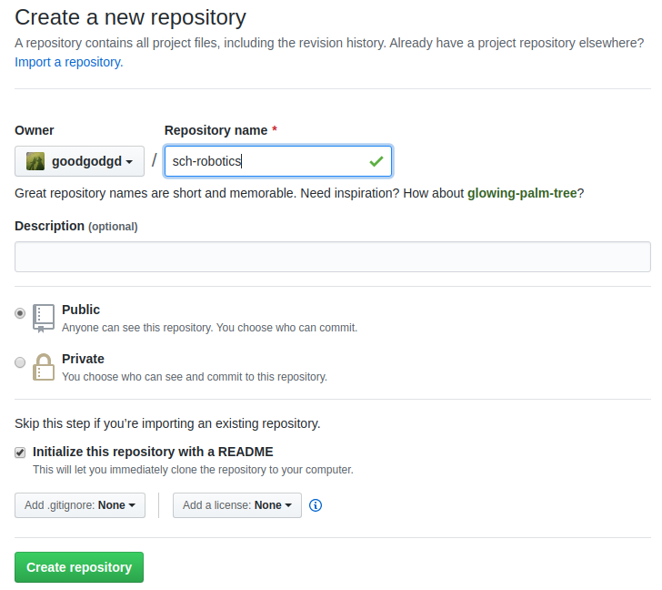

# Introduction to Git

Git에 대한 내용은 마이크로프로세서 강의자료에서 대부분의 내용을 차용한다. 마이크로프로세서가 완전한 내용이고 여기서는 그 내용을 요약해서 다룬다. 여기 내용 외에 더 깊이 알고 싶다면 다음 포스트들을 참고한다.

- [Let's Git it!](https://goodgodgd.github.io/ian-lecture/archivers/git-intro) : git을 소개하고 기초 명령어들을 실습해본다.
- [Git into the Git](https://goodgodgd.github.io/ian-lecture/archivers/git-detail) : git을 이해하는데 필요한 개념 설명과 git 명령어들의 사용법이 자세히 정리되어있다.
- [Manage Project](https://goodgodgd.github.io/ian-lecture/archivers/manage-project) : 실제 마이크로프로세서를 위한 코드를 git을 통해 관리하는 실습과 설명이다.
- [Branch and Merge](https://goodgodgd.github.io/ian-lecture/archivers/git-branch) : git의 branch를 활용하는 방법을 알아본다.


## 1. Git 설치

윈도우에서는 Git 설치파일을 받아서 설치를 해야하는데 리눅스에서는 한 줄이면 끝난다.

```bash
$ sudo apt install git
```


## 2. About Git

**버전 관리 시스템**은  파일의 변화를 시간에 따라 기록하여 과거 특정 시점의 버전을 다시 불러올 수 있는 시스템이다. 일반적으로 (혹은 자연발생적으로) 사람들이 많이 쓰는 방법은 여러 버전의 파일을 따로 저장하는 것이다. 작업 중이던 파일에 큰 변경사항을 주고 싶은데 이전 버전은 남기고 싶을 때, 파일명에 버전명과 대략의 수정사항을 넣어서 사본을 만든다. 바로 이렇게.


문서 같은 경우는 딱히 다른 방법도 없고 이 방법도 잘 작동한다. 반면 프로그램 소스 코드는 워낙 수정이 잦고 여러 사람이 공동으로 작업하는 경우가 많기 때문에 혼자 취미로 개발하는게 아니라면 이렇게는 관리할 수 없다. 그래서 소스코드를 작업한 메시지와 함께 버전별로 저장하는 데이터베이스 비슷한 시스템이 나타나기 시작했고 `CVS, Subversion, Perforce` 등의 중앙집중식 버전 관리 시스템(CVCS, Centralized Version Control System)이 유행했다. 중앙집중식이라는 것은 하나의 서버에서 여러 사람이 작업한 이력을 모두 가지고 있고 각 client는 서버를 통해 다른 사람이 올린 내용을 받아볼 수 있었다.  

CVCS의 단점은 중앙 서버가 고장나면 모두가 망한다는 것이다. 그래서 나온게 분산 버전 관리 시스템(DVCS, Distributed Version Control System)이다. DVCS는 각 로컬 저장소에 모든 사람의 모든 이력이 다 저장되기 때문에 서버가 폭발한다고 해도 데이터 손실이 없다. DVCS로는 ` Git, Mecurial, Bazaar, Darcs` 등이 있었(다고 전해지)는데 지금은 Git의 점유율이 압도적이다. 왜 그럴까?  

소스 코드의 버전 관리는 소수가 개발하는 프로젝트에서도 고민거리인데 전세계에서 수백명이 개발하던 리눅스 커널 개발도 많은 고민을 했을 것이다. 1991년 태어난 리눅스는 2002년부터 BitKeeper라는 DVCS로 관리를 하다가 BitKeeper가 유료화되면서 리눅스 창시자인 **리누즈 토발즈(Linus Torvalds)**님께서 직접 버전관리 시스템을 만들었다. ~~신계에 오른~~ 최고의 개발자가 대규모 프로젝트를 염두해두고 만들었으니 당연히 성능이 좋았다. Git의 장점을 요약하면

- 대규모 프로젝트를 관리하더라도 **속도가 빠르고 적은 용량**을 유지
- 단순한 구조 (델타가 아닌 스냅샷)
- 동시 다발적인 브랜치 분기와 병합을 통한 효과적인 분산 개발시스템 제공
- 오프라인에서도 과거 이력 조회와 commit 가능
- ... 등 다 적을 수 없다.

그러나 Git에 대한 이러한 찬양은 구식 시스템을 써본 옛날 사람의 "옛날에는 말이야~" 라는 식이라서 Git으로 버전 관리를 시작하는 젊은이들은 공감하기 어렵다. (CVCS가 전화기라면 Git은 스마트폰이다. 요즘 아이들은 스마트폰이 없던 세상을 공감할 수 없다.)  오늘날에는 Git이 공기처럼 당연히 쓰이고 있으므로 소프트웨어를 개발하는 사람이라면 당연히 Git을 쓸 줄 알아야 한다.


## 3. About GitHub

Git은 혼자 쓸 때는 단순히 버전 관리 시스템이지만 팀으로 사용할 때는 여러 사람들 사이의 협업 툴이다. 여러 사람이 작업한 결과를 자동으로 병합해주고 병합 과정에서 conflict가 있으면 개발자가 이를 해결하도록 유도한다. 모든 개발자가 한 근무지에서 개발하는 것이 아니라 근무지가 서로 다르거나 아니면 혼자 개발하더라도 여러 곳을 옮겨 다니면서 개발한다면 언제 어디서나 인터넷을 통해 접근할 수 있는 온라인 저장소가 필수다. 그래서 2007년 온라인 저장소인 GitHub 서비스가 시작되었고 이름처럼 Git과 GitHub은 찰떡이다. GitHub은 단순히 온라인 저장소만 지원하는게 아니라 GitHub에서 소스 코드 작성 및 변경, 브랜치 병합 등을 할 수 있으며 개발자들에게 유용한 다양한 툴들을 지원한다. (코드 변경점 시각화, 이슈 게시판, 위키 문서 등) 이만큼 얘기했으면 군소리 말고 들어가서 가입(Sign up)해보자. 가입 절차도 매우 간단하다.

<https://github.com/>


# Git / Github Basics

## 1. 저장소 만들기

깃헙(GitHub)에 로그인해서 들어가보면 다음과 같은 화면이 나온다. 이제막 회원 가입을 했다면 아무것도 없겠지만 쓰다보면 왼쪽에는 저장소 목록이 나오고 오른쪽에는 최근 활동들이 보인다. 


상단의 초록색 `New` 버튼을 눌러 새로운 저장소를 만들어보자. 저장소 이름은 자유롭게 지어도 된다. 이 강의자료에서는 `sch-robotics`이라는 저장소를 사용하겠다. 만들때 아래쪽의 **"Initialize this repository with a README"를 꼭 체크**해주자.




## 2. 저장소 내용 수정하기

보통 깃헙에 만든 저장소를 "원격(Remote)" 저장소라하고 이 저장소를 PC에 내려받아 실제 작업이 일어나는 저장소를 "로컬(Local)" 저장소라 한다. 깃헙을 활용하는 가장 단순한 흐름은 다음과 같다.

1. `git clone`: 원격 저장소를 복사한 로컬 저장소를 만든다.
2. `git add` : 로컬 저장소에서 작업한 내용을 스테이지(stage)한다.
3. `git commit` : 스테이지한 전체 소스의 상태를 커밋(commit)으로 저장한다.
4. `git push` : 커밋을 원격 저장소로 올린다.

여기서는 `sch-robotics`를 저장소 이름으로 사용한다. 다른 이름으로 만든 경우 그 이름에 맞춰 진행하면 된다.

### git clone

> `git clone <repository_url> [dir_name]` : `repository_url` 주소의 원격 저장소를 복사한다. 기본적으로는 저장소 이름과 같은 디렉토리가 생기고 뒤에 `dir_name`을 지정하면 그 이름으로 디렉토리가 생긴다.

방금 깃헙에 만든 원격 저장소를 소스 공간에 복제해보자. 저장소 디렉토리가 생겼는지 확인하고 그곳으로 이동한다.

```bash
$ cd ~/catkin_ws/src
$ git clone https://github.com/<your-repository>
$ ls
$ cd sch-robotics
```


### git configure

> Git에 대한 설정을 변경할 수 있는 명령어. 설정할 수 있는 변수가 수백가지지만 대부분은 사용자 등록 정도만 사용한다.
>
> `git config [--global] user.name <name>` : 사용자 이름을 등록한다. `--global` 옵션을 쓰면 이 PC의 모든 로컬 저장소에 기본 사용자가 된다. `--global`을 빼면 현재 저장소에만 적용이 된다.
>
> `git config [--global] user.email <email>`: 사용자의 이메일을 등록한다. `--global`의 용도는 위와 같다.
>
> `git config [--global] --list` : Git의 모든 설정 정보를 조회한다. `--global`을 쓰면 `--global` 옵션을 주고 설정한 전역 설정 정보를 조회한다.

git으로 코드 변경사항을 저장할 때 변경을 만든 사람이 누구인지도 함께 기록해야한다. 그래서 사용자 등록을 미리 해야한다. `--global`로 한번 설정 해두면 그 PC에서는 다시 할 필요없다.

```bash
$ git config --global user.name <name>
$ git config --global user.email <email>
```


### git add

> 지정한 파일(들)의 최신 상태를 인덱스에 업데이트한다. Untracked나 Modified 상태의 파일을 stage하여 다음 commit에 변경사항이 들어갈 수 있게 준비한다.
>
> `git add <filename>` : 특정 파일을 stage 한다.
>
> `git add <pattern like *.txt>` : 현재 디렉토리에서 패턴과 일치하는 모든 파일을 stage 한다.
>
> `git add .` or `git add -A`: 현재 디렉토리와 하위 디렉토리의 모든 변경된 파일들을 stage 한다. 

이제 소스코드를 작성하고 변경사항을 스테이지 해보자.

---


```bash
$ cd ~/catkin/src/sch-robotics
$ mkdir git_practice
$ gedit git_pracitce/anything.py
# 내용 작성

```


## 3. 여러곳에서 작업하기


# GitHub and Branch


## Pull Request 만들기


## 브랜치에 PR 반영하기


