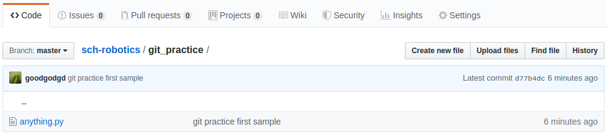
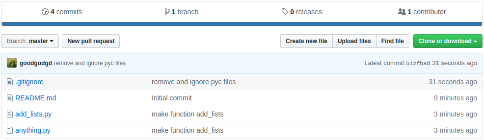

# Introduction to Git

Git에 대한 내용은 마이크로프로세서 강의자료에서 대부분의 내용을 차용한다. 마이크로프로세서 강의자료가 완전한 내용이고 여기서는 그 내용을 요약해서 ROS에 맞춰 수정하였다. 더 깊이 알고 싶다면 다음 포스트들을 참고한다.

- [Let's Git it!](https://goodgodgd.github.io/ian-lecture/archivers/git-intro) : git을 소개하고 기초 명령어들을 실습해본다.
- [Git into the Git](https://goodgodgd.github.io/ian-lecture/archivers/git-detail) : git을 이해하는데 필요한 개념 설명과 git 명령어들의 사용법이 자세히 정리되어있다.
- [Manage Project](https://goodgodgd.github.io/ian-lecture/archivers/manage-project) : 실제 마이크로프로세서를 위한 코드를 git을 통해 관리하는 실습과 설명이다.
- [Branch and Merge](https://goodgodgd.github.io/ian-lecture/archivers/git-branch) : git의 branch를 활용하는 방법을 알아본다.


## 1. Git 설치

윈도우에서는 Git 설치파일을 받아서 설치를 해야하는데 리눅스에서는 한 줄이면 끝난다.

```bash
$ sudo apt install git
```


## 2. About Git

**버전 관리 시스템**은  파일의 변화를 시간에 따라 기록하여 과거 특정 시점의 버전을 다시 불러올 수 있는 시스템이다. 일반적으로 (혹은 자연발생적으로) 사람들이 많이 쓰는 방법은 여러 버전의 파일을 따로 저장하는 것이다. 작업 중이던 파일에 큰 변경사항을 주고 싶은데 이전 버전은 남기고 싶을 때, 파일명에 버전명과 대략의 수정사항을 넣어서 사본을 만든다. 바로 이렇게.


문서 같은 경우는 딱히 다른 방법도 없고 이 방법도 잘 작동한다. 반면 프로그램 소스 코드는 워낙 수정이 잦고 여러 사람이 공동으로 작업하는 경우가 많기 때문에 혼자 취미로 개발하는게 아니라면 이렇게는 관리할 수 없다. 그래서 소스코드를 작업한 메시지와 함께 버전별로 저장하는 데이터베이스 비슷한 시스템이 나타나기 시작했고 `CVS, Subversion, Perforce` 등의 중앙집중식 버전 관리 시스템(CVCS, Centralized Version Control System)이 유행했다. 중앙집중식이라는 것은 하나의 서버에서 여러 사람이 작업한 이력을 모두 가지고 있고 각 client는 서버를 통해 다른 사람이 올린 내용을 받아볼 수 있었다.  

CVCS의 단점은 중앙 서버가 고장나면 모두가 망한다는 것이다. 그래서 나온게 분산 버전 관리 시스템(DVCS, Distributed Version Control System)이다. DVCS는 각 로컬 저장소에 모든 사람의 모든 이력이 다 저장되기 때문에 서버가 폭발한다고 해도 데이터 손실이 없다. DVCS로는 ` Git, Mecurial, Bazaar, Darcs` 등이 있었(다고 전해지)는데 지금은 Git의 점유율이 압도적이다. 왜 그럴까?  

소스 코드의 버전 관리는 소수가 개발하는 프로젝트에서도 고민거리인데 전세계에서 수백명이 개발하던 리눅스 커널 개발도 많은 고민을 했을 것이다. 1991년 태어난 리눅스는 2002년부터 BitKeeper라는 DVCS로 관리를 하다가 BitKeeper가 유료화되면서 리눅스 창시자인 **리누즈 토발즈(Linus Torvalds)**님께서 직접 버전관리 시스템을 만들었다. ~~신계에 오른~~ 최고의 개발자가 대규모 프로젝트를 염두해두고 만들었으니 당연히 성능이 좋았다. Git의 장점을 요약하면

- 대규모 프로젝트를 관리하더라도 **속도가 빠르고 적은 용량**을 유지
- 단순한 구조 (델타가 아닌 스냅샷)
- 동시 다발적인 브랜치 분기와 병합을 통한 효과적인 분산 개발시스템 제공
- 오프라인에서도 과거 이력 조회와 commit 가능
- ... 등 다 적을 수 없다.

그러나 Git에 대한 이러한 찬양은 구식 시스템을 써본 옛날 사람의 "옛날에는 말이야~" 라는 식이라서 Git으로 버전 관리를 시작하는 젊은이들은 공감하기 어렵다. (CVCS가 전화기라면 Git은 스마트폰이다. 요즘 아이들은 스마트폰이 없던 세상을 공감할 수 없다.)  오늘날에는 Git이 공기처럼 당연히 쓰이고 있으므로 소프트웨어를 개발하는 사람이라면 당연히 Git을 쓸 줄 알아야 한다.


## 3. About GitHub

Git은 혼자 쓸 때는 단순히 버전 관리 시스템이지만 팀으로 사용할 때는 여러 사람들 사이의 협업 툴이다. 여러 사람이 작업한 결과를 자동으로 병합해주고 병합 과정에서 conflict가 있으면 개발자가 이를 해결하도록 유도한다. 모든 개발자가 한 근무지에서 개발하는 것이 아니라 근무지가 서로 다르거나 아니면 혼자 개발하더라도 여러 곳을 옮겨 다니면서 개발한다면 언제 어디서나 인터넷을 통해 접근할 수 있는 온라인 저장소가 필수다. 그래서 2007년 온라인 저장소인 GitHub 서비스가 시작되었고 이름처럼 Git과 GitHub은 찰떡이다. GitHub은 단순히 온라인 저장소만 지원하는게 아니라 GitHub에서 소스 코드 작성 및 변경, 브랜치 병합 등을 할 수 있으며 개발자들에게 유용한 다양한 툴들을 지원한다. (코드 변경점 시각화, 이슈 게시판, 위키 문서 등) 이만큼 얘기했으면 군소리 말고 들어가서 가입(Sign up)해보자. 가입 절차도 매우 간단하다.

<https://github.com/>


# Git / Github Basics

## 1. 저장소 만들기

깃헙(GitHub)에 로그인해서 들어가보면 다음과 같은 화면이 나온다. 이제 막 회원 가입을 했다면 아무것도 없겠지만 쓰다보면 왼쪽에는 저장소 목록이 나오고 오른쪽에는 최근 활동들이 보인다. 


상단의 초록색 `New` 버튼을 눌러 새로운 저장소를 만들어보자. 저장소 이름은 자유롭게 지어도 된다. 여기서는 `sch-robotics`라는 저장소를 만들겠다. 만들때 아래쪽의 **"Initialize this repository with a README"를 꼭 체크**해주자.


## 2. 저장소 내용 수정하기

보통 깃헙에 만든 저장소를 **"원격(Remote) 저장소"**라 하고 이 저장소를 PC에 내려받아 실제 작업이 일어나는 저장소를 **"로컬(Local) 저장소"**라 한다. 깃헙을 활용하는 가장 단순한 흐름은 다음과 같다.

1. `git clone`: 원격 저장소를 복사한 로컬 저장소를 만든다.
2. `git add` : 로컬 저장소에서 작업한 내용을 스테이지(stage)한다.
3. `git commit` : 스테이지한 전체 소스의 상태를 커밋(commit)으로 저장한다.
4. `git push` : 커밋을 원격 저장소로 올린다.

여기서는 `sch-robotics`를 저장소 이름으로 사용한다. 다른 이름으로 만든 경우 그 이름에 맞춰 진행하면 된다.

### git clone

> `git clone <repository_url> [dir_name]` : `repository_url` 주소의 원격 저장소를 복사한다. 기본적으로는 저장소 이름과 같은 디렉토리가 생기고 뒤에 `dir_name`을 지정하면 그 이름으로 디렉토리가 생긴다.

방금 깃헙에 만든 원격 저장소를 `~/workspace` 아래 `robotics-schl` 이란 디렉토리로 복제해보자. 저장소 디렉토리가 생겼는지 확인하고 그곳으로 이동한다.

```bash
$ cd ~/workspace
~/workspace$ git clone https://github.com/<your-repository> robotics-schl
~/workspace$ ls
~/workspace$ cd robotics-schl
```


### git configure

> Git에 대한 설정을 변경할 수 있는 명령어. 설정할 수 있는 변수가 수백가지지만 대부분은 사용자 등록 정도만 사용한다.
>
> `git config [--global] user.name <name>` : 사용자 이름을 등록한다. `--global` 옵션을 쓰면 이 PC의 모든 로컬 저장소에 기본 사용자가 된다. `--global`을 빼면 현재 저장소에만 적용이 된다.
>
> `git config [--global] user.email <email>`: 사용자의 이메일을 등록한다. `--global`의 용도는 위와 같다.
>
> `git config [--global] --list` : Git의 모든 설정 정보를 조회한다. `--global`을 쓰면 `--global` 옵션을 주고 설정한 전역 설정 정보를 조회한다.

git으로 코드 변경사항을 저장할 때 변경을 만든 사람이 누구인지도 함께 기록해야한다. 그래서 사용자 등록을 미리 해야한다. `--global`로 옵션을 주어 PC 어디서나 같은 사용자를 쓰도록 한다.

```bash
$ git config --global user.name <name>
$ git config --global user.email <email>
```


### git status

> HEAD로부터 변경 사항이 있는 파일들을 상태별로 묶어서 보여준다. Untracked, Not staged, Staged, Changes to be commited 등의 상태가 있다. 그리고 현재 상태에서 쓸만한 명령어 추천해준다.

`git status`는 저장소의 상태를 보여주는 유용한 명령어다. 항상 저장소 상태를 변화시키는 명령어를 쓰기 전에 먼저 `git status`로 변경 전 상태와 변경 후 상태를 확인하는 습관을 들이자.

```bash
$ cd ~/workspace/robotics-schl
~/workspace/robotics-schl$ git status
~/workspace/robotics-schl$ gedit anything.py
# 내용 작성 예시
if __name__ == "__main__":
    print("hello python, hi ros.")

~/workspace/robotics-schl$ git status
```

`anything.py`를 만들기 전의 상태와 만든 후의 상태 메시지를 비교해보자.


### git add

> 지정한 파일(들)의 최신 상태를 인덱스에 업데이트한다. Untracked나 Modified 상태의 파일을 stage하여 다음 commit에 변경사항이 들어갈 수 있게 준비한다.
>
> `git add <filename>` : 특정 파일을 stage 한다.
>
> `git add <pattern like *.txt>` : 현재 디렉토리에서 패턴과 일치하는 모든 파일을 stage 한다.
>
> `git add .` or `git add -A`: 현재 디렉토리와 하위 디렉토리의 모든 변경된 파일들을 stage 한다. 

새 파일을 만든 변경 사항을 스테이지(stage)하고 상태를 확인해보자. 새로운 파일(혹은 변경된 파일)이 녹색으로 표시되는지 확인한다.

```bash
$ git add .
$ git status
```


### git commit

> 현재 인덱스 상태를 저장소에 저장한다. commit을 하면 stage한 상태까지를 저장하고 hash 혹은 checksum을 부여한다. (checksum과 hash는 비슷하게 쓰이지만 방식이 다르고 git에서는 checksum이 더 정확한 용어지만 hash라고 많이 부른다.)  Hash는 코드로부터 자동으로 생성되는 40자리 문자로서 commit의 ID 같은 역할을 한다. Hash는 `git log` 명령어를 통해 확인할 수 있다. 이 hash를 이용해 나중에 언제든 예전에 commit한 상태로 돌아갈 수 있다.
>
> `git commit -m <message>` : 현재 stage된 변경사항을 message, author, hash와 함께 저장한다.  `-m` 옵션이 없으면 Git 기본 에디터가 실행되서 그곳에서 메시지를 작성하게 한다. 그냥 커맨드에서 -m 옵션을 써서 메시지를 입력하는게 낫다.
>
> `git commit --amend -m <message>` : 직전 commit에서 빠진게 있을 때 변경 사항을 추가하고 add 한 뒤 `--amend` 옵션을 붙여 commit하면 직전 commit을 없애고 추가 변경 사항까지 합친 새로운 commit을 만든다. 변경 사항이 없더라도 단순히 commit message를 다시 쓰고자 할 때도 사용된다.

`add`를 통해 스테이지한 모든 파일의 상태를 메시지와 함께 저장한다. 커밋(commit)을 통해 저장된 상태는 나중에 언제든 다시 복원할 수 있다.

```bash
$ git commit -m 'add new file'
$ git status
```


### git push

> 로컬 저장소의 새로운 commit을 원격 저장소로 올린다. 현재 로컬 저장소의 파일 상태나 Stage 여부에 상관없이 오직 commit에 들어간 변경 사항만 원격 저장소로 올린다.
>
> `git push origin master` : Git 초보자들이 가장 많이 쓰는 명령어 중 하나이다. 저장소를 clone 받으면 `master`라는 기본 branch가 선택되고 원격 저장소는 자동으로 `origin`이란 이름으로 저장된다. 그래서 `master` branch에서 작업 후 commit을 원격 저장소로 업로드 할 때 이 명령어를 쓰게된다.
>
> `git push <remote_repository> <local_branch>` : local_branch의 commit들을 원격 저장소의 같은 이름의 branch에 올린다. 예를 들어 `git push origin master`는 로컬 저장소의 `master` branch의 commit들을 원격 저장소의 `master` branch(origin/master)에 올린다는 것이다. 원격 저장소에 local_branch가 없을 경우 GitHub에서 자동으로 같은 이름의 branch를 만들어준다.
>
> `git push <remote_repository> <local_branch>:<remote_branch>` : local_branch의 commit들을 원격 저장소의 remote_branch에 반영한다.
>
> `git push --all` : 모든 로컬 branch를 한번에 push 한다.

커밋을 통해 저장된 파일의 상태를 원격 저장소로 올린다. 명령 실행 후 깃헙 저장소에서 추가된 파일을 확인해보자.

```bash
$ git push origin master
```




## 3. Git 개념 정리

위 예시에서 사용한 git 명령어들을 이해하는데 필요한 개념들을 설명한다. 이 개념들을 이해해야 다른 다양한 명령어들의 의미를 이해할 수 있다.

### 3.1 파일의 상태

아래 그림을 보자. 위쪽의 사각형은 파일의 상태를 나타내고 화살표에 쓰인 단어는 "edit"을 제외하고 모두 Git의 동작(verb)이다. 모든 Git 명령어는 `git <verb> <options>` 형태이므로 마치 `주어-동사(verb)-목적어`의 영어 문장처럼 쓰인다. 그래서 중간의 큰 단위의 동작을 나타내는 인자를 *verb*라 부른다.


Git 저장소 안에서 파일은 그림처럼 네 가지 상태를 가질 수 있다.

- **Untracked**: 아직 Git으로 버전 관리되지 않은 상태이다.
- **Staged**: `git add`를 실행하면 *Untracked*나 *Modified* 상태의 파일들이 *Staged*가 된다. Stage 했을 당시의 파일 상태가 이후 commit할 때 저장이 된다. 그래서 add를 한 후에 수정을 하더라도 commit은 현재 상태가 아닌 add 한 당시의 상태를 저장한다.
- **Modified**: Stage 하지 않은 변경 사항이 있는 상태다. *Staged* 상태의 파일을 수정하면 Stage 이후의 변경 사항은 *Modified*에 속해서 하나의 파일이 *Staged* 이면서 동시에 *Modified* 상태가 된다. *Unmodified* 파일을 수정하면 완전히 *Modified* 상태가 된다.
- **Unmodified**: *Staged* 상태의 파일을 commit 하면 *Unmodified* 상태가 된다. Git은 commit 단위로 해쉬(hash)를 할당하고 버전을 관리한다. 즉 언제든 과거에 commit한 상태로 돌아갈 수 있다.

원격 저장소와 교류하는 동작(verb)은 네 가지가 있다.

- **pull**: 원격 저장소의 commit을 로컬 저장소에 다운로드 받고 내용을 합친다.
- **push**: 로컬 저장소의 commit을 원격 저장소로 올려서 합친다. 로컬 저장소에 없는 commit이 원격 저장소에 있다면 먼저 pull을 실행해야 push 할 수 있다.
- **clone**: 원격 저장소를 복사한 로컬 저장소를 만든다.
- **fetch**: pull은 사실 원격 저장소의 commit을 내려받는 fetch와 내용을 합치는 merge 두 명령을 한번에 실행한 것이다. fetch만 하게 되면 현재 로컬 저장소의 파일에는 변화가 생기지 않는다.


### 3.2 저장소 공간

지금까지는 파일의 관점에서 파일의 상태 변화를 알아보았다. 아래 그림은 Git 저장소 내부의 세 가지 **공간**을 나타낸 것이다.


- **작업 트리, Work Tree**: 현재 사용자에게 보이는 파일들이 있는 공간이다. 이곳에는 다양한 상태의 파일들이 섞여있다.
- **인덱스, Index**: 가장 최근 commit에 Stage 한 내용까지 반영된 공간이다. 파일을 add 하면 그 당시의 상태가 이곳으로 복사된다. commit 하기 전까지 add 한 변경 사항이 이곳에 쌓인다.
- **저장소, Repository**: commit을 하게 되면 Staged 파일들이 새로운 commit으로 저장되고 HEAD가 새 commit으로 변경된다. 저장소에는 commit들이 쌓인다.
- **HEAD**: 그림에서 저장소 대신 HEAD가 쓰이기도 하는데 HEAD는 현재 작업하는 로컬 브랜치의 최신 commit을 가리키는 포인터다.


## 4. 다른 곳에서 이어서 작업하기 (집)

Git/GitHub은 여럿이 협동하여 작업할 때 가장 유용하지만 혼자 작업할 때도 유용하게 쓸 수 있다. 일단 Git을 통해 기본적인 버전관리를 할 수 있는 것은 물론이고 마치 파일 클라우드에 올려놓으면 어느 PC에서나 파일에 접근할 수 있듯이 깃헙을 사용하면 어디서나 소스코드를 받아서 작업을 이어서 할 수 있다. 여기서는 여러 PC에서 작업을 이어서 하는 방법을 설명하고 그러면서 git의 다양한 명령어에 대해 알아볼 것이다.  

예를들어 여러분이 **"학교"와 "집" 두 개의 PC에서 작업**한다고 하고 방금 작업했던 `~/workspace/robotics-schl` 경로를 "학교" 로컬 저장소로 생각하고 `~/workspace/robotics-home` 경로를 "집" 로컬 저장소로 여기고 두 개의 로컬 저장소를 옮겨가면서 작업하는 것을 실습해보고자 한다.  

여기서는 한 사람이 두 장소에서 작업하는 상황을 가정했지만 "두 장소"를 "두 사람"으로 봐도 된다. 즉 여럿이 같이 작업할 때는 "집"을 "나"로 "학교"를 "동료"로 바꿔도 동일한 흐름으로 저장소를 관리할 수 있다.  

 `~/workspace/robotics-home` 에서 프로젝트에 새로운 내용을 추가하기 위해 원격 저장소를 새로운 이름으로 복제하고 새로운 스크립트를 작성한다.

```bash
$ cd ~/workspace
~/workspace$ git clone https://github.com/<your-repository> robotics-home
~/workspace$ cd robotics-home
~/workspace/robotics-home$ gedit add_lists.py
```

다음은 `add_lists.py` 예시다. 작성후 저장한다.

```python
def add_lists(foo, bar):
	minlen = min(len(foo), len(bar))
	dst = []
	for i in range(minlen):
		dst.append(foo[i] + bar[i])
	return dst

if __name__ == "__main__":
	dst = add_lists([1,2,3], [4,5,6])
	print(dst)
```

다음엔 기존에 있던 `anything.py`를 변경한다. (`gedit anything.py`)

```python
from add_lists import add_lists

if __name__ == "__main__":
    result = add_lists(['wel', 't', 'r'], ['come', 'o', 'os'])
    print(result)
```

스크립트를 실행해본다.

```bash
~/workspace/robotics-home$ python3 anything.py 
```


### git diff

> diff는 두 상태의 차이를 보여주는 verb다. 변경 사항을 확인할 때 매우 유용하다.
>
> `git diff` : 작업 트리와 인덱스의 차이점 보기 (Unstaged 변경 사항 보기)
>
> `git diff --cached` : 인덱스와 저장소(HEAD)의 차이점 보기 (Staged 변경 사항 보기)
>
> `git diff HEAD` : 작업 트리와 저장소(HEAD)의 차이점 보기
>
> `git diff <start> [end]` : start로부터의 변경 사항이나 start와 end 사이의 변경 사항을 본다. start와 end는 commit hash나 HEAD~n, branch 명, 태그 명이 될 수 있다.

`git diff`를 통해서 변경사항을 확인할 수 있다. `git add` 하지 않은 변경사항은 `git diff`로 보고 `git add`가 된 변경사항은 `git diff --cached`로 확인할 수 있다. 변경사항 확인 후 커밋까지 한다.

```bash
~/workspace/robotics-home$ git diff
+from add_lists import add_lists
+
 if __name__ == "__main__":
-    print("hello python, hi ros.")
+    result = add_lists(['wel', 't', 'r'], ['come', 'o', 'os'])
+    print(result)

~/workspace/robotics-home$ git add .
~/workspace/robotics-home$ git diff
~/workspace/robotics-home$ git diff --cached
~/workspace/robotics-home$ git status
...
	new file:   __pycache__/add_lists.cpython-36.pyc
	new file:   add_lists.py
	modified:   anything.py

~/workspace/robotics-home$ git commit -m 'make function add_lists'
```

`git status`로 상태를 봤을 때 불필요한 pyc 파일이 추가된 것을 볼 수 있다. pyc는 파이썬의 효율을 높이기 위해 스크립트를 미리 컴파일하여 라이브러리처럼 만들어놓은 것이다. 이렇게 소스코드 외에 부가적인 파일들이 생기면 저장소의 용량이 커지고 명령어를 처리하는 시간도 길어진다. 그래서 가급적 소스코드만 남기고 나머지는 삭제 하거나 "무시"하는 게 좋다. 특히 C++을 쓸때 CMake 중간 생성물이나 빌드로 만들어지는 타겟은 꼭 git이 관리하는 파일에서 제외시켜야 한다.

### git rm

> rm은 remove의 약자로 파일을 삭제하고 삭제한 상태를 stage한다. 즉 파일을 삭제한 후 `git add .` 한 것과 같다.  Git으로 버전 관리되는 파일은 가급적 rm을 이용해 삭제하는 것이 좋다.
>
> `git rm <file_name>` : 지정한 파일을 삭제하고 stage한다.
>
> `git rm <file_pattern>` : 패턴과 일치하는 모든 파일을 삭제하고 stage한다. 예를들어 `git rm *.txt` 라고 하면 모든 텍스트 파일을 삭제하는 것이다.
>
> `git rm -rf <dir_name>` : 디렉토리를 삭제할 때는 -rf 옵션을 줘야한다.
>
> `git rm --cached <file_name>` : 실제 파일은 삭제하지 않고 파일을 인덱스에서 제외하여 Untracked 상태로 만든다.

pyc 파일이 들어있는 `__pycache__` 디렉토리를 삭제해보자. 그냥 `rm`으로 삭제하기보다 `git rm`으로 삭제하는 것이 낫다.

```bash
~/workspace/robotics-home$ git rm -rf __pycache__
~/workspace/robotics-home$ ls
```

### .gitignore

하지만 삭제를 하더라도 또다시 `python3 anything.py`를 실행하면 pyc 파일이 다시 생길 것이다. 매번 삭제할 수는 없으므로 git에서 이런 파일들을 "무시"하도록 해야한다. 이때 무시해야할 파일(이나 디렉토리)의 이름(이나 패턴)의 목록을 `.gitignore`라는 파일에 저장한다.

```bash
~/workspace/robotics-home$ gedit .gitignore
# 파일 내용 작성
__pycache__
*.pyc

~/workspace/robotics-home$ python3 anything.py
~/workspace/robotics-home$ ls
~/workspace/robotics-home$ git status
...
Changes to be committed:
  (use "git reset HEAD <file>..." to unstage)

	deleted:    __pycache__/add_lists.cpython-36.pyc

Untracked files:
  (use "git add <file>..." to include in what will be committed)

	.gitignore
```

`__pycache__` 디렉토리가 새로 생겼음에도 상태 표시에서 이를 무시하고 있음을 확인할 수 있다.

"집"에서의 작업이 완료되면 이를 원격 저장소로 푸쉬(push)한다.

```bash
~/workspace/robotics-home$ git add .
~/workspace/robotics-home$ git commit -m 'remove and ignore pyc files'
~/workspace/robotics-home$ git push origin master
```

다시 깃헙으로 돌아가서 페이지를 리프레시 해보자. 파일 구성이 변한것을 확인할 수 있다.




## 5. 다시 돌아와서 작업하기 (학교)

"집"에서 작업 후 다시 "학교" 돌아와서 작업을 재개하고자 한다. 아직 "집"에서 작업하여 원격 저장소에 올린 내용을 "학교" 로컬 저장소에 반영하지는 않았다. 여기는 아직 `anything.py` 밖에 없는 상태다.  

원격 저장소의 업데이트 한 내용을 내려받기 전에 "학교" 로컬 저장소에서 간단한 수정 후 커밋을 해본다.

```bash
$ cd ~/workspace/robotics-schl
~/workspace/robotics-schl$ gedit anything.py
# 수정 예시
if __name__ == "__main__":
    print("hello python, hi ros.")
    print("Python is the best language for ros")

~/workspace/robotics-schl$ git status
~/workspace/robotics-schl$ git diff
~/workspace/robotics-schl$ git add .
~/workspace/robotics-schl$ git commit -m 'edit anything.py'
```

이제 원격 저장소에 업데이트 한 내용을 "학교" 로컬 저장소에 반영하려 한다. `git pull`을 사용한다.

### git pull

> 원격 저장소의 새로운 변경 사항(commit)들을 로컬 저장소에 내려받고 작업 트리에 그 내용을 반영한다. Pull을 실행하기 전에 반드시 로컬 저장소의 상태는 모든 것이 commit이 된 "Unmodified" 상태여야 pull을 할 수 있다. Pull은 사실 모든 commit을 내려받는 `git fetch`와 내려받은 commit들과 현재 로컬 파일에 반영하는 (합치는) `git merge FETCH_HEAD` 두 명령어를 결합한 것이다. 따라서 pull에는 merge와 관련된 옵션들이 있다.
>
> `git pull` : 원격 저장소의 모든 branch의 commit들을 로컬 저장소에 받고 각 branch를 모두 merge 한다. 원격의 master는 로컬의 master와 합치고 원격의 some_branch는 로컬의 some_branch와 합친다.
>
> `git pull <remote> <local_branch>` : local_branch만 변경 사항(commit)을 내려받고 합친다.
>
> `git pull [--ff / --no-ff / --only-ff]` : merge 방식에 fast-forward 방식과 non-fast-forward 방식이 있는데 두 방식에 대한 설명은 [이곳](<https://backlog.com/git-tutorial/kr/stepup/stepup1_4.html>)에서 확인할 수 있다. `--only-ff`는 fast-forward 방식이 가능할 때만 merge를 하라는 것이다.

`git pull`을 하면 두 저장소의 수정사항이 서로 상충하기 때문에 "CONFLICT"라는 메시지가 뜬다.

```bash
~/workspace/robotics-schl$ git pull
...
From https://github.com/goodgodgd/sch-robotics
   834f2d3..512fb8d  master     -> origin/master
Auto-merging anything.py
CONFLICT (content): Merge conflict in anything.py
Automatic merge failed; fix conflicts and then commit the result.
```

메시지를 종합해보면 `anything.py`라는 파일에 충돌(conflict)이 일어났으니 충돌을 고치고 커밋을 하라는 것이다. 현재 `anything.py`의 상태는 이렇다.

```python
from add_lists import add_lists

if __name__ == "__main__":
<<<<<<< HEAD
    print("hello python, hi ros.")
    print("Python is the best language for ros")
=======
    result = add_lists(['wel', 't', 'r'], ['come', 'o', 'os'])
    print(result)
>>>>>>> 512fb8d328e1e28832e831d7a46db55a13675bc9
```

첫 번째 줄은 "학교" 로컬 저장소에는 없었지만 `from add_lists import add_lists`라는 줄을 추가해도 두 저장소의 코드가 충돌하지 않는다.  

하지만 충돌 표시가 된 곳은 같은 줄을 서로 다르게 수정했기 때문에 어느 저장소의 코드가 최종버전인지를 사용자가 선택해서 코드를 완성해줘야 한다.  `=======`을 기준으로 위쪽(HEAD)은 현재 저장소에서 수정한 내용이고 아래쪽은 원격 저장소의 내용이다. 여기서는 `add_lists`를 활용하기 위해 원격 저장소의 내용을 선택하여 `anything.py`를 다음과 같이 만든다.

```python
from add_lists import add_lists

if __name__ == "__main__":
    result = add_lists(['wel', 't', 'r'], ['come', 'o', 'os'])
    print(result)
```

충돌 상황이 정리되면 바로 커밋을 해야한다.

```bash
~/workspace/robotics-schl$ git status
~/workspace/robotics-schl$ git add .
~/workspace/robotics-schl$ git commit -m 'merge conflict'
```


### git mv

> mv는 move의 약자로 파일을 이동하고 이동한 상태를 stage한다. 버전 관리되는 파일을 A 디렉토리에서 B 디렉토리로 옮겨버리면 A에서는 파일이 삭제되고 B에는 새 파일이 추가된 것으로 인식한다. 이를 stage하기 위해서는 역시 `git add -A`를 해줘야한다. 그러므로 파일을 이동할 때는 가급적 mv를 이용하는 것이 좋다. 
>
> mv는 또한 단순히 파일의 이름을 바꾸는데도 사용된다. 같은 경로에 다른 이름으로 옮기면 파일명 변경이 된다.
>
> `git mv <src_file> <dst_file>` : src_file을 dst_file로 이름을 바꾼다.
>
> `git mv <src_file> <dst_dir>` : src_file을 dst_dir 디렉토리로 옮긴다.
>
> `git mv <src_file> <dst_dir/dst_file>` : src_file을 dst_dir 디렉토리 아래 dst_file이란 이름으로 옮긴다.

`anything.py`의 역할이 `add_lists.py` 모듈을 실행하는 메인 함수 역할을 하게 됐으니 이름을 수정해주는 것이 자연스럽다. 그리고 지금까지 작업한 스크립트들을 `git_practice` 라는 디렉토리로 옮겨둔다.

```bash
~/workspace/robotics-schl$ git mv anything.py main.py
~/workspace/robotics-schl$ mkdir git_practice
~/workspace/robotics-schl$ git mv main.py git_practice
~/workspace/robotics-schl$ git mv add_lists.py git_practice
~/workspace/robotics-schl$ git status
...
	renamed:    add_lists.py -> git_practice/add_lists.py
	renamed:    anything.py -> git_practice/main.py
```

`git mv`와 `git rm`은 리눅스 명령어와 사용법이 같다. 단지 이동이나 삭제한 변경사항을 스테이지 해주는 것만 다를 뿐이다.

마지막으로 최종본을 원격 저장소에 올리고 이것을 "집" 로컬 저장소에도 적용해보자.

```bash
~/workspace/robotics-schl$ git commit -m 'move files to git practice'
~/workspace/robotics-schl$ git push origin master

~/workspace/robotics-schl$ cd ~/workspace/robotics-home
~/workspace/robotics-home$ git pull
~/workspace/robotics-home$ tree
.
├── git_practice
│   ├── add_lists.py
│   └── main.py
```

여기서는 두 내용이 같은 줄을 다르게 수정하여 충돌하는 내용이 없기 때문에 `git pull`을 하면 바로 변경사항이 로컬 저장소에 반영이 된다.

# GitHub and Branch

이번에는 브랜치를 활용하는 방법을 알아본다. 브랜치는 여러 사람이 협업하는데 있어서 필수적인 기법이다. 브랜치를 로컬 저장소에서 커맨드로 관리할 수도 있지만 그보다는 깃헙에서 제공하는 브랜치 병합 기능을 쓰는 것이 활동 기록을 남기기에 적합하다. 여기서는 브랜치를 로컬 저장소에서 관리해야하는 부분과 깃헙에서 관리해야하는 부분을 나눠서 설명한다.


## 1. 브랜치 만들어 작업하기


## 2. Pull Request 만들기


## 브랜치에 PR 반영하기


