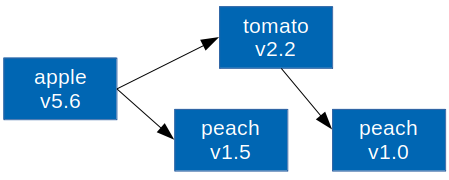

# Package Management

파이썬은 pip를 통해 쉽게 패키지를 설치하거나 삭제할 수 있다. 파이썬 패키지들은 [PyPI](<https://pypi.org/>)에서 호스팅하고 있고 로컬 PC에서는 pip만 설치하면 PyPI의 수많은 패키지들을 명령어 하나로 설치할 수 있다. 마치 우분투에서 apt로 대부분의 패키지를 설치할 수 있는 것과 같다. 지금까지는 파이썬 문법을 배우는게 급해서 PyCharm에서 GUI를 이용해 이를 처리해왔지만 pip를 사용하는 것은 파이썬 사용자에게는 당연하고 자연스러운 일이다.  

##  1. pip 설치

pip를 사용하려면 설치부터 해야한다. 우분투의 경우 apt로 쉽게 설치가능하다. 아직까지는 기본 python, pip는 Python2.x 를 위한 명령어로 지정되어있다. `python3-pip`를 설치해야 Python3를 위한 pip가 설치된다. 아래 명령어들을 통해 설치 상태를 확인해보자.

```
$ sudo apt install python3-dev python3-pip
$ which python3
/usr/bin/python3
$ ll /usr/bin/python3
lrwxrwxrwx 1 root root 9  9월 26 00:48 /usr/bin/python3 -> python3.6*
$ which pip3
/usr/bin/pip3
$ pip3 --version
pip 9.0.1 from /usr/lib/python3/dist-packages (python 3.6)
```

pip를 사용하면서 자주 발생하는 에러가 `importerror: cannot import name 'main'`인데 이런 에러가 나면 바로 재설치를 해주는것이 좋다. 에러의 원인은 우분투에서 기본 제공하는 pip 버전에서 pip 버전을 업그레이드 했을 때 이런 문제가 생긴다. 재설치는 다음과 같이 한다.

```
$ sudo apt --purge autoremove python3-pip
$ sudo apt install python3-pip
```

만약 윈도우에서 설치하거나 우분투에서 위 방법이 잘 작동하지 않으면 설치 스크립트를 사용한다.

```
$ curl https://bootstrap.pypa.io/get-pip.py -o get-pip.py
$ python3 get-pip.py
```


## 2. pip 사용법

pip는 손쉽게 패키지를 설치하고 삭제하도록 도와주며 특정 패키지를 설치할 때 그 패키지가 의존하는 패키지까지 자동으로 찾아서 설치해준다. 또한 설치된 패키지 목록을 출력해서 다른 곳에서도 같은 환경을 쉽게 복원할 수 있다.

### 설치와 삭제

`pip3 --help`를 치면 여러 기능이 나오지만 실제로 쓰는 건 거의 설치(`install`)와 삭제(`uninstall`)다. 한 번에 여러개의 패키지를 설치하거나 삭제할 수 있다.

```
$ pip3 install <package1> <package2> ...
$ pip3 uninstall <package1> <package2> ...
```

예를 들어 수학 패키지인 `numpy`를 설치하고 삭제해 보자. 설치 전후에 파이썬에서 `import numpy`가 실행되는지 확인해보자. `python3 -c` 옵션을 이용해 커맨드에서 바로 간단한 스크립트를 실행해볼 수 있다.

```
$ python3 -c "import numpy"
Traceback (most recent call last):
  File "<string>", line 1, in <module>
ModuleNotFoundError: No module named 'numpy'

$ python3 -c "import numpy"
Traceback (most recent call last):
  File "<string>", line 1, in <module>
ModuleNotFoundError: No module named 'numpy'
~$ pip3 install numpy
Collecting numpy
  Downloading https://files.pythonhosted.org/packages/0e/46/ae6773894f7eacf53308086287897ec568eac9768918d913d5b9d366c5db/numpy-1.17.3-cp36-cp36m-manylinux1_x86_64.whl (20.0MB)
    100% |████████████████████████████████| 20.0MB 84kB/s 
Installing collected packages: numpy
Successfully installed numpy-1.17.3

$ pip3 uninstall numpy
Uninstalling numpy-1.17.3:
  /home/ian/.local/bin/f2py
  /home/ian/.local/bin/f2py3
  /home/ian/.local/bin/f2py3.6
...
Proceed (y/n)? y
  Successfully uninstalled numpy-1.17.3

$ python3 -c "import numpy; print(numpy.version.version)"
1.17.3
```


### 설치된 패키지 복원

pip를 이용하면 현재 PC에 설치된 패키지 목록과 버전을 파일에 출력할 수 있다. 다른 PC에서 그 파일을 이용해 동일한 패키지를 동일한 버전으로 일괄 설치할 수 있다. 리눅스 PC를 새로 세팅하거나 특정 프로젝트에 맞는 패키지들을 설치할 때 유용한 기술이다.

```bash
# 패키지 목록을 저장할 때
pip3 freeze > requirements.txt

# 저장된 패키지 목록을 일괄 설치할 때
pip3 install -r requirements.txt
```


## 3. pip의 한계

터미널에서 바로 사용할 수 있는 `/usr/bin/pip3`는 시스템의 `/usr/bin/python3`를 위한 패키지 관리자다. 즉 pip를 이용해 패키지를 설치하면 시스템 전체에서 설치된 패키지를 사용할 수 있게 된다. 이것이 장점일 수도 있지만 보통은 그렇지 않다.  

시스템(PC)을 쓰는 사람은 한 가지 프로젝트만 계속 하는 것이 아니라 다양한 파이썬 프로젝트를 진행할 수 있다. 그때마다 다른 패키지가 필요할 것이고 pip를 이용해서 필요한 패키지들을 설치하다보면 상당히 많은 패키지들이 쌓이게 된다. 이때 크게 세 가지 문제가 발생할 수 있다.

- **프로젝트마다 다른 패키지 버전**: 현재 두 개의 프로젝트를 동시에 진행 중인데 한쪽에서는 `numpy==1.12` 버전이 필요하고 다른쪽에서는 `numpy==1.17` 버전이 필요할 수 있다. 특히 다른 사람과 대규모 프로젝트를 진행할 때 패키지 버전을 개발초기의 최신 안정 버전으로 고정시켜 놓는 것은 흔한 일이다. numpy를 시스템에 바로 설치한다면 이 사람은 두 개의 시스템이 필요하게 된다.

- **프로젝트 마다 다른 버전의 인터프리터**: 패키지 버전이 다른 것과는 차원이 다른 문제다. 예를 들어 우분투 18.04에는 Python3.6이 기본 버전인데 어떠한 이유로 새로운 프로젝트에서 Python3.7이나 3.8을 써야 한다면 기존에 진행하던 프로젝트와는 병행하기 어려워질 수도 있다.

- **패키지 사이의 의존성 불일치**: 설치된 패키지가 너무 많아지면 그들 사이에서도 **의존성이 꼬이는** 경우가 생긴다. 아래 그림을 보면 이해가 쉽다. `apple`이라는 패키지는 `tomato`와 `peach`에 의존하는데 `tomato`는 `apple`과 다른 버전의 `peach`에 의존하는 경우다. 이런 경우에 `peach`를 v1.5를 설치해야 하는지 v1.0를 설치해야 하는지 pip에서 의존성을 해결하지 못해 설치하다 멈춰버리거나 에러를 발생시키고 설치를 완료하지 못하는 경우도 있다. 따라서 **하나의 시스템에 설치되는 패키지는 최소한으로 줄일수록 좋다.**

  

두 개의 프로젝트를 하려고 PC를 두 대를 쓰거나 운영체제를 두 개를 설치하는 것은 너무 비효율적이다. 그래서 "가상 환경 (virtual environment)"이란 개념이 필요해졌다. 가상 환경은 패키지를 시스템에 직접 설치하는 대신 특정 프로젝트를 위한 전용의 가상 시스템(환경)을 만들어 운용하는 것이다. 이 가상 환경에 파이썬 인터프리터와 pip를 따로 설치하고 패키지도 시스템이 아닌 가상 환경에 설치한다. 이곳의 파이썬, pip, 모든 패키지들이 시스템의 것들과는 독립적이다.

가상 환경의 개념은 파이썬 개발이 시스템 라이브러리가 아닌 오직 PyPI의 패키지들에만 의존하기 때문에 가능한 것으로 C++에도 비슷한 시도들은 있지만 정착되지 못 했다. 가상 환경을 사용하면 하나의 시스템 안에서 여러 개의 파이썬을 운영할수 있기 때문에 여러 프로젝트를 하기 위해 다수의 시스템을 운용할 필요가 없다.


# Virtual Environment Tools

시스템에 패키지를 바로 설치하고 이를 기반으로 개발을 하는 것은 장기적으로 불안정하다. (=시스템을 주기적으로 갈아엎어야 한다.) 그래서 보통 새로운 프로젝트를 할 때마다 전용 가상 환경을 새로 만들어서 작업을 한다. 파이썬 가상 환경을 운영할 수 있는 툴은 여러가지가 있다.

- virutalenv, virtualenvwrapper : 가장 오래되고 많이 쓰이기도 하는 가상 환경 툴이다. 파이참에서도 기본 툴로 쓴다.
- venv: Python3.3부터 기본 내장된 패키지인데 virutalenv와 사용법이 비슷하다. 참고로 virutalenv는 따로 설치를 해야 쓸 수 있다.
- pyenv: 원래는 여러 파이썬 버전을 동시에 사용하기 위한 툴인데 가상 환경 기능을 플러그인을 통해 추가 할 수 있다. 여러 프로젝트를 하는 개발자들 사이에서 인기있는 옵션이다.
- conda: conda는 본래 가상 환경을 위한 툴이 아니라 의존성 문제가 없고 많이 쓰이는 패키지들을 잘 조합해서 미리 다 설치해버리기 위해 나온 일종의 메타 메키지다. 그런데 conda도 자체적으로 패키지를 설치하고 가상 환경을 관리하는 기능이 있다. 초보자를 위한 튜토리얼엔 conda를 많이 쓰지만 conda를 쓰면 불필요한 패키지가 많이 설치되서 용량을 많이 차지하기 때문에 별로 추천하지 않는다.
- pipenv: 가상 환경 관리 뿐만 아니라 패키지 설치 및 삭제, 파이썬 버전 선택, 의존성 문제 해결, 같은 환경 복구 등 같은 다양한 기능을 하나의 툴에 담은 실험적인 툴이다. (pipenv = pip + venv + pyenv) 하지만 설치 속도가 느리고 UI가 불친절하고 현재 개발이 멈춘 것 같다. 그래도 대부분의 경우에는 잘 작동해서 하나로 모든 것을 해결하기에 좋다. 
- poetry: 요즘 '핫'한 툴인것 같다. pipenv와 비슷한데 pipenv보다 더 나은 의존성 문제 해결 능력을 보여주고 터미널에 뜨는 메시지도 현재 상황을 친절하게 알려준다. 하지만 파이썬 버전을 선택하는 기능은 없다.

여기서는 가장 안정적인 virutalenv, virtualenvwrapper, venv, pyenv에 대해서 사용법을 알아보겠다.


## 1. virtualenv

먼저 설치부터 해보자. virtualenv는 pip로 설치할 수 있다.

```
$ pip3 install virtualenv virtualenv
$ virtualenv --version
16.7.6
```

**이제부터 pip를 이용해 시스템에 설치하는 패키지는 오직 가상 환경 툴로 제한한다.**  나머지 모든 개발에 필요한 패키지들은 가상 환경 내부에 설치하기로 한다.  

가상 환경을 사용하기에 앞서 파이썬 환경에 ROS의 개입을 막기 위해 `~/.bashrc`에 있는 다음 두 줄을 주석처리해주자.

```bash
# source /opt/ros/melodic/setup.bash
# source ~/catkin_ws/devel/setup.bash
```

새 터미널을 열고 기본 virtualenv 사용법부터 알아보자. 

### 1.1 가상환경 만들기

실제 작업을 할 `~/workspace/vework` 디렉토리 아래  `virtual_py36`라는 가상 환경을 만들고자 한다. `--python` 옵션을 통해 기반 인터프리터를 선택할 수 있다. `python3`나 `python3.6`을 사용할 수 있다. 혹은 옵션을 쓰지 않으면 시스템 기본 Python3를 사용한다.

```bash
$ cd ~/workspace
~/workspace$ mkdir vework
~/workspace$ cd vework
~/workspace/vework$ which python3.6
/usr/bin/python3.6
~/workspace/vework$ virtualenv --python=python3.6 virtual_py36
Running virtualenv with interpreter /usr/bin/python3.6
Already using interpreter /usr/bin/python3.6
Using base prefix '/usr'
New python executable in /home/ian/workspace/vework/virtual_py36/bin/python3.6
Also creating executable in /home/ian/workspace/vework/virtual_py36/bin/python
Installing setuptools, pip, wheel...
done.
```

기존의 `/usr/bin/python3.6`을 복사해서 `<venv_path>/bin/python3.6`에 복사한 후 이 가상 환경에 `setuptools, pip, wheel` 등을 설치하는 것을 볼 수 있다.  


### 1.2 가상 환경 활성화

가상 환경을 활성화 하면 그때부터 `python`이나 `pip` 등은 더 이상 `/usr/bin`에 설치된 시스템 실행파일이 아니라 가상 환경에 설치된 실행파일이 사용된다. 터미널에는 가상 환경의 이름이 표시되어 현재 가상 환경이 활성화 됐음을 알려준다.

```bash
~$ cd ~/workspace/vework/virtual_py36/
~/workspace/vework/virtual_py36$ source bin/activate
(virtual_py36) ~/workspace/vework/virtual_py36$ which python
/home/ian/workspace/vework/virtual_py36/bin/python
(virtual_py36) ~/workspace/vework/virtual_py36$ which pip
/home/ian/workspace/vework/virtual_py36/bin/pip
(virtual_py36) ~/workspace/vework/virtual_py36$ ln -l bin
ln: invalid option -- 'l'
Try 'ln --help' for more information.
(virtual_py36) ~/workspace/vework/virtual_py36$ ls -l bin
total 4476
-rw-r--r-- 1 ian ian    2228 10월 22 00:54 activate
-rw-r--r-- 1 ian ian    1447 10월 22 00:54 activate.csh
-rw-r--r-- 1 ian ian    3112 10월 22 00:54 activate.fish
-rw-r--r-- 1 ian ian    1751 10월 22 00:54 activate.ps1
-rw-r--r-- 1 ian ian    1517 10월 22 00:54 activate_this.py
-rw-r--r-- 1 ian ian    1169 10월 22 00:54 activate.xsh
-rwxr-xr-x 1 ian ian     270 10월 22 00:54 easy_install
-rwxr-xr-x 1 ian ian     270 10월 22 00:54 easy_install-3.6
-rwxr-xr-x 1 ian ian     257 10월 22 00:54 pip
-rwxr-xr-x 1 ian ian     257 10월 22 00:54 pip3
-rwxr-xr-x 1 ian ian     257 10월 22 00:54 pip3.6
lrwxrwxrwx 1 ian ian       9 10월 22 00:54 python -> python3.6
lrwxrwxrwx 1 ian ian       9 10월 22 00:54 python3 -> python3.6
-rwxr-xr-x 1 ian ian 4526456 10월 22 00:54 python3.6
-rwxr-xr-x 1 ian ian    2357 10월 22 00:54 python-config
-rwxr-xr-x 1 ian ian     248 10월 22 00:54 wheel
```

가상 환경이 활성화 된 상태에서는 `python, pip`만 써도 `python3, pip3`가 실행된다.


### 1.3 가상 환경 패키지 관리

가상 환경을 활성화 한 뒤에는 그냥 pip를 통해 패키지를 관리하면 가상 환경 내부의 패키지를 설치하거나 삭제할 수 있다. `pip list`를 통해 설치된 패키지 목록을 보면 이 환경이 깨끗하다는 것을 볼 수 있다.

```bash
(virtual_py36) ~/workspace/vework/virtual_py36$ pip list
Package    Version
---------- -------
pip        19.3.1 
setuptools 41.4.0 
wheel      0.33.6 
```

가상 환경을 관리하는 방법은 기존 pip를 쓰던 방법과 동일하다.

```bash
# 패키지 설치
(virtual_py36) ~/workspace/vework/virtual_py36$ pip install numpy pandas
Collecting numpy
...
Installing collected packages: numpy, pytz, six, python-dateutil, pandas
Successfully installed numpy-1.17.3 pandas-0.25.2 python-dateutil-2.8.0 pytz-2019.3 six-1.12.0
# 설치된 패키지 목록 보기
(virtual_py36) ~/workspace/vework/virtual_py36$ pip list
Package         Version
--------------- -------
numpy           1.17.3 
pandas          0.25.2 
pip             19.3.1 
python-dateutil 2.8.0  
pytz            2019.3 
setuptools      41.4.0 
six             1.12.0 
wheel           0.33.6
# 패키지 삭제
(virtual_py36) ~/workspace/vework/virtual_py36$ pip uninstall pandas
Uninstalling pandas-0.25.2:
  Would remove:
    /home/ian/workspace/vework/virtual_py36/lib/python3.6/site-packages/pandas-0.25.2.dist-info/*
    /home/ian/workspace/vework/virtual_py36/lib/python3.6/site-packages/pandas/*
Proceed (y/n)? y
  Successfully uninstalled pandas-0.25.2
# 목록 다시 보기
(virtual_py36) ~/workspace/vework/virtual_py36$ pip list
Package         Version
--------------- -------
numpy           1.17.3 
pip             19.3.1 
python-dateutil 2.8.0  
pytz            2019.3 
setuptools      41.4.0 
six             1.12.0 
wheel           0.33.6 
# 패키지 목록 파일 출력
(virtual_py36) ~/workspace/vework/virtual_py36$ pip freeze > requirements.txt
# 파일 확인
(virtual_py36) ~/workspace/vework/virtual_py36$ cat requirements.txt 
numpy==1.17.3
python-dateutil==2.8.0
pytz==2019.3
six==1.12.0
```


### 1.4 가상 환경 비활성화

가상 환경을 비활성화 하는 방법은 간단하다. `deactivate`를 실행하면 터미널 앞에 있던 가상 환경 이름이 사라진다.

```bash
(virtual_py36) ~/workspace/vework/virtual_py36$ deactivate
~/workspace/vework/virtual_py36$ which python3
/usr/bin/python3
```


### 1.5 가상 환경 복원

이곳에서 만든 가상 환경을 `pip freeze`를 이용해 시스템 내부 다른 디렉토리에서 혹은 다른 시스템에서 똑같이 복원할 수 있다. 방금 만든 가상 환경을 활성화 한 후 환경 내부의 패키지 목록을 저장하고 이를 다른 가상 환경에서 복원하면 된다.

```bash
~/workspace/vework/virtual_py36$ cd ~/workspace/vework/
# 새로운 가상 환경 만들기
~/workspace/vework$ virtualenv --python=python3 reconstruct_env
Already using interpreter /usr/bin/python3
Using base prefix '/usr'
New python executable in /home/ian/workspace/vework/reconstruct_env/bin/python3
Also creating executable in /home/ian/workspace/vework/reconstruct_env/bin/python
Installing setuptools, pip, wheel...
done.
# 이전 가상 환경에서 requirments.txt 복사
~/workspace/vework$ cp virtual_py36/requirements.txt reconstruct_env/
# 새 가상 환경 활성화
~/workspace/vework$ cd reconstruct_env/
~/workspace/vework/reconstruct_env$ source bin/activate
# requirments.txt를 이용한 패키지 일괄 설치
(reconstruct_env) ~/workspace/vework/reconstruct_env$ pip install -r requirements.txt 
Collecting numpy==1.17.3
...
Installing collected packages: numpy, six, python-dateutil, pytz
Successfully installed numpy-1.17.3 python-dateutil-2.8.0 pytz-2019.3 six-1.12.0
# 설치된 패키지 목록 확인 (위와 비교)
(reconstruct_env) ~/workspace/vework/reconstruct_env$ pip list
Package         Version
--------------- -------
numpy           1.17.3 
pip             19.3.1 
python-dateutil 2.8.0  
pytz            2019.3 
setuptools      41.4.0 
six             1.12.0 
wheel           0.33.6 
(reconstruct_env) ~/workspace/vework/reconstruct_env$ deactivate
```

설치 후 패키지 목록을 보면 `virtual_py36`과 동일한 패키지들이 동일한 버전으로 설치되었음을 볼 수 있다.


## 2. virutalenvwrapper

virtualenv는 쓰기 간단하고 독립적인 환경을 만들 수 있어서 인기가 많지만 타이핑이 좀 귀찮다는 단점이 있다. 매번 작업을 시작할 때마다 가상 환경 경로로 이동해서(cd) 가상 환경을 활성화하는 것이 귀찮은데 이것을 virutalenvwrapper는 `work on <venv_name>` 하나로 줄여준다.

또한 인터프리터나 패키지 설치 파일들이 프로젝트 디렉토리에 위치하기 때문에 git을 쓰는 경우 `venv` 디렉토리를 `.gitignore`에 추가해줘야 하는 것도 조금 번거로운 일이다. virutalenvwrapper는 가상 환경 파일들을 한 곳에 모아서 관리하기 때문에 프로젝트 디렉토리를 깨끗하게 쓸 수 있다.


### 2.1 설치 및 설정

virutalenvwrapper도 pip로 설치할 수 있다.

```
$ pip3 install virtualenvwrapper
```

가상 환경이 만들어질 경로를 미리 만든다.

```
$ mkdir ~/.virtualenv
```

`~/.bashrc`에 줄을 추가하여 환경 변수를 등록한다.

```bash
$ gedit ~/.bashrc
# 아래 세 줄 추가
export WORKON_HOME=~/.virtualenvs
export VIRTUALENVWRAPPER_PYTHON=/usr/bin/python3
source ~/.local/bin/virtualenvwrapper.sh
# 닫기
$ source ~/.bashrc
virtualenvwrapper.user_scripts creating /home/ian/.virtualenvs/premkproject
virtualenvwrapper.user_scripts creating /home/ian/.virtualenvs/postmkproject
virtualenvwrapper.user_scripts creating /home/ian/.virtualenvs/initialize
virtualenvwrapper.user_scripts creating /home/ian/.virtualenvs/premkvirtualenv
virtualenvwrapper.user_scripts creating /home/ian/.virtualenvs/postmkvirtualenv
virtualenvwrapper.user_scripts creating /home/ian/.virtualenvs/prermvirtualenv
virtualenvwrapper.user_scripts creating /home/ian/.virtualenvs/postrmvirtualenv
virtualenvwrapper.user_scripts creating /home/ian/.virtualenvs/predeactivate
virtualenvwrapper.user_scripts creating /home/ian/.virtualenvs/postdeactivate
virtualenvwrapper.user_scripts creating /home/ian/.virtualenvs/preactivate
virtualenvwrapper.user_scripts creating /home/ian/.virtualenvs/postactivate
virtualenvwrapper.user_scripts creating /home/ian/.virtualenvs/get_env_details
```

`source ~/.local/bin/virtualenvwrapper.sh`가 처음 실행되기 때문에 `~/.virtualenv` 경로에 파일들이 설치된다.


### 2.2 virtualenvwrapper 사용

`virtualenvwrapper`는 직관적인 이름의 다양한 커맨드를 제공한다.

- mkvirtualenv [venv_name] (--python=[interpreter]) : 가상 환경 이름과 인터프리터를 지정하여 새로운 가상 환경을 만든다. 하지만 virtualenv 처럼 현재 경로에 만드는 것이 아니라 `WORKON_HOME`에 지정한 `~/.virtualenvs`에 가상 환경을 만든다.
- lsvirtualenv : 만들어진 가상 환경 목록을 보여준다.
- workon [venv_name] : 가상 환경을 활성화한다. 특정 경로의 activate를 실행하지 않아도 된다. 가상 환경 이름만 지정하면 된다.
- setvirtualenvproject : 가상 환경이 활성화된 상태에서 프로젝트 디렉토리로 이동해서 이 명령을 실행하면 가상 환경과 디렉토리가 연결된다. 연결된 후부터는 `workon [venv_name]` 실행시 가상 환경 활성화 뿐만 아니라 프로젝트 디렉토리로 이동까지 자동으로 된다. 
- cdproject : 가상 환경이 활성화된 상태에서 가상 환경에 연결된 프로젝트 디렉토리가 있다면 프로젝트 디렉토리로 이동한다.
- wipeenv : 현재 가상 환경에 설치된 3rd party 패키지들이 모두 삭제된다. 가상 환경을 처음 만든 상태로 초기화 한다고 보면 된다.
- rmvirtualenv [venv_name] : 가상 환경을 삭제한다.

다음 명령어를 통해 실습을 해보자.

```bash
~$ cd ~/workspace/vework/

# 가상 환경 만들기
~/workspace/vework$ mkvirtualenv --python=python3.6 vewrapper_py36
Running virtualenv with interpreter /usr/bin/python3.6
Already using interpreter /usr/bin/python3.6
Using base prefix '/usr'
New python executable in /home/ian/.virtualenvs/vewrapper_py36/bin/python3.6
Also creating executable in /home/ian/.virtualenvs/vewrapper_py36/bin/python
Installing setuptools, pip, wheel...
done.
...

# 가상 환경 비활성화
(vewrapper_py36) ~/workspace/vework$ deactivate
# 가상 환경 목록 보기
~/workspace/vework$ lsvirtualenv 
vewrapper_py36
==============

# 가상 환경 활성화
~/workspace/vework$ workon vewrapper_py36
(vewrapper_py36) ~/workspace/vework$ 
# 가상 환경에 패키지 설치
(vewrapper_py36) ~/workspace/vework$ pip install numpy
Collecting numpy
  Using cached https://files.pythonhosted.org/packages/0e/46/ae6773894f7eacf53308086287897ec568eac9768918d913d5b9d366c5db/numpy-1.17.3-cp36-cp36m-manylinux1_x86_64.whl
Installing collected packages: numpy
Successfully installed numpy-1.17.3

# "vework"를 "vewrapper_py36" 가상 환경을 위한 디렉토리로 지정
(vewrapper_py36) ~/workspace/vework$ setvirtualenvproject 
Setting project for vewrapper_py36 to /home/ian/workspace/vework

# 비활성화
vewrapper_py36) ~/workspace/vework$ deactivate
~/workspace/vework$ cd /usr/

# workon <venv_name>하면 이제 가상 환경 활성화 + 경로 이동까지 실행
/usr$ workon vewrapper_py36
(vewrapper_py36) ~/workspace/vework$ 

# 가상 환경이 활성화 된 상태에서 cdproject를 통해 프로젝트 경로로 돌아옴
(vewrapper_py36) ~/workspace/vework$ cd /usr/
(vewrapper_py36) /usr$ cdproject 
(vewrapper_py36) ~/workspace/vework$ 

# 3rd party 패키지 모두 삭제
(vewrapper_py36) ~/workspace/vework$ wipeenv
Uninstalling packages:
numpy==1.17.3

Uninstalling numpy-1.17.3:
  Successfully uninstalled numpy-1.17.3

# 가상 환경 삭제
(vewrapper_py36) ~/workspace/vework$ deactivate 
~/workspace/vework$ rmvirtualenv vewrapper_py36
Removing vewrapper_py36...
```


## 3. venv

venv는 파이썬 설치시 기본 설치되는 패키지다. 커맨드를 쓰는 방법은 조금 다르지만 작동하는 방식은 virtualenv와 거의 동일하다. virtualenv처럼 프로젝트 디렉토리 아래에 바로 가상 환경 디렉토리가 생기고 가상 환경을 활성화 시키려면 activate를 해줘야한다.  

venv는 직접 사용하는 것이 아니라 `python -m`을 통해 실행한다. `python -m`은 특정 파이썬에 설치된 라이브러리를 스크립트로 실행해주는 것이다. venv는 `python3 -m venv [options]`처럼 실행하고 pip도 `python3 -m pip [options]`처럼 실행할 수 있다. 여러 버전의 pip가 설치되어 있을 때 `python -m`을 통해 실행하면 어떤 인터프리터와 함께 설치된 pip를 실행하는지가 명확해진다.  

venv는 기본 패키지가 맞긴 한데 우분투에서 venv 실행시 패키지 설치를 하라고 한다. 일단 설치를 먼저 하자.

```
$ sudo apt install python3-venv
```

venv로 가상 환경은 다음과 같이 만들 수 있다. virutalenv와 마찬가지로 `venv_py36`이라는 디렉토리가 생기고 그곳에 파이썬과 패키지가 설치된다.

```bash
ian@ian:~$ cd ~/workspace/vework/
ian@ian:~/workspace/vework$ python3 -m venv venv_py36
```

그 뒤로 가상 환경 활성화, 패키지 설치, 가상 환경 비활성화는 virtualenv와 같다.

```bash
ian@ian:~/workspace/vework$ cd venv_py36/
# 가상 환경 활성화
ian@ian:~/workspace/vework/venv_py36$ source bin/activate
# 가상 환경 확인
(venv_py36) ian@ian:~/workspace/vework/venv_py36$ which python
/home/ian/workspace/vework/venv_py36/bin/python
(venv_py36) ian@ian:~/workspace/vework/venv_py36$ which pip
/home/ian/workspace/vework/venv_py36/bin/pip
# 패키지 설치
(venv_py36) ian@ian:~/workspace/vework/venv_py36$ pip install numpy
Collecting numpy
...
Installing collected packages: numpy
Successfully installed numpy-1.17.3
# 가상 환경 비활성화
(venv_py36) ian@ian:~/workspace/vework/venv_py36$ deactivate 
```


## 4. pyenv


# ROS Python 3 환경 만들기


