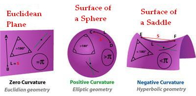
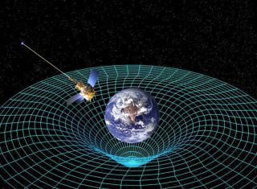
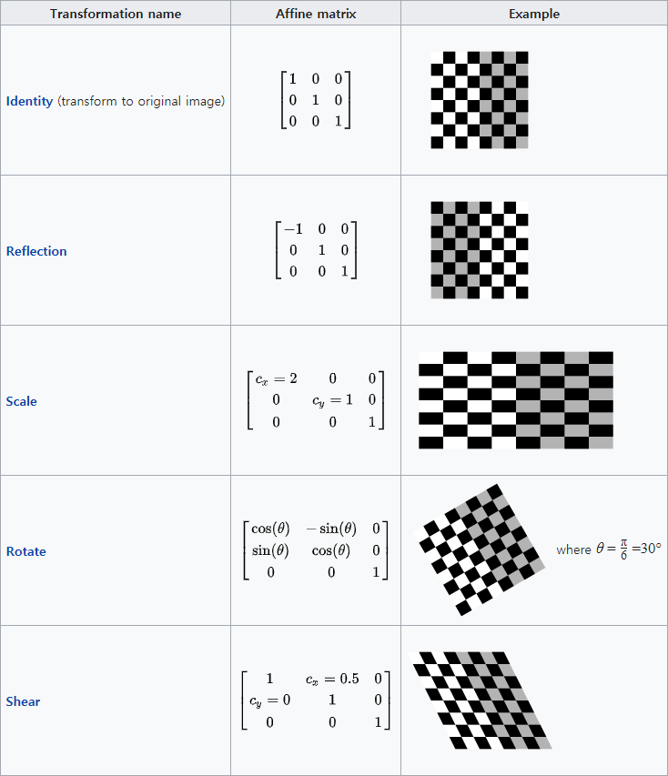

# Coordinate Transformation

## 1. Problem Definition

좌표계 변환(coordinate transformation)은 로보틱스나 컴퓨터 비전에서 늘 나오는 문제다. 좌표계(coordinate system)란 원점의 위치와 좌표축의 방향으로 이루어져 있으며 좌표를 결정하는 기준이 된다. 우리가 방안에 가만히 있어도 우리의 위치는 좌표계를 어떻게 설정하느냐에 따라 달라진다.  

아래 그림에서 빨간 점의 위치, 즉 좌표(coordinates)는 어떤 좌표계(coordinate system)를 선택하느냐에 따라 달라진다. (1)~(4)의 네 개의 좌표계가 있고 주황색이 x 축이고 파란색이 y축이라고 해보자. 빨간 점은 1번 좌표계에서는 (4, -2)이고 2번 좌표계에서는 (6,2)다. 좌표계가 꼭 방의 벽 방향과 수평, 수직 할 필요는 없다. 4번 좌표계처럼 임의의 위치에 임의의 방향으로 있어도 x, y 축이 서로 수직하기만 하다면 얼마든지 4번도 좌표계를 이룰 수 있다.

좌표계 변환을 통해 우리가 알고자 하는것은 다음과 같은 것들이다.

1. 4번 좌표계에서 빨간 점의 좌표를 알고(b) 3번 좌표계 기준으로 4번 좌표계 원점의 위치와 상대적인 회전을 알 때(a), 3번 좌표계에서의 빨간 점의 좌표(c)는 무엇인가?
2. 3번 좌표계에서 빨간 점의 좌표를 알고(a) 3번 좌표계 기준으로 4번 좌표계 원점의 위치와 상대적인 회전을 알 때(c), 4번 좌표계에서의 빨간 점의 좌표(b)는 무엇인가?

어떤 점의 좌표를 A라는 좌표계 기준으로 알고 있는데 B 좌표계에서는 어떤 좌표가 될까? 이것이 좌표계 변환(coordinate transformation)이다. 위 예시를 좀 더 일반화 시키면 3차원 공간에서도 좌표계 변환을 한다. 좌표계 변환은 관절 로봇 뿐만 아니라 이동 로봇의 위치를 계산하는데도 필수적인 기술이다.  

## 2. Three-Dimensional Euclidean Space

### 2.1 Euclidean Space

좌표계 변환을 이해하기 위해서는 먼저 "공간(space)"을 이해해야 한다. 공간도 표현 방식에 따라 여러 종류가 있는데 그 중 우리에게 익숙한 직선 좌표 축을 가진 공간들을 **Euclidean space**(유클리드 공간)라 한다. Euclidean n-space는 n개의 실수로 이루어진 n차원 공간을 나타낸다.  

유클리드 공간이 아닌 공간은 무엇이 있을까? 유클리드 공간에서는 하나의 좌표를 고정시킨 평면이 평평(flat)하지만 Sphere space 같은 Non-Euclidean space는 (좌표계로 따지면 구형 좌표계) $$r,\theta,\phi$$ 중 r을 고정시키면 구의 표면이 나와서 평평하지 않다. 아래는 Elliptical space, Euclidean space, Hyperbolic space를 나타낸 그림이다.

참고로 Einstein이 시공간을 상상했던 공간도 non-Euclidean space였다.

### 2.2 Cartesian Coordinates

유클리드 공간의 한 점을 "좌표"로 표시하는 좌표계(coordinate system)도 여러가지가 있을 수 있지만 그 중 가장 널리 쓰이는 것이 **Cartesian coordinate system**이다. Cartesian 좌표계는 각 축이 서로 직교하며 각 축의 스케일이 동일한 좌표계를 말한다. "Cartesian"이란 말은 이 좌표계를 만든 유명한 철학자이자 수학자인 르네 데카르트(René Descartes)로부터 따왔다. ("나는 생각한다 고로 존재한다.")  

3차원 유클리드 공간에서 Cartesian 좌표계는 3개의 기저 벡터(basis vector)와 원점으로 이루어져 있다.

- 원점 $$O \in \mathbb{R}^3$$는 Euclidean 3-space 속의 한 점이다.
- Basis vectors of 3-D Cartesian coordinate system
  - 3개의 서로 직교하며 크기가 1인 벡터의 집합이다. 각각의 벡터가 각 차원의 축(axis)이 된다.
  
      $$\mathbf{v}=\{\mathbf{v}_1, \mathbf{v}_2, \mathbf{v}_3\}, \quad \mathbf{v}_i \in \mathbb{R}^n$$
  
      $$\mathbf{v}_i \cdot \mathbf{v}_k = \begin{cases} 1 & if \quad i=k \\ 0 & if \quad i \ne k \end{cases}$$
  
  - Right-handed orientation: $$\mathbf{v}_1 \times \mathbf{v}_2 = \mathbf{v}_3, \mathbf{v}_2 \times \mathbf{v}_3 = \mathbf{v}_1, \mathbf{v}_3 \times \mathbf{v}_1 = \mathbf{v}_2$$
  
  - Euclidean-n space 속 임의의 점 $$p \in \mathbb{R}^n$$는 basis vector의 선형 조합으로 표현할 수 있다.
  
      $$\mathbf{p}=p_1\mathbf{v}_1 + p_2\mathbf{v}_2 + p_3\mathbf{v}_3$$
  
  - 보통 $$\mathbf{v}_1=\mathbf{i}=[1,0,0], \mathbf{v}_2=\mathbf{j}=[0,1,0], \mathbf{v}_3=\mathbf{k}=[0,0,1]$$를 주로 사용한다.
  
  - 서로 다른 basis vector가 직교하면 점을 이루는 좌표는 좌표계의 원점에서 점을 향하는 벡터와 basis vector와의 내적으로 구할 수 있다.
  
      $$p_i = \mathbf{v}_i \cdot \mathbf{p} = \mathbf{v}_i \cdot \left( p_1\mathbf{v}_1 + p_2\mathbf{v}_2 + p_3\mathbf{v}_3 \right) = p_i$$

그렇다면 Cartesian coordinates가 아닌 좌표계는 어떤 게 있을까? 아래 그림처럼 좌표계가 기울었거나 축의 스케일이 다른 경우가 있다.

#### Point vs Coordinates (singluar vs plural)

3차원 공간 상의 한 "점(point)"을 표현하기 위해서는 x, y, z 축의 3개의 "좌표(coordinate)"가 필요하다. 점은 전체 공간상의 한 위치를 말하는 것이고 좌표는 1차원 축을 기준으로 점의 위치를 하나의 숫자로 표현한 것이다. 그래서 Euclidean n-space의 한 점은 n개의 좌표로 표현된다. $$p=(p_1,...,p_n)$$

#### Point vs Vector

점(point)는 위치(location)고 벡터(vector)는 변위(displacement)다. 벡터는 원래 두 점 사이의 변위를 나타낸 것이다. ($$\vec{v}=p_1 - p_2$$) 고등학교 때 힘의 3요소가 작용점, 힘의 크기, 힘의 방향이라고 배웠을 것이다. 힘은 벡터이기 때문에 시작점(작용점)과 변위(크기와 방향)로 나타내야 한다.  

하지만 많은 경우에 벡터의 시작점을 생략하고 쓰는데 변위만 표시한 벡터를 자유 벡터(free vector)라고 한다. 앞으로 사용할 벡터도 모두 이에 속한다.  

점과 벡터에서는 가능한 연산이 있고 불가능한 연산이 있다. 다음은 가능한 연산이다. 명확한 구분을 위해 벡터는 기호 위에 화살표를 표시한다.

- $$\vec{w}=\vec{u}+\vec{v}$$ : vector + vector = vector
- $$\vec{v}=\vec{w}-\vec{u}$$ : vector - vector = vector
- $$\vec{u} = s\vec{v}$$ : scalar * vector = vector
- $$q = p + \vec{v}$$ : point + vector = point
- $$\vec{v} = q - p$$ : point - point = vector
- $$r = 0.5p + 0.5q$$ : weighted average of points = point

다음 불가능한 연산이다.

- $$r \ne p + q$$ : 점(위치)의 합으로 새로운 점(위치)를 만들 수 없다.
- $$q \ne sp$$ : 점(위치)은 늘리거나 줄일 수 없다.

참고자료: <https://darkpgmr.tistory.com/78>

### 2.3 Vector Products

#### Inner Product (Dot Product)

벡터의 내적(inner product)와 점곱(dot product)은 같은 의미로 사용되지만 사실 내적은 점곱을 더욱 일반화한 상위 개념이다. 하지만 Euclidean space의 벡터를 다룰 때는 둘을 같다고 봐도 무방하다. 공간 상의 벡터에 대한 내적(<>) 혹은 점곱(·)의 정의와 성질은 다음과 같다.
$$
\left\langle \mathbf{u},\mathbf{v} \right\rangle \overset{ \underset{def}{} }{=} \mathbf{u} \cdot \mathbf{v}
= \mathbf{u}_1 \mathbf{v}_1 + \mathbf{u}_2 \mathbf{v}_2 + \mathbf{u}_3 \mathbf{v}_3, \quad \mathbf{u}, \mathbf{v} \in \mathbb{R}^3, 
\quad \left\langle \mathbf{u},\mathbf{v} \right\rangle \in \mathbb{R}^3
$$

- Norm (length) of vector: $$\| \mathbf{u} \| = \sqrt{ \left\langle \mathbf{u}, \mathbf{u} \right\rangle } = \sqrt{u_1^2 + u_2^2 + u_3^2}$$
- Angle between two vectors: $$cos\theta = {\left\langle \mathbf{u}, \mathbf{v} \right\rangle \over \|\mathbf{u}\| \|\mathbf{v}\|}$$
- Two vectors are said to be **orthogonal** when $$\left\langle \mathbf{u}, \mathbf{v} \right\rangle = 0$$

#### Cross Product

$$
\mathbf{u} \times \mathbf{v} \overset{ \underset{def}{} }{=} 
\begin{bmatrix} u_2v_3 - u_3v_2 \\ u_3v1 - u_1v_3 \\ u_1v_2 - u_2v_1 \end{bmatrix}
= \begin{bmatrix} 0 & -u_3 & u_2 \\ u_3 & 0 & -u_1 \\ -u_2 & u_1 & 0 \end{bmatrix}
\begin{bmatrix} v_1 \\ v_2 \\ v_3 \end{bmatrix} \in \mathbb{R}^3
$$

- Cross product is orthogonal to both vectors: $$\left\langle \mathbf{u} \times \mathbf{v}, \mathbf{u} \right\rangle = \left\langle \mathbf{u} \times \mathbf{v}, \mathbf{v} \right\rangle = 0$$
- Anticommutativity: $$\mathbf{u} \times \mathbf{v} = - \mathbf{u} \times \mathbf{v}$$
- Angle between two vectors: $$sin\theta = {\left\langle \mathbf{u}, \mathbf{v} \right\rangle \over \|\mathbf{u}\| \|\mathbf{v}\|}$$

## 3. Homogeneous Coordinates

변환(transformation)이란 어떤 좌표계에 있는 기하 구조를 다른 좌표계로 옮겨서 위치와 모양을 변형하는 것을 말한다. 유클리드 공간 사이의 변환은 선형 변환(linear transformation)이나 어파인 변환(affine transformation)으로 나타낼 수 있다. 이들 변환은 변환 전에 직선 구조가 있다면 변환 후에도 직선이 유지된다.

- Linear Transformation: $$\mathbf{p}' = A \mathbf{p}, \quad \mathbf{p}, \mathbf{p}' \in \mathbb{R}^3, \quad A \in \mathbb{R}^{3 \times 3}$$
- Affine Transformation: $$\mathbf{p}' = A \mathbf{p} + \mathbf{q}, \quad \mathbf{p}, \mathbf{p}', \mathbf{q} \in \mathbb{R}^3, \quad A \in \mathbb{R}^{3 \times 3}$$

선형 변환은 좌표계의 원점은 유지한채로 모양만 변형하는 것이고 어파인 변환은 거기에 추가로 원점 이동까지 하는 것이다.  

이러한 변환은 여러 번 연속해서 일어날 수 있다.

- Consecutive linear transformtions: $$\mathbf{p}' = A_2 \left(A_1 \mathbf{p} \right)$$   : simple!
- Consecutive affine transformtions: $$\mathbf{p}' = A_2 \left(A_1 \mathbf{p} + \mathbf{q}_1 \right) + \mathbf{q}_2 = A_2A_1 \mathbf{p} + A_2\mathbf{q}_1 + \mathbf{q}_2$$   : complex!

선형 변환은 단순히 앞에 행렬을 곱해나가면 되는데 어파인 변환은 변환을 거듭할수록 항이 늘어나서 연산이 복잡해진다. 그런데 맨 처음에 예를 들었던 좌표계 변환을 생각해보면 좌표계의 원점이 달라지기 때문에 어파인 변환을 이용해야 제대로 된 좌표계 변환을 할 수 있다.  

만약 어파인 변환을 선형 변환처럼 단순한 행렬 곱으로 표현할 수 있다면 좌표계 변환을 더 쉽게 할 수 있을 것이다. 그래서 좌표계 변환에서는 **homogeneous coordinates**(동차 좌표)를 사용한다.  

동차 좌표란 어떤 점의 좌표 $$\mathbf{p}=\left(x, y, z\right)$$에 스케일을 덧붙여 $$\mathbf{p}_h=\left(sx, sy, sz, s\right), \text{where } s>0$$로 표현하는 것을 말한다. 동차 좌표에서 $$s>0$$ 면 $$\mathbf{p}$$와 $$\mathbf{p}_h$$는 동일한 것으로 본다. 따라서 $$\mathbf{p}_h=\left(x, y, z, 1\right) = \left(2x, 2y, 2z, 2\right)$$ 가 성립한다. 이러한 동차 좌표를 이용하면 어파인 변환을 선형 변환처럼 표현할 수 있다.
$$
\mathbf{p}' = A \mathbf{p} + \mathbf{q} \\
\mathbf{p}_h' = \begin{bmatrix} x' \\ y' \\ z' \\ 1 \end{bmatrix}
= \begin{bmatrix} A & \mathbf{q} \\ \mathbf{0} & 1 \end{bmatrix} 
\begin{bmatrix} x \\ y \\ z \\ 1 \end{bmatrix} = T \mathbf{p}_h
$$
이러한 편리성 때문에 좌표계 변환시에는 동차 좌표를 많이 쓰고 앞으로는 문맥에 따라 그냥 $$\mathbf{p}$$를 동차 좌표 $$\left[x,y,z,1\right]$$로도 사용한다.

## 4. Rigid Transformation

어파인 변환에서 벡터 $$\mathbf{q}$$를 더하는 것은 단순한 이동(translation)을 의미하지만 행렬 $$A$$를 곱하는 것은 행렬의 형태에 따라 다양한 변환을 만들 수 있다. 다음은 2차원 어파인 변환의 다양한 예시다. 일반적인 어파인 변환은 아래 요소들의 다양한 조합(e.g. Reflection + Scale + Shear 등)으로 이루어져있다.

출처: <https://en.wikipedia.org/wiki/Affine_transformation>  

하지만 어파인 변환은 실세계에서 일어나는 좌표계 변환을 표현하기에는 너무 자유도가 높다. 즉 실세계의 좌표계 변환에서는 오직 회전(rotation)만 가능하고 reflection, scale, shear는 일어날 수 없다.   

똑같은 물건을 아무리 다른 위치 다른 각도에서 봐도 상하관계는 유지하면서 좌우만 뒤집거나(reflection), 물건이 커지거나(scale), 각도가 찌그러지거나(shear) 하지 않는다. 이러한 성질을 가지는 물체를 강체(rigid-body)라 하는데 강체 내부의 임의의 두 점 사이의 거리는 보는 시점에 상관없이 항상 동일하다.  

>  이러한 강체의 성질을 유지하는, 즉 **임의의 두 점 사이의 거리를 유지하는 변환을 Rigid Transformation (강체 변환) 혹은 Euclidean Transformation (유클리드 변환)**이라고 한다. 

유클리드 변환은 이동(translation), 회전(rotation), 반전(reflection) 세 가지 요소를 포함하는데 반전도 실제 물리 세계의 좌표계 변환에서 일어날 수 없으므로 이를 제외한 이동과 회전만 포함하는 변환을 **Proper Rigid Transformation**이라고 하거나 혹은 이것 자체를 Rigid Transformation 이라 부르기도 한다. 여기서는 Rigid Transformation을 'Proper' Rigid Transformation을 의미하는 것으로 하겠다.  

## 5. 2-D Rigid Transformation

3차원 강체 변환은 상당히 복잡하므로 2차원 평면 상의 변환부터 자세히 다뤄보자. 2차원 강체 변환은 2차원 좌표에 회전과 이동을 적용하여 새로운 2차원 좌표를 만드는 것을 말한다.  

$$
\mathbf{p}_h' = \begin{bmatrix} x' \\ y' \\ 1 \end{bmatrix}
= \begin{bmatrix} R & \mathbf{t} \\ \mathbf{0} & 1 \end{bmatrix} 
\begin{bmatrix} x \\ y \\ 1 \end{bmatrix} = T \mathbf{p}_h \\
\mathbf{p}' = R \mathbf{p} + \mathbf{t} \\
R \in SO(2) \subset \mathbb{R}^{2 \times 2}, \quad \mathbf{t} \in \mathbb{R}^2
$$

$$R$$은 rotation matrix로 점을 회전시키고, $$\mathbf{t}$$는 translation vector로 점을 이동시킨다. 이동(translation)은 단순히 2차원 벡터를 더하는 것이니 간단하지만 회전은 좀 더 미묘하다. 벡터에 임의의 2x2 행렬을 곱하면 일반적인 선형 변환이 되는데 이것이 회전 변환이 되려면 행렬에 특별한 조건이 필요하다.  

### 5.1 Rotation Matrix

회전 변환 자체도 강체 변환이기 때문에 두 점 사이의 거리가 유지되면 두 직선 사이의 각도도 유지된다. 좌표계가 아래와 같이 회전했을 때 서로 직각인 X, Y 좌표축은 회전을 해도 서로 직각이다.  

각도 $$\theta$$만큼 회전한 X', Y' 축의 방향을 계산해보면 다음과 같다.  

$$
\mathbf{x}' = \begin{bmatrix} cos\theta \\ sin\theta \end{bmatrix}, \quad 
\mathbf{y}' = \begin{bmatrix} -sin\theta \\ cos\theta \end{bmatrix}
$$

기준 좌표계에서의 좌표가 $$\mathbf{p}=(x,y)$$일 때 회전된 좌표계에서 좌표 $$\mathbf{p}'=(x',y')$$는 원점에서 점을 향하는 벡터 $$\vec{\mathbf{p}}$$를 새로운 좌표 축인 X', Y'에 사영(projection)하여 구할 수 있다. 사영한다는 것이 결국엔 앞서 말한대로 벡터와 좌표축을 내적하는 것이다.

$$
x' = \mathbf{x}' \cdot \vec{\mathbf{p}} = (\mathbf{x}')^T \vec{\mathbf{p}}  \\
y' = \mathbf{y}' \cdot \vec{\mathbf{p}} = (\mathbf{y}')^T \vec{\mathbf{p}}
$$

위 식을 행렬로 정리하면 다음과 같다.  

$$
\mathbf{p}' = \begin{bmatrix} x' \\ y' \end{bmatrix}
= \begin{bmatrix} (\mathbf{x}')^T \\ (\mathbf{y}')^T \end{bmatrix} \mathbf{p}
= \begin{bmatrix} cos\theta & sin\theta \\ -sin\theta & cos\theta \end{bmatrix} \mathbf{p}
$$

계산해보면 $$x'=cos\theta \ x + sin\theta \ y$$ 로 원래 $$x$$ 좌표 보다 늘어나고 $$y'= -sin\theta \ x + cos\theta \ y$$ 로 원래 $$y$$ 좌표 보다 줄어드는게 되는데 이는 그림에서도 확인할 수 있다. 기준 좌표계에 비해 회전된 좌표계의 x축 좌표가 늘어나고 y축 좌표가 줄어든다.  

반대로 회전된 좌표계의 좌표 $$\mathbf{p}'=(x',y')$$가 주어졌을 때 기준 좌표계에서의 좌표는 다음과 같다.

$$
\mathbf{p} = \begin{bmatrix} cos\theta & sin\theta \\ -sin\theta & cos\theta \end{bmatrix}^{-1} \mathbf{p}'
= \begin{bmatrix} cos\theta & -sin\theta \\ sin\theta & cos\theta \end{bmatrix} \mathbf{p}' = R \mathbf{p}'
$$

위 식에서 회전된 좌표에 곱해져서 기준 좌표를 만드는 행렬이 바로 회전 행렬(rotation matrix) $$R$$ 이다.  

### 5.2 Transformation Equation

회전 행렬을 구했으니 이동(translation)까지 포함한 강체 변환 식을 다시 정리해보면 다음과 같다.

$$
\mathbf{p}' = R \mathbf{p} + \mathbf{t} \\
\mathbf{p}_h' = \begin{bmatrix} R & \mathbf{t} \\ \mathbf{0} & 1 \end{bmatrix} \mathbf{p}_h = T\mathbf{p}_h \\
R = \begin{bmatrix} cos\theta & -sin\theta \\ sin\theta & cos\theta \end{bmatrix}, 
\quad \theta \in \mathbb{R}, \ 
\mathbf{t} = \begin{bmatrix} t_x \\ t_y \end{bmatrix}  \in \mathbb{R}^2
$$

위 식을 통해 처음 "Problem Definition"에서 질문했던 첫 번째 문제에 대해 답할 수 있게 됐다. 변환된 좌표계(X', Y')에서 어떤 점의 좌표 $$\mathbf{p}'$$를 알고, 기준 좌표계(X,Y)를 기준으로 변환된 좌표계의 상대적인 회전과 이동량을 알때 기준 좌표계에서의 좌표 $$\mathbf{p}$$를 구할 수 있다.  

두 번째 문제는 반대로 기준 좌표계에서의 좌표를 알 때 변환된 좌표계에서의 좌표를 구하는 것이다. 변환의 방향이 정반대이므로 식도 역함수로 나온다.  

$$
\mathbf{p} = R^{-1} \left( \mathbf{p}' - \mathbf{t} \right)  \\
\mathbf{p}_h = T^{-1}\mathbf{p}_h' 
= \begin{bmatrix} R^{-1} & R^{-1} \mathbf{t} \\ \mathbf{0} & 1 \end{bmatrix} \mathbf{p}_h' \\
R^{-1} = \begin{bmatrix} cos\theta & sin\theta \\ -sin\theta & cos\theta \end{bmatrix}
$$

아래 그림은 회전 변환에 이동을 더하여 2차원 강체 변환을 표현한 것이다.  

이때 정변환과 역변환의 기준은 어느 좌표계를 기준으로 이동($$\mathbf{t}$$)과 회전($$\theta$$)를 구했는지를 떠올리면 된다.  

이를 좀 더 일반화 시켜 변환된 좌표계를 B 좌표계, 기준 좌표계를 A 좌표계라 하고 변환 식을 다시 명확하게 정리해보면 다음과 같다.

$$
\mathbf{p}^A = R^A_B \mathbf{p}^B + \mathbf{t}^A_B \\
\mathbf{p}_h^A 
= \begin{bmatrix} R^A_B & \mathbf{t}^A_B \\ 
\mathbf{0} & 1 \end{bmatrix} \mathbf{p}_h^B 
= T^A_B\mathbf{p}_h^B \\
$$

### 5.3 Consecutive Transformation

위에서는 두 개의 좌표계 사이의 변환을 다뤘는데 이를 응용하면 다수의 좌표계가 있을 때 좌표계들 사이의 상대적인 관계를 연결하면 모든 좌표계 사이의 변환을 만들 수 있다.  

예를 들어 다관절 로봇에서 마지막 그리퍼(gripper) 기준으로 앞의 물건의 좌표는 센서를 통해 쉽게 알 수 있다. 그런데 바닥의 기준 좌표계에서의 물건의 좌표를 계산하려면 그리퍼와 베이스 좌표계 사이의 중간 좌표계들을 지나가야한다. 아래 그림에서 C 좌표계에서의 점 $$\mathbf{p}$$의 좌표를 알고 있다면 이를 먼저 B 좌표계로 변환한 뒤 이것을 다시 A 좌표계로 변환하고 또 W 좌표계로 변환해야 한다.

위 예시는 3차원 좌표계지만 2차원 좌표계에서도 마찬가지다. 아래 그림에서 로봇은 이동하면서 일정 시간마다 자신이 직전 위치로부터 **상대적으로** 얼마나 이동하고 회전했는지를 기록했다. 예를 들어 $$\mathbf{t}_B^A, \ \theta_B^A$$는 각각 로봇이 Pose A의 좌표계를 기준으로 Pose B가 얼마나 이동했는지를 표현한다.  

> 로보틱스에서 **Pose**는 위치(position)와 자세(orientation)을 합쳐 부르는 말이다. 2차원에서는 2차원 좌표$$(x,y)$$와 방향 각도 $$\theta$$가 Pose라고 할 수 있다. Pose에 좌표계 정의에 필요한 요소가 다 들어있기 때문에 Pose마다 좌표계를 만들수 있다. 로봇의 위치를 원점으로하고 로봇의 전방을 x축, 왼쪽을 y축으로 하는 좌표계를 만들면 로봇을 기준으로 다른 좌표나 Pose를 다시 계산할 수 있다.  
>
> Pose는 $$(x,y,\theta)$$로 표현할 수도 있고 $$T^A_B = \begin{bmatrix} R^A_B & \mathbf{t}^A_B \\ 
> \mathbf{0} & 1 \end{bmatrix}$$ 처럼 변환 행렬로 표현할 수도 있다. $$T^A_B$$의 의미는 Pose A에서 바라본 Pose B의 상대적인 포즈다. 즉 A 좌표계를 기준으로 하여 Pose B의 위치와 방향을 표시한 것이다.

만약 Pose D에서 점 $$\mathbf{p}$$를 발견하여 좌표 $$\mathbf{p}^D$$를 얻었다면 기준 좌표계인 월드(W) 좌표계에서 점 $$\mathbf{p}$$의 좌표는 다음과 같이 구할 수 있다.

$$
\begin{align}
\mathbf{p}_h^W &= T_D^W \mathbf{p}_h^D \\
&= T_A^W T_B^A T_C^B T_D^C \mathbf{p}_h^D \\
&= T_A^W T_B^A T_C^B \mathbf{p}_h^C \\
&= T_A^W T_B^A \mathbf{p}_h^B \\
&= T_A^W \mathbf{p}_h^A \\
\end{align}
$$

Pose D에서 월드(W) 좌표계로 가는 변환($$T_D^W$$)은 네 번의 좌표계 변환으로 구할 수 있고 좌표에 변환 행렬을 곱할 때마다 월드에 가까운 좌표계로 변환된다.

