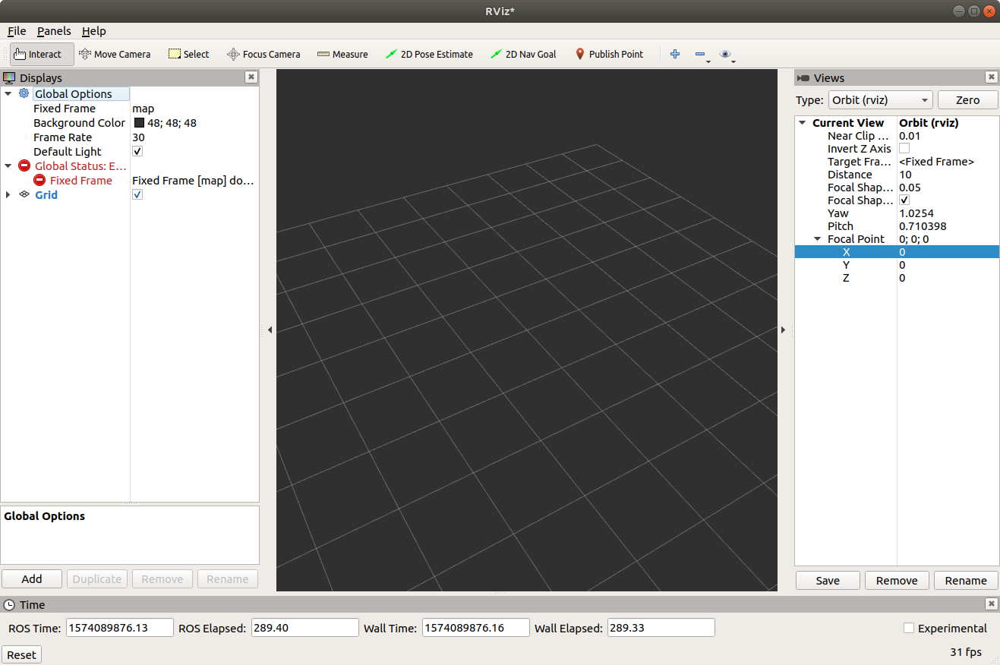
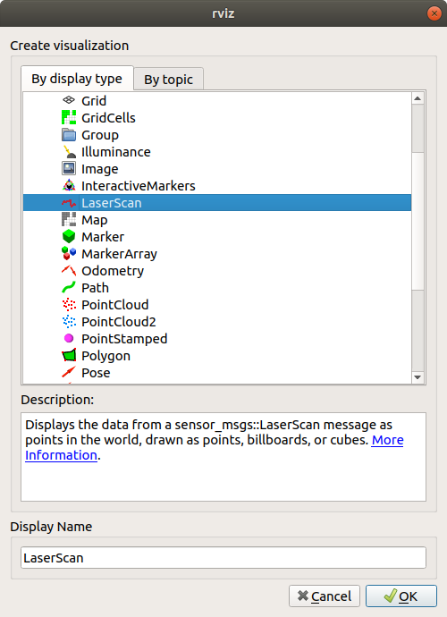
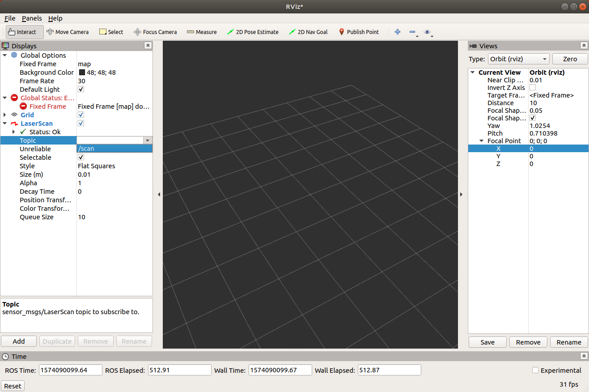
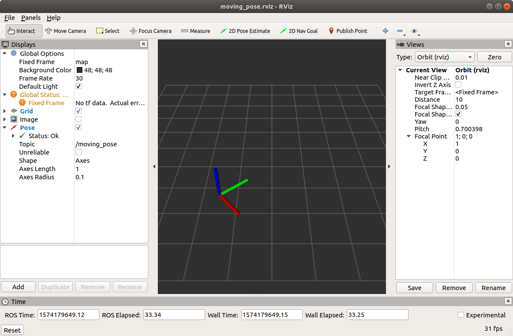

# RViz

## 1. RViz 소개

RViz는 ROS의 3차원 시각화 도구이다. ROS 메시지를 3차원으로 표현하는 것을 주요 목적으로 한다. 예를 들어 `geometry_msgs`의 다양한 기하 구조나, `sensor_msgs`의 다양한 센서 데이터를 별도의 프로그래밍 없이 보여줄 수 있다. 우리가 가진 터틀봇3에는 LDS가 있으므로 2차원 평면을 스캔한 거리들을 화면에 표시할 수 있고, 이를 Navigation 노드에 연결하면 LDS 정보를 이용해 만든 지도를 화면에 표시할 수도 있다.  

앞서 터틀봇 세팅을 하면서 LDS 데이터를 RViz로 확인하는 일을 이미 해보았다. 다음은 실행 명령어와 결과다.

```bash
# 터틀봇 라즈베리 파이에서
$ roslaunch turtlebot3_bringup turtlebot3_robot.launch

# 터틀봇과 연결된 데스크탑에서
$ roslaunch turtlebot3_bringup turtlebot3_model.launch
```


`turtlebot3_model.launch` 파일을 보면 그 안에서 rviz를 실행한다는 것을 알 수 있다.  

```xml
<node name="rviz" pkg="rviz" type="rviz" args="-d $(find turtlebot3_description)/rviz/model.rviz"/>
```

RViz 화면의 왼쪽 화면에 보여줄 (토픽) 메시지들을 선택하거나 추가할 수 있고 오른쪽에 그것을 시각화한 결과를 보여준다. RViz는 LDS (LiDAR) 뿐만 아니라 로봇에서 사용하는 RGB camera, Depth camera 등 다양한 센서 데이터를 시각화할 수 있다.  


## 2. RViz 사용법


```
rviz
```


빈 화면 화면 구성 설명




레이져 스캔 추가




토픽 선택




Fixed Frame도 base_scan으로 바꿔야 함

focal point를 옮겨보자: z=0.5

설정 저장: ~/.rviz/lds_scan.rviz


다시 똑같은 설정 불러오기

```
$ rviz ~/.rviz/lds_scan.rviz
```


## 좌표계 표시


# TODO

- 11.5: 가상환경 및 pycharm 설정, 프로젝트 공지
- 11.6: navigation base
- 11.12: ros name and roslaunch
- 11.13: 학술제 휴강
- 11.19: 사전 평가, 2차원 좌표계 변환 이론
- 11.20: 
- 11.26: 2차원 변환 numpy 코딩
- 11.27: 프로젝트 테스트
- 12.3: rviz, rqt - 좌표계 변환 결과 보여주기, config 저장 불러오기, image/LDS 보여주기
- 12.4: 


# Pose Publisher


```bash
$ cd catkin_ws/src
$ catkin create pkg pose_publisher --catkin-deps rospy std_msgs geometry_msgs
$ cd pose_publisher
$ mkdir rviz launch
$ touch src/pub_moving_pose.py launch/moving_pose.launch
$ chmod a+x src/pub_moving_pose.py launch/moving_pose.launch
```


```python
#!/home/ian/.pyenv/versions/ros_py36/bin/python
# TODO: shebang 경로 수정하기!
import rospy
from std_msgs.msg import Header
from geometry_msgs.msg import Point, Quaternion, Pose, PoseStamped
import numpy as np
from pose2d import Pose2D

def pose2d_to_3d(pose2d):
    x, y, theta = pose2d.get_params()
    print("pose2d:", pose2d)
    position = Point(x=x, y=y, z=0)
    orientation = Quaternion(w=np.cos(theta/2), x=0, y=0, z=np.sin(theta/2))
    pose3d = Pose(position=position, orientation=orientation)
    return pose3d

def main():
    rospy.init_node("pub_moving_pose")
    publisher = rospy.Publisher("moving_pose", PoseStamped, queue_size=1)

    center = (1, 0)
    radius = 2
    pose = Pose2D(center[0] + radius * np.cos(0), center[1] + radius * np.sin(0), np.pi / 2)
    angle = np.pi / 18.
    moved = Pose2D(center[0] + radius * np.cos(angle), center[1] + radius * np.sin(angle), np.pi / 2 + angle)
    motion = pose.motion_to(moved)
    rate = rospy.Rate(2)
    while not rospy.is_shutdown():
        pose3d = pose2d_to_3d(pose)
        header = Header(stamp=rospy.get_rostime(), frame_id="map")
        message = PoseStamped(header=header, pose=pose3d)
        publisher.publish(message)
        pose = pose.move(motion)
        rate.sleep()

if __name__ == "__main__":
    main()
```




rviz 파일 저장 rviz/moving_pose.rviz

launch/moving_pose.launch

```xml
<launch>
	<node pkg="pose_publisher" type="pub_moving_pose.py" name="pub_moving_pose"/>
	<node pkg="rviz" type="rviz" name="rviz" args="-d $(find pose_publisher)/rviz/moving_pose.rviz"/>
</launch>
```

rviz에서 `-d`는 불러올 .rviz 파일을 지정하는 옵션이다.

```
roslaunch pose_publisher moving_pose.launch --screen
```


```python
#!/home/ian/.pyenv/versions/ros_py36/bin/python
# TODO: shebang 경로 수정하기!
import rospy
from std_msgs.msg import Header
from geometry_msgs.msg import Point, Quaternion, Pose, PoseArray
import numpy as np
from pose2d import Pose2D

def pose2d_to_3d(pose2d):
    x, y, theta = pose2d.get_params()
    print("pose2d:", pose2d)
    position = Point(x=x, y=y, z=0)
    orientation = Quaternion(w=np.cos(theta/2), x=0, y=0, z=np.sin(theta/2))
    pose3d = Pose(position=position, orientation=orientation)
    return pose3d

def main():
    rospy.init_node("pub_pose_array")
    publisher = rospy.Publisher("pose_array", PoseArray, queue_size=1)

    center = (1, 0)
    radius = 2
    pose = Pose2D(center[0] + radius * np.cos(0), center[1] + radius * np.sin(0), np.pi / 2)
    angle = np.pi / 18.
    moved = Pose2D(center[0] + radius * np.cos(angle), center[1] + radius * np.sin(angle), np.pi / 2 + angle)
    motion = pose.motion_to(moved)
    rate = rospy.Rate(2)
    pose_arr = []
    count = 0
    while not rospy.is_shutdown():
        pose3d = pose2d_to_3d(pose)
        count += 1
        pose3d.position.z = count*0.01
        header = Header(stamp=rospy.get_rostime(), frame_id="map")
        pose_arr.append(pose3d)
        message = PoseArray(header=header, poses=pose_arr)
        publisher.publish(message)
        pose = pose.move(motion)
        rate.sleep()

if __name__ == "__main__":
    main()
```


```xml
<launch>
	<node pkg="pose_publisher" type="pub_pose_array.py" name="pub_pose_array"/>
	<node pkg="rviz" type="rviz" name="rviz" args="-d $(find pose_publisher)/rviz/pose_array.rviz"/>
</launch>
```


launch 실행하면


