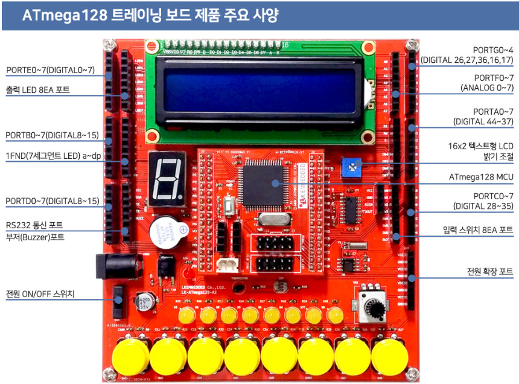
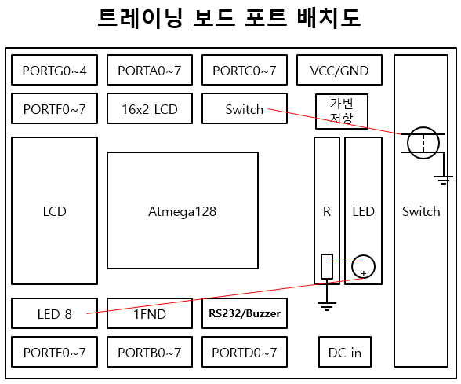
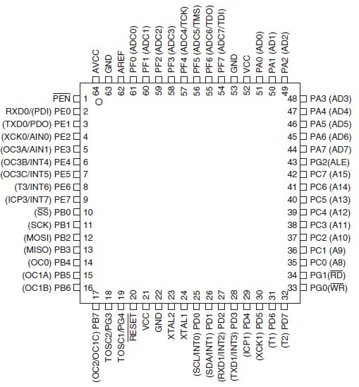

# ATmega128 Training Kit


ATmega128 실험 보드의 구성요소 입니다.



트레이닝 보드에 대한 더 자세한 내용은 아래 링크에서 확인할 수 있습니다.

<http://www.lkembedded.co.kr/goods/goods_view.php?goodsNo=923>

ATmega128 실험 보드의 구성을 좀 더 보기쉽게 추상화 시킨 그림입니다. 실험할 때 항상 참고하게 될 그림입니다.



ATmega128a의 핀배치도 입니다. 일반적인 디지털 입출력 외에 특수기능을 사용할 때 필요한 핀의 이름을 찾아야 합니다.




# Software Download

- atmel studio 7: <https://www.microchip.com/mplab/avr-support/atmel-studio-7>
- Zadig (USB driver): <https://zadig.akeo.ie/>
- 드라이버 설치 가이드: <http://www.lkembedded.co.kr/goods/goods_view.php?goodsNo=1447>


# Test Program

```c
#define F_CPU 16000000L
#include <avr/io.h>
#include <util/delay.h>

int main(void)
{
	DDRA |= 0x01;
	while(1)
	{
		
		PORTA |= 0x01;
		_delay_ms(500);
		PORTA &= ~0x01;
		_delay_ms(500);
	}
	return 0;
}
```

