# GUI Text Editor

지금까지는 `QPushButton`과 `QLabel`만 써서 PyQt의 GUI를 사용하는 흐름을 배웠다. 이제부터는 GUI 텍스트 에디터를 구현하는 실습을 하면서 다양한 GUI 객체들을 활용하는 법을 배울것이다. 여기서는 그 중에서 자주 쓰이는 GUI 객체들만 활용하고 알아보고 나머지는 [Qt Documentation](<https://doc.qt.io/qt-5/index.html>)에서 검색해서 용법을 찾아보면 된다.  

새로운 프로젝트를 시작하는 것이므로 파이참에서 새로운 `text_editor`란 이름의 새로운 프로젝트를 만들고 시작하자.  


## 1. QTextEdit

`QTextEdit`은 입출력 가능한 텍스트 창이다. 프로그램에서 텍스트를 출력할 수도 있고 사용자가 텍스트를 입력할 수도 있다. 일단 MainWindow에 `QTextEdit`을 추가해 화면에 띄워보자. 객체의 이름은 `textEdit` 그대로 두고 프로젝트 폴더에 `text_editor.ui`로 저장하자.

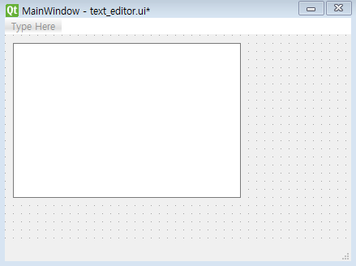


이후 UI 파일을 불러서 GUI를 화면에 띄우는 간단한 코드를 작성한다.

```python
import sys
from PyQt5.QtWidgets import *
from PyQt5 import uic

class MyWindow(QMainWindow):
    def __init__(self):
        super().__init__()
        self.ui = uic.loadUi("text_editor.ui", self)

def main():
    app = QApplication(sys.argv)
    editor = MyWindow()
    editor.show()
    app.exec_()

if __name__ == "__main__":
    main()
```

`QTextEdit`은 이 프로젝트에서 계속 사용될 것이기 때문이 주요 함수들을 아래와 같이 정리한다.

- setText(text): text를 화면에 표시한다.
- str toPlainText(): 화면에 표시중인 텍스트를 리턴한다.
- QCursor textCursor(): 현재 커서 정보를 담고 있는 `QCursor` 객체를 리턴한다.
- setFontFamily(str font): 글꼴을 font로 바꾼다.
- setTextColor(QColor color): `QColor ` 객체로 글꼴의 색을 지정한다.
- setFontWeight(int weight): QFont 내부에 정의된 weight 상수로 글꼴의 굵기를 지정한다.
- setFontItalic(bool set): True/False를 입력하여 글꼴의 기울기를 지정한다.
- setFontPointSize(int size): 글꼴의 크기를 지정한다.

> <<Signal 사전>> [QTextEdit](<https://doc.qt.io/qt-5/qtextedit.html#signals>)  
>
> **cursorPositionChanged**: 커서 위치가 변할 때 발생
>
> **textChanged**: 표시중인 텍스트가 변할 때 발생


## 2. QMenu, QAction

이제 화면 상단에 파일을 열고 닫을 수 있는 메뉴를 만들고 기능을 구현한다. QtDesigner에서 윈도우 상단의 `TypeHere`에 `File`이란 메뉴(QMenu)를 추가하고 그 아래 `Open`과 `Save`라는 액션(QAction)을 추가한다. 그러면 자연스럽게 Object Inspector 메뉴에 아래와 같이 객체들이 추가된다.

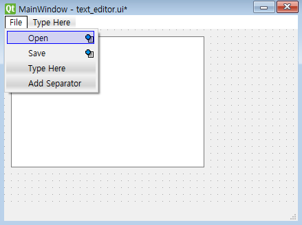

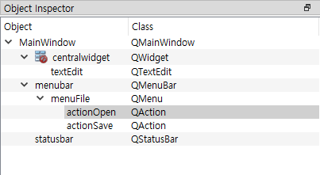

이제 코드에서 action을 클릭했을 때 실행할 Slot 함수를 연결해주자.

><<Signal 사전>> [QAction](<https://doc.qt.io/qt-5/qaction.html#signals>)  
>
>**triggered**: 상단 메뉴의 action을 클릭했을 때 발생하는 Signal이다.

`actionOpen.triggered`는 `open_file` 함수와 연결했고 `actionSave.triggered`는 `save_file` 함수와 연결하였다. 

```python
class MyWindow(QMainWindow):
    def __init__(self):
        super().__init__()
        self.ui = uic.loadUi("text_editor.ui", self)
        self.setup_ui()

    def setup_ui(self):
        self.actionOpen.triggered.connect(self.open_file)
        self.actionSave.triggered.connect(self.save_file)
```


`open_file` 함수에서는 `QFileDialog.getOpenFileName()`를 써서 다이얼로그에서 파일을 선택하여 파일명을 받을 수 있게 했다. 이후 파일 내용을 읽어 `textEdit`객체에 쓰기 위해 `setText()` 함수를 썼다.

```python
    def open_file(self):
        filename = QFileDialog.getOpenFileName(filter="Text files (*.txt)")
        filename = filename[0]
        print("open file:", filename)
        if not filename:
            return
        with open(filename, "r", encoding="utf8") as f:
            text = f.read(10000)
            self.textEdit.setText(text)
```


`save_file` 함수에서는 `QFileDialog.getSaveFileName()` 함수를 써서 다이얼로그에서 저장할 파일명을 지정하였다. 보통 텍스트 객체에서 현재 표시하고 있는 텍스트를 읽어오는 함수는 `text()`이지만 `QTextEdit`에서는 `toPlainText()`를 통해 현재 표시된 텍스트를 읽을 수 있다.

```python
    def save_file(self):
        filename = QFileDialog.getSaveFileName(filter="Text files (*.txt)")
        filename = filename[0]
        print("open file:", filename)
        if not filename:
            return
        with open(filename, "w", encoding="utf8") as f:
            f.write(self.textEdit.toPlainText())
```

다음과 같은 텍스트를 `fancy.txt`로 저장한 후 텍스트를 프로그램에서 불러온 결과는 아래 그림과 같다.

```
지금 하늘 구름 색은 Tropical yeah
저 태양 빨간빛 네 두 볼 같아
Oh tell me I’m the only one baby
I fancy you I fancy you fancy you
It’s dangerous 따끔해 넌 장미 같아
괜찮아 조금도 난 겁나지 않아
더 세게 꼭 잡아 Take my hand
좀 위험할거야 더 위험할거야 baby
달콤한 초콜릿 아이스크림처럼
녹아버리는 지금 내 기분 So lovely
깜깜한 우주 속 가장 반짝이는
저 별 저 별 그 옆에 큰 네 별
```

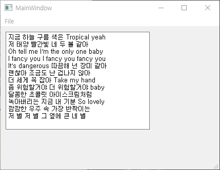


## 3. QStatusBar

텍스트를 읽어나 수정할 때 글자 수와 현재 위치를 윈도우 아래 statusbar에 출력해보자. 새 UI를 만들때 MainWindow를 선택하면 기본으로 윈도우 아래 `statusbar` 객체가 포함돼있다. 먼저 `textEdit`에서 커서가 이동할 때 발생하는 Signal(cursorPositionChanged)과 이를 처리하는 Slot 함수(update_status)를 연결해야 한다.

```python
    def setup_ui(self):
        self.actionOpen.triggered.connect(self.open_file)
        self.actionSave.triggered.connect(self.save_file)
        self.textEdit.cursorPositionChanged.connect( self.update_status)
```

`update_status()` 함수에서는 현재 커서 정보를 받기 위해 `textEdit.textCursor()` 함수를 통해 `QTextCursor` 객체를 받아와 커서 정보를 얻었다. `position()`은 현재 커서 위치고 `anchor()`는 drag를 시작했을 때의 커서 위치라서 평소엔 두 함수가 같은 값을 리턴하고 drag를 하면 다른 값을 리턴하게 된다.

```python
    def update_status(self):
        text_len = len(self.textEdit.toPlainText())
        cursor_pos = self.textEdit.textCursor().position()
        cursor_anc = self.textEdit.textCursor().anchor()
        if cursor_pos == cursor_anc:
            status = f"text length:{text_len}, cursor position: {cursor_pos}"
        else:
            status = f"text length:{text_len}, cursor range: {cursor_anc}~{cursor_pos}"
        self.statusbar.showMessage(status)
```


## 4. QComboBox

`QComboBox`는 여러개의 목록에서 하나를 선택할 수 있는 GUI다. 이를 이용해 새로 입력될 텍스트의 폰트(font)를 선택할 수 있도록 할 것이다. 편리하게도 QtDesigner에서는 이미 폰트 선택만을 위한 `QFontComboBox`라는 클래스를 제공하고 있고 이것만 추가하면 시스템의 모든 폰트를 자동으로 불러올 수 있으나 여기서는 학습 목적을 위해 기본적인 `QComboBox`를 쓰도록 한다.  

QtDesigner에서 왼쪽 Input Widgets 중에서 `Combo Box`를 선택하여 `textEdit` 옆에 놓는다. 객체 이름은 기본 값인 `comboBox` 그대로 둔다. UI 파일을 저장하고 코드를 수정한다.  폰트를 선택하고 이를 `textEdit`에서 반영하기 위해서는 다음 단계가 필요하다.

1. `comboBox` 객체에 폰트 목록을 추가하기
2. 시작할 때 기본 선택된 폰트를 `textEdit`에 반영하기
3. `comboBox`에서 폰트가 바뀔 때 자동으로 `textEdit`에 반영하기

이를 초기 설정을 하는 `setup_ui()` 함수에 반영하고 Slot 함수인 `change_font()` 함수를 만들었다.

```python
    def setup_ui(self):
        self.actionOpen.triggered.connect(self.open_file)
        self.actionSave.triggered.connect(self.save_file)
        self.textEdit.cursorPositionChanged.connect( self.update_status)
        self.comboBox.addItems(["굴림", "돋움", "바탕"])
        self.textEdit.setFontFamily(self.comboBox.currentText())
        self.comboBox.currentIndexChanged.connect( self.change_font)

    def change_font(self, cur_index):
        print("comboBox index:", cur_index)
        self.textEdit.setFontFamily(self.comboBox.currentText())
```


1. `comboBox.addItems()`로 폰트 목록을 추가
2. `comboBox.currentText()`로 현재 선택된 폰트를 읽어서 `textEdit.setFontFamily()` 함수로 폰트를 변경
3. `comboBox.currentIndexChanged`라는 Signal을 `change_font()`함수와 연결

> <<Signal 사전>> [QComboBox](<https://doc.qt.io/qt-5/qcombobox.html#signals>)  
>
> **currentIndexChanged**: combo box에서 선택된 item이 바뀔 때 발생, slot 함수에서 index를 입력인자로 받을 수 있다.  
>
> **currentTextChanged**: 사용자가 다른 item을 선택하거나 코드에서 item의 텍스트를 수정할 때 발생, slot 함수에서 선택된 item의 문자열을 입력인자로 받을 수 있다.  

이를 실행하여 폰트별로 글자를 쓴 결과는 다음과 같다.

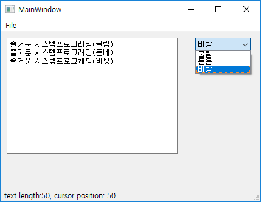


## 5. QGroupBox, QRadioButton

Radio button은 여러 개의 버튼 중에 하나만 선택할 수 있는 버튼이다. 여기서는 이를 이용해 새로 입력될 글자의 색깔을 결정하고자 한다. Radio button은 보통 group box와 함께 사용된다. 프로그램에서 radio button으로 한 가지 옵션만을 선택한다면 상관 없으나 다수의 radio button으로 두 가지 옵션을 선택해야 하는 경우에는 radio button들을 옵션별로 나눠야 한다. group box는 radio button들이 유일하게 선택되는 범위를 지정해준다.  또한 다수의 GUI 객체들이 한 화면에 혼재해 있으면 사용자가 메뉴를 찾기 어려우므로 비슷한 기능을 가진 객체들을 시각적으로 묶어주는 역할도 한다.

QtDesigner에서 왼쪽 Containers 중에서 `Group Box`를  `comboBox` 아래에 추가한다. group box 객체를 더블 클릭하여 기본 텍스트를 `Color`로 바꾼다. 다음엔 group box 안에 세 개의 radio button을 추가한다. 아래 그림처럼 되도록 **기본 텍스트**와 **객체 이름**을 수정하고 크기를 적당히 조절한다.

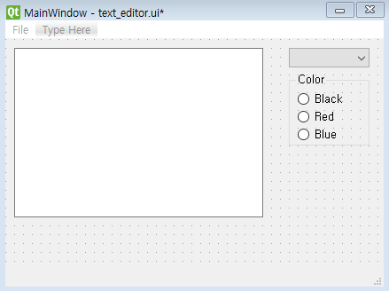

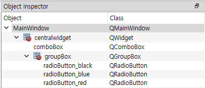


UI 파일을 저장하고 코드로 돌아가보자. 일단 `Black` 버튼을 눌렀을 때 반응하는 slot 함수 하나를 만들어보자.

```python
    def setup_ui(self):
        # ... 중략 ...
        self.radioButton_black.pressed.connect( self.set_color_black)

    def set_color_black(self):
        print("black color selected")
```

`QRadioButton`의 `pressed`라는 Signal을 사용한다. Qt에서 다양한 버튼들(QPushButton, QCheckBox, QRadioButton)은 같은 부모 클래스인 `QAbstractButton `으로부터 파생되었는데 여기에 여러가지 버튼에서 공통으로 사용되는 Signal들이 있다.

> <<Signal 사전>> [QAbstractButton](<https://doc.qt.io/qt-5/qabstractbutton.html#signals>)  
>
> **clicked**: 버튼을 클릭하면 발생, Slot 함수에서 체크 상태를 나타내는 `bool` 타입의 입력인자를 받을 수 있다.
>
> **pressed**: 버튼을 눌러서 체크가 되면 발생  
>
> **released**: 버튼을 눌러서 체크가 해제되면 발생  
>
> **toggled**: 버튼을 눌러서 체크 상태가 변하면 발생, Slot 함수에서 체크 상태를 나타내는 `bool` 타입의 입력인자를 받을 수 있다.

위 코드에서는 `radioButton_black`을 체크하면 `set_color_black()`가 실행되도록 했다. 위 방식대로 세 가지 색을 선택하려면 세 개의 radio button을 각각의 Slot 함수에 연결해야 할 것이다. 하지만 이렇게하면 버튼이 늘어남에 따라 코드가 상당히 길어진다. 이때 세 개의 버튼을 하나의 `QButtonGroup` 객체에 담으면 한 번의 connect로 세 개의 버튼을 모두 처리할 수 있다.  

아래 코드를 보면 `QButtonGroup` 클래스의 `rb_color_group`이라는 객체를 만들고  세 개의 버튼을 거기에 담았다. 그런뒤 `buttonPressed`라는 Signal을 `change_color()` 함수에 연결하였다.

>  <<Signal 사전>> [QButtonGroup](<https://doc.qt.io/qt-5/qbuttongroup.html#signals>)  
>
> **buttonClicked**: 그룹에 속한 버튼을 클릭하면 발생
>
> **buttonPressed**: 그룹에 속한 버튼을 눌러서 체크가 되면 발생
>
> **buttonReleased**: 그룹에 속한 버튼을 눌러서 체크가 해제되면 발생
>
> **buttonToggled**: 그룹에 속한 버튼을 눌러서 체크 상태가 변하면 발생
>
> 네 개의 Signal 모두 공통적으로 연결된 Slot 함수에서 입력인자로 버튼 객체를 받을 수 있다.


```python
from PyQt5.QtGui import QColor

    def setup_ui(self):
        # ... 중략 ...
        self.radioButton_black.pressed.connect( self.set_color_black)
        self.rb_color_group = QButtonGroup()
        self.rb_color_group.addButton(self.radioButton_black)
        self.rb_color_group.addButton(self.radioButton_red)
        self.rb_color_group.addButton(self.radioButton_blue)
        self.rb_color_group.buttonPressed.connect( self.change_color)

    def change_color(self, rbutton):
        print("change color to", rbutton.text())
        if rbutton is self.radioButton_black:
            self.textEdit.setTextColor(QColor(0, 0, 0))
        elif rbutton is self.radioButton_red:
            self.textEdit.setTextColor(QColor(255, 0, 0))
        elif rbutton is self.radioButton_blue:
            self.textEdit.setTextColor(QColor(0, 0, 255))
```


`QButtonGroup` 의 Signal들은 그룹에 속한 버튼을 하나라도 클릭하면 발생하므로 Slot 함수를 버튼마다 따로 만들지 않아도 된다. Slot 함수인 `change_color()`에서는 이벤트를 발생시킨 버튼 객체를 입력인자 `rbutton`으로 받고 이 객체가 어떤 것인지를 `is` 연산자를 통해 확인한다. 객체를 확인하면 `QTextEdit.setTextColor()` 함수를 통해 앞으로 입력될 글자색을 변경한다.  

입력인자로 `QColor`  객체를 받기 때문에 `from PyQt5.QtGui import QColor`를 추가하였다. `QColor`에 들어가는 세 개의 숫자는 RGB 즉, red, green, blue 세 가지 색을 의미한다.

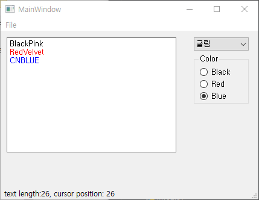


## 6. QCheckBox

Check box는 각 버튼을 독립적으로 체크할 수 있는 버튼의 한 종류이다. Check box도 radio button과 마찬가지로 `QAbstractButton`을 상속 받았으며 `QButtonGroup` 에 넣을 수 있다. Check box를 이용해서 새로 입력될 글자의 굵기와 기울기를 조절할 것이다. 이번에도 check box를 추가하기 전에 group box를 먼저 추가한다. 새로운 group box를 Color group box 아래 추가하고 기본 텍스트를 `Effect`로 바꾼다. 그 안에 두 개의 check box를 추가하고 아래와 같이 기본 텍스트와 객체 이름을 수정한다.

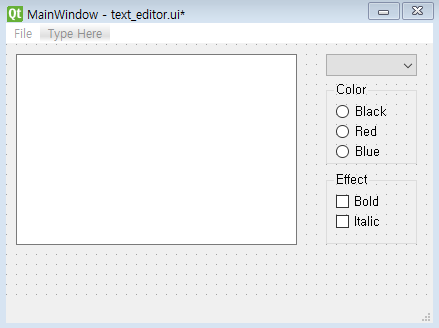

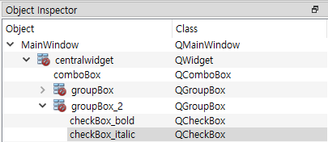

Check box도 `QButtonGroup`에 넣어서 하나의 Slot 함수로 처리할 수 있지만 check box는 각각의 체크 여부에 따라 설정이 달라지므로 하나의 Slot 함수로 처리하는 것이 별 이득이 없다. 그래서 이번에는 각 check box마다 따로 Slot 함수를 만들어준다. Check box의 상태가 변할 때마다 반응을 해야 하므로 `toggled` Slot을 썼고 Slot 함수는 체크 상태를 확인할 수 있는 `checked`라는 입력인자를 넣어준다.

```python
from PyQt5.QtGui import QColor, QFont

    def setup_ui(self):
        # ... 중략 ...
        self.checkBox_bold.toggled.connect(self.set_bold)
        self.checkBox_italic.toggled.connect(self.set_italic)

    def set_bold(self, checked):
        print("set bold:", checked)
        if checked:
            self.textEdit.setFontWeight(QFont.Bold)
        else:
            self.textEdit.setFontWeight(QFont.Normal)

    def set_italic(self, checked):
        print("set italic:", checked)
        self.textEdit.setFontItalic(checked)
```


`set_bold()` 함수에서는 글자의 굵기를 조절하기 위해 `QTextEdit.setFontWeight()` 함수를 사용한다. 입력인자로 `QFont`에 속하는 상수를 입력한다. `QFont`를 쓰기 위해 맨 위의 `import`문에 `QFont`를 추가하였다.  `QFont`에서 선택할 수 있는 `Weight` 상수는 [여기](<https://doc.qt.io/qt-5/qfont.html#Weight-enum>)서 확인할 수 있다. 체크가 되어있으면 `QFont.Bold`로 굵은 글씨가 나오게 하고 아니면 `QFont.Normal`로 보통 굵기로 나오게 한다.  

`set_italic()` 함수에서는 글자의 기울기를 조절하기 위해 `QTextEdit.setFontItalic()` 함수를 사용한다. 입력이 `bool` 타입이므로 입력인자로 받은 `checked` 변수를 그대로 전달한다.  

다음은 글자의 굵기와 기울기를 조절하며 문자열을 입력한 결과이다.

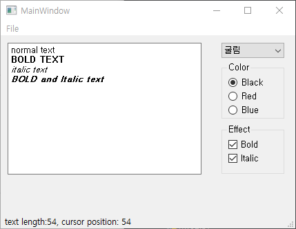


## 7. QSlider

Slider 객체는 가로축이나 세로축 홈(groove)을 따라 핸들(handle)을 움직이며 제한된 범위내의 숫자를 조절할 수 있는 GUI 객체다. 대부분의 기능을 부모 클래스인 `QAbstractSlider`로부터 물려받았으므로 부모 클래스의 documentation을 보는 것이 낫다. `QAbstractSlider`의 주요 함수는 다음과 같다.

- `minimum(), maximum()`: 현재 최소, 최대 값 읽기
- `setMinimum(), setMaximum()`: 최소, 최대 값 설정
- `singleStep(), setSingleStep()`: 슬라이더 한 칸 이동 값 읽기, 쓰기
- `value(), setValue()`: 현재 핸들 위치 읽기, 쓰기

> <<Signal 사전>> [QSlider](<https://doc.qt.io/qt-5/qabstractslider.html#signals>)
>
> **valueChanged()**: 슬라이더의 값이 변하면 발생

이 프로젝트에서는 슬라이더를 이용하여 텍스트의 크기를 조절하고자 한다. QtDesigner에서 Input Widgets 아래 있는 `Horizontal Slider`를 윈도우에 추가해보자. 그리고 그 아래 Display Wdigets 아래 있는 `Label`도 추가하여 아래와 같은 그림을 만들어보자. 

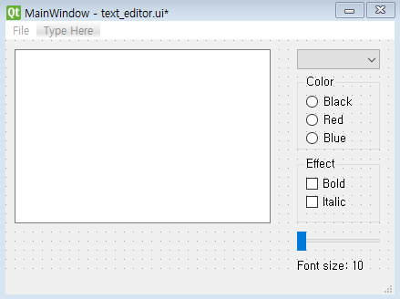

Slider 객체 이름은 `horizontalSlider` 그대로 두고 Label의 기본 텍스트는 `Font size: 10`으로 이름은 `label_slider_value`로 수정한다.

슬라이더에 따라 입력 글자 크기가 변하는 에디터를 만들기 위해 코드를 수정한다. `setup_ui()`에서 폰트 크기의 최소, 최대 값을 지정하고 `valueChanged()` Signal을 `change_font_size()` 함수와 연결한다. 이벤트가 발생하면 `label_slider_value`에 현재 폰트 크기를 표시하고 `QTextEdit.setFontPointSize()` 함수를 통해 폰트 크기를 조절한다.

```python
    def setup_ui(self):
        # ... 중략 ...
        self.horizontalSlider.setMinimum(10)
        self.horizontalSlider.setMaximum(20)
        self.horizontalSlider.valueChanged.connect( self.change_font_size)

    def change_font_size(self, size):
        print("font size:", size)
        self.label_slider_value.setText(f"Font size: {size}")
        self.textEdit.setFontPointSize(size)
```

다음은 폰트 크기를 조절한 결과이다.

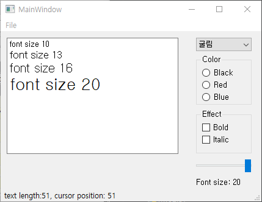


## 8. QLineEdit

`QLineEdit` 클래스는 한 줄짜리 단순한 텍스트 입출력을 하는데 사용된다. ID/PW 를 입력하는 창이 그 예이다. 여기서는 두 개의 line edit 객체로 두 개의 단어를 받아서 `textEdit`의 텍스트 내의 첫 번째 단어를 두 번째 단어로 교체하는 **Replace** 기능을 구현하고자 한다.  

QtDesigner에서 Input Widgets 아래 `Line Edit` 을 윈도우에 두 개를 추가하고 Buttons 아래 있는 `Push Button`도 옆에 하나 추가하자. Push button의 기본 텍스트는 `Replace`로 하고 객체 이름은 `pushButton_replace`로 한다. Line edit 객체들의 이름도 `lineEdit_replace_src, lineEdit_replace_dst`로 수정하여 다음과 같은 상태를 만들어 보자.

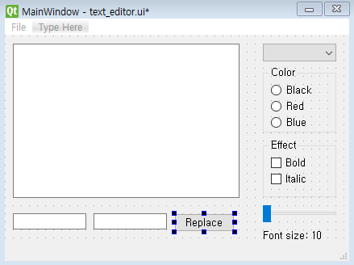

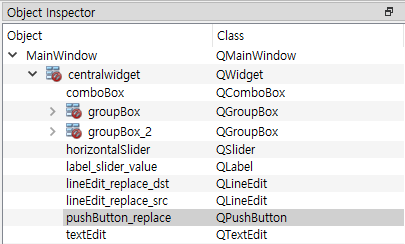

코드에서는 `QPushButton`의 `clicked` Signal을 이용하여 버튼이 눌렸을 때 `replace()` 함수를 실행하게 한다.

```python
    def setup_ui(self):
        # ... 중략 ...
        self.pushButton_replace.clicked.connect(self.replace)

    def replace(self):
        text = self.textEdit.toPlainText()
        text = text.replace(self.lineEdit_replace_src.text(), self.lineEdit_replace_dst.text())
        self.textEdit.setText(text)
```

`textEdit.toPlainText()`으로 현재의 텍스트를 문자열로 받았고 이 문자열에서 두 개의 line edit으로 입력받은 두 단어를 교체하였다. `lineEdit_replace_src.text()`가 기존 텍스트에서 검색할 기존 단어이고 `lineEdit_replace_dst.text()`는 새로운 텍스트에서 기존 단어 대신 들어갈 단어이다.

`fancy.txt`를 열어서 `fancy`를 `desire`로 바꾼 결과이다.

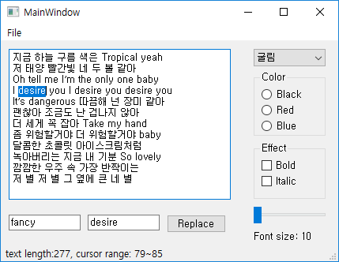


지금까지 우리는 QtDesigner를 통해 GUI 객체들을 MainWindow에 추가하고 이들의 동작을 파이썬 코드에서 지정하여 텍스트 에디터를 만들었다. 다양한 GUI 클래스들이 필요하고 각 클래스 마다 사용하는 함수나 Signal 등이 다르지만 Documentation을 잘 보고 구글링을 하면 각 클래스의 사용법을 알 수 있다. 다른 유용한 GUI 클래스들도 많지만 이 정도 프로그램을 만들 수 있다면 GUI 프로그래밍의 패턴을 익힌 것이므로 다른 GUI 클래스들도 어렵지 않게 쓸 수 있을 것이다.


## Homework 3

각자 자신만의 GUI 프로그램을 만들어보세요. 창의적인 아이디어가 있다면 새로운 프로그램을 만들어도 되고 생각나는게 없다면 텍스트 에디터를 만들어도 됩니다.

### 창작 프로그램 만들기

자유 주제로 만들고 싶은 GUI 프로그램을 만들되 두 가지 조건을 만족해야 한다.

- Push button과 Label 외에 최소 6가지 이상의 GUI 요소를 사용해야 한다. 여기에 나오지 않은 GUI 요소를 써도 된다. 
- 단순히 여러 GUI 요소를 나열하는 것이 아니라 특정 목적을 위해 GUI 요소들이 용도에 맞게 적절히 사용되어야 한다. 

평가: 창의성 4점, GUI 다양성 6점, GUI 적합성 5점  

### 텍스트 에디터 만들기

본 포스트에서 만든 에디터와는 사용법이 전혀 다른 새로운 에디터를 만들어야 한다. 변화를 줄 수 있는 첫 번째 방법은 GUI의 기능을 서로 바꾸는 것이다. 예를 들어 여기서는 radio button으로 글자 색을 선택하고 combo box로 글꼴을 선택했는데 둘의 기능을 서로 바꿀수 있다. 두 번째 방법은 여기 나오지 않은 새로운 GUI 요소를 쓰는 것이다. 텍스트 에디터 구현 조건은 다음과 같다.

- 여기에 나온 GUI 요소 중 Push button, Label, Text edit외에 6가지 이상이 사용되어야 한다.
- GUI 사용 방법이 학생들 모두 달라야 한다. 사용 방법이 전반적으로 유사할 경우 표절로 간주한다.
- 여기서 사용하지 않았던 GUI 요소가 2개 이상 들어가야 한다. Qt Documentation 을 참고하여 새로운 GUI의 사용법을 스스로 알아봐야 한다.

평가: 독창성 4점, 기존 GUI 활용 6점, 새로운 GUI 활용 5점  

**주의**: 두 가지 프로그램 모두 버그가 없어야 합니다. 예를 들어 글자 색을 Check box로 선택하게 하면 두 가지 색이 선택 가능해져서 무슨 색이 나와야 하는지 알수 없게 됩니다. 크기와 색을 모두 선택했는데 둘 중 하나만 적용이 된다거나 에러가 나서 프로그램이 꺼지면 안됩니다. 버그 발견시 1~5점의 감점 있습니다.

