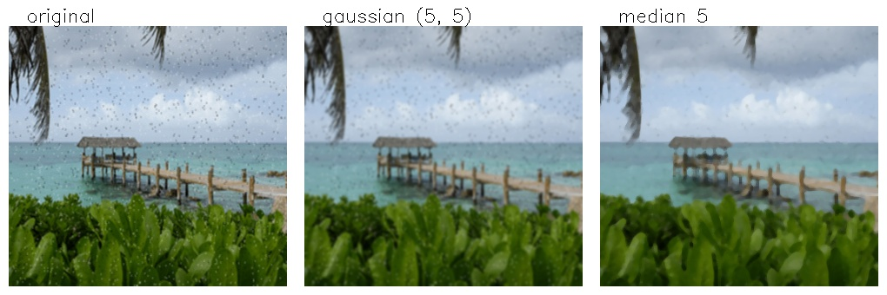
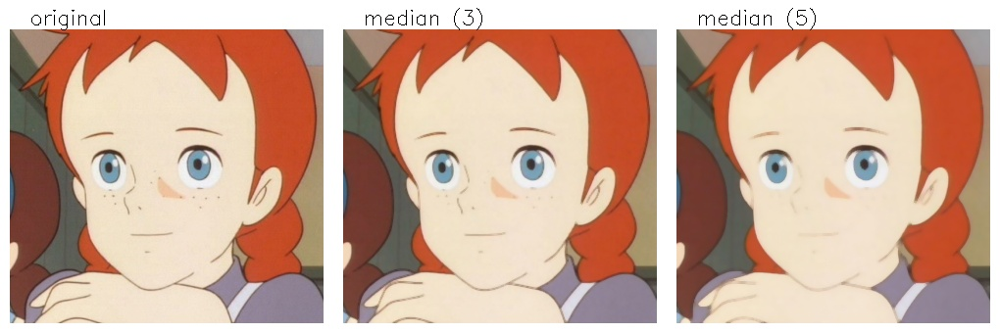
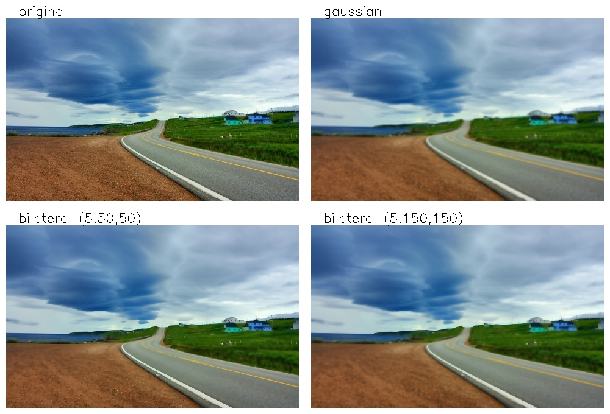
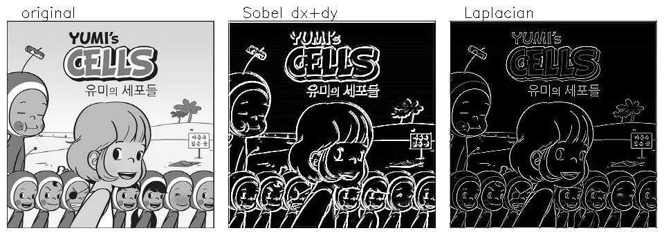
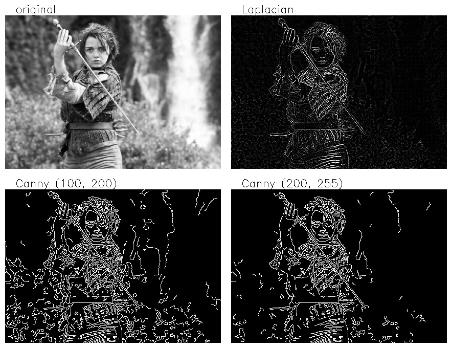
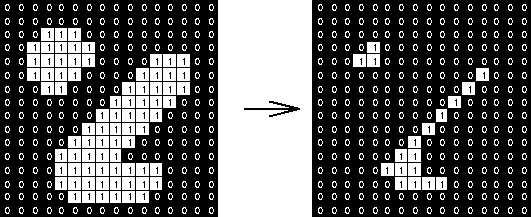

# 1. Filter and Convolution

영상 처리에서 **필터(filter)**란 원본 영상에서 원하는 효과를 넣어나 필요한 정보를 추출해내는 방법이다. 영상을 부드럽게 만들거나 또렷하게 만드는 것, 영상에서 엣지(edge, 경계)를 찾아내는 것 등의 역할을 수행한다. 필터는 고차원적인 객체 인식 등의 기술을 사용하기 전에 이미지의 노이즈를 제거하는 등의 전처리 과정으로도 많이 쓰인다.

필터에는 주변의 픽셀 값을 이용하는 공간 영역 필터와 픽셀 값들을 주파수 영역으로 변환해서 처리하는 주파수 영역 필터가 있는데 주로 쉽고 단순한 공간 영역 필터가 많이 쓰인다. 공간 영역 필터는 주로 **컨볼루션(convolution)** 연산을 이용하여 구현한다. 컨볼루션은 모든 픽셀에 대해 주변 영역 픽셀 값과의 일정한 연산을 반복하여 결과 영상을 얻어내는 방법을 말한다. 컨볼루션을 연산 방법은 아래 그림과 같다. 


가운데 움직이는 배열을 **커널(kernel)**이라 하며, 윈도우(window), 필터(filter), 마스크(mask)라고도 부른다. 커널은 슬라이딩 윈도우(sliding window) 방식으로 모든 픽셀을 돌아가며 주변 픽셀과 곱한 후 합산한다. 다음은 OpenCV C++ 스타일로 구현한 컨볼루션 예시다.

```cpp
void filter(srcimg, kernel, anchor, dstimg) {
    for(int v=0; v<srcimg.rows; v++) {
        for(int u=0; u<srcimg.cols; u++) {
            int value=0;
            for(int i=0; i<kernel.rows; i++) {
                for(int k=0; k<kernel.cols; k++) {
                    value += srcimg.at<uchar>(v+i+anchor.y, u+k+anchor.x) * kernel.at<uchar>(i, k);
                }
            }
            dstimg.at<uchar>(v, u) = value;
        }
    }
}
```

컨볼루션은 주변 픽셀들과 연산을 하므로 커널의 크기와 값을 어떻게 주느냐에 따라 결과가 크게 달라진다. 주변 픽셀과의 평균을 구하게 하면 영상이 부드러워지는 효과가 있고 주변 픽셀과의 차이를 구하면 엣지 영상을 얻을 수 있다. OpenCV에서는 사용자가 지정한 임의의 커널과 컨볼루션을 할 수 있는 `cv2.filter2D()`라는 함수도 제공하고 자주 쓰이는 커널을 이용한 컨볼루션 연산도 다양한 전용 함수로 제공한다.

> dst = **cv2.filter2D**(src, ddepth, kernel[, dst, anchor, delta, borderType])
>
> - src: 입력 영상
> - ddepth: 출력 영상의 dtype, 커널에 따라 컨볼루션 결과가 음수가 나오거나 255가 넘을 수 있으므로 값 범위를 생각해서 출력 데이터 타입을 정해줘야 한다. -1이면 입력 영상과 동일한 타입이고, 선택할 수 있는 cv2.CV_8U, cv2.16U, CV_32F 등의 값을 [이곳](<https://docs.opencv.org/4.1.0/d4/d86/group__imgproc__filter.html#filter_depths>)에서 확인할 수 있다.
> - kernel: 컨볼루션 커널, 보통 커널은 3 x 3, 5 x 5 등의 홀수 정사각형 모양을 쓴다.
> - dst: 결과 영상
> - anchor: 커널의 기준점
> - delta: 필터 적용된 값에 추가할 값
> - borderType: 컨볼루션을 할 때 외곽 픽셀에 대해서는 커널과 완전한 컨볼루션을 할 수가 없다. 이를 처리하는 방법이 여러가지 있는데 [이곳](<https://docs.opencv.org/4.1.0/d2/de8/group__core__array.html#ga209f2f4869e304c82d07739337eae7c5>)에서 확인할 수 있다.


# 2. Blurring

영상의 경계를 흐릿하게 해서 부드럽게 만드는 것을 블러링(blurring) 혹은 스무딩(smoothing)이라 한다. 스무딩 필터의 특징은 **커널의 모든 값이 양수고 합이 1**이라는 것이다. 합이 1보다 커지면 영상이 전체적으로 그만큼 밝아진다. 다음은 스무딩 커널의 예시다. 둘다 크기는 3x3인데 왼쪽은 단순히 평균을 내는 커널이고 오른쪽은 중앙 픽셀에 더 가중치를 주는 커널이다. OpenCV에서는 스무딩 커널을 자동으로 만들어 적용해주는 함수들이 있는데 그 함수들의 사용법에 대해 알아보자.


$$
K_1 = {1 \over 9} \begin{bmatrix} 1 & 1 & 1 \\ 1 & 1 & 1 \\ 1 & 1 & 1 \end{bmatrix}, 
\quad K_2 = {1 \over 16} \begin{bmatrix} 1 & 2 & 1 \\ 2 & 4 & 2 \\ 1 & 2 & 1 \end{bmatrix}
$$


## 2.1 Mean Filter

**평균 필터**는 일정 크기의 주변 영역의 픽셀 값을 평균내서 해당 픽셀 값을 만들어준다. 평균 필터를 적용하는 방법은 두 가지가 있는데 커널을 직접 만들어서 `cv2.filter2D()` 함수를 이용하는 방법과 평균 커널까지 자동으로 생성해주는 `cv2.blur()` 함수를 사용하는 방법이 있다. 

> dst = **cv2.blur**(src, ksize[, dst, anchor, borderType])
>
> - src: 입력 영상
> - ksize: 커널의 크기 (너비, 높이), 일반적인 배열의 크기는 (높이, 너비) 순서지만 'ksize'는 (너비, 높이) 순서로 입력한다.
> - dst: 결과 영상

같은 영상에 두 가지 함수를 사용해서 다양한 크기의 평균 필터를 적용한 결과를 비교해보자. 결과를 보면 커널의 크기가 커질수록 그림이 더 흐려지는 것을 볼 수 있다. (1, 1) 커널은 원본 영상과 같다. (7, 1) 커널은 가로로 평균을 내므로 가로선이 흐릿해지고 (1, 7) 커널은 세로로 평균을 내므로 세로선이 흐릿해진다. 크롬에서 우클릭하여 "새 탭에서 이미지 열기"를 누르면 원본 크기로 볼 수 있다.


코드에서는 결과 영상을 제목과 함께 `filter_results, blur_results`라는딕셔너리로 만든 후 이를 `show_imgs()` 함수를 통해 하나의 영상으로 보여준다.

```python
import cv2
import numpy as np
import show_imgs as si
IMG_PATH = "../sample_imgs"

def blur():
    image = cv2.imread(IMG_PATH + "/yumi-cells.jpg")
    kernel_sizes = [(1, 1), (3, 3), (5, 5), (7, 7), (7, 1), (1, 7)]
    filter_imgs = {}
    blur_imgs = {}
    for ksize in kernel_sizes:
        title = f"ksize: {ksize}"
        kernel = np.ones(ksize)
        kernel /= kernel.size
        filter_imgs[title] = cv2.filter2D(image, -1, kernel)
        blur_imgs[title] = cv2.blur(image, ksize)
    resimg = si.show_imgs(filter_imgs, "cv2.filter2D", 3)
    resimg = si.show_imgs(blur_imgs, "cv2.blur", 3)

if __name__ == "__main__":
    blur()
```

`show_imgs` 모듈은 여러 영상을 동시에 보여주기 위해 만든 모듈이다. `matplotlib`을 써도 되지만 `matplotlib`은 정확한 픽셀 크기 그대로 보여주지 않기 때문에 여러 영상이 합쳐진 영상을 만든 후 픽셀 크기 그대로 보여주는 `cv2.imshow`를 써서 보여준다. 단, 이 함수는 딕셔너리에 들어있는 모든 영상의 크기가 같다는 것을 전제로 한다. 모듈 구현은 [Appendix](#appendix)에서 확인할 수 있다.


## 2.2 Gaussian Filter

평균 필터를 이용한 결과는 커널이 커지면 영상이 부드러워지기 보다는 뭉개진다는 표현이 어울린다. **가우시안(Gaussian) 필터**는 영상의 엣지를 부드럽게 만들면서도 원본 영상에 조금 더 까까운 결과를 준다. 비결은 커널을 가우시안 분포(Gaussian Distribution)를 이용해 만들어 원본 픽셀에 더 많은 가중치를 주는 것이다. 다음은 이를 OpenCV에서 구현한 `cv2.GaussianBlur()` 함수의 프로토 타입이다.

> dst = **cv2.GaussianBlur**(src, ksize[, sigmaX, dst, sigmaY, borderType])
>
> - src: 입력 영상
> - ksize: 커널 크기, 너비와 높이가 모두 양의 홀수여야 한다.
> - sigmaX: 가우시안 커널의 표준편차, 0을 넣으면 ksize로부터 자동으로 계산한다.

아래 그림에서 `cv2.blur()`의 결과와 비교해 보면 평균 필터는 잔상이 퍼지는 느낌이 있지만 가우시안 필터는 영상이 부드럽게 흐릿해진다. 커널의 사이즈는 같지만 가우시안 필터가 원본에 더 가까움을 볼 수 있다.


```python
# blur() 함수 뒤에
def gaussian():
    image = cv2.imread(IMG_PATH + "/yumi-cells.jpg")
    kernel_size = (5, 5)
    blur_imgs = {}
    blur_imgs["original"] = image
    blur_imgs["blur"] = cv2.blur(image, kernel_size)
    blur_imgs["GaussianBlur"] = cv2.GaussianBlur(image, kernel_size, 0)
    result_img = si.show_imgs(blur_imgs, "GaussianBlur", 3, 1000)
```


## 2.3 Median Filter

`cv2.blur()` 함수나 `cv2.GaussianBlur()` 함수나 커널은 약간 다르지만 컨볼루션을 이용해 (가중) 평균을 계산한다는 것은 같다.  이런 필터도 자잘한 노이즈를 개선하는데 도움이 되지만 노이즈로 인해 주변과 값이 너무 다른 픽셀 값이 점처럼 여러 곳에 찍히게 되면 오히려 노이즈가 주변 픽셀로 퍼지는 현상이 발생한다. 이런 노이즈를 salt-and-pepper 노이즈라고 한다. 이런 노이즈를 제거하기 위해서는 주변 모든 픽셀 값을 사용하기 보다는 주변 픽셀 값 중에서 중간(median) 값 하나만 사용하는 것이 좋다. 예를 들어 3x3 커널이면 주변 9개의 픽셀 값을 정렬해서 중간 값인 5번째 값을 해당 픽셀에 대입하는 것이다. 이런 필터를 **미디언(median) 필터**라고 한다.   

먼저 결과를 보면서 이해해 보자. 왼쪽 원본 영상에는 검고 흰 점들이 무수히 찍혀 있는게 거기에 가우시안 필터를 적용해도 노이즈가 뭉개질 뿐 사라지진 않는다. 하지만 오른쪽의 미디언 필터를 적용한 결과는 아직 남아있는 점도 있지만 상당수의 점들이 사라진 것을 볼 수 있다. 미디언 필터도 영상이 부드러워지긴 하는데 가우시안 블러링과는 느낌이 다르다. 미디언 필터는 경계가 흐릿해지진 않지만 경계선이 단순해지는 효과가 있어서 마치 물감으로 그린듯한 효과가 난다.




 OpenCV에서는 미디언 필터를 구현한 `cv2.medianBlur()`라는 함수를 제공한다.

> dst = **cv2.medianBlur**(src, ksize[, dst])
>
> - src: 입력 영상
> - ksize: 다른 필터 함수와는 다르게 medianBlur에서는 (너비, 높이)의 튜플이 아니라 정사각형 커널을 가정하고 **양의 홀수 하나**만 입력한다.
> - dst: 결과 영상

미디언 필터를 이용하면 노이즈 뿐만 아니라 실제 사물에 존재하는 작은 점들을 없애는데도 효과적이다. 주근깨로 유명한 빨간머리 앤의 주근깨를 없애보자.

```python
def median():
    image = cv2.imread(IMG_PATH + "/ann.jpg")
    median_imgs = dict()
    median_imgs["original"] = image
    median_imgs["median (3)"] = cv2.medianBlur(image, 3)
    median_imgs["median (5)"] = cv2.medianBlur(image, 5)
    result_img = si.show_imgs(median_imgs, "Median Filter", 3)
```



여기서는 점의 크기가 좀 있기 때문에 3x3 커널로는 주근깨를 충분히 없애지 못 했지만 5x5에서는 주근깨가 거의 사라진 것을 볼 수 있다. 대신 얇은 눈썹 부분이 더 얇아지게 되었다.


## 2.4 Bilateral Filter

블러링 필터는 노이즈를 약화시키는데 효과가 있지만 경계(edge)도 흐릿하게 만든다. 바이래터럴(bilateral) 필터는 노이즈는 줄이면서 경계는 살리기 위해 중심 픽셀과의 거리 뿐만 아니라 색상 차이까지 고려하여 커널을 만든다. 가우시안 커널은 중심 픽셀과의 거리를 기준으로 일정한 커널을 만들어 영상 전체에 적용하지만 바이래터럴 필터는 주변 픽셀과의 밝기 차이도 고려해서 차이가 클수록 낮은 가중치로 곱하므로 **모든 픽셀마다 다른 커널이 적용**된다. 이는 다음 그림에 표현되어 있다. 왼쪽이 원본 영상이고 중앙이 컬러 차이에 따라 가중치를 준 커널, 오른쪽은 컬러 커널에 공간적 거리를 고려한 가우시안 커널을 곱한 커널이다.


OpenCV에서는 바이래터럴 필터를 구현한 `cv2.bilateralFilter()` 함수를 제공한다.

> dst = **cv2.bilateralFilter**(src, d, sigmaColor, sigmaSpace[, dst, boderType])
>
> - src: 원본 영상
> - d: 필터링에 들어갈 주변 픽셀 반경, -1을 넣으면 sigmaSpace에 의해 자동 결정된다.
> - sigmaColor: 주변 픽셀의 밝기 차이에 따른 가중치 반영 지수, 이 값이 높을 수록 큰 차이가 나는 주변 픽셀 값도 높은 가중치를 갖게 된다.
> - sigmaSpace: 주변 픽셀과의 거리에 따른 가중치 반영 지수, 이 값이 클수록 멀리 있는 픽셀도 높은 가중치를 갖게 된다.


필터를 비교한 영상을 보면 가우시안 필터를 적용한 영상에서는 원본에 비해 모든 것이 흐릿하게 보인다. 반면 바이래터럴 필터를 적용한 영상에서는 아래의 흙, 아스팔트, 초원의 자잘한 변화는 부드럽게 처리가 됐지만 도로선이나 하늘과 바다의 경계, 집의 윤곽선은 원본 영상처럼 선명하게 남아있다. 두 개의 sigma 값이 낮게 들어간 영상(왼쪽 아래)에서는 흙 바닥에 밝거나 검은 튀는 픽셀들이 하나씩 남아있는데 비해 sigma 값이 높게 들어간 영상(오른쪽 아래)에서는 아주 강한 경계면을 제외하고는 대부분 블러링이 심해졌다.



```python
def bilateral():
    image = cv2.imread(IMG_PATH + "/road.jpg")
    kernel_size = (5, 5)
    blur_imgs = {}
    blur_imgs["original"] = image
    blur_imgs["gaussian"] = cv2.GaussianBlur(image, kernel_size, 0)
    blur_imgs["bilateral (5,50,50)"] = cv2.bilateralFilter(image, 5, 50, 50)
    blur_imgs["bilateral (5,150,150)"] = cv2.bilateralFilter(image, 5, 150, 150)
    result_img = si.show_imgs(blur_imgs, "Bilateral Filter", 2)
```


# 3. Edge Detection

영상에서 경계(edge, 엣지)는 픽셀 값이 크게 변하는 지점으로 영상에 담긴 사물의 윤곽선과 밀접한 관계가 있다. 전통적인 컴퓨터 비전에서 엣지 검출은 영상에서 사물들을 분리하는데 매우 중요한 역할을 한다. 엣지를 검출하는 방법은 영상을 특정 방향(주로 가로나 세로)으로 미분하는 것인데 영상은 연속 공간이 아니므로 이산 공간에서 근사화하여 계산한다. 다음은 영상에서 가로, 세로 방향으로 1차 미분을 하는 방법과 미분으로부터 엣지의 강도(magnitude)와 방향(direction)을 구하는 식이다.

$$
\begin{align}
& G_y = {\partial I(y,x) \over \partial y} = I(y+1,x) - I(y,x),  \quad G_x = {\partial I(y,x) \over \partial x} = I(y,x+1) - I(y,x)  \\\\
& magnitude = \sqrt{G_x^2+G_y^2}, \quad direction=atan2(G_y,G_x)
\end{align}
$$

블러링 커널을 만들 때 모든 값이 양수고 합이 1이어야 한다는 규칙이 있듯이 엣지를 검출하는 커널도 규칙이 있다. 픽셀 값이 변하지 않는 곳에서는 엣지 반응이 0이 나와야 하고 변하는 곳에서만 값이 나와야 하므로 **커널의 전체 합은 0**이어야 한다.


## 3.1 1차 미분 필터

1차 미분 필터로 가장 유명한 것은 **소벨 엣지(Sobel edge)**가 있다. 소벨 엣지를 위한 3x3 커널은 다음과 같다. 엣지를 양방향으로 계산하고 중심 픽셀에 비중을 크게 주며, 수평, 수직, 대각선 엣지를 모두 검출 가능하도록 설계되었다.

$$
G_x = \begin{bmatrix} -1 & 0 & +1 \\ -2 & 0 & +2 \\ -1 & 0 & +1 \end{bmatrix}, 
\quad G_y = \begin{bmatrix} -1 & -2 & -1 \\ 0 & 0 & 0 \\ +1 & +2 & +1 \end{bmatrix}
$$

OpenCV에는 소벨 엣지 검출을 위한 전용 함수인 `cv2.Sobel()` 함수가 있고 입력한 커널의 크기에 따라 자동으로 커널을 만들어준다.

> dst = **cv2.Sobel**(src, ddepth, dx, dy[, dst, ksize, scale, delta, borderType])
>
> - src: 입력 영상
> - dst: 결과 영상
> - ddepth: 출력 영상의 데이터 타입, -1이면 입력과 동일
> - dx, dy: x, y 방향으로의 미분 차수
> - ksize: 커널 크기, (1, 3, 5, 7) 중 선택해야 함
> - scale: 미분에 곱해질 계수
> - delta: 결과에 더해질 값

소벨 엣지와 비슷한 필터로 **샤르 엣지(Scharr edge)**가 있는데 이는 소벨 엣지에서 엣지 방향성의 정확도를 개선한 필터다. 필터의 커널과 OpenCV 제공 함수는 다음과 같다.

$$
G_x = \begin{bmatrix} -3 & 0 & +3 \\ -10 & 0 & +10 \\ -3 & 0 & +3 \end{bmatrix}, 
\quad G_y = \begin{bmatrix} -3 & -10 & -3 \\ 0 & 0 & 0 \\ +3 & +10 & +3 \end{bmatrix}
$$

> dst = **cv2.Scharr**(src, ddepth, dx, dy[, dst, scale, delta, borderType])
>
> - 각 입력 인자에 대한 설명은 cv2.Sobel()과 동일함

두 함수를 이용해 엣지를 검출해보자. 새 파일을 만들어 다음 코드를 실행한다.

```python
import cv2
import numpy as np
import show_imgs as si
IMG_PATH = "../sample_imgs"

def sobel():
    image = cv2.imread(IMG_PATH + "/yumi-cells.jpg", cv2.IMREAD_GRAYSCALE)
    sobel_imgs = {"original": image}
    sobel_imgs["Sobel dx"] = cv2.Sobel(image, ddepth=-1, dx=1, dy=0, ksize=3)
    sobel_imgs["Sobel dy"] = cv2.Sobel(image, ddepth=-1, dx=0, dy=1, ksize=3)
    sobel_imgs["Sobel dx+dy"] = cv2.add(sobel_imgs["Sobel dx"], sobel_imgs["Sobel dy"])
    sobel_imgs["Scharr dx"] = cv2.Scharr(image, ddepth=-1, dx=1, dy=0)
    sobel_imgs["Scharr dy"] = cv2.Scharr(image, ddepth=-1, dx=0, dy=1)
    result_img = si.show_imgs(sobel_imgs, "Sobel & Scharr", 3)

if __name__ == "__main__":
    sobel()
```

결과를 보면 "Sobel dx"에서는 세로 엣지 위주로 검출이 되었고 "Sobel dy"에서는 가로 엣지 위주로 검출이 되었다. 두 가지다 대각선 엣지까지는 검출하여 두 영상을 더한 "Sobel dx+dy"에서는 모든 방향의 엣지가 선명하게 드러난다. 샤르 필터를 적용한 나머지 영상을 보면 커널의 값들이 크기 때문에 엣지들이 전반적으로 더 진하게 나오는 것을 볼 수 있다.


## 3.2 2차 미분 필터

기본 1차 미분 필터에 한 번 더 미분을 하게 되면 경계를 좀 더 확실하게 검출할 수 있다. 대표적인 2차 미분 필터로 라플라시안(Laplacian) 필터가 있다. 영상의 2차 미분을 수식으로 나타내면 다음과 같다.

$$
\begin{align}
& {\partial^2 \over \partial y^2}I(y,x) = {\partial I(y,x) \over \partial y} - {\partial I(y-1,x) \over \partial y}  \\\\ 
& = \left\{I(y+1,x) - I(y,x)\right\} - \left\{I(y,x) - I(y-1,x)\right\}  \\\\ 
& = I(y+1,x) - 2I(y,x) + I(y-1,x) \\\\ 
& {\partial^2 \over \partial x^2}I(y,x) = I(y,x+1) - 2I(y,x) + I(y,x-1)
\end{align}
$$

양방향 미분을 합친 커널은 다음과 같다.
$$
kernel = \begin{bmatrix} 0 & 1 & 0 \\ 1 & -4 & 1 \\ 0 & 1 & 0 \end{bmatrix}
$$
OpenCV에서 라플라시안 필터를 적용한 `cv2.Laplacian()` 함수 선언은 다음과 같다.

> dst = **cv2.Laplacian**(src, ddepth[, dst, ksize, scale, delta, borderType])
>
> - 각 입력 인자에 대한 설명은 cv2.Sobel()과 동일함
> - dx, dy 방향의 엣지를 따로 구하지 않고 위의 커널로 엣지의 강도만 구함

```python
def laplacian():
    image = cv2.imread(IMG_PATH + "/yumi-cells.jpg", cv2.IMREAD_GRAYSCALE)
    lapla_imgs = {"original": image}
    sobel_dx = cv2.Sobel(image, ddepth=-1, dx=1, dy=0, ksize=3)
    sobel_dy = cv2.Sobel(image, ddepth=-1, dx=0, dy=1, ksize=3)
    lapla_imgs["Sobel dx+dy"] = cv2.add(sobel_dx, sobel_dy)
    lapla_imgs["Laplacian"] = cv2.Laplacian(image, -1)
    result_img = si.show_imgs(lapla_imgs, "Laplacian", 3)
```


결과에서 라플라시안 필터 결과를 소벨 엣지와 비교해보면 커널에 대각선 성분이 없기 때문에 엣지가 더 얇게 나오는 것을 볼 수 있다.




## 3.3 캐니 엣지

1986년존 캐니(John F. Canny)가 개발한 캐니(Canny) 엣지는 4단계의 알고리즘을 적용해 **잡음에 강하고 끊어지지 않는 얇은 한 줄의 윤곽선을 얻을 수 있어 여러 필터 중에서 가장 많이 쓰이는 필터**다. 4단계 알고리즘은 다음과 같다.

1. 5x5 가우시안 블러링 필터로 노이즈 제거
2. 소벨 엣지로 엣지 및 그레이언트 방향 검출
3. Non-maximum supression: 가장 강한 엣지만 남기고 나머지 제거
4. Hysteresis Thresholding(이력 스레시홀딩): 두 개의 경계 값(Max, Min)을 지정해 중간 영역의 엣지 중 Max보다 큰 엣지와 연결된 엣지만 남기고 제거


OpenCV에서 이를 구현한 `cv2.Canny()` 함수 선언과 이를 사용한 코드는 다음과 같다.

> edges = **cv2.Canny**(img, threshold1, threshold2[, edges, apertureSize, L2gradient])
>
> - img: 입력 영상
> - threshold1, threshold2: 이력 스레시홀딩에 쓰이는 Min, Max 값
> - apertureSize: 소벨 엣지에 사용될 커널 크기
> - L2gradient: 그레이언트 강도 구하는 방식 (True: $\sqrt{G_x^2+G_y^2}$,  False: $\begin{vmatrix} G_x \end{vmatrix} + \begin{vmatrix} G_y \end{vmatrix}$)
> - edges: 결과 영상

```python
def canny():
    image = cv2.imread(IMG_PATH + "/arya.jpg", cv2.IMREAD_GRAYSCALE)
    canny_imgs = {"original": image}
    canny_imgs["Laplacian"] = cv2.Laplacian(image, -1, scale=2)
    canny_imgs["Canny (100, 200)"] = cv2.Canny(image, 100, 200)
    canny_imgs["Canny (200, 255)"] = cv2.Canny(image, 150, 255)
    result_img = si.show_imgs(canny_imgs, "Canny", 2)
```

그림을 보면 캐니 엣지의 두 threshold에 따라 값이 낮으면 자잘한 엣지들이 많이 검출되고 높으면 선명한 선들만 나타나는 것을 볼 수 있다. 라플라시안 등의 커널 기반 필터와의 차이점은 결과가 이진 영상으로 나오는 것과 엣지의 연속성이 강하다는 것이다.




# 4. Mophology

모폴로지(morphology)는 형태학이란 뜻으로 영상처리에서는 주로 바이너리 영상의 형태를 다루는 연산이다. 대표적으로 침식과 팽창 연산이 있으며 이 둘을 결합한 열림과 닫힘 연산도 있다.


## 4.1 Erosion and Dilation

침식(erosion)과 팽창(dilation)이란 말 그대로 영상에서 밝은 영역을 기준으로 형태를 깎거나 확장하는 연산이다. 여기에는 다른 필터의 커널 역할을 하는 구조화 요소(structuring element)가 필요하다. 구조화 요소는 0과 1로 채워진 커널인데 정하기에 따라 다양한 크기와 모양을 가질 수 있다. 침식 연산의 경우 어떤 픽셀 주변의 커널 영역에서 전체를 0이 아닌 값으로 채울 수 없으면 그 픽셀을 0으로 채운다. 반대로 팽창 연산은 어떤 픽셀 주변의 커널 영역에서 하나라도 0이 아닌 값이 있으면 그 값으로 픽셀을 채운다. 아래 그림은 3x3 사각형 커널을 이용한 침식 연산의 예시다. 팽창 연산은 반대 방향의 연산이라고 볼 수 있다.



OpenCV에서 침식 연산과 팽창 연산을 위해 필요한 함수는 세 가지다.

> retval = **cv2.getStructuringElement**(shape, ksize[, anchor])
>
> 구조화 요소를 만들어준다.
>
> - shape: 구조화 요소 커널의 모양
>   - cv2.MORPH_RECT: 사각형
>   - cv2.MORPH_ELLIPSE: 타원형
>   - cv2.MORPH_CROSS: 십자형
>
> - ksize: 커널의 크기
> - retval: 구조화 요소
>
> dst = **cv2.erode**(src, kernel[, dst, anchor, iterations, borderType, borderValue])
>
> - src: 입력 영상
> - kernel: 구조화 요소 커널
> - iterations: 침식 연산 반복 횟수
>- dst: 침식 연산이 적용된 결과 영상
> 
>dst = **cv2.dilate**(src, kernel[, dst, anchor, iterations, borderType, borderValue])
> 
> - cv2.erode()와 입력 인자 동일


침식과 팽창 연산은 영상에서 검은 점이나 흰 점을 없애는데 효과적이다. 침식 연산은 흰 점을 없애고 팽창 연산은 검은 점을 없앤다. 다음은 문자 이미지에 침식과 팽창 연산을 적용하는 코드와 결과다. 연산의 효과를 보기 위해 일부러 검은 점과 흰 점을 랜덤하게 추가한 후 연산을 적용하였다.

```python
import cv2
import numpy as np
import show_imgs as si
IMG_PATH = "../sample_imgs"

def erode_and_dilate():
    srcimg = cv2.imread(IMG_PATH + "/marvel.jpg", cv2.IMREAD_GRAYSCALE)
    srcimg = salt_and_pepper_noise(srcimg)
    # erode and dilate, and then show them
    images = {"original": srcimg}
    kernel = cv2.getStructuringElement(cv2.MORPH_RECT, (3, 3))
    images["erode"] = cv2.erode(srcimg, kernel)
    images["dilate"] = cv2.dilate(srcimg, kernel)
    result_img = si.show_imgs(images, "Erode and Dilate", 1)

def salt_and_pepper_noise(image):
    towhite = np.unravel_index(np.random.randint(0, image.size, 100), image.shape)
    toblack = np.unravel_index(np.random.randint(0, image.size, 100), image.shape)
    image[towhite] = 255
    image[toblack] = 0
    return image

if __name__ == "__main__":
    erode_and_dilate()
```

결과를 보면 "original" 영상에는 검은 점과 흰 점 모두가 있다. "erode" 영상에서는 검은 점이 확대되었지만 흰 점은 사라졌고 글자는 얇아졌다. 반대로 "dilate" 영상에서는 흰 점이 확대되었지만 검은 점은 사라졌고 글자는 두꺼워졌다.


## 4.2 Opening and Closing

침식과 팽창 연산이 노이즈를 없애는데 효과적이긴 하지만 결과 영상에 나온 형태가 얇아지거나 두꺼워지는 변형이 일어난다. 그런데 두 가지 연산을 순서대로 실행하면 원래의 모양을 유지하면서 노이즈를 제거할 수 있다. 

- 열림(opening) 연산: 침식 연산을 먼저 적용하고 팽창 연산 적용. 밝은 노이즈(흰 점)나 돌출된 픽셀을 없애는데 효과적
- 닫힘(closing) 연산: 팽창 연산을 먼저 적용하고 침식 연산 적용. 어두운 노이즈(검은 점)나  없애거나 끊어진 객체를 연결하는데 효과적

OpenCV에서는 다양한 모폴로지 연산을 할 수 있는 `cv2.morphologyEx()` 함수를 제공한다.

> dst = **cv2.morphologyEx**(src, op, kernel[, dst, anchor, iteration, borderType, borderValue])
>
> - src: 입력 영상
> - op: 모폴로지 연산 종류 지정
>   - cv2.MORPH_OPEN: 열림 연산
>   - cv2.MORPH_CLOSE: 닫힘 연산
>   - cv2.MORPH_GRADIENT: 그래디언트 연산 = 팽창 - 침식
>   - cv2.MORPH_TOPHAT: 탑햇 연산 = 원본 - 열림
>   - cv2.MORPH_BLACKHAT: 블랙햇 연산 = 닫힘 - 원본
> - kernel: 구조화 요소 커널
> - dst: 결과 영상

다음 코드는 다양한 모폴로지 연산 결과를 보여준다.

```python
def morphologies():
    srcimg = cv2.imread(IMG_PATH + "/marvel.jpg", cv2.IMREAD_GRAYSCALE)
    srcimg = salt_and_pepper_noise(srcimg)
    # erode and dilate, and then show them
    images = {"original": srcimg}
    kernel = cv2.getStructuringElement(cv2.MORPH_RECT, (3, 3))
    images["opening"] = cv2.morphologyEx(srcimg, cv2.MORPH_OPEN, kernel)
    images["closing"] = cv2.morphologyEx(srcimg, cv2.MORPH_CLOSE, kernel)
    images["gradient"] = cv2.morphologyEx(srcimg, cv2.MORPH_GRADIENT, kernel)
    images["tophat"] = cv2.morphologyEx(srcimg, cv2.MORPH_TOPHAT, kernel)
    images["blackhat"] = cv2.morphologyEx(srcimg, cv2.MORPH_BLACKHAT, kernel)
    result_img = si.show_imgs(images, "Morphology Ops", 2)
```

결과 영상에서 "opening"은 형태를 유지하면서 흰 점들을 없앴다. "closing"도 형태를 유지하면서 검은 점들을 없앴다. 또한 "closing" 연산은 가까운 흰 색 객체를 연결시켜준다. "MARVEL"의 **"EL"**이 붙었고 아래 문자열의 **'S'**의 선 끝이 중간으로 붙었다. "opening" 연산도 "STUD10S" 위쪽 선에 생긴 검은 점이 위아래 검은 색을 연결시켜준다. 두 영상의 차이인 "gradient" 영상은 마치 엣지 필터를 적용한 것처럼 경계면을 찾아주었다.


# Appendix

## A. **show_imgs** 모듈 구현

필터 스크립트 옆에 `show_imgs.py` 라는 이름으로 저장할 것

```python
import cv2
import numpy as np


def show_imgs(titled_imgs, wnd_title, columns, min_width=None):
    # convert gray images to bgr images
    titled_imgs = gray_to_bgr(titled_imgs)
    # prepare merged image
    rows = int(np.ceil(len(titled_imgs)/columns))
    block_size, img_rect = get_block_info(titled_imgs)
    result_img = np.ones((block_size[0]*rows, block_size[1]*columns, 3), dtype=np.uint8)*255
    # put images on blocks with title on top of image
    for idx, (title, image) in enumerate(titled_imgs.items()):
        y_pos = int(idx / columns) * block_size[0] + img_rect["y"]
        x_pos = int(idx % columns) * block_size[1] + img_rect["x"]
        result_img[y_pos:y_pos+img_rect["h"], x_pos:x_pos+img_rect["w"], :] = image
        title_pos = (x_pos + 20, y_pos - 5)
        cv2.putText(result_img, title, title_pos, cv2.FONT_HERSHEY_SIMPLEX, 0.7, (0, 0, 0), 1)
    # pad image with white
    if min_width is not None and result_img.shape[1] < min_width:
        result_img = pad_img(result_img, min_width)
    cv2.imshow(wnd_title, result_img)
    cv2.waitKey()
    return result_img


def gray_to_bgr(images):
    bgr_imgs = dict()
    for key, img in images.items():
        if len(img.shape) == 2:
            bgr_imgs[key] = cv2.cvtColor(img, cv2.COLOR_GRAY2BGR)
        else:
            bgr_imgs[key] = img.copy()
    return bgr_imgs


def get_block_info(imgs_dict):
    pad = 10
    title_pad = 25
    first_key = list(imgs_dict.keys())[0]
    img_size = imgs_dict[first_key].shape
    img_area = {"x": pad, "w": img_size[1], "y": title_pad, "h": img_size[0]}
    block_size = (img_area["h"] + title_pad + pad, img_area["w"] + pad*2)
    return block_size, img_area


def pad_img(srcimg, dst_width):
    im_width = srcimg.shape[1]
    dstimg = np.ones((srcimg.shape[0], dst_width, 3), dtype=np.uint8) * 255
    start_col = int((dst_width - im_width)/2)
    end_col = start_col + im_width
    dstimg[:, start_col:end_col, :] = srcimg
    return dstimg
```


