# CH09. UART

### UCSRnA

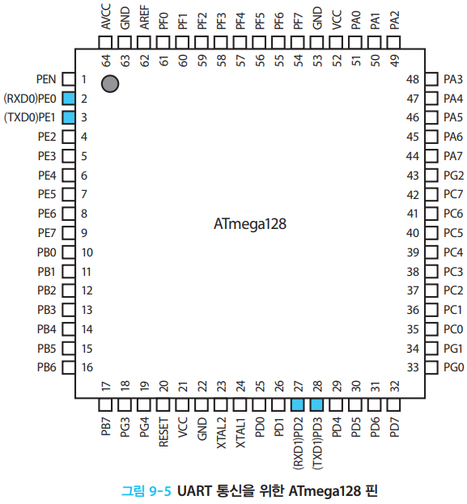

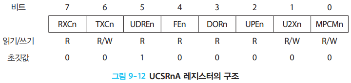

### UCSRnB

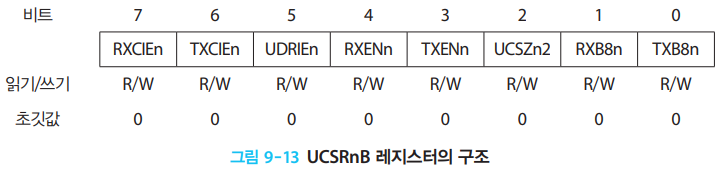

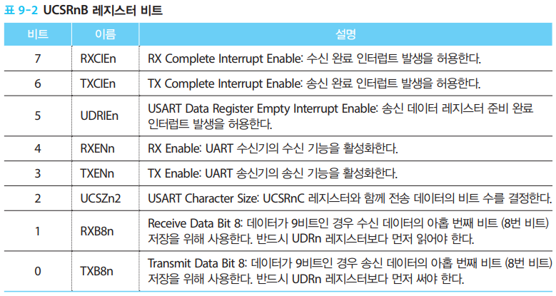

### UCSRnC

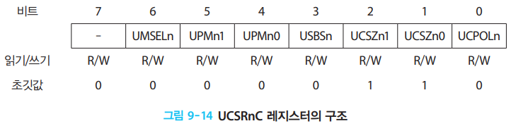

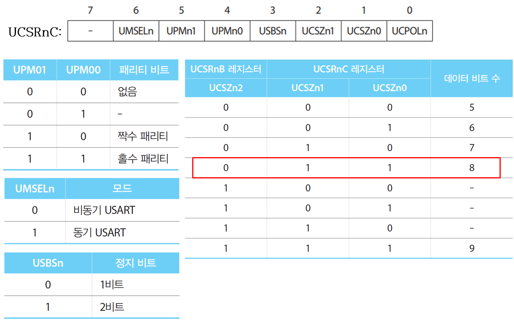

### UBRR

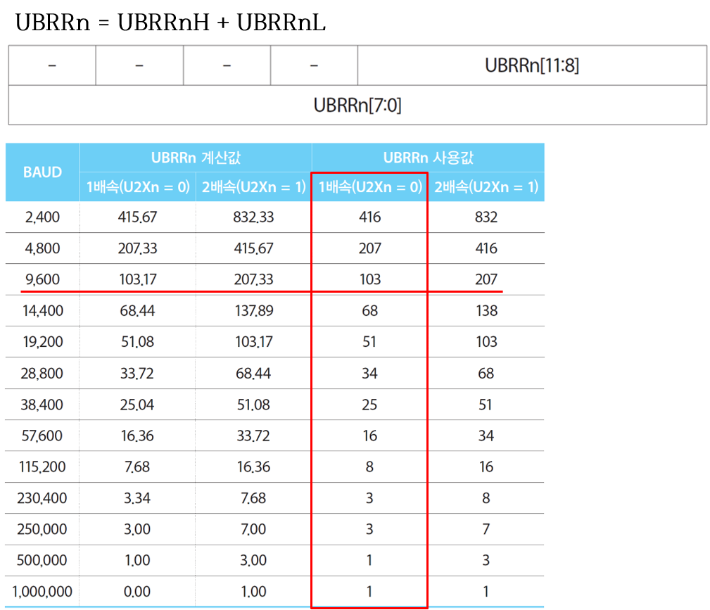

# CH10. ADC

### ADMUX

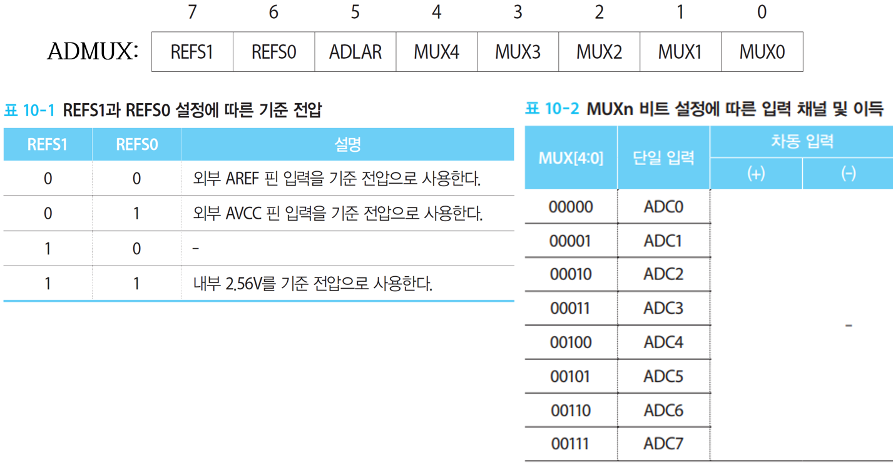

### ADCSRA

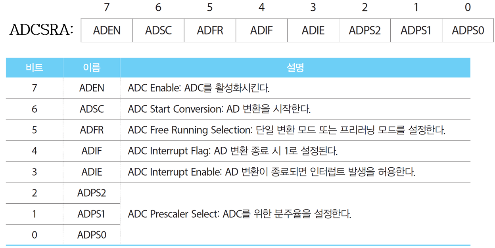

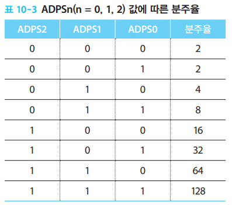

# CH12. External Interrupt

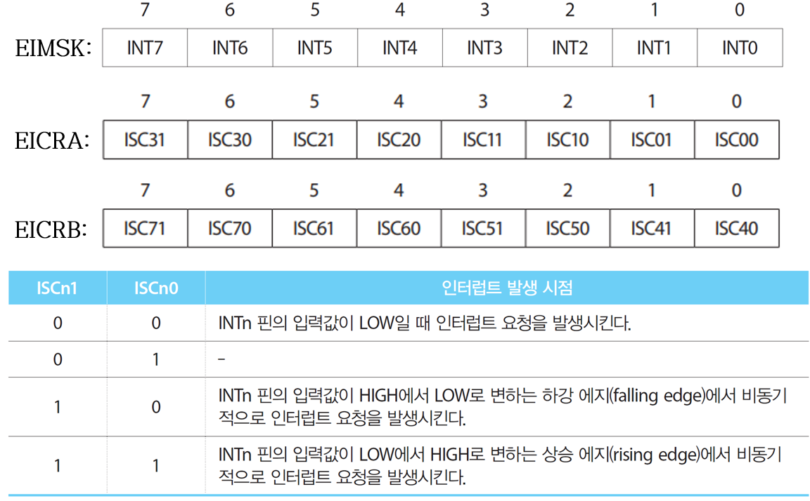

# CH13~15 Timer/Counter

## 8 bit Timer/Counter

### TCCR0

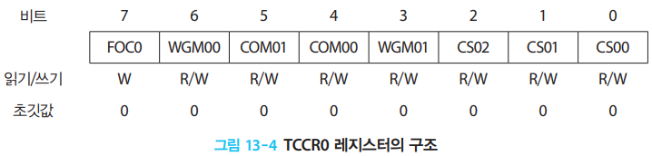

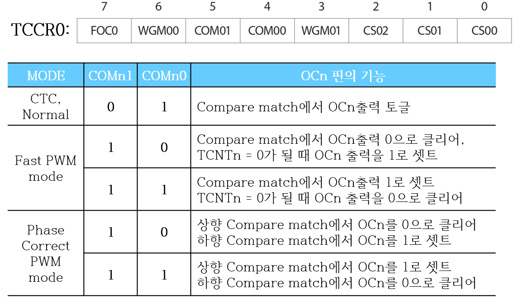

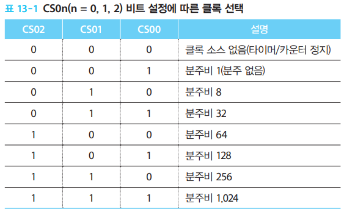

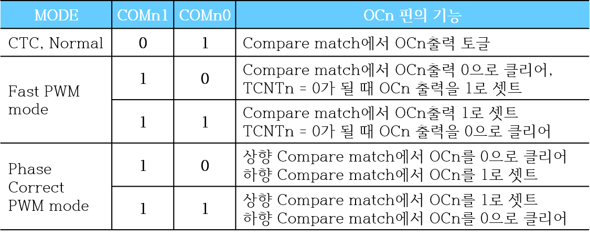

## 16 bit Timer/Counter

### TCCR1X

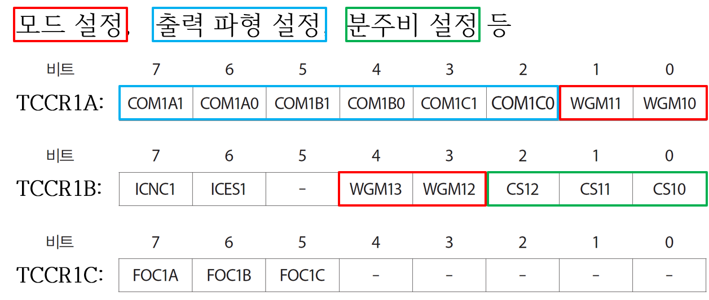

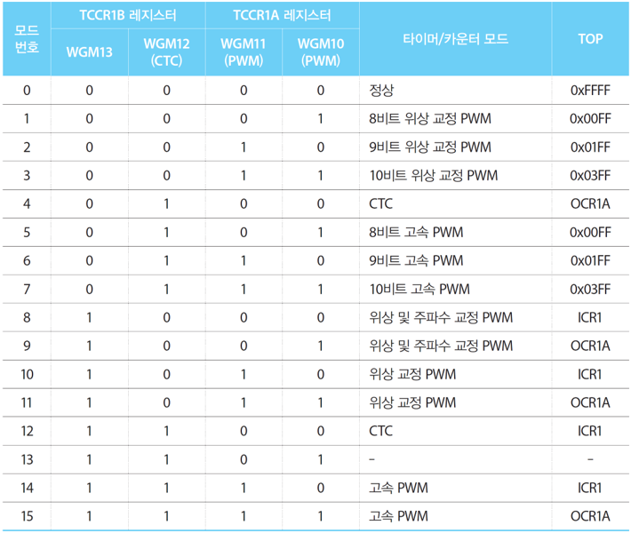

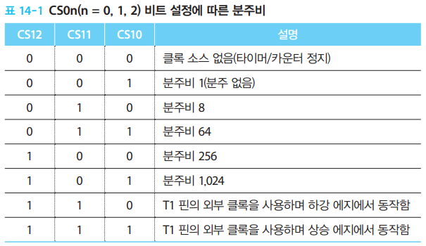

## Timer/Counter Interrupt

### TIMSK/ETIMSK

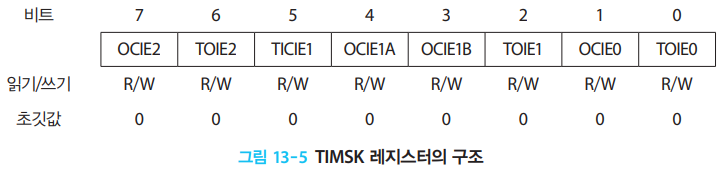

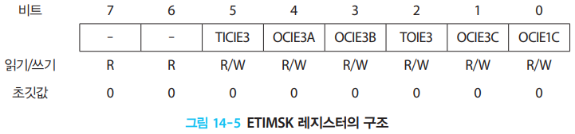

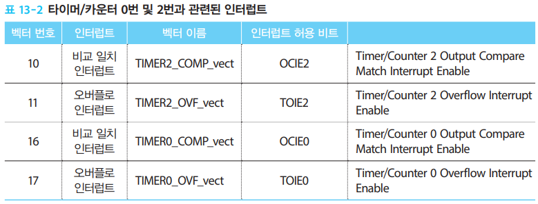

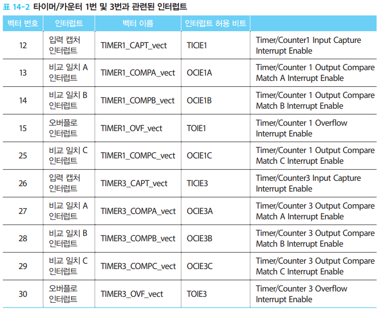

## PWM

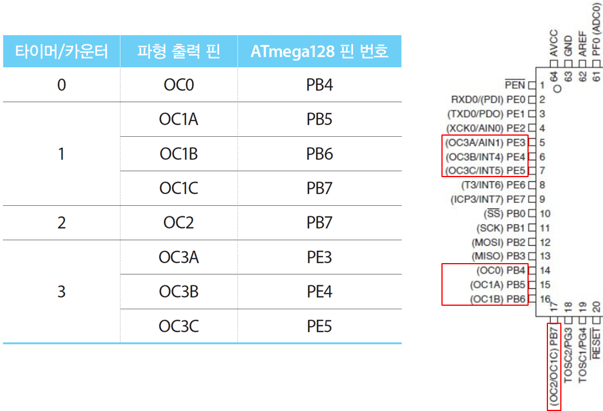

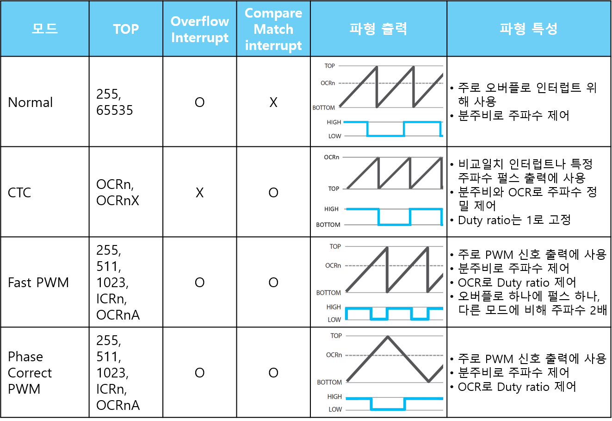

