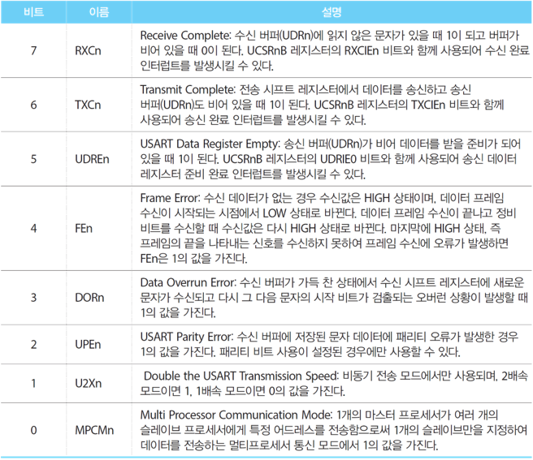
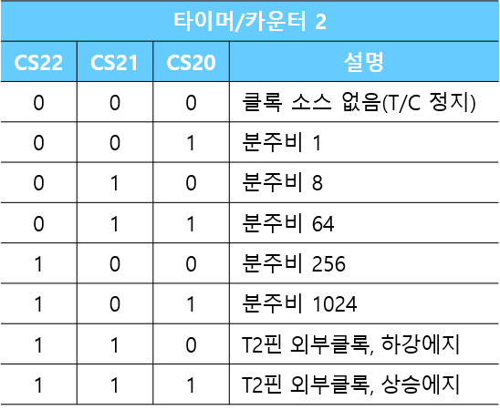

# CH09. UART

### UCSRnA

### UCSRnB

### UCSRnC

### UBRR

# CH10. ADC

### ADMUX

### ADCSRA

# CH12. External Interrupt

# CH13~15 Timer/Counter

## 8 bit Timer/Counter

### TCCR0

## 16 bit Timer/Counter

### TCCR1X

## Timer/Counter Interrupt

### TIMSK/ETIMSK

## PWM

