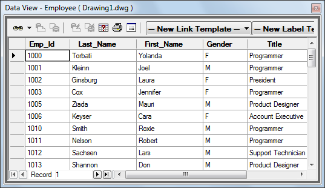

## 모듈과 패키지는 무엇?

지금까지 우리는 하나의 파일에서만 프로그램을 실행해왔지만 실제로 개발을 할 때는 다수의 파이썬 파일을 만들어 유기적으로 연결해야 할 뿐만 아니라 남이 만든 코드도 적극적으로 활용해야 한다. 어떤 파이썬 파일에서 `import` 키워드를 통해 외부 파이썬 파일의 함수, 변수, 클래스를 가져다 쓸 수 있다. 외부 코드는 기능별로 함수나 클래스 등을 묶어서 파일에 저장하는데 코드 규모가 작으면 하나의 파일에 담을 수도 있고 규모가 크면 여러 파일에 구현한 다음 하나의 폴더에 담을 수도 있다. 이때 각각의 `.py` 파일을 **모듈(Module)**이라 하고 여러 모듈을 묶은 폴더를 **패키지(Package)**라고 한다. 파이썬 오픈소스는 패키지 단위로 설치가 되기 때문에 패키지라는 용어를 자주 사용한다. 


## 모듈 만들기

모듈이란 쉽게 말해 파이썬 파일(`.py`)이다. 어떤 파이썬 파일에 함수와 변수를 만들고 그것들을 다른 파이썬 파일에서 가져다 쓸 수 있다. 실습을 위해 `list_ops.py`라는 리스트 연산 모듈을 만들어보자.

```python
# list_ops.py
def add(foo, bar):
    out = []
    for f, b in zip(foo, bar):
        out.append(f + b)
    return out

def subtract(foo, bar):
    out = []
    for f, b in zip(foo, bar):
        out.append(f - b)
    return out

def multiply(foo, bar):
    out = []
    for f, b in zip(foo, bar):
        out.append(f * b)
    return out

def divide(foo, bar):
    out = []
    for f, b in zip(foo, bar):
        out.append(f / b)
    return out

spam = [51, 23]
ham = [34, 67]

if __name__ == '__main__':
    eggs = add(spam, ham)
```

리스트 원소에 대한 사칙연산 함수 외에 `spam, ham, eggs`라는 변수를 만들었다. 함수에서 쓰인 `foo, bar`나 아래서 선언된 변수명들을 프로그래밍에서 [Metasyntactic variable](https://futurecreator.github.io/2018/06/05/metasyntactic-variables-foo-bar/) 이라고 한다. syntactic이라고 하지만 프로그래밍 언어의 문법과는 아무상관이 없고 그냥 예시에서 관습적으로 많이 쓰이는 변수명들을 말한다.

`list_ops.py` 옆에 `use_list_ops.py`라는 새로운 파일을 만들어 저 함수와 변수들을 사용해보자. `import`를 활용해 외부 모듈을 가져오는 방법은 다양하다. 


### 1. 모듈 이름 그대로 가져오기

```python
foo = [1, 2, 3, 4, 5]
bar = [24, 52, 13, 27]

import list_ops

goo = list_ops.add(foo, bar)
print("{} + {} = {}".format(foo, bar, goo))
goo = list_ops.multiply(list_ops.spam, list_ops.ham)
print("{} * {} = {}".format(list_ops.spam, list_ops.ham, goo))
print("list_ops.spam: {}".format(list_ops.spam))
# => list_ops.spam: [51, 23]
```

외부 모듈에서 어떤 객체를 가져올 때는 `모듈명.객체명`으로 가져오면 된다. 위 예제에서 `add`와 `multiply` 함수가 성공적으로 수행된 것을 확인할 수 있다. 마지막 줄을 보면 import 한 모듈에서 변수를 가져올 수도 있다. 얼핏 보면 당연한 것 같지만 C언어를 생각해보면 당연하지는 않다. `list_ops.spam`을 프린트 했을 때 `[51, 23]`이 나온다는 것은 `list_ops.py`라는 스크립트가 **실행**되었다는 것을 뜻하기 때문이다. `list_ops`를 import 만 했지만 내부적으로는 `list_ops.py`가 실행된 것이다. 

`list_ops.py`에 실행 가능한 코드를 넣되 외부에서 import 할 때는 실행되지 않게 하고 싶다면 함수에서 배웠듯이 `__name__` 변수를 써야한다. `list_ops.py`에서는 `eggs`라는 변수가 `if __name__ == '__main__':` 조건문 아래 있기 때문에 외부에서 import 할 때는 선언되지 않는다.

```python
try:
    print("list_ops.eggs: {}".format(list_ops.eggs))
except Exception as e:
    print(e)
    # => module 'list_ops' has no attribute 'eggs'
```


### 2. 모듈 이름을 바꿔서 가져오기

일반적으로 모듈 이름은 모듈의 기능을 이해하기 쉽게 몇 개의 단어를 이어서 길게 짓는것이 보통이다. 게다가 패키지에서 복잡한 폴더 구조 아래 있는 모듈을 가져올 때는 더욱 import 문이 길어진다. 하지만 모듈의 객체를 불러올 때마다 긴 모듈 이름을 모두 쓰는 것은 번거로우므로 짧은 별명을 지어 가져올 수 있다. `import A as B` 라고 하면 `A` 모듈을 `B`라는 이름으로 가져오겠다는 뜻이다. 아래 코드에서도 `list_ops` 대신 `lo`를 써서 모듈 객체를 불러왔다.

```python
import list_ops as lo

goo = lo.subtract(foo, bar)
print("{} + {} = {}".format(foo, bar, goo))
goo = lo.divide(bar, foo)
print("{} * {} = {}".format(bar, foo, goo))
```


### 3. 모듈에서 지정한 객체만 가져오기

아예 외부 모듈명을 쓰지 않고 바로 함수나 변수를 사용하고 싶을 때는 `from module import object`를 쓰면 된다. `from`을 써서 가져온 객체는 모듈명을 생략하고 사용가능하다.

```python
from list_ops import add, subtract, spam

goo = add(foo, bar)
print("{} + {} = {}".format(foo, bar, goo))
goo = subtract(bar, foo)
print("{} - {} = {}".format(bar, foo, goo))
print("spam = {}".format(spam))
```


## 3. 패키지 만들기

패키지는 여러 모듈이 폴더 단위로 모인 것으로 폴더 안에 폴더를 넣으면 계층적인 패키지를 만들 수도 있다. 여러 모듈을 모은 패키지를 만들기 위해 `package`란 폴더를 만들자. 위에서 만든 `list_op.py`를 그 아래로 옮기고 폴더 내부에서 `dict_ops.py`도 다음과 같이 만들어보자. 함수를 만들 때 원래는 함수 이름을 `list_add`나 `dict_add`처럼 함수 이름에 기능이 모두 표현되는 것이 좋으나 앞에 붙은 접미사는 모듈명으로 대체 가능하기 때문에 함수 이름을 간단하게 지어도 된다.

```python
# dict_ops.py
def add(foo, bar):
    out = {}
    for key in foo.keys():
        if key in bar:
            out[key] = foo[key] + bar[key]
    return out

def subtract(foo, bar):
    out = {}
    for key in foo.keys():
        if key in bar:
            out[key] = foo[key] - bar[key]
    return out

def multiply(foo, bar):
    out = {}
    for key in foo.keys():
        if key in bar:
            out[key] = foo[key] * bar[key]
    return out

def divide(foo, bar):
    out = {}
    for key in foo.keys():
        if key in bar:
            out[key] = foo[key] / bar[key]
    return out
```


이제 프로젝트 폴더 바로 아래 새로운 파이썬 파일을 만들고 (`package` 폴더 옆에) 예제를 실행해보자. 여러 사람의 키와 몸무게를 입력하여 BMI를 계산하는 코드다. 첫 줄을 보면 `package` 라는 패키지 안의 `list_ops`라는 모듈을 `lo`라는 약칭으로 불러왔다. C언어에서 `#include`를 항상 코드 맨 위에서 쓰듯이 파이썬에서도 `import`는 그 모듈이 언제 쓰이던지 항상 맨 윗줄에 사용하는 것을 권장한다.

```python
import package.list_ops as lo
import package.dict_ops as do

weights = [65, 90, 42, 76]
heights = [1.65, 1.78, 1.59, 1.80]
heights_sq = lo.multiply(heights, heights)
bmi = lo.divide(weights, heights_sq)
print("BMI:", bmi)
# => BMI: [23.875114784205696, 28.40550435551067, 16.61326688026581, 23.456790123456788]
```


그런데 알고보니 키와 몸무게를 사람 순서대로 넣은 것이 아니라 임의로 섞여서 들어간 것이었다. 이를 정확히 처리하기 위해 리스트를 딕셔너리로 바꿔서 연산을 해보자. `w_names`는 `weights`에 해당하는 이름이고 `h_names`는 `heights`에 해당하는 이름이다. 이름의 순서와 구성이 다르다는 것을 알 수 있다. 같은 사람의 키와 몸무게를 이용해 BMI를 계산하기 위해 `dict_ops`를 사용하였다.

```python
w_names = ["RM", "Suga", "Jin", "V"]
h_names = ["Jimin", "RM", "Suga", "Jin"]
weights = dict(zip(w_names, weights))
heights = dict(zip(h_names, heights))
print("dict weights:", weights)
print("dict heightss:", heights)
heights_sq = do.multiply(heights, heights)
bmi = do.divide(weights, heights_sq)
print("BMI:", bmi)
# => BMI: {'RM': 20.515086478979924, 'Suga': 35.59985760056959, 'Jin': 12.962962962962962}
```

`dict_ops`는 입력인자 `foo, bar`에 공통적으로 있는 key에 대해서만 연산을 하여 결과를 출력한다. 예시의 결과를 보면 키와 몸무게에서 이름이 겹치는 RM, Suga, Jin 세 명의 BMI만 나온 것을 확인할 수 있다.  


## HW1. DBMS 만들기

DBMS (Database Management System)은 말 그대로 데이터베이스를 관리하는 시스템이다. 여기서는 아주 간단한 DBMS를 구현해보고자 한다. 전통적인 DBMS에서는 데이터를 표(table) 형식으로 관리한다.



DBMS는 위 그림과 같은 표를 여러개를 관리하는데 여러 표가 독립적이기 보다는 서로 ''관계"를 가지고 표와 표를 연결해서 사용할 수 있다. 여기서는 표들 사이의 관계를 다루지는 않고 하나의 표에 데이터를 추가하고 제거하고 검색하고 합치는 기능만 구현해보고자 한다.  

여러분들은 아래의 "main.py" 가 잘 작동하도록 "dbms.py" 의 함수들을 구현하면 된다. 함수의 사용법이나 예시들은 코드에 주석으로 설명했다.

### main.py

```python
import dbms


def main():
    columns = ['name', 'age', 'gender', 'country']
    data = dbms.init_columns(columns)
    data = dbms.append(data, name='tom', age=3, gender='male', country='usa')
    data = dbms.append(data, name='lee', age=4, gender='female', country='china')
    data = dbms.append(data, name='kim', age=5, gender='male', country='korea')
    try:
        data = dbms.append(data, name='jane', age=6, gender='female')
    except AssertionError as ae:
        print(ae)

    # data = {'name': ['tom', 'lee', 'kim'], 'age': [3, 4, 5], 'gender': ..., 'country': ...}
    dbms.print_data(data)

    # query_result = {'name': ['kim', 'tom'], 'age': [5, 3], 'gender': ..., 'country': ...}
    query_result = dbms.query_by_name(data, ['kim', 'tom'])
    dbms.print_data(query_result)

    # query_result = {'name': ['tom', 'lee'], 'age': [3, 4], 'gender': ..., 'country': ...}
    query_result = dbms.query_by_age(data, 2, 5)
    dbms.print_data(query_result)

    # merged_data = ['tom', 'lee', 'kim', 'jame'], 'age': [3, 4, 5, 6], 'gender': ..., 'country': ...}
    newdata = {'name': ['jane'], 'age': [6], 'gender': 'female', 'country': 'uk'}
    merged_data = dbms.merge(data, newdata)
    dbms.print_data(merged_data)


if __name__ == "__main__":
    main()

```


### dbms.py

```python
def init_columns(col_names):
    """
    col_names: list of column titles (string) e.g.=['name', 'age']
    return: empty database e.g.={'name': [], 'age': []}
    """
    pass


def append(data, **kwargs):
    """
    data: database object (dict of lists) e.g.={'name': ['tom', 'lee'], 'age': [3, 4]}
    kwargs: new data to be appended (dict) e.g.={'name': 'kim', 'age': 5}
    return: appended database e.g.={'name': ['tom', 'lee', 'kim'], 'age': [3, 4, 5]}
    [Note] if one of keys of 'kwargs' is NOT in 'data', print WARNING message
    e.g. kwargs={'name': 'kim', 'gender': 'male'}
        -> print("'gender' is NOT in this database")
    [Note] if 'kwargs' does NOT have all keys in 'data', raise error using assert
    e.g. kwargs={'name': 'kim'}
        assert 'age' in kwargs, "'age' is NOT in kwargs"
    """
    pass


def remove_by_name(data, names):
    """
    data: database object (dict of lists) e.g.={'name': ['tom', 'lee', 'kim'], 'age': [3, 4, 5]}
    names: list of names e.g.=['kim', 'tom']
    return: reduced database e.g.={'name': ['lee'], 'age': [4]}
    """
    pass


def query_by_name(data, names):
    """
    data: database object (dict of lists) e.g.={'name': ['tom', 'lee', 'kim'], 'age': [3, 4, 5]}
    names: list of names e.g.=['kim', 'tom']
    return: extracted database e.g.={'name': ['kim', 'tom'], 'age': [5, 3]}
    """
    pass


def query_by_age(data, age_min, age_max):
    """
    extract database of which age_min <= age < age_max
    data: database object (dict of lists) e.g.={'name': ['tom', 'lee', 'kim'], 'age': [3, 4, 5]}
    age_min: minimum age e.g.=2
    age_max: maximum age e.g.=5
    return: extracted database e.g.={'name': ['tom', 'lee'], 'age': [3, 4]}
    """
    pass


def merge(data, newdata):
    """
    data: database object (dict of lists) e.g.={'name': ['tom', 'kim'], 'age': [3, 5]}
    newdata: database object (dict of lists) e.g.={'name': ['lee'], 'age': [4]}
    return: merged database e.g.={'name': ['tom', 'kim', 'lee'], 'age': [3, 5, 4]}
    [Note] if 'newdata' has the same names with 'data', ignore the duplicated data
    e.g. data={'name': ['tom', 'kim'], 'age': [3, 5]}
        newdata={'name': ['lee', 'kim'], 'age': [4, 6]}
        -> {'name': ['tom', 'kim', 'lee'], 'age': [3, 5, 4]}
    """
    pass


def print_data(data):
    """
    data: database object (dict of lists) e.g.={'name': ['tom', 'kim'], 'age': [3, 5]}
    print database vertically
    e.g.
    name    age
    ----    ---
    tom     3
    kim     5
    """
    pass

```


### 제출

- 제출기한: 10.07 (수)
- 제출방식: LMS 수업페이지에 "HW1"이라는 게시판에 제출
- 제출내용: 아래 파일들을 묶어 압축한  "HW1\_이름\_학번.zip" 제출
    1. "main.py"
    2. "dbms.py"
    3. "result.txt": 실행 결과 드래그하여 텍스트 파일로 저장


### 평가

- 총점 20점
- 주석과 예시로 표시된 기능 중 잘 못 작동하는 기능 하나 당 -1점
- 제출방식을 지키지 않을 경우 -1점
- 평가시에는 "main.py"는 다르게 만들어 테스트 할 것이므로 주어진 케이스 외에 다양한 케이스를 스스로 만들어 테스트 해봐야 함

