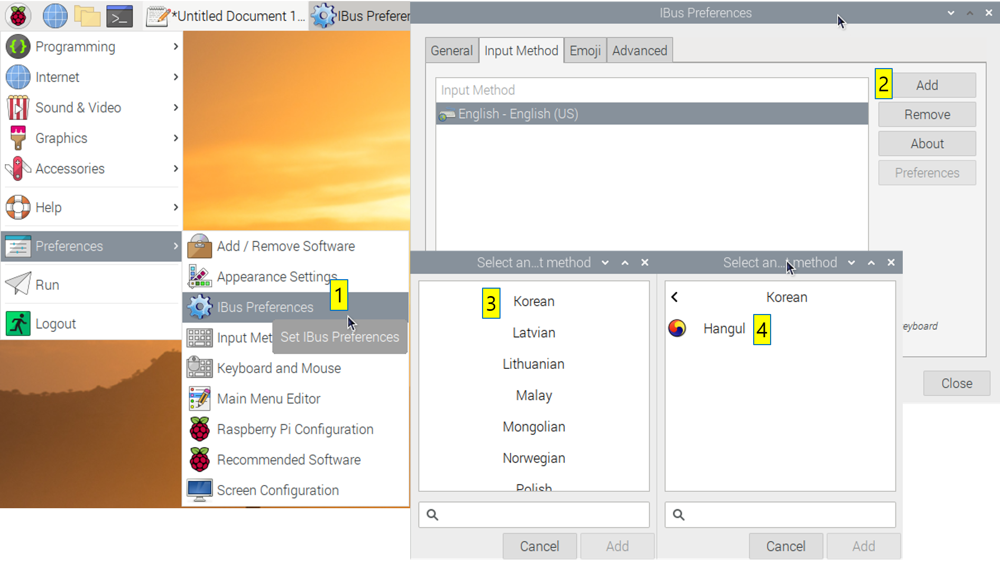
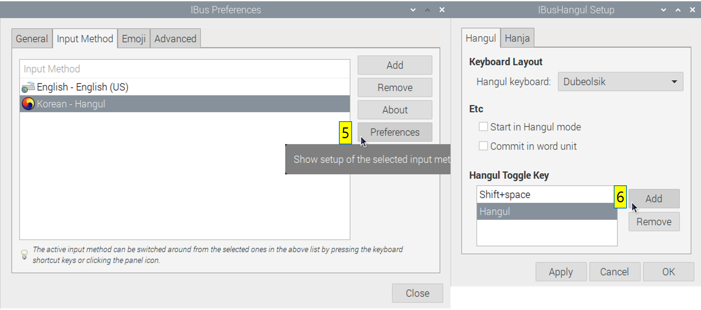

# 1. Raspberry Pi


라즈베리 파이는 2009년 만들어진 Raspberry Pi Foundation 이라는 영국의 자선단체에서 시작됐다. 원래는 저렴한 가격에 디지털 교육을 할 수 있는 기기를 만드는 것이 목적이었다. 그런데 기기를 만들고 보니 (엄청!) 저렴한 가격에 PC처럼 쓸수 있어서 로봇이나 소규모 Maker 프로젝트에서 널리 사용되게 되었다. 리눅스 운영체제가 설치되기 때문에 AVR이나 아두이노로 하기 어려운 복잡한 프로그램을 구현할 수 있어서 로봇 제어기, 소규모 서버, IoT 등 다양한 곳에 사용되고 있다.  


2012년 Raspberry Pi Model B가 처음 나왔는데 가격은 겨우 35달러에 불과했고 이로인해 개발보드의 대중화가 이뤄졌다. 이 가격은 모델을 지속적으로 업그레이드 하면서 현재까지도 유지하고 있다. 2019년까지 3천만대 이상의 보드가 팔렸다고 한다. 가장 최신 모델은 2019년 나온 Raspberry Pi Model 4인데 1.5GHz Quad Core CPU와 최대 8GB RAM을 장착할 수 있어 이제는 일상적인 사용이나 소규모 개발 프로젝트를 진행하는데 큰 불편함 없이 쓸 수 있다. 4개의 USB, 2개의 HDMI 포트와 GPIO, Ethernet, Wi-Fi, Bluetooth 등을 지원하여 일반적인 PC처럼 사용할 수 있다.


# 2. Raspberry Pi OS


Raspberry Pi OS는 Raspberry Pi(이하 줄여서 Pi)를 위한 전용 운영체제다. 데비안(Debian) 리눅스를 기반으로 만들어져서 가장 인기있는 리눅스 배포판인 우분투(Ubuntu)와 사용법이 거의 유사하다. 리눅스에 대한 자세한 설명은 다음에 하기로하고 일단 Raspberry Pi OS를 설치해보자.  

먼저 키트에서 주어진 SD 카드를 USB 리더기에 끼우고 (키트에는 이미 끼워져있다.) PC에 리더기를 연결한다. 

아래 링크에서 "Raspberry Pi Imager for Windows"를 클릭해 설치프로그램을 다운로드하고 실행해보자.  

<https://www.raspberrypi.org/downloads/>


 


설치할 OS와 SD CARD를 선택하고 "WRITE"를 누르면 SD 카드에 Raspberry Pi OS가 설치된다. OS는 맨위에 있는 Raspberry Pi OS (32-bit)를 선택한다. Raspberry Pi 4는 원래 64-bit processor를 가지고 있지만 OS는 기존 기기들과의 호환을 고려해서인지 32-bit를 제공하고 있다. 64-bit Ubuntu를 설치할 수도 있지만 설치방법이 복잡하거나 소프트웨어 호환 문제가 있어서 이 수업에서는 가장 간단히 설치할 수 있는 32-bit Raspberry Pi OS를 사용한다.  

설치 완료 후 리더기에서 SD 카드를 뽑아서 Pi 뒷면의 SD카드 슬롯에 삽입하면 SD카드가 Pi의 하드드라이브로 작동한다. Pi에 SD카드, micro HDMI (모니터 연결), USB에 키보드 마우스를 연결하고, USB C-type 전원에 전원을 연결하면 Pi가 부팅된다.  

"Welcome to Raspberry Pi" 화면이 나오길 기다렸다가 "Set Country"에서 다음과 같이 설정한다.

- Country: South Korea
- Language: Korean
- Timezone: Seoul
- Check **"Use English language"**


이후 와이파이와 비밀번호를 설정하고 설치를 완료한다.


# 3. Basic Settings

이제 Pi를 사용하기 위한 기본적인 세팅을 해보자. 리눅스에서의 모든 세팅은 기본적으로 CLI(Command Line Interface)에서 이루어진다. 리눅스 커맨드는 다음에 배우기로하고 일단 Ctrl + Alt + T를 눌러 터미널을 실행하고 아래 코드 블럭에 보이는 명령어들을 입력해서 실행해보자.  

시스템 사용에 필요한 앱들을 설치하기 전에 시스템의 소프트웨어 상태를 최신으로 업그레이드한다.

```
sudo apt update
sudo apt upgrade -y
```


## 3.1 개발환경 설치

앞으로 Pi에서 프로그래밍을 하기 위해 필요한 툴들을 설치한다.

```
sudo apt install build-essential git cmake python-dev python-pip python3-dev python3-pip
sudo apt install gedit openjdk-11-jdk
```

이 수업에서는 파이썬을 주로 사용하는데 파이썬을 개발하는 개발환경으로 Pycharm을 설치한다. 아래 링크에서 "Community" 버전을 눌러 압축파일을 다운로드한다. 다운로드 한 파일은 "/home/pi/Downloads" 경로에 저장될 것이다. 

<https://www.jetbrains.com/pycharm/download/#section=linux>

Pycharm은 설치 없이 압축을 풀면 바로 실행가능하다. 아래 명령어를 실행해 압축을 풀고 실행해보자.

```
# Ctrl+Alt+T 로 터미널 열기
# 압축을 풀어 /opt 경로에 놓기
sudo tar -xf /home/pi/Downloads/pycharm-community-2020.2.1.tar.gz -C /opt
# 사용사 설정 파일 열기
mousepad ~/.bashrc
# 파이참 실행 명령어 등록 위해 맨 아래 줄에 한 줄 추가
alias pycharm="/opt/pycharm-community-2020.2.1/bin/pycharm.sh"
# Ctrl+S 눌러 저장후 오른쪽 위 'x' 눌러 닫기

# 터미널에서 파이참 실행
pycharm
```

처음 실행하면 "Cutomize PyCharm"이라는 창에서 여러 설정을 할수 있는데 일단은 모두 Next를 눌러 넘어간다.  

 

그리고 다시 "Welcome to PyCharm"이라는 창에서 "New Project"를 선택하고 새 프로젝트 경로를 다음과 같이 지정한다.  

`/home/pi/PycharmProjects/robotics0`

나머지는 기본 설정으로 놓고 "Create" 버튼을 누르면 파이썬 환경을 만드는 작업을 한 뒤 새 프로젝트가 열린다. 기본적인 main.py가 열려있는데 `Ctrl+F10`으로 실행해보면 아래 "Hi, Pycharm"이 화면 아래쪽에 뜨는것을 볼 수 있다.  

  


## 3.2 한글 설치

리눅스의 모든 명령어와 모든 코드는 알파벳으로 입력하기 때문에 한글이 꼭 필요한건 아니지만 한글이 없으면 인터넷을 활용하는데 불편함이 많다. 일단 한글이 다 깨져서 읽을수가 없고 한글로 검색도 할수 없기 때문이다. 먼저 ibus 입력기와 한글 폰트를 설치한다.

```
sudo apt install ibus ibus-hangul
sudo apt install fonts-unfonts-core
```

여기까지 한 후 재부팅해주는 것이 좋다. 아래 그림에서처럼 왼쪽 위의 라즈베리 모양의 메뉴를 클릭하고 맨 아래 "Logout"을 선택하면 "Reboot" 메뉴를 볼 수 있다. 재부팅 후 아래 과정을 따라한다.

ttf-unfonts-core를 설치하면 한글을 볼 수는 있다. 다음과 같이 ibus 입력기를 설정해주면 한글을 입력할 수 있다.

1. Menu - Preferences - iBus Preferences 실행
2. Input Method - Add 클릭
3. Korean - Hangul을 선택하여 추가
4. 추가된 Korean - Hangul을 선택하고 Preference 클릭
5. 아래 Hangul Toggle Key 에서 자신이 원하는 한/영 전환키를 설정하고 Ok 클릭





이후 Menu - Accesories - Text Editor 를 실행하여 한글키를 누르면 한글을 입력할 수 있을것이다.


## 3.3 코딩 폰트 설치 (Optional)

무릇 코딩 좀 하는 사람은 폰트에도 신경 쓰기 마련이다. 일반적인 폰트에서는 o(알파벳)과 0(숫자), l(알파벳)과 1(숫자)이 헷갈리므로 이런 것들이 명확하게 구분되고 글자의 크기도 일정하게 맞춰서 코드가 가지런하게 보이도록 만든 코딩 전용 폰트들이 있다.  

... 문제는 대부분 이런 폰트들이 영어 전용 폰트라는 것인데 한글을 쓰면 다른 한글 폰트로 써진다. 같이 쓰면 영어와 한글이 줄간격이 달라서 한글이 들어간 줄은 위아래로 더 넓게 차지해서 한글 주석을 쓰고 나면 코드 줄이 들쭉날쭉해진다.  

다행스럽게도 *위대하신 네이버님*이 한글이 포함된 코딩 폰트를 만들어주셨다. 이름하여 **D2Coding** 폰트다. 아래 링크에서 다운로드 받을 수 있다. 

<https://github.com/naver/d2codingfont/releases>

`~/Downloads` 폴더에서 압축을 풀고 `D2Coding-Ver xxx/D2CodingAll` 폴더로 들어가 `*.ttf` 파일을 더블클릭하면 폰트 샘플이 보이고 "Install"을 누르면 설치된다. 설치된 폰트는 재부팅이나 재로그인을 하면 쓸 수 있다.


## 3.4 원격 데스크톱 설정(Remote Desktop)


Pi에서 작업할 때마다 모니터 키보드 마우스를 모두 연결하기는 번거롭다. Pi에서 작업을 하다가도 윈도우에서 해야할 일이 생기면 Pi를 끄고 윈도우 PC를 켜야하는건 더욱 번거롭다. 그래서 윈도우에서 원격 데스크톱으로 Pi에 접속하면 키보드 마우스를 갈아끼우지 않아도 되고 윈도우도 동시에 쓸수 있으니 편리하다. 단 Pi를 부팅할 때 모니터는 연결되어있어야 한다.

Raspberry Pi OS는 원격 데스크톱 설정이 매우 쉽다. 먼저 Pi에서 Menu - Preference - Raspberry Pi Configuration 으로 들어간다. "Interfaces" 탭에서 "VNC" 항목의 "Enable"을 선택한다.  


터미널을 열어서 `ifconfig` 명령을 실행하여 IP 주소를 확인한다. 아래 그림에서는 `192.168.35.60`이 IP 주소다. 이와 비슷한 형식을 가진 주소를 찾아서 기록해둔다.


다음으로, 원격 접속을 할 윈도우 PC에서 VNC Viewer를 설치한다. 아래 주소에서 설치파일을 받아서 설치한다.  

<https://www.realvnc.com/en/connect/download/viewer/>

VNC Viewer를 실행하여 아래 그림처럼 Pi의 IP 주소를 입력하고 엔터를 친다. 로그인을 해야하는데 Username은 "pi"로 지정이 되어있고 Password는 여러분이 처음 Pi를 켤때 설정한 비밀번호를 입력하면 된다.


이제 윈도우에서 원격으로 GUI를 사용하여 편리하게 Pi를 제어할 수 있다!

