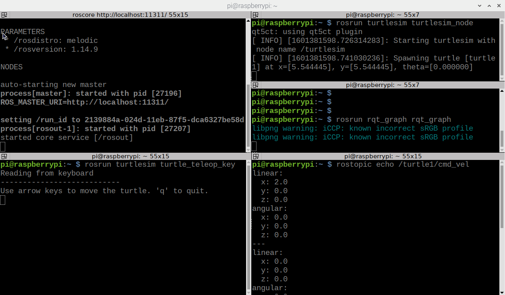
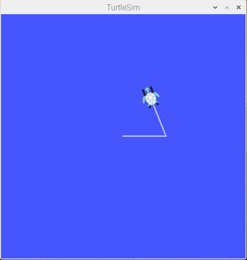
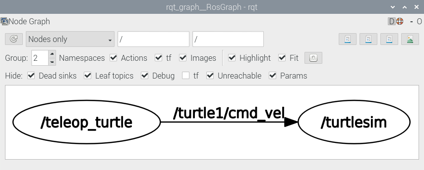

## ROS 설치

여기서는 Raspberry Pi에 Raspberry Pi OS가 설치된 상태에서 ROS를 설치하는 방법을 설명한다. 주요한 내용은 아래 링크를 참고하였다.

<http://wiki.ros.org/ROSberryPi/Installing%20ROS%20Melodic%20on%20the%20Raspberry%20Pi>


### 1. ROS 패키지 저장소 추가

ROS 패키지들은 `apt`를 통해서 설치할 수 있는데 그러려면 ROS 저장소를 추가해야 한다. 그리고 ROS 패키지를 신뢰할만한 패키지로 검증하는데 필요한 키를 등록한다.

```
$ sudo sh -c 'echo "deb http://packages.ros.org/ros/ubuntu $(lsb_release -sc) main" > /etc/apt/sources.list.d/ros-latest.list'
$ sudo apt-key adv --keyserver hkp://ha.pool.sks-keyservers.net:80 --recv-key C1CF6E31E6BADE8868B172B4F42ED6FBAB17C654
```

패키지 상태를 업데이트한다.

```
$ sudo apt-get update
$ sudo apt-get upgrade
```

"Open Robotics"가 키 리스트에 추가됐음을 확인한다.

```
$ sudo apt-key list | grep "Open Robotics"
Warning: apt-key output should not be parsed (stdout is not a terminal)
uid           [ unknown] Open Robotics <info@osrfoundation.org>
```


### 2. 기반 패키지 설치

Ubuntu 같은 배포판에서는 ROS를 단순히 apt 명령어를 이용해서 설치할 수 있지만 Pi에서는 ROS를 소스부터 받아서 빌드해야 한다. 하지만 소스를 하나씩 직접 받아야 하는 것은 아니고 이 과정을 자동으로 진행해주는 `rosinstall-generator`와 `rosdep`이 있다. 이들은 ROS 패키지를 설치하기 위해 설치해야 하는 패키지며 apt로 쉽게 설치할 수 있다.

```
$ sudo apt install -y python-rosdep python-rosinstall python-rosinstall-generator
$ sudo apt install -y python-wstool python-catkin-tools build-essential cmake 
$ sudo rosdep init
$ rosdep update
```


### 3. ROS 소스 다운로드

ROS를 빌드하기 위해서는 ROS Workspace를 만들어야한다. ros_melodic이라는 작업공간 디렉토리를 만들고 여기에 ROS 소스를 받아보자. ROS는 GUI Tool들을 제외한 ROS-Comm 버전과 `rqt, rviz` 등의 다양한 툴들을 담은 ROS-Deskop 버전이 있다. 여기서는 ROS-Desktop 버전을 설치한다.

```
$ cd ~
~ $ mkdir ros_melodic
~ $ cd ros_melodic
~/ros_melodic $ rosinstall_generator desktop rosserial --rosdistro melodic --deps --wet-only --tar > melodic-desktop-wet.rosinstall
~/ros_melodic $ wstool init src melodic-desktop-wet.rosinstall -j4
```

위 명령어를 실행 후 `~/ros_melodic/src` 디렉토리를 보면 다양한 ROS 패키지들을 볼 수 있다. 하지만 이것들은 아직 '설치'된 것이 아니라 그냥 소스 코드를 다운받은 것이다. 이 패키지들을 빌드해서 설치해야 ROS를 쓸 수 있다.  

하지만 그전에 ROS 패키지들이 의존하는 (apt로 설치가능한) 패키지들을 먼저 설치를 해야한다. 수십개의 패키지의 의존성을 일일이 파악하여 하나씩 설치하는건 무척 고된일이지만 다행히도 ROS에는 이를 한번에 해결해주는 명령어가 있다. `rosdep`으로 `src` 디렉토리 아래 있는 모든 패키지의 의존성을 검사하여 한번에 모두 설치한다.

```
~/ros_melodic $ rosdep install -y --from-paths src --ignore-src --rosdistro melodic -r --os=debian:buster
```


### 4. ROS 빌드 및 설치

이제 `src` 디렉토리의 패키지들을 빌드해보자. 여기서는 `catkin_make_isolated`라는 빌드 시스템을 이용한다. 빌드 후 결과물은 `/opt/ros/melodic` 경로에 설치한다. Ubuntu에서 apt에 의해 ROS가 설치되는 경로이다.

```
~/ros_melodic $ sudo ./src/catkin/bin/catkin_make_isolated --install -DCMAKE_BUILD_TYPE=Release --install-space /opt/ros/melodic -j3
```

설치가 됐다면 이제 시스템에서 ROS를 활성화한다. ROS 활성화 명령어를 `~/.bashrc`에도 등록하여 항상 ROS를 쓸 수 있도록 세팅한다. 당장 ROS를 사용할게 아니라면 아래 명령어를 건너뛰고 6까지 쭉 진행하면 된다.

```
source /opt/ros/melodic/setup.bash
echo "source /opt/ros/melodic/setup.bash" >> ~/.bashrc
```


### 5. Catkin Workspace 초기화

우리가 직접 ROS 패키지를 만들고 작업할 워크스페이스 디렉토리를 만들고 워크스페이스를 초기화한다. 초기화에 사용되는 `catkin` 유틸에 대한 설명은 다음 시간에 한다.

```
$ source /opt/ros/melodic/setup.bash
$ mkdir -p ~/catkin_ws/src
$ cd ~/catkin_ws
~/catkin_ws$ catkin init
~/catkin_ws$ catkin build
~/catkin_ws$ ls -l
```


### 6. 초기화 스크립트 추가

`~/.bashrc` 파일은 bash 터미널을 열때 자동으로 실행되는 스크립트다. 여기에 ROS를 위한 기본 세팅을 추가하면 터미널에서 직접 명령을 실행하지 않아도 된다. 특히 `source /opt/ros/melodic/setup.bash`를 해야만 터미널에서 ros 명령어를 쓰고 ros 패키지 빌드도 할 수 있다.  

```
$ gedit ~/.bashrc
# .bashrc 아래에 다음 텍스트 추가 후 저장하고(ctrl+s) 닫기
alias cw='cd ~/catkin_ws'
alias cm='cd ~/catkin_ws && catkin build'
source /opt/ros/melodic/setup.bash
source ~/catkin_ws/devel/setup.bash
export ROS_MASTER_URI=http://localhost:11311
export ROS_HOSTNAME=localhost
export TURTLEBOT3_MODEL=burger

$ source ~/.bashrc
```


### 7. 터틀봇 패키지 설치

터틀봇 자율주행을 하기 위해서는 로봇에 속도 명령을 내리고 현재 이동량을 읽고 LiDAR 센서 값을 받아올 수 있어야 한다. 이러한 기능을 하기 위해 아래 패키지들을 설치한다.

```
$ cd ~/catkin_ws/src
$ git clone https://github.com/ROBOTIS-GIT/hls_lfcd_lds_driver.git
$ git clone https://github.com/ROBOTIS-GIT/turtlebot3_msgs.git
$ git clone https://github.com/ROBOTIS-GIT/turtlebot3.git
$ git clone -b noetic-devel https://github.com/ros/joint_state_publisher.git
$ cd ~/catkin_ws/src/turtlebot3
$ sudo rm -r turtlebot3_navigation/ turtlebot3_slam/ 
$ cd ~/catkin_ws
$ catkin build
```

OpenCR이 루트 권한을 얻지 않아도 rosrun를 이용할 수 있도록 설정한다.

```
$ source ~/.bashrc
$ rosrun turtlebot3_bringup create_udev_rules
```


### 8. ROS 동작 테스트

ROS를 실행해보기 전에 ROS를 실행할 새로운 터미널을 설치해보자. Terminator라는 터미널 프로그램인데 창을 여러칸으로 나눌수 있어서 ROS의 여러 노드를 실행할 때 사용하면 편리하다. 아래 명령어로 설치할 수 있다.

```
$ sudo apt install terminator
```

Menu - System Tools - Terminator 에서 실행할 수 있고 창을 좌우로 나누는 단축키는 `Ctrl+Shift+E`이고 상하로 나누는 단축키는 `Ctrl+Shift+O`이다.  

아래 명령어를 각각 Terminator의 다른 칸에서 실행하여 거북이를 조종해본다.  

```
$ roscore
$ rosrun turtlesim turtlesim_node
$ rosrun turtlesim turtle_teleop_key
$ rosrun rqt_graph rqt_graph
$ rostopic echo /turtle1/cmd_vel
```

모두 다른 칸에서 순서대로 실행 후 `turtle_teleop_key`를 실행한 칸에서 방향키를 누르면 그에 따라 거북이가 움직일 것이다. 다음은 터미널 창과 TurtleSim 실행화면, rqt_graph 실행화면을 캡쳐한 것이다.








### 9. 펌웨어 업데이트

혹시 펌웨어 버전이 오래되어 업데이트를 해야한다면 SBC에서 아래 명령어를 통해 업데이트를 해준다.

출처: https://discourse.ros.org/t/announcing-turtlebot3-software-v1-0-0-and-firmware-v1-2-0-update/4888

```bash
#opencr 업데이트
$ export OPENCR_PORT=/dev/ttyACM0
$ export OPENCR_MODEL=burger
$ rm -rf ./opencr_update.tar.bz2

#한 줄의 명령어
$ wget https://github.com/ROBOTIS-GIT/OpenCR/raw/master/arduino/opencr_release/shell_update/opencr_update.tar.bz2 && tar -xvf opencr_update.tar.bz2 && cd ./opencr_update && ./update.sh $OPENCR_PORT $OPENCR_MODEL.opencr && cd ..
#여기까지

#패키지 소스 지우고 다시 다운로드
$ cd ~/catkin_ws/src/
$ rm -rf turtlebot3/ turtlebot3_msgs/ hls_lfcd_lds_driver/
$ git clone https://github.com/ROBOTIS-GIT/hls_lfcd_lds_driver.git
$ git clone https://github.com/ROBOTIS-GIT/turtlebot3_msgs.git
$ git clone https://github.com/ROBOTIS-GIT/turtlebot3.git

#터틀봇에 불필요한 노드 삭제
$ cd ~/catkin_ws/src/turtlebot3
$ sudo rm -r turtlebot3_description/ turtlebot3_teleop/ turtlebot3_navigation/ turtlebot3_slam/ turtlebot3_example/

#기존 빌드파일 삭제 후 다시 빌드
$ cd ~/catkin_ws/
$ rm -rf build/ devel/
$ cd ~/catkin_ws && catkin_make -j1
```


## HW2. ROS 설치 확인

ROS 설치를 확인하기 위한 숙제입니다. 다음 내용을 진행하는 모습을 화면 녹화를 해서 LMS에 업로드해주세요. 화면을 스마트폰으로 동영상 녹화를 해도 되고 아니면 VNC로 원격 접속해서 윈도우에서 녹화해도 됩니다. 녹화는 아래 내용 전체를 한번에 찍어야 합니다. HW2 동영상 예시를 같이 올려줄테니 설치가 잘 됐다면 그대로 따라하기만 하면 됩니다.

### 1. 본인 확인

1. text editor를 열어 "Hello? I am 20123456(학번) Choi Hyukdoo(이름)." 라고 쓴다.
2. 터미널에서 `cat /proc/cpuinfo | grep Serial` 명령어를 내려 CPU 시리얼 번호를 확인한다.

### 2. ROS 설치 확인

다음 명령어 실행 후 10정도 기다리다 `ctrl+c`로 중지

```
~ $ cd ~/ros_melodic
~/ros_melodic $ sudo ./src/catkin/bin/catkin_make_isolated --install -DCMAKE_BUILD_TYPE=Release --install-space /opt/ros/melodic -j3
```

### 3. catkin_ws 확인

다음 명령어 실행 후 10정도 기다리다 `ctrl+c`로 중지

```
~ $ cm
```

### 4. turtlesim 실행

아래 명령어를 각각 Terminator의 다른 칸에서 실행하여 거북이를 조종해본다.  

```
$ roscore
$ rosrun turtlesim turtlesim_node
$ rosrun turtlesim turtle_teleop_key
$ rosrun rqt_graph rqt_graph
$ rostopic echo /turtle1/cmd_vel
```


### 제출

- 제출기한: 10월 19일 (월)  
- 제출형식: LMS 제출 HW2 게시판에 "이름\_학번" 제목으로 동영상 파일을 "이름\_학번" 이름으로 지정해 첨부파일로 업로드
- 채점방식: HW2 동영상 예시처럼 모든 내용을 빠짐없이 실행하고 잘 작동하면 20점, 빠진 내용마다 1~2점씩 감점, 제출 형식을 지키지 않으면 1점 감점
- 스마트폰 녹화시 반드시 터미널의 글자들이 잘 보이도록 가까이서 찍어야 함, 동영상에서 글자들이 잘 안 보이면 채점할 수 없음

