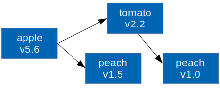
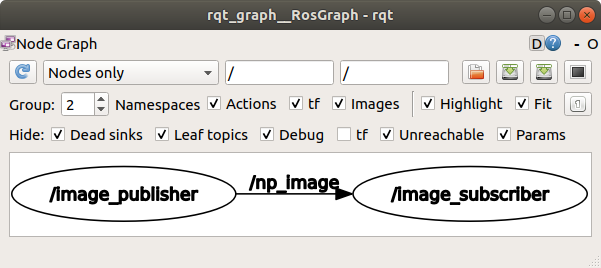

# Package Management

파이썬은 pip를 통해 쉽게 패키지를 설치하거나 삭제할 수 있다. 파이썬 패키지들은 [PyPI](<https://pypi.org/>)에서 호스팅하고 있고 로컬 PC에서는 pip만 설치하면 PyPI의 수많은 패키지들을 명령어 하나로 설치할 수 있다. 마치 우분투에서 apt로 대부분의 패키지를 설치할 수 있는 것과 같다. 지금까지는 파이썬 문법을 배우는게 급해서 PyCharm에서 GUI를 이용해 이를 처리해왔지만 pip를 사용하는 것은 파이썬 사용자에게는 당연하고 자연스러운 일이다.  

##  1. pip 설치

pip를 사용하려면 설치부터 해야한다. 우분투의 경우 apt로 쉽게 설치가능하다. 아직까지는 기본 python, pip는 Python2.x 를 위한 명령어로 지정되어있다. `python3-pip`를 설치해야 Python3를 위한 pip가 설치된다. 아래 명령어들을 통해 설치 상태를 확인해보자.

```
$ sudo apt install python3-dev python3-pip
$ which python3
/usr/bin/python3
$ ll /usr/bin/python3
lrwxrwxrwx 1 root root 9  9월 26 00:48 /usr/bin/python3 -> python3.6*
$ which pip3
/usr/bin/pip3
$ pip3 --version
pip 9.0.1 from /usr/lib/python3/dist-packages (python 3.6)
```

pip를 사용하면서 자주 발생하는 에러가 `importerror: cannot import name 'main'`인데 이런 에러가 나면 바로 재설치를 해주는것이 좋다. 에러의 원인은 우분투에서 기본 제공하는 pip 버전에서 pip 버전을 업그레이드 했을 때 이런 문제가 생긴다. 재설치는 다음과 같이 한다.

```
$ sudo apt --purge autoremove python3-pip
$ sudo apt install python3-pip
```

만약 윈도우에서 설치하거나 우분투에서 위 방법이 잘 작동하지 않으면 설치 스크립트를 사용한다.

```
$ curl https://bootstrap.pypa.io/get-pip.py -o get-pip.py
$ python3 get-pip.py
```


## 2. pip 사용법

pip는 손쉽게 패키지를 설치하고 삭제하도록 도와주며 특정 패키지를 설치할 때 그 패키지가 의존하는 패키지까지 자동으로 찾아서 설치해준다. 또한 설치된 패키지 목록을 출력해서 다른 곳에서도 같은 환경을 쉽게 복원할 수 있다.

### 설치와 삭제

`pip3 --help`를 치면 여러 기능이 나오지만 실제로 쓰는 건 거의 설치(`install`)와 삭제(`uninstall`)다. 한 번에 여러개의 패키지를 설치하거나 삭제할 수 있다.

```
$ pip3 install <package1> <package2> ...
$ pip3 uninstall <package1> <package2> ...
```

예를 들어 수학 패키지인 `numpy`를 설치하고 삭제해 보자. 설치 전후에 파이썬에서 `import numpy`가 실행되는지 확인해보자. `python3 -c` 옵션을 이용해 커맨드에서 바로 간단한 스크립트를 실행해볼 수 있다.

```
$ python3 -c "import numpy"
Traceback (most recent call last):
  File "<string>", line 1, in <module>
ModuleNotFoundError: No module named 'numpy'

~$ pip3 install numpy
Collecting numpy
  Downloading https://files.pythonhosted.org/packages/0e/46/ae6773894f7eacf53308086287897ec568eac9768918d913d5b9d366c5db/numpy-1.17.3-cp36-cp36m-manylinux1_x86_64.whl (20.0MB)
    100% |████████████████████████████████| 20.0MB 84kB/s 
Installing collected packages: numpy
Successfully installed numpy-1.17.3

$ python3 -c "import numpy; print(numpy.__version__)"
1.17.3

$ pip3 uninstall numpy
Uninstalling numpy-1.17.3:
  /home/ian/.local/bin/f2py
  /home/ian/.local/bin/f2py3
  /home/ian/.local/bin/f2py3.6
...
Proceed (y/n)? y
  Successfully uninstalled numpy-1.17.3
```


### 설치된 패키지 복원

pip를 이용하면 현재 PC에 설치된 패키지 목록과 버전을 파일에 출력할 수 있다. 다른 PC에서 그 파일을 이용해 동일한 패키지를 동일한 버전으로 일괄 설치할 수 있다. 리눅스 PC를 새로 세팅하거나 특정 프로젝트에 맞는 패키지들을 설치할 때 유용한 기술이다.

```bash
# 패키지 목록을 저장할 때
pip3 freeze > requirements.txt

# 저장된 패키지 목록을 일괄 설치할 때
pip3 install -r requirements.txt
```


## 3. pip의 한계

터미널에서 바로 사용할 수 있는 `/usr/bin/pip3`는 시스템의 `/usr/bin/python3`를 위한 패키지 관리자다. 즉 pip를 이용해 패키지를 설치하면 시스템 전체에서 설치된 패키지를 사용할 수 있게 된다. 이것이 장점일 수도 있지만 보통은 그렇지 않다.  

시스템(PC)을 쓰는 사람은 한 가지 프로젝트만 계속 하는 것이 아니라 다양한 파이썬 프로젝트를 진행할 수 있다. 그때마다 다른 패키지가 필요할 것이고 pip를 이용해서 필요한 패키지들을 설치하다보면 상당히 많은 패키지들이 쌓이게 된다. 이때 크게 세 가지 문제가 발생할 수 있다.

- **프로젝트마다 다른 패키지 버전**: 현재 두 개의 프로젝트를 동시에 진행 중인데 한쪽에서는 `numpy==1.12` 버전이 필요하고 다른쪽에서는 `numpy==1.17` 버전이 필요할 수 있다. 특히 다른 사람과 대규모 프로젝트를 진행할 때 패키지 버전을 개발초기의 최신 안정 버전으로 고정시켜 놓는 것은 흔한 일이다. numpy를 시스템에 바로 설치한다면 이 사람은 두 개의 시스템이 필요하게 된다.

- **프로젝트 마다 다른 버전의 인터프리터**: 패키지 버전이 다른 것과는 차원이 다른 문제다. 예를 들어 두 개의 프로젝트를 동시에 진행 중인데 한쪽은 Python 3.3을 쓰고 다른 쪽은 Python 3.7을 써야한다면 한 시스템에서 병행하기 여려울 수도 있다.

- **패키지 사이의 의존성 불일치**: 설치된 패키지가 너무 많아지면 그들 사이에서도 **의존성이 꼬이는** 경우가 생긴다. 아래 그림을 보면 이해가 쉽다. `apple`이라는 패키지는 `tomato`와 `peach`에 의존하는데 `tomato`는 `apple`과 다른 버전의 `peach`에 의존하는 경우다. 이런 경우에 `peach`를 v1.5를 설치해야 하는지 v1.0를 설치해야 하는지 pip에서 의존성을 해결하지 못해 설치하다 멈춰버리거나 에러를 발생시키고 설치를 완료하지 못하는 경우도 있다. 따라서 **하나의 환경에 설치되는 패키지는 최소한으로 줄일수록 좋다.**

  

두 개의 프로젝트를 하려고 PC를 두 대를 쓰거나 운영체제를 두 개를 설치하는 것은 너무 비효율적이다. 그래서 "가상 환경 (virtual environment)"이란 개념이 필요해졌다. 가상 환경은 패키지를 시스템에 직접 설치하는 대신 특정 프로젝트를 위한 전용의 가상 시스템(환경)을 만들어 운용하는 것이다. 이 가상 환경에 파이썬 인터프리터와 pip를 따로 설치하고 패키지도 시스템이 아닌 가상 환경에 설치한다. 이곳의 파이썬, pip, 모든 패키지들이 시스템의 것들과는 독립적이다.

파이썬 개발은 시스템에 설치하는 라이브러리에 의존하지 않고 파이썬 패키지만 활용하므로 가상 환경과 같은 독립적인 개발환경 구성이 가능하다. 파이썬 패키지는 `apt`로도 일부 설치할 수는 있지만 `pip`로 거의 다 설치 가능하다. C++에도 이러한 독립적인 개발환경을 만드려는 비슷한 시도들은 있지만 정착되지 못 했다. 가상 환경을 사용하면 하나의 시스템 안에서 여러 개의 파이썬을 운영할수 있기 때문에 여러 프로젝트를 하기 위해 다수의 시스템을 운용할 필요가 없다.


# Virtual Environment Tools

시스템에 패키지를 바로 설치하고 이를 기반으로 개발을 하는 것은 장기적으로 불안정하다. (=시스템을 주기적으로 갈아엎어야 한다.) 그래서 보통 새로운 프로젝트를 할 때마다 전용 가상 환경을 새로 만들어서 작업을 한다. 파이썬 가상 환경을 운영할 수 있는 툴은 여러가지가 있다.

- virtualenv, virtualenvwrapper : 가장 오래되고 많이 쓰이기도 하는 가상 환경 툴이다. 파이참에서도 기본 툴로 쓴다.
- venv: Python3.3부터 기본 내장된 패키지인데 virtualenv와 사용법이 비슷하다.
- pyenv: 원래는 여러 파이썬 버전을 동시에 사용하기 위한 툴인데 가상 환경 기능을 플러그인을 통해 추가 할 수 있다.  
- conda: conda는 Anaconda 설치시 포함되는 패키지 관리 툴로 가상 환경 관리 기능도 있다. Anaconda는 의존성 문제가 없고 많이 쓰이는 패키지들을 잘 조합해서 미리 다 설치해버리기 위해 나온 일종의 메타 메키지다. 초보자를 위한 튜토리얼엔 conda를 많이 쓰지만 Anaconda에는 불필요한 패키지가 많아 용량을 많이 차지하기 때문에 별로 추천하지 않는다.
- pipenv: 가상 환경 관리 뿐만 아니라 패키지 설치 및 삭제, 파이썬 버전 선택, 의존성 문제 해결, 같은 환경 복구 등 같은 다양한 기능을 하나의 툴에 담은 실험적인 툴이다. (pipenv = pip + virtualenv) 하지만 설치 속도가 느리고 UI가 불친절하고 현재 개발이 멈춘 것 같다. 그래도 대부분의 경우에는 잘 작동해서 하나로 모든 것을 해결하기에 좋다. 
- poetry: pipenv와 비슷한데 pipenv보다 더 나은 의존성 문제 해결 능력을 보여주고 터미널에 뜨는 메시지도 현재 상황을 친절하게 알려준다. 하지만 파이썬 버전을 선택하는 기능은 없다.

여기서는 가장 안정적인 virtualenv, virtualenvwrapper, venv, pyenv에 대해서 사용법을 알아보겠다.


## 1. virtualenv

먼저 설치부터 해보자. virtualenv는 pip로 설치할 수 있다.

```
$ pip3 install virtualenv
$ virtualenv --version
16.7.6
```

**이제부터 pip를 이용해 시스템에 설치하는 패키지는 오직 가상 환경 툴로 제한한다.**  나머지 모든 개발에 필요한 패키지들은 가상 환경 내부에 설치하기로 한다.  

가상 환경을 사용하기에 앞서 파이썬 환경에 ROS의 개입을 막기 위해 `~/.bashrc`에 있는 다음 두 줄을 주석처리해주자.

```bash
# source /opt/ros/melodic/setup.bash
# source ~/catkin_ws/devel/setup.bash
```

새 터미널을 열고 기본 virtualenv 사용법부터 알아보자. 

### 1.1. 가상환경 만들기

실제 작업을 할 `~/workspace/vework` 디렉토리 아래  `virtual_py36`라는 가상 환경을 만들고자 한다. `--python` 옵션을 통해 기반 인터프리터를 선택할 수 있다. `python3`나 `python3.6`을 사용할 수 있다. 혹은 옵션을 쓰지 않으면 시스템 기본 Python3를 사용한다.

```bash
$ cd ~/workspace
~/workspace$ mkdir vework
~/workspace$ cd vework
~/workspace/vework$ which python3.6
/usr/bin/python3.6
~/workspace/vework$ virtualenv --python=python3.6 virtual_py36
Running virtualenv with interpreter /usr/bin/python3.6
Already using interpreter /usr/bin/python3.6
Using base prefix '/usr'
New python executable in /home/ian/workspace/vework/virtual_py36/bin/python3.6
Also creating executable in /home/ian/workspace/vework/virtual_py36/bin/python
Installing setuptools, pip, wheel...
done.
```

기존의 `/usr/bin/python3.6`을 복사해서 `<venv_path>/bin/python3.6`에 복사한 후 이 가상 환경에 `setuptools, pip, wheel` 등을 설치하는 것을 볼 수 있다.  


### 1.2. 가상 환경 활성화

가상 환경을 활성화 하면 그때부터 `python`이나 `pip` 등은 더 이상 `/usr/bin`에 설치된 시스템 실행파일이 아니라 가상 환경에 설치된 실행파일이 사용된다. 터미널에는 가상 환경의 이름이 표시되어 현재 가상 환경이 활성화 됐음을 알려준다.

```bash
~$ cd ~/workspace/vework/virtual_py36/
~/workspace/vework/virtual_py36$ source bin/activate
(virtual_py36) ~/workspace/vework/virtual_py36$ which python
/home/ian/workspace/vework/virtual_py36/bin/python
(virtual_py36) ~/workspace/vework/virtual_py36$ which pip
/home/ian/workspace/vework/virtual_py36/bin/pip
(virtual_py36) ~/workspace/vework/virtual_py36$ ls -l bin
total 4476
-rw-r--r-- 1 ian ian    2228 10월 22 00:54 activate
-rw-r--r-- 1 ian ian    1447 10월 22 00:54 activate.csh
-rw-r--r-- 1 ian ian    3112 10월 22 00:54 activate.fish
-rw-r--r-- 1 ian ian    1751 10월 22 00:54 activate.ps1
-rw-r--r-- 1 ian ian    1517 10월 22 00:54 activate_this.py
-rw-r--r-- 1 ian ian    1169 10월 22 00:54 activate.xsh
-rwxr-xr-x 1 ian ian     270 10월 22 00:54 easy_install
-rwxr-xr-x 1 ian ian     270 10월 22 00:54 easy_install-3.6
-rwxr-xr-x 1 ian ian     257 10월 22 00:54 pip
-rwxr-xr-x 1 ian ian     257 10월 22 00:54 pip3
-rwxr-xr-x 1 ian ian     257 10월 22 00:54 pip3.6
lrwxrwxrwx 1 ian ian       9 10월 22 00:54 python -> python3.6
lrwxrwxrwx 1 ian ian       9 10월 22 00:54 python3 -> python3.6
-rwxr-xr-x 1 ian ian 4526456 10월 22 00:54 python3.6
-rwxr-xr-x 1 ian ian    2357 10월 22 00:54 python-config
-rwxr-xr-x 1 ian ian     248 10월 22 00:54 wheel
```

가상 환경이 활성화 된 상태에서는 `python, pip`만 써도 `python3, pip3`가 실행된다.


### 1.3 가상 환경 패키지 관리

가상 환경을 활성화 한 뒤에는 그냥 pip를 통해 패키지를 관리하면 가상 환경 내부의 패키지를 설치하거나 삭제할 수 있다. `pip list`를 통해 설치된 패키지 목록을 보면 이 환경이 깨끗하다는 것을 볼 수 있다.

```bash
(virtual_py36) ~/workspace/vework/virtual_py36$ pip list
Package    Version
---------- -------
pip        19.3.1 
setuptools 41.4.0 
wheel      0.33.6 
```

가상 환경을 관리하는 방법은 기존 pip를 쓰던 방법과 동일하다.

```bash
# 패키지 설치
(virtual_py36) ~/workspace/vework/virtual_py36$ pip install numpy pandas
Collecting numpy
...
Installing collected packages: numpy, pytz, six, python-dateutil, pandas
Successfully installed numpy-1.17.3 pandas-0.25.2 python-dateutil-2.8.0 pytz-2019.3 six-1.12.0
# 설치된 패키지 목록 보기
(virtual_py36) ~/workspace/vework/virtual_py36$ pip list
Package         Version
--------------- -------
numpy           1.17.3 
pandas          0.25.2 
pip             19.3.1 
python-dateutil 2.8.0  
pytz            2019.3 
setuptools      41.4.0 
six             1.12.0 
wheel           0.33.6
# 패키지 삭제
(virtual_py36) ~/workspace/vework/virtual_py36$ pip uninstall pandas
Uninstalling pandas-0.25.2:
  Would remove:
    /home/ian/workspace/vework/virtual_py36/lib/python3.6/site-packages/pandas-0.25.2.dist-info/*
    /home/ian/workspace/vework/virtual_py36/lib/python3.6/site-packages/pandas/*
Proceed (y/n)? y
  Successfully uninstalled pandas-0.25.2
# 목록 다시 보기
(virtual_py36) ~/workspace/vework/virtual_py36$ pip list
Package         Version
--------------- -------
numpy           1.17.3 
pip             19.3.1 
python-dateutil 2.8.0  
pytz            2019.3 
setuptools      41.4.0 
six             1.12.0 
wheel           0.33.6 
# 패키지 목록 파일 출력
(virtual_py36) ~/workspace/vework/virtual_py36$ pip freeze > requirements.txt
# 파일 확인
(virtual_py36) ~/workspace/vework/virtual_py36$ cat requirements.txt 
numpy==1.17.3
python-dateutil==2.8.0
pytz==2019.3
six==1.12.0
```


### 1.4 가상 환경 비활성화

가상 환경을 비활성화 하는 방법은 간단하다. `deactivate`를 실행하면 터미널 앞에 있던 가상 환경 이름이 사라진다.

```bash
(virtual_py36) ~/workspace/vework/virtual_py36$ deactivate
~/workspace/vework/virtual_py36$ which python3
/usr/bin/python3
```


### 1.5 가상 환경 복원

이곳에서 만든 가상 환경을 `pip freeze`를 이용해 시스템 내부 다른 디렉토리에서 혹은 다른 시스템에서 똑같이 복원할 수 있다. 방금 만든 가상 환경을 활성화 한 후 환경 내부의 패키지 목록을 저장하고 이를 다른 가상 환경에서 복원하면 된다.

```bash
~/workspace/vework/virtual_py36$ cd ~/workspace/vework/
# 새로운 가상 환경 만들기
~/workspace/vework$ virtualenv --python=python3 reconstruct_env
Already using interpreter /usr/bin/python3
Using base prefix '/usr'
New python executable in /home/ian/workspace/vework/reconstruct_env/bin/python3
Also creating executable in /home/ian/workspace/vework/reconstruct_env/bin/python
Installing setuptools, pip, wheel...
done.
# 이전 가상 환경에서 requirments.txt 복사
~/workspace/vework$ cp virtual_py36/requirements.txt reconstruct_env/
# 새 가상 환경 활성화
~/workspace/vework$ cd reconstruct_env/
~/workspace/vework/reconstruct_env$ source bin/activate
# requirments.txt를 이용한 패키지 일괄 설치
(reconstruct_env) ~/workspace/vework/reconstruct_env$ pip install -r requirements.txt 
Collecting numpy==1.17.3
...
Installing collected packages: numpy, six, python-dateutil, pytz
Successfully installed numpy-1.17.3 python-dateutil-2.8.0 pytz-2019.3 six-1.12.0
# 설치된 패키지 목록 확인 (위와 비교)
(reconstruct_env) ~/workspace/vework/reconstruct_env$ pip list
Package         Version
--------------- -------
numpy           1.17.3 
pip             19.3.1 
python-dateutil 2.8.0  
pytz            2019.3 
setuptools      41.4.0 
six             1.12.0 
wheel           0.33.6 
(reconstruct_env) ~/workspace/vework/reconstruct_env$ deactivate
```

설치 후 패키지 목록을 보면 `virtual_py36`과 동일한 패키지들이 동일한 버전으로 설치되었음을 볼 수 있다.


## 2. virtualenvwrapper

virtualenv는 쓰기 간단하고 독립적인 환경을 만들 수 있어서 인기가 많지만 타이핑이 좀 귀찮다는 단점이 있다. 매번 작업을 시작할 때마다 가상 환경 경로로 이동해서(cd) 가상 환경을 활성화(activate)하는 것이 귀찮은데 이것을 virtualenvwrapper는 `workon <env_name>` 하나로 줄여준다.

또한 인터프리터나 패키지 설치 파일들이 프로젝트 디렉토리에 위치하기 때문에 git을 쓰는 경우 `venv` 디렉토리를 `.gitignore`에 추가해줘야 하는 것도 조금 번거로운 일이다. virtualenvwrapper는 가상 환경 파일들을 한 곳에 모아서 관리하기 때문에 프로젝트 디렉토리를 깨끗하게 쓸 수 있다.


### 2.1 설치 및 설정

virtualenvwrapper도 pip로 설치할 수 있다.

```
$ pip3 install virtualenvwrapper
```

가상 환경이 만들어질 경로를 미리 만든다.

```
$ mkdir ~/.virtualenv
```

`~/.bashrc`에 줄을 추가하여 환경 변수를 등록한다.

```bash
$ gedit ~/.bashrc
# 아래 세 줄 추가
export WORKON_HOME=~/.virtualenvs
export VIRTUALENVWRAPPER_PYTHON=/usr/bin/python3
source ~/.local/bin/virtualenvwrapper.sh
# 닫기
$ source ~/.bashrc
virtualenvwrapper.user_scripts creating /home/ian/.virtualenvs/premkproject
virtualenvwrapper.user_scripts creating /home/ian/.virtualenvs/postmkproject
virtualenvwrapper.user_scripts creating /home/ian/.virtualenvs/initialize
virtualenvwrapper.user_scripts creating /home/ian/.virtualenvs/premkvirtualenv
virtualenvwrapper.user_scripts creating /home/ian/.virtualenvs/postmkvirtualenv
virtualenvwrapper.user_scripts creating /home/ian/.virtualenvs/prermvirtualenv
virtualenvwrapper.user_scripts creating /home/ian/.virtualenvs/postrmvirtualenv
virtualenvwrapper.user_scripts creating /home/ian/.virtualenvs/predeactivate
virtualenvwrapper.user_scripts creating /home/ian/.virtualenvs/postdeactivate
virtualenvwrapper.user_scripts creating /home/ian/.virtualenvs/preactivate
virtualenvwrapper.user_scripts creating /home/ian/.virtualenvs/postactivate
virtualenvwrapper.user_scripts creating /home/ian/.virtualenvs/get_env_details
```

`source ~/.local/bin/virtualenvwrapper.sh`가 처음 실행되기 때문에 `~/.virtualenv` 경로에 파일들이 설치된다.


### 2.2 virtualenvwrapper 사용

`virtualenvwrapper`는 직관적인 이름의 다양한 커맨드를 제공한다.

- mkvirtualenv [venv_name] (--python=[interpreter]) : 가상 환경 이름과 인터프리터를 지정하여 새로운 가상 환경을 만든다. 하지만 virtualenv 처럼 현재 경로에 만드는 것이 아니라 `WORKON_HOME`에 지정한 `~/.virtualenvs`에 가상 환경을 만든다.
- lsvirtualenv : 만들어진 가상 환경 목록을 보여준다.
- workon [venv_name] : 가상 환경을 활성화한다. 특정 경로의 activate를 실행하지 않아도 된다. 가상 환경 이름만 지정하면 된다.
- setvirtualenvproject : 가상 환경이 활성화된 상태에서 프로젝트 디렉토리로 이동해서 이 명령을 실행하면 가상 환경과 디렉토리가 연결된다. 연결된 후부터는 `workon [venv_name]` 실행시 가상 환경 활성화 뿐만 아니라 프로젝트 디렉토리로 이동까지 자동으로 된다. 
- cdproject : 가상 환경이 활성화된 상태에서 가상 환경에 연결된 프로젝트 디렉토리가 있다면 프로젝트 디렉토리로 이동한다.
- wipeenv : 현재 가상 환경에 설치된 3rd party 패키지들이 모두 삭제된다. 가상 환경을 처음 만든 상태로 초기화 한다고 보면 된다.
- rmvirtualenv [venv_name] : 가상 환경을 삭제한다.

다음 명령어를 통해 실습을 해보자. 파이썬 버전은 지속적으로 업데이트되고 있으므로 현재 파이썬 버전을 확인 후 아래 명령어를 버전에 맞춰 수정하여 실행한다.

```bash
~$ cd ~/workspace/vework/
# 현재 파이썬 버전 확인
~$ cd ~/workspace/vework/$ python -V

# 가상 환경 만들기
~/workspace/vework$ mkvirtualenv --python=python3.6 vewrapper_py36
Running virtualenv with interpreter /usr/bin/python3.6
Already using interpreter /usr/bin/python3.6
Using base prefix '/usr'
New python executable in /home/ian/.virtualenvs/vewrapper_py36/bin/python3.6
Also creating executable in /home/ian/.virtualenvs/vewrapper_py36/bin/python
Installing setuptools, pip, wheel...
done.
...

# 가상 환경 비활성화
(vewrapper_py36) ~/workspace/vework$ deactivate
# 가상 환경 목록 보기
~/workspace/vework$ lsvirtualenv 
vewrapper_py36
==============

# 가상 환경 활성화
~/workspace/vework$ workon vewrapper_py36
(vewrapper_py36) ~/workspace/vework$ 
# 가상 환경에 패키지 설치
(vewrapper_py36) ~/workspace/vework$ pip install numpy
Collecting numpy
  Using cached https://files.pythonhosted.org/packages/0e/46/ae6773894f7eacf53308086287897ec568eac9768918d913d5b9d366c5db/numpy-1.17.3-cp36-cp36m-manylinux1_x86_64.whl
Installing collected packages: numpy
Successfully installed numpy-1.17.3

# "vework"를 "vewrapper_py36" 가상 환경을 위한 디렉토리로 지정
(vewrapper_py36) ~/workspace/vework$ setvirtualenvproject 
Setting project for vewrapper_py36 to /home/ian/workspace/vework

# 비활성화
vewrapper_py36) ~/workspace/vework$ deactivate

# 다른 위치에 있어도 workon <venv_name>하면 이제 가상 환경 활성화 + 경로 이동까지 실행
~$ cd ~/workspace/vework/
/usr$ workon vewrapper_py36
(vewrapper_py36) ~/workspace/vework$ 

# 가상 환경이 활성화 된 상태에서는 cdproject를 통해 프로젝트 경로로 돌아옴
(vewrapper_py36) ~/workspace/vework$ cd /usr/
(vewrapper_py36) /usr$ cdproject 
(vewrapper_py36) ~/workspace/vework$ 

# 3rd party 패키지 모두 삭제 (가상환경 초기화)
(vewrapper_py36) ~/workspace/vework$ wipeenv
Uninstalling packages:
numpy==1.17.3

Uninstalling numpy-1.17.3:
  Successfully uninstalled numpy-1.17.3

# 가상 환경 삭제
(vewrapper_py36) ~/workspace/vework$ deactivate 
~/workspace/vework$ rmvirtualenv vewrapper_py36
Removing vewrapper_py36...
```


## 3. venv

venv는 파이썬 설치시 기본 설치되는 패키지다. 커맨드를 쓰는 방법은 조금 다르지만 작동하는 방식은 virtualenv와 거의 동일하다. virtualenv처럼 프로젝트 디렉토리 아래에 바로 가상 환경 디렉토리가 생기고 가상 환경을 활성화 시키려면 activate를 해줘야한다.  

venv는 직접 사용하는 것이 아니라 `python -m`을 통해 실행한다. `python -m`은 특정 파이썬에 설치된 라이브러리를 스크립트로 실행해주는 것이다. venv는 `python3 -m venv [options]`처럼 실행하고 pip도 `python3 -m pip [options]`처럼 실행할 수 있다. 여러 버전의 pip가 설치되어 있을 때 `python -m`을 통해 실행하면 어떤 인터프리터와 함께 설치된 pip를 실행하는지가 명확해진다.  

venv는 기본 패키지가 맞긴 한데 우분투에서 venv 실행시 패키지 설치를 하라고 한다. 일단 설치를 먼저 하자.

```
$ sudo apt install python3-venv
```

venv로 가상 환경은 다음과 같이 만들 수 있다. virtualenv와 마찬가지로 `venv_py36`이라는 디렉토리가 생기고 그곳에 파이썬과 패키지가 설치된다.

```bash
~$ cd ~/workspace/vework/
~/workspace/vework$ python3 -m venv venv_py36
```

그 뒤로 가상 환경 활성화, 패키지 설치, 가상 환경 비활성화는 virtualenv와 같다.

```bash
~/workspace/vework$ cd venv_py36/
# 가상 환경 활성화
~/workspace/vework/venv_py36$ source bin/activate
# 가상 환경 확인
(venv_py36) ~/workspace/vework/venv_py36$ which python
/home/ian/workspace/vework/venv_py36/bin/python
(venv_py36) ~/workspace/vework/venv_py36$ which pip
/home/ian/workspace/vework/venv_py36/bin/pip
# 패키지 설치
(venv_py36) ~/workspace/vework/venv_py36$ pip install numpy
Collecting numpy
...
Installing collected packages: numpy
Successfully installed numpy-1.17.3
# 가상 환경 비활성화
(venv_py36) ~/workspace/vework/venv_py36$ deactivate 
```

venv는 특정 파이썬 인터프리터를 지정하는 기능이 없다. venv 자체가 특정 파이썬을 통해서 실행되기 때문에 `python -m` 할 때 인터프리터를 이미 선택한 것이다.


## 4. pyenv

pyenv는 본래 여러 파이썬 버전을 함께 운용하기 위해 만들어졌다. 같은 Python3 라도 3.6에는 3.0에는 없는 추가된 문법이 있다. (e.g. f문자열 포맷팅) 수십명이 함께 작업하는 대규모 프로젝트에서 파이썬의 버전을 바꾸는 것은 신중하게 결정해야 할 일이다. 그래서 시스템의 파이썬 버전과는 다른 버전의 파이썬을 써야할 경우도 종종 생기는데 이때 pyenv가 유용하게 쓰인다.

그리고 pyenv에 가상 환경 플러그인을 설치하면 가상 환경도 만들 수 있다. 여기서는 pyenv의 파이썬 인터프리터 선택 기능과 가상 환경 관리 기능에 대해 알아본다.

### 4.1 pyenv 설치

설치는 다음 스크립트를 실행하면 된다. 설치 과정을 보면 pyenv-virtualenv과 같은 플러그인도 설치되는 것을 볼 수 있다.

```bash
$ sudo apt install -y build-essential libssl-dev zlib1g-dev libbz2-dev \
libreadline-dev libsqlite3-dev wget curl libncurses5-dev libncursesw5-dev \
xz-utils tk-dev libffi-dev liblzma-dev python-openssl git
# raspberry pi OS가 아닌 일반 우분투라면
$ sudo apt install -ll llvm

~$ curl -L https://raw.githubusercontent.com/yyuu/pyenv-installer/master/bin/pyenv-installer | bash
  % Total    % Received % Xferd  Average Speed   Time    Time     Time  Current
                                 Dload  Upload   Total   Spent    Left  Speed
100  2454  100  2454    0     0   1465      0  0:00:01  0:00:01 --:--:--  1464
Cloning into '/home/ian/.pyenv'...
...
# Load pyenv automatically by adding
# the following to ~/.bashrc:

export PATH="/home/ian/.pyenv/bin:$PATH"
eval "$(pyenv init -)"
eval "$(pyenv virtualenv-init -)"
```

마지막에 보면 여기서도 `~/.bashrc`에 추가하라는 구문이 있다. 저기 써있는 그대로 추가한다.

```bash
$ gedit ~/.bashrc
# 아래 세 줄 추가
export PATH="/home/ian/.pyenv/bin:$PATH"
eval "$(pyenv init -)"
eval "$(pyenv virtualenv-init -)"
# 저장 후 닫기
```

pyenv의 원리를 간단히 설명해보면 `~/.bashrc`에서 `pyenv init -`를 실행하면 `PATH`의 앞에 pyenv 경로가 추가된다. 우리가 어떤 명령어를 쉘에 입력할 때 `PATH`의 앞 쪽에 있는 경로부터 명령어를 찾는다. 그래서 `PATH` 앞 쪽에 pyenv 경로를 추가하고 그곳에 python, pip, python3, pip3 등의 실행 파일들을 넣으면 시스템의 python 대신 pyenv의 python을 우선적으로 사용하게 된다.

실행 스크립트는 `/.pyenv/shims`에 있는데 모두다 실제 인터프리터가 아닌 인터프리터를 실행해주는 스크립트다. 'shim'이란 "틈새에 끼우는 끼움쇠, 쐐기"라는 뜻인데 pyenv에서는 사용자의 명령어와 시스템 python 사이에 pyenv를 끼워넣었다는 뜻인것 같다.

```
$ echo $PATH
/home/ian/.pyenv/plugins/pyenv-virtualenv/shims:/home/ian/.pyenv/shims:/home/ian/.pyenv/bin:/home/ian/gems/bin:/home/ian/.local/bin:/usr/local/sbin:/usr/local/bin:/usr/sbin:/usr/bin:/sbin:/bin:/usr/games:/usr/local/games:/snap/bin
$ ls ~/.pyenv/shims
2to3              idle     pip3.6    python            python3.6m-config  python3-config
2to3-3.6          idle3    pip3.7    python3           python3.7          python-config
2to3-3.7          idle3.6  pydoc     python3.6         python3.7-config   pyvenv
easy_install      idle3.7  pydoc3    python3.6-config  python3.7-gdb.py   pyvenv-3.6
easy_install-3.6  pip      pydoc3.6  python3.6-gdb.py  python3.7m         pyvenv-3.7
easy_install-3.7  pip3     pydoc3.7  python3.6m        python3.7m-config
```


### 4.2 pyenv 사용법

pyenv는 다양한 sub-command를 통해 다양한 기능을 제공한다. 그 중 파이썬 버전 선택과 관련된 동작들을 알아보자.

- install [version]: 특정 버전의 파이썬을 `~/.pyenv/versions` 경로에 설치한다. 버전은 `.`으로 구분된 세 개의 숫자로 써야한다. 
- uninstall [version]: `install`로 설치한 특정 버전의 파이썬을 삭제한다.
- versions: 현재 pyenv에 설치된 버전들을 보여준다.
- version: 현재 사용중인 버전을 보여준다.
- global [version]: 시스템 전역 인터프리터 버전을 지정한다.
- local [version]: 현재 디렉토리 아래서 사용할 파이썬 버전을 지정한다.

실습을 통해 배워보자.

```bash
# 설치 가능한 모든 파이썬 버전 보기
$ pyenv install --list
# 현재 시스템 버전인 3.7.9을 pyenv 경로에 설치
$ pyenv install 3.7.9
Downloading Python-3.7.9.tar.xz...
-> https://www.python.org/ftp/python/3.7.9/Python-3.7.9.tar.xz
Installing Python-3.7.9...
WARNING: The Python readline extension was not compiled. Missing the GNU readline lib?
Installed Python-3.7.9 to /home/ian/.pyenv/versions/3.7.9

# 설치된 버전 목록 확인
$ pyenv versions
* system (set by /home/ian/.pyenv/version)
  3.7.9

# 전역 파이썬 버전 변경
$ pyenv global 3.7.9
# 현재 사용중인 버전 확인
$ pyenv version
3.7.9 (set by /home/ian/.pyenv/version)
$ which python
/home/ian/.pyenv/shims/python
$ python --version
Python 3.7.9

# 특정 디렉토리로 이동
$ cd ~/workspace/vework
# 현재 디렉토리에서만 다른 버전 지정
~/workspace/vework$ pyenv local 3.7.9
~/workspace/vework$ python --version
Python 3.7.9
# 버전 설정 파일 확인
~/workspace/vework$ cat .python-version 
3.7.9
```


### 4.3 pyenv 가상 환경 사용

pyenv를 설치할 때 이미 가상 환경 플러그인도 설치되었으므로 따로 설치하지 않아도 된다. 다음은 가상환경과 관련된 sub-command들이다.

- virtualenv [version] [env_name] : 특정 [version]의 환경을 [env_name]이란 이름으로 생성한다. `pyenv install`을 통해 설치된 버전이어야 한다. 가상환경을 현재 디렉토리에 만드는 것이 아니라 `~/.pyenv/versions/[version]/env/[env_name]` 아래에 새로운 환경이 만들어진다.
- virtualenv-delete [env_name] : [env_name] 환경을 삭제한다.
- activate [env_name] : [env_name] 환경을 활성화 시킨다.
- deactivate : 환경을 비활성화 시킨다.

```bash
# 3.7.9 버전의 'pyenv_py37'이라는 가상 환경 만들기
~/workspace/vework$ pyenv virtualenv 3.7.9 pyenv_py37
Looking in links: /tmp/tmph8o2x4g9
Requirement already satisfied: setuptools in /home/ian/.pyenv/versions/3.7.9/envs/pyenv_py37/lib/python3.7/site-packages (41.2.0)
Requirement already satisfied: pip in /home/ian/.pyenv/versions/3.7.9/envs/pyenv_py37/lib/python3.7/site-packages (19.2.3)
# 'pyenv_py37' 환경 활성화
~/workspace/vework$ pyenv activate pyenv_py37 
# 가상 환경에 numpy 설치
(pyenv_py37) ~/workspace/vework$ pip install numpy
...
# 환경 비활성화
(pyenv_py37) ~/workspace/vework$ pyenv deactivate 
# 가상 환경 삭제
~/workspace/vework$ pyenv virtualenv-delete pyenv_py37 
pyenv-virtualenv: remove /home/ian/.pyenv/versions/3.7.9/envs/pyenv_py37? y
```


---

지금까지 여러가지 가상 환경 툴에 대해 알아보았다. 툴은 여러가지지만 생성, 삭제, 활성화, 비활성화 네 가지 기능만 알면된다. 각자 장단점이 있으므로 상황에 맞춰, 혹은 마음에 드는 걸 골라쓰면 된다.


# ROS를 위한 개발환경 세팅

우리는 ROS 프로그래밍을 하면 되는데 왜 가상 환경을 배우고 있던걸까? 바로 **Python 3를 쓰기 위해**서다. 간단히 토픽을 주고 받는 수준의 코드는 Python 2나 Python 3나 별 차이가 안나지만 파이썬 최신 문법을 쓰고, 복잡한 알고리즘 구현을 위해 최신 외부 패키지들을 사용하다 보면 Python 2로는 한계가 있다. 대표적으로 딥러닝 라이브러리를 쓰지 못한다. ~~그냥 구식 인터프리터를 쓰는게 찝찝하다.~~ 그리고 가급적 시스템 경로(`/usr`)에는 파이썬 패키지를 설치하지 않는 것이 좋기 때문에 외부 패키지를 쓰려면 가상 환경을 만들어서 설치해야 한다.  

본격적으로 들어가기 전에 위에서 주석처리한 `~/.bashrc`의 ROS 관련 설정을 다시 복원해야 한다.

```bash
$ gedit ~/.bashrc
# 아래 두 줄 주석 해제, 저장, 닫기
source /opt/ros/melodic/setup.bash
source ~/catkin_ws/devel/setup.bash
```


## 1. ROS를 위한 가상 환경 만들기

pyenv를 이용해 `rospy3`란 가상 환경을 만든다. pyenv 가상 환경은 특정 경로에 종속된 것이 아니기 때문에 만들어진 가상 환경을 어디서나 쓸 수 있다는 장점이 있다. 가상 환경을 활성화하여 그곳에 ROS 관련 패키지와 메시지 관련 패키지를 설치한다.

```bash
# 가상 환경 만들기
$ pyenv virtualenv 3.7.9 rospy3
Looking in links: /tmp/tmp86spyxlz
Requirement already satisfied: setuptools in /home/ian/.pyenv/versions/3.7.9/envs/rospy3/lib/python3.7/site-packages (40.6.2)
Requirement already satisfied: pip in /home/ian/.pyenv/versions/3.7.9/envs/rospy3/lib/python3.7/site-packages (18.1)
# 가상 환경 활성화
$ pyenv activate rospy3
# ROS에 필요한 패키지
$ pip install rosinstall msgpack empy defusedxml netifaces 
# (opencv 직접 빌드할 때만)
$ pip install scikit-build
# 외부 패키지 설치
$ pip install numpy opencv-python
# 가상 환경 비활성화
$ pyenv deactivate rospy3
```


## 2. 패키지 만들기

간단한 메시지를 보내거나 외부 패키지가 필요하지 않다면 굳이 Python3를 쓸 필요는 없다. 여기서는 OpenCV로 영상 파일을 열어서 영상을 토픽으로 보내고자 한다. 영상을 보내는 메시지 타입은 `sensor_msgs/Image`를 쓸 것이다.  

```bash
~$ cd ~/catkin_ws/src
~/catkin_ws/src$ catkin create pkg test_py3 --catkin-deps rospy std_msgs sensor_msgs
Creating package "test_py3" in "/home/ian/catkin_ws/src"...
Created file test_py3/package.xml
Created file test_py3/CMakeLists.txt
Created folder test_py3/src
Successfully created package files in /home/ian/catkin_ws/src/test_py3.
```

메시지를 만드는 것이 아니므로 `package.xml`이나 `CMakeLists.txt`도 거의 기본 설정대로 쓰면 된다.

### package.xml

```xml
<?xml version="1.0"?>
<package format="2">
  <name>test_py3</name>
  <version>0.1.0</version>
  <description>Test python3 for ros</description>
  <maintainer email="myemail@todo.todo">my name</maintainer>
  <license>BSD</license>
  <buildtool_depend>catkin</buildtool_depend>
  <build_depend>rospy</build_depend>
  <build_depend>sensor_msgs</build_depend>
  <build_depend>std_msgs</build_depend>
  <build_export_depend>rospy</build_export_depend>
  <build_export_depend>sensor_msgs</build_export_depend>
  <build_export_depend>std_msgs</build_export_depend>
  <exec_depend>rospy</exec_depend>
  <exec_depend>sensor_msgs</exec_depend>
  <exec_depend>std_msgs</exec_depend>
</package>
```

### CMakeLists.txt

```cmake
cmake_minimum_required(VERSION 2.8.3)
project(test_py3)

find_package(catkin REQUIRED COMPONENTS
  rospy
  sensor_msgs
  std_msgs
)
catkin_package(
  CATKIN_DEPENDS rospy sensor_msgs std_msgs
)
```


## 3. PyCharm에서 개발하기

그 동안 ROS 개발을 gedit에서 해왔고 gedit도 나름 파이썬 문법 하일라이팅을 지원하긴 하지만 자동 완성도 되지 않고 부족한 점이 많다. 역시 파이썬 개발을 할 때는 파이참(PyCharm)을 쓰는게 좋은데 약간의 트릭이 필요하다. 일단 평소대로 GUI를 통해 파이참을 실행하고 패키지 디렉토리(`~/catkin_ws/src/test_py3`)를 열어보자.  


### PYTHONPATH 설정

`src` 디렉토리 아래 `check_env.py`란 파일을 만들고 간단한 코드를 실행해보자.

```python
import rospy
```

파이참에서 바로 실행하면 실행 결과는 다음과 같다.

> Traceback (most recent call last):
>   File "/home/ian/catkin_ws/src/test_py3/src/check_env.py", line 1, in <module>
>     import rospy
> ModuleNotFoundError: No module named 'rospy'

에러가 난 이유는 ROS의 Python 관련 패키지들에 접근하지 못하기 때문이다. 그럼 지금까지는 어떻게 썼던걸까? 다시 터미널로 돌아가 간단한 스크립트를 실행해보자.

```bash
$ python -c "import rospy"
```

문제 없이 실행된다. rospy는 `/opt/ros/melodic/lib/python2.7/dist-packages/rospy`에 설치되어 있는데 어떻게 `/usr/bin/python`이 그곳에 접근하는 걸까?  

파이썬이 import를 할 때는 기본적으로 실행된 파이썬과 연결된 라이브러리 디렉토리를 검색한다. 예를 들어 `/usr/bin/python`은 `/usr/lib/python2.7/dist-packages`에서 패키지를 찾는다. 거기에 사용자가 다른 패키지 경로를 추가하고 싶을 때는 `PYTHONPATH`라는 환경 변수에 경로를 추가할 수 있다. 현재 `PYTHONPATH`를 확인해보자.

```
$ echo $PYTHONPATH
/home/ian/catkin_ws/devel/lib/python2.7/dist-packages:/opt/ros/melodic/lib/python2.7/dist-packages
```

우리가 만든 캐킨 워크스페이스와 시스템에 설치된 ROS 경로가 모두 세팅이 되어있다. 이것은 앞서 주석을 해제한 `~/.bashrc`에 들어있는 두 줄의 `source XXX/setup.bash`를 실행해서 만들어진 것이다. `PYTHONPATH` 변수는 파이썬의 버전을 가리지 않고 모두 적용된다. Python2, 3 모두 적용이 된다. 그래서 ROS 개발을 하지 않을 때는 `~/.bashrc`의 두 줄의 `source ~~/setup.bash`를 주석처리 하는 것이 낫다.  

그런데 왜 파이참에서는 rospy를 찾지 못 했을까? 파이참에서는 `PYTHONPATH`가 설정되어 있지 않기 때문이다. `check_env.py`에 다음과 같은 스크립트를 써서 확인해보자.

```python
import os
print(os.getenv('PYTHONPATH'))
```

결과는 다음과 같다.

> /home/ian/catkin_ws/src/test_py3

`PYTHONPATH`에 현재 경로만 나오고 ROS 관련된 경로가 없기 때문에 rospy를 찾지 못 한 것이다. `PYTHONPATH`는 `~/.bashrc`에서 실행된 것이고 이것은 bash 터미널을 열 때 실행이 된다. 하지만 GUI에서 파이참을 실행하게 되면 `~/.bashrc`가 실행되지 않고 따라서 `PYTHONPATH`도 설정되지 않는다.  

두 가지 해결 방법이 있다. 첫 번째는 파이참의 내부 설정에서 `PYTHONPATH`에 있는 경로를 추가해 주는 것이다. 하지만 이 방법은 패키지 경로가 바뀌거나 새로운 PC에서 작업을 재개할 때마다 파이참 세팅을 해야 하므로 번거롭다.  

간단한 방법은 **터미널에서 파이참을 실행하는 것이다.** bash 터미널에서는 이미 환경 설정이 되어있으므로 터미널에서 파이참을 실행하면 환경 변수도 그대로 가져올 수 있다. (터미널이 하나 떠있어야 하긴 하지만...) 터미널에서 파이참을 실행하는 명령어는 다음과 같다. 

```
$ pycharm-community
```

`check_env.py`에서 환경 변수를 확인하고 rospy를 import 해보자.

```python
import os
print('PYTHONPATH:', os.getenv('PYTHONPATH'))
import rospy
```

결과는 다음과 같다.

> /usr/bin/python3.7 /home/ian/catkin_ws/src/test_py3/src/check_env.py
> PYTHONPATH: /home/ian/catkin_ws/src/test_py3:/home/ian/catkin_ws/devel/lib/python2.7/dist-packages:/opt/ros/melodic/lib/python2.7/dist-packages
> Traceback (most recent call last):
>   File "/home/ian/catkin_ws/src/test_py3/src/check_env.py", line 3, in <module>
>     import rospy
>   File "/opt/ros/melodic/lib/python2.7/dist-packages/rospy/\_\_init\_\_.py", line 49, in <module>
>     from .client import spin, myargv, init_node, \
>   File "/opt/ros/melodic/lib/python2.7/dist-packages/rospy/client.py", line 52, in <module>
>     import roslib
>   File "/opt/ros/melodic/lib/python2.7/dist-packages/roslib/\_\_init\_\_.py", line 50, in <module>
>     from roslib.launcher import load_manifest
>   File "/opt/ros/melodic/lib/python2.7/dist-packages/roslib/launcher.py", line 42, in <module>
>     import rospkg
> ModuleNotFoundError: **No module named 'rospkg'**

여전히 에러가 나긴 하지만 약간의 진전이 있다. `PYTHONPATH`에 ROS 패키지 경로가 추가가 됐다. 그리고 에러 메시지도 변했다. 원래는 rospy 자체를 가져오지 못 했는데 이제는 그 내부에서 "rospkg"를 가져오지 못 한다고 한다. 이제 rospkg만 가져올 수 있으면 파이참에서 ROS를 쓸 수 있다.


### 인터프리터 설정

rospkg를 가져오지 못 하는 이유는 현재 인터프리터를 시스템에 설치된 Python3인 `/usr/bin/python3.7`을 쓰고 있기 때문이다. rospkg가 어디에 설치되어 있는지 찾아보자.

```
$ find /usr/lib/python2.7 -name "rospkg"
/usr/lib/python2.7/dist-packages/rospkg
$ find /opt/ros/melodic/lib/python2.7 -name "rospkg"
$ find /usr/lib/python3.7 -name "rospkg"
```

ROS 설치 경로인 `/opt/ros/melodic/lib/python2.7`이 아닌 `/usr/lib/python2.7`에 설치된 것을 확인할 수 있다. `/usr/lib/python3.7`에는 당연히 없다. 이것은 ROS 설치시 `ros-melodic-desktop-full`를 설치하면서 설치된 수많은 패키지들 중 하나다.  

사실 Python 3를 위한 rospkg는 앞서 가상 환경을 만들면서 이미 설치했다. `pip install rosinstall`을 실행하면 rospkg 등 ROS와 관련된 다양한 패키지가 설치된다. 이제 해야할 일은 파이참에서 쓰는 인터프리터를 앞서 만든 가상 환경의 인터프리터로 바꾸는 것이다. 다음 순서를 따라가 파이참에서 인터프리터를 바꿔준다.

> File -> Settings -> Project: test_py3 -> Project Interpreter -> 오른쪽 상단의 톱니 모양 클릭 ->  "Add..." 클릭 -> Existing environment 체크 -> "Interpreter"에서 `/home/[user-name]/.pyenv/versions/rospy3/bin/python` 선택 -> "Ok" -> "Ok"

이제 파이참에서 `check_env.py`를 실행해도 에러가 나지 않는다. ROS를 개발할 준비가 된 것이다. 파이참에서 자동 완성을 통해 ROS 패키지 내부의 함수 목록이나 함수 입력 인자를 보면서 코딩할 수 있다.


### 요약

원리를 이해하기 위해 장황하게 설명했지만 Python 3 + PyCharm 을 이용한 개발 방법은 다음과 같다.

- Python 3를 위한 가상 환경을 만들고 `rosinstall msgpack empy defusedxml netifaces` 등을 설치한다.
- 파이참은 터미널에서 `pycharm-community` 명령을 통해 실행한다.
- 파이참에서 가상 환경의 인터프리터를 선택한다.

지금까지 여러가지 경로가 나왔는데 간단히 정리하면 다음과 같다.

- `/usr/bin/python, /usr/lib/python2.7`: 시스템 기본 Python 2와 그것에 연결된 패키지 경로
- `/usr/bin/python3, /usr/lib/python3.7`: 시스템 기본 Python 3와 그것에 연결된 패키지 경로
- `/opt/ros/melodic/lib/python2.7` : 시스템에 설치된 Python 기반 ROS 패키지 경로
- `/home/[user-name]/catkin_ws/devel/lib/python2.7` : 사용자가 만든 Python 기반 ROS 패키지 경로
- `/home/[user-name]/.pyenv/versions/[env-name]/lib` : 가상 환경의 패키지 경로


## 4. 노드 만들기

이미지를 보내고 받을 퍼블리셔와 서브스크라이버 파일을 만들고 실행 권한을 준다.

```
$ cd ~/catkin_ws/src/test_py3/src
~/catkin_ws/src/test_py3/src$ touch image_publisher.py image_subscriber.py
~/catkin_ws/src/test_py3/src$ chmod a+x image_publisher.py image_subscriber.py
```

구글에서 아무 영상 파일이나 찾아서 `~/catkin_ws/src/test_py3/ros.png`로 저장한다.

### image_publisher.py

퍼블리셔는 다음과 같이 구현한다.

```python
#!/home/ian/.pyenv/versions/rospy3/bin/python
# !!! 첫줄에서 사용자명(ian) 교체할것 !!!
import rospy
from sensor_msgs.msg import Image
import cv2
import os

def image_to_sensor_msg(image):
    sensor_img = Image()
    sensor_img.header.seq = 0
    sensor_img.header.stamp = rospy.get_rostime()
    sensor_img.header.frame_id = ""
    sensor_img.height = image.shape[0]
    sensor_img.width = image.shape[1]
    # channel이나 depth가 없으니 step을 대신 사용
    sensor_img.step = image.shape[2]
    sensor_img.encoding = f"{image.dtype}"
    sensor_img.data = image.tostring()
    return sensor_img

def main():
    rospy.init_node("image_publisher")
    pub = rospy.Publisher("np_image", Image, queue_size=1)

    filepath = os.path.abspath(__file__)
    pkgpath = os.path.dirname(os.path.dirname(filepath))
    print(f"this file: {filepath} \npackage path: {pkgpath}")
    image = cv2.imread(pkgpath + "/ros.png")

    rate = rospy.Rate(1)
    while not rospy.is_shutdown():
        image = cv2.flip(image, 1)
        msg = image_to_sensor_msg(image)
        pub.publish(msg)
        print(f"publish image, time={msg.header.stamp.to_sec() % 1000:.1f}, w={msg.width}, h={msg.height}")
        rate.sleep()

if __name__ == "__main__":
    main()
```

부분별로 나눠서 살펴보자.

```python
#!/home/ian/.pyenv/versions/rospy3/bin/python
# !!! 첫줄에서 사용자명(ian) 교체할것 !!!
import rospy
from sensor_msgs.msg import Image
import cv2
import os
```

기존에 쓰던 shebang은 시스템의 기본 파이썬을 쓰기 위해 `/usr/bin/env python`이었다. 여기서는 가상 환경의 인터프리터를 써야 하므로 가상 환경의 인터프리터 경로를 명확하게 써야한다. **자신의 사용자명에 맞춰 경로를 수정해야 한다.**  

```python
def main():
    rospy.init_node("image_publisher")
    pub = rospy.Publisher("np_image", Image, queue_size=1)
```

"image_publisher"라는 노드를 만들고 `Image` 타입의 "np_image"라는 토픽을 발행하는 퍼블리셔를 생성했다.

```python
    filepath = os.path.abspath(__file__)
    pkgpath = os.path.dirname(os.path.dirname(filepath))
    print(f"this file: {filepath} \npackage path: {pkgpath}")
    image = cv2.imread(pkgpath + "/ros.png")
```

파이썬에서 다른 파일을 읽을 때는 절대 경로로 접근하는 것이 좋다. 영상 파일이 패키지 내부에 있기 때문에 `image_publisher.py`의 절대 경로로부터 영상의 경로를 만들어내는 과정이다. `os.path.dirname(somepath)` 함수는 `somepath`의 가장 하부 경로를 하나씩 잘라낸다. 위 코드에서 출력된 내용은 다음과 같다.

> this file: /home/ian/catkin_ws/src/test_py3/src/image_publisher.py 
> package path: /home/ian/catkin_ws/src/test_py3

`cv2.imread()`는 영상 파일을 읽어서 numpy array로 출력하는 함수다. OpenCV나 Numpy에 대한 내용은 일단 여기서는 중요한 것이 아니니 넘어가도록 하자.

```python
    rate = rospy.Rate(1)
    while not rospy.is_shutdown():
        image = cv2.flip(image, 1)
        msg = image_to_sensor_msg(image)
        pub.publish(msg)
        print(f"publish image, time={msg.header.stamp.to_sec() % 1000:.1f}, w={msg.width}, h={msg.height}")
        rate.sleep()
```

메시지 객체를 만들고 퍼블리시하는 과정은 기존과 같다. 매번 똑같은 영상을 보내면 보내고 있는지 구분이 안되므로 `cv2.flip()` 함수를 이용해 매번 영상을 좌우로 뒤집는다. `image_to_sensor_msg()`는 영상 타입을 메시지 타입으로 변환하는 함수다.

```python
def image_to_sensor_msg(image):
    sensor_img = Image()
    sensor_img.header.seq = 0
    sensor_img.header.stamp = rospy.get_rostime()
    sensor_img.header.frame_id = ""
    sensor_img.height = image.shape[0]
    sensor_img.width = image.shape[1]
    # channel이나 depth가 없으니 step을 대신 사용
    sensor_img.step = image.shape[2]
    sensor_img.encoding = f"{image.dtype}"
    sensor_img.data = image.tostring()
    return sensor_img
```

입력 타입은 `numpy.ndarray`이고 퍼블리시 해야할 타입은 `sensor_msgs.msg.Image` 타입이다. 먼저 `Image` 객체를 만들고 내부의 멤버 변수들을 채운다. 채울 때 반드시 데이터 타입을 맞춰줘야 한다. 각 변수의 타입은 터미널에서 확인할 수 있다.

```
$ rosmsg info sensor_msgs/Image
std_msgs/Header header
  uint32 seq
  time stamp
  string frame_id
uint32 height
uint32 width
string encoding
uint8 is_bigendian
uint32 step
uint8[] data
```

`header.stamp`는 `time` 타입으로서 `rospy.get_rostime()` 함수를 통해 현재 시간을 입력할 수 있다. 영상은 3차원 배열이기 때문에 `height, width, step`에 각각 배열의 너비, 높이, 깊이를 입력했다. 원래 `step`은 영상의 가로 방향 한 줄에 들어가는 byte 수를 의미하는데 다른 의미로 사용해도 상관 없다.  

`encoding`은 `string` 타입이므로 배열의 데이터 타입을 문자열로 입력했다. 영상의 데이터 타입은 `uint8`이다. `data`에는 실제 영상의 데이터를 `uint8[]` 배열로 넣어야하는데 보통 배열 타입은 `list` 타입으로 넣지만 `bytes` 타입도 사용 가능하다. numpy 배열에서 `tosting()` 함수를 쓰면 배열 데이터를 `bytes` 객체로 변환할 수 있다.


### image_subscriber.py

서브스크라이버는 다음과 같이 구현한다.

```python
#!/home/ian/.pyenv/versions/rospy3/bin/python
# 사용자명(ian) 교체!
import rospy
from sensor_msgs.msg import Image
import cv2
import numpy as np

def sensor_msg_to_image(msg_image):
    np_image = np.fromstring(msg_image.data, dtype=msg_image.encoding)
    np_image = np_image.reshape((msg_image.height, msg_image.width, msg_image.step))
    delay = rospy.get_time() - msg_image.header.stamp.to_sec()
    print(f"publish image, delay={delay:.6f}, w={msg_image.width}, h={msg_image.height}")
    cv2.imshow("subscribed image", np_image)
    cv2.waitKey(1)

def main():
    rospy.init_node("image_subscriber")
    sub = rospy.Subscriber("np_image", Image, callback=sensor_msg_to_image)
    rospy.spin()

if __name__ == "__main__":
    main()
```

역시 부분별로 나눠서 살펴보자.

```python
#!/home/ian/.pyenv/versions/rospy3/bin/python
# 사용자명(ian) 교체!
import rospy
from sensor_msgs.msg import Image
import cv2
import os
```

윗 부분은 퍼블리셔와 같다. shebang 라인의 경로를 바꿔주는 것을 잊지말자.

```python
def main():
    rospy.init_node("image_subscriber")
    sub = rospy.Subscriber("np_image", Image, callback=sensor_msg_to_image)
    rospy.spin()
```

"image_subscriber"라는 노드를 만들고 `Image` 타입의 "np_image" 토픽을 받는 서브스크라이버 객체를 만든다. 이후 메시지를 기다리며 대기한다.

```python
def sensor_msg_to_image(msg_image):
    np_image = np.fromstring(msg_image.data, dtype=msg_image.encoding)
    np_image = np_image.reshape((msg_image.height, msg_image.width, msg_image.step))
    delay = rospy.get_time() - msg_image.header.stamp.to_sec()
    print(f"publish image, delay={delay:.6f}, w={msg_image.width}, h={msg_image.height}")
    cv2.imshow("subscribed image", np_image)
    cv2.waitKey(1)
```

메시지가 들어올 때마다 이 함수가 실행된다. 이번에는 메시지로 들어온 `sensor_msgs.msg.Image` 타입에서 OpenCV에서 쓰는 `numpy.ndarray` 타입으로 변환해야 한다. 

다음엔 메시지를 전송하고 받는데 걸린 시간을 측정한다. `rospy.get_rostime()`은 시스템 시각을 `secs, nsecs` 두 개의 정수로 이루어진 메시지 타입으로 출력하고 `rospy.get_time()`은 시스템 시각을 `float` 타입으로 출력한다. `to_sec()`은 메시지 타입을 `float` 타입으로 변환하는 함수다. 그래서 `delay`에는 현재 시각과 메시지를 보낼 때의 시각의 차이가 실수로 저장된다. 

`cv2.imshow()`는 영상을 화면에 출력한다. `cv2.waitKey(N)`는 N ms 동안 대기하며 사용자 키 입력을 기다리는 함수다.


## 5. 실행

새 개의 명령어를 각기 다른 창에서 실행한다.

```
$ roscore
$ rosrun test_py3 image_subscriber.py
$ rosrun test_py3 image_publisher.py
$ rqt_graph
```

1초마다 좌우반전 되는 영상이 보이고 그래프는 다음과 같이 나타난다.



---

여기까지 배우면 ROS를 개발할 준비가 된 것이다. 이제 가상 환경에 Python 3 + ROS 패키지를 설치하고 이를 PyCharm에서 개발할 수 있다. 파이참을 쓰면 자동 완성이 되서 작업 효율이 올라가고 Python 3를 쓰면 최신 문법과 최신 패키지를 활용할 수 있다.

