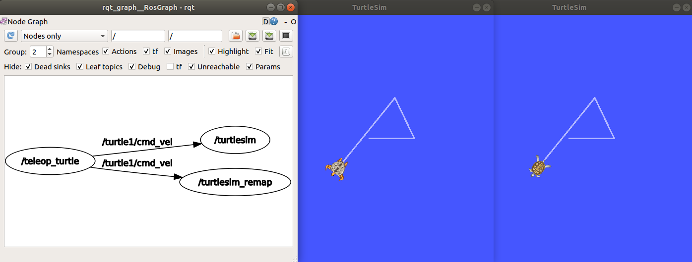
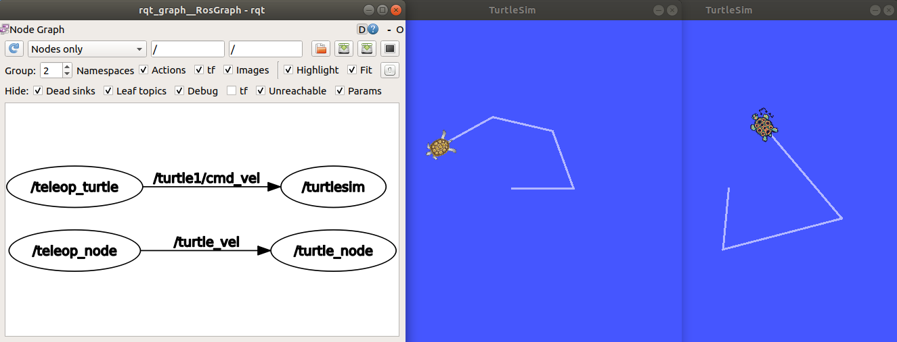
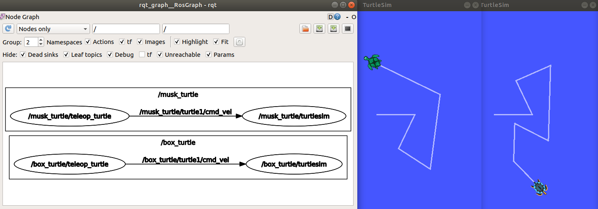
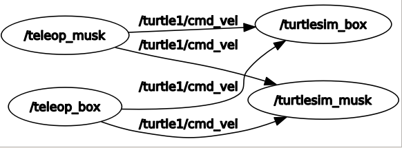
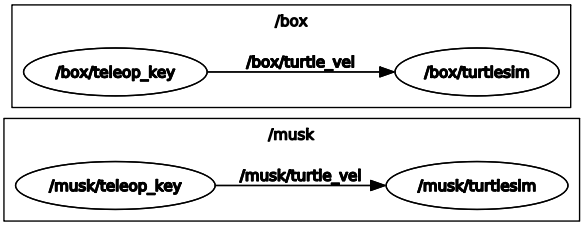

# Name Remapping

ROS의 모든 구성 요소(노드, 토픽, 서비스, 파라미터) 등은 고유의 네임(Name)을 가진다. 예를 들어 각 노드는 고유의 네임을 가지기 때문에 같은 네임의 노드 두 개를 동시에 실행하지 못한다. 터틀심 패키지로 시험해보자.

```bash
$ roscore
# 새 탭
$ rosrun turtlesim turtlesim_node
# 새 탭
$ rosrun turtlesim turtle_teleop_key
# 거북이 조작 ...
# 새 탭
$ rosrun turtlesim turtlesim_node
```

마지막 명령어를 넣는 순간 기존 `turtlesim_node`는 종료되고 새로운 `turtlesim_node`가 실행되는 것을 볼 수 있다. 노드의 네임은 고유해야 하기 때문에 같은 네임으로 새로운 노드를 실행하면 기존 노드가 종료된다.   

**앞으로 roscore는 항상 켜있다고 생각하고 생략한다.**


## 1. Node Name Remapping

같은 노드를 여러 개 실행하려면 다른 네임으로 실행해야 한다. 노드의 기본 네임은 파이썬 코드에서 `rospy.init_node("<node_name>")`에서 결정하는데 다른 네임의 노드를 실행하기 위해 코드를 수정할 필요는 없다. 커맨드라인에서 네임을 재지정(remapping)하면 된다. `rosrun` 명령어 뒤에 `<old_name>:=<new_name>`형식으로 덧붙이면 노드나 토픽 네임을 재지정할 수 있다. 

먼저 위 명령어에서 `turtlesim_node`가 어떤 이름으로 실행됐는지 확인한다.

```bash
$ rosnode list
/rosout
/teleop_turtle
/turtlesim
```

> Note: rosrun 사용 방법은 rosrun \<패키지 이름> \<노드 실행 파일 이름> 이다. "노드 실행 파일 이름"과 "노드 네임"은 다르다는 것을 유의하자.

현재 네임은 `/turtlesim`이라는 것을 알 수 있다. 이 네임을 `turtlesim_remap`으로 수정하여 실행한다. 노드와 토픽 정보를 보기 위해 `rqt_graph`도 실행한다.

```bash
$ rosrun turtlesim turtlesim_node /turtlesim:=turtlesim_remap
# 새 탭
$ rqt_graph
# 새 탭
$ rosnode list
/rosout
/rqt_gui_py_node_11320
/teleop_turtle
/turtlesim
/turtlesim_remap
```

기존 `/turtlesim` 노드가 사라지지 않고 새로운 `turtlesim_node`가 실행됨을 볼 수 있다. `/teleop_turtle`에서 `turtle1/cmd_vel` 토픽을 발행하면 같은 토픽을 구독하는 `/turtlesim`과 `turtlesim_remap`에서 동시에 정보를 받아 똑같이 움직이게 된다.



노드의 네임을 바꾸기 위해 꼭 기본 네임을 알아야 하는 것은 아니다. `__name` 은 노드의 기본 네임을 대체할 수 있는 특수 키다. 아래 명령어로 `/turtlesim_name_key`를 새로 실행할 수 있다.

```bash
$ rosrun turtlesim turtlesim_node __name:=turtlesim_name_key
$ rosnode list
/rosout
/rqt_gui_py_node_11320
/teleop_turtle
/turtlesim
/turtlesim_name_key
/turtlesim_remap
```


## 2. Topic Name Remapping

토픽도 고유의 네임(Name)이 있고 토픽의 네임도 재지정이 가능하다. 재지정 방법도 노드 네임과 동일하다. 실행 중인 노드를 모두 종료 후 다시 `turtlesim_node`와 `turtle_teleop_key`를 실행하고 토픽 리스트를 확인해보자.

```bash
$ rosrun turtlesim turtlesim_node
# 새 탭
$ rosrun turtlesim turtle_teleop_key
# 새 탭
$ rostopic list
/rosout
/rosout_agg
/turtle1/cmd_vel
/turtle1/color_sensor
/turtle1/pose
```

저 토픽들 중에 거북이의 움직임을 제어하는 `/turtle1/cmd_vel` 토픽의 네임을 `turtle_vel`로 바꿔서 실행해보자. 기존 노드를 살려두기 위해 `turtlesim_node`와 `turtle_teleop_key`의 네임도 재지정한다.

```bash
$ rosrun turtlesim turtlesim_node /turtlesim:=turtle_node /turtle1/cmd_vel:=turtle_vel
# 새 탭
$ rosrun turtlesim turtle_teleop_key /teleop_turtle:=teleop_node /turtle1/cmd_vel:=turtle_vel
# 새 탭
$ rqt_graph
```

아래 그래프를 보면 이제 노드가 두 개씩 짝지어진 것을 볼 수 있다. 위쪽은 기본 rosrun을 실행한 결과다. 아래쪽은 노드와 토픽의 네임을 재지정한 결과다.




## 3. Namespace

2의 예시처럼 노드 네임과 노드에서 발행하거나 구독하는 토픽 네임을 동시에 바꾸고 싶을 때는 노드와 토픽의 네임을 각각 재지정하는 것 보다는 네임스페이스(Namespace)를 활용하는 것이 효과적이다. 네임스페이스는 노드나 토픽의 네임 앞에 동일한 접두사(prefix)를 덧붙여 네임이 겹치지 않도록한다. 예를 들어 `foo`라는 네임스페이스에서 `bar`라는 노드를 실행하면 그 노드의 네임은 `/foo/bar`가 된다. 서로 다른 네임스페이스의 노드나 토픽은 네임이 겹칠 위험이 없고 다른 네임스페이스와의 통신도 제한된다. 

2의 예시처럼 연결된 `turtlesim_node`와 `turtle_teleop_key` 쌍을 두 개 실행하는데 서로 다른 네임스페이스에서 실행해보자. 먼저 `box_turtle` 네임스페이스에서 실행한다.

```bash
$ rosrun turtlesim turtlesim_node __ns:=box_turtle
# 새 탭
$ rosrun turtlesim turtle_teleop_key __ns:=box_turtle

```

`musk_turtle` 네임스페이스에서도 실행하고 그래프를 확인한다.

```bash
# 새 탭
$ rosrun turtlesim turtlesim_node __ns:=musk_turtle
# 새 탭
$ rosrun turtlesim turtle_teleop_key __ns:=musk_turtle
# 새 탭
$ rqt_graph
```

그래프를 보면 노드와 토픽이 네임스페이스 안에 갖혀있고 그 내부의 노드와 토픽에는 네임스페이스 이름이 덧붙여져 있는 것을 볼 수 있다. 이렇게 하면 기존 노드나 토픽 네임을 신경쓰지 않고 쉽게 같은 시스템을 병렬로 실행할 수 있다.




## 4. Details of Remapping

앞선 예시들에서 네임 앞에 `/`가 붙어있는데 무슨 의미일까? 네임의 구조는 리눅스 디렉토리 구조를 생각하면 쉽게 이해할 수 있다. 리눅스에서 `/` 최상위 루트(root) 경로인 것처럼 네임에서는 `/`가 전역(global) 네임스페이스다. 따라서 모든 네임들의 절대 경로는 `/`로 시작하게 된다. `rosnode list`나 `rostopic list` 실행시 모든 네임 앞에 `/`가 붙는 이유다.  

네임스페이스를 만들게 되면 `/` 아래에 네임스페이스의 네임이 추가로 붙는다. 재지정을 할때 원래 네임은 절대 경로로 써줘야 한다. 그냥 `turtlesim:=turtle_node`은 효과가 없고 `/turtlesim:=turtle_node`처럼 앞에 `/`부터 시작해야 한다. 새로운 네임에는 `/`가 붙지 않으면 자동으로 전역 네임스페이스(`/`)에서 네임 경로를 시작한다.

**참고자료**: <http://wiki.ros.org/Remapping%20Arguments>  

**의문사항**

- C++로 만든 노드는 네임 재지정이 잘 되는데 파이썬 노드는 일부 안되는 점이 있다.
- 파이썬 노드에서 `<src_name>:=<dst_name>`으로 노드 네임 재지정이 되지 않고 `__name:=<dst_name>`은 작동한다.
- 파이썬 노드에서 토픽 네임과 네임스페이스(`__ns`)는 정상적으로 재지정이 된다.
- 원래 노드 네임 재지정시 꼭 절대 경로로 해야하는건 아닌데 현재는 절대 경로로만 작동한다.
- 토픽 네임은 절대 경로로 하지 않아도 재지정 가능하다. (재지정시 앞에 `/` 없어도 됨)


# Roslaunch

ROS로 제대로된 시스템을 구축하기 위해서는 여러개의 노드를 동시에 실행해야 하는데 매번 실행 할때마다 다수의 `rosrun`을 실행하는 것은 매우 번거롭다. 그래서  XML 형식으로 실행할 노드들을 적은 후 "*.launch" 확장자로 저장하여 `roslaunch` 명령어로 실행하면 다수의 노드를 한번에 실행할 수 있다. roslaunch 명령어 형식은 다음과 같다.

```
roslaunch <package_name> <launch_file> <arg_name>:=<arg_value>
```


## 1. launchers 패키지 생성

앞서 실행했던 두 쌍의 `turtlesim_node`와 `turtle_teleop_key`를 roslaunch를 이용해 실행하는 실습을 해본다. 먼저 launch 파일을 포함할 패키지를 생성한다.

```bash
$ cd ~/catkin_ws/src
$ catkin create pkg launchers
$ cd launchers
$ mkdir launch
$ gedit launch/double_turtle.launch
```

`turtlesim.launch` 파일을 다음과 같이 작성한다.

```xml
<launch>
    <node pkg="turtlesim" type="turtlesim_node" name="turtlesim_box"/>
    <node pkg="turtlesim" type="turtle_teleop_key" name="teleop_box"/>
    <node pkg="turtlesim" type="turtlesim_node" name="turtlesim_musk"/>
    <node pkg="turtlesim" type="turtle_teleop_key" name="teleop_musk"/>
</launch>
```

빌드 후 launch 파일을 실행해본다.

```bash
$ cd ~/catkin_ws
$ catkin build
$ source devel/setup.bash
$ roslaunch launchers double_turtle.launch
# 새 탭
$ rqt_graph
```



두 개의 `turtlesim_node`가 실행되서 두 개의 창이 뜨고 `turtle_teleop_key`도 두 개 실행되었는데 하나의 터미널에서 실행되서 잘 구분이 되진 않지만 그래프를 통해 노드를 확인할 수 있다.


## 2. launch tags

launch 파일을 이루는 여러 태그에 대해 알아보자.

### \<launch\>

launch 파일은 기본적으로 \<launch\> 태그로 시작하고 끝나야 한다.

```xml
<launch>
	...
</launch>
```

\<launch\> 태그 안에는 다양한 기능을 넣을 수 있다.

### \<node\>

노드를 실행하는 태그인데 다양한 속성을 넣을 수 있다.

```xml
	<node pkg="..." type="..." name="..." ns="..." args="..." />
```

- pkg: 패키지 이름 (필수)
- type: 노드 실행 파일 이름 (필수)
- name: 노드 네임 지정 (필수)
- ns: 네임스페이스 지정
- args: 노드 입력 파라미터

### \<remap\>

노드나 토픽의 네임을 바꿀 수 있는 태그다. `from` 속성의 이름을 `to` 속성 값으로 바꾼다.

```xml
	<remap from="src_name" to="dst_name"/>
```

### \<param>

ROS 마스터에 파라미터를 등록할 수 있는 태그다.

```xml
	<param name="..." type="..." value="..." />
```

- name: 파라미터 이름
- value: 파라미터 값
- type: 파라미터 데이터 타입 (optional), `str, int, double, bool, yaml` 중 하나 선택, 명시적으로 지정하지 않으면 자동으로 타입이 지정됨

### \<group>

여러 노드에 대해 한번에 네임스페이스를 지정할 수 있는 태그다. `ns` 속성으로 그룹 안의 네임스페이스를 지정한다.

```xml
	<group ns="name_space">
		<node pkg="..." type="..." name="..." args="..." />
        ...
	</group>
```

### \<args>

`args`는 launch 파일 내부에서 쓸 수 있는 인자를 만든다. 값은 바로 지정할 수도 있고 커맨드라인에서 지정할 수도 있다.

```xml
	<!값을 지정하지 않고 선언만, roslaunch 실행시 반드시 값을 입력해야 함>
	<args name="foo"/>
	<!기본 값을 지정하여 커맨드라인에서 입력하지 않으면 기본 값이 들어감>
	<args name="bar" default="default_value"/>
	<!값을 정해서 바꿀 수 없음>
	<args name="baz" value="fixed_value"/>
	<!arg 값을 ROS 파라미터 값으로 사용>
	<param name="goo" value="$(arg bar)"/>
	<!arg 값은 다른 태그 어디서나 활용 가능>
	<node pkg="..." type="..." name="..." args="$(arg baz)" />
```

- name: 인자의 이름
- default: 인자의 기본 값, 커맨드라인에서 바꿀 수 있다.
- value: 인자의 값, 커맨드라인에서 바꿀 수 없다.


## 3. Upgrade launch file

다양한 태그와 속성을 이용해서 위에서 만들었던 launch 파일을 다음과 같이 수정하여 `launchers/launch/turtlesim_upgraded.launch`로 저장한다.

```xml
<launch>
    <group ns="box">
        <remap from="/box/turtle1/cmd_vel" to="turtle_vel"/>
        <node pkg="turtlesim" type="turtlesim_node" name="turtlesim"/>
        <node pkg="turtlesim" type="turtle_teleop_key" name="teleop_key"/>
    </group>
    <group ns="musk">
        <remap from="/musk/turtle1/cmd_vel" to="turtle_vel"/>
        <node pkg="turtlesim" type="turtlesim_node" name="turtlesim"/>
        <node pkg="turtlesim" type="turtle_teleop_key" name="teleop_key"/>
    </group>
    <arg name="turtle_size" default="300"/>
    <param name="turtle_length" value="$(arg turtle_size)"/>
</launch>
```

커맨드라인에서 실행하고 파라미터와 그래프를 확인해본다.

```bash
$ roslaunch launchers turtle_upgraded.launch turtle_size:=200
# 새 탭
$ rosparam get /turtle_length
200
$ rqt_graph
```



launch 파일에서 한 일은 다음과 같다.

- `group` 태그를 이용해 "box"와 "musk" 두 개의 네임스페이스로 네임들을 나누었다.
- `remap` 태그를 이용해 토픽 네임을 "turtle1/cmd_vel"에서 "turtle_vel"로 바꿨다. `remap`은 `node`보다 앞에 와야 작동하며 네임스페이스 내부 경로로는 작동하지 않는다.
- `node` 태그를 이용해서 노드를 두 개씩 똑같이 실행했지만 네임스페이스가 달라서 겹치지 않았다.
- `arg` 태그를 이용해 "turtle_size"라는 인자를 만들었다.
- `param` 태그를 이용해 "turtle_length"라는 ROS 파라미터를 만들었다.

