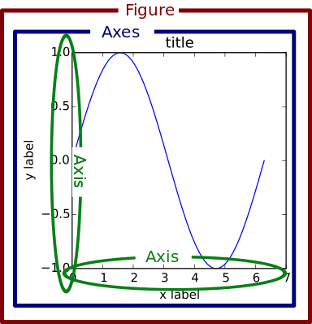
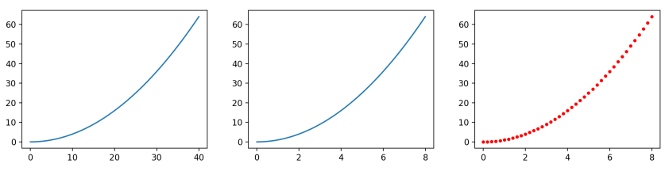
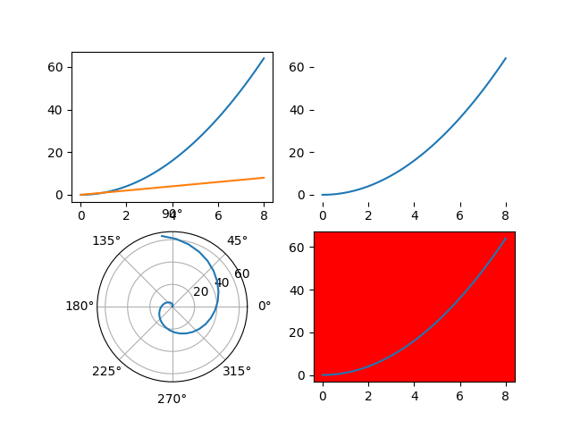
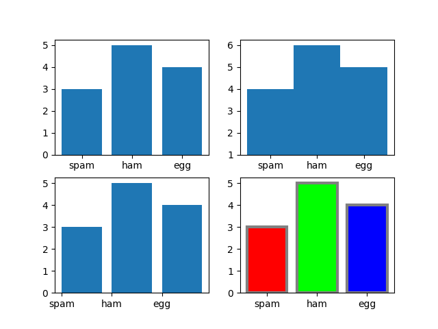
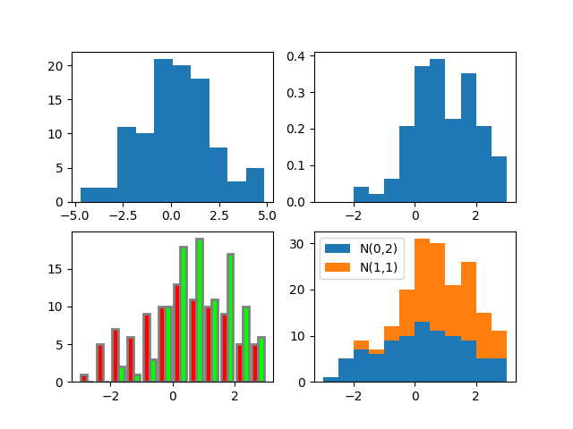
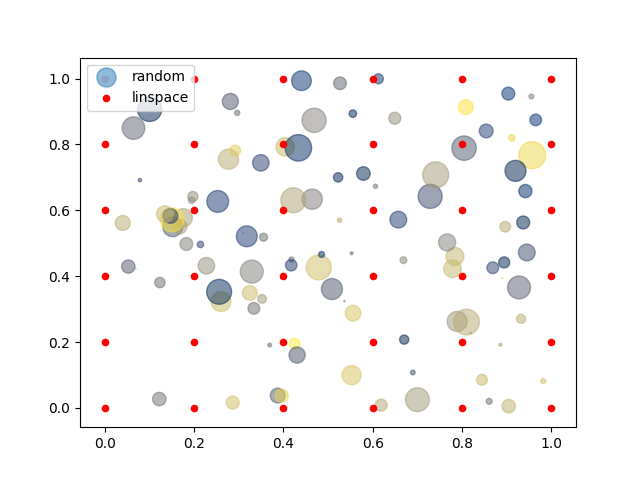
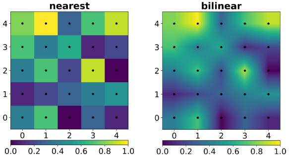
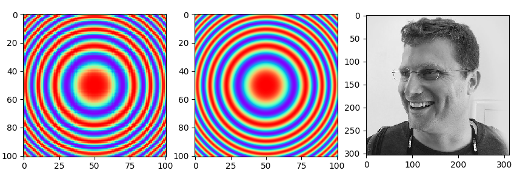
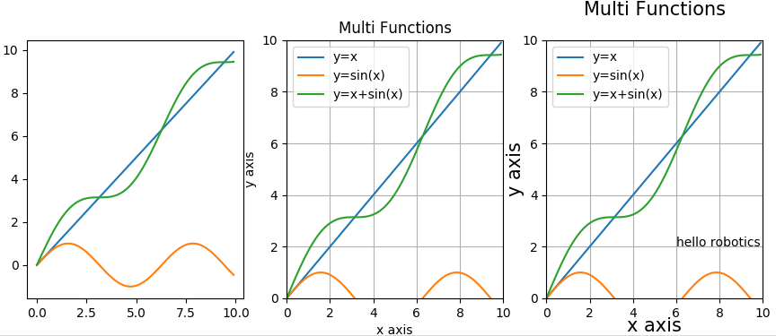

# Numpy

`numpy`는 배열 객체를 만들고 배열 연산을 할 수 있는 패키지다. `numpy`를 쓰면 `MATLAB`의 행렬 연산과 비슷한 기능을 한다. `numpy`의 다양한 기능과 세부적인 용법은 책 한권 분량이기 때문에 여기서는 기초적인 내용만 다룬다. `numpy`에 관한 내용은 [이곳](http://taewan.kim/post/numpy_cheat_sheet/)을 참고해서 만들었다. 이곳에 더 자세한 내용이 있으니 들어가서 공부해보길 바란다.

## 1. Array vs Matrix

MATLAB과 numpy의 가장 큰 차이는 기본 데이터 형식이 MATLAB은 **행렬(matrix)**이고 numpy는 **배열(array)**이라는 것이다. 그럼 행렬과 배열은 무엇이 다른가? 똑같이 `A=[1 2; 3 4]`라는 배열과 행렬이 있을 때 `A*A`를 하면 MATLAB에서는 `[7 10; 15 22]`가 나오고 numpy에서는 `[1 4; 9 16]`이 나온다. MATLAB은 행렬의 곱셈을 한 것이고 numpy는 배열의 같은 위치의 원소끼리 곱셈을 한 것이다. 행렬은 수학적인 matrix를 의미하는 것이고 배열은 프로그래밍에서 같은 종류의 데이터 여러 개를 모아놓은 것이다. 물론 MATLAB에서도 배열 연산이 가능하고 numpy에서도 행렬 연산이 가능하지만 기본 데이터 형식이 다르다는 것을 알아두어야 한다.

## 2. Array Creation

배열을 생성하는 가장 기본적인 방법은 리스트를 이용하는 것이다. 다중 리스트를 이용하면 다차원 배열도 만들 수 있다. `np.array()` 함수에 list를 넣으면 되는데 `dtype`이란 입력인자로 데이터 타입도 정할 수 있다.

```python
import numpy as np
array1d = [1, 2, 3, 4]
array2d = [[1, 2], [3, 4]]
array3d = [[[1, 2], [3, 4]], [[5, 6], [7, 8]]]
print("array1d", np.array(array1d, dtype=int))
print("array2d\n", np.array(array2d, dtype=float))
print("array3d\n", np.array(array3d))
```

> array1d [1 2 3 4]  
> array2d [[1. 2.] [3. 4.]]  
> array3d [[[1 2]  [3 4]] [[5 6]  [7 8]]]  

`np.zeros(), np.ones(), np.identity(), np.eye()`는 0이나 1로 채워진 배열을 원하는 크기로 만드는 함수다. 일정 간격의 숫자를 만들때는 `np.linspace()`나 `np.arange()`를 쓰는데 `np.linspace()`는 숫자 개수를 기준으로, `np.arange()`는 간격을 기준으로 배열을 만든다. `np.permutation(n)`은 `[0, n)` 범위의 정수를 랜덤하게 섞은 배열을 생성해준다. 

```python
print("ones((2, 4))\n", np.ones((2, 4)))
print("zeros((3, 2))\n", np.zeros((3, 2)))
print("identity(3)\n", np.identity(3))
print("eye(3)\n", np.eye(3))
print("linspace(5, 10, 11):", np.linspace(5, 10, 11))
print("arange(5, 10, 0.5):", np.arange(5, 10, 0.5))
print("permutation(10):\n", np.random.permutation(10))
```

> ones((2, 4))  
>  [[1. 1. 1. 1.]  
>  [1. 1. 1. 1.]]  
> zeros((3, 2))  
>  [[0. 0.]  
>  [0. 0.]  
>  [0. 0.]]  
> identity(3)  
>  [[1. 0. 0.]  
>  [0. 1. 0.]  
>  [0. 0. 1.]]  
> eye(3)  
>  [[1. 0. 0.]  
>  [0. 1. 0.]  
>  [0. 0. 1.]]  
> linspace(5, 10, 11): [ 5.   5.5  6.   6.5  7.   7.5  8.   8.5  9.   9.5 10. ]  
> arange(5, 10, 0.5): [5.  5.5 6.  6.5 7.  7.5 8.  8.5 9.  9.5]  
> permutation(10): [7 3 9 0 5 8 4 6 1 2]  

`np.linspace()`와 `np.arange()`로 비슷한 배열을 만들었는데 `np.linspace()`는 범위가 `[5, 10]`이고 `np.arange`는 `[5, 10)`이라서 마지막 10이 안 들어간다는 것에 유의하자.  

난수로 배열을 생성하는 것도 가능하다. `np.random` 아래의 함수들을 사용한다.

- np.random.rand(d0, d1, ..., dn): 입력한 크기의 난수배열 생성. 값은 [0, 1) 사이의 값을 uniform sampling 한다.
- np.random.randn(d0, d1, ..., dn): 입력한 크기의 난수배열 생성. 값은 평균 0, 표준편차 1의 정규분포로부터 표본추출한다.
- np.random.randint(low, high, size): 입력한 크기의 정수 난수배열 생성. `[low, high)` 사이의 정수를 랜덤생성하여 `size`의 크기의 배열을 만든다.

```python
np.set_printoptions(precision=5)
print("uniform over [0, 1)\n", np.random.rand(3, 4))
print("normal by N(0, 1)\n", np.random.randn(3, 4))
print("random int over [0, 5)\n", np.random.randint(0, 5, size=(2, 3)))
```

> uniform over [0, 1)  
>  [[0.91393 0.85865 0.61936 0.58212]  
>  [0.28647 0.51623 0.22979 0.98041]  
>  [0.59227 0.97546 0.12851 0.91155]]  
> normal by N(0, 1)  
>  [[ 0.10321  0.93799  2.14548  0.25712]  
>  [-1.15454 -0.76393 -0.14389  0.51151]  
>  [ 0.4485   0.22908  0.04046  0.33101]]  
> random int over [0, 5)  
>  [[3 0 0]  
>  [2 2 4]]  

## 3. Array Shape

배열에서 `np.ndarray.shape` 변수는 각 차원의 크기 정보를 튜플로 가지고 있다. 전체 차원수는  `np.ndarray.ndim` 으로 확인할 수 있다.

```python
foo = np.ones((3, 4, 2))
print("foo.shape:", foo.shape)
print("foo.ndim:", foo.ndim)
```

> foo.shape: (3, 4, 2)  
> foo.ndim: 3  

배열을 다루다 보면 shape을 바꾸고 싶을 때가 있다. 1차원 벡터를 2차원 배열로 바꾼다던지 3차원 배열을 1차원 벡터로 늘여서 표현한다던지 등의 경우가 있다. 이럴때는 `np.ndarray.reshape()`이라는 함수를 쓰면 된다. 아래 예시에서 어떻게 이런 결과가 나오는지 헷갈릴 수 있지만 데이터를 한 줄로 쭉 펴놓고 배열 모양에 순서대로 하나씩 넣는다고 생각하면 이해가 된다.

```python
foo = np.arange(0, 6)
print("foo", foo)
print("foo (2,3)\n", foo.reshape(2, 3))
foo3d = foo.reshape(2, 3, 1)
print("foo (2,3,1)\n", foo3d)
print("foo (3,2)\n", foo3d.reshape(3, 2))
print("foo (3,2)\n", foo3d.reshape(2, 3))
```

> foo [0 1 2 3 4 5]  
> foo (2,3)  
>  [[0 1 2]  
>  [3 4 5]]  
> foo3d (2,3,1)  
>  [[[0]  [1]  [2]]  
>  [[3]  [4]  [5]]]  
> foo3d (3,2)  
>  [[0 1]  
>  [2 3]  
>  [4 5]]  
> foo (3,2)  
>  [[0 1]  
>  [2 3]  
>  [4 5]]


## 4. Array Indexing, Slicing

다차원 `numpy` 배열에서 특정 데이터 값이나 일부 배열을 가져오는 방법은 리스트와 비슷하다. 다차원 배열을 인덱싱, 슬라이싱 할 때는 하나의 `[d0, d1, ...]`안에 모든 인덱스를 넣는다. 기존에 MATLAB을 써본 사람은 배열에서 인덱스를 정할 때 n번째 인덱스가 가로축인지 세로축인지 깊이축인지 헷갈릴 수 있다. 그럴때는 다차원 리스트 안에 들어있는 값에 접근할 때를 생각해보면 된다. 가장 바깥쪽 리스트가 `d0`에 해당하고 점점 안으로 들어갈 수록 `d1, d2, ...`가 되는 것이다. 가로축, 세로축을 기준으로 생각하면 헷갈리니 개념을 잘 잡아야 한다. 다음 예제를 보면서 익혀보자.

```python
data_list = [[[1, 2, 3], [4, 5, 6]], [[7, 8, 9], [10, 11, 12]]]
print("data_list = ", data_list)
print("data_list[0] =", data_list[0])
print("data_list[0][1] =", data_list[0][1])
print("data_list[0][1][2] =", data_list[0][1][2])
data_np = np.array(data_list)
print("data_np =\n", data_np)
print("data_np[0] =\n", data_np[0])
print("data_np[0, 1] =", data_np[0, 1])
print("data_np[0, 1, 2] =", data_np[0, 1, 2])
```

> data_list =  [[[1, 2, 3], [4, 5, 6]], [[7, 8, 9], [10, 11, 12]]]  
> data_list[0] = [[1, 2, 3], [4, 5, 6]]  
> data_list\[0][1] = [4, 5, 6]  
> data_list\[0]\[1][2] = 6  
> data_np =  
>  [[[ 1  2  3]  
>   [ 4  5  6]]  
>  [[ 7  8  9]  
>   [10 11 12]]]  
> data_np[0] =  
>  [[1 2 3]  
>  [4 5 6]]  
> data_np[0, 1] = [4 5 6]  
> data_np[0, 1, 2] = 6  

인덱싱 하는 순서는 다차원 리스트와 같고 인덱스를 여러 괄호에 따로 쓰느나 한 괄호에 쓰느냐의 차이만 있다. 슬라이싱에서는 더 큰 차이가 있는데 다차원 리스트는 다차원 슬라이싱을 할 수 없지만 `numpy` 배열에서는 가능하다. 

```python
print("\ndata: shape={}\n{}".format(data.shape,  data))
print("1) data[0, :, :]: shape={}\n{}".format(data[0, :, :].shape, data[0, :, :]))
print("2) data[:, :, 1]: shape={}\n{}".format(data[:, :, 1].shape, data[:, :, 1]))
print("3) data[0, :, 1:]: shape={}\n{}".format(data[0, :, 1:].shape, data[0, :, 1:]))
print("4) data[0, 1, :]: shape={}\n{}".format(data[0, 1, :].shape, data[0, 1, :]))
print("5) data[0, 1:, :]: shape={}\n{}".format(data[0, 1:, :].shape, data[0, 1:, :]))
print("6) data[:1, 1:, :]: shape={}\n{}".format(data[:1, 1:, :].shape, data[:1, 1:, :]))
```

> 1) array[0, :, :]: shape=(2, 3)  
> [[1 2 3]  
>  [4 5 6]]  
> 2) array[:, :, 1]: shape=(2, 2)  
> [[ 2  5]  
>  [ 8 11]]  
> 3) array[0, :, 1:]: shape=(2, 2)  
> [[2 3]  
>  [5 6]]  
> 4) array[0, 1, :]: shape=(3,)  
> [4 5 6]  
> 5) array[0, 1:, :]: shape=(1, 3)  
> [[4 5 6]]  
> 6) array[:1, 1:, :]: shape=(1, 1, 3)  
> [[[4 5 6]]]  

- 1)은 첫번째 차원은 인덱싱을 하고 나머지에선 전체 슬라이싱을 하여 결과가 2차원 배열로 나와야 하고 `data_np`에서 위쪽 배열이 출력된다. 
- 2)에서는 반대로 세번째 차원을 인덱싱하고 나머지에서 전체 슬라이싱을 했는데  `data_np`의 가장 안쪽 리스트의 가운데 숫자들이 나옴을 볼 수 있다. 
- 3)에서는 마지막 차원을 슬라이싱하여 결과가 2x2로 나온다.
- 4)에서는 두 차원을 인덱싱하여 1차원 배열이 나왔고 `data_list[0][1]`과 같은거라서 `[3, 4, 9]`가 나온다. 인덱싱을 한 첫번째 두 개의 차원은 사라지고 슬라이싱한 마지막 차원만 배열로 나타난다.
- 5)에서 나오는 숫자들은 4)와 같지만 `d1`에서 인덱싱이 아닌 슬라이싱을 했기 때문에 길이 1인 차원이 하나 더 생겼다. 리스트에서 인덱싱하면 값이 나오고 슬라이싱하면 리스트가 나온다는 것을 상기하자. 슬라이싱을 하면 크기와 관계없이 그 차원은 배열로 남고 인덱싱을 하면 그 차원은 값만 남기고 사라진다.
- 6)은 모든 차원을 슬라이싱 했기 때문에 3차원 배열이 된다.

## 5. Array Operations

배열 사이의 연산은 단순히 원소 사이의 연산으로 치환된다. 아래 예시에서 operator와 그에 해당하는 함수도 봐두자.

```python
print("\nmatrix operations")
foo = np.array([[9, 3, 2], [1, 3, 9], [1, 6, 8]])
bar = np.array([[1, 4, 2], [3, 3, 4], [2, 1, 3]])
print("foo\n", foo)
print("bar\n", bar)
print("foo + bar\n", foo + bar, "\n", np.add(foo, bar))
print("foo - bar\n", foo - bar, "\n", np.subtract(foo, bar))
print("foo * bar\n", foo * bar, "\n", np.multiply(foo, bar))
print("foo / bar\n", foo / bar, "\n", np.divide(foo, bar))
print("foo ** bar\n", foo ** bar, "\n", np.power(foo, bar))
print("foo // bar\n", foo // bar, "\n", np.floor_divide(foo, bar))
print("foo % bar\n", foo % bar, "\n", np.remainder(foo, bar))
print("foo x bar\n", foo @ bar, "\n", np.dot(foo, bar))
print("foo.T (transpose)\n", foo.T)
```

`np.dot` 함수는 배열이 아닌 dot product로 행렬의 곱하기를 계산하는 함수다. 배열에 `.T`를 붙이면 transpose 된 배열이 나온다. 배열에서 특정 조건을 만족하는 숫자들을 뽑아내고 싶을 때는 `True, False (TF)` 배열을 이용한 인덱싱도 가능하다.

```python
print("\ncomparison operators")
print("foo > bar\n", foo > bar)
print("greater\n", np.greater(foo, bar))
print("foo[foo > bar]:", foo[foo > bar])
print("foo > bar\n", foo <= bar)
print("less_equal\n", np.less_equal(foo, bar))
print("foo[foo > bar]:", foo[foo <= bar])
print("foo[foo >= 5]:", foo[foo >= 5])
print("foo[bar < 3]:", foo[bar < 3])
print("foo[foo % 2 == 0]:", foo[foo % 2 == 0])
```

> foo > bar  
>  [[ True False False]  
>  [False False  True]  
>  [False  True  True]]  
> foo[foo > bar]: [9 9 6 8]  
> foo > bar  
>  [[False  True  True]  
>  [ True  True False]  
>  [ True False False]]  
> foo[foo > bar]: [3 2 1 3 1]  
> foo[foo >= 5]: [9 9 6 8]  
> foo[bar < 3]: [9 2 1 6]  
> foo[foo % 2 == 0]: [2 6 8]  

`foo > bar`를 프린트해보면 각각의 원소에 대해서 비교 연산을 한 TF 배열이 나온다. 이 TF 배열을 인덱스처럼 넣으면 `True`에 해당하는 원소들만 1차원 배열로 나오게 된다. 

## 6. Math Functions

`numpy`는 `sin, cos, tan, exp, log, sqrt` 등의 기본적인 수학함수들도 제공한다. 배열에 적용하면 배열의 모든 원소에 대해 각각 계산한 결과가 나온다.

```python
print("\nbasic math functions")
np.set_printoptions(precision=4, suppress=True)
foo = np.random.rand(5)
print("foo", foo)
print("np.sin(foo):", np.sin(foo))
print("np.cos(foo):", np.cos(foo))
print("sin^2 + cos^2 = 1:", np.sin(foo)**2 + np.cos(foo)**2)
print("np.exp(foo):", np.exp(foo))
print("np.log(foo):", np.log(foo))
print("np.log(exp(foo))==foo", np.log(np.exp(foo)))
print("np.sqrt(foo):", np.sqrt(foo))
print("np.sqrt(foo)^2==foo:", np.sqrt(foo)*np.sqrt(foo))
```

그 외에 필요하다고 생각되는 함수는 대부분 다 제공한다. `mean, max, min, std, sum`등의 통계적인 함수도 있는데 이들 함수는 집계 함수(aggregate function)이라고 해서 여러 숫자에 대한 통계를 내기 때문에 어떤 축을 기준으로 평균 등을 계산하느냐에 따라서 결과가 달라진다. `axis=None`이면 모든 숫자에 대해 계산하고 `axis=0`이면 첫 번째 축의 값에 대해 계산후 첫 번째 차원을 없앤다. `axis=1`이면 두 번째 축의 값에 대해 계산후 두 번째 차원을 없앤다. 다음 예시를 보면서 이해해보자.

```python
print("\naggregate functions")
rgen = np.random.RandomState(2)
foo = rgen.rand(2, 4)
print("data:", foo)
print("1) mean over all:", np.mean(foo))
print("2) mean over axis 0:", np.mean(foo, axis=0))
print("3) mean over axis 1:", np.mean(foo, axis=1))
```

> data: [[0.43599 0.02593 0.54966 0.43532]  
>  [0.42037 0.33033 0.20465 0.61927]]  
> 1) mean over all: 0.3776910284933438  
> 2) mean over axis 0: [0.42818 0.17813 0.37716 0.5273 ]  
> 3) mean over axis 1: [0.36173 0.39366]  

1)은 foo의 모든 숫자에 대해 평균을 계산한 것이다. 2)는 세로줄의 평균을 구해서 4개의 숫자가 나왔다. 3)은 가로줄의 평균을 구해서 2개의 결과가 나왔다. 이러한 차원의 방향을 생각하며 아래 예시들도 이해해보자.

```python
print("sum", np.sum(foo, axis=0))
print("min", np.min(foo, axis=1))
print("max", np.max(foo, axis=0))
print("std", np.std(foo, axis=1))
```

> sum [0.85636 0.35626 0.75431 1.05459]  
> min [0.02593 0.20465]  
> max [0.43599 0.33033 0.54966 0.61927]  
> std [0.19938 0.15112]  

## 7. Iterate by for

`numpy` 배열에 대해서도 for문을 돌 수 있는데 단순히 첫 번째 차원(d0)에 대해 순서대로 인덱싱한 결과가 나온다고 보면 된다. 다음 예시에서 인덱싱한 결과와 배열을 for문에 바로 넣은 결과가 같은 것을 볼 수 있다.

```python
for i in range(len(foo)):
    print("row", i, foo[i])
for row in foo:
    print("row", row)
for row in foo:
    for value in row:
        print("v:", value)
```


## 연습문제

`np.mean`과 똑같이 작동하는 `find_mean(array, axis=None)` 함수를 구현하세요. 배열에 대해 for loop을 돌면서 주어진 axis에 대해 indexing 하여 평균으로 합칠 값들을 추출하고 평균을 계산하세요.


# Matplotlib

matplotlib은 파이썬에서 그래프를 그릴 수 있게 해주는 패키지다. 다양한 형태의 그래프와 사진을 화면에 보여줄 수 있기 때문에 데이터 시각화를 위해 필수적인 패키지다. 이름에서도 알 수 있듯 매트랩(MATLAB)의 `plot` 함수와 사용방법이 유사하여 매트랩 사용자라면 쉽게 적응할 수 있다.  

## 1. 함수형 vs 객체형

matplotlib은 크게 두 가지 스타일로 사용할 수 있다. 하나는 매트랩처럼 전역 함수를 이용한 방식이고 다른 하나는 객체를 이용한 방식이다.

- 함수형: `matplotlib.pyplot` 패키지 아래의 전역 함수들을 사용하여 그림을 그린다. 사용방법이 객체형에 비해 간단하다.
- 객체형: 화면을 이루는 구성요소를 객체로 보고 객체의 메소드를 통해 해당 화면 요소의 상태를 변경한다. 함수형에 비해 조금 복잡하지만 객체 지향 프로그래밍에 더 어울리고 더 세부적인 부분까지 제어할 수 있다.

두 가지 코딩 스타일을 비교해보자.

```python
import matplotlib.pyplot as plt
import numpy as np

matlab_style = 0
x = np.linspace(0, 10, 21)
y1 = x
y2 = x ** 2
y3 = x ** 3 / 3

if matlab_style:
    # functional API
    plt.plot(x, y1, label='linear')
    plt.plot(x, y2, label='quadratic')
    plt.plot(x, y3, label='cubic')
    plt.xlabel('x axis')
    plt.ylabel('y axis')
    plt.title('MATLAB style plt')
    plt.legend()
    plt.show()
else:
    # object oriented API
    fig, ax = plt.subplots(1, 1)
    ax.plot(x, y1, label='linear')
    ax.plot(x, y2, label='quadratic')
    ax.plot(x, y3, label='cubic')
    ax.set_xlabel('x axis')
    ax.set_ylabel('y axis')
    ax.set_title('Object style plt')
    plt.legend()
    plt.show()
```

함수형 API를 보면 모든 함수가 `plt (matplolib.pyplot)`로부터 시작한다. 함수 하나하나가 그래프의 "상태"에 영향을 미치지만 정작 그 상태를 나타내는 변수는 숨겨져있다. 패키지 내부의 전역 변수로 숨겨둔 것이다.  

반면 객체형 API는 상태를 나타내는 객체를 외부로 노출하고 그 객체의 메소드를 통해서 상태를 변경한다. 위 예시에서 `ax`는 `matplotlib.axes.Axes`라는 클래스 객체다. `Axes`는 그림이나 그래프를 그릴 수 있는 단위 공간이라고 보면 된다. 2차원 그래프는 2개의 축(2 axes)을 가지고 있기 때문에 `Axes`라 이름 지었고 그 내부에  각각의 축은 `Axis`라는 클래스로 이루어져있다. 그래프를 그리고 그래프에 제목이나 축 레이블을 붙이는 대부분의 일들이 `ax` 를 통해 일어난다.  

`ax`와 함께 만들어진 `fig`는 `matplotlib.figure.Figure` 클래스 객체다. `Figure`는 화면에 뜬 창(window)을 의미한다. `Figure` 객체는 내부에 칸을 나눠서 여러 개의 `Axes` 객체를 가질 수 있다.



이처럼 객체형 API는 사용자가 Figure에 대해 더 깊이 이해하게 하고 구성요소를 객체로 분해해 프로그래밍의 자유도를 높여주지만 처음 보는 사람에게는 난해하게 보일 수 있다. 반면에 함수형 API는 내부의 구현을 숨기고 단순하게 사용하도록 만들어져있다.  

어느쪽을 선택하든 같은 결과를 만들어낼 수 있지만 단순히 몇 가지 데이터를 화면에 띄우는 정도는 함수형이 낫고 지속적으로 변화하는 객체의 상태를 갱신하면서 보여주는 복잡한 프로그램에는 객체형이 낫다고 할 수 있다. 여기서는 주로 함수형 API를 기반으로 설명한다.


## 2. Plotting Functions

`matplotlib.pyplot`에는 다양한 형태의 그래프를 그릴 수 있는 함수들이 있다. 여기서는 `matplotlib.pyplot`을 줄여서 `plt`로만 표기한다.

### 2.1 plot

> plt.plot(x, y, fmt, ...)  
>
> <https://matplotlib.org/3.1.1/api/_as_gen/matplotlib.pyplot.plot.html>

일반적인 그래프를 그릴 수 있는 가장 많이 쓰이는 함수다. 많은 입력 인자가 있지만 보통 세 가지를 많이 쓴다.

- x: 2차원 데이터의 x축 좌표를 나타낸다. `list`나 `np.array` 등의 형식으로 입력할 수 있다.
- y: 2차원 데이터의 y축 좌표를 나타내고 `x`와 같은 형식의 데이터를 받는다. `x`를 입력하지 않으면 첫 번째 인자를 `y`로 인식한다.
- fmt: 그래프의 모양이나 색상을 지정한다. '\[marker]\[line]\[color]' 혹은 '\[color]\[marker]\[line]' 형식의 string으로 입력한다. 각 요소는 모두 생략 가능하며 생략시 기본 스타일로 지정된다. 다음은 `fmt`에 따른 그래프 스타일 예시다. 자세한 내용은 공식 문서(위 링크)에서 확인할 수 있다.
  - `'b'`    : blue markers with default shape
  - `'or'`   : red circles
  - `'-g'`   : green solid line
  - `'--'`    : dashed line with default color
  - `'^k:'`  : black triangle_up markers connected by a dotted line

입력 인자 중 `y`만 필수 인자고 나머지는 선택 인자다. 다음 예시를 그려보자.

```python
import matplotlib.pyplot as plt
import numpy as np

x = np.linspace(0, 8, 41)
y = x ** 2
plt.plot(y)
plt.show()
plt.plot(x, y)
plt.show()
plt.plot(x, y, 'r.')
plt.show()
```

아래 그림은 세 번의 plot 결과를 모은 것이다. 첫 번째와 두 번째 그래프는 같아보이지만 x 축의 범위가 다르다.  

1. 첫 번째 plot은 y값만 넣었기 때문에 x축은 y값의 개수만큼 [0, 40] 사이의 정수들이 자동으로 들어갔다.  

2. 두 번째 plot은 x, y 모두 입력했기 때문에 x에 해당하는 위치에 y값이 그려져서 [0, 8] 사이에 그래프가 그려졌다.  

3. 세 번째 plot은 x, y, fmt 까지 입력했기 때문에 그래프 모양이 빨간 점으로 변했다. `'r.'`에서 'r'은 red, '.'은 선이 아닌 점으로 표시하라는 뜻이다.




### 2.2 subplot

> ax = plt.subplot(nrows, ncols, index, ...)  
> ax = plt.subplot(pos, ...)  
> ax = plt.subplot(ax, ...)   
> <https://matplotlib.org/api/_as_gen/matplotlib.pyplot.subplot.html>

`subplot` 자체는 그림을 그리는 함수는 아니지만 Figure 화면을 분할해서 하나의 창에 여러 그래프를 그릴 수 있게 해준다. 주의할 점은 `subplots`라는 비슷한 이름의 함수도 있는데 `subplot`과 `subplots`는 전혀 다른 함수다. `subplot`은 함수형 API에서 주로 사용되며 **현재** 사용할 칸을 선택한다. `plt.plot()` 함수를 실행하면 `plt.subplot()`에서 선택한 칸에 그래프가 그려진다. 반면 `plt.subplots()`는 객체형 API를 위해 사용되며 전체 창을 관리하는 `Figure` 객체와 분할된 각각의 칸을 관리하는 `Axes` 객체를 반환한다. 사용 방식에 따른 주요 입력 인자는 다음과 같다.

- nrows, ncols, index: 창을 몇 행 몇 열로 나눌지, 그 중에 몇 번째 칸을 선택할지를 입력한다. 예를 들어 `plt.subplot(3, 2, 4)`를 실행하면 3행 2열의 칸들 중 4번째(오른쪽 가운데)가 선택된다.
- pos: 위의 (nrows, ncols, index) 세 개의 정수를 하나의 숫자로 합친 세 자리 정수를 입력한다. `plt.subplot(3, 2, 4)`는 `plt.subplot(324)`와 같다.
- ax: `Axes` 객체로 `plt.subplot()` 함수를 실행하면 리턴되는 객체다. 이를 `subplot`의 입력으로 넣으면 입력한 `ax` 칸이 활성화된다.

```python
import matplotlib.pyplot as plt
import numpy as np

x = np.linspace(0, 8, 41)
y = x ** 2
# subplot을 실행하는 두 가지 동일한 방법, 2x2로 나눠진 창에서 첫 번째 칸 선택
plt.subplot(221)
ax1 = plt.subplot(2, 2, 1)
# subplot 선택 후 plot 하면 선택한 곳에 그래프 그려짐
plt.plot(x, y)
# 2번째 칸의 외곽선 없앰
ax2 = plt.subplot(222, frameon=False)
# 3번째 칸을 원형 좌표계로 설정
plt.subplot(223, projection='polar')
plt.plot(x, y)
# 4번째 칸의 배경색을 빨간색으로 지정
plt.subplot(224, facecolor='red')
plt.plot(x, y)
plt.show()
# 2번째 칸을 다시 선택하고 그래프를 그림
plt.subplot(ax2)
plt.plot(x, y)
# 1번째 칸에 그래프를 추가로 그림
ax1.plot(x, x)
# 그래프 화면에 표시
plt.show()
```




### 2.3 bar

> plt.bar(x, height, width=0.8, bottom=None, *, align='center', ...)  
>
> <https://matplotlib.org/api/_as_gen/matplotlib.pyplot.bar.html>

`bar`는 막대 그래프를 그리는 함수다.

- x: 막대가 그려질 x축 좌표일 수도 있고 혹은 각 막대 아래 붙을 문자열 레이블을 입력할 수도 있다.
- height: 막대의 높이 (y축 좌표)
- bottom: 막대의 y축 시작점
- width: 막대의 너비, 1이면 꽉차서 옆 막대랑 붙게됨
- align: x축 위치에 막대를 가운데 정렬할지 왼쪽 정렬할지에 따라 "center", "left" 둘 중 선택

```python
import matplotlib.pyplot as plt
import numpy as np

x = ['spam', 'ham', 'egg']
y = [3, 5, 4]
# 1. 기본 bar 그림
plt.subplot(221)
plt.bar(x, y)
# 2. 막대 너비를 늘리고 y축 기본값을 1로 설정
plt.subplot(222)
plt.bar(x, y, width=1, bottom=1)
# 3. x축 좌표에 막대의 왼쪽 끝 정렬
plt.subplot(223)
plt.bar(x, y, align='edge')
# 4. 막대 색은 각각 (red,green,blue), 외곽선은 녹색, 외곽선 두께는 3
plt.subplot(224)
plt.bar(x, y, color=((1,0,0),(0,1,0),(0,0,1)), edgecolor=(0.5,0.5,0.5), linewidth=3)
plt.show()
```




### 2.4 hist

> plt.hist(x, bins=None, range=None, density=None, weights=None, cumulative=False, bottom=None, histtype='bar', align='mid', orientation='vertical', rwidth=None, log=False, color=None, label=None, ...)  
> <https://matplotlib.org/api/_as_gen/matplotlib.pyplot.hist.html>

히스토그램(histogram)을 계산하고 그래프까지 그리는 함수다. 주요 입력 인자는 다음과 같다.

- x: 빈도수를 계산할 입력 데이터, 보통 하나의 숫자열이지만 여러 숫자열을 묶은 리스트나 배열을 입력하면 여러 히스토그램을 동시에 계산하고 그린다.
- bins: int or number sequence, 정수형 숫자 하나만 입력하면 입력 데이터의 최소 최대값 범위를 `bins` 개수 만큼 나눠서 히스토그램을 계산한다. `bins`가 숫자열이면 i번째 칸은 `[bins[i], bins[i+1])`의 범위를 가지고 마지막 칸만 `[bins[i], bins[i+1]]`으로 마지막 숫자를 포함한다.
- range: bins가 정수 숫자일 때만 유효한 인자로 입력 데이터의 전체 범위를 지정하고 그 안에서 `bins`만큼 칸을 나누어 히스토그램을 계산한다.
- density: `bool`형 타입으로 `True`면 히스토그램 전체 합이 1이 되게 한다.
- cumulative: `bool`형 타입으로 `True`면 오른쪽으로 갈수록 히스토램을 누적하여 보여준다.
- histtype: 기본 값 'bar'는 일반적인 막대 그래프 모양이고 `x`에 여러 데이터가 들어오면 구간마다 여러 히스토그램 막대를 옆으로 늘어놓는다. 'barstacked'를 입력하면 여러 데이터가 들어왔을 때 구간 별 히스토그램들을 상하로 쌓아서 보여준다.

```python
import matplotlib.pyplot as plt
import numpy as np

np.set_printoptions(precision=3)
# 두 개의 정규분포 난수 생성, 1열은 N(0,2), 2열은 N(1,1)의 분포
x = np.random.randn(100, 2)
x[:, 0] = x[:, 0] * 2
x[:, 1] = x[:, 1] + 1
bins = np.arange(-3, 3.5, 0.5)
# 기본 히스토그램, 계산한 빈도수와 경계값 출력 
plt.subplot(221)
n, edges, patches = plt.hist(x[:, 0], 10)
print("histogram counts:", n)
print("histogram edges:", edges)
# bin의 범위를 직접 지정하고 전체 합이 1인 밀도를 출력
plt.subplot(222)
plt.hist(x[:, 1], bins, density=True)
# 여러 데이터에 대한 히스토그램 동시 출력, 막대색, 막대 외곽선 색, 막대 외곽선 두께 지정
plt.subplot(223)
plt.hist(x, bins, color=((1,0,0),(0,1,0)), edgecolor=(0.5,0.5,0.5), linewidth=2)
# 여러 데이터를 상하로 쌓아서 출력하고 데이터마다 레이블 붙임
plt.subplot(224)
plt.hist(x, bins, histtype='barstacked', label=("N(0,2)", "N(1,1)"))
# legend()를 실행해야 레이블이 보임
plt.legend()
plt.show()
```

다음은 예제의 텍스트 출력과 Figure다.

> histogram counts: [ 3.  8. 13. 14. 18. 15. 14.  7.  6.  2.]  
> histogram edges: [-4.448 -3.497 -2.546 -1.594 -0.643  0.308  1.26   2.211  3.162  4.113  5.065]




### 2.5 scatter

> plt.scatter(x, y, s=None, c=None, marker=None, cmap=None, norm=None, vmin=None, vmax=None, alpha=None, linewidths=None, verts=None, edgecolors=None, ...)  
> <https://matplotlib.org/api/_as_gen/matplotlib.pyplot.scatter.html>

2차원 데이터를 평면상에 점으로 표현하여 데이터 분포를 보여주는 함수다. 단순히 점의 밀집도 뿐만 아니라 점의 크기와 색상까지 지정할 수 있어서 다양한 표현이 가능하다. 주요 입력 인자는 다음과 같다.

- x, y: 2차원 데이터 위치

- s: 마커의 크기인데 특이하게 마커의 반지름이 s에 비례하는 것이 아니라 $$\sqrt s$$에 비례한다. 만약 2의 반지름을 주고 싶다면 4를 입력해야 한다.

- c: 마커의 색상을 지정하는데 하나만 넣어 마커의 색을 동일하게 표시하던지 각 (x, y) 데이터 쌍에 대한 색을 리스트나 배열로 하나씩 입력할 수 있다. 색상은 'red' 같은 단어로 입력하거나 '(1,0,0)' 같은 숫자로 입력하거나 color map의 인덱스로 입력할 수 있다.

- marker: 마커의 모양을 결정한다. 마커 모양은 다음 목록 중 하나를 선택할 수 있다.
  
  > markers = {'.': 'point', ',': 'pixel', 'o': 'circle', 'v': 'triangle_down', '^': 'triangle_up', '<': 'triangle_left', '>': 'triangle_right', '1': 'tri_down', '2': 'tri_up', '3': 'tri_left', '4': 'tri_right', '8': 'octagon', 's': 'square', 'p': 'pentagon', '*': 'star', 'h': 'hexagon1', 'H': 'hexagon2', '+': 'plus', 'x': 'x', 'D': 'diamond', 'd': 'thin_diamond', '\|': 'vline', '_': 'hline', 'P': 'plus_filled', 'X': 'x_filled', 0: 'tickleft', 1: 'tickright', 2: 'tickup', 3: 'tickdown', 4: 'caretleft', 5: 'caretright', 6: 'caretup', 7: 'caretdown', 8: 'caretleftbase', 9: 'caretrightbase', 10: 'caretupbase', 11: 'caretdownbase', 'None': 'nothing', None: 'nothing', ' ': 'nothing', '': 'nothing'}
  
- cmap: colormap을 선택한다. colormap은 실수(float)를 입력하면 그에 해당하는 (r,g,b) 값을 반환한다. `c` 인자에 실수 배열이 들어가면 colormap에 따라 마커의 색상을 지정한다.
  
  - colormap 종류: <https://matplotlib.org/3.1.1/tutorials/colors/colormaps.html>
  
- alpha: 불투명도를 결정한다. 0은 투명 1은 불투명이다.

```python
import matplotlib.pyplot as plt
import numpy as np

# 랜덤한 위치에 랜덤한 색상과 크기로 표시, colormap 지정
x = np.random.rand(100)
y = np.random.rand(100)
colors = np.random.rand(100)
scale = (np.random.rand(100) * 20) ** 2
plt.scatter(x, y, s=scale, c=colors, alpha=0.5, cmap='cividis')
# 등간격으로 빨간점 표시
x, y = np.meshgrid(np.linspace(0, 1, 6), np.linspace(0, 1, 6))
plt.scatter(x, y, s=20, c='red', alpha=1)
plt.show()
```




### 2.6 imshow

> plt.imshow(X, cmap=None, aspect=None, interpolation=None, alpha=None, vmin=None, vmax=None, ...)   
> <https://matplotlib.org/api/_as_gen/matplotlib.pyplot.imshow.html?highlight=imshow#matplotlib.pyplot.imshow>

이미지를 보여주는 함수다. 주요 입력 인자는 다음과 같다.

- X: 입력 이미지로 다음 세 가지 모양(shape) 중 하나를 가질 수 있다.

  - (M, N): 임의의 실수 값을 가지며 colormap에 의해 색상이 정해진다.
  - (M, N, 3): RGB 이미지, 0~1 사이의 실수 값이나 0~255 사이의 정수 값을 가져야 한다.
  - (M, N, 4): RGBA 이미지, 불투명도를 의미하는 A가 추가됨, 0~1 사이의 실수 값이나 0~255 사이의 정수 값을 가져야 한다.

- cmap: colormap을 지정하는 인자인데 `matplotlib.cm` 내부의 colormap 객체나 colormap의 이름(str)으로 지정할 수 있다. 0~1 사이의 X 값에 따라 정해진 색을 출력하며 X가 RGB 이미지인 경우에는 사용되지 않는다.

- aspect: 화면비를 결정하는 인자다. 실수 값을 넣으면 한 픽셀의 가로 세로 비율을 정해준다. 'auto'를 입력하면 창 크기에 따라 자동 조절되고 'equal'은 화면비를 1로 고정한다.

- interpolation: `X` 배열의 값이 보통 화면 상의 픽셀과 1:1 mapping이 되진 않기 때문에 여러 픽셀에 중간쯤 걸쳐있거나 배열의 여러 값이 한 픽셀에 들어가기도 한다. 화면의 한 픽셀에 여러 값이 걸쳐있을 때 이를 어떻게 처리할지를 `interpolation` 옵션을 통해 결정한다. interpolation을 적용하면 불연속적인 이미지가 부드럽게 연결된다.

  - 'nearest': 기본 값이며 가장 가까운 배열 값을 지정한다.

  - 'bilinear': 픽셀 주변의 4개의 값과의 거리에 반비례하도록 4개의 값을 섞는다.

  - 이 외에도 다양하게 있지만 그다지 필요하진 않다. 아래 그림은 interpolation 예시다. 검은 점이 `X` 값의 중심을 나타낸다. 5x5 배열을 수백 픽셀에 걸쳐 표현하였는데 'nearest'는 단순히 가까운 값으로 연결해서 불연속적이고 'bilinear'는 중심 픽셀(검은점)만 원래 값이고 나머지는 선형보간된 값을 보여준다.

    

- alpha: 0~1 사이의 이미지의 불투명도를 나타낸다.
- vmin, vmax: 설정하지 않으면 자동으로 `X`의 최대 최소 값을 0~1로 mapping하여 colormap에서 값에 해당하는 색을 보여주는데 `vmin, vmax`를 설정하면 이 범위를 0~1로 mapping하여 색을 지정한다.

```python
import matplotlib.pyplot as plt
import numpy as np

# 등간격 2차원 좌표 만들기
np.set_printoptions(precision=2)
x, y = np.meshgrid(np.linspace(-10, 10, 101), np.linspace(-10, 10, 101))
z = (x**2 + y**2) / 5
wave = np.cos(z)
# -1~1 실수 값을 colormap으로 표현
plt.subplot(131)
plt.imshow(wave, cmap='rainbow')
# bilinear interpolation으로 부드럽게 표현
plt.subplot(132)
plt.imshow(wave, cmap='rainbow', interpolation='bilinear')
plt.subplot(133)
# 이미지 파일 읽고 보여주기
image = plt.imread("resources/keenan-wyrobek.png")
plt.imshow(image)
plt.show()
```




## 3. Auxiliary Functions

matplotlib에는 그래프를 그리는 것 뿐만 아니라 제목, 축 레이블, 텍스트 표시 등 다양한 부가 기능이 있다. 대부분 기능과 입력인자가 간단하므로 빠르게 훑어보자.

`title()`은 그래프의 제목을 지정한다.

> plt.title(label, fontdict=None, loc='center', pad=None, ...)
>
> - label: 그래프 제목
> - fontdict: 글꼴 지정, 기본값={'fontsize': rcParams['axes.titlesize'], 'fontweight' : rcParams['axes.titleweight'], 'verticalalignment': 'baseline', 'horizontalalignment': loc}
> - loc: 제목의 위치 {'center', 'left', 'right'} 중 하나 선택
> - pad: 그래프로부터의 거리

`xlabel(), ylabel()`은 x 축, y 축에 축 제목을 붙인다.

> plt.xlabel(xlabel, fontdict=None, labelpad=None, ...), plt.ylabel(ylabel, ...)
>
> - xlabel, ylabel: x 축, y 축 제목
> - fontdict: 글꼴 지정, 상세 내용 title() 참조
> - labelpad: 그래프로부터의 거리

`xlim(), ylim()`은 x 축, y 축에 범위를 지정한다.

> plt.xlim(*args) 은 여러가지 사용 방법이 있다. (ylim()도 동일) 
>
> left, right = xlim()  # return the current xlim  
> xlim((left, right))   # set the xlim to left, right  
> xlim(left, right)     # set the xlim to left, right  
> xlim(right=3)  # adjust the right leaving left unchanged  
> xlim(left=1)  # adjust the left leaving right unchanged   

`grid()`는 화면에 점선을 표시한다.

> plt.grid(b=None, which='major', axis='both', ...)
>
> - b: bool 타입으로 on/off를 결정한다. `None`이면 상태를 토글(toggle)한다.
> - which: 점선을 그릴 tick의 단위를 {'major', 'minor', 'both'} 중에 선택한다.
> - axis: 점선을 그릴 축 방향을 {'both', 'x', 'y'} 중에 선택한다.

`text()`는 그래프 위에 텍스트를 표시한다.

> plt.text(x, y, s, fontdict=None, ...)
>
> - x, y: 텍스트 시작 위치
> - s: 텍스트 내용
> - fontdict: 글꼴 지정, 상세 내용 title() 참조

`legend()`는 하나의 Axes에 여러 그래프가 그려졌을 때 각 그래프의 모양, 색상과 레이블을 함께 보여줘서 각 그래프의 의미를 알 수 있게 해준다.

> plt.legend()

`show()`는 그림을 화면에 띄운다. 기본 값인 non-interactive mode에서는 그림을 닫을 때까지 이 함수에서 멈춰있는다.

> plt.show()
>
> - block : `True`면 그림 창을 닫을 때까지 대기하고 `False`면 대기하지 않고 지나간다.

다음은 보조 함수를 이용해 그래프를 그리는 예시다.

```python
import matplotlib.pyplot as plt
import numpy as np

x = np.arange(0, 10, 0.1)
y1 = x
y2 = np.sin(x)
y3 = x + np.sin(x)

# 기본 설정으로 그래프만 그림
plt.subplot(131)
plt.plot(x, y1)
plt.plot(x, y2)
plt.plot(x, y3)
# 주변 설정 추가: 제목, 축 제목, 축 범위, 범례 표시
plt.subplot(132)
plt.plot(x, y1, label="y=x")
plt.plot(x, y2, label="y=cos(x)")
plt.plot(x, y3, label="y=x+cos(x)")
plt.title('Multi Functions')
plt.xlabel('x axis')
plt.ylabel('y axis')
plt.xlim(0, 10)
plt.ylim(0, 10)
plt.grid(True)
plt.legend()
# 세부 설정 추가: 제목, 축 제목 크기 지정 / 텍스트 추가
plt.subplot(133)
plt.plot(x, y1, label="y=x")
plt.plot(x, y2, label="y=cos(x)")
plt.plot(x, y3, label="y=x+cos(x)")
plt.text(6, 2, 'hello robotics')
plt.title('Multi Functions', fontdict={'fontsize': 15}, pad=20)
plt.xlabel('x axis', fontdict={'fontsize': 15}, labelpad=-2)
plt.ylabel('y axis', fontdict={'fontsize': 15}, labelpad=-2)
plt.xlim(0, 10)
plt.ylim(0, 10)
plt.grid(True)
plt.legend()
plt.show()
```



