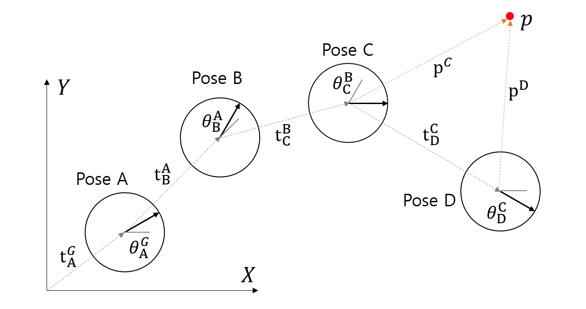

# Implement 2-D Rigid Transformation

이론적으로 배운 2차원 좌표계 변환을 실습을 통해 확인한다. 행렬 연산이 필요하므로 numpy를 사용하고 이를 그림으로 보여줄 수 있도록 matplotlib을 사용한다. 다음 그림의 네 개의 포즈(pose)들이 각각의 좌표계를 가지고 있을 때 네 가지 문제를 풀어볼 것이다.

1. 연결된 포즈들 사이의 상대 포즈를 알 때, 모든 포즈의 전역 포즈(global pose) 계산
2. 모든 포즈의 전역 포즈(global pose)를 알 때, 특정 포즈(e.g. Pose B)를 기준으로 다른 포즈들의 상대 포즈 계산
4. 점 $$\mathbf{p}$$의 전역 좌표와 모든 포즈의 전역 포즈(global pose)를 알 때, 각 포즈에서 발견한 점 $$\mathbf{p}$$의 상대 좌표 계산
4. 각 포즈에서 발견한 점 $$\mathbf{p}$$의 좌표와 모든 포즈의 전역 포즈(global pose)를 알 때 점 $$\mathbf{p}$$의 전역 좌표 계산




## 1. Pose Transformations

우선 각 Pose에 해당하는 변환 행렬 $$T^A_B = \begin{bmatrix} R^A_B & \mathbf{t}^A_B \\ 
\mathbf{0} & 1 \end{bmatrix}$$ 을 계산하는 1, 2번 문제부터 풀어보자. 파이참에서 프로젝트를 열고 `transform`이라는 내부 디렉토리를 만들고 그 안에 다음 파일들을 만들자.

### main.py

프로그래밍을 할 때 항상 메인을 먼저 작성하고 메인에 필요한 함수나 클래스들을 그 다음에 구현하도록 하자. 필요한 클래스와 메소드는 있다고 생각하고 일단 생각나는대로 쓴다. 처음부터 아래 코드처럼 완전하게 만들순 없지만 코드의 대략적인 흐름과 입출력 형식을 정해놓고 클래스와 메소드를 구현하는 것이 좋다.  

문제를 분석해보니 포즈를 나타내는 데이터와 포즈 연산을 하는 메소드가 긴밀하게 연결될 것 같다. 이런 경우에는 클래스를 쓰는 것이 적절하며 그래서 `Pose2D`라는 클래스를 만들기로 했다. 그리고 계산된 포즈를 matplotlib을 통해서 그림을 그려주는 함수도 필요할 것으로 보인다.

```python
import numpy as np
from transform.pose2d import Pose2D
from transform.pose_plotter import plot_poses

def main():
    relative_poses = [Pose2D(1, 1, np.pi/6), Pose2D(3, 1, np.pi/6),
                      Pose2D(2, -2, -np.pi/3), Pose2D(2, -1, -np.pi/6)]
    global_point = np.array([8, 6])

    # 1. 연결된 포즈들 사이의 상대 포즈를 알 때, 모든 포즈의 전역 포즈(global pose) 계산
    # 첫 번째만 절대 포즈(전역 좌표계), 나머지는 직전 포즈 기준 상대 포즈(움직임)
    global_poses = []
    cur_pose = Pose2D()
    for rel_pose, index in zip(relative_poses, ['A', 'B', 'C', 'D']):
        # 상대 포즈를 누적해서 전역 포즈 계산
        cur_pose = cur_pose.move(rel_pose)
        global_poses.append(cur_pose)
        print(f"global pose {index}: {cur_pose}")

    # 전역 좌표계에서의 포즈들과 점 그리기
    plot_poses(global_poses, 121)
    plot_point(global_point, 121)  

    # 2. 모든 포즈의 전역 포즈를 알 때, 특정 포즈를 기준으로 다른 포즈들의 상대 포즈 계산
    # 중간 포즈를 새로운 기준 좌표계로 사용
    ref_pose = global_poses[1]
    print("reference pose:", ref_pose)
    local_poses = []
    for glo_pose, index in zip(global_poses, ['A', 'B', 'C', 'D']):
        # 기준 좌표계에서 다른 포즈의 상대 포즈 계산
        loc_pose = ref_pose.motion_to(glo_pose)
        local_poses.append(loc_pose)
        print(f"local pose {index}: {loc_pose}")

    # 기준 좌표계에서의 포즈들 그리기
    plot_poses(local_poses, 122, show=True)

if __name__ == "__main__":
    main()
```

위 코드에서 `relative_poses`는 직전 포즈에서 바라본 다음 포즈를 나타낸 것이다. 예를 들어 전역 좌표계에서는 Pose A가 위치 (1,1)에 각도 $$\pi/6$$ 만큼 기울어 보이고, Pose B는 Pose A에서 보기에 위치 (3,1)에 각도 $$\pi/6$$만큼 기울어 보이는 것이다. 이를 변환 행렬로 표기하면 다음과 같다.
$$
rel\_poses=\left[T^G_A, T^A_B, T^B_C, T^C_D\right]
$$

### pose2d.py

main.py코드를 보면 `Pose2D` 클래스에는 다음과 같은 기능들이 필요하다.

1. 생성자: $$(x,y,\theta)$$ 를 통해 포즈 상태를 초기화

2. move(): 전역 좌표계에서 본 Pose A($$T^G_A$$, `cur_pose`)와 Pose A에서 보는 Pose B($$T^A_B$$, `rel_pose`)를 통해 전역 Pose B ($$T^G_B$$)를 계산

   ```
   cur_pose = cur_pose.move(rel_pose)
   ```

3. motion_to(): 주어진 전역 좌표계에서의 Pose A($$T^G_A$$, `ref_pose`)와 Pose B($$T^G_B$$, `abs_pose`)로부터 둘 사이의 상대 포즈를 계산

   ```
   loc_pose = ref_pose.motion_to(glo_pose)
   ```

이를 구현한 코드는 다음과 같다.

```python
import numpy as np

class Pose2D:
    def __init__(self, x=0, y=0, theta=0, tmat=None):
        if tmat is None:
            self.tmatrix = np.array([[np.cos(theta), -np.sin(theta), x],
                                     [np.sin(theta), np.cos(theta), y],
                                     [0, 0, 1]])
            np.set_printoptions(precision=4, suppress=True)
            print(f"create pose: \n{self.tmatrix}")
        else:
            self.tmatrix = tmat

    def __str__(self):
        x, y, theta = self.get_params()
        return f"x={x:.3f}, y={y:.3f}, theta={theta:.4f}"

    def get_params(self):
        x, y = self.tmatrix[:2, 2]
        cosine, sine = self.tmatrix[:2, 0]
        theta = np.arctan2(sine, cosine)
        return x, y, theta

    def move(self, rel_pose):
        moved_tmat = np.dot(self.tmatrix, rel_pose.tmatrix)
        moved_pose = Pose2D(tmat=moved_tmat)
        return moved_pose

    def motion_to(self, other_pose):
        rel_tmat = np.dot(np.linalg.inv(self.tmatrix), other_pose.tmatrix)
        rel_pose = Pose2D(tmat=rel_tmat)
        return rel_pose
```

생성자 함수에서는 4개의 파라미터를 받아 두 가지 방식으로 내부 상태를 초기화 하도록 했다. `x, y, theta`를 이용해 초기화 하는 방법과 변환 행렬 `tmat` 직접 입력하는 방법이다. 결과적으로는 포즈를 나타내는 변환 행렬 `self.tmatrix`을 저장한다.

```python
    def __init__(self, x=0, y=0, theta=0, tmat=None):
        if tmat is None:
            self.tmatrix = np.array([[np.cos(theta), -np.sin(theta), x],
                                     [np.sin(theta), np.cos(theta), y],
                                     [0, 0, 1]])
            np.set_printoptions(precision=4, suppress=True)
            print(f"create pose: \n{self.tmatrix}")
        else:
            self.tmatrix = tmat
```

출력은 다음과 같다.

> create pose:   
> [[ 0.866 -0.5    1.   ]  
>  [ 0.5    0.866  1.   ]  
>  [ 0.     0.     1.   ]]  
> create pose:   
> [[ 0.866 -0.5    3.   ]  
>  [ 0.5    0.866  1.   ]  
>  [ 0.     0.     1.   ]]  
> create pose:   
> [[ 0.5    0.866  2.   ]  
>  [-0.866  0.5   -2.   ]  
>  [ 0.     0.     1.   ]]  
> create pose:   
> [[ 0.866  0.5    2.   ]  
>  [-0.5    0.866 -1.   ]  
>  [ 0.     0.     1.   ]]  

#### 전역 포즈 계산

`move()` 함수에서는 상대 포즈를 통해 전역 포즈를 계산한다. 이를 위해 주어진 것과 구할 것을 정리하면 다음과 같다.

- input1: 전역 좌표계에서 본 Pose A == A 좌표계의 점을 전역으로 변환하는 변환 행렬 $$T^G_A$$
- input2: A 좌표계에서 본 Pose B == B 좌표계의 점을 A 좌표계로 변환하는 변환 행렬 $$T^A_B$$
- output: 전역 좌표계에서 본 Pose B == B 좌표계의 점을 전역으로 변환하는 변환 행렬 $$T^G_B$$

주어진 정보를 이용해서 B 좌표계의 점을 전역 좌표계로 변환하려면 먼저 점을 A 좌표계로 변환한 후 A에서 전역 좌표계로 변환해야 한다. 이를 수식으로 표현하면 다음과 같다.
$$
\mathbf{p}^G = T^G_A \mathbf{p}^A = T^G_A T^A_B \mathbf{p}^B
$$
따라서 B 좌표계의 점을 한번에 전역 좌표계로 변환하기 위해서는 두 단계의 변환 행렬을 곱한 하나의 행렬을 구하면 된다.
$$
T^G_B = T^G_A T^A_B
$$
변환 행렬끼리 곱할 때 행렬의 순서에 유의해야 한다. 행렬의 순서는 좌표를 변환하는 논리적인 순서를 따르면 된다.  

`move()` 함수에서는 `self`가 Pose A고 `rel_pose`가 A에서 본 B의 포즈기 때문에 구현은 다음과 같다.

```python
    def move(self, rel_pose):
        moved_tmat = np.dot(self.tmatrix, rel_pose.tmatrix)
        moved_pose = Pose2D(tmat=moved_tmat)
        return moved_pose
```

main.py에서 아래와 같은 루프를 돌면 `absolute_poses`에 Pose A~D의 전역 포즈가 저장된다.

```python
    global_poses = []
    cur_pose = Pose2D()
    for rel_pose, index in zip(relative_poses, ['A', 'B', 'C', 'D']):
        cur_pose = cur_pose.move(rel_pose)
        global_poses.append(cur_pose)
        print(f"global pose {index}: {cur_pose}")
```

$$
absolute\_poses=\left[T^G_A, T^G_B, T^G_C, T^G_D\right]
$$

출력은 다음과 같다.

> global pose A: x=1.000, y=1.000, theta=0.5236  
> global pose B: x=3.098, y=3.366, theta=1.0472  
> global pose C: x=5.830, y=4.098, theta=0.0000  
> global pose D: x=7.830, y=3.098, theta=-0.5236  

#### 상대 포즈 계산

`motion_to()` 함수에서는 두 개의 전역 포즈 사이의 상대 포즈를 구한다. 이를 위해 주어진 것과 구할 것을 정리하면 다음과 같다.

- input1: 전역 좌표계에서 본 Pose A == A 좌표계의 점을 전역으로 변환하는 변환 행렬 $$T^G_A$$
- input2: 전역 좌표계에서 본 Pose B == B 좌표계의 점을 전역으로 변환하는 변환 행렬 $$T^G_B$$
- output: A 좌표계에서 본 Pose B == B 좌표계의 점을 A 좌표계로 변환하는 변환 행렬 $$T^A_B$$

`move()` 함수와 비교하면 input2와 output이 뒤바뀌었음을 알 수 있다. 주어진 정보를 이용해서 B 좌표계의 점을 A 좌표계로 변환하려면 먼저 점을 전역 좌표계로 변환한 후 전역에서 A 좌표계로 변환해야 한다. 이를 수식으로 표현하면 다음과 같다.
$$
\mathbf{p}^A = T^A_G \mathbf{p}^G = T^A_G T^G_B \mathbf{p}^B
$$
그런데 문제에서 주어진 것은 A에서 전역 좌표계로 변환하는 행렬($$T^G_A$$)이지 전역에서 A 좌표계로 변환하는 행렬($$T^A_G$$)이 아니다. 두 행렬을 서로 정반대의 변환을 하고 있으므로 서로 역행렬 관계여야 한다.
$$
T^A_G T^G_A = I, \quad T^A_G = (T^G_A)^{-1}
$$
따라서 B 좌표계의 점을 한번에 A 좌표계로 변환하기 위해서는 변환과 역변환 두 단계를 거쳐야 한다.
$$
T^A_B = T^A_G T^G_B = (T^G_A)^{-1} T^G_B
$$
여기서 주의할 점은

- 행렬의 곱셈 순서 뿐만 아니라 어느쪽 행렬의 역행렬을 구해야 하는지를 잘 따져서 계산해야 한다.
- 둘 사이의 상대 포즈를 구할 수 있는 이유는 주어진 포즈가 모두 G 좌표계를 기준으로 표현되었기 때문이다. Pose A는 G 좌표계 기준이고 Pose B는 C 좌표계에서 계산되었다면 A와 B 사이의 상대 포즈를 구할 수 없다.

`motion_to()` 함수에서는 `self`가 Pose A고 `abs_pose`가 Pose B기 때문에 구현은 다음과 같다.

```python
    def motion_to(self, other_pose):
        rel_tmat = np.dot(np.linalg.inv(self.tmatrix), other_pose.tmatrix)
        rel_pose = Pose2D(tmat=rel_tmat)
        return rel_pose
```

행렬의 역행렬을 `np.linalg.inv()` 함수를 통해 구할 수 있다. main.py에서 아래와 같은 루프를 돌면 `local_poses`에 B 좌표계에서 바라본 A~D의 상대 포즈가 저장된다.

```python
    ref_pose = global_poses[1]
    local_poses = []
    for glo_pose, index in zip(global_poses, ['A', 'B', 'C', 'D']):
        loc_pose = ref_pose.motion_to(glo_pose)
        local_poses.append(loc_pose)
        print(f"local pose {index}: {loc_pose}")
```

$$
local\_poses=\left[T^B_A, T^B_B, T^B_C, T^B_D\right]
$$

출력은 다음과 같다.

> local pose A: x=-3.098, y=0.634, theta=-0.5236  
> local pose B: x=-0.000, y=0.000, theta=0.0000  
> local pose C: x=2.000, y=-2.000, theta=-1.0472  
> local pose D: x=2.134, y=-4.232, theta=-1.5708  

B에 대한 출력을 보면 B 좌표계에서 본 Pose B이기 때문에 위치와 각도가 모두 0이 나왔다.

### pose_plotter.py

계산한 포즈를 그림으로 그려 확인할 수 있는 모듈이다. 원과 화살표로 포즈를 표시할 수 있는 `draw_pose()` 함수를 구현하였다.

```python
import numpy as np
import matplotlib.pyplot as plt

def plot_poses(poses, subind, show=False):
    ax = plt.subplot(subind, adjustable='datalim', aspect='equal')
    xmin, xmax, ymin, ymax = (0, 0, 0, 0)
    for pose in poses:
        x, y, theta = pose.get_params()
        draw_pose(ax, x, y, theta)
        xmin = min(xmin, x)
        xmax = max(xmax, x)
        ymin = min(ymin, y)
        ymax = max(ymax, y)

    plt.plot([0, 0], [0, 1], 'r')
    plt.plot([0, 1], [0, 0], 'r')
    plt.xlim(np.round(xmin)-1, np.round(xmax)+1)
    plt.ylim(np.round(ymin)-1, np.round(ymax)+1)
    plt.grid(True)
    if show:
        plt.show()

def draw_pose(ax, x, y, theta):
    radius = 0.5
    circle = plt.Circle((x, y), radius, color='k', fill=False)
    ax.add_patch(circle)
    ax.arrow(x, y, radius*np.cos(theta), radius*np.sin(theta),
             width=0.1, head_length=0.2, length_includes_head=True)

def plot_point(point):
    plt.plot(point[0], point[1], 'ro')
```

여기까지 실행하여 그린 그림은 다음과 같다.


왼쪽은 모두 전역 좌표계에서 그린 것이고 두 번째는 Pose B의 좌표계를 중심으로 다시 그린 것이다. 포즈들 사이의 관계는 동일하지만 좌표계의 원점이 이동하고 좌표축이 회전되었다.


## 2. Point Transformations

이번에는 점의 좌표를 좌표계를 바꿔가며 계산할 것이다. 좌표계 변환식 $$\mathbf{p}^A = T^A_B \mathbf{p}^B$$을 기억하자.

### main.py

메인 함수에 3번 4번 관련 코드를 추가한다. 점의 전역 좌표가 주어졌을 때 각 포즈를 기준으로 점의 상대 좌표를 계산하고 이를 다시 전역 좌표로 변환하여 원래 좌표가 다시 나오는지를 확인한다.

```python
    # 3. 점의 전역 좌표가 주어졌을 때 Pose A~D를 기준으로 점의 상대 좌표 계산
    relative_coords = []
    for glo_pose, index in zip(global_poses, ['A', 'B', 'C', 'D']):
        # 전역 좌표를 상대 좌표로 변환
        rel_coords = glo_pose.inv_transform(global_point)
        relative_coords.append(rel_coords)
        print(f"relative coordinates in {index}: {rel_coords}")

    # 4. 각 포즈에서 본 점의 좌표 relative_coords를 전역 좌표로 변환
    global_coords = []
    for glo_pose, rel_coords, index in zip(global_poses, relative_coords, ['A', 'B', 'C', 'D']):
        # 상대 좌표를 전역 좌표로 변환
        glo_coords = glo_pose.transform(rel_coords)
        global_coords.append(glo_coords)
        print(f"global coordinates in {index}: {glo_coords[:2]}")
```

### pose2d.py

main.py에서 추가된 `Pose2D` 함수는 전역 좌표를 상대 좌표로 바꾸는 `inv_transform()` 함수와 다시 상대 좌표를 전역 좌표로 변환하는 `transform()` 함수다. 이 함수들은 아래와 같이 단순히 1을 덧붙여 동차 좌표를 만든 뒤 변환 행렬이나 역변환 행렬을 곱하여 구현할 수 있다.

```python
    def inv_transform(self, point):
        # to homogenous coordinates
        point = np.append(point[:2], 1)
        tfm_point = np.dot(np.linalg.inv(self.tmatrix), point)
        return tfm_point

    def transform(self, point):
        # to homogenous coordinates
        point = np.append(point[:2], 1)
        tfm_point = np.dot(self.tmatrix, point)
        return tfm_point
```

두 함수를 추가하고 main.py를 실행하면 다음과 같은 출력이 나온다.

> relative coordinates in A: [8.5622 0.8301 1.    ]  
> relative coordinates in B: [ 4.7321 -2.9282  1.    ]  
> relative coordinates in C: [2.1699 1.9019 1.    ]  
> relative coordinates in D: [-1.3038  2.5981  1.    ]  
> global coordinates in A: [8. 6.]  
> global coordinates in B: [8. 6.]  
> global coordinates in C: [8. 6.]  
> global coordinates in D: [8. 6.]  

상대 좌표는 포즈마다 다르게 나오지만 절대 좌표는 처음에 입력한 (8, 6) 그대로 나오는 것을 볼 수 있다.


