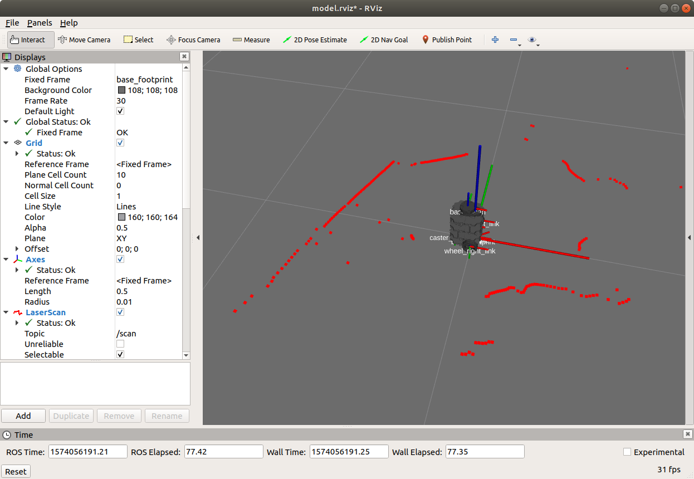
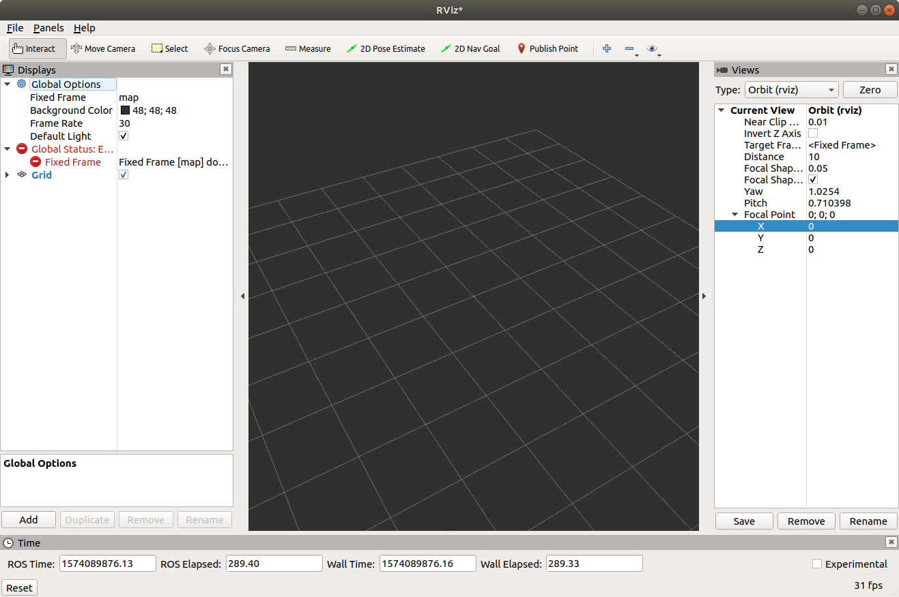
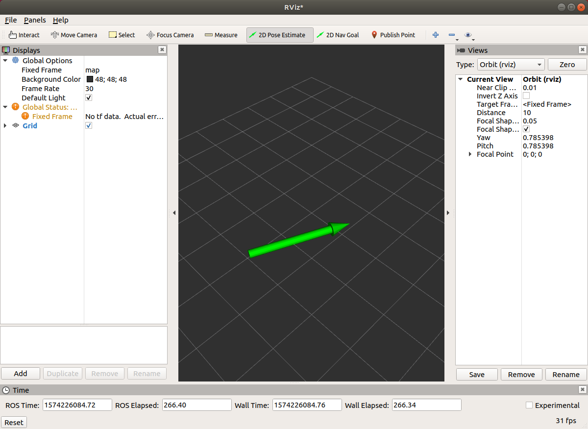
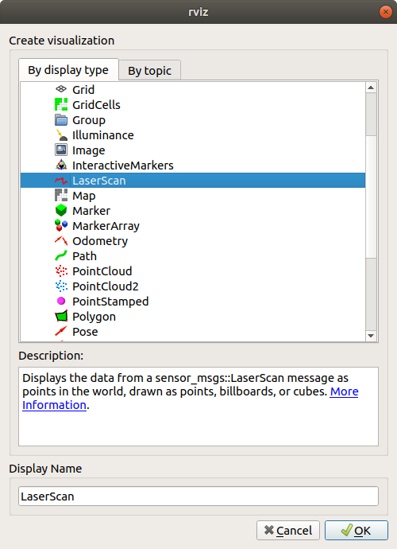
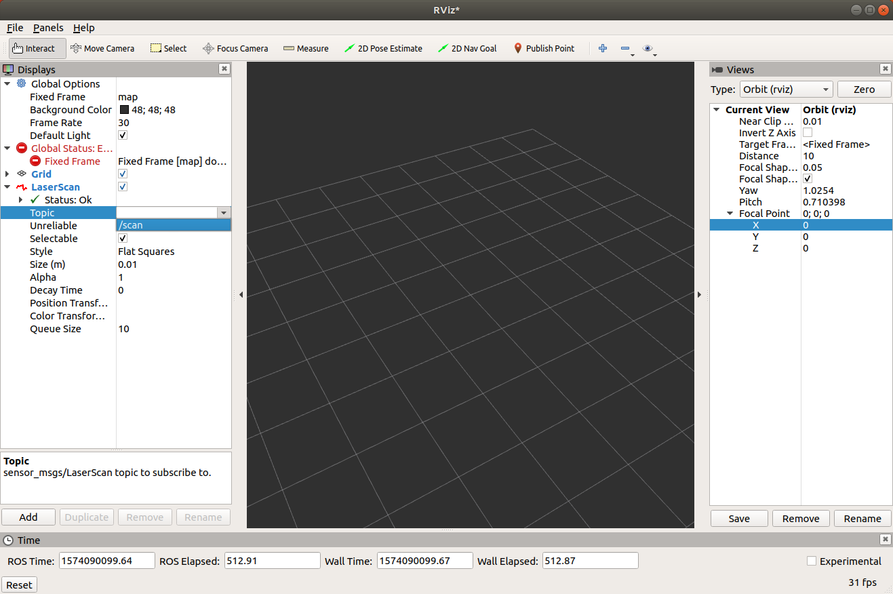
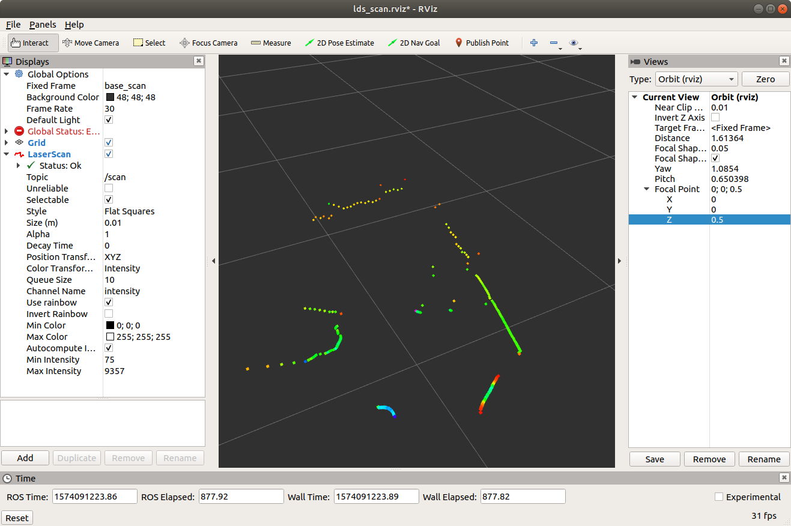
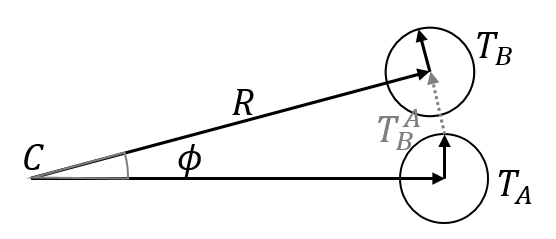
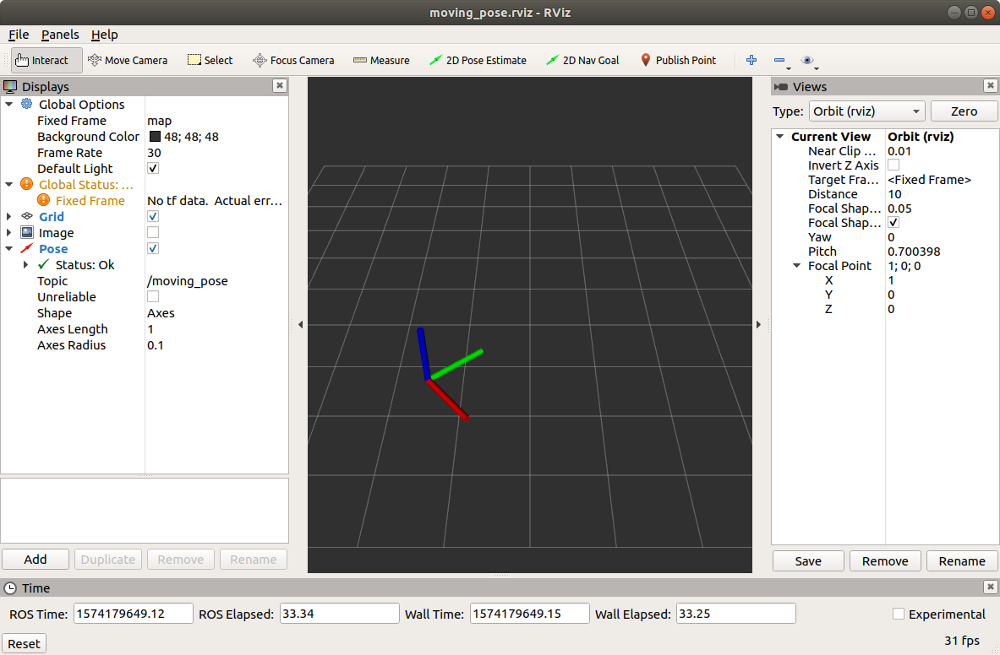
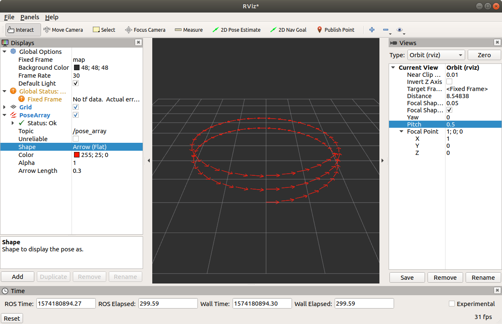

# RViz

## 1. RViz 소개

RViz는 ROS의 3차원 시각화 도구이다. ROS 메시지를 3차원으로 표현하는 것을 주요 목적으로 한다. 예를 들어 `geometry_msgs`의 다양한 기하 구조나, `sensor_msgs`의 다양한 센서 데이터를 별도의 프로그래밍 없이 보여줄 수 있다. 우리가 가진 터틀봇3에는 LDS가 있으므로 2차원 평면을 스캔한 거리들을 화면에 표시할 수 있고, 이를 Navigation 노드에 연결하면 LDS 정보를 이용해 만든 지도를 화면에 표시할 수도 있다.  

앞서 터틀봇 세팅을 하면서 LDS 데이터를 RViz로 확인하는 일을 이미 해보았다. 다음은 실행 명령어와 결과다.

```bash
# 터틀봇 라즈베리 파이에서
$ roslaunch turtlebot3_bringup turtlebot3_robot.launch

# 터틀봇과 ROS_MASTER_URI를 공유하는 데스크탑에서
$ roslaunch turtlebot3_bringup turtlebot3_model.launch
```



`turtlebot3_model.launch` 파일을 보면 그 안에서 rviz를 실행한다는 것을 알 수 있다.  

```xml
<node name="rviz" pkg="rviz" type="rviz" args="-d $(find turtlebot3_description)/rviz/model.rviz"/>
```

RViz 화면의 왼쪽 화면에 보여줄 (토픽) 메시지들을 선택하거나 추가할 수 있고 오른쪽에 그것을 시각화한 결과를 보여준다. RViz는 LDS (LiDAR) 뿐만 아니라 로봇에서 사용하는 RGB camera, Depth camera 등 다양한 센서 데이터를 시각화할 수 있다.  


## 2. RViz 사용법

### 2.1 화면 구성

Rviz는 간단하게 `rviz` 명령어로 실행할 수도 있고 `rosrun`으로 실행할 수도 있다.

```bash
$ rosrun rviz rviz
$ rviz
```

실행하면 아래와 같은 화면이 나온다.



- 3D View (중앙): 메시지를 3차원 시각화 하여 보여주는 부분이다. 그리드(grid, 격자)가 기본으로 보이고 3차원 공간에서 z=0 평면을 나타낸다. 기본 설정에서 한 칸의 크기는 1m다. 마우스 드래그(drag)로 시점의 방향을 바꿀 수 있고 마우스 휠(wheel)로 거리를 조절하여 시야 범위를 조절할 수 있다.
- Displays (왼쪽): 시각화 할 수 있는 메시지 목록을 보여준다. 여기서 시각화 하고자하는 메시지를 추가/복제/삭제하거나 추가된 메시지를 활성화/비활성화 할 수 있다. 
- Views (오른쪽): 화면의 시점을 보여주고 숫자를 조작해 직접 변경할 수 있다. 3D View에서 마우스를 드래그하면 시점을 회전시킬 수 있는데 "Yaw / Pitch"는 시점의 각도고 "Focal Point"는 시점이 바라보는 점이다. 3D View는 항상 중심에 "Focal Point"를 바라보도록 되어있어서 화면의 중심점을 이동시키고 싶으면 "Focal Point"에 직접 좌표를 입력하며 된다.
- Tools (상단): 여러 도구 버튼들이 있다. "Interact / Move Camera"는 시점 이동에 관한 것이고 "2D Pose Estimate / 2D Nav Goal"은 2차원 자율주행 알고리즘을 위해 시작 포즈와 목표 포즈를 지정해줄 수 있는 도구다. 화면에서 마우스 클릭을 통해 위치와 방향을 지정할 수 있고 결과는 토픽으로 발행된다.


### 2.2 도구 활용

도구에서 "2D Pose Estimate"와 "2D Nav Goal"을 사용해서 나오는 메시지를 터미널에서 확인해보자. 두 도구 중 하나를 선택하면 마우스를 이용해 시작점과 방향을 정할 수 있다.



이렇게 만들어진 2차원 포즈는 토픽 메시지로 발행된다. 어떤 메시지가 있는지 아래와 같이 확인해보자.

```
$ rostopic list
/clicked_point
/initialpose
/move_base_simple/goal
/rosout
/rosout_agg
/tf
/tf_static
$ rostopic info /initialpose 
Type: geometry_msgs/PoseWithCovarianceStamped
$ rostopic info /move_base_simple/goal 
Type: geometry_msgs/PoseStamped
```

"2D Pose Estimate"를 사용하면 `/initialpose`라는 토픽 네임으로 "geometry_msgs/PoseWithCovarianceStamped" 타입의 메시지가 발행된다. "2D Nav Goal"을 사용하면 `/move_base_simple/goal`라는 토픽 네임으로 "geometry_msgs/PoseStamped" 타입의 메시지가 발행된다.  

"2D Nav Goal"로 발행되는 메시지를 터미널에서 확인해보자. 아래 명령 실행 후 "2D Nav Goal"로 포즈를 하나 지정하면 터미널에서 그 내용을 볼 수 있다. 

```
$ rostopic echo /move_base_simple/goal
header: 
  seq: 1
  stamp: 
    secs: 1574226742
    nsecs:  88141346
  frame_id: "map"
pose: 
  position: 
    x: 1.35862970352
    y: 0.298492431641
    z: 0.0
  orientation: 
    x: 0.0
    y: 0.0
    z: 0.972191492586
    w: 0.234187321911
```

형식은 일반적인 3차원 포즈의 타입을 쓰고 있지만 내용적으로는 2차원 포즈가 발행된다. 여기서 `frame_id: "map"`을 볼 수 있는데 이는 rviz 화면에서 "Displays" - "Global Options" - "Fixed Frame"에 있는 "map"으로부터 온 것이다. rviz에서 frame이란 화면에 보이는 공간이나 차원을 의미하는 것인데 현재 "map"이라는 frame에서 "/move_base_simple/goal" 토픽이 발행되었음을 알려준다. 반대로 **rviz에서 외부 메시지를 읽어서 시각화 할 때 메시지의 `frame_id`가 rviz 화면의 "Fixed Frame"과 일치해야** 시각화 하여 보여준다.


### 2.3 설정 파일

rviz를 종료하려고 하면 현재의 설정을 저장할 것인지 항상 물어본다. "현재 설정"에는 "Displays"와 "Views" 패널에 보이는 모든 것들이 설정이다. 즉 현재 시각화하고 있는 메시지나 3차원 객체를 보고 있는 시점을 저장했다가 다시 불러올 수 있다.  

실습을 위해 터틀봇을 켜고 LDS에서 나오는 토픽을 화면에 시각화해보자. 다음 명령어를 실행한다.

```bash
# Remote PC(데스크탑)에서
$ roscore
# SBC(라즈베리 파이)에서
$ roslaunch turtlebot3_bringup turtlebot3_robot.launch
# Remote PC에서
$ rviz
# Remote PC에서 "/scan" 토픽 확인
$ rostopic list
```

전처럼 `roslaunch turtlebot3_bringup turtlebot3_model.launch`를 실행하지 않고 rviz만 실행하여 빈 화면이 뜨도록 했다.  

"Displays" 아래에 "Add" 버튼을 눌러 아래와 같은 화면에서 "LaserScan" 타입을 선택한다. 



그럼 "Displays" 화면에 "LaserScan"이 추가되고 이를 펼치면 "Topic"이라는 제목 옆에 콤보 박스(combo box)가 보이는데 거기서 "sensor_msgs/LaserScan" 타입의 토픽을 선택할 수 있다. 현재는 터틀봇에서 `/scan`이라는 네임의 토픽이 발행되고 있기 때문에 이를 선택하여 센서값을 화면에 표시한다.



그런데 토픽만 선택하면 에러가 나면서 화면에 보이지 않는다. `/scan`을 발행할 때 `frame_id`를 "base_scan"이라고 지정했기 때문에 rviz에서도 "Fixed Frame"을 "base_scan"으로 바꿔줘야 한다. 그러면 아래와 같이 LDS에서 방향별로 측정한 거리들이 3차원 공간에 점으로 표시된다. 점의 색깔은 레이저 반사파의 intensity에 따라 다르게 표현됐다. 



RViz에서 어떤 토픽을 시각화 할 때마다 이렇게 토픽을 일일이 추가하고 설정을 하는 것이 번거롭기 때문에 이러한 설정을 저장하는 기능이 있다. 저장할 때 시점(view)도 같이 저장되므로 오른쪽의 "Focal Point"도 임의로 수정해보자.

RViz 상단 메뉴에서 "File" - "Save Config as"를 선택하면 현재의 설정을 파일로 저장할 수 있다. 그냥 "Save Config"을 선택하면 파일 이름을 지정하지 않고 자동으로 `~/.rviz/default.rviz`라는 파일에 저장한다. RViz를 종료할 때 저장할지 묻는 메뉴에서도 기본 경로에 저장하도록 되어있다.  

설정 파일을 `~/.rviz/laser_scan.rviz`로 저장해보자. 이후 rviz를 닫고 다음 명령어로 다시 실행해보자.

```
$ rviz ~/.rviz/laser_scan.rviz
```

원래의 설정 그대로 토픽과 시점이 복원된 것을 볼 수 있다.


## 3. Visualize Poses

이번에는 앞서 배운 좌표계를 RViz로 표현해보자. RViz에서는 3차원 포즈(Pose)를 표현하는 "geometry_msgs/PoseStamped" 타입의 메시지를 좌표계로 시각화 시켜줄 수 있다. 혹은 포즈의 배열을 한번에 보여주는 "geometry_msgs/PoseArray" 타입도 있다. 이런 타입의 토픽을 발행하는 패키지를 다음과 같이 만들어보자. 

```bash
$ cd catkin_ws/src
$ catkin create pkg pose_publisher --catkin-deps rospy std_msgs geometry_msgs
$ cd pose_publisher
$ mkdir rviz launch
```

### 3.1 Moving Pose

첫 번째로 만들어 볼 것은 원형 궤적을 따라 움직이는 포즈를 토픽을 발행하고 이를 RViz에서 확인하는 것이다. 관련 파일을 다음과 같이 만들어보자.

```bash
$ touch src/pub_moving_pose.py launch/moving_pose.launch
$ chmod a+x src/pub_moving_pose.py
```

다음은 원형 궤적을 그리는 포즈를 발행하는 pub_moving_pose.py 코드다. 이전 포스트에서 만들었던 `Pose2D`를 활용한다.

```python
#!/home/ian/.pyenv/versions/ros_py36/bin/python
# TODO: shebang 경로 수정하기!
import rospy
from std_msgs.msg import Header
from geometry_msgs.msg import Point, Quaternion, Pose, PoseStamped
import numpy as np
from pose2d import Pose2D

def pose2d_to_3d(pose2d):
    x, y, theta = pose2d.get_params()
    print("pose2d:", pose2d)
    position = Point(x=x, y=y, z=0)
    orientation = Quaternion(w=np.cos(theta/2), x=0, y=0, z=np.sin(theta/2))
    pose3d = Pose(position=position, orientation=orientation)
    return pose3d

def main():
    rospy.init_node("pub_moving_pose")
    publisher = rospy.Publisher("moving_pose", PoseStamped, queue_size=1)

    center = (1, 0)
    radius = 2
    pose = Pose2D(center[0] + radius * np.cos(0), center[1] + radius * np.sin(0), np.pi / 2)
    angle = np.pi / 18.
    moved = Pose2D(center[0] + radius * np.cos(angle), center[1] + radius * np.sin(angle), np.pi / 2 + angle)
    motion = pose.motion_to(moved)
    rate = rospy.Rate(2)
    while not rospy.is_shutdown():
        pose3d = pose2d_to_3d(pose)
        header = Header(stamp=rospy.get_rostime(), frame_id="map")
        message = PoseStamped(header=header, pose=pose3d)
        publisher.publish(message)
        pose = pose.move(motion)
        rate.sleep()

if __name__ == "__main__":
    main()
```

코드와 그 아래의 그림을 비교하면서 보자. 아래 부분은 원형 궤적을 만들수 있는 움직임(motion)을 만든다. `center` ($$C$$)는 궤적의 중심이고 `radius`($$R$$)는 궤적의 반지름이다. `pose`($$T_A$$)는 출발점이고 `moved`($$T_B$$)는 `center`를 중심으로 원형 궤적을 `angle`($$\phi$$)만큼 이동하는 단위 움직임을 이동한 결과다. `moved`의 ($$x,y,\theta$$)는 다음 식을 통해 구할 수 있다.
$$
x = c_x + R*cos(\phi) \\
y = c_y + R*sin(\phi) \\
\theta = \pi/2 + \phi
$$
`pose`에서 `moved`로 이동하는 상대 포즈가 단위 움직임인 `motion`($$T^A_B=(T_A)^{-1} T_B$$)이다.

```python
    center = (1, 0)
    radius = 2
    pose = Pose2D(center[0] + radius * np.cos(0), center[1] + radius * np.sin(0), np.pi / 2)
    angle = np.pi / 18.
    moved = Pose2D(center[0] + radius * np.cos(angle), center[1] + radius * np.sin(angle), np.pi / 2 + angle)
    motion = pose.motion_to(moved)
```



그림에서 Pose A와 Pose B를 비교해보면 원형 궤적을 따라 약간 왼쪽 위로 이동했고 각도도 반시계 방향으로 $$\theta$$ 만큼 틀어져있다. 이러한 움직임을 반복하면 결국에는 원형 궤적을 따라 로봇이 움직이게 된다.   

아래 코드에서는 `Pose2D` 타입을 geometry_msgs의 `Pose` 타입으로 변환하고 거기에 `header`를 추가하여 rviz에서 받을 수 있는 메시지 타입은 `PoseStamped` 객체를 만든다. `Header` 객체를 만들 때 `frame_id`를 rviz 기본값인 "map"으로 설정하였다.  

여기까지는 `pose`를 발행하는 것이고 마지막의 `pose = pose.move(motion)`을 해야 원형 궤적을 따라 돌게 된다. 기존의 `pose`에 똑같은 `motion`을 반복하다보면 원형 궤적을 만들게 된다.

```python
    while not rospy.is_shutdown():
        pose3d = pose2d_to_3d(pose)
        header = Header(stamp=rospy.get_rostime(), frame_id="map")
        message = PoseStamped(header=header, pose=pose3d)
        publisher.publish(message)
        pose = pose.move(motion)
```

이제 빌드 후 실행해서 확인해보자.

```bash
$ cd ~/catkin_ws
$ catkin build
$ source devel/setup.bash
$ roscore
# 새탭
$ rosrun pose_publisher pub_moving_pose.py
# 새탭
$ rviz
```

pub_moving_pose.py 를 실행하면 2차원 포즈가 주기적으로 터미널에 출력될 것이다. 하지만 RViz에는 아무것도 보이지 않는다. "Displays" 패널에서 "Add"버튼을 눌러 "Pose"를 추가해야 한다. 기본적으로는 화살표로 표시되는데 "Pose" 아래 "Shape" 항목을 "Axes"로 바꿔주면 아래 그림같이 3차원 좌표축을 볼 수 있다. R, G, B 좌표 축이 각각 X, Y, Z 축을 나타낸다.



이번에도 RViz를 실행했을 때 매번 설정하는 것이 번거로우므로 설정을 패키지 디렉토리 아래 "rviz/moving_pose.rviz" 로 저장한다.

한 단계 더 나아가면 pub_moving_pose.py와 rviz 실행을 launch 파일을 통해 한 번에 실행할 수 있다. 패키지 디렉토리 아래 "launch/moving_pose.launch" 파일을 만들어 다음과 같이 작성해보자. 첫 번째 노드는 단순히 pub_moving_pose.py를 실행하는 것이다. 두 번째 노드는 rviz를 실행하는 것인데 `args` 옵션으로 앞서 저장한 rviz 설정 파일을 열도록 지정하였다. `$(find pose_publisher)`는 pose_publisher 패키지 경로를 찾아준다.

```xml
<launch>
	<node pkg="pose_publisher" type=pub_moving_pose.py name="pub_moving_pose"/>
	<node pkg="rviz" type="rviz" name="rviz" args="-d $(find pose_publisher)/rviz/moving_pose.rviz"/>
</launch>
```

launch 파일을 다음과 같이 실행해보자.

```
$ roslaunch pose_publisher moving_pose.launch --screen
```

pub_moving_pose.py와 rviz가 동시에 실행되는 것을 볼 수 있을 것이다.


### 3.3 Pose Array

두 번째로 만들어 볼 것은 원형 궤적을 따라 움직이는 포즈들을 누적해서 보여주는 것이다. "geometry_msgs/PoseArray" 타입의 메시지를 발행하는 것이다. 먼저 관련 파일들을 만든다.

```bash
$ touch src/pub_pose_array.py launch/pose_array.launch
$ chmod a+x src/pub_pose_array.py
```

다음은 pub_pose_array.py 소스 코드다.

```python
#!/home/ian/.pyenv/versions/ros_py36/bin/python
# TODO: shebang 경로 수정하기!
import rospy
from std_msgs.msg import Header
from geometry_msgs.msg import Point, Quaternion, Pose, PoseArray
import numpy as np
from pose2d import Pose2D

def pose2d_to_3d(pose2d):
    x, y, theta = pose2d.get_params()
    print("pose2d:", pose2d)
    position = Point(x=x, y=y, z=0)
    orientation = Quaternion(w=np.cos(theta/2), x=0, y=0, z=np.sin(theta/2))
    pose3d = Pose(position=position, orientation=orientation)
    return pose3d

def main():
    rospy.init_node("pub_pose_array")
    publisher = rospy.Publisher("pose_array", PoseArray, queue_size=1)

    center = (1, 0)
    radius = 2
    pose = Pose2D(center[0] + radius * np.cos(0), center[1] + radius * np.sin(0), np.pi / 2)
    angle = np.pi / 18.
    moved = Pose2D(center[0] + radius * np.cos(angle), center[1] + radius * np.sin(angle), np.pi / 2 + angle)
    motion = pose.motion_to(moved)
    rate = rospy.Rate(2)
    pose_arr = []
    count = 0
    while not rospy.is_shutdown():
        pose3d = pose2d_to_3d(pose)
        count += 1
        pose3d.position.z = count*0.01
        header = Header(stamp=rospy.get_rostime(), frame_id="map")
        pose_arr.append(pose3d)
        message = PoseArray(header=header, poses=pose_arr)
        publisher.publish(message)
        pose = pose.move(motion)
        rate.sleep()

if __name__ == "__main__":
    main()
```

앞서 본 pub_moving_pose.py 와 대부분 유사하다. 다른 부분을 위주로 살펴보자. `pose`는 기존과 똑같이 원형 궤적을 따라 업데이트 되고 `pose3d`라는 geometry_msgs/Pose 타입으로 변환된다. 차이점은 `pose3d`가 하나씩 메시지에 들어가는 것이 아니라 `pose_arr`라는 리스트에 쌓여서 메시지로 들어간다는 것이다. 노드가 실행되는 동안 `pose3d`는 계속 `pose_arr`에 쌓이게 된다.  

그런 한번 움직일 때 10˚씩 움직이므로 36번 움직이고 나면 기존 포즈와 정확히 똑같은 자리에 새로운 포즈가 쌓이게 되므로 이를 방지하기 위해 `pose3d`의 높이 값을 `count`에 비례하여 올라가도록 만들었다. `pose3d.position.z = count*0.01` 이렇게 하면 어떤 포즈도 겹치지 않고 포즈들이 나선형으로 올라가는 모습을 볼 수 있을 것이다.

```python
    pose_arr = []
    count = 0
    while not rospy.is_shutdown():
        pose3d = pose2d_to_3d(pose)
        count += 1
        pose3d.position.z = count*0.01
        header = Header(stamp=rospy.get_rostime(), frame_id="map")
        pose_arr.append(pose3d)
        message = PoseArray(header=header, poses=pose_arr)
        publisher.publish(message)
```

새로운 노드가 추가됐으므로 같은 과정을 거쳐 노드와 RViz를 실행해보자.

```bash
$ cd ~/catkin_ws
$ catkin build
$ source devel/setup.bash
$ roscore
# 새탭
$ rosrun pose_publisher pub_pose_array.py
# 새탭
$ rviz
```

이번에 발행하는 메시지는 "geometry_msgs/PoseArray"이므로 RViz에서 "Display"패널에 PoseArray 메시지를 추가해야 한다. 그리고 "/pub_pose_array" 토픽을 선택하면 아래와 같은 화면이 보일 것이다.  



이번에도 마찬가지로 패키지 아래 rviz 설정 파일을 "rviz/pose_array.rviz"로 저장하고 "launch/pose_array.launch" 파일을 아래와 같이 작성한다.

```xml
<launch>
	<node pkg="pose_publisher" type="pub_pose_array.py" name="pub_pose_array"/>
	<node pkg="rviz" type="rviz" name="rviz" args="-d $(find pose_publisher)/rviz/pose_array.rviz"/>
</launch>
```

이제 launch 파일을 실행하면 pub_pose_array.py와 rviz가 동시에 실행이 될 것이다.  

---

# 맺음말

여기까지 ROS와 ROS에 기반한 로봇 프로그래밍을 하기 위한 여러가지 잡다한 지식을 배웠습니다. 배우면서 느꼈겠지만 로봇(혹은 차, 드론 등)을 다룬다는 것은 다방면의 스킬과 이론적 지식이 필요합니다. 이 수업에서는 이론보다는 주로 스킬에 집중했는데 그 이유는 linux, git, python 등은 소프트웨어 분야의 많은 직업군에서 범용적으로 필요한 기술이기 때문입니다.  

여러분들의 미래에 이 기술들이 도움이 되길 기원합니다. 한 학기 동안 수고하셨습니다.  

