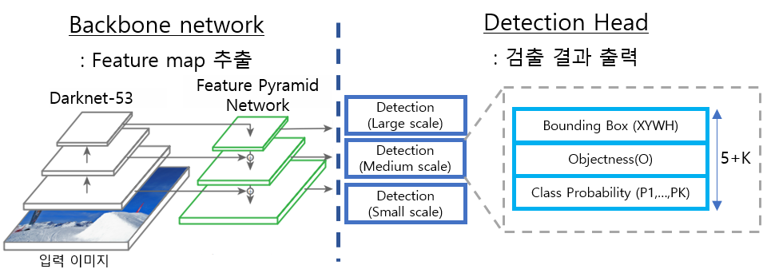

# Object Detector


## 1. 강의 소개


### 1.1. 강의 목표

본 강의에서는 *Deep Learning based Object Detector*를 구현하는 방법에 대해 배운다. 딥러닝은 컴퓨터 비전의 다음 세 가지 주요 목표에서 엄청난 성공을 거두었다. 

- 분류(classification): 영상에 들어있는 주요 사물의 종류를 확률적으로 출력, 10가지 사물이 있다면 한 영상에 대해 합이 1인 10개의 확률값이 나옴
- 검출(object detection): 영상에서 사물의 영역을 감싸는 직사각형 경계 상자(bounding box)를 출력, 사물의 개수에 따라 출력의 양이 달라짐
- 분리(image segmentation): 영상에서 사물의 영역을 픽셀단위로 분류하여 원본 영상과 같은 크기의 segmentation map을 출력

초기에는 분류 모델이 관심을 받고 이후에는 검출 모델들이 발전하다가 최근에는 분리 모델이 주요 연구대상인것 같다. 하지만 검출 기술은 여전히 자율주행에서 중요한 기술이다. 검출은 분리보다 출력 데이터 양이 훨씬 작기 때문에 출력 속도도 빠르고 후처리도 간편하다.  

본 강의에서 검출기(Detector)를 공부하는 이유는 검출기 구현을 통해서 텐서플로(Tensroflow)나 파이토치(Pytorch) 같은 딥러닝 프레임워크(Deep learning framework)의 다양한 사용법을 깊이있게 배울수 있기 때문이다. 분류 모델은 단순해서 누구나 쉽게 구할수 있지만 별로 배우는게 없고 분류 모델이 실제로 필요한 경우가 많지 않다. 검출 모델을 다룰줄 알면 다른 CNN 모델도 쉽게 다룰 수 있을 것이다.

본 강의에서는 **검출기 구현을 통해 텐서플로와 파이토치를 모두 배우는 것을 목표**로 한다. 텐서플로 1.x와 파이토치는 원래는 매우 다른 실행 방법을 가지고 있었지만 최근 텐서플로 2.x에서는 많이 비슷해져서 큰 차이는 없다. 다만 파이토치는 그냥 넘파이(Numpy) 다루듯이 데이터 일부를 수정할수도 있고 한줄씩 실행이 가능한데 텐서플로는 미리 연산 그래프를 고정시켜 놓고 데이터가 고정된 연산과정을 통과하는 식이라 텐서연산에 대한 기술이 좀 필요하다. 대신 텐서플로는 상업적인 배포에 용이하다. 웹, 모바일 등에서 모델을 배포할 수 있고 더 많은 프로그래밍 언어를 지원한다. 본 강의에서는 텐서플로를 우선적으로 배우고 파이토치는 강의 일정에 따라 조절될 수 있다.   

딥러닝 프로그래밍을 할 때 가장 필요한 것은 **다차원 배열(텐서, Tensor)을 다루는 능력**이다. 텐서 연산에서는 가급적 for문을 사용하지 않고 다차원 배열에서 한번에 처리하는 것이 유리하다. 보통 4차원이나 5차원 텐서를 많이 다루는데 평소에 접하지 않았던 차원이라 텐서 연산에 대한 훈련을 많이 해야 여러 차원들을 자유자재로 다루며 원하는 연산을 할 수 있다.  본 강의를 통해 자연스럽게 이러한 훈련을 하게 될 것이다.  

본 강의의 또 다른 목표는 **유연한 객체지향적인 프로그래밍 기법 습득**이다. 코드를 단순하게 구현하면 이해하기는 쉬우나 실제로 개발을 할때는 다양한 옵션을 바꿔가면서 실험을 해야하기 때문에 단순한 구조를 유지하기 어렵다. 본 강의에서 제공하는 코드는 언제나 다양한 가능성을 열어두고 다양하게 확장가능한 프로그램을 지향한다. 이러한 패턴을 익혀두면 실무 연구에 큰 도움이 될 것이다.  

**강의대상**: 본 강의는 딥러닝이나 CNN 기초에 대해서는 다루지 않으며 기본 설명 후 바로 구현으로 들어가므로 딥러닝과 CNN을 이해해야 강의를 들을 수 있다.  


### 1.2. 강의 계획

본 강의에서는 우선 텐서플로 모델을 먼저 배우고 그 뒤 이와 유사한 파이토치 구현을 배운다. CNN모델 구현이 주된 내용일것 같지만 사실은 데이터 준비 과정이 가장 오래 걸리고 그 다음으로 손실 함수 구현이 오래걸린다. 모델 구현은 프레임워크에서 편리한 API를 제공하므로 어렵지 않다. 구체적인 강의 순서는 다음과 같다. 강의 계획은 강의를 진행하며 수정될 수 있다.

| 강의 계획                                                    |
| ------------------------------------------------------------ |
| 1. 강의 소개, YOLO v3 모델 설명                              |
| 2. pyenv 설치 및 가상환경 세팅, 텐서플로 및 파이토치 환경 세팅 |
| 3. (TF, PT) 간단한 분류 모델 테스트                          |
| 4. (TF) 간단한 데이터셋에서 tfrecord 만들고 데이터 불러오기  |
| 5. (PT) 파이토치 DataLoader 사용                             |
| 6. (TF) TfrecordMaker 구조 설계, Cityscapes reader 구현      |
| 7. Kitti reader 구현, TfrecordReader 구현                    |
| 8. (TF) 학습 시스템 설계, Darknet53 구현                     |
| 9. (TF) 검출 헤드(Head) 구현, 손실 함수 구현                 |
| 10. (TF) 로깅(logging) 및 평가 시스템 구현                   |
| 11. (PT) DatasetLoader 구현                                  |
| 12. (PT) Darknet53과 검출 헤드 구현, 학습 시스템에 적용      |
| 13. (PT) 손실 함수 구현                                      |
| 14. (PT) 로깅(logging) 및 평가 시스템 구현                   |


## 2. YOLO (You Only Look Once)

검출 모델 구현이라는 목표 달성을 위해 본 강의에서는 *YOLO* 라는 모델을 선택하였다. 여러 모델을 비교하며 구현하면 좋지만 시간이 오래 걸리고 하나를 구현하고 나면 다른 모델들도 쉽게 구현할 수 있을 것이다. YOLO를 선택한 이유는 가장 유명한 Single-stage 검출 모델이기 때문이다. Two-stage 검출 모델로 Faster R-CNN 등이 있는데 일반적으로 Two-stage 모델이 성능이 조금 더 나온다고 하지만 학습과정을 두 번 거쳐야하므로 구현상 번거로운점이 있다.


### 2.1. YOLO 소개

YOLO는 Object Detector 계열에서 가장 유명한 모델 중 하나다. 다음은 구글 학술검색에서 보여주는 인용수다. (2021.2.4 기준)

1. Faster R-CNN: 19,934
2. YOLO (v1): 13,806
3. Fast R-CNN: 13,255
4. SSD: 12,695

YOLO는 Joseph Redmon 이란 괴짜 천재에 의해 개발되었다. 괴짜인 이유는 [홈페이지](https://pjreddie.com/)와 [이력서]([https://pjreddie.com/static/Redmon%20Resume.pdf](https://pjreddie.com/static/Redmon Resume.pdf))를 보면 평범한 사람은 아니란걸 알 수 있다. 천재인 이유는 남들은 텐서플로나 파이토치 등을 이용해서 개발하는 딥러닝 연구를 프레임워크부터 직접 만들어서 훌륭한 검출 모델까지 구현을 했기 때문이다. 요즘 Nature 자매지를 능가하는 CVPR이라는 학회에서 최우수 논문상을 받기도 했다. 


 

 Joseph에 의해 개발된 YOLO는 세 가지 버전이 있고 그 이후 나온 YOLO v4는 Joseph과는 관련이 없다.

- Redmon, Joseph, et al. "You only look once: Unified, real-time object detection." *Proceedings of the IEEE conference on computer vision and pattern recognition*. 2016.
- Redmon, Joseph, and Ali Farhadi. "YOLO9000: better, faster, stronger." *Proceedings of the IEEE conference on computer vision and pattern recognition*. 2017.
- Redmon, Joseph, and Ali Farhadi. "Yolov3: An incremental improvement." *arXiv preprint arXiv:1804.02767* (2018).

YOLO 모델의 장점은 속도다. 아래 그림을 보면 YOLOv3는 다른 RetinaNet에 비해서 성능은 좀 떨어지지만 속도는 빠르다는 것을 볼 수 있다. 다른 모델과 비교해보면 성능도 그다지 부족하지 않다는 것을 알 수 있다.


### 2.2. YOLOv3 모델 구조

YOLO 모델은 크게 Backbone network(백본)와 Detection Head(헤드)로 구성이 되어있다. 백본에서는 영상의 다양한 정보를 포함한 Feature map을 만들고 헤드에서는 객체 정보를 추출한다.  




#### Backbone Network

YOLO v3에서 백본은 아래와 같은 Darknet-53이라는 구조로 되어있다. ResNet과 비슷한 shortcut connection이 있어서 각 conv. block의 입력과 출력을 더해서 다음 레이어의 입력으로 들어간다. Feature map을 1/2로 줄일때마다 채널을 두배로 늘린다. 마지막에 global average pooling은 분류에 사용되는 것이고 객체 검출을 할때는 필요하지 않다.


#### Detection Head

Feature Pyramid Network(FPN)구조는 "Feature Pyramid Networks for Object Detection" 이란 논문에서 최초로 제안되었고 이후에 대부분의 검출 모델에서 이와 유사하거나 더 복잡한 구조가 사용되었다. YOLO v3의 자세한 구조는 다음과 같다.


Darknet에서는 large, medium, small 세 가지 스케일의 feature map을 출력한다. 여기서 주의할 점은 *large* feature map 혹은 large scale이라고 feature map 자체가 큰 것이 아니라 해당 feature map에서 검출되는 객체들의 크기가 크다는 뜻이다. Large feature map의 텐서 크기가 가장 작고 small feature map의 크기가 가장 크다.  

상위 feature map은 1x1 conv를 거쳐 2배로 확장된 다음 하위 feature map과 합쳐진다. 이는 고수준의 의미를 포함한 상위 feature와 국소적 디테일을 포함한 하위 feature를 결합하여, 객체 검출에 다양한 수준의 feature를 활용하기 위함이다.

결합된 feature map은 몇 번의 convolution을 거쳐 feature map 형태로 최종 출력을 내보낸다. 출력 feature map의 크기는 large, medium, small 각각 원래 이미지에 비해 1/32, 1/16, 1/8 크기다. 출력 feature map을 통해 해당 위치에 객체가 있는지(objectness), 어느 범위에 있는지(bounding box: XYWH), 어떤 종류의 객체인지(class probability, p1...pK)를 알려준다.

FC-layer를 사용하지 않고 convolution 연산만 사용했기 때문에 영상의 해상도가 늘어나도 같은 구조를 그대로 사용할 수 있다. 다만 학습시 Anchor box의 크기는 조절해야 한다.


#### Anchor Box

YOLO에서는 bounding box의 중심점과 너비 높이를 출력하는데 사전에 정한 anchor box를 기준으로 상대적인 위치와 크기 변화만을 학습한다. 최종 결과를 보여줄 때는 이를 픽셀좌표로 변환하여 보여준다.

YOLO 구조에서 보이듯 YOLO는 large, medium, small 세 가지 스케일로 검출 결과를 출력한다. Small feature map은 작은 물체에 대한 학습데이터를 할당받아 작은 물체를 검출하도록 학습하고 Large feature map은 큰 물체에 대한 학습데이터를 할당받아 큰 물체를 검출한다. 각 스케일의 feature map은 내부적으로 세 가지 크기의 anchor box를 가져서 총 9가지의 anchor box가 있다. 아래는 각 anchor box의 픽셀 단위 크기다. YOLO에서는 COCO 데이터셋에서 bounding box의 크기에 대해 K-means clustering 기법을 이용해 가장 빈번하게 사용되는 box 크기를 anchor box의 크기로 사용하였다.

```
[(10, 13), (16, 30), (33, 23), (30, 61), (62, 45), (59, 119), (116, 90), (156, 198), (373, 326)]
```

가령 medium feature map은 모델에 (416, 416) 영상을 입력했을때 (26, 26) 해상도를 가진다. 각 픽셀마다 세 가지 크기의 anchor box가 할당되므로 medium 스케일에서는 총 26x26x3 개의 bounding box를 출력할 수 있다. 다음 그림은 4x5x3 feature map의 예시를 그린 것이다.


Feature map에서 바로 박스의 위치와 크기를 출력하지 않고 아래 그림과 같은 후처리 과정을 거쳐 박스 위치와 크기를 만든다.


- $$t_x, t_y, t_w, t_h$$: feature map에서 바로 출력된 박스의 원시 정보
- $$c_x, c_y$$: 각 그리드 셀(grid cell)의 좌표 (0, 0) ~ (GW-1, GH-1)
- $$p_w, p_h$$: anchor box의 크기
- $$b_x, b_y, b_w, b_h$$: 후처리를 통해 출력된 최종적인 bounding box 정보
  - $$b_x, b_y$$: sigmoid 함수를 써서 $$t_x, t_y$$를 0~1 값으로 변환하여 cell 내부에서 박스의 중심점 위치를 표시, 거기에 cell의 좌표 $$c_x, c_y$$를 더하여 feature map 왼쪽 위 구석을 기준으로한 좌표 출력
  - $$b_w, b_h$$: exponential 함수를 써서 크기가 음수가 나오지 않게 함. 박스 크기를 직접 학습하지 않고 정해진 anchor box 크기 $$p_w, p_h$$에 대한 비율만 학습

위 그림의 수식에서는 모든 크기의 기준이 그리드 스케일로 수식이 적혀있다. (모든 좌표와 크기가 [0,0] ~ [GW-1, GH-1] 범위) 하지만 실제 구현에서는 그리드의 크기가 feature map 마다 다르고 그리드 크기에 따라 손실 함수의 크기도 달라질 수 있으므로 모든 좌표와 크기를 [0,0] ~ [1,1] 사이의 범위로 정규화하여 사용한다.  

416 크기 이미지를 기준으로 feature map의 크기는 'large'가 (13, 13), 'small'이 (52, 52) 이므로 그리드 스케일로 좌표나 크기의 손실 함수를 구하면 'large'는 손실 함수가 작게 나오고 'small'은 크게 나와서 균형있게 학습할 수 없다. 모든 좌표와 크기를 0~1 범위로 정규화하면 어떤 feature map이든 동일한 비중으로 학습할 수 있고 나중에 다시 영상에 bounding box를 표시할 때도 원본 영상의 크기만 곱해주면 된다.


### 2.3. 학습 및 예측


#### IoU(Intersection over Union)

IoU는 검출 모델에서 자주 사용되는 용어인데 두 개의 bounding box 사이의 겹치는 부분의 비율이다. 보통 실제 사물의 범위를 나타내는 GT (ground truth) box가 있고 검출 모델에서 출력한 predicted box가 있을 때 둘 사이에 IoU를 계산하여 검출이 잘 되었는지를 판단한다. 보통 이 비율이 50%가 넘어야 검출이 제대로 되었다고 본다. IoU 계산 방법은 아래 그림을 보면 직관적으로 이해할 수 있다.  IoU는 두 박스를 합친 영역 대비 중복 영역의 넓이의 비율이다.


#### 학습(Training)

모델을 학습시킬 때는 학습 데이터에 들어있는 각 GT box에 대해 어느 위치의 어떤 크기의 anchor에서 학습시킬 것인지를 미리 정해야한다. 다른 모델에서는 무작위로 bounding box를 출력한 뒤 그 중에서 GT box와 가장 IoU가 높은 box에 학습 데이터를 할당하기도 한다. YOLO에서는 GT box의 위치와 크기를 이용하여 정확한 계산으로 어느 feature map의 어느 위치의 어떤 anchor box에 학습 데이터를 할당할지를 결정한다. 모든 feature map의 모든 anchor box에서 박스 예측 결과가 나오지만 학습에 사용되는 박스는 GT box의 개수와 같다.  

학습에는 다음과 같은 손실 함수가 사용된다.

- Objectness: anchor box에 사물이 있는지 없는지 확률로 표시 (0~1)
- Bounding box: GT와 모델 예측 사이의 (XYHW) 차이
- Category: multi-labeling이 가능하도록 각각의 클래스에 대해 "있다, 없다"를 binary crossentropy로 학습


#### 예측(Prediction) feat. NMS

학습 후 검출 결과를 출력할 때는 모든 feature map에서 나오는 bounding box를 출력하지 않고 검출된 객체만 출력한다. 일단 각 anchor box 위치에서 *objectness > $$\tau_{obj}$$*  일때 해당 위치에서 출력되는 bounding box에 객체가 있다고 볼 수 있는데 objectness만 볼 경우 비슷한 위치에서 다수의 객체가 중복으로 검출되는 문제가 발생한다. 체 하나에 검출 결과를 하나만 출력하기 위해서는 **NMS(Non-Maximum Suppression)**를 써서 중복된 객체들 중 가장 score가 높은 것만 출력하도록 한다. 객체의 존재 여부를 판단하는 score는 *(objectness x class prob.)*을 사용한다. 즉 어떤 anchor 위치에서 objectness가 0.8, *person* 클래스에 대한 확률이 0.6이라면 그 위치에서 사람 검출에 대한 score는 0.48이다.  

NMS 알고리즘은 다음과 같다. 이것은 하나의 feature map에 대해 nms를 하는것이고 YOLO에서는 세 가지 스케일의 feature map이 있으므로 이를 세 번 반복해야 한다.

```python
def nms(boxes, scores, score_thresh, iou_thresh):
  """Non-Maximum supression.
    boxes: numpy array [N, 4(xywh)]
    scores: numpy array [N, K] (N=num boxes, K=num categories)
    score_thresh: a box can be a detection candidate if its score is larger than score_thresh
    iou_thresh: two boxes are considered overlapping if their IOU is largher than iou_thresh
  """
  N, K = scores.shape
  # sort box indices in decending order, [N, K]
  order = scores.argsort(axis=0)[::-1]
  # ignore boxes with score < score_thresh
  scores[scores < score_thresh] = 0

  for k in range(K): # for each category
    for i in range(N-1): # for each highest score box
      if scores[order[i,k]] == 0: # skip ignored box
        continue
      # iou between i-th rank box and lower rank boxes [N-i-1]
      ious = batch_iou(boxes[order[i,k]], boxes[order[i+1:,k]])
      # ignore boxes with iou > iou_thresh
      for j, iou in enumerate(ious):
        if iou > iou_thresh:
          scores[order[j+i+1,k], k] = 0

  # box category [N], maximum category scores per box [N]
  box_categories = scores.argmax(axis=1)
  max_score_per_box = scores.max(axis=1)
  # remove ignored box info [M]
  box_categories = box_categories[max_score_per_box > 0]
  boxes = boxes[max_score_per_box > 0]
  return boxes, box_categories
```


여기까지가 이 강의의 유일한 이론적인 부분이고 앞으로는 코드 설명 위주로 진행하게 될 것이다.

