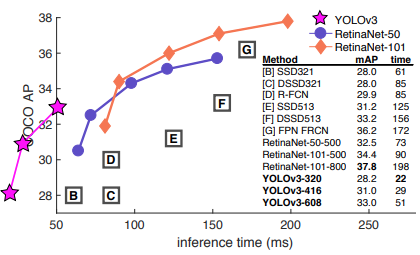

# Object Detector

## 1. 강의 소개

### 1.1. 강의 목표

본 강의에서는 *Deep Learning based Object Detector*를 구현하는 방법에 대해 배운다. 딥러닝은 컴퓨터 비전의 다음 세 가지 주요 목표에서 엄청난 성공을 거두었다. 

- 분류(classification): 영상에 들어있는 주요 사물의 종류를 확률적으로 출력, 10가지 사물이 있다면 한 영상에 대해 합이 1인 10개의 확률값이 나옴
- 검출(object detection): 영상에서 사물의 영역을 감싸는 직사각형 경계 상자(bounding box)를 출력, 사물의 개수에 따라 출력의 양이 달라짐
- 분리(image segmentation): 영상에서 사물의 영역을 픽셀단위로 분류하여 원본 영상과 같은 크기의 segmentation map을 출력

초기에는 분류 모델이 관심을 받고 이후에는 검출 모델들이 발전하다가 최근에는 분리 모델이 주요 연구대상인것 같다. 하지만 검출 기술은 여전히 자율주행에서 중요한 기술이다. 검출은 분리보다 출력 데이터 양이 훨씬 작기 때문에 출력 속도도 빠르고 후처리도 간편하다.  

본 강의에서 검출기(Detector)를 공부하는 이유는 검출기 구현을 통해서 텐서플로(Tensroflow)나 파이토치(Pytorch) 같은 딥러닝 프레임워크(Deep learning framework)의 다양한 사용법을 깊이있게 배울수 있기 때문이다. 분류 모델은 단순해서 누구나 쉽게 구할수 있지만 별로 배우는게 없고 분류 모델이 실제로 필요한 경우가 많지 않다. 검출 모델을 다룰줄 알면 다른 CNN 모델도 쉽게 다룰 수 있을 것이다.

본 강의에서는 **검출기 구현을 통해 텐서플로와 파이토치를 모두 배우는 것을 목표**로 한다. 텐서플로 1.x와 파이토치는 원래는 매우 다른 실행 방법을 가지고 있었지만 최근 텐서플로 2.x에서는 많이 비슷해져서 큰 차이는 없다. 다만 파이토치는 그냥 넘파이(Numpy) 다루듯이 데이터 일부를 수정할수도 있고 한줄씩 실행이 가능한데 텐서플로는 미리 연산 그래프를 고정시켜 놓고 데이터가 고정된 연산과정을 통과하는 식이라 텐서연산에 대한 기술이 좀 필요하다. 대신 텐서플로는 상업적인 배포에 용이하다. 웹, 모바일 등에서 모델을 배포할 수 있고 더 많은 프로그래밍 언어를 지원한다.

본 강의의 또 다른 목표는 **유연한 객체지향적인 프로그래밍 기법 습득**이다. 코드를 단순하게 구현하면 이해하기는 쉬우나 실제로 개발을 할때는 다양한 옵션을 바꿔가면서 실험을 해야하기 때문에 단순한 구조를 유지하기 어렵다. 본 강의에서 제공하는 코드는 언제나 다양한 가능성을 열어두고 다양하게 확장가능한 프로그램을 지향한다. 이러한 패턴을 익혀두면 실무 연구에 큰 도움이 될 것이다.

**강의대상**: 본 강의는 딥러닝이나 CNN 기초에 대해서는 다루지 않으며 기본 설명 후 바로 구현으로 들어가므로 딥러닝과 CNN을 이해해야 강의를 들을 수 있다.

### 1.2. 강의 계획

본 강의에서는 우선 텐서플로 모델을 먼저 배우고 그 뒤 이와 유사한 파이토치 구현을 배운다. CNN모델 구현이 주된 내용일것 같지만 사실은 데이터 준비 과정이 가장 오래 걸리고 그 다음으로 손실 함수 구현이 오래걸린다. 모델 구현은 프레임워크에서 편리한 API를 제공하므로 어렵지 않다. 구체적인 강의 순서는 다음과 같다. 강의 계획은 강의를 진행하며 수정될 수 있다.

| 강의 계획                                                    |
| ------------------------------------------------------------ |
| 1. 강의 소개, YOLO v3 모델 설명                              |
| 2. pyenv 설치 및 가상환경 세팅, 텐서플로 및 파이토치 환경 세팅 |
| 3. (TF, PT) 간단한 분류 모델 테스트                          |
| 4. (TF) 간단한 데이터셋에서 tfrecord 만들고 데이터 불러오기  |
| 5. (PT) 파이토치 DataLoader 사용                             |
| 6. (TF) TfrecordMaker 구조 설계, Cityscapes reader 구현      |
| 7. Kitti reader 구현, TfrecordReader 구현                    |
| 8. (TF) 학습 시스템 설계, Darknet53 구현                     |
| 9. (TF) 검출 헤드(Head) 구현, 손실 함수 구현                 |
| 10. (TF) 로깅(logging) 및 평가 시스템 구현                   |
| 11. (PT) DatasetLoader 구현                                  |
| 12. (PT) Darknet53과 검출 헤드 구현, 학습 시스템에 적용      |
| 13. (PT) 손실 함수 구현                                      |
| 14. (PT) 로깅(logging) 및 평가 시스템 구현                   |

## 2. YOLO (You Only Look Once)

YOLO는 Object Detector 계열에서 가장 유명한 모델 중 하나다. 다음은 구글 학술검색에서 보여주는 인용수다. (2021.2.4 기준)

- Faster R-CNN: 19,934
- YOLO (v1): 13,806
- Fast R-CNN: 13,255
- SSD: 12695

YOLO는 Joseph Redmon 이란 괴짜 천재에 의해 개발되었다. 괴짜인 이유는 [홈페이지](https://pjreddie.com/)와 [이력서]([https://pjreddie.com/static/Redmon%20Resume.pdf](https://pjreddie.com/static/Redmon Resume.pdf))를 보면 평범한 사람은 아니란걸 알 수 있다. 천재인 이유는 남들은 텐서플로나 파이토치 등을 이용해서 개발하는 딥러닝 연구를 프레임워크부터 직접 만들어서 훌륭한 검출 모델까지 구현을 했기 때문이다. 요즘 Nature 자매지를 능가하는 CVPR이라는 학회에서 최우수 논문상을 받기도 했다. Joseph에 의해 개발된 YOLO는 세 가지 버전이 있고 그 이후 나온 YOLO v4는 Joseph과는 관련이 없다.

- Redmon, Joseph, et al. "You only look once: Unified, real-time object detection." *Proceedings of the IEEE conference on computer vision and pattern recognition*. 2016.
- Redmon, Joseph, and Ali Farhadi. "YOLO9000: better, faster, stronger." *Proceedings of the IEEE conference on computer vision and pattern recognition*. 2017.
- Redmon, Joseph, and Ali Farhadi. "Yolov3: An incremental improvement." *arXiv preprint arXiv:1804.02767* (2018).

YOLO 모델의 장점은 속도다. 아래 그림을 보면 YOLOv3는 다른 RetinaNet에 비해서 성능은 좀 떨어지지만 속도는 빠르다는 것을 볼 수 있다. 다른 모델과 비교해보면 성능도 그다지 부족하지 않다는 것을 알 수 있다.

