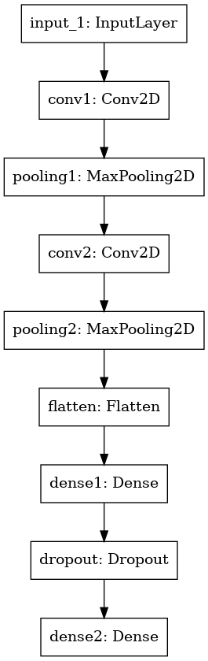

# Implement Image Classifiers

이번 포스트에서는 영상 분류 모델을 생성, 학습, 평가 코드 구현을 텐서플로와 파이토치 두 가지 프레임워크에서 배워보고자 한다.


## 1. Tensorflow2


### 1.1. Tensor Operation

텐서플로에서 모든 연산은 `tf.Tensor`라는 타입의 데이터로 진행된다. 텐서플로 뿐만 아니라 모든 파이썬 기반 딥러닝 프레임워크는 Numpy와 유사한 사용법을 가지므로 Numpy를 알고 있고 다차원 배열에 대한 개념만 확실하다면 사용상 어려움은 없다.  

`tf.Tensor`의 자세한 사용법은 이 튜토리얼에 자세히 나와있다. 그림과 함께 설명이 돼있어 이해하기 쉽다. Numpy에 아직 익숙하지 않은 사람은 정독이 필요하다.  

<https://www.tensorflow.org/guide/tensor>

다음은 Numpy 배열도 익숙하더라도 `tf.Tensor`를 사용하기 위해 알아야 할 내용을 간추린것이다.


#### immutable (불변 객체)

> All tensors are immutable like Python numbers and strings: you can never update the contents of a tensor, only create a new one.

`tf.Tensor`는 string 처럼 만들수만 있고 수정할 수는 없다. 파이썬에서 `word="hello"; word[2]='a'`  이런건 실행되지 않는다. 마찬가지로 어떤 텐서 객체가 있을 때 그 내부의 상태는 바꿀수 없고 그것을 수정한 **새로운** 텐서를 만들수밖에 없다.  

반면 Numpy 배열은 얼마든지 내부 원소들을 수정할 수 있다. 이것이 텐서와 Numpy의 가장 큰 차이점이다. 텐서는 내부 상태를 수정할 수 없으므로 연산을 통해서 원하는 상태를 가진 객체를 새로 만들어야 한다. 그래서 텐서 연산은 프로그래밍시 생각이 더 필요하고 코드도 조금 더 길어진다.


#### 생성 및 기본 속성 확인

```python
import tensorflow as tf
# create Tensor from List with specific type
tensor_a = tf.constant([[[1, 2, 3], [4, 5, 6]], [[7, 8, 9], [10, 11, 12]]], dtype=tf.int32)

print("Type of every element:", tensor_a.dtype)
print("Number of axes (=Rank):", tensor_a.ndim)
print("Shape of tensor:", tensor_a.shape)
print("Total number of elements: ", tf.size(tensor_a).numpy())
```

결과

```
Type of every element: <dtype: 'int32'>
Number of axes (=Rank): 3
Shape of tensor: (2, 2, 3)
Total number of elements:  tf.Tensor(12, shape=(), dtype=int32)
```


#### Numpy 변환

`tf.Tensor`와 `np.array` 사이의 변환은 다음과 같다.

```python
print("To numpy array:\n", x.numpy()[0])
print("Back to Tensor:", tf.convert_to_tensor(x.numpy())[0])
```

결과

```
To numpy array:
 [[1 2 3]
 [4 5 6]]
Back to Tensor: tf.Tensor(
[[1 2 3]
 [4 5 6]], shape=(2, 3), dtype=int32)
```


#### Shape 심화

텐서플로에는 Tensor의 shape을 확인하는 세 가지 방법이 있는데 1, 2번은 같고 3번은 타입과 성질이 다르다.

1. `some_tensor.shape` (TensorShape, static shape)
2. `some_tensor.get_shape()` (TensorShape, static shape)
3. `tf.shape(some_tensor)` (Tensor, dynamic shape)

기본 설정인 *eager mode*에서는 1~3 모두 결과가 같지만 `tf.function` 아래서는 결과가 달라질 수 있다.

```python
def print_tensor_shape(tensor, title):
    print(f"{title} 1) Tensor.shape:", tensor.shape, type(tensor.shape))
    print(f"{title} 2) Tensor.get_shape():", tensor.get_shape())
    print(f"{title} 3) tf.shape():", tf.shape(tensor))
    h, w = tensor[0, 0, 1], tensor[0, 0, 2]
    zeros = tf.zeros((h, w))
    print(f"{title} 4) Tensor.shape:", zeros.shape)
    print(f"{title} 5) Tensor.get_shape():", zeros.get_shape())
    print(f"{title} 6) tf.shape():", tf.shape(zeros))
    return tf.shape(zeros)

@tf.function
def print_tensor_shape_graph(tensor, title):
    return print_tensor_shape(tensor, title)

# Shape: The length (number of elements) of each of the axes of a tensor
print_tensor_shape(tensor_a, "eager")
shape6 = print_tensor_shape_graph(tensor_a, "graph")
print("graph 6-1) shape:", shape6)
shape6 = print_tensor_shape_graph(tensor_a, "graph")
shape6 = print_tensor_shape_graph(tensor_a, "graph")
```

결과

```
eager 1) Tensor.shape: (2, 2, 3) <class 'tensorflow.python.framework.tensor_shape.TensorShape'>
eager 2) Tensor.get_shape(): (2, 2, 3)
eager 3) tf.shape(): tf.Tensor([2 2 3], shape=(3,), dtype=int32)
eager 4) Tensor.shape: (2, 3)
eager 5) Tensor.get_shape(): (2, 3)
eager 6) tf.shape(): tf.Tensor([2 3], shape=(2,), dtype=int32)

graph 1) Tensor.shape: (2, 2, 3) <class 'tensorflow.python.framework.tensor_shape.TensorShape'>
graph 2) Tensor.get_shape(): (2, 2, 3)
graph 3) tf.shape(): Tensor("Shape:0", shape=(3,), dtype=int32)
graph 4) Tensor.shape: (None, None)
graph 5) Tensor.get_shape(): (None, None)
graph 6) tf.shape(): Tensor("Shape_1:0", shape=(2,), dtype=int32)
graph 6-1) shape: tf.Tensor([2 3], shape=(2,), dtype=int32)
```


결과를 보면 1)~3)은 eager 모드건 graph 모드(tf.function)건 결과가 같다. 4)~6)은 언제든 변할수 있는 텐서의 값을 이용해 `zeros`의 shape을 결정하므로 Tensor 객체가 생성된 시점이 아닌 연산이 실행된 시점에 결정된다.  

Eager 모드에서는 일반 파이썬 프로그램처럼 한줄씩 실행하므로 객체 생성과 동시에 연산을 수행한다. 그러므로 `zeros`의 shape을 바로 알 수 있다.  

반면 graph 모드에서는 미리 연산을 수행할 객체들을 미리 준비한 다음 연산을 실행하는데 `print()`가 실행되는 시점은 객체를 준비하는 시점이라서 shape이 None으로 나온다. (`print_tensor_shape_graph`을 세 번 실행하지만 출력은 한번씩 밖에 되지 않는다.)  

`print_tensor_shape_graph`의 return을 통해 `tf.function`을 벗어난 텐서는 실제 값을 가지게 되고 6-1) 처럼 정확한 shape이 나오는 것을 볼 수 있다. 이것은 `tf.shape()` 함수가 연산 당시의 **dynamic shape**을 출력하기 때문이다. 따라서 `tf.function`을 쓰면서 내부에서 값에 따라 크기가 달라지는 텐서를 만들때는 `tf.shape()` 함수를 쓰는게 낫다.  

- Tensor.get_shape(): <https://www.tensorflow.org/api_docs/python/tf/Tensor#get_shape>

- tf.shape(): <https://www.tensorflow.org/api_docs/python/tf/shape>


### 1.2. Keras Classifier

여기서는 텐서플로 내부의 Keras를 이용한 영상 분류 방법을 소개한다. Keras의 잘 만들어진 모듈들을 활용하면 간단한 분류 모델은 아주 짧은 코드로도 모델 정의, 학습, 평가까지 가능하다. 아래는 참고자료다.

- <https://www.tensorflow.org/tutorials/quickstart/beginner>
- <https://www.tensorflow.org/guide/keras/sequential_model>


#### a) 코드 구조

모든 프로그래밍을 할 때는 먼저 생각나는 것을 짜는 것이 아니라 최상위 구조를 먼저 정하고 점차 하부구조를 정하면서 구체적인 알고리즘까지 작성해야한다. 그래야 오류도 적고 코드를 수정할 일이 적어진다. 여기서 최상위 구조는 다음과 같이 작성한다. 이와같이 대강의 상위 함수들과 입출력 데이터만 정하고나서 함수들을 기계적으로 코딩하면 프로그램을 완성할 수 있다.  

```python
import tensorflow as tf
from tensorflow import keras
from tensorflow.keras import layers
import numpy as np
import pprint
from timeit import default_timer as timer

"""
Common utils
"""
class DurationTime:
    pass

def gpu_config():
    pass

def load_dataset(dataname="cifar10", show_imgs=True):
    pass

def show_samples(images, labels, class_names, grid=(3,4)):
    pass

"""
Classifier
"""
def tf2_keras_classifier():
    gpu_config()
    train_data, test_data = load_dataset()
    model = create_model(train_data)
    train_model(model, train_data)
    test_model(model, test_data)

def load_dataset():
    pass

def create_model(dataset):
    pass

def train_model(model, train_data, split_ratio=0.8):
	pass

def test_model(model, test_data):
	pass

if __name__ == "__main__":
    tf2_keras_classifier()
```


테스트 할 때 `Conv2D` 레이어 사용시 다음과 같은 에러가 나서 프로그램 시작시 `gpu_config()` 함수를 실행하였다. 

> tensorflow.python.framework.errors_impl.NotFoundError:  No algorithm worked!
> 	 [[node sequential/conv1/Conv2D (defined at /workspace/detlec/01_classifiers/tf_classifier_minimal.py:76) ]] [Op:__inference_train_function_760]

 `gpu_config()` 함수 내용은 학습하면서 사용하는 GPU 메모리를 확장할 수 있게 해준다.

```python
def gpu_config():
    gpus = tf.config.experimental.list_physical_devices('GPU')
    if gpus:
        try:
            # Currently, memory growth needs to be the same across GPUs
            for gpu in gpus:
                tf.config.experimental.set_memory_growth(gpu, True)
            logical_gpus = tf.config.experimental.list_logical_devices('GPU')
            print(len(gpus), "Physical GPUs,", len(logical_gpus), "Logical GPUs")
        except RuntimeError as e:
            # Memory growth must be set before GPUs have been initialized
            print(e)
```


#### b) 데이터 불러오기

`tf.keras.datasets`에는 머신러닝에서 예제로 많이 사용되는 다양한 데이터셋을 자체 제공한다. 데이터 목록은 아래 링크를 참고한다. 여기서는 **CIFAR-10** 데이터셋을 사용한다.

<https://www.tensorflow.org/api_docs/python/tf/keras/datasets>   

<https://www.cs.toronto.edu/~kriz/cifar.html>  

아래 `load_data` 함수에서는 일단 CIFAR-10 데이터셋만 불러올 수 있도록 만들었지만 MNIST 같은 다른 데이터셋으로도 확장 가능하다.

```python
def load_dataset(dataname="cifar10", show_imgs=True):
    if dataname == "cifar10":
        dataset = tf.keras.datasets.cifar10
        class_names = ('plane', 'car', 'bird', 'cat', 'deer', 'dog', 'frog', 'horse', 'ship', 'truck')
    else:
        raise ValueError(f"Invalid dataset name: {dataname}")

    (x_train, y_train), (x_test, y_test) = dataset.load_data()
    x_train, x_test = x_train / 255.0, x_test / 255.0
    y_train, y_test = y_train[:, 0], y_test[:, 0]
    print(f"Load {dataname} dataset:", x_train.shape, y_train.shape, x_test.shape, y_test.shape)
    if show_imgs:
        show_samples(x_train, y_train, class_names)
    return (x_train, y_train), (x_test, y_test)

def show_samples(images, labels, class_names, grid=(3,4)):
    plt.figure(figsize=grid)
    num_samples = grid[0] * grid[1]
    for i in range(num_samples):
        plt.subplot(grid[0], grid[1], i+1)
        plt.xticks([])
        plt.yticks([])
        plt.grid(False)
        plt.imshow(images[i])
        plt.xlabel(class_names[labels[i]])
    plt.show()
```


#### c) 모델 정의 (Sequential Model)

텐서플로에서 모델을 정의하는 방법은 크게 두 가지가 있다. `tf.keras.Sequential` 클래스를 사용하는 모델과 직접 텐서 연산의 흐름을 지정해주는 Functional API가 있다. Sequential 클래스를 사용하는 순차 모델은 매우 간단하게 모델을 정의할 수 있지만 일렬로 연결된 레이어로 이루어진 단순한 모델만 정의할 수 있다. 반면 Functional API를 사용하면 코드가 조금 늘어나지만 제약없이 원하는 형태의 모델을 정의할 수 있다. 텐서플로에서 다양한 Layer 클래스를 제공하므로 Functional API도 그렇게 어렵진 않다.

여기서는 간편한 순차 모델을 구현한다.  

```python
def create_model(dataset, use_add=True):
    x, y = dataset
    input_shape = tf.shape(x)[1:].numpy()
    num_class = tf.reduce_max(y).numpy() + 1
    print(f"[create_model] input shape={input_shape}, num_class={num_class}")

    if use_add:
        model = keras.Sequential(name="tf-classifier")
        model.add(layers.Input(shape=input_shape))
        model.add(layers.Conv2D(filters=32, kernel_size=3, padding="same", activation="relu", name="conv1"))
        model.add(layers.MaxPool2D(pool_size=(2, 2), name="pooling1"))
        model.add(layers.Conv2D(filters=64, kernel_size=3, padding="same", activation="relu", name="conv2"))
        model.add(layers.MaxPool2D(pool_size=(2, 2), name="pooling2"))
        model.add(layers.Flatten(name="flatten"))
        model.add(layers.Dense(units=100, activation="relu", name="dense1"))
        model.add(keras.layers.Dropout(0.2))
        model.add(layers.Dense(units=num_class, activation="softmax", name="dense2"))
    else:
        model = keras.Sequential([
            layers.Conv2D(filters=32, kernel_size=3, padding="same", activation="relu", input_shape=input_shape, name="conv1"),
            layers.MaxPool2D(pool_size=(2, 2), name="pooling1"),
            layers.Conv2D(filters=64, kernel_size=3, padding="same", activation="relu", name="conv2"),
            layers.MaxPool2D(pool_size=(2, 2), name="pooling2"),
            layers.Flatten(name="flatten"),
            layers.Dense(units=100, activation="relu", name="dense1"),
            keras.layers.Dropout(0.2),
            layers.Dense(units=num_class, activation="softmax", name="dense2"),
            ],
            name="tf-classifier")
    model.summary()
    keras.utils.plot_model(model, "tf-clsf-model.png")
    return model
```

**순차 모델을 정의하는 방법**도 두 가지가 있다. 위 함수에서는 `use_add` 옵션을 통해 둘 중 하나를 고를 수 있게 했다.  

- `model.add()` 함수를 통해 레이어를 하나씩 추가하기
- `keras.Sequential` 클래스 생성자에 레이어 객체들을 `list`로 한번에 넣기

모델을 정의할 때 입력 shape을 정할수도 있고 않을수도 있는데, 정하지 않으면 모델 내부의 텐서 크기가 결정되지 않으므로 밑에서 `model.summary()`에서 에러가 난다. **입력 shape을 지정하는 방법**도 두 가지가 있다.

- `layers.Input`을 첫 번째 레이어로 추가
- 첫 번째 연산 레이어에서 `input_shape` 옵션을 지정

레이어의 **activation**은 `tf.keras.activations` 아래의 클래스 객체를 입력해도 되고 각 클래스를 나타내는 문자열을 입력해도 된다. 입력가능한 activation 종류는 아래 링크에 있다. activation의 기본 값은 "linear"로 출력된 값을 그대로 내보내는 것이다.

<https://keras.io/api/layers/activations/>  

`model.summary()`를 실행하면 현재 정의된 모델의 구조를 깔끔하게 터미널에서 보여준다. 실행 결과는 다음과 같다.

```
Model: "tf-classifier"
_________________________________________________________________
Layer (type)                 Output Shape              Param #   
=================================================================
conv1 (Conv2D)               (None, 32, 32, 32)        896       
_________________________________________________________________
pooling1 (MaxPooling2D)      (None, 16, 16, 32)        0         
_________________________________________________________________
conv2 (Conv2D)               (None, 16, 16, 64)        18496     
_________________________________________________________________
pooling2 (MaxPooling2D)      (None, 8, 8, 64)          0         
_________________________________________________________________
flatten (Flatten)            (None, 4096)              0         
_________________________________________________________________
dense1 (Dense)               (None, 100)               409700    
_________________________________________________________________
dropout (Dropout)            (None, 100)               0         
_________________________________________________________________
dense2 (Dense)               (None, 10)                1010      
=================================================================
Total params: 430,102
Trainable params: 430,102
Non-trainable params: 0
_________________________________________________________________
```


`keras.utils.plot_model` 함수는 모델의 그래프 구조를 그림으로 그려준다. 실행 결과는 다음과 같다.




#### d) 학습

Keras에서 분류 모델은 `model.fit()` 함수로 간단히 학습이 가능하다. 그 전에 학습 데이터를 실제 학습용과 검증(validation)용으로 나누어 학습중에 overfitting이 일어나는지 확인한다. 모델을 학습시킬 loss와 optimizer는 `model.compile()` 함수에서 미리 입력한다.  

```python
def train_model(model, train_data, split_ratio=0.8):
    x, y = train_data
    trainlen = int(tf.shape(x)[0].numpy() * split_ratio)
    x_train, y_train = x[:trainlen], y[:trainlen]
    x_val, y_val = x[trainlen:], y[trainlen:]

    model.compile(
        loss=keras.losses.SparseCategoricalCrossentropy(),
        optimizer=keras.optimizers.RMSprop(),
        metrics=[keras.metrics.SparseCategoricalAccuracy()],
    )

    with DurationTime("** training time") as duration:
        history = model.fit(x_train, y_train, batch_size=32, epochs=5, validation_data=(x_val, y_val))
    history = {key: np.array(values) for key, values in history.history.items()}
    np.set_printoptions(precision=4, suppress=True)
    pp = pprint.PrettyPrinter(indent=2, width=100, compact=True)
    print("[train_model] training history:")
    pp.pprint(history)
```


학습을 하고 나면 history 객체가 나오는데 `history.history`에는 학습하면서 epoch마다 계산한 평균 loss와 metric(accuracy)이 저장되어 있다. 실행 결과는 다음과 같다. 결과를 보면 학습이 진행됨에 따라 학습 데이터와 검증 데이터에서 모두 loss는 줄어들고 accuracy는 늘어나는 것을 볼 수 있다.

```
Epoch 1/5
1250/1250 [==============================] - 4s 2ms/step - loss: 1.7264 - sparse_categorical_accuracy: 0.3778 - val_loss: 1.1578 - val_sparse_categorical_accuracy: 0.5921
Epoch 2/5
1250/1250 [==============================] - 2s 2ms/step - loss: 1.1409 - sparse_categorical_accuracy: 0.5991 - val_loss: 0.9853 - val_sparse_categorical_accuracy: 0.6565
Epoch 3/5
1250/1250 [==============================] - 2s 2ms/step - loss: 0.9722 - sparse_categorical_accuracy: 0.6597 - val_loss: 1.0722 - val_sparse_categorical_accuracy: 0.6253
Epoch 4/5
1250/1250 [==============================] - 2s 2ms/step - loss: 0.8693 - sparse_categorical_accuracy: 0.6976 - val_loss: 0.9583 - val_sparse_categorical_accuracy: 0.6853
Epoch 5/5
1250/1250 [==============================] - 2s 2ms/step - loss: 0.7831 - sparse_categorical_accuracy: 0.7288 - val_loss: 0.9265 - val_sparse_categorical_accuracy: 0.6882
** training time: 13.19
[train_model] training history:
{ 'loss': array([1.5012, 1.1168, 0.9691, 0.8737, 0.8066]),
  'sparse_categorical_accuracy': array([0.4628, 0.608 , 0.6622, 0.6961, 0.7221]),
  'val_loss': array([1.1578, 0.9853, 1.0722, 0.9583, 0.9265]),
  'val_sparse_categorical_accuracy': array([0.5921, 0.6565, 0.6253, 0.6853, 0.6882])}
```


##### Context Manager

`train_model()` 함수에서는 학습에 걸린 시간을 context manager를 이용해 측정한다. Context manager를 이용하면 `with` 블럭의 시작과 종료시에 할 일을 정의할 수 있다. 주로 파일 입출력을 할 때처럼 시작할 때 자원을 할당하고 나갈때 자원을 해제하는 용도로 쓰이지만 필요에 따라 다양하게 응용할 수 있다.  

Context manager는 주로 클래스로 구현되며 다음 두 개의 매직 메소드(magic method)를 반드시 구현해야 한다.

- `__enter__()`: `with` 블럭을 들어갈 때 실행되고 함수의 리턴 값이 `as` 뒤에 붙는 변수로 들어간다.
- `__exit__(type, value, trace_back)`: `with` 블럭을 나가거나 내부에서 예외 발생시 실행된다. 주로 할당한 자원을 해제하거나 예외처리 기능을 한다.

Context manager 예제는 다음 링크에서 볼 수 있다: <https://planbs.tistory.com/entry/Python-Context-Manager>  

여기서는 `DurationTime`이라는 context manager를 만들어서 학습에 걸린 시간을 측정했는데 관련 코드는 다음과 같다.

```python
class DurationTime:
    def __init__(self, context):
        self.start = 0
        self.context = context

    def __enter__(self):        # entering 'with' context
        self.start = timer()
        return self             # pass object by 'as'

    def __exit__(self, type, value, trace_back):    # exiting 'with' context
        print(f"{self.context}: {timer() - self.start:1.2f}")

def train_model(model, train_data, split_ratio=0.8):
    ...
    with DurationTime("** training time") as duration:
        history = model.fit(x_train, y_train, batch_size=32, epochs=5, validation_data=(x_val, y_val))
```

만약 context manager를 쓰지 않았다면 이렇게 시간을 측정했을 것이다.

```python
def train_model(model, train_data, split_ratio=0.8):
    ...
    start = timer()
    history = model.fit(x_train, y_train, batch_size=32, epochs=5, validation_data=(x_val, y_val))
    print(f"** trainig time: {timer() - start:1.2f}")
```

이게 코드가 덜 들어가는 것처럼 보이지만 시간을 측정해야 하는 상황이 여러번 생긴다면 측정해야 하는 라인들 앞뒤로 짝을 맞춰서 두 줄씩 코딩을 해야한다. 아래 예시를 보자.  

**짝 맞춰 코딩**

```python
def some_func():
    start_total = timer()
    start = timer()
    sub_func1()
    print(f"elapsed time1:", timer() - start)
    start = timer()
    sub_func1()
    print(f"elapsed time2:", timer() - start)
    print(f"total elapsed time:", timer() - start_total)
```

**Context Manager 사용**

```python
def some_func():
    with DurationTime("total elapsed time"):
        with DurationTime("elased time1"):
            sub_func1()
        with DurationTime("elased time1"):
            sub_func1()
```

어느 쪽이 보기 편하고 이해가 잘되는가? 프로그램의 중요 흐름에 상관 없는 불필요한 코드가 많아지면 보기에도 안좋고 코드의 가독성이 떨어진다. 그리고 이렇게 짝을 맞춰서 코딩하는 것은 실수를 유발하기 때문에 좋지 않다. C++에서 `new`와 `delete` 짝을 맞춰야 하는 문제 때문에 스마트 포인터가 나왔다는 것을 기억하자. Context manger를 이용하면 들여쓰기로 인해 context의 범위가 명확히 보이고 코드가 입체적으로 구조화되어 가독성이 좋아진다.


#### e) 평가

Keras에서 분류 모델의 정확도는 `model.evaluate()` 함수로 계산할 수 있다. 여기서는 `model.predict()`도 실행하여 분류 결과를 확인하고 직접 분류 정확도까지 계산해보았다.

```python
def test_model(model, test_data):
    x_test, y_test = test_data
    print("[test_model] evaluate by model.evaluate()")
    loss, accuracy = model.evaluate(x_test, y_test)
    print(f"  test loss: {loss:1.4f}")
    print(f"  test accuracy: {accuracy:1.4f}")
    print("[test_model] predict by model.predict()")
    predicts = model.predict(x_test)
    print("  prediction shape:", predicts.shape, y_test.shape)
    print("  first 5 predicts:\n", predicts[:5])
    print("  check probability:", np.sum(predicts[:5], axis=1))
    print("  manual accuracy:", np.mean(np.argmax(predicts, axis=1) == y_test[:, 0]))
```

실행 결과는 다음과 같다.

```
[test_model] evaluate by model.evaluate()
313/313 [==============================] - 0s 1ms/step - loss: 0.9836 - sparse_categorical_accuracy: 0.6900
  test loss: 0.9836
  test accuracy: 0.6900
[test_model] predict by model.predict()
  prediction shape: (10000, 10) (10000, 1)
  first 5 predicts:
 [[0.     0.0001 0.0002 0.8378 0.     0.1569 0.0015 0.     0.0033 0.    ]
 [0.0061 0.6021 0.     0.     0.     0.     0.     0.     0.386  0.0059]
 [0.1751 0.0102 0.0009 0.     0.0001 0.     0.     0.0001 0.8116 0.0021]
 [0.8108 0.0005 0.0021 0.     0.0002 0.     0.     0.     0.1864 0.    ]
 [0.     0.     0.0117 0.0177 0.273  0.0005 0.6971 0.     0.     0.    ]]
  check probability: [1. 1. 1. 1. 1.]
  manual accuracy: 0.69
```


### 1.3. Advanced Model

Keras를 활용하면 편리한 점도 있지만 학습 과정이 `model.fit()`이란 함수 안에서 일어나기 때문에 학습이 잘못됐을 때 어디서 무엇이 잘못됐는지 알기 어렵다. 학습 과정 중에 중간 결과물을 저장하고 싶거나 체크포인트를 저장하고 싶으면 `model.fit()` 함수에 callback 객체들을 넣으면 되긴된다. 하지만 여러가지 callback 객체의 사용법을 익히는것도 번거롭고 딱 내가 원하는대로 하기 어려운 경우도 있다. Keras에서 주어지는 loss나 metric도 검출 모델을 학습하는데는 적합하지 않기 때문에 어차피 따로 만들어줘야 한다. 다음은 관련된 Keras 링크다.

- <https://keras.io/api/callbacks/>
- <https://keras.io/api/losses/>
- <https://keras.io/api/metrics/>

그러므로 검출 모델과 같이 복잡한 모델을 구현할 때는 Keras API는 모델을 정의하는 레이어 객체를 만드는 정도에만 사용하고 loss나 metric 등의 계산은 텐서플로의 함수들을 사용한다. 검출기와 같이 복잡한 모델을 학습하기 위해서는 아래와 같은 텐서플로의 고급 사용법들을 익혀야 한다.

1. Keras functional API: 일렬 연결이 아닌 복잡한 구조의 모델 정의
2. tf.GradientTape: loss에 대한 미분을 명시적으로 계산하여 모델 weight 업데이트
3. tf.function: 모델을 eager 모드가 아닌 정적 그래프에서 실행하여 학습 속도 증가
4. tf.data.Dataset: 파일이나 메모리에서 데이터를 불러와 반복 가능한 객체로 만들어 학습 과정에 데이터 주입


#### a) 코드 구조

코드의 전체적인 흐름은 Keras Classifier와 유사하다. 하지만 이번에는 `AdvancedClassifier`라는 클래스를 만들어서 분류 모델에 관련된 코드들을 응집시켰다. **Common Utils** 아래의 코드는 위와 동일하다. 또 한가지 차이점은 `@tf.function` 데코레이터를 사용했다는 것이다. 자세한 내용은 아래 내용을 참고한다.  

```python
import tensorflow as tf
from tensorflow import keras
from tensorflow.keras import layers
import numpy as np
from timeit import default_timer as timer

"""
Common utils
"""
class DurationTime:
    pass

def load_dataset(dataname="cifar10", show_imgs=True):
    pass

def show_samples(images, labels, class_names, grid=(3,4)):
    pass

"""
Classifier
"""
class AdvancedClassifier:
    def __init__(self, batch_size=32, val_ratio=0.2):
        pass
    
    def build_model(self, x, y):
        pass
    
    def train(self, x, y, epochs, eager_mode=True):
        pass
    
    @tf.function
    def train_batch_graph(self, x_batch, y_batch):
        pass

    def evaluate(self, x, y_true, verbose=True):
        pass

def tf2_advanced_classifier():
    gpu_config()
    (x_train, y_train), (x_test, y_test) = load_dataset("cifar10")
    clsf = AdvancedClassifier()
    clsf.build_model(x_train, y_train)
    clsf.train(x_train, y_train, 5)
    clsf.evaluate(x_test, y_test)

if __name__ == "__main__":
    tf2_advanced_classifier()
```


#### b) 클래스 초기화

생성자 함수에서는 학습에 필요한 객체를 생성하고 설정 값들을 저장한다. 모델은 이후 `build_model()`이란 함수에서 정의할 것이지만 파이참의 자동완성을 위해 생성자에서 기본 객체를 만들어둔다. Loss와 optimizer 객체는 이전 코드와 동일하게 선택하였다. 

```python
    def __init__(self, batch_size=32, val_ratio=0.2):
        self.model = keras.Model()
        self.loss_object = tf.keras.losses.SparseCategoricalCrossentropy()
        self.optimizer = tf.keras.optimizers.RMSprop()
        self.batch_size = batch_size
        self.val_ratio = val_ratio
```


#### c) 모델 정의 (Functional API)

여기서는 모델을 순차 모델이 아닌 Funtional API를 이용해 구현한다. Funtional API는 각 레이어의 입력과 출력을 명시적으로 지정하므로 어느 레이어의 출력이 어느 레이어의 입력이 되는지 명확히 볼 수 있다. 또한 레이어 사이의 연결이 자유로워져서 Inception 모듈처럼 여러 갈래로 갈라지는 모델이나 출력이 여러 개인 모델도 만들 수 있다.  

여기서 레이어 객체들을 마치 함수처럼 쓰는 것을 볼 수 있는데 이런 것을 callable 객체, 혹은 functor라고도 한다. 클래스 내부에 `__call__()` 함수가 정의되어 있으면 함수 이름없이 바로 `__call__()`의 입력인자를 넣으면 `__call__()`이 실행된다. 텐서플로에는 어떤 클래스에서 외부에서 사용되는 함수가 하나뿐인 경우 이렇게 callable을 사용하는 경우가 많다. `tf.keras.Model` 클래스도 `model.predict(x)` 함수를 이용해 출력을 계산할 수 있지만 `model(x)`도 동일하게 작동한다. 이는 객체지향의 단일 책임 원칙(SRP, Single Responsibility Principle)에도 부합하며 클래스의 의도를 명확하게 보여준다.  

레이어를 다 연결하고 나서 `tf.keras.Model` 클래스를 이용해 모델의 입력과 출력 텐서를 지정하면 그 사이의 연산 그래프가 모델 내부로 들어가서 특정한 연산을 하는 모델이 정의된다.

```python
    def build_model(self, x, y):
        input_shape = x.shape[1:]
        num_class = tf.reduce_max(y).numpy() + 1
        input_tensor = layers.Input(shape=input_shape)
        x = layers.Conv2D(filters=32, kernel_size=3, padding="same", activation="relu", name="conv1")(input_tensor)
        x = layers.MaxPool2D(pool_size=(2, 2), name="pooling1")(x)
        x = layers.Conv2D(filters=64, kernel_size=3, padding="same", activation="relu", name="conv2")(x)
        x = layers.MaxPool2D(pool_size=(2, 2), name="pooling2")(x)
        x = layers.Flatten(name="flatten")(x)
        x = layers.Dense(units=100, activation="relu", name="dense1")(x)
        x = layers.Dropout(0.2)(x)
        output_tensor = layers.Dense(units=num_class, activation="softmax", name="dense2")(x)
        self.model = keras.Model(inputs=input_tensor, outputs=output_tensor, name="tf-classifier")
        self.model.summary()
        keras.utils.plot_model(self.model, "tf-clsf-model-adv.png")
```

실행 결과는 이전 결과와 같다.

```
Model: "tf-classifier"
_________________________________________________________________
Layer (type)                 Output Shape              Param #   
=================================================================
input_1 (InputLayer)         [(None, 32, 32, 3)]       0         
_________________________________________________________________
conv1 (Conv2D)               (None, 32, 32, 32)        896       
_________________________________________________________________
pooling1 (MaxPooling2D)      (None, 16, 16, 32)        0         
_________________________________________________________________
conv2 (Conv2D)               (None, 16, 16, 64)        18496     
_________________________________________________________________
pooling2 (MaxPooling2D)      (None, 8, 8, 64)          0         
_________________________________________________________________
flatten (Flatten)            (None, 4096)              0         
_________________________________________________________________
dense1 (Dense)               (None, 100)               409700    
_________________________________________________________________
dropout (Dropout)            (None, 100)               0         
_________________________________________________________________
dense2 (Dense)               (None, 10)                1010      
=================================================================
Total params: 430,102
Trainable params: 430,102
Non-trainable params: 0
_________________________________________________________________
```


#### d) 학습

이전 코드에서는 `model.fit()`만 사용하면 학습이 되었지만 학습 과정을 자세히 들여다보긴 어려웠다. Loss 함수가 복잡해지고 학습 과정을 디버깅해야 한다면 `tf.GradientTape()`을 이용해 학습 과정을 직접 프로그래밍 해주는 것이 나을 것이다. 아래  `train()` 함수에서는 주로 학습 전후의 데이터 준비 및 성능 평가를 하고 실제 학습은 `train_batch_graph()` 함수에서 일어난다. 코드의 의미는 주석을 참고한다.

```python
    def train(self, x, y, epochs):
        trainlen = int(x.shape[0] * (1 - self.val_ratio))
        x_train, y_train = x[:trainlen], y[:trainlen]
        x_val, y_val = x[trainlen:], y[trainlen:]

        dataset = tf.data.Dataset.from_tensor_slices((x_train, y_train))
        dataset = dataset.shuffle(200).batch(self.batch_size)
        with DurationTime("** training time") as duration:
            for epoch in range(epochs):
                for x_batch, y_batch in dataset:
                    self.train_batch_graph(x_batch, y_batch)
                loss, accuracy = self.evaluate(x_val, y_val, verbose=False)
                print(f"[Training] epoch={epoch}, val_loss={loss}, val_accuracy={accuracy}")
```

실행 결과

```
[Training] epoch=0, val_loss=1.2970373630523682, val_accuracy=0.5541
[Training] epoch=1, val_loss=1.0697484016418457, val_accuracy=0.6177
[Training] epoch=2, val_loss=0.9729103446006775, val_accuracy=0.6611
[Training] epoch=3, val_loss=0.9531869292259216, val_accuracy=0.6713
[Training] epoch=4, val_loss=0.9794153571128845, val_accuracy=0.6702
** training time: 17.34
```


##### tf.data.Dataset

`train()` 함수에서 눈여겨 봐야 할 것은 `tf.data.Dataset` 객체다. `Dataset`은 텐서플로에서 데이터 입력 파이프라인을 최적화시켜주는 클래스다. 다양한 형태의 입력 데이터를 일정한 단위로 뽑아서 사용할 수 있게 해주고 다양한 전처리를 적용할 수 있다.

메모리에 올려진 List나 Numpy 데이터를 사용할 경우 `tensor_from_slices()` 함수를 이용한다. 리턴된 `dataset` 객체는 for문에서 반복이 가능하다. 그리고 `shuffle()` 이나 `batch()` 함수를 통해 데이터를 섞거나 배치 단위로 묶을수 있다. 위 코드에서는 학습 데이터의 순서를 섞고 `self.batch_size` (32개) 단위로 데이터를 묶어서 보낸다. 학습은 5 에폭을 반복하는데 이것도 사실 `repeat(5)` 함수까지 붙이면 `dataset` 객체가 한번의 for문에서 5 에폭을 반복할 수 있다. 하지만 1에폭이 끝날때마다 성능을 확인하기 위해 사용하지 않았다.  

`Dataset`에 대한 자세한 내용은 아래 링크에서 볼 수 있고 다음 강의에서 더 자세히 다룰 예정이다.

<https://www.tensorflow.org/guide/data>

 

##### tf.function

텐서플로의 기본 모드인 eager 모드는 마치 Numpy 연산을 하듯 모든 라인을 한줄씩 파이썬 인터프리터에서 실행하고 모든 중간 결과를 확인할 수 있다. 반면 어떤 함수에 `@tf.function` 데코레이터가 붙으면...

- 해당 함수와 그 아래에서 불러지는 모든 함수에서 실행되는 모든 텐서 연산들이 텐서플로 내부적으로 최적화된다. 연산 과정 자체가 더 빠르게 실행될 수 있도록 변한다.
- 매 연산마다 그때그때 메모리를 준비하는 것이 아니라 전체 연산에 필요한 모든 메모리를 미리 준비해서 정적 그래프를 만들어놓고 입력 데이터가 연산 그래프를 따라 흘러가게 한다. 
- GPU 연산을 하는 경우 eager 모드에서는 매 연산마다 메인 메모리(RAM)에서 GPU로 데이터를 보내고 결과를 다시 받아와야 하지만 graph 모드에서는 연산을 모두 마친 후에 최종 결과만 받는다.

작은 모델에서는 graph 모드가 효과가 없거나 더 느려질수도 있지만 복잡한 모델에서는 graph 모드의 속도가 훨씬 빨라질 수 있다. 모델마다 다르지만 개인적인 경험으로 많이 사용되는 CNN에서 2배 이상 빨라지는 것을 경험했다. 하지만 현재 예제에서는 모델이 작기 때문에 오히려 속도가 느려지는 것을 확인하였다. 그리고 `Dataset` 객체를 만드는 과정까지 graph 모드에 넣으면 추가적인 최적화를 할 수 있다. 참고로 `model.fit()` 함수에서는 모든 최적화가 이미 적용되어 있다.

다음은 graph 모드와 관련된 링크다.

- <https://www.tensorflow.org/guide/intro_to_graphs>
- <https://www.tensorflow.org/guide/function>
- <https://www.tensorflow.org/guide/graph_optimization>


##### tf.GradientTape

실제 학습 함수는 다음과 같다.

```python
    @tf.function
    def train_batch_graph(self, x_batch, y_batch):
        with tf.GradientTape() as tape:
            # training=True is only needed if there are layers with different
            # behavior during training versus inference (e.g. Dropout).
            predictions = self.model(x_batch, training=True)
            loss = self.loss_object(y_batch, predictions)
        gradients = tape.gradient(loss, self.model.trainable_variables)
        self.optimizer.apply_gradients(zip(gradients, self.model.trainable_variables))
```


위 함수에서는 `tf.GradientTape`을 이용해 학습을 진행한다. GradientTape이란 말처럼 이는 해당 context 아래서 발생하는 모든 연산의 미분값을 기록한다. 여기서는 모델의 입력에서 출력이 나오고 출력으로부터 손실 함수를 계산하는 것까지 context에서 계산하였다. 왜냐하면 loss 값을 모델의 파라미터(weights)에 대해서 미분해야하기 때문이다. `tape.gradient()` 함수에 미분의 분자, 분모 변수를 지정하면 미분값들을 가져올 수 있다. 그리고 이 미분값들을 optimizer에 적용하면 모델의 파라미터가 업데이트된다.  

GradientTape에 대한 자세한 내용은 다음 링크를 참조한다.  

- <https://www.tensorflow.org/guide/autodiff>
- <https://www.tensorflow.org/guide/keras/customizing_what_happens_in_fit>
- <https://www.tensorflow.org/guide/keras/writing_a_training_loop_from_scratch>


#### e) 평가

성능 평가 함수는 이전과 크게 다르지 않다. 여기서는 모델의 출력을 `model.predict()` 함수가 아닌 `model.__call__()` 함수를 이용하여 객체를 직접 불렀다. Loss와 accuracy를 계산하여 리턴한다.

```python
    def evaluate(self, x, y_true, verbose=True):
        if verbose:
            print("[evaluate] predict by model.__call__()")
        y_pred = self.model(x)
        accuracy = np.mean(np.argmax(y_pred, axis=1) == y_true)
        loss = self.loss_object(y_true, y_pred)
        if verbose:
            np.set_printoptions(precision=4, suppress=True)
            print("  prediction shape:", y_pred.shape, y_true.shape)
            print("  first 5 predicts:\n", y_pred[:5].numpy())
            print("  check probability:", np.sum(y_pred[:5], axis=1))
            print(f"  loss={loss:1.4f}, accuracy={accuracy:1.4f}")
        return loss, accuracy
```

실행 결과

```
[evaluate] predict by model.__call__()
  prediction shape: (10000, 10) (10000, 1)
  first 5 predicts:
 [[0.     0.     0.     0.7727 0.     0.2271 0.0001 0.     0.     0.    ]
 [0.0048 0.0774 0.     0.     0.     0.     0.     0.     0.9147 0.0032]
 [0.2223 0.1069 0.0066 0.0323 0.0007 0.0035 0.0003 0.0006 0.5874 0.0393]
 [0.7653 0.0052 0.0941 0.0004 0.0076 0.     0.     0.     0.1274 0.0001]
 [0.     0.0009 0.0188 0.185  0.3672 0.0141 0.4137 0.     0.0001 0.0001]]
  check probability: [1. 1. 1. 1. 1.]
  loss and accuracy: tf.Tensor(0.9907759, shape=(), dtype=float32) 0.6779
```


## 2. Pytorch


### 2.1. Tensor Operation

파이토치의 `torch.tensor`는 텐서플로의 `tf.Tensor`보다 더 Numpy의 `np.ndarray`를 닮아서 더욱 공부할게 없다. 텐서플로와는 달리 파이토치의 텐서는 Numpy처럼 **mutable** 객체라서 텐서의 일부를 수정할 수 있다. 그 외 사소한 차이로 일부 함수의 이름이 다르다는 것이다.

| Numpy                 | Tensorflow            | Pytorch         |
| --------------------- | --------------------- | --------------- |
| concatenate           | concat                | cat             |
| expand_dims           | expand_dims           | unsqueeze       |
| tensor[np.newaxis, :] | tensor[np.newaxis, :] | tensor[None, :] |
| transpose             | transpose             | movedim         |

그리고 텐서 연산 함수를 쓰는 방법이 약간 다르다. 더하기 연산이라고 하면 `np.add(a, b)`, `tf.add(a, b)` 처럼 `torch.add(a, b)`도 가능하지만 `a.add(b)`도 가능하다.  

나머지 사용법은 아래 링크를 한번 읽어보면 알 수 있다.

<https://pytorch.org/tutorials/beginner/blitz/tensor_tutorial.html#sphx-glr-beginner-blitz-tensor-tutorial-py>


### 2.2. Image Classification

이미지 분류 모델은 아래 링크를 참고하였으나 텐서플로 모델과 동일하게 구현하였고 코드 구조도 비슷하게 유지하였다.

<https://pytorch.org/tutorials/beginner/blitz/cifar10_tutorial.html#sphx-glr-beginner-blitz-cifar10-tutorial-py>


#### a) 코드 구조

텐서플로의 `AdvancedClassifier`와 전반적인 코드 구조는 유지하되 파이토치 스타일에 맞춰 모델 정의 부분만 `TorchClsfModel`라는 다른 클래스로 분리하였다. 유틸리티인 `DurationTime`과 `show_samples`는 위와 동일하다.

```python
import torch
import torchvision
import torchvision.transforms as transforms
import torch.nn as nn
import torch.nn.functional as F
import torch.optim as optim
import numpy as np
import matplotlib.pyplot as plt
from timeit import default_timer as timer
"""
Common utils
"""
class DurationTime:
    pass

def load_dataset(dataname="cifar10", show_imgs=False):
    pass

def show_samples(images, labels, class_names, grid=(3,4)):
    pass
"""
Classifier
"""
class TorchClsfModel(nn.Module):
    def __init__(self):
        pass

    def forward(self, x):
        pass

class TorchClassifier:
    def __init__(self, model, batch_size=32, val_ratio=0.2):
        pass
    
    def train(self, x, y, epochs):
        pass

    def train_batch(self, x_batch, y_batch):
        pass

    def evaluate(self, x, y_true, verbose=True):
        pass

def torch_classifier():
    (x_train, y_train), (x_test, y_test) = load_dataset("cifar10")
    model = TorchClsfModel()
    clsf = TorchClassifier(model)
    clsf.train(x_train, y_train, 5)
    clsf.evaluate(x_test, y_test)

if __name__ == "__main__":
    torch_classifier()
```


#### b) 데이터 불러오기

파이토치에서 데이터를 한 단위씩 꺼내거나 읽는 기능은 `torch.utils.data.Dataset` 클래스를 상속한 클래스에서 구현한다. 데이터를 학습에 사용하기 위해서는 batching, shuffling, transform (pre-process), multi-threading 등의 기능이 필요한데 이를 `torch.utils.data.DataLoader` 클래스에서 제공한다. Dataset 상속 클래스로 데이터를 읽고 DataLoader 클래스를 통해 학습 데이터를 제공하는 것이다. 자세한 내용은 아래 링크에서 볼 수 있다.  

<https://pytorch.org/tutorials/beginner/data_loading_tutorial.html>

Dataset과 DataLoader에 대한 자세한 내용은 다음에 다루고 여기서는 파이토치에서 제공하는 데이터셋 모듈을 이용해 데이터를 다운받고 numpy 형식의 원본 데이터를 출력한다.

```python
def load_dataset(dataname="cifar10", show_imgs=False):
    if dataname == "cifar10":
        trainset = torchvision.datasets.CIFAR10(root='./data', train=True, download=True)
        testset = torchvision.datasets.CIFAR10(root='./data', train=False, download=True)
        class_names = ('plane', 'car', 'bird', 'cat', 'deer', 'dog', 'frog', 'horse', 'ship', 'truck')
    else:
        raise ValueError(f"Invalid dataset name: {dataname}")

    # pytorch uses image shape like (batch, channel, height, width)
    x_train = np.transpose(np.array(trainset.data), (0, 3, 1, 2))
    y_train = np.array(trainset.targets)
    x_test = np.transpose(np.array(testset.data), (0, 3, 1, 2))
    y_test = np.array(testset.targets)
    x_train, x_test = x_train / 255.0 * 2. - 1., x_test / 255.0 * 2. - 1.
    print(f"Load {dataname} dataset:", x_train.shape, y_train.shape, x_test.shape, y_test.shape)
    if show_imgs:
        show_samples(trainset.data, trainset.targets, class_names)
    return (x_train, y_train), (x_test, y_test)
```

실행 결과

```
Files already downloaded and verified
Files already downloaded and verified
Load cifar10 dataset: (50000, 3, 32, 32) (50000,) (10000, 3, 32, 32) (10000,)
```

여기서 유의할 점은 **이미지를 transpose를 통해 차원 순서를 바꾼다**는 것이다. 텐서플로에서는 (batch, height, width, channel) 형태의 shape을 주로 사용하지만 파이토치에서는 (batch, channel, height, width) 형태의 shape을 사용한다. 텐서플로에서도 channel을 앞에 두는 데이터를 처리할 수 있다. [tf.keras.layers.Conv2D](https://www.tensorflow.org/api_docs/python/tf/keras/layers/Conv2D) 클래스를 보면 `data_format`이란 옵션이 있는데 **"channel_last"**(default)나 **"channel_first"** 옵션을 넣을 수 있다. 확인해보진 않았지만 텐서플로에서도 channel_first를 쓰면 연산이 더 빨리 된다는 얘기가 있다. 하지만 opencv나 matplotlib 등 대부분의 이미지를 다루는 다른 패키지에서 channel_last를 쓰기 때문에 자주 변환을 해줘야 하는 불편함이 있다.  


#### c) 모델 정의

##### 모델 클래스 선언

파이토치에서 일반적으로 모델을 정의하는 방법은 다음과 같다.

1. `torch.nn.Module`을 상속하는 클래스를 만든다.
2. `__init__(self, ...)` 함수에서 레이어 객체를 멤버 변수로 미리 선언한다.
3. `forward(self, x)` 함수를 만들어 입력(x)을 받아 출력을 계산하여 리턴한다.

이와 같은 방법으로 아래 클래스를 작성하였다. 레이어 구성은 텐서플로 구현과 동일하다.

```python
class TorchClsfModel(nn.Module):
    def __init__(self):
        super(TorchClsfModel, self).__init__()
        self.conv1 = nn.Conv2d(in_channels=3, out_channels=32, kernel_size=3, padding=1, padding_mode='zeros')
        self.pool1 = nn.MaxPool2d(kernel_size=2, stride=2)
        self.conv2 = nn.Conv2d(32, 64, 3, padding=1, padding_mode='zeros')
        self.pool2 = nn.MaxPool2d(2, 2)
        self.fc1 = nn.Linear(64 * 8 * 8, 100)
        self.fc2 = nn.Linear(100, 10)
        self.softmax = nn.Softmax()

    def forward(self, x):
        x = self.pool1(F.relu(self.conv1(x)))
        x = self.pool2(F.relu(self.conv2(x)))
        x = x.view(-1, 64 * 8 * 8)
        x = F.relu(self.fc1(x))
        x = F.dropout(x)
        x = F.softmax(self.fc2(x), dim=1)
        return x
```

##### torch.nn.functional

`forward()` 함수에서 입력에 대한 출력을 계산할 때 `__init__()`에서 미리 선언한 레이어 객체를 사용한다. 학습 파라미터(weight)가 있는 레이어는 반드시 멤버 변수로 미리 선언을 해줘야 한다. ReLU처럼 학습 파라미터가 없는 경우에는 멤버 변수로 선언해도 되고 (`nn.ReLU` 클래스) 아니면 위와 같이 `torch.nn.functional` 모듈에 들어있는 함수(`F.relu()`)를 써도 된다.  

`torch.nn` 패키지에 직접 들어있는 레이어들은 객체지향 프로그래밍을 위한 클래스들이고 `torch.nn.functional` 모듈의 함수들은 함수형 프로그래밍을 위한 함수들이다. functional에도 conv2d가 있지만 weight, bias가 내부 변수가 아니라 외부에서 선언해서 입력인자로 넣어줘야 한다.  

학습 파라미터나 내부 변수가 있는 경우에는 객체형이 편하고 없는 경우에는 함수형이 편하므로 위와 같이 적절히 섞어서 사용하면 된다. max pooling도 학습 파라미터는 없지만 `kernal_size, stride`와 같은 고정 파라미터가 있으므로 미리 선언하는게 깔끔하다.

##### Sequential model

혹은 클래스를 정의하지 않고 텐서플로의 `keras.Sequential`처럼  `nn.Sequential` 클래스에 레이어 객체들을 쌓아바로 모델을 정의할 수도 있다.

```python
seq_modules = nn.Sequential(
    flatten,
    layer1,
    nn.ReLU(),
    nn.Linear(20, 10)
)
```

그런데 이렇게 선언한 Sequential 모듈을 '모델'로 써도 되고 '레이어'로 써도 된다. 즉 모듈을 다른 모델의 레이어로 사용해도 된다는 것이다. 사실 `nn.Sequential`도 `nn.Module`을 상속받은 것인데 `nn.Module`의 하위 클래스들은 모두 모델이나 레이어로 사용될 수 있다. 아니 그보다는 파이토치에서는 명시적으로 모델과 레이어를 구분하지 않는다. `nn.Module`은 단지 특정한 연산 과정을 정의할 뿐이다. 그래서 `nn.Module` 하위 클래스에서 모델을 정의할 때 `nn.Sequential` 객체를 레이어처럼 써도 되고 반대로 `nn.Sequential`을 선언할 때 `nn.Module` 하위 클래스를 레이어처럼 써도 된다.  

참고로 텐서플로에서도 `tf.keras.Layer`와 `tf.keras.Model`이 기능상 큰 차이는 없다. 보통 레이어를 쌓아서 모델을 만들지만 작은 모델들을 연결하거나 기존 모델 위에 다른 레이어를 추가하여 새로운 모델을 만들수 있다. 다만 `tf.keras.Model`은 `tf.keras.Layer` 클래스를 상속하여 `predict, evaluate` 등의 모델 특화 기능을 추가한 것이다.

##### Mixed model

`nn.Module`과 `nn.Sequential`을 섞어서 쓰면 다음과 같은 모델 정의 클래스를 만들 수 있다. conv-pooling-relu로 반복되는 과정을 하나의 모듈로 선언하여 `forward()` 함수가 좀 더 단순해졌다. 

```python
class TorchClsfModel(nn.Module):
    def __init__(self):
        super(TorchClsfModel, self).__init__()
        self.conv_relu_pool1 = nn.Sequential(
            nn.Conv2d(in_channels=3, out_channels=32, kernel_size=3, 
                      padding=1, padding_mode='zeros'),
            nn.MaxPool2d(kernel_size=2, stride=2),
            nn.ReLU(),
        )
        self.conv_relu_pool2 = nn.Sequential(
            nn.Conv2d(32, 64, 3, padding=1, padding_mode='zeros'),
            nn.MaxPool2d(2, 2),
            nn.ReLU(),
        )
        self.fc1 = nn.Linear(64 * 8 * 8, 100)
        self.fc2 = nn.Linear(100, 10)
        self.softmax = nn.Softmax()

    def forward(self, x):
        x = self.conv_relu_pool1(x)
        x = self.conv_relu_pool2(x)
        x = x.view(-1, 64 * 8 * 8)
        x = F.relu(self.fc1(x))
        x = F.dropout(x)
        x = F.softmax(self.fc2(x), dim=1)
        return x
```


#### d) 분류기 학습

생성자에서는 학습시킬 모델과 학습과정에 필요한 파라미터와 객체들을 멤버 변수로 저장한다.  

`train()`에서는 numpy 데이터를 `torch.tensor` 형식으로 변환하고 train set과 validation set으로 나눈다. 텐서 데이터로부터 바로  `torch.utils.data.Dataset` 객체를 만들기 위해 `torch.utils.data.TensorDataset` 함수를 사용한다. 입력 데이터의 첫번째 차원을 인덱싱하여 데이터를 하나씩 꺼내준다.  

`torch.utils.data.DataLoader`를 이용해 `batch_size, shuffle, num_workers`를 설정한다. num_workers는 여러 데이터를 multi-thread를 통해 읽어들여 데이터 입력 속도를 높이는 옵션이다.  

```python
class TorchClassifier:
    def __init__(self, model, batch_size=32, val_ratio=0.2):
        self.model = model
        self.loss_object = nn.CrossEntropyLoss()
        self.optimizer = optim.RMSprop(self.model.parameters(), lr=0.001)
        self.batch_size = batch_size
        self.val_ratio = val_ratio

    def train(self, x, y, epochs):
        x, y = torch.from_numpy(x).float(), torch.from_numpy(y)
        trainlen = int(x.shape[0] * (1 - self.val_ratio))
        x_train, y_train = x[:trainlen], y[:trainlen]
        trainset = torch.utils.data.TensorDataset(x_train, y_train,)
        trainloader = torch.utils.data.DataLoader(trainset, batch_size=self.batch_size, shuffle=True, num_workers=2)
        x_val, y_val = x[trainlen:], y[trainlen:]

        with DurationTime("** training time"):
            for epoch in range(epochs):
                for x_batch, y_batch in trainloader:
                    self.train_batch(x_batch, y_batch)

                loss, accuracy = self.evaluate(x_val, y_val, verbose=False)
                print(f"[Training] epoch={epoch}, val_loss={loss:1.4f}, val_accuracy={accuracy:1.4f}")

    def train_batch(self, x_batch, y_batch):
        # zero the parameter gradients
        self.optimizer.zero_grad()
        # forward + backward + optimize
        y_pred = self.model(x_batch)
        loss = self.loss_object(y_pred, y_batch)
        loss.backward()
        self.optimizer.step()
```

실제 학습 과정은 `train_batch()`에 나와있다.  `optimizer.zero_grad()`를 통해 gradient 메모리를 초기화하고 입력에 대한 모델 출력과 loss 계산결과를 바탕으로 학습을 진행한다. `loss.backward()`는 loss 계산 과정의 모든 연산에 대한 gradient를 계산한다. `optimizer.step()`은 모델의 파라미터를 업데이트 하는데 모델이 입력인자에 없다. 생성자에서 모델 파라미터의 포인터를 이미 optimizer에 전달해서 가지고 있기 때문에 학습시에는 입력인자가 없어도 된다. `loss.backward()` 함수에서 만든 모델 파라미터에 대한 gradient 계산 결과는 모델 파라미터 변수 내부에 자체적으로 저장되기 때문에 `loss`와 `optimizer`가 코드상으로 직접 연관이 없어도 파라미터를 통해 gradient가 전달될 수 있다.  

실행 결과는 다음과 같다.  

```
[Training] epoch=0, val_loss=2.0494, val_accuracy=0.4077
[Training] epoch=1, val_loss=1.9923, val_accuracy=0.4628
[Training] epoch=2, val_loss=1.9802, val_accuracy=0.4772
[Training] epoch=3, val_loss=1.9489, val_accuracy=0.5089
[Training] epoch=4, val_loss=1.9408, val_accuracy=0.5177
** training time: 59.81
```


#### e) 평가

평가 함수는 텐서플로 모델과 크게 다르지 않다. 눈여겨 볼만한 것은 numpy 데이터와 파이토치의 텐서 데이터 사이의 형변환이다. 

- np.ndarray -> torch.Tensor : torch.from_numpy(x)
- torch.Tensor (GPU device) -> np.ndarray : x.detach().numpy()

`Tensor.detach()` 함수는 연산 그래프에서 텐서 데이터를 복사해온다는 것인데 detach한 데이터는 더이상 gradient를 계산할 수 없게 된다. 텐서를 먼저 detach 한 후에야 numpy 데이터로 변환할 수 있다.

```python
    def evaluate(self, x, y_true, verbose=True):
        if isinstance(x, np.ndarray):
            x, y_true = torch.from_numpy(x).float(), torch.from_numpy(y_true)

        y_pred = self.model(x)
        accuracy = torch.mean((torch.argmax(y_pred, dim=1) == y_true).float())
        loss = self.loss_object(y_pred, y_true)
        if verbose:
            np.set_printoptions(precision=4, suppress=True)
            print("  prediction shape:", y_pred.shape, y_true.shape)
            print("  first 5 predicts:\n", y_pred[:5].detach().numpy())
            print("  check probability:", torch.sum(y_pred[:5], dim=1))
            print(f"  loss={loss.detach().numpy():1.4f}, accuracy={accuracy.detach().numpy():1.4f}")
        return loss, accuracy
```

실행 결과

```
  prediction shape: torch.Size([10000, 10]) torch.Size([10000])
  first 5 predicts:
 [[0.     0.     0.0001 0.9454 0.     0.0546 0.     0.     0.     0.    ]
 [0.     0.     0.     0.     0.     0.     0.     0.     1.     0.    ]
 [0.     0.     0.     0.     0.     0.     0.     0.     1.     0.    ]
 [0.     0.     0.     0.     0.     0.     0.     0.     1.     0.    ]
 [0.     0.     0.     0.     0.001  0.     0.999  0.     0.     0.    ]]
  check probability: tensor([1.0000, 1.0000, 1.0000, 1.0000, 1.0000], grad_fn=<SumBackward1>)
  loss=1.9367, accuracy=0.5206
```

결과를 보면 텐서플로에 비해 시간도 오래 걸리고 정확도도 낮은데 워낙 작은 모델이라 이걸로 두 프레임워크를 비교하는 것은 성급하다. 파이토치가 텐서플로에 비해 속도가 비슷하거나 빠르다는 주장도 있어서 일반적으로 쓰이는 좀 더 큰 모델에서의 검증이 필요하다.  

