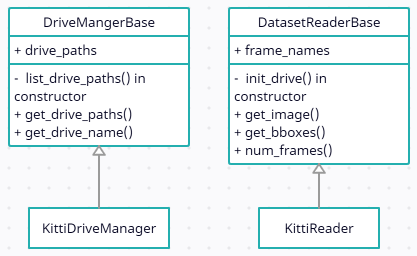
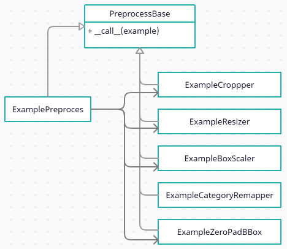
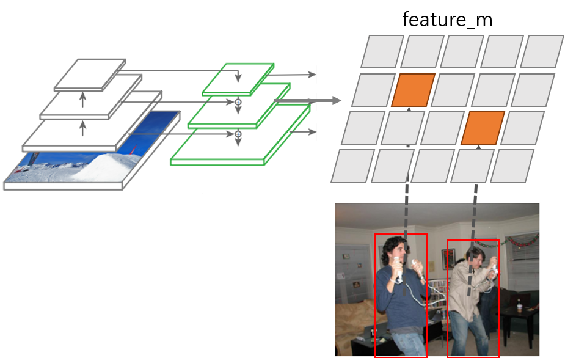

## 1. Kitti 2D Object Detection Dataset

이번에는 이 강의의 목표인 객체 검출(object detection) 모델 학습을 위한 데이터셋을 tfrecord로 만들고자 한다. 검출 모델을 학습시키려면 이미지(image)와 주석(annotation) 데이터가 있는 학습 데이터셋이 필요하다. 여기서 한글로 '주석'이라는 표현이 어색해서 레이블(label)로 대체하여 사용하겠다. 객체 검출 데이터셋으로 가장 유명한 것은 Microsoft에서 만든 [COCO dataset](https://cocodataset.org/#home)이지만 여기서는 [KITTI 2D Object Detection Dataset](http://www.cvlibs.net/datasets/kitti/eval_object.php?obj_benchmark=2d)으로 예시를 만들었다. 그 이유는 아래 표에 보이듯이 KITTI가 더 용량과 객체 종류가 작고 특히 COCO는 수백메가의 텍스트 파일을 해석해서 이미지별 객체 정보를 추출해내는 것이 까다롭기 때문이다.

|           | COCO                           | KITTI                          |
| --------- | ------------------------------ | ------------------------------ |
| 용량      | 25GB                           | 12GB                           |
| 객체 종류 | 80                             | 8                              |
| 레이블    | 하나의 파일에 모든 레이블 정보 | 이미지 하나당 레이블 파일 하나 |

KITTI 검출 데이터셋은 7,481장의 학습 이미지와 7,518장의 테스트 이미지를 제공하는데 테스트 이미지에 대해서는 레이블을 제공하지 않으므로 사실상 의미가 없다. 레이블은 8가지 객체를 제공한다고 하는데 학습 데이터의 클래스별 분포를 살펴보니 다음과 같다.

> {'Pedestrian': 4487, 'Truck': 1094, 'Car': 28742, 'Cyclist': 1627, 'DontCare': 11295, 'Misc': 973, 'Van': 2914, 'Tram': 511, 'Person_sitting': 222}

일단 정체가 불분명한 'DontCare'와 'Misc'를 제외하고 데이터가 많은 'Pedestrian', 'Car', 'Van', 'Cyclist' 네 가지 객체만 검출하는 모델을 만들어보자. 클래스별 상대적인 양이 너무 차이나면 소수 클래스 객체는 검출이 잘 안되기 때문에 여기서는 단순하면서도 좋은 성능의 검출 모델을 만들기 위해 **4가지만 선택**하였다.


## 2. Package Structure

오늘부터는 실제 검출 모델을 개발한다고 생각하고 이를 위해 프로젝트를 모듈별로 만들어나가는 과정을 보여줄 것이다. 이번 강의자료에서는 tfrecord 파일을 읽고 쓰기 위한 `tfrecord` 패키지만을 만든다.  구현된 코드는 아래 저장소에 있다. 저장소에서 **03_tfrecord_advanced**가 이번 강의자료를 위한 프로젝트다.  

<https://github.com/goodgodgd/detlec>

본 강의의 목적은 단순히 텐서플로 사용법과 검출 모델을 구현하는 것 뿐만 아니라 건전한(?) SW를 개발하는 방법을 가르치는 것까지 포함한다. 여기서 만들고자 하는 패키지는 단지 KITTI 데이터셋을 tfrecord로 변환할 뿐만 아니라 추후 다른 데이터셋으로 쉽게 확장할 수 있는 범용적인 구조를 설계하였다.  

패키지를 설계하기에 앞서 먼저 데이터의 구조를 파악해야 한다. 이미지 데이터셋들은 대부분 다음과 같은 데이터 계층을 가지고 있다.

1. Dataset Level: 특정 데이터셋에 들어있는 모든 데이터
2. Split Level: 데이터셋 내부에서 train/validation/test 전용 데이터
3. Drive Level: 데이터를 취득한 시기별로 폴더가 나뉘는 경우 한번에 연속적으로 취득한 데이터 단위를 'Drive'라 부르기로 한다.
4. Frame Level: 취득한 이미지 단위의 데이터, 자율주행 데이터셋의 경우 한 프레임에 여러 카메라와 라이다, IMU 등에서 들어온 복합적인 데이터를 포함한다.


위 계층을 따라 `tfrecord` 패키지는 다음과 같은 구조를 가지고 있다.

1. create_tfrecord_main.py (주요 함수 `create_tfrecords`) (:arrow_right: Dataset, Split Level): tfrecord 생성을 실행하는 메인 함수를 포함하고 Dataset, Split Level에 대해 반복(for loop)한다.
2. tfrecord_writer.py (주요 클래스 `TfrecordMaker`) (:arrow_right: Drive, Frame Level) : Split 내부의 Drive, Frame Level에 대해 반복하여 tfrecord 파일을 만든다. Drive 정보는 `XxxDriveManager`로부터 받아오고, Frame 정보는 `XxxReader`에서 받아오고, 프레임 별 원본 example은 `ExampleMaker`에서 받아온다. 받아온 example 데이터를 serialize하여 파일에 기록한다.
3. example_maker.py (주요 클래스 `ExampleMaker`): `XxxReader`에서 원본 데이터를 받아와 이를 `ExamplePreprocess`에서 가공하여 example을 만든다. 여기서는 "image", "bboxes" 두 가지 데이터를 만든다. 
4. xxx_reader.py: 특정 데이터셋 정보를 읽는 reader 모듈에는 아래 두 클래스가 있다.
   1. `XxxDriveManager`: 특정 데이터셋이 가진 Drive들의 경로를 제공하고 각 드라이브 마다 tfrecord 파일이나 폴더명에 붙일 Drive 이름을 제공한다.
   2. `XxxReader`: 특정 데이터셋의 특정 Drive 경로가 주어지면 Frame index를 입력받아 이미지나 객체(bounding box + category) 정보를 파일에서 읽어서 반환해준다.

5. preprocess.py: tfrecord에는 모델에 입력으로 바로 들어갈 정보가 필요하므로 원본 데이터의 해상도 조절등 몇가지 전처리 과정이 필요하다. `ExamplePreprocess` 클래스에서 아래 클래스들을 호출(\_\_call\_\_())하여 단계별로 처리한다.
   1. `ExampleCropper`: 원본 이미지와 입력 해상도의 화면 비율(aspect ratio, 가로/세로 비율)이 다른 경우 원본 이미지를 입력 해상도와 같은 화면 비율을 가지도록 원본 이미지를 세로나 가로 방향으로 자른다.
   2. `ExampleResizer`: 화면 비율이 같아지면 원본 이미지를 입력 해상도로 조절한다. 보통은 입력 해상도가 원본 해상도보다 낮으므로 이미지를 축소한다.
   3. `ExampleBoxScaler`: 모델에서 학습시 bounding box들은 픽셀 단위 해상도보다 0~1 사이의 normalized scale에서 다루는 것이 여러모로 편하다. 입력 해상도의 가로 세로 크기를 1로 보고 "yxhw" 박스 데이터를 픽셀 단위에서 이미지에 대한 비율로 조절한다.
   4. `ExampleCategoryRemapper`: 데이터셋에서 불러오는 카테고리 이름과 종류가 tfrecord로 만들고자 하는 데이터셋과는 이름이나 순서(category index)가 다를 수 있다. 예를 들면 KITTI에서는 *Pedestrian*이 "category 0"인데 내가 만드는 데이터셋에서는 이름은 *Person*으로 번호는 "category 1"로 바꿔야 할 수 있다. 데이터셋에서 불러온 category index를 tfrecord로 만드려는 카테고리 순서에 맞춰서 remapping 한다.
   5. `ExampleZeroPadBbox`: 여기서는 연산의 편의를 위해 tfrecord는 고정된 사이즈로 만들고자하여 이미지에서 나오는 bounding box 개수를 일정하게 20개로 고정시켰다. 데이터셋에서 제공한 박스 개수가 20개 미만인 경우 0으로 채워진 박스를 아래 추가하여 "bboxes" 키워드에 저장되는 텐서의 크기를 고정시킨다.


## 3. Config

프로그래밍을 하다보면 다양한 **파라미터**들이 필요하다. 파라미터는 데이터를 제외하고 프로그램의 결과를 바꿀 수 있는 변수를 의미한다. '데이터'는 처리해야할 대상이고 '파라미터'는 처리하는 과정에 필요한 변수다. 파라미터 중에는 고정된 것도 있고 상황에 따라 변할 수 있는 것들도 있는데 그런 가변적인 파라미터들이 여러 파일에 흩어져있다면 이를 찾아서 수정하거나 관리하기가 어렵다. 작성자가 아닌 다른 사람이 필요한 파라미터를 찾아서 수정하는 것은 더더욱 어렵다. 그래서 파라미터들을 모아서 관리할 필요를 느끼게 된다.  

깃헙의 다른 많은 프로젝트들을 보면 이러한 파라미터들을 flag로 관리한다. [링크](https://github.com/yzcjtr/GeoNet/blob/master/geonet_main.py)를 보면 수많은 파라미터들을 터미널에서 입력받을 수 있게 만들었다. 그러다보니 학습 시키는 명령어가 너무 길다. 사실 이것도 최소한의 파라미터만 쓴 것이고 나머지 파라미터는 기본값을 사용한 것이다.

> ```
> python geonet_main.py --mode=train_rigid --dataset_dir=/path/to/formatted/data/ --checkpoint_dir=/path/to/save/ckpts/ --learning_rate=0.0002 --seq_length=3 --batch_size=4 --max_steps=350000 
> ```


학습 한번 시키려고 저걸 타이핑 하다가 언제 개발을 하겠는가? 저러한 불편함을 해소하고자 config.py라는 파일을 만들기 시작했다. 파라미터를 터미널에서 입력하는 대신 파일에 적어놓으면 언제든 재활용 할 수 있다. 필요한 파라미터만 수정한 후 실행은 `python xxx_main.py` 한줄이면 충분하다.  

처음에는 `Config` 클래스 바로 아래에 모든 파라미터를 선언했으나 파라미터도 너무 많아지다보니 종류별로 묶어서 관리할 필요를 느껴 클래스 내부에 중간 클래스를 선언하여 관련 파라미터끼리 묶었다. 자세한 내용은 코드를 확인한다.


## 4. Inherited Classes

### 4.1. Dataset Readers

`TfrecordWriter`나 `ExampleMaker`는 데이터셋 종류에 무관한 공통적인 과정만을 담았기 때문에 어떤 객체 검출 데이터셋이라도 동일하게 처리할 수 있다. 단지 데이터셋을 직접 다루는 `XxxDriveManager`나 `XxxReader` 에서 동일한 함수로 동일한 종류의 데이터만 제공해주면 된다. 데이터셋 클래스는 데이터셋마다 구조와 형식이 다르기 때문에 따로 만들어야 한다. 그렇다고 해서 데이터셋마다 아무 관련없는 클래스들을 만드는 것은 코드를 보는 사람에게 혼란을 준다. 그러므로 데이터셋 클래스에 일정한 **양식**을 주어 여러가지 데이터셋을 위한 `XxxDriveManager`나 `XxxReader`  클래스들이 가급적 동일한 함수명, 변수명 등을 공유하게 한다면 다른 사람이 코드를 빠르게 파악하는데 도움이 된다. 이럴때가 딲! 클래스 상속을 활용해야할 때다.  

아래 클래스 다이어그램을 보면 두 가지 Base 클래스에서 사용해야 할 변수와 함수를 정의되어 있다. 이렇게 직접적인 구현 없이 클래스의 형식만 지정한 클래스를 **인터페이스(interface)**라 한다. 물론 여기서 Base 클래스들은 어느정도 구현도 들어가 있기 때문에 엄밀하게 말해서 인터페이스 클래스는 아니다. 인터페이스는 겉보기에는 클래스의 함수, 변수를 선언한 형식을 지정한 것 같지만 본질적인 의미는 클래스가 해야할 **책임**을 지정하는 것이다. 이 인터페이스를 상속받은 클래스는 이러한 기능을 할 수 있어야 한다고 책임을 지우는 것이다.  

여기서는 사용하는 데이터셋이 KITTI 밖에 없기 때문에 `KittiDriveManager`와 `KittiReader` 밖에 구현하지 않았지만 새로운 데이터셋을 다룬다면 Base 클래스를 상속받은 새로운 클래스를 만들어 활용하면 된다. 그렇게 하면 코드가 전체적으로 통일성을 가지게 되어 구현도 빨라지고 코드를 읽기도 쉬워진다.  




### 4.2. Example Preprocessors

앞서 데이터셋에서 읽은 원본 데이터를 example로 만들기 위해 다양한 전처리 과정을 거쳐야 한다고 했다. 다양한 전처리를 처리하는 과정에도 클래스 상속을 활용하면 코드의 가독성과 독립성이 좋아진다. 아래의 클래스 다이어그램과 코드를 보면 `PreprocessBase`는 단순히 `__call__(example)` 함수만 가지고 있다. 전처리 클래스의 유일한 책임은 example을 입력 받아서 전처리를 한 새로운 example을 리턴하는것 뿐이기 때문이다.  

`ExamplePreprocess`는 다른 전처리 클래스들을 모아서 for문을 통해 한번에 실행시켜주는 클래스다. `ExampleMaker`에서 다양한 전처리 클래스를 하나씩 불러 실행하는 복잡성을 줄여주고 모든 전처리 기능을 preprocess.py 라는 하나의 파일로 응집시키는 기능을 한다.  




```python
class PreprocessBase:
    def __call__(self, example):
        """
        :param example: source example
        :return: preprocessed example
        """
        raise NotImplementedError()

class ExamplePreprocess(PreprocessBase):
    def __init__(self, target_hw, dataset_cfg, category_names, max_bbox):
        self.preprocess = [ExampleCropper(target_hw, dataset_cfg.CROP_TLBR),
                           ExampleResizer(target_hw),   # box in pixel scale
                           ExampleBoxScaler(),          # box in (0~1) scale
                           ExampleCategoryRemapper(dataset_cfg.CATEGORIES_TO_USE,
                                                   dataset_cfg.CATEGORY_REMAP, category_names),
                           ExampleZeroPadBbox(max_bbox)
                           ]
    
    def __call__(self, example):
        for process in self.preprocess:
            example = process(example)
        return example
```


나머지 클래스들은 각자 맡은 한가지 전처리만을 수행한다. 여러가지 전처리가 섞이지 않았고 인터페이스가 똑같기 때문에 전처리 과정을 추가, 수정, 삭제하는 것이 자유롭다. 자유롭다는 것은 새로운 기능을 넣을 때 기존 코드를 덜 신경써도 된다는 것이다. 여러가지 기능이 섞여있으면 새로운 기능을 어디에 어떻게 넣어야할지 기존 코드를 보며 고민해야 하고 그렇게 해도 에러나 버그가 발생하기 쉽다. 하지만 여기서는 각 클래스별로 example을 받아서 한가지 처리만 하고 처리된 example을 리턴하는 독립성이 강한 구조기 때문에 추후 전처리 과정이 변하더라도 수정해야 할 코드를 쉽게 찾을 수 있고 새로운 기능을 넣기도 쉽다.


## 5. GT Feature Map


### 5.1. YOLO Model Output

YOLO v3 모델은 출력이 3가지 scale에서 9가지 anchor 로 나온다. Scale별로 세 가지 크기의 feature map이 나오는데 각각  "feature_l", "feature_m", "feature_s"라 부른다. 각 feature map은 입력 해상도에 비해 1/32, 1/16, 1/8의 크기를 가진다. 예를 들어 입력 해상도가 (256, 832)면 "feature_l"은 (8, 26) 크기를 가진다. (=세로 8칸, 가로 26칸의 grid cell을 가진다.)

각 feature map은 세 가지 anchor의 출력을 채널 방향으로 쌓아서 출력한다. Anchor는 출력되는 bounding box의 기본 크기다. 예를 들어 anchor box 크기가 (20, 30) 픽셀인 anchor에서 HW가 (1.2, 0.8)이 출력되면 출력된 bounding box의 크기는 (20, 30) * (1.2, 0.6) = (24, 18) 픽셀이 된다.  

Anchor마다 독립적인  객체 출력이 나오는데 모델에서 하나의 객체 출력은 (5+K)차원으로 표현된다. Bounding box가 "yxhw" 형식으로 4차원이 필요하고, objectness도 1차원이 필요하고, 카테고리별 확률이 K개 필요하다. 입력 해상도가 (256, 832)이고 카테고리가 4가지인 경우 모델에서 전체적으로 출력되는 객체의 수와 feature map의 shape은 다음과 같다.

- **feature_l** : shape = (H, W, C) = (256/32, 832/32, (5+4)*3) = (8, 26, 27), 출력 객체 수: $8\times26\times3=624$
- **feature_m** : shape = (H, W, C) = (256/16, 832/16, (5+4)*3) = (16, 52, 27), 출력 객체 수: $16\times52\times3=2496$
- **feature_s** : shape = (H, W, C) = (256/8, 832/8, (5+4)*3) = (32, 104, 27), 출력 객체 수: $32\times104\times3=9984$

모델에서 한번에 출력되는 객체의 수는 13,104개나 된다. 이 중에서 score = objectness * category probability 가 일정 값 이상이 되고, 인접한 영역에서 높은 score가 여러개 있을 경우 NMS 알고리즘을 통해 그중에서 최대 score를 가지는 grid cell만 최종적인 출력으로 나오게 된다.  

YOLO v3 모델에서 COCO 데이터셋을 위해 사용한 anchor box 크기는 다음과 같다.

>  [(10,13), (16,30), (33,23), (30,61), (62,45), (59,119), (116,90), (156,198), (373,326)]  


### 5.2. Preparing Training Data

모델을 학습시키기 위해서는 데이터셋에서 주어지는 객체의 bounding box가 13,104개의 grid cell 중 어디에서 나와야 하는지를 찾아야 한다.

1. 객체의 HW 정보만을 이용해 anchor box와의 IoU를 계산하고 IoU가 가장 높은 anchor box를 찾는다. → feature map scale(l, m, s), anchor index(0~2)
2. 객체의 YX 정보를 이용해 해당 anchor box가 포함된 feature map에서 grid cell의 위치를 찾는다. → (grid_y, grid_x)




학습을 할 때 "bboxes" 안의 객체 하나마다 위 과정을 거치는 것은 for문을 돌아야 해서 텐서 연산으로 적합하지 않다. tfrecord로 저장하기 전에 numpy 데이터 일 때 모델의 출력과 똑같은 shape을 가지는 세 가지 feature map을 만들고 데이터셋에서 나오는 객체를 해당 feature map의 grid cell에 저장해두면 모델의 loss 계산시 편리하게 사용할 수 있다. 이를 "GT feature map"이라고 하자. GT feature map의 shape은 모델의 세 가지 출력 feature map과 같지만 값은 기본적으로 모두 0으로 채워져 있고 데이터셋에서 객체가 있는 위치에서만 6차원의 객체 정보를 갖는다. (yxhw + objectness(1) + category index) 객체가 실제 존재 하는곳에만 객체 정보가 있고 나머지 공간은 0으로 채워진 이상적인 출력 feature map을 만드는 것이다.

코드에서는 `ExampleMaker`에서 전처리를 한 후 `assign_bbox_over_feature_map()`라는 함수를 실행하는데 이를 실행하고 나면 "feature_l", "feature_m", "feature_s" 세 가지 데이터가 example에 추가된다.


---

comming soon...

gt feature map, path manager, tfr_config, tfrecord reader

