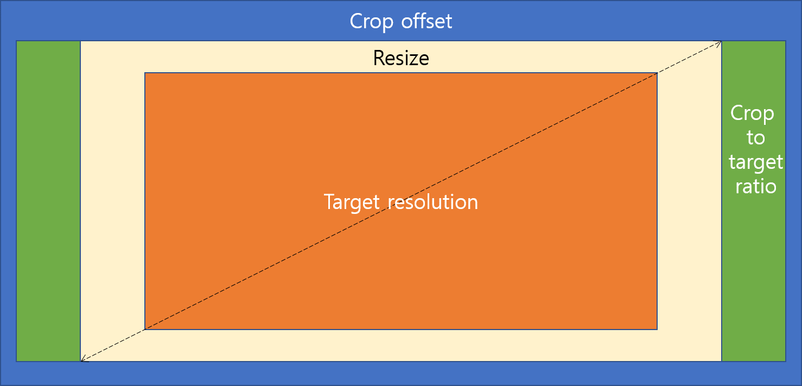

## 1. Kitti 2D Object Detection Dataset

이번에는 이 강의의 목표인 객체 검출(object detection) 모델 학습을 위한 데이터셋을 tfrecord로 만들고자 한다. 검출 모델을 학습시키려면 이미지(image)와 주석(annotation) 데이터가 있는 학습 데이터셋이 필요하다. 여기서 한글로 '주석'이라는 표현이 어색해서 레이블(label)로 대체하여 사용하겠다. 객체 검출 데이터셋으로 가장 유명한 것은 Microsoft에서 만든 [COCO dataset](https://cocodataset.org/#home)이지만 여기서는 [KITTI 2D Object Detection Dataset](http://www.cvlibs.net/datasets/kitti/eval_object.php?obj_benchmark=2d)으로 예시를 만들었다. 그 이유는 아래 표에 보이듯이 KITTI가 더 용량과 객체 종류가 작고 특히 COCO는 수백메가의 텍스트 파일을 해석해서 이미지별 객체 정보를 추출해내는 것이 까다롭기 때문이다.

|           | COCO                           | KITTI                          |
| --------- | ------------------------------ | ------------------------------ |
| 용량      | 25GB                           | 12GB                           |
| 객체 종류 | 80                             | 8                              |
| 레이블    | 하나의 파일에 모든 레이블 정보 | 이미지 하나당 레이블 파일 하나 |

KITTI 검출 데이터셋은 7,481장의 학습 이미지와 7,518장의 테스트 이미지를 제공하는데 테스트 이미지에 대해서는 레이블을 제공하지 않으므로 사실상 의미가 없다. 레이블은 8가지 객체를 제공한다고 하는데 학습 데이터의 클래스별 분포를 살펴보니 다음과 같다.

> {'Pedestrian': 4487, 'Truck': 1094, 'Car': 28742, 'Cyclist': 1627, 'DontCare': 11295, 'Misc': 973, 'Van': 2914, 'Tram': 511, 'Person_sitting': 222}

일단 정체가 불분명한 'DontCare'와 'Misc'를 제외하고 데이터가 많은 'Pedestrian', 'Car', 'Van', 'Cyclist' 네 가지 객체만 검출하는 모델을 만들어보자. 클래스별 상대적인 양이 너무 차이나면 소수 클래스 객체는 검출이 잘 안되기 때문에 여기서는 단순하면서도 좋은 성능의 검출 모델을 만들기 위해 **4가지만 선택**하였다.


## 2. Package Structure

오늘부터는 실제 검출 모델을 개발한다고 생각하고 이를 위해 프로젝트를 모듈별로 만들어나가는 과정을 보여줄 것이다. 이번 강의자료에서는 tfrecord 파일을 읽고 쓰기 위한 `tfrecord` 패키지만을 만든다.  구현된 코드는 아래 저장소에 있다. 저장소에서 **03_tfrecord_advanced**가 이번 강의자료를 위한 프로젝트다.  

<https://github.com/goodgodgd/detlec>

본 강의의 목적은 단순히 텐서플로 사용법과 검출 모델을 구현하는 것 뿐만 아니라 건전한(?) SW를 개발하는 방법을 가르치는 것까지 포함한다. 여기서 만들고자 하는 패키지는 단지 KITTI 데이터셋을 tfrecord로 변환할 뿐만 아니라 추후 다른 데이터셋으로 쉽게 확장할 수 있는 범용적인 구조를 설계하였다.  

### 3.1. Data Structure

패키지를 설계하기에 앞서 먼저 데이터의 구조를 파악해야 한다. 이미지 데이터셋들은 대부분 다음과 같은 데이터 계층을 가지고 있다.

1. Dataset Level: 특정 데이터셋에 들어있는 모든 데이터
2. Split Level: 데이터셋 내부에서 train/validation/test 전용 데이터
3. Drive Level: 데이터를 취득한 시기별로 폴더가 나뉘는 경우 한번에 연속적으로 취득한 데이터 단위를 'Drive'라 부르기로 한다.
4. Frame Level: 취득한 이미지 단위의 데이터, 자율주행 데이터셋의 경우 한 프레임에 여러 카메라와 라이다, IMU 등에서 들어온 복합적인 데이터를 포함한다.


### 3.2. Modules

위 계층을 따라 `tfrecord` 패키지는 다음과 같은 구조를 가지고 있다.

1. create_tfrecord_main.py (주요 함수 `create_tfrecords`) (:arrow_right: Dataset, Split Level): tfrecord 생성을 실행하는 메인 함수를 포함하고 Dataset, Split Level에 대해 반복(for loop)한다.
2. tfrecord_writer.py (주요 클래스 `TfrecordMaker`) (:arrow_right: Drive, Frame Level) : Split 내부의 Drive, Frame Level에 대해 반복하여 tfrecord 파일을 만든다. Drive 정보는 `XxxDriveManager`로부터 받아오고, Frame 정보는 `XxxReader`에서 받아오고, 프레임 별 원본 example은 `ExampleMaker`에서 받아온다. 받아온 example 데이터를 serialize하여 파일에 기록한다.
3. example_maker.py (주요 클래스 `ExampleMaker`): `XxxReader`에서 원본 데이터를 받아와 이를 `ExamplePreprocess`에서 가공하여 example을 만든다. 여기서는 "image", "bboxes" 두 가지 데이터를 만든다. 
4. xxx_reader.py: 특정 데이터셋 정보를 읽는 reader 모듈에는 아래 두 클래스가 있다.
   1. `XxxDriveManager`: 특정 데이터셋이 가진 Drive들의 경로를 제공하고 각 드라이브 마다 tfrecord 파일이나 폴더명에 붙일 Drive 이름을 제공한다.
   2. `XxxReader`: 특정 데이터셋의 특정 Drive 경로가 주어지면 Frame index를 입력받아 이미지나 객체(bounding box + category) 정보를 파일에서 읽어서 반환해준다.

5. preprocess.py: tfrecord에는 모델에 입력으로 바로 들어갈 정보가 필요하므로 원본 데이터의 해상도 조절등 몇가지 전처리 과정이 필요하다. `ExamplePreprocess` 클래스에서 아래 클래스들을 호출(\_\_call\_\_())하여 단계별로 처리한다.
   1. `ExampleCropper`: 원본 이미지와 입력 해상도의 화면 비율(aspect ratio, 가로/세로 비율)이 다른 경우 원본 이미지를 입력 해상도와 같은 화면 비율을 가지도록 원본 이미지를 세로나 가로 방향으로 자른다.
   2. `ExampleResizer`: 화면 비율이 같아지면 원본 이미지를 입력 해상도로 조절한다. 보통은 입력 해상도가 원본 해상도보다 낮으므로 이미지를 축소한다.
   3. `ExampleBoxScaler`: 모델에서 학습시 bounding box들은 픽셀 단위 해상도보다 0~1 사이의 normalized scale에서 다루는 것이 여러모로 편하다. 입력 해상도의 가로 세로 크기를 1로 보고 "yxhw" 박스 데이터를 픽셀 단위에서 이미지에 대한 비율로 조절한다.
   4. `ExampleCategoryRemapper`: 데이터셋에서 불러오는 카테고리 이름과 종류가 tfrecord로 만들고자 하는 데이터셋과는 이름이나 순서(category index)가 다를 수 있다. 예를 들면 KITTI에서는 *Pedestrian*이 "category 0"인데 내가 만드는 데이터셋에서는 이름은 *Person*으로 번호는 "category 1"로 바꿔야 할 수 있다. 데이터셋에서 불러온 category index를 tfrecord로 만드려는 카테고리 순서에 맞춰서 remapping 한다.
   5. `ExampleZeroPadBbox`: 여기서는 연산의 편의를 위해 tfrecord는 고정된 사이즈로 만들고자하여 이미지에서 나오는 bounding box 개수를 일정하게 20개로 고정시켰다. 데이터셋에서 제공한 박스 개수가 20개 미만인 경우 0으로 채워진 박스를 아래 추가하여 "bboxes" 키워드에 저장되는 텐서의 크기를 고정시킨다.

### 3.3. Crop and Resize

모델에 들어가는 데이터는 이미지인데, 원본 이미지를 그대로 넣으면 불필요한 부분도 있고 원본 해상도가 너무 커서 모델의 학습이나 추론 시간이 오래 걸릴 수 있다. 그래서 불필요한 부분은 자르고 전체적인 크기도 성능을 해치지 않는 선에서 줄이는 것이 좋다. 그래서 이미지에서 불필요한 부분을 잘라내는 `ExampleCropper`와 크기를 줄이는 `ExampleResizer`를 구현하였고 그 과정은 다음과 같다.

1. Crop offset: KITTI에는 그런 부분이 잘 드러나지 않지만, 예를들어 Cityscapes 같은 경우 이지미 아래쪽에 차량 보닛이 보이고 위쪽은 객체가 없는 하늘만 주로 보인다. 객체 검출이 목적이므로 객체가 없는 곳은 먼저 잘라내고 시작한다.
2. Crop to target ratio: 만약 현재 해상도가 (1200, 500)인데 목표 해상도가 (800, 400)이라서 둘 사이의 aspect ratio가 다르면 현재 해상도에서 가로, 세로 중 상대적으로 남는 부분을 잘라 aspect ratio를 같게 맞춘다.
3. Resize: crop의 결과로 원본 해상도와 목표 해상도의 비율이 같아졌으면 이미지를 축소하여 목표 해상도의 이미지를 만든다.




## 3. Config

프로그래밍을 하다보면 다양한 **파라미터**들이 필요하다. 파라미터는 데이터를 제외하고 프로그램의 결과를 바꿀 수 있는 변수를 의미한다. '데이터'는 처리해야할 대상이고 '파라미터'는 처리하는 과정에 필요한 변수다. 파라미터 중에는 고정된 것도 있고 상황에 따라 변할 수 있는 것들도 있는데 그런 가변적인 파라미터들이 여러 파일에 흩어져있다면 이를 찾아서 수정하거나 관리하기가 어렵다. 작성자가 아닌 다른 사람이 필요한 파라미터를 찾아서 수정하는 것은 더더욱 어렵다. 그래서 파라미터들을 모아서 관리할 필요를 느끼게 된다.  

깃헙의 다른 많은 프로젝트들을 보면 이러한 파라미터들을 flag로 관리한다. [링크](https://github.com/yzcjtr/GeoNet/blob/master/geonet_main.py)를 보면 수많은 파라미터들을 터미널에서 입력받을 수 있게 만들었다. 그러다보니 학습 시키는 명령어가 너무 길다. 사실 이것도 최소한의 파라미터만 쓴 것이고 나머지 파라미터는 기본값을 사용한 것이다.

```
python geonet_main.py --mode=train_rigid --dataset_dir=/path/to/formatted/data/ --checkpoint_dir=/path/to/save/ckpts/ --learning_rate=0.0002 --seq_length=3 --batch_size=4 --max_steps=350000 
```


학습 한번 시키려고 저걸 타이핑 하다가 언제 개발을 하겠는가? 저러한 불편함을 해소하고자 config.py라는 파일을 만들기 시작했다. 파라미터를 터미널에서 입력하는 대신 파일에 적어놓으면 언제든 재활용 할 수 있다. 필요한 파라미터만 수정한 후 실행은 `python xxx_main.py` 한줄이면 충분하다.  

처음에는 `Config` 클래스 바로 아래에 모든 파라미터를 선언했으나 파라미터도 너무 많아지다보니 종류별로 묶어서 관리할 필요를 느껴 클래스 내부에 중간 클래스를 선언하여 관련 파라미터끼리 묶었다. 자세한 내용은 코드를 확인한다.


## 4. Inherited Classes

### 4.1. Dataset Readers

`TfrecordWriter`나 `ExampleMaker`는 데이터셋 종류에 무관한 공통적인 과정만을 담았기 때문에 어떤 객체 검출 데이터셋이라도 동일하게 처리할 수 있다. 단지 데이터셋을 직접 다루는 `XxxDriveManager`나 `XxxReader` 에서 동일한 함수로 동일한 종류의 데이터만 제공해주면 된다. 데이터셋 클래스는 데이터셋마다 구조와 형식이 다르기 때문에 따로 만들어야 한다. 그렇다고 해서 데이터셋마다 아무 관련없는 클래스들을 만드는 것은 코드를 보는 사람에게 혼란을 준다. 그러므로 데이터셋 클래스에 일정한 **양식**을 주어 여러가지 데이터셋을 위한 `XxxDriveManager`나 `XxxReader`  클래스들이 가급적 동일한 함수명, 변수명 등을 공유하게 한다면 다른 사람이 코드를 빠르게 파악하는데 도움이 된다. 이럴때가 딲! 클래스 상속을 활용해야할 때다.  

아래 클래스 다이어그램을 보면 두 가지 Base 클래스에서 사용해야 할 변수와 함수를 정의되어 있다. 이렇게 직접적인 구현 없이 클래스의 형식만 지정한 클래스를 **인터페이스(interface)**라 한다. 물론 여기서 Base 클래스들은 어느정도 구현도 들어가 있기 때문에 엄밀하게 말해서 인터페이스 클래스는 아니다. 인터페이스는 겉보기에는 클래스의 함수, 변수를 선언한 형식을 지정한 것 같지만 본질적인 의미는 클래스가 해야할 **책임**을 지정하는 것이다. 이 인터페이스를 상속받은 클래스는 이러한 기능을 할 수 있어야 한다고 책임을 지우는 것이다.  

여기서는 사용하는 데이터셋이 KITTI 밖에 없기 때문에 `KittiDriveManager`와 `KittiReader` 밖에 구현하지 않았지만 새로운 데이터셋을 다룬다면 Base 클래스를 상속받은 새로운 클래스를 만들어 활용하면 된다. 그렇게 하면 코드가 전체적으로 통일성을 가지게 되어 구현도 빨라지고 코드를 읽기도 쉬워진다.  


### 4.2. Example Preprocessors

앞서 데이터셋에서 읽은 원본 데이터를 example로 만들기 위해 다양한 전처리 과정을 거쳐야 한다고 했다. 다양한 전처리를 처리하는 과정에도 클래스 상속을 활용하면 코드의 가독성과 독립성이 좋아진다. 아래의 클래스 다이어그램과 코드를 보면 `PreprocessBase`는 단순히 `__call__(example)` 함수만 가지고 있다. 전처리 클래스의 유일한 책임은 example을 입력 받아서 전처리를 한 새로운 example을 리턴하는것 뿐이기 때문이다.  

`ExamplePreprocess`는 다른 전처리 클래스들을 모아서 for문을 통해 한번에 실행시켜주는 클래스다. `ExampleMaker`에서 다양한 전처리 클래스를 하나씩 불러 실행하는 복잡성을 줄여주고 모든 전처리 기능을 preprocess.py 라는 하나의 파일로 응집시키는 기능을 한다.  


```python
class PreprocessBase:
    def __call__(self, example):
        """
        :param example: source example
        :return: preprocessed example
        """
        raise NotImplementedError()

class ExamplePreprocess(PreprocessBase):
    def __init__(self, target_hw, dataset_cfg, category_names, max_bbox):
        self.preprocess = [ExampleCropper(target_hw, dataset_cfg.CROP_TLBR),
                           ExampleResizer(target_hw),   # box in pixel scale
                           ExampleBoxScaler(),          # box in (0~1) scale
                           ExampleCategoryRemapper(dataset_cfg.CATEGORIES_TO_USE,
                                                   dataset_cfg.CATEGORY_REMAP, category_names),
                           ExampleZeroPadBbox(max_bbox)
                           ]
    
    def __call__(self, example):
        for process in self.preprocess:
            example = process(example)
        return example
```


나머지 클래스들은 각자 맡은 한가지 전처리만을 수행한다. 여러가지 전처리가 섞이지 않았고 인터페이스가 똑같기 때문에 전처리 과정을 추가, 수정, 삭제하는 것이 자유롭다. 자유롭다는 것은 새로운 기능을 넣을 때 기존 코드를 덜 신경써도 된다는 것이다. 여러가지 기능이 섞여있으면 새로운 기능을 어디에 어떻게 넣어야할지 기존 코드를 보며 고민해야 하고 그렇게 해도 에러나 버그가 발생하기 쉽다. 하지만 여기서는 각 클래스별로 example을 받아서 한가지 처리만 하고 처리된 example을 리턴하는 독립성이 강한 구조기 때문에 추후 전처리 과정이 변하더라도 수정해야 할 코드를 쉽게 찾을 수 있고 새로운 기능을 넣기도 쉽다.


## 5. GT Feature Map


### 5.1. YOLO Model Output

YOLO v3 모델은 출력이 3가지 scale에서 9가지 anchor 로 나온다. Scale별로 세 가지 크기의 feature map이 나오는데 각각  "feature_l", "feature_m", "feature_s"라 부른다. 각 feature map은 입력 해상도에 비해 1/32, 1/16, 1/8의 크기를 가진다. 예를 들어 입력 해상도가 (256, 832)면 "feature_l"은 (8, 26) 크기를 가진다. (=세로 8칸, 가로 26칸의 grid cell을 가진다.)

각 feature map은 세 가지 anchor의 출력을 채널 방향으로 쌓아서 출력한다. Anchor는 출력되는 bounding box의 기본 크기다. 예를 들어 anchor box 크기가 (20, 30) 픽셀인 anchor에서 HW가 (1.2, 0.8)이 출력되면 출력된 bounding box의 크기는 (20, 30) * (1.2, 0.6) = (24, 18) 픽셀이 된다.  

Anchor마다 독립적인  객체 출력이 나오는데 모델에서 하나의 객체 출력은 (5+K)차원으로 표현된다. Bounding box가 "yxhw" 형식으로 4차원이 필요하고, objectness도 1차원이 필요하고, 카테고리별 확률이 K개 필요하다. 입력 해상도가 (256, 832)이고 카테고리가 4가지인 경우 모델에서 전체적으로 출력되는 객체의 수와 feature map의 shape은 다음과 같다.

- **feature_l** : shape = (H, W, C) = (256/32, 832/32, (5+4)*3) = (8, 26, 27), 출력 객체 수: $8\times26\times3=624$
- **feature_m** : shape = (H, W, C) = (256/16, 832/16, (5+4)*3) = (16, 52, 27), 출력 객체 수: $16\times52\times3=2496$
- **feature_s** : shape = (H, W, C) = (256/8, 832/8, (5+4)*3) = (32, 104, 27), 출력 객체 수: $32\times104\times3=9984$

모델에서 한번에 출력되는 객체의 수는 13,104개나 된다. 이 중에서 score = objectness * category probability 가 일정 값 이상이 되고, 인접한 영역에서 높은 score가 여러개 있을 경우 NMS 알고리즘을 통해 그중에서 최대 score를 가지는 grid cell만 최종적인 출력으로 나오게 된다.  

YOLO v3 모델에서 COCO 데이터셋을 위해 사용한 anchor box 크기는 다음과 같다.

>  [(10,13), (16,30), (33,23), (30,61), (62,45), (59,119), (116,90), (156,198), (373,326)]  


### 5.2. Preparing Training Data

모델을 학습시키기 위해서는 데이터셋에서 주어지는 객체의 bounding box가 13,104개의 grid cell 중 어디에서 나와야 하는지를 찾아야 한다.

1. 객체의 HW 정보만을 이용해 anchor box와의 IoU를 계산하고 IoU가 가장 높은 anchor box를 찾는다. → feature map scale(l, m, s), anchor index(0~2)
2. 객체의 YX 정보를 이용해 해당 anchor box가 포함된 feature map에서 grid cell의 위치를 찾는다. → (grid_y, grid_x)


학습을 할 때 "bboxes" 안의 객체 하나마다 위 과정을 거치는 것은 for문을 돌아야 해서 텐서 연산으로 적합하지 않다. tfrecord로 저장하기 전에 numpy 데이터 일 때 모델의 출력과 똑같은 shape을 가지는 세 가지 feature map을 만들고 데이터셋에서 나오는 객체를 해당 feature map의 grid cell에 저장해두면 모델의 loss 계산시 편리하게 사용할 수 있다. 이를 "GT feature map"이라고 하자. GT feature map의 shape은 모델의 세 가지 출력 feature map과 같지만 값은 기본적으로 모두 0으로 채워져 있고 데이터셋에서 객체가 있는 위치에서만 6차원의 객체 정보를 갖는다. (yxhw + objectness + category index) 객체가 실제 존재 하는곳에만 객체 정보가 있고 나머지 공간은 0으로 채워진 이상적인 출력 feature map을 만드는 것이다.

코드에서는 `ExampleMaker`에서 전처리를 한 후 `assign_bbox_over_feature_map()`라는 함수를 실행하는데 이를 실행하고 나면 "feature_l", "feature_m", "feature_s" 세 가지 데이터가 example에 추가된다.


## 6. Path Manager

tfrecord를 만들다보면 여러가지 이유로 중간에 만드는 과정을 강제로 종료하게 된다. 여러가지 테스트를 해보거나, 만드는 데이터가 잘못됐거나, 프린트나 그림을 보여주는 등의 과정이 마음에 들지 않을때, 완성되기 전에 다른 일이 생겨서 등 이유는 다양하다. 대량의 데이터를 처리하는 작업에서 흔히 일어난다.  

여기서 문제는 완성이 되지 않은 데이터가 하드디스크에 남게 되고 작업을 다시 재개하기 위해서는 미완성된 데이터를 수동으로 삭제해야 한다는 것이다. 강제 종료는 코드를 작성하는 과정에서 수백번은 일어나는데 그때마다 만든다 만 데이터를 수동으로 삭제하는게 매우 번거로운 일이다. 그래서 미완성 상태에서 강제 종료하면 자동으로 미완성된 폴더를 삭제해주는 기능을 만들었다. 바로 PathManager 다. 

그 전에 상기해야 할 내용은 예제 코드에서 만드는 폴더의 구조다. `cfg.Paths.TFRECORD` 폴더 아래 "{dataset}\_{split}" 폴더가 생기고 "{drive}" 폴더가 생긴다. create\_tfrecord\_main.py 에서는 여러 데이터셋과 split에 대해 반복하는데 만약  "{dataset}\_{split}" 폴더가 존재하면 해당 split에 대한 작업을 건너뛴다. 그래서  split 폴더는 시작할 때 바로 만들지 않고 "{dataset}\_{split}\_\_" 폴더를 먼저 만들어 그곳에서 작업을 한 뒤 완성이 되면 폴더 이름을 "{dataset}\_{split}"으로 바꾼다. "{dataset}\_{split}\_\_" 폴더 경로는 `TfrecordMaker.tfrpath__`에 있다.

PathManager는 drive 단위의 폴더를 관리한다. `tfrpath__` 아래에 drive 폴더를 생성할 때 다음과 같이 PathManager를 context manager로 생성한다. 이후 `init_drive_tfrecord()` 함수에서 `self.path_manager.reopen()`을 실행한다.  

```python
    def make(self):
        drive_paths = self.drive_manger.get_drive_paths()
        with uc.PathManager(self.tfrpath__, closer_func=self.on_exit) as path_manager:
            self.path_manager = path_manager
            for self.drive_index, drive_path in enumerate(drive_paths):
                # skip if drive_path has been completed
                if self.init_drive_tfrecord():
                    continue
                ...
            path_manager.set_ok()
        self.wrap_up()

    def init_drive_tfrecord(self):
        drive_name = self.drive_manger.get_drive_name(self.drive_index)
        tfr_drive_path = op.join(self.tfrpath__, drive_name)
        if op.isdir(tfr_drive_path):
            return True

        self.path_manager.reopen(tfr_drive_path, closer_func=self.on_exit)
        ...
        return False

    def on_exit(self):
        if self.writer:
            self.writer.close()
            self.writer = None
```


`reopen()`의 입력 인자로는 이제 작업을 시작할 drive 경로와 강제 종료시 실행되어야 할 함수를 입력한다. 새로운 drive를 시작할 때 drive 경로를 입력했는데 만약 drive에 대한 작업이 끝나기 전에 강제 종료된다면 `make()` 함수 아래쪽의 `path_manager.set_ok()` 함수는 실행되지 못한다. 이 경우 `on_exit()` 함수가 호출되고 drive 경로는 자동 삭제된다.  

PathManager는 다음과 같이 구현되었다. `make()` 함수에서 context manager로 생성시 `__init__()`과 `__enter__()`가 실행되는데 이때 `path` 경로가 없으면 경로를 생성한다. `reopen()` 실행시에도 같은 내용의 처리가 진행된다. 입력 인자로는 관리해야 할 경로(`path`)와 종료시 실행해야 할 함수(`on_exit`)를 받는다.  

`safe_exit` 변수는 기본적으로 False 인데 `set_ok()` 함수가 실행되어야만 True가 될 수 있다. `__exit__()` 실행시 `safe_exit`가 False면 `path` 경로를 삭제하고 에러를 발생시켜 프로그램을 종료한다. `__exit__()` 함수는 강제 종료 및 정상 종료에서 모두 실행된다. 한가지 예외가 있다면 `opencv.imshow()` 실행하여 정지상태일때는 강제 종료를 해도 drive 경로가 삭제되지 않는다.

```python
class PathManager:
    def __init__(self, path, closer_func=None):
        self.path = path
        self.safe_exit = False
        self.closer = closer_func

    def __enter__(self):
        os.makedirs(self.path, exist_ok=True)
        return self

    def reopen(self, path, closer_func=None):
        self.path = path
        self.safe_exit = False
        self.closer = closer_func
        os.makedirs(path, exist_ok=True)
        return self

    def set_ok(self):
        self.safe_exit = True

    def __exit__(self, exc_type, exc_val, exc_tb):
        if self.closer:
            self.closer()

        if self.safe_exit is False:
            if self.path is not None and os.path.isdir(self.path):
                shutil.rmtree(self.path)
            # to ensure the process stop here
            assert False
```


## 7. tfr_config

tfrecord 파일은 기본적으로 읽기가 어렵다. 내부에 어떤 종류의 데이터가 있는지는 코드를 통해서만 확인할 수 있고 각각의 데이터 타입과 모양에 대한 정보는 아예 들어있지 않다. 또한 tfrecord 파일에 들어있는 전체 example의 개수도 확인이 어렵다. 데이터의 종류, 타입, 모양 등은 writer와 reader가 공유하는 config에 저장해도 되지만 문제는 config도 변한다는 것이다. 개발을 하다보면 변하지 않는건 없다. tfrecord 파일을 만들때와 읽을 때의 시차로 인해 서로 다른 config을 가질 수 있고 그런 경우 대부분 에러가 발생한다.  

그러므로 tfrecord 데이터셋을 만들때 데이터 파일 옆에 데이터에 대한 데이터인 메타 데이터를 또 다른 파일을 저장해두면 설정 변화에 유연하게 대처할 수 있을것이다. 여기서는 tfrecord 파일 옆에 **tfr_config.txt**라는 파일을 생성하고 그곳에 데이터의 종류, 타입, 모양, 길이 등을 저장한다. tfrecord 파일을 읽어올 때는 tfr_config.txt에 지정된 형식으로 example 데이터를 복원한다.

프로그래밍을 할 때 중요하게 생각하는 것이 변경점을 최소화 하는것이다. 예를들어 내가 이미지 너비를 1000을 쓸거라고 해서 코드에 1000이라는 숫자를 그냥 쓰게 되면 나중에 이미지 크기가 변했을 때 수십곳의 코드를 고치고도 에러가 발생하게 된다. 1000이라는 숫자를 쓰는 것보다는 이를 저장한 변수를 사용하는 것이 낫지만 전역 변수를 사용하게 되므로 이미지 자체의 모양을 읽어서 사용하는 것이 더 좋은 방법이다.  

지난 시간에 만든 `tfrecord_reader`에서는 다음과 같은 코드가 있었다.  

```python
def parse_example(example):
    features = {
        "image": tf.io.FixedLenFeature(shape=(), dtype=tf.string, default_value=""),
        "label_index": tf.io.FixedLenFeature(shape=(), dtype=tf.int64, default_value=0),
        "label_name": tf.io.FixedLenFeature(shape=(), dtype=tf.string, default_value=""),
    }
    parsed = tf.io.parse_single_example(example, features)
```


여기서도 [나쁜 냄새](https://wikidocs.net/597)가 난다. `features`에 들어있는 세 가지 key 값과 세 가지 데이터 타입이 하드코딩되어있다. `tfrecord_writer`에서야 데이터를 만드는 쪽이니까 key와 타입을 하드코딩 할수도 있지만 데이터를 읽어오는 쪽에서 저렇게 하드코딩하는 것은 늘 에러의 위험을 가지고 있다.  

코드는 언제나 변한다. `tfrecord_writer`에서 만드는 key와 타입도 변할 수 있다. 지난 시간에 만든 코드는 데이터의 key나 타입을 변경하고 싶을 때 `tfrecord_writer` 뿐만 아니라 `tfrecord_reader`도 짝을 맞춰서 수정을 해야 데이터를 읽을 수 있다. 이렇게 짝을 맞춰줘야 하는 코드는 언제나 위험하다.  

writer와 reader의 일관성을 그때마다 수동으로 맞춰주는 것보다 reader에서 자동으로 writer에서 만든 데이터의 속성을 복원하게 만드는게 훨씬 낫다. 코딩을 할때는 우리가 어떤 데이터가 어떻게 만들어졌는지 기억할 수 있을거라 생각하지만 기억력은 그리 오래가지 않는다.  

그래서 이 프로젝트에서는 tfrecord 파일을 만들때의 메타 데이터를 tfr_config.txt에 저장하고 reader에서 이를 읽어 `features`를 자동으로 만들어 사용한다. 여기서 KITTI 데이터셋으로 만든 tfr_config.txt은 다음과 같다.  

```python
{"image": {"parse_type": "tf.string", "decode_type": "tf.uint8", "shape": [256, 832, 3]}, 
"bboxes": {"parse_type": "tf.string", "decode_type": "tf.float32", "shape": [20, 5]}, 
"feature_l": {"parse_type": "tf.string", "decode_type": "tf.float32", "shape": [8, 26, 3, 6]}, 
"feature_m": {"parse_type": "tf.string", "decode_type": "tf.float32", "shape": [16, 52, 3, 6]}, 
"feature_s": {"parse_type": "tf.string", "decode_type": "tf.float32", "shape": [32, 104, 3, 6]}, 
"length": 6977}
```

저장된 데이터의 속성은 다음과 같다.

- parse_type: tfrecord의 raw byte 데이터를 읽어들일 타입, numpy 데이터는 실제 타입과 상관없이 bytes로 변환되어 저장되므로 우선 `tf.string`으로 읽어들인 후 실제 타입으로 변환한다. `tf.io.parse_single_example` 함수에 들어간다.
- decode_type: `tf.io.parse_single_example`의 결과로 나온 데이터를 추가적으로 캐스팅(casting)하는 타입, numpy 데이터는 decode_type을 통해 원래 타입을 복원한다.
- shape: 타입 캐스팅까지 하고나서 일렬로 늘어진 데이터를 원래의 모양으로 복원하기 위한 shape 정보
- length: 현재 폴더에 들어있는 전체 tfrecord 파일에 저장된 example의 개수

이 정보는 비단 tfrecord_reader 뿐만 아니라 사람에게도 유용한 정보다. tfr_config은 tfrecord_writer.py에서 `write_tfrecord_config()` 함수에서 만든다. 샘플 example에 들어있는 데이터의 dtype과 shape 등을 자동으로 분석하여 위와 같은 dict를 만들고 이를 json 형식으로 파일 출력한다.


## 8. Tfrecord Reader

이번에 만들 tfrecord_reader는 지난 강의에서 본 것과 비슷하지만 다르다. 함수들이 클래스로 묶였고 앞서 말했다시피 tfr_config.txt를 읽어서 데이터의 속성을 자동으로 파악하여 읽는 기능이 추가되었다. `TfrecordReader`라는 클래스를 만들었고 다음과 같이 사용할 수 있다.  

```python
dataset = TfrecordReader(op.join(cfg.Paths.TFRECORD, "kitti_train")).get_dataset()
for i, x in enumerate(dataset):
    print(f"=== index: {i}, image={x['image'].shape}, bbox={x['bboxes'].shape}"
          f", feature_l={x['feature_l'].shape}, feature_s={x['feature_s'].shape}")
```

여기서 헷갈리는 것은 `TfrecordReader`에 들어갈 입력인자 중에서 어떤걸 생성자에 넣고 어떤걸 멤버 함수의 입력해야 하는가다. 클래스에서 호출하는 공개 함수가 하나밖에 없으므로 사실 어디로 입력하든 구현은 가능하다. 하지만 가급적 객체의 생성자로 들어가는 인자는 객체가 파괴될 때까지 변하지 않는 객체의 고유값에 해당하는 파라미터를 넣는다. 멤버 함수에 들어가는 인자는 만들어진 객체에서 처리할 수 있는 데이터를 입력한다.  


### 8.1. Constructor

다음은 `TfrecordMaker`의 생성자 함수다. 생성자에서는 각종 파라미터를 멤버 변수에 저장하고 tfr_config을 읽어 해석한다.  

```python
class TfrecordReader:
    def __init__(self, tfrpath, shuffle=False, batch_size=cfg.Train.BATCH_SIZE, epochs=1):
        self.tfrpath = tfrpath
        self.shuffle = shuffle
        self.batch_size = batch_size
        self.epochs = epochs
        self.config = self.read_tfrecord_config(tfrpath)
        self.features_dict = self.get_features(self.config)

    def read_tfrecord_config(self, tfrpath):
        with open(op.join(tfrpath, "tfr_config.txt"), "r") as fr:
            config = json.load(fr)
            for key, properties in config.items():
                if not isinstance(properties, dict):
                    continue
                # convert parse types in string to real type
                properties["parse_type"] = eval(properties["parse_type"])
                properties["decode_type"] = eval(properties["decode_type"])
        return config

    def get_features(self, config):
        features_dict = {}
        for key, properties in config.items():
            if isinstance(properties, dict):
                default = "" if properties["parse_type"] is tf.string else 0
                features_dict[key] = tf.io.FixedLenFeature((), properties["parse_type"], default_value=default)
        return features_dict
```

`read_tfrecord_config()` 함수에서는 tfr_config을 불러오는데 텍스트로 저장된 "parse_type"과 "decode_type"을 `eval()` 함수를 통해 실제 타입으로 변환한다.  

`get_features()` 함수에서는 불러온 tfr_config에서 `tf.io.parse_single_example()`에 들어갈 `self.features_dict`를 생성한다. tfr_config에 저장된 "parse_type"을 활용한다.  


### 8.2. Build Dataset Object

생성자에서 준비한 정보를 이용하여 `get_dataset()`에서는 tfrecord 파일을 읽어들이는 `TFRecordDataset` 객체를 생성한다.  

`parse_example()`에서는 tfr_config의 "decode_type"과 "shape"을 이용해 원래 데이터의 타입과 모양을 복원한다.  

`dataset_process()`에서는 Dataset 객체에 batch, shuffle, epoch 등의 설정을 한다.

```python
    def get_dataset(self):
        """
        :return features: {"image": ..., "bboxes": ...}
            image: (batch, height, width, 3)
            bbox: [y1, x1, y2, x2, category] (batch, grid_height, grid_width, 5)
        """
        file_pattern = f"{self.tfrpath}/*.tfrecord"
        filenames = tf.io.gfile.glob(file_pattern)
        filenames.sort()
        print("[tfrecord reader] pattern:", file_pattern, "\nfiles:", filenames)
        dataset = tf.data.TFRecordDataset(filenames)
        dataset = dataset.map(self.parse_example)
        return self.dataset_process(dataset)

    def parse_example(self, example):
        parsed = tf.io.parse_single_example(example, self.features_dict)
        decoded = {}
        for key, properties in self.config.items():
            if isinstance(properties, dict):
                decoded[key] = tf.io.decode_raw(parsed[key], properties["decode_type"])
                decoded[key] = tf.reshape(decoded[key], shape=properties["shape"])
        # uint8 image -> image float (-1 ~ 1)
        decoded["image"] = uf.to_float_image(decoded["image"])
        return decoded

    def dataset_process(self, dataset):
        if self.shuffle:
            dataset = dataset.shuffle(buffer_size=200)
            print("[dataset] dataset shuffled")
        print(f"[dataset] num epochs={self.epochs}, batch size={self.batch_size}")
        dataset = dataset.repeat(self.epochs)
        dataset = dataset.batch(batch_size=self.batch_size, drop_remainder=True)
        return dataset
```

