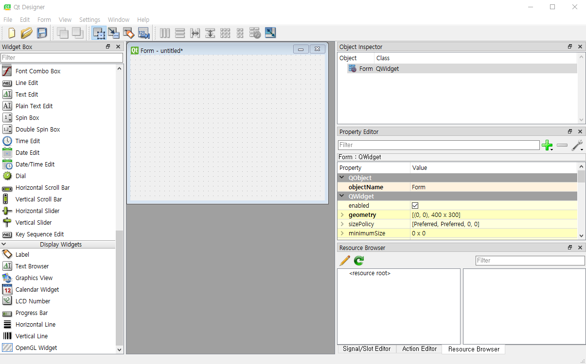
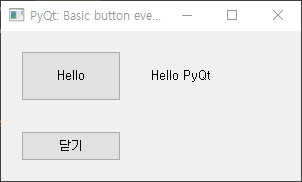
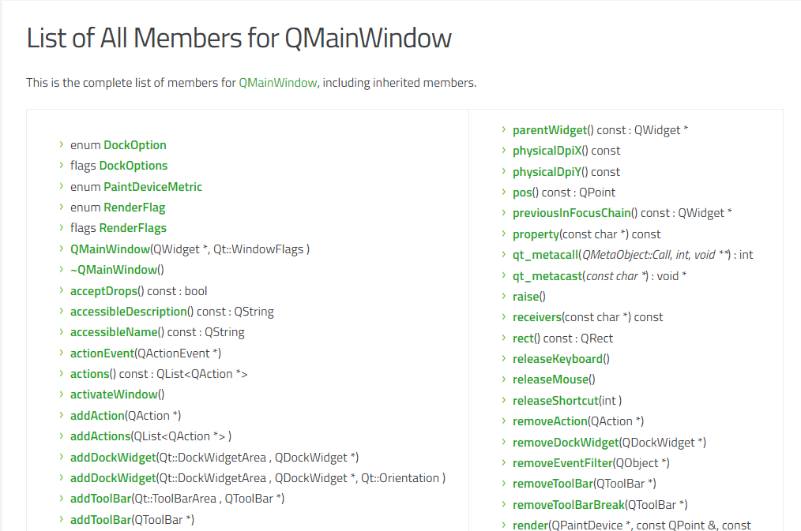
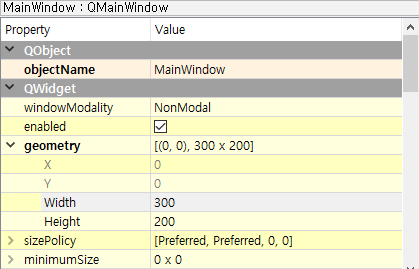
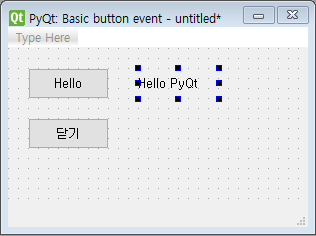
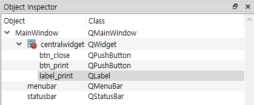

# 1. Introduction to PyQt5

### What is Qt?

Qt는 원래 C++을 위한 cross-platform GUI 라이브러리로 시작하였으나 현재는 범용 어플리케이션 프레임워크로 기능이 확장되었고 기존 데스크탑 위주에서  Android, iOS까지 확장되었다. C++라이브러리 뿐만 아니라 개발환경인 QtCreator, GUI 디자인 툴인 Qt Designer 등도 제공하여 왠만한 어플리케이션은 Qt 안에서 모두 개발 가능하다. 그래도 핵심 기능은 여전히 **cross-platform GUI** 다. Cross-platform이란 하나의 코드를 여러 운영체제에서 쓸수 있다는 뜻으로 *"Write once, compile anywhere!"* 라는 그들의 구호에 잘 나타나있다. C++에서 GUI를 만들때는 운영체제마다 상이한 API를 써야하는데 그러한 API를 내부적으로는 사용하되 사용자에게는 통일된 API를 제공하여 사용자는 어느 운영체제건 상관없이 Qt 라이브러리로 동일한 코드를 컴파일하여 동일한 GUI를 만들어 낼 수 있다.

### What is PyQt?

Qt를 이용한 GUI는 C++에서 인기가 많아서 이를 파이썬에서도 사용하고자 Qt의 파이썬 바인딩인 PyQt가 만들어졌다.Qt 라이브러리 대부분을 파이썬에서도 쓸 수 있게 되었다.  과거에는 Qt4가 주류였기 때문에 PyQt4가 많이 쓰였지만 Qt4가 2015년 이후로 지원이 끝나면서 Qt5가 주류가 되고 그에 따라 **PyQt5**가 주로 쓰인다. 앞으로 그냥 PyQt라고 하면 PyQt5를 지칭하는 것으로 하자. 기존에도 Tkinter 등의 GUI 패키지가 있었지만 Qt처럼 GUI로 GUI를 그리는 툴이 없기 때문에 요즘은 파이썬에서도 GUI는 PyQt로 개발하는 경우가 많다. [PyQt를 이용한 프로젝트](https://wiki.python.org/moin/PyQt/SomeExistingApplications)

### How to Install

터미널에서 명령어 입력

```bash
pip install pyqt5
pip install pyqt5-tools
```

### Simple Example

다음은 PyQt를 이용한 간단한 GUI 프로그램이다. PyQt의 내부 모듈은 `PyQt5` 패키지에 들어있고 그 안의 `QtWidget`에 GUI 관련 모듈들이 들어있다. 

```python
import sys
from PyQt5.QtWidgets import QApplication, QLabel

app = QApplication(sys.argv)
label = QLabel("Hello PyQt")
label.show()
app.exec_()
```

- `app = QApplication(sys.argv)`은 전체 GUI를 관리하는 객체다.
- `label`은 간단한 텍스트를 보여줄 수 있는 GUI 객체다. `label.show()`하면 객체를 화면에 띄운다.
- `app.exec_()` 가 실행되어야 이벤트 루프가 시작되면서 입력을 받을 수 있는 상태가 된다. 파이썬은 GUI가 실행되는 동안 이 줄에 멈춰있다.

### Design Methods: Writing code vs Qt Designer

PyQt를 이용한 GUI 설계 방식은 두 가지가 있다. 위와 같이 직접 파이썬 코드로 GUI 객체를 생성하고 속성을 지정수도 있고 Qt Designer를 통해 GUI를 모두 그린 뒤 이를 불러오는 방식이 있다. 두 방법이 장단점이 있는데 Qt Designer를 이용하면 그래픽 툴을 이용해 GUI를 쉽게 만들수 있고 실행 전 미리 시각적으로 볼 수 있기 때문에 시행착오가 적다. 하지만 GUI에 어떤 요소가 있는지 파이썬 코드에 드러나지 않기 때문에 GUI 설계가 끝난 뒤에도 Qt Designer를 항상 함께 실행해야 하는 불편함이 있다. Qt Designer를 이용하더라도 어차피 세부 설정이나 이벤트 처리는 파이썬 코드로 만들어야 하기 때문에 두 방식을 다 알아두는 것이 좋다.



일단 PyQt의 원리 이해를 위해 코드기반 설계를 먼저 배우고 Qt Designer를 이용하는 방법을 배운다.


# 2. Signal & Slot

우리가 GUI 프로그램에서 주로 하는 일은 사용자로부터 (주로 마우스) 입력을 받으면 이를 처리하는 루틴을 실행하는 것이다. 이를 위해 `app.exec_()`를 실행해 이벤트 루프를 돌면서 이벤트(사용자 입력)가 발생하기를 기다린다. 기존 GUI 라이브러리에서 이벤트를 처리하는 방법은 `callback` 함수를 쓰는 것이었다. GUI 객체에서 특정 이벤트시 실행할 함수 객체를 가지고 있다가 이벤트 발생시 함수를 실행시키는 것이다. Qt에서는 `Signal &  Slot` 이란 방식을 쓰는데 이벤트 발생시 이벤트 Signal을 보내고(emit) 이를 연결된 Slot 함수에서 처리하는 방식이다. callback 함수와의 가장 큰 차이는 하나의 Signal을 여러개의 Slot과 연결하면 하나의 이벤트(예를 들어 버튼 클릭)로 여러 함수를 동시에 실행시킬 수 있다는 것이다. 아래 그림과 같이 여러 개의 GUI 객체가 서로 연동되어 있을 때 유용한 기능이다.


## MainWindow and Button

이제 간단한 창에 버튼을 추가하여 버튼을 누르는 이벤트를 처리하는 코드를 만들어보자. 윈도우에 버튼을 추가하기 위해서는 `QMainWindow` 클래스를 상속받은 새로운 클래스를 만들고 그 안에 `QPushButton` 객체를 생성해야 한다. 윈도우에 버튼 두 개를 추가하여 하나를 누르면 `hello PyQt`를 출력하게 하고 다른 하나를 누르면 GUI를 종료하도록 하자.

```python
import sys
from PyQt5.QtWidgets import *
from PyQt5.QtCore import QCoreApplication

class MyWindow(QMainWindow):
    def __init__(self):
        super().__init__()
        self.setupUI()
        self.count = 0

    def setupUI(self):
        self.setWindowTitle("PyQt: Basic button event")
        self.setGeometry(500, 200, 300, 150)
        print("window geometry:", self.geometry())
        print("window geometry:", self.geometry().x(), self.geometry().y(), self.geometry().width(), self.geometry().height())
        # print button
        btn_print = QPushButton("Hello", self)
        btn_print.move(20, 20)
        btn_print.resize(100, 50)
        print("btn_print position:", btn_print.pos(), btn_print.pos().x(), btn_print.pos().y())
        print("btn_print size:", btn_print.size(), btn_print.size().width(), btn_print.size().height())
        btn_print.clicked.connect(self.hello_slot)
        # close button
        btn_close = QPushButton("닫기", self)
        btn_close.move(20, 100)
        btn_close.clicked.connect(QCoreApplication.instance().quit)
        # print label
        self.label_print = QLabel("Hello PyQt", self)
        self.label_print.move(150, 30)

    def hello_slot(self):
        self.count = self.count + 1
        self.label_print.setText(f"Hello PyQt {self.count}")

def main():
    app = QApplication(sys.argv)
    my_wnd = MyWindow()
    my_wnd.show()
    app.exec_()

if __name__ == "__main__":
    main()
```



기본 윈도우를 만들기 위해 `QMainWindow`를 상속받은 `MyWindow` 클래스 객체를 생성하였다. (`mywindow = MyWindow()`) 그리고 생성자 내부의 `setupUI()` 에서 윈도우를 디자인하였다. `setWindowTitle()`은 윈도우 제목을 지정하는 함수다.  `setGeometry(x, y, width, height)` 함수를 이용해 윈도우의 위치와 크기를 지정할 수 있다. `geometry` 함수는 현재 GUI 객체의 위치와 크기를 나타내는 `QRect(x, y, width, height)` 형식의 구조체를 반환한다. 

```python
    def setupUI(self):
        self.setWindowTitle("PyQt: Basic button event")
        self.setGeometry(500, 200, 300, 150)
        print("window geometry:", self.geometry())
        print("window geometry:", self.geometry().x(), self.geometry().y(), self.geometry().width(), self.geometry().height())
        # => window geometry: PyQt5.QtCore.QRect(500, 200, 300, 150)
        # => window geometry: 500 200 300 150
```

MainWindow 내부에 버튼을 추가할 때는 반드시 생성자의 두 번째 인자로 `self`가 들어가야만 윈도우에 버튼이 추가된다. 방금은 `setGeometry`함수로 위치와 크기를 한번에 지정했지만 `move(), resize()` 함수로 위치와 함수를 따로 지정하고 현재 설정된 값을 `pos(), size()`을 통해 읽을 수 있다. 여기서 중요한 것은 마지막 줄의 `connect` 함수다. `btn_print` 객체의 `clicked`라는 Signal을 `self.hello_slot`이라는 Slot 함수와 연결(connet)한 것이다. 이제 `btn_print`를 클릭하면 `hello_slot`이라는 함수가 실행될 것이다.

```python
        btn_print = QPushButton("Hello", self)
        btn_print.move(20, 20)
        btn_print.resize(100, 50)
        print("btn_print position:", btn_print.pos(), btn_print.pos().x(), btn_print.pos().y())
        print("btn_print size:", btn_print.size(), btn_print.size().width(), btn_print.size().height())
        btn_print.clicked.connect(self.hello_slot)
        # => btn_print position: PyQt5.QtCore.QPoint(20, 20) 20 20
        # => btn_print size: PyQt5.QtCore.QSize(100, 50) 100 50
```

두 번째 버튼은 닫기 버튼이므로 종료함수와 연결하였다. `QCoreApplication.instance().quit`은 GUI 이벤트 루프를 종료시켜 `app.exec_()` 다음으로 넘어가게 하는 함수다.

```python
        btn_close = QPushButton("닫기", self)
        btn_close.move(20, 100)
        btn_close.clicked.connect(QCoreApplication.instance().quit)
```

`QLabel`은 화면상에 간단한 텍스트를 보여줄 수 있는 GUI 요소다. `setText()` 함수를 통해 텍스트 내용을 바꿀수 있다. `setupUI()`에서 "Hello PyQt"로 문구를 초기화 한다음 "Hello" 버튼을 누를때마다 실행되는 `hello_slot()` 함수에서 숫자를 카운트하여 보여준다.

```python
    def setupUI(self):
        ...
        self.label_print = QLabel("Hello PyQt", self)
        self.label_print.move(150, 30)

    def hello_slot(self):
        self.count = self.count + 1
        self.label_print.setText(f"Hello PyQt {self.count}")
```


### 연습문제

위 코드에서 `btn_close` 옆에 새로운 버튼 `btn_reset`을 추가하고 누르면 `count`를 다시 0으로 초기화 한 후 `hello_slot` 함수를 실행하도록 만들어 보세요.


## 참고문서 찾기

위 예제를 보면 Signal & Slot 개념은 어느정도 이해할 수 있지만 `setWindowTitle(), setGeometry(), resize()` 같은 함수들은 어디서 나오는지 도통 감을 잡을 수 없다. PyQt가 파이썬 스크립트로 작성된 것이 아니라 속도를 위해 바이너리 라이브러리 형태로 제공되기 때문에 PyCharm에서도 내부 변수나 함수를 자동으로 보여줄 수 없다. [PyQt 공식 홈페이지](https://www.riverbankcomputing.com/software/pyqt/intro)가 있긴 한데 별 도움이 되진 않는다. [Qt Documentation](https://doc.qt.io/qt-5.15/) 을 가야 모든 클래스와 함수에 관한 정보를 얻을 수 있다. 이곳은 **C++** 라이브러리를 위한 문서이지만 파이썬과 사용법이 같기 때문에 참고할만 하다. 예를 들어 `QMainWindow` 클래스에 대한 멤버 함수를 찾고 싶다면 구글에서 `qt5 qmainwindow`를 검색하여 [QMainWindow Class](https://doc.qt.io/qt-5/qmainwindow.html) 문서를 보자. 이곳에는 `setGeometry()` 함수가 없다. 이유는 대다수의 함수를 부모클래스인 `QWidget`에서 물려받았기 때문에 `QWidget` 클래스 문서로 들어가야 `setGeometry()` 함수에 대한 설명을 볼 수 있다. 하지만 굳이 부모클래스를 찾아갈 필요없이 첫 화면에 보이는 `List of all members, including inherited members` 라는 링크로 들어가면 상속받은 모든 함수를 볼 수 있으므로 여기서 해당 함수를 검색하면 찾을 수 있다.




# 3. Simple QtDesigner Example

이전 포스트에서 PyQt 코드를 이용해 간단한 GUI를 만들어 보았다면 이번에는 QtDesigner를 이용해 동일한 GUI를 만들어보자. 


## 3.1 QtDesigner를 이용한 GUI 설계

먼저 QtDesigner를 이용해 GUI를 그려보자.

1. 현재 사용중인 Python 찾기: File - Settings - Project - Project Interpreter 들어가서 `Project Interpreter: `  옆의 파이썬 경로 찾기

2. QtDesigner 시작화면에 등록: [path-to-python-root]/Lib/site-packages/qt5_applications/Qt/bin/designer.exe 우클릭하여 "시작화면에 고정"

3. QtDesigner 실행

4. File - New - MainWindow - Create

5. MainWindow 설정: 우측 Property Editor에서 `geometry` 항목을 펼쳐서 `Width, Height` 항목 숫자 조절 (300, 200), `windowTitle`은 "PyQt: Basic button event"로 설정

   

6. GUI 객체 추가: `PushButton` 2개와 `Label` 1개 추가

7. 기본 텍스트 수정: 각 객체를 더블 클릭 후 "Hello", "닫기", "Hello PyQt" 등의 기본 텍스트 입력

   

8. 객체 이름 수정: 우측 Object Inspector 창에서 세 객체의 이름을 `btn_print, btn_close, label_print`로 수정

   

9. 파이썬 프로젝트 폴더에 `hellopyqt.ui`로 저장

저장된 파일을 열어보면 우리가 만든 GUI가 XML 형식으로 정의되어 있음을 볼 수 있다.

```xml
<?xml version="1.0" encoding="UTF-8"?>
<ui version="4.0">
 <class>MainWindow</class>
 <widget class="QMainWindow" name="MainWindow">
  <property name="geometry">
   <rect>
    <x>0</x>
    <y>0</y>
    <width>300</width>
    <height>200</height>
   </rect>
  </property>
  <property name="windowTitle">
   <string>PyQt: Basic button event</string>
  </property>
  <widget class="QWidget" name="centralwidget">
   <widget class="QPushButton" name="btn_print">
    <property name="geometry">
     <rect>
      <x>20</x>
      <y>20</y>
      <width>81</width>
      <height>31</height>
     </rect>
    </property>
    <property name="text">
     <string>Hello</string>
    </property>
   </widget>
... 중략
```


## 3.2 UI 파일 이용한 GUI 프로그래밍

다음 단계는 실제 파이썬 스크립트에서 *.ui 파일을 불러와서 GUI를 화면에 띄우는 것이다. 아래 코드를 실행해 보자.

```python
import sys
from PyQt5.QtWidgets import QMainWindow, QApplication
from PyQt5 import uic

class MyWindow(QMainWindow):
    def __init__(self):
        super().__init__()
        # UI 불러오기
        self.ui = uic.loadUi("hellopyqt.ui", self)

if __name__ == "__main__":
    app = QApplication(sys.argv)
    myWindow = MyWindow()
    myWindow.show()
    app.exec_()
```


코드만으로 구현했던 것보다 훨씬 간단하게 GUI가 구현된 것을 볼 수 있다. 하지만 아직 버튼에 기능을 넣진 못 했다. 코드를 조금더 추가하여 이전에 만들었던 GUI 프로그램을 완성해보자.

```python
import sys
from PyQt5.QtWidgets import QMainWindow, QApplication
from PyQt5.QtCore import QCoreApplication
from PyQt5 import uic

class MyWindow(QMainWindow):
    def __init__(self):
        super().__init__()
        # UI 불러오기
        self.ui = uic.loadUi("hellopyqt.ui", self)
        # signal - slot 연결
        self.btn_print.clicked.connect( self.hello_slot )
        self.btn_close.clicked.connect( QCoreApplication.instance().quit )
        self.count = 0
        print("window geometry:", self.geometry())
        print("btn_print position:", self.btn_print.pos())
        print("btn_print size:", self.btn_print.size())

    def hello_slot(self):
        self.count = self.count + 1
        self.label_print.setText(f"Hello PyQt {self.count}")

def main():
    app = QApplication(sys.argv)
    my_wnd = MyWindow()
    # my_wnd attribute 목록 출력하기
    print(dir(my_wnd))
    print([attr for attr in dir(my_wnd) if attr.startswith("btn") or attr.startswith("label")])
    # => ['btn_close', 'btn_print', 'label_print']
    my_wnd.show()
    app.exec_()

if __name__ == "__main__":
    main()
```


`uic.loadUi()` 함수를 이용해 UI 파일을 불러온다. 이후 `btn_print`와 `btn_close` 각각을 다른 slot에 연결(connect)하였다. `MyWindow` 클래스로부터 만들어진 `my_wnd` 객체에 QtDesigner에서 만든 `btn_print, btn_close, label_print` 가 들어있는지 확인하기 위해서는 `dir()` 함수를 쓰면 된다. `dir(obj)`은 객체의 모든 attribute (함수와 변수) 목록을 출력해준다. `print(dir(my_wnd))`를 실행하면 너무 긴 목록이 나오기 때문에 "btn"과 "label"로 시작하는 attribute만 출력하니 QtDesigner에서 만든 GUI 객체들을 확인할 수 있다.