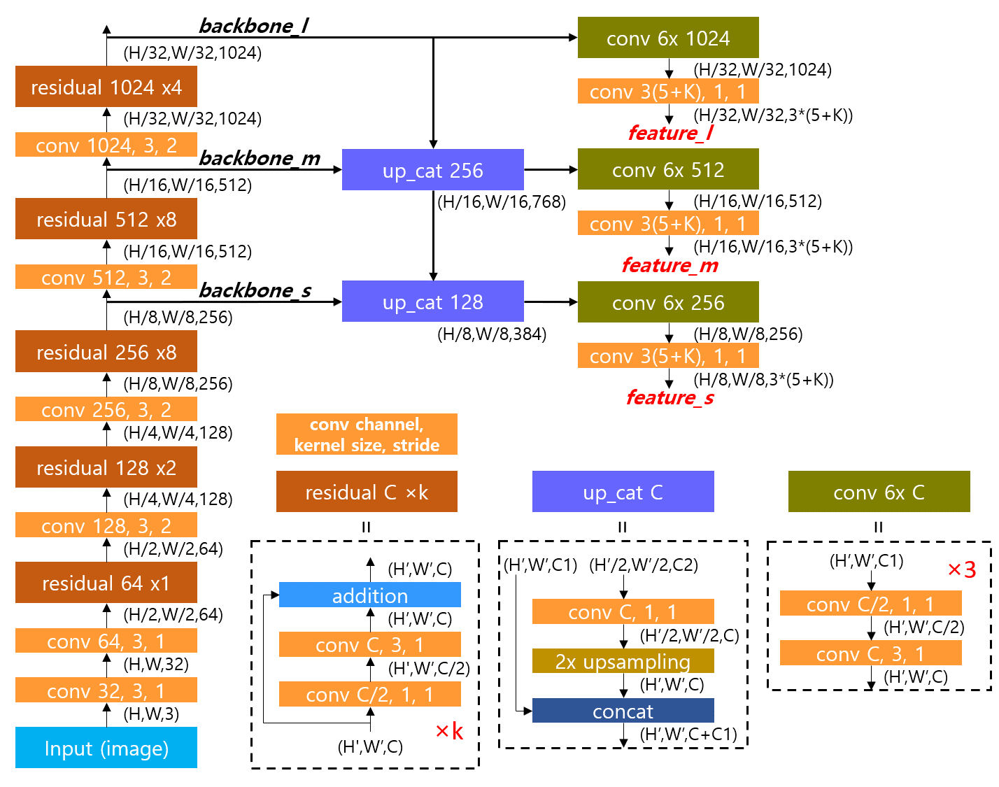

이번 자료에서는 모델을 학습시키는 프레임워크에 대해 설명한다. 이 구조의 설계 의도는 코드들을 조립가능한 부품(component)처럼 만들어서 입출력 규격만 같으면 언제든 부품을 다른 부품으로 교체 가능한 구조로 만드는 것이다. 모든 구조 설계는 config.py 에 들어있고 프레임워크는 이에 따라 클래스들을 조립하여 학습 알고리즘을 완성한다.  


## 1. YOLO v3 Architecture in Detail

학습 구조를 설명하기에 앞서 YOLO v3 모델의 자세한 구조와 출력 형식을 짚고 넘어간다. One-stage detector는 세 가지 단계와 Decoder가 있다.

1. Backbone: 이미지에서 영상의 국소적 혹은 전역적 특성을 나타내는 feature map 추출
2. Neck: backbone feature에서 직접 head로 연결되는 경우도 있지만 최근 연구들은 다양한 스케일의 backbone feature들을 재조합하여 객체 검출에 더 적합한 feature map을 만든다. 이 단계를 'neck'이라 한다.
3. Head: neck feature에서 conv 연산을 반복적용하여 출력을 만들어낸다.
4. Decoder: head feature은 conv 연산의 직접적인 출력이기 때문에 값의 범위가 한정되지 않아서 이를 직접 박스의 좌표나 클래스 확률 등으로 사용하기는 어렵다. Decoder는 학습 파라미터 없이 head feature에 정해진 연산을 적용하여 객체 출력 형식으로 변환한다.


다음은 YOLO v3의 세부적인 구조를 나타낸 그림이다.




### 1.1. Backbone

구조 그림에서 왼쪽에 쌓인 레이어들이 backbone에 해당한다. YOLO v3에서는 이 구조를 **Darknet 53**이라 부른다. Residual block들이 반복적으로 쌓여있고 residual block에 들어가기 전에 stride=2의 convolution으로 해상도를 반으로 줄인다. 출력은 1/8, 1/16, 1/32 세 가지 해상도로 나오고 각각을 small, medium, large scale feature map 이라 한다. 그림을 코드로 구현한 내용은 다음과 같다.  

```python
        features = dict()
        conv0 = self.conv2d(input_tensor, 32)
        conv1 = self.conv2d_s2(conv0, 64)
        conv1 = self.residual(conv1, 64)

        conv2 = self.conv2d_s2(conv1, 128)
        for i in range(2):
            conv2 = self.residual(conv2, 128)

        conv3 = self.conv2d_s2(conv2, 256)
        for i in range(8):
            conv3 = self.residual(conv3, 256)
        features["backbone_s"] = conv3

        conv4 = self.conv2d_s2(conv3, 512)
        for i in range(8):
            conv4 = self.residual(conv4, 512)
        features["backbone_m"] = conv4

        conv5 = self.conv2d_s2(conv4, 1024)
        for i in range(4):
            conv5 = self.residual(conv5, 1024)
        features["backbone_l"] = conv5
```


### 1.2. Neck

구조 그림에서 *up_cat* 블록으로 표시한 부분이 neck에 해당한다. up_cat은 상위 스케일의 저해상도 feature map을 upsampling을 통해 해상도를 2배로 늘리고 이를 하위 스케일의 고해상도 feature map과 concatenate 한다. 이를 통해 상위 feature map에 담겨있는 넓은 시야의 정보와 하위 feature map의 지역적인 정보를 결합하여 객체를 검출하는 head에 더욱 풍부한 정보를 제공한다.  

### 1.3. Head

구조 그림에서 오른쪽에 `feature_l, m, s`가 나오는 부분이 head에 해당한다. 최종 출력을 만들기 전에 6번의 convolution을 하는데 1x1 conv.와 3x3 conv.를 반복한다. 1x1 conv.에서 feature를 1/2로 압축하고 (채널 줄임) 3x3 conv에서 새로운 feature를 추출한다(채널 확장). 이렇게 하면 같은 채널 수로 3x3 conv.를 반복하는 것보다 연산량을 줄이면서 풍부한 feature map을 만들수 있다.  

마지막 conv.는 feature map의 채널을 출력 차원 수와 맞춘다. 출력 채널은 스케일에 상관없이 3*(5+K) 인데 각 숫자의 의미는 다음과 같다.

- 3: 스케일 별 anchor의 개수
- 5: bounding box의 YXHW + 객체가 존재할 확률인 Objectness
- K: 분류할 객체의 종류 수

아래 그림은 모델의 자세한 출력 구조를 보여준다. 모델의 head에서 출력된 어떤 feature map이 있을 때 각 grid cell 마다 세 가지 anchor에 대한 출력이 나온다. 그림에는 YOLO v3에서 COCO 데이터셋을 위해 사용한 9가지 anchor box 크기가 있다. 크기별로 3개씩 묶어서 3가지 스케일에 할당한다.  

객체 정보 출력은 해당 위치에 객체가 있든 없든 동일한 conv. 연산을 통해 모든 grid cell의 모든 anchor에서 항상 출력된다. 각 anchor에 대한 출력은 (bounding box, objectness, category probabilities)로  구성된다. Head에서 나온 feature가 바로 이러한 정보가 되는것은 아니고 decoder에서 head feature를 가공하여 최종적인 모델의 출력을 만든다.  

참고로 학습 데이터 들어가는 GT feature map도 비슷한 구조를 가지고 있는데 차이가 있다면 카테고리 별 확률 대신 카테고리 번호(index)를 담고 있다는 것이다. 이 카테고리 번호를 one-hot encoding을 하면 실제 카테고리 별 확률을 만들수 있다. 학습을 할 때는 모델의 예측과 GT 값 사이의 차이가 loss가 되고 이 loss를 줄이는 방향으로 학습을 하면 객체 검출 결과가 점점 정확해진다.  


코드에서는 neck와 head를 합쳐서 head.py로 구현했는데 내용은 다음과 같다.

```python
        large = input_features["backbone_l"]
        medium = input_features["backbone_m"]
        small = input_features["backbone_s"]
        conv = self.conv_5x(large, 512)
        conv_lbbox = self.make_output(conv, 1024)

        conv_medium = self.upsample_concat(large, medium, 256)
        conv = self.conv_5x(conv_medium, 256)
        conv_mbbox = self.make_output(conv, 512)

        conv_small = self.upsample_concat(conv_medium, small, 128)
        conv = self.conv_5x(conv_small, 128)
        conv_sbbox = self.make_output(conv, 256)
        conv_result = {"feature_l": conv_lbbox, "feature_m": conv_mbbox, "feature_s": conv_sbbox}
```


### 1.4. Decoder

모델의 최종 출력은 anchor별로 (bounding box, objectness, category probabilities)가 나와야 하는데 head feature는 이러한 정보를 직접 출력하기에 적합하지 않다.


## 2. Training Plan


## 3. TrainVal


## 4. Model Factory


