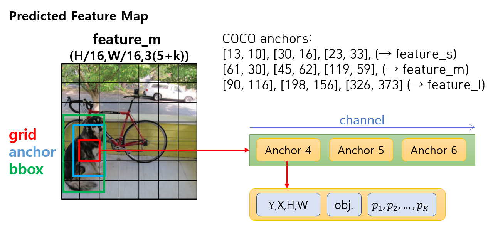
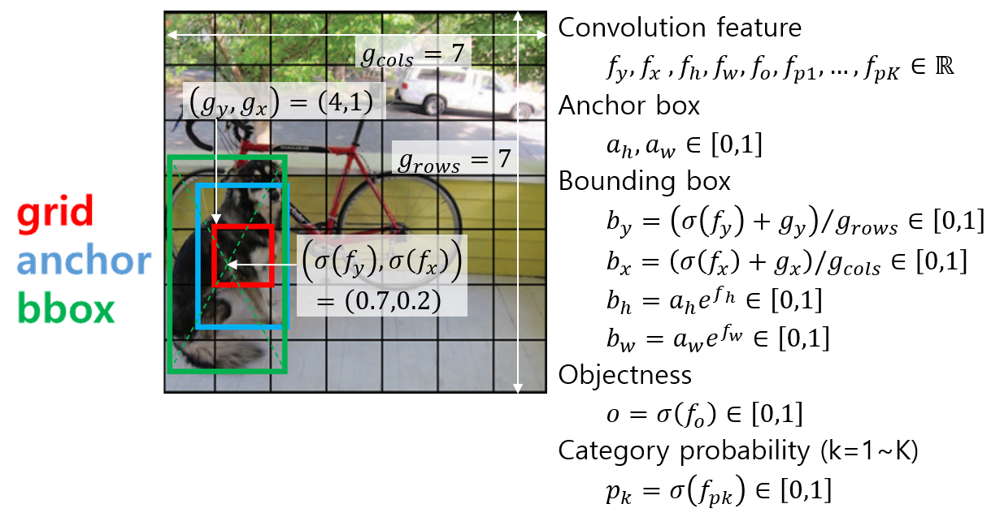

# YOLO v3 Architecture in Detail

학습 구조를 설명하기에 앞서 YOLO v3 모델의 자세한 구조와 출력 형식을 짚고 넘어간다. One-stage detector는 세 가지 단계와 Decoder가 있다.

1. Backbone: 이미지에서 영상의 국소적 혹은 전역적 특성을 나타내는 feature map 추출
2. Neck: backbone feature에서 직접 head로 연결되는 경우도 있지만 최근 연구들은 다양한 스케일의 backbone feature들을 재조합하여 객체 검출에 더 적합한 feature map을 만든다. 이 단계를 'neck'이라 한다.
3. Head: neck feature에서 conv 연산을 반복적용하여 출력을 만들어낸다.
4. Decoder: head feature은 conv 연산의 직접적인 출력이기 때문에 값의 범위가 한정되지 않아서 이를 직접 박스의 좌표나 클래스 확률 등으로 사용하기는 어렵다. Decoder는 학습 파라미터 없이 head feature에 정해진 연산을 적용하여 객체 출력 형식으로 변환한다.


다음은 YOLO v3의 세부적인 구조를 나타낸 그림이다.


## 1. Backbone

구조 그림에서 왼쪽에 쌓인 레이어들이 backbone에 해당한다. YOLO v3에서는 이 구조를 **Darknet 53**이라 부른다. Residual block들이 반복적으로 쌓여있고 residual block에 들어가기 전에 stride=2의 convolution으로 해상도를 반으로 줄인다. 출력은 1/8, 1/16, 1/32 세 가지 해상도로 나오고 각각을 small, medium, large scale feature map 이라 한다. 그림을 코드로 구현한 내용은 다음과 같다.  

```python
        features = dict()
        conv0 = self.conv2d(input_tensor, 32)
        conv1 = self.conv2d_s2(conv0, 64)
        conv1 = self.residual(conv1, 64)

        conv2 = self.conv2d_s2(conv1, 128)
        for i in range(2):
            conv2 = self.residual(conv2, 128)

        conv3 = self.conv2d_s2(conv2, 256)
        for i in range(8):
            conv3 = self.residual(conv3, 256)
        features["backbone_s"] = conv3

        conv4 = self.conv2d_s2(conv3, 512)
        for i in range(8):
            conv4 = self.residual(conv4, 512)
        features["backbone_m"] = conv4

        conv5 = self.conv2d_s2(conv4, 1024)
        for i in range(4):
            conv5 = self.residual(conv5, 1024)
        features["backbone_l"] = conv5
```

### CustomConv2D

Darknet 53에서 사용되는 convolution 함수들은 사실 객체다. Backbone 클래스의 부모 클래인 `BackboneBase`에는 backbone에서 사용되는 convolution 종류를 생성자에서 미리 객체로 만들어서 사용한다. 생성자 함수는 다음과 같다.

```python
class BackboneBase:
    def __init__(self, conv_kwargs):
        self.conv2d = mu.CustomConv2D(kernel_size=3, strides=1, **conv_kwargs)
        self.conv2d_k1 = mu.CustomConv2D(kernel_size=1, strides=1, **conv_kwargs)
        self.conv2d_s2 = mu.CustomConv2D(kernel_size=3, strides=2, **conv_kwargs)
```

model_utils.py의 `CustomConv2D`를 통해 kernel_size 및 stride 설정에 따라 여러 convolution 객체를 만든다. `CustomConv2D` 클래스는 다음과 같이 정의되어있다.

```python
import tensorflow as tf
from tensorflow.keras import layers
import tensorflow_addons as tfa

class CustomConv2D:
    CALL_COUNT = -1

    def __init__(self, kernel_size=3, strides=1, padding="same", activation="leaky_relu", scope=None, bn=True):
        # save arguments for Conv2D layer
        self.kernel_size = kernel_size
        self.strides = strides
        self.padding = padding
        self.activation = activation
        self.scope = scope
        self.bn = bn

    def __call__(self, x, filters, name=None):
        CustomConv2D.CALL_COUNT += 1
        index = CustomConv2D.CALL_COUNT
        name = f"conv{index:03d}" if name is None else f"{name}/{index:03d}"
        name = f"{self.scope}/{name}" if self.scope else name

        x = layers.Conv2D(filters, self.kernel_size, self.strides, self.padding,
                          use_bias=not self.bn, kernel_regularizer=tf.keras.regularizers.l2(0.0005),
                          kernel_initializer=tf.random_normal_initializer(stddev=0.01),
                          bias_initializer=tf.constant_initializer(0.), name=name,
                          )(x)

        if self.activation == "leaky_relu":
            x = layers.LeakyReLU(alpha=0.1)(x)
        elif self.activation == "mish":
            x = tfa.activations.mish(x)

        if self.bn:
            x = layers.BatchNormalization()(x)
        return x
```

Convolution 연산에서 매번 바뀌는 입력 텐서와 자주 바뀌는 채널 수는 호출(`__call__()`)시에 입력하게 하고 상대적으로 변화가 적은나머지 인자들은 생성자에서 멤버 변수로 저장한다. 원래 `tf.keras.layers.Conv2D` 클래스를 직접 backbone에서 사용해도 되지만 그렇게하면 입력인자가 많아서 코드가 전체적으로 지저분해진다. `CustomConv2D`에서는 생성자에서 입력받은 설정을 호출시마다 반복해서 사용한다. 아래는 `CustomConv2D`를 썼을 때와 `tf.keras.layers.Conv2D`를 쓸 때의 코드를 비교한 것이다.

```python
conv2 = self.conv2d_s2(conv1, 128)
conv2 = layers.Conv2D(conv1, kernel_size=128, strides=2, padding="same", 
                      kernel_regularizer=tf.keras.regularizers.l2(0.0005), 
                      kernel_initializer=tf.random_normal_initializer(stddev=0.01), 
                      bias_initializer=tf.constant_initializer(0.), 
                      name=f"conv{index:03d}")(conv1)
```

kernel_size는 1 아니면 3이고, strides는 1 또는 2이므로 kernel_size와 strides에 따라 전용 `CustomConv2D` 객체를 만들고 나머지 설정들은 `CustomConv2D` 내부의 기본 값을 그대로 사용한다. 또한 `CustomConv2D` 내부에서 activation 함수와 batch normalization까지 포함한다. 이를 사용하는 backbone은 최소의 입력인자(입력 텐서와 출력 채널 수)만 입력하고 batch normalization을 convolution 뒤에 매번 추가하지 않아도 돼서 코드가 간결해졌다.

Backbone의 생성자가 마치 파이토치처럼 convolution 객체를 미리 생성하는 것처럼 보일 수도 있지만 `CustomConv2D`는 생성할 때가 아니라 호출할 때마다 새로운 `layers.Conv2D` 객체를 생성한다. Backbone의 생성자에서 만드는 `CustomConv2D` 객체는 `layers.Conv2D` 객체에 들어갈 기본 값을 저장할 뿐이다. 만약 파이토치 스타일로 모든 convolution 객체를 미리 만들어야 한다면 생성자 함수가 매우 길어질 것이다. 그래서 [YOLO v3의 파이토치 구현](https://github.com/eriklindernoren/PyTorch-YOLOv3/blob/1675d1898c2ec6e0bca6057b482667a2d884ceb8/pytorchyolo/models.py#L156)을 보면 모델 정의는 Darknet에서 모델 정의하는 cfg 파일을 읽어와서 자동으로 객체를 생성하고 forward graph를 정의한다.


## 2. Neck

구조 그림에서 *up_cat* 블록으로 표시한 부분이 neck에 해당한다. up_cat은 상위 스케일의 저해상도 feature map을 upsampling을 통해 해상도를 2배로 늘리고 이를 하위 스케일의 고해상도 feature map과 concatenate 한다. 이를 통해 상위 feature map에 담겨있는 넓은 시야의 정보와 하위 feature map의 지역적인 정보를 결합하여 객체를 검출하는 head에 더욱 풍부한 정보를 제공한다.  

## 3. Head

구조 그림에서 오른쪽에 `feature_l, m, s`가 나오는 부분이 head에 해당한다. 최종 출력을 만들기 전에 6번의 convolution을 하는데 1x1 conv.와 3x3 conv.를 반복한다. 1x1 conv.에서 feature를 1/2로 압축하고 (채널 줄임) 3x3 conv에서 새로운 feature를 추출한다(채널 확장). 이렇게 하면 같은 채널 수로 3x3 conv.를 반복하는 것보다 연산량을 줄이면서 풍부한 feature map을 만들수 있다.  

마지막 conv.는 feature map의 채널을 출력 차원 수와 맞춘다. 출력 채널은 스케일에 상관없이 3*(5+K) 인데 각 숫자의 의미는 다음과 같다.

- 3: 스케일 별 anchor의 개수
- 5: bounding box의 YXHW + 객체가 존재할 확률인 Objectness
- K: 분류할 객체의 종류 수

아래 그림은 모델의 자세한 출력 구조를 보여준다. 모델의 head에서 출력된 어떤 feature map이 있을 때 각 grid cell 마다 세 가지 anchor에 대한 출력이 나온다. 그림에는 YOLO v3에서 COCO 데이터셋을 위해 사용한 9가지 anchor box 크기가 있다. 크기별로 3개씩 묶어서 3가지 스케일에 할당한다.  

객체 정보 출력은 해당 위치에 객체가 있든 없든 동일한 conv. 연산을 통해 모든 grid cell의 모든 anchor에서 항상 출력된다. 각 anchor에 대한 출력은 (bounding box, objectness, category probabilities)로  구성된다. Head에서 나온 feature가 바로 이러한 정보가 되는것은 아니고 decoder에서 head feature를 가공하여 최종적인 모델의 출력을 만든다.  




코드에서는 neck와 head를 합쳐서 head.py로 구현했는데 내용은 다음과 같다.

```python
        large = input_features["backbone_l"]
        medium = input_features["backbone_m"]
        small = input_features["backbone_s"]
        conv = self.conv_5x(large, 512)
        conv_lbbox = self.make_output(conv, 1024)

        conv_medium = self.upsample_concat(large, medium, 256)
        conv = self.conv_5x(conv_medium, 256)
        conv_mbbox = self.make_output(conv, 512)

        conv_small = self.upsample_concat(conv_medium, small, 128)
        conv = self.conv_5x(conv_small, 128)
        conv_sbbox = self.make_output(conv, 256)
        conv_result = {"feature_l": conv_lbbox, "feature_m": conv_mbbox, "feature_s": conv_sbbox}
```


## 4. Decoder

모델의 최종 출력은 anchor별로 (bounding box, objectness, category probabilities)가 나와야 하는데 head feature는 이러한 정보를 직접 출력하기에 적합하지 않다. Convolution의 출력은 특정한 범위 안으로 제한하기가 힘들기도 하고 그렇게 한다고 하더라도 출력의 범위를 좁히면 세밀하게 출력을 조절하기가 어려울 수 있다. 그래서 대부분의 DNN에서 convolution 출력은 $$-\infty \sim \infty$$ 범위에서 나오게 하고 이를 최종 출력의 특성에 맞게 변형해주는 activation 함수를 적용한다. Activation 함수를 정하기 위해서는 먼저 모델에서 객체 검출 결과로 나오는 출력과 학습 데이터의 GT 객체 정보의 특성을 알아야 한다.

**Predicted Object**: $$\left[ b_y,b_x,b_h,b_w,o,p_1,...,p_K \right]$$

**GT Object**: $$\left[ b_y,b_x,b_h,b_w,o,c \right]$$

- $$b_y,b_x \in \left[0, 1\right]$$ : bounding box의 중심 좌표, 이미지 왼쪽 위가 (0, 0), 오른쪽 아래가 (1,1)
- $$b_h,b_w \in \left[0, 1\right]$$ : 이미지에 대한 bounding box의 너비 높이 비율
- $$o$$ : objectness, 해당 grid cell 위치에 anchor와 비슷한 크기의 객체가 존재할 확률
- $$p_1,...,p_K$$ : bounding box 영역이 나타내는 객체의 종류에 대한 확률, 각 클래스별 독립적인 확률이기 떄문에 합이 1이 되어야 하는것은 아님 (multi-label)
- $$c$$ : category index, 실제 객체가 속한 카테고리의 번호

YOLO에서는 다음과 같은 activation을 통해 최종 출력을 만든다.



Activation에서 발견할 수 있는 공통적인 특징은 다음과 같다.

- 확률처럼 [0, 1] 범위로 나와야하는 출력은 sigmoid 함수를 쓴다. sigmoid 함수는 일반적인 $$-\infty \sim \infty$$ 범위의 입력을 0~1 사이의 값으로 변환해준다.
- 항상 양수가 나와야하는 출력은 exponential 함수를 쓴다. exponential 함수는 모든 입력에 대해 양수를 출력한다. $$b_h,b_w$$는 0~1 사이의 값이 나와야 하지만 기본 anchor 크기에 배율로 곱해지는 값은 1 근처의 임의의 양수가 될 수 있어야 한다.

GT object에서 category index에 one-hot encoding을 적용하면 Predicted object와 같은 형식이 된다. 예측과 실제 데이터의 형식과 스케일을 동일하게 맞췄다면 둘 사이의 차이가 줄어들도록 손실(loss) 함수를 설계해서 학습을 시키면된다. 이때 예측이 feature map 형태로 나오기 때문에 GT 데이터도 그에 맞춰서 feature map 형태로 만들어주면 손실 함수 계산을 편리하게 할 수 있다.


