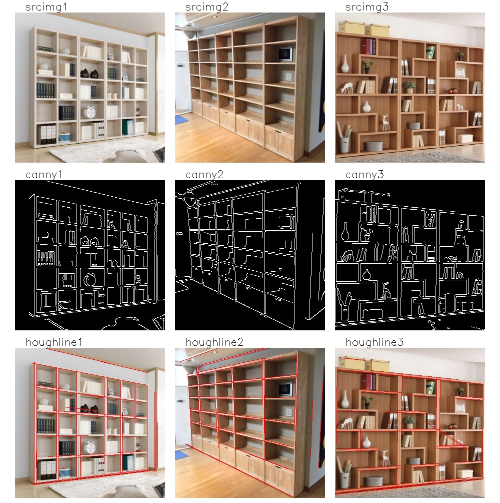
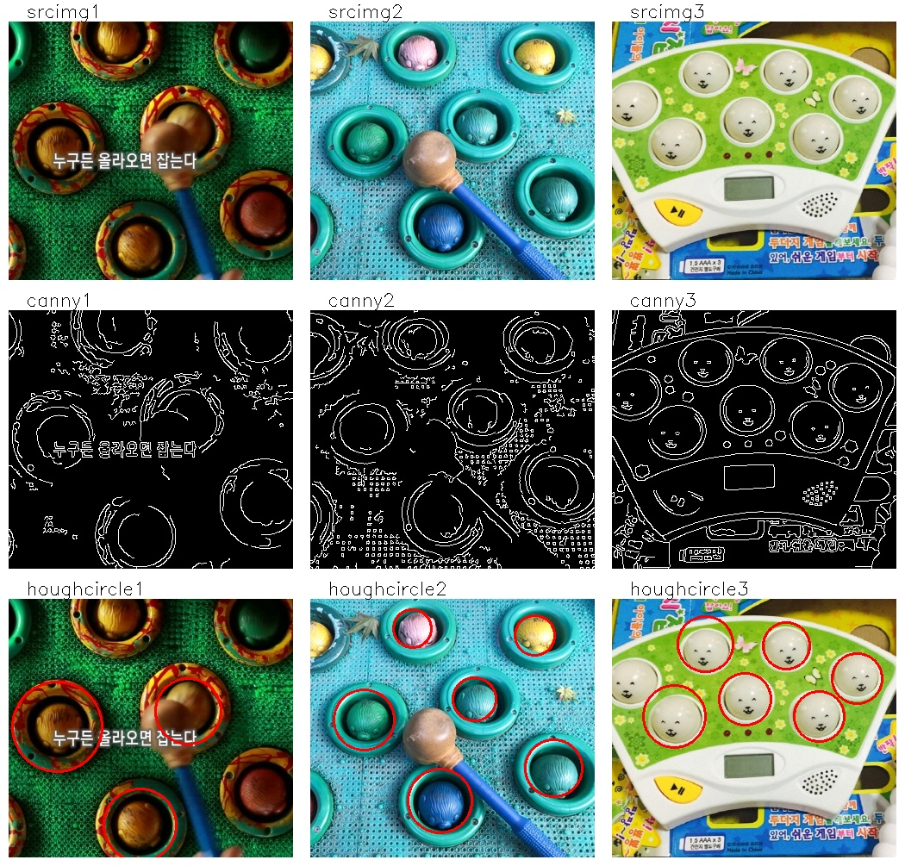
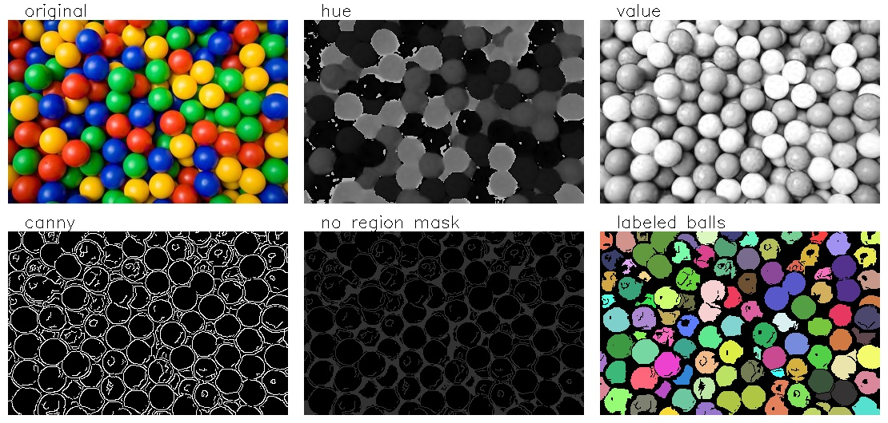

# 1. Hough Transform

**허프 변환(Hough Transform)**은 영상에서 직선이나 원과 같은 모양을 찾는 방법이다. 먼저 영상에서 캐니 엣지로 외곽선을 추출하고 엣지로 검출된 픽셀 좌표들을 **허프 공간(Hough Space)**으로 변환한다. 허프 공간은 찾고자 하는 도형의 파라미터 공간(Parameter Space)이며 이곳에서 밀도가 높은 곳의 파라미터를 찾으면 해당 도형을 픽셀 좌표계에서 찾을 수 있다. 가장 대표적인 직선 검출을 예로 들면 아래 왼쪽 그림처럼 영상에서 직선은 $$(\rho, \theta)$$ 두 개의 파라미터로 결정할 수 있다. 엣지로 검출된 선분 위의 한 픽셀을 지날수 있는 모든 직선의 파라미터를 허프 공간에 표시하면 오른쪽 그림과 같이 곡선이 그려진다. 모든 엣지의 픽셀에 대해서 허프 공간의 곡선을 그려본다. 허프 공간을 일정 간격의 그리드(grid)로 나눈 후 각 그리드를 지나는 선분의 개수가 가장 높은 그리드의 파라미터가 우리가 찾는 선분의 파라미터가 된다. 이때 각 그리드를 지나는 선분의 개수를 **vote**라고 한다. 원을 찾을때도 마찬가지로 원을 $$(x,y,r)$$ 세 개의 파라미터로 특정할 수 있으므로 3차원 허프 공간을 만들고 엣지 위의 픽셀들을 허프 공간으로 변환하면 된다.


## 1.1 Hough Line Transform

OpenCV에서는 허프 직선 변환을 구현한 `cv2.HoughLines()`와 확률적인 방법으로 직선 검출의 속도를 높인 `cv2.HoughLinesP()`라는 두 개의 함수를 제공한다.

> lines = **cv2.HoughLines**(image, rho, theta, threshold[, lines, srm, stm, min_theta, max_theta])
>
> - image: 8-bit, single channel binary source image. 주로 원본 영상에 가우시안 블러와 캐니 엣지를 적용한 영상을 입력 영상으로 쓴다.
> - rho: 직선과 원점과의 거리 측정 해상도, 허프 공간에서 rho 축을 나누는 단위, 작을수록 정확히 측정할 수 있지만 입력 영상의 노이즈에 취약해진다.
> - theta: 원점에서 직선에 내린 수선의 발의 각도 측정 해상도, 허프 공간에서 theta 축을 나누는 단위, 작을수록 정확히 측정할 수 있지만 입력 영상의 노이즈에 취약해진다.
> - threshold: 직선으로 판단한 최소한의 vote 개수, 작게 주면 검출 개수가 증가하지만 정확도가 감소, 높게 주면 검출 개수는 줄어들지만 확실한 직선만 검출
> - lines: 검출 결과, N x 1 x 2 크기의 배열 $$(\rho, \theta)$$
> - srn, stn: 허프 변환을 목표 해상도에 바로 적용하는 것은 많은 연산이 필요하므로 낮은 해상도에서 점점 높은 해상도로 올리면서 찾는다. 이때 단계별 거리와 각도 해상도 갱신 비율을 srn, stn 으로 지정한다.
> - min_theta, max_theta: 검출을 위해 사용할 최소, 최대 각도

> lines = **cv2.HoughLinesP**(image, rho, theta, threshold[, lines, minLineLength, maxLineGap])
>
> - image, rho, theta, threshold는 위와 동일
> - lines: 검출 결과, N x 1 x 4 크기의 배열로 시작점과 끝점 좌표 표현 $$(x_1, y_1, x_2, y_2)$$
> - minLineLength: 선으로 인정할 최소 길이
> - maxLineGap: 하나의 직선이 두 개 이상의 선분으로 끊어져 있을 때 얼마나 끊어진 간격까지 연결해서 하나의 선분으로 검출할 것인지 결정

두 함수 중에서 `cv2.HoughLinesP`가 속도가 빠를 뿐더러 결과도 사용자가 쓰기 쉬운 끝점 좌표로 나오고 입력 인자도 선분의 조건을 직관적으로 제한할 수 있기 때문에 많이 쓰인다. 다만 선 검출이 `cv2.HoughLines()`에 비해서는 적게 되므로 threshold를 상대적으로 낮게 지정해야 한다. 다음은 `cv2.HoughLinesP` 함수를 이용해 책장의 선분을 검출하는 예시다. 결과로 나온 배열을 사용할 때 주의할 점은 크기가 (Nx4)가 아니라 (Nx1x4)라는 것이다.

```python
import cv2
import numpy as np
import show_imgs as si
IMG_PATH = "../sample_imgs"

def hough_lines():
    img_names = [IMG_PATH + f"/bookshelf{i+1}.jpg" for i in range(3)]
    images = {}
    for i, name in enumerate(img_names):
        srcimg = cv2.imread(name, cv2.IMREAD_COLOR)
        images[f"srcimg{i+1}"] = srcimg
        # 이미지 전처리
        grayimg = cv2.cvtColor(srcimg, cv2.COLOR_BGR2GRAY)
        blurimg = cv2.GaussianBlur(grayimg, (3, 3), 0)
        cannyimg = cv2.Canny(blurimg, 100, 200)
        images[f"canny{i+1}"] = cannyimg
        # hough transform
        lines = cv2.HoughLinesP(cannyimg, 1, np.pi/180, 50, None, 50, 10)
        print("lines", lines)
        result = images[f"srcimg{i+1}"].copy()
        for line in lines:
            x1, y1, x2, y2 = line[0]
            cv2.line(result, (x1,y1), (x2,y2), (0,0,255), 1)
        images[f"houghline{i+1}"] = result

    result_img = si.show_imgs(images, "hough lines", 3, 1200)

if __name__ == "__main__":
    hough_lines()
```

아래는 결과 영상이다. `threshold, minLineLength, maxLineGap` 세 개의 파라미터를 조절하면서 어떤 효과가 나는지 확인해보고 가능하면 GUI로 조절할 수 있게 구현해보자.




## 1.2 Hough Circle Transform

OpenCV는 Hough Circle Transform을 구현한 `cv2.HoughCircles()` 함수를 제공한다.

> circles - **cv2.HoughCircles**(image, method, dp, minDist[, circles, param1, param2, minRadius, maxRadius])
>
> - image: 8-bit, single-channel, grayscale input image, `cv2.HoughLinesP()`와는 다르게 엣지 영상을 넣는 것이 아니라 단일 채널 원본 영상을 넣어준다.
> - method: 현재는 cv2.HOUGH_GRADIENT 만 구현이 되어있다.
> - dp: 허프 공간에서의 그리드 크기, dp=1이면 입력 영상의 픽셀 해상도와 같아진다.
> - minDist: 검출 원들 사이의 최소 거리
> - param1: 캐니 엣지에서 higher threshold 값, 그 절반을 lower threshold로 사용
> - param2: 원으로 판단하는 최소 vote 수
> - minRadius, maxRadius: 최소, 최대 반지름, 적당한 반지름 범위를 입력하면 잘못된 원 검출을 크게 줄일 수 있다.

다음은 `cv2.HoughCircles()` 함수를 이용해 두더지 잡기 게임에서 두더지 구멍을 찾는 예시다. 캐니 엣지는 함수 내부적으로 사용하기 때문에 따로 구해볼 필요는 없지만 내부 사정을 이해하기 위해 같은 파라미터를 넣고 캐니 엣지를 계산하였다. 

```python
import cv2
import numpy as np
import show_imgs as si
IMG_PATH = "../sample_imgs"

def hough_circles():
    img_names = [IMG_PATH + f"/mole{i+1}.jpg" for i in range(3)]
    images = {}
    for i, name in enumerate(img_names):
        srcimg = cv2.imread(name, cv2.IMREAD_COLOR)
        images[f"srcimg{i + 1}"] = srcimg
        gray = cv2.cvtColor(srcimg, cv2.COLOR_BGR2GRAY)
        gray = cv2.GaussianBlur(gray, (3, 3), 0)
        gray = cv2.GaussianBlur(gray, (3, 3), 0)
        # 알고리즘에 들어가진 않지만 중간과정을 이해하기 위한 엣지 영상
        cannyimg = cv2.Canny(gray, 100, 200)
        images[f"canny{i+1}"] = cannyimg
        # hough circle transform
        circles = cv2.HoughCircles(gray, cv2.HOUGH_GRADIENT, 1, 30, None,
                                   param1=200, param2=50, maxRadius=60)
        # result: 1xNx3 float -> Nx3 uint16
        circles = np.around(circles).astype(np.uint16)
        circles = circles[0]
        print("circles\n", circles)
        result = srcimg.copy()
        for circle in circles:  # circle: (x, y, r)
            result = cv2.circle(result, (circle[0], circle[1]), circle[2], (0,0,255), 2)
        images[f"houghcircle{i+1}"] = result

    result_img = si.show_imgs(images, "hough circles", 3, 1200)

if __name__ == "__main__":
    hough_circles()
```

결과를 보면 원이 밖에 걸쳐있는 것을 제외하고는 대부분의 두더지 구멍을 찾았다. 물론 원의 위치가 사람의 생각과는 조금 다르지만 이는 원을 정면이 아닌 사선 방향에서 찍어서 엣지가 타원으로 나오기 때문이다. 캐니 엣지를 보면 이해가 될 것이다.




# 2. FloodFill

영상에서 색이 균일한 특정 영역을 잘라내고 싶을 때 [flood fill](<https://en.wikipedia.org/wiki/Flood_fill>)이라는 알고리즘을 쓴다. 어떤 시작점(seed)에서 출발하여 주변의 값이 같거나 비슷한 픽셀들을 흡수하면서 영역을 키워나가는 방법이다. 아래 그림은 4방향 flood fill 알고리즘을 보여준다.


OpenCV에서는 이를 구현한 `cv2.floodFill()` 함수를 제공한다. `cv2.floodFill()` 함수는 영역 분할이나 영역별 영상 분석에 정말 유용한 함수이므로 사용법을 잘 알아두는 것이 좋다. 함수 사용시 주의할 점은 `image, mask`는 입력으로만 넣어도 입력 변수 값이 변하므로 두 입출력 인자는 입력과 출력을 같은 변수로 두는것이 좋다.

> retval, image, mask, rect = cv2.floodFill(image, mask, seedPoint, newVal[, loDiff, upDiff, flags])
>
> seedPoint에서 시작하여 주변에 image 픽셀 값이 비슷한 영역을 반복적으로 확장해 나간다. mask가 0인 픽셀로만 확장할수 있다. 지정된 영역에서 image에는 newVal 값이 채워지고 mask에는 1 또는 (flags>>8) 값이 채워진다.
>
> - image: 1- or 3-channel, 8-bit or floating-point image,`flags`에  `cv2.FLOODFILL_MASK_ONLY`를 지정하지 않은 경우 입력으로만 넣어도 해당 영역에 `newVal`이 채워진다.
> - mask: 입력 영상의 크기가 (H, W)라면 mask에는 (H+2, W+2) 사이즈의 single-channel 8-bit image를 입력해야 한다.
> - seedPoint: 시작점
> - newVal: 채우기에 들어갈 색상 값
> - loDiff, upDiff: 주변 픽셀을 채울지 결정하는 최대 픽셀 값 차이, 기준 픽셀이`(x, y)`이고 주변의 새로운 픽셀이 `(x', y')` 일 때, `img(x, y) - loDiff <= img(x', y') <= img(x, y) + upDiff` 를 만족해야 새로운 픽셀을 영역에 추가할 수 있다.
> - flags: 채우기 방식 지정, 여러 값을 비트별로 조합해서 사용한다. 0~7bit는 채우기 방식을 지정하고 8~15bit는 mask에 채우는 값을 지정한다.
>   - 4 or 8: 주변 4방향을 채울지 8방향을 채울지 결정
>   - cv2.FLOODFILL_MASK_ONLY: img가 아닌 mask에만 채우기 적용, 이때 mask에 채우는 값은 1을 쓰지 않고 (flags>>8)을 사용
>   - cv2. FLOODFILL_FIXED_RANGE: 주변 픽셀이 아닌 seed 픽셀과 픽셀 값 비교
>   - flags의 8~15bit(=flags>>8)에 0이 아닌 값이 있으면 mask가 1이 아닌 (flags>>8) 값으로 채워짐, 예를 들어 `flags=(4 | 128<<8)` 이면 mask를 1이 아닌 128로 채우게 됨
> - retval: 채우기 한 픽셀의 개수 (영역의 넓이)
> - rect: 채워진 영역을 감싸는 사각영역 (x, y, width, height)


### 예제 1. 신정호 넓이 측정하기

다음은 구글 지도의 신정호 위성 영상에서 신정호에 flood fill을 적용하여 신정호의 (픽셀) 넓이를 측정하는 스크립트다. 축소되어 흐릿하게 보이지만 영상의 오른쪽 아래 200m 길이를 보여주는 축적이 있다. 이를 이용하면 한 픽셀에 해당하는 실제 크기를 알 수 있고 픽셀의 넓이를 실제 넓이로 변환할 수도있다.

```python
import cv2
import numpy as np
import show_imgs as si
IMG_PATH = "../sample_imgs"

def fill_lake():
    srcimg = cv2.imread(IMG_PATH + "/sinjeong-lake.jpg", cv2.IMREAD_COLOR)
    images = {"original": srcimg}
    seed = (int(srcimg.shape[1]/2), int(srcimg.shape[0]/2))
    # 아무 처리하지 않고 바로 호수에 flood fill 적용
    fill_direct = srcimg.copy()
    mask = np.zeros((srcimg.shape[0]+2, srcimg.shape[1]+2), dtype=np.uint8)
    retval, fill_direct, mask, rect = \
        cv2.floodFill(fill_direct, mask, seed, newVal=(0, 255, 255),
                      loDiff=(2, 2, 2), upDiff=(2, 2, 2), flags=8)
    print(f"pixel area of lake WITHOUT preprocess={retval}, rect={rect}")
    fill_direct = cv2.circle(fill_direct, seed, 1, (0,0,255), 2)
    images["direct_floodfill"] = fill_direct
    # flood fill이 잘 퍼지도록 블러링 후 적용
    fill_blur = srcimg.copy()
    fill_blur = cv2.GaussianBlur(fill_blur, (3,3), 0)
    fill_blur = cv2.medianBlur(fill_blur, 3)
    mask = np.zeros((srcimg.shape[0] + 2, srcimg.shape[1] + 2), dtype=np.uint8)
    retval, fill_blur, mask, rect = \
        cv2.floodFill(fill_blur, mask, seed, newVal=(0, 255, 255),
                      loDiff=(2, 2, 2), upDiff=(2, 2, 2), flags=8 | (255 << 8))
    print(f"pixel area of lake WITH preprocess=   {retval}, rect={rect}")
    fill_blur = cv2.circle(fill_blur, seed, 1, (0,0,255), 2)
    images["blur_n_floodfill"] = fill_blur
    # 결과 출력
    images["final mask"] = cv2.cvtColor(mask[1:-1, 1:-1], cv2.COLOR_GRAY2BGR)
    result_img = si.show_imgs(images, "fill the lake", 2)

if __name__ == "__main__":
    fill_lake()
```

두 가지 결과가 있는데 하나는 전처리를 전혀 하지 않고 flood fill을 적용한 것이고 하나는 블러링을 적용 후 flood fill을 한 것이다. flood fill을 하면 약한 엣지에서 막히는 경우나 작은 점들이 빠지는 경우가 있는데 블러링을 적용하면 이러한 현상을 없앨 수 있다.


### 예제 2. 물체 개수 세기(1): Puzzle

단순한 색상의 여러 물체들이 뒤섞인 영상에서 flood fill 알고리즘을 이용하면 물체들을 분리해 낼 수 있다. 이를 응용하면 다음과 같은 퍼즐 영상에서 퍼즐의 개수를 셀 수 있다.


아래 스크립트는 flood fill을 이용해 물체들을 분리하는 기본 알고리즘을 구현한 것이다. 모든 픽셀을 돌아가면서 아직 채워지지 않은 픽셀을 `cv2.floodFill()` 함수로 채워나가면 된다. 이미 채워진 픽셀은 mask 값이 1이므로 이를 확인하면서 0인 곳에서만 색을 채우면 된다.

```python
import cv2
import numpy as np
import show_imgs as si
IMG_PATH = "../sample_imgs"

def count_puzzle():
    img = cv2.imread(IMG_PATH + "/puzzle.jpg")
    ih, iw, ch = img.shape
    mask = np.zeros((ih+2, iw+2), dtype=np.uint8)
    images = {"original": img.copy()}
    cv2.imshow("image", img)
    cv2.waitKey()
    count = 0
    for y in range(0, img.shape[0], 5):
        for x in range(0, img.shape[1], 5):
            if mask[y+1, x+1] == 0:
                # flood fill로 채울 랜덤 색상 생성
                color = np.random.randint(20, 256, 3).tolist()
                ret, img, mask, rect = cv2.floodFill(img, mask, (x,y), color, 
                                loDiff=(10,10,10), upDiff=(10,10,10), flags=8)
                mask_show = mask*255
                print(f"area={ret}, rect={rect}, mask value={mask[y+1, x+1]}")
                if ret > 500:   # 영역이 넓은 것만 퍼즐 조각으로 인정
                    cv2.imshow("image", img)
                    cv2.imshow("mask", mask_show)
                    cv2.waitKey(100)
                    count += 1
    print("total puzzle count:", count)
    cv2.destroyAllWindows()
    images["filled"] = img
    result_img = si.show_imgs(images, "floodfill", 2)
    cv2.imwrite(IMG_PATH + "/floodfill_puzzle.jpg", result_img)

if __name__ == "__main__":
    count_puzzle()
```

결과를 보면 퍼즐 조각들이 모두 새로운 색으로 칠해졌고 각 퍼즐은 한가지 색으로만 칠해진 것을 볼 수 있다. 컬러 영상에서는 세 개 채널에서 모두 조건을 만족해야 하므로  `loDiff, upDiff` 값을 크게 줘야한다. 텍스트로 프린트 된 값들을 보면 퍼즐 사이에서는 `ret` 값이 1로 나온 경우가 대부분이다. 한 픽셀도 확장하지 못 한 것이다. 하지만 색이 균일한 퍼즐 안에서는 1000 픽셀 이상 나오는 것을 볼 수 있다. 이러한 성질을 이용해서 채워진 **픽셀 영역이 500 이상일 때만 퍼즐로 인정**하여 `count` 변수를 증가시켰다. 결과가 80이 나왔는데 실제로 영상의 퍼즐도 10x8로 배치되어 있어 정확하게 개수를 센 것을 알 수 있다.


### 예제 3. 물체 개수 세기(2): Ball Pool

이번에는 실제 사진에 적용해보자. 아래 사진처럼 형형색색의 공이 쌓여있는 볼풀(ball pool)에서 공의 개수를 세어보자. 사진을 보면서 공들을 분리해낼 수 있는 특징(feature)을 생각해보자.


#### Step 1. Prepare a Guide Mask

이 영상에 퍼즐 예제와 같이 BGR 영상에 바로 flood fill을 한다면 음영의 차이 때문에 하나의 공이 여러개의 영역으로 분리될 수 있다. 공들의 색이 선명하게 차이가 나니 HSV 컬러 스페이스에서 Hue 채널을 이용하면 색상이 다른 공들을 쉽게 분리할 수 있을 것이다. 그리고 공들 사이에 음영이 어두워지는 엣지를 활용하면 같은 색의 공들도 어느정도 분리할 수 있을 것이다. 색상을 이용한 flood fill을 하기 전에 엣지나 음영 정보를 이용해서 **flood fill로 채워지는 범위에 대한 가이드를 mask로 만들어주자.** 보통은 mask를 all-zero-array에서 시작하지만 여기서는 flood fill로 영역이 확장되면 안되는 공의 외곽선 영역의 mask에 값을 입력한다. 영역이 확장되지 못하도록 미리 울타리를 쳐주는 것이다.

```python
import cv2
import numpy as np
import show_imgs as si
IMG_PATH = "../sample_imgs"
NO_REGION = 50
AREA_THR = 100
LABEL_BEGIN = 100

def count_balls():
    srcimg = cv2.imread(IMG_PATH + "/ballpool.jpg", cv2.IMREAD_COLOR)
    images, mask = prepare_mask(srcimg)
    result_img = si.show_imgs(images, "floodfill", 3)

def prepare_mask(srcimg):
    images = {"original": srcimg}
    hsvimg = cv2.cvtColor(srcimg, cv2.COLOR_BGR2HSV)
    images["hue"] = hsvimg[:, :, 0]
    images["value"] = hsvimg[:, :, 2]
    # canny edge와 value 값을 이용해서 no-region mask 만들기
    canny = cv2.Canny(images["value"], 80, 160)
    images["canny"] = canny
    mask = np.zeros(canny.shape, np.uint8)
    mask[canny > 10] = NO_REGION
    mask[images["value"] < 70] = NO_REGION
    images["no region mask"] = mask
    # 상하좌우에 1픽셀씩 추가 (H, W) -> (H+2, W+2)
    mask = np.pad(mask, ((1, 1), (1, 1)))
    return images, mask
```


#### Step 2. Apply Flood Fill

mask가 준비되었다면 이제 flood fill을 적용할 차례다. Hue 영상에 flood fill을 적용하는데 영상에 직접 색을 칠하지 않고 mask에만 공마다 다른 값을 채울 것이다. 원본 영상에 직접 값을 채우면 이후의 flood fill에 영향을 줄 수 있다. 일단 공마다 mask에 다른 값을 채운 후에 mask를 이용해 공들을 다른 색으로 표현해보자.  

- `range(0, ih, 5)`로 5 픽셀마다 확인하는 이유는 공의 크기가 확실히 5x5 보다는 크기 때문에 굳이 모든 픽셀을 채울 필요는 없기 때문이다. 5 픽셀 간격으로 flood fill을 해도 모든 공을 채울 수 있다.  

- flood fill을 적용할 때 `mask`를 바로 넣지 않고 복사본인 `mask_tmp`를 넣는 이유는 flood fill을 한 후 공의 영역이 아니면 다른 값으로 mask를 채우기 위해서다.

- `mask`를 1이 아닌 특정 값(value)으로 채울 때는 `flags`에 `(value << 8)`을 추가해야 한다.

- `label`은 mask를 채울 값으로서 채워진 영역의 넓이가 `AREA_THR` 보다 넓으면 `mask`를 `label`로 채우고 `label` 값을 1 증가시킨다.

- 채워진 영역의 넓이가 `AREA_THR` 이하면 공이 아닌 공 사이의 작은 영역이므로 `mask`를 `NON_REGION` 으로 채운다.

```python
def count_balls():
    srcimg = cv2.imread(IMG_PATH + "/ballpool.jpg", cv2.IMREAD_COLOR)
    images, mask = prepare_mask(srcimg)
    result_img = si.show_imgs(images, "floodfill", 3)
    mask, label = find_balls(images, mask)
    print("number of balls:", label - LABEL_BEGIN)

def find_balls(images, mask):
    label = LABEL_BEGIN
    ih, iw, ch = images["original"].shape
    hueimg = images["hue"].copy()
    for v in range(0, ih, 5):
        for u in range(0, iw, 5):
            if mask[v+1, u+1] > 0:
                continue
            flags = (4 | cv2.FLOODFILL_MASK_ONLY | (label << 8))
            area, hueimg, mask, rect = \
                cv2.floodFill(hueimg, mask, (u, v), None, 1, 1, flags)
            print(f"floodfill at {(u, v)}, pixels={area}, rect={rect}, label={label}")
            if area > AREA_THR:
                label += 1
                cv2.imshow("floodfill mask", mask)
                cv2.waitKey(100)
            else:   # 영역이 너무 작으면 mask를 다시 NO_REGION 으로 채우기
                mask[mask == label] = NO_REGION
    cv2.waitKey()
    return mask, label
```


#### Step 3. Colorize Balls

각 공마다 다른 값으로 mask를 채웠다면 결과를 시각적으로 보여주기 위해 각 공을 랜덤한 색으로 칠해보자. `colorize_regions`이란 함수에 `mask`와 최종 `label` 값을 넘겨주고 각 label 값에 해당하는 공의 영역마다 다른 색을 칠한 영상을 만든다. 랜덤 색상은 `np.random.randint(50, 256, 3)`으로 만들 수 있다. 마지막에 `image[1:-1, 1:-1, :]`는 `mask`의 크기가 원래 영상보다 상하좌우로 1 픽셀씩 더 크니 다시 원래 영상 크기로 slicing 한 것이다.

```python
def count_balls():
    srcimg = cv2.imread(IMG_PATH + "/ballpool.jpg", cv2.IMREAD_COLOR)
    images, mask = prepare_mask(srcimg)
    result_img = si.show_imgs(images, "floodfill", 3)
    mask, label = find_balls(images, mask)
    print("number of balls:", label - LABEL_BEGIN)
    images["labeled balls"] = colorize_regions(mask, label)
    result_img = si.show_imgs(images, "floodfill", 3)

def colorize_regions(mask, label_max):
    image = np.zeros((mask.shape[0], mask.shape[1], 3), np.uint8)
    for label in range(LABEL_BEGIN, label_max, 1):
        image[mask==label, :] = np.random.randint(50, 256, 3)
    return image[1:-1, 1:-1, :]
```


결과를 보면 대부분의 공들이 다른 색으로 칠해진 것을 볼 수 있다. 물론 왼쪽 위의 노란 공들처럼 하나의 영역으로 붙은 것들도 있다. 그리고 다른 공들 아래 깔린 공들은 잘 검출되지 않았다. 하지만 사람이 직접 특정 픽셀을 지정하지 않고 대부분의 공들을 자동으로 찾았다는 점에서 의미가 있다. 이 코드에는 이 영상을 위해 튜닝된 파라미터들이 많다. 최소 영역 넓이인 `AREA_THR` 라든가 캐니 엣지에 들어가는 파라미터도 있고 Value 채널이 70이하면 공의 영역이 아닌 것으로 했다. 이런 파라미터들을 GUI를 통해 조절하게 한다면 더 다양한 영상에서 사물의 개수를 셀 수 있을 것이다.




# 3. Watershed

워터셰드(watershed)란 강줄기가 갈라지는 분수령이란 뜻인데 새로운 무언가가 시작하는 경계라는 의미도 있다. 영상처리에서는 사물의 경계를 찾는 기법 중 하나로 픽셀 값을 산과 골짜기 같은 지형으로 보고 산의 능선을 따라 경계를 정하는 방법이다. 그러나 일반적인 영상에서는 사물의 경계에서 픽셀들이 높은 값을 가지지 않는다. 경계에서 높은 값을 갖게 하려면 gradient를 구하면 된다. 다음 그림을 보면 이해하기 쉽다. ([출처 링크](<http://www.cmm.mines-paristech.fr/~beucher/wtshed.html>))

 


다음 그림에서 기러기의 영역만 추출하려면 어떻게 해야할까? 앞서 배운 flood fill을 이용한다면 밝고 큰 영역은 쉽게 배경으로 처리할 수 있을 것이다. 하지만 flood fill의 문제는 오직 바로 주변 픽셀만 보기 때문에 한 픽셀만 연결되어도 두 개의 영역을 하나의 색으로 채운다는 것이다. flood fill을 하다가 기러기 꼬리의 흰 털을 배경으로 인식할 수도 있다. 또한 floodfill로 모든 픽셀을 채우려면 연산량이 굉장히 많아서 속도면에서 느릴 수 밖에 없다.  

아니면 단순히 밝기나 색상을 이용해 간단히 threshold를 하는 방법도 있다. 하지만 그렇게 하면 기러기 내부의 흰색을 구분할 수 없고 이를 없애기 위해 열림(opening)과 같은 모폴로지 연산을 하게 되면 외곽선이 뭉개져서 날개의 깃털을 세밀하게 구분할 수 없다.


여기서는 OpenCV에서 워터셰드 알고리즘을 구현한 `cv2.watershed()` 함수를 사용하여 이를 해결할 것이다. 먼저 간단한 스레시홀드와 모폴로지 연산으로 확실하게 하늘인 곳과 확실하게 기러기인 영역을 찾는다. 확실한 영역은 `markers`에 표시하고 나머지는 0으로 채워 함수에 입력하면 함수에서 정확한 경계를 찾아준다.

> markers = **cv2.watershed**(image, markers)
>
> - image: 입력 영상
> - markers: 입력 영상과 크기는 같고 타입이 np.int32인 배열, 영역을 구분할 수 있는 곳엔 영역마다 1이상의 다른 값을 넣고 영역을 구분할 수 없는 곳엔 0을 채운다. 함수 실행 후엔 모든 0들이 워터셰드 알고리즘에 의해 해당 영역의 값으로 바뀌고 영역 사이의 경계에는 -1이 들어간다.


```python
import cv2
import numpy as np
import show_imgs as si
IMG_PATH = "../sample_imgs"
SKY_LABEL = 1
GOOSE_LABEL = 2

def watershed():
    srcimg = cv2.imread(IMG_PATH + "/wildgoose.jpg", cv2.IMREAD_COLOR)
    images = {"original": srcimg}
    # find apprent background(sky) and wild goose region
    gray = cv2.cvtColor(srcimg, cv2.COLOR_BGR2GRAY)
    gray = cv2.GaussianBlur(gray, (3, 3), 0)
    ret, binary = cv2.threshold(gray, 150, 255, cv2.THRESH_BINARY)
    kernel = cv2.getStructuringElement(cv2.MORPH_RECT, (3, 3))
    images["threshold"] = binary
    app_sky = cv2.erode(binary, kernel, iterations=3)
    images["apparent sky"] = app_sky
    app_goose = cv2.dilate(binary, kernel, iterations=1)
    images["apparent wildgoose"] = app_goose
    images["undetermined"] = cv2.subtract(app_goose, app_sky)
    # create markers and watershed
    markers = np.zeros(gray.shape, dtype=np.int32)
    markers[app_sky > 0] = SKY_LABEL
    markers[app_goose == 0] = GOOSE_LABEL
    markers = cv2.watershed(srcimg, markers)
    # show contours of wild gooses
    labelimg = np.zeros_like(srcimg)
    labelimg[markers == -1, :] = (0, 0, 255)      # draw contours
    labelimg[markers == SKY_LABEL, :] = (200, 150, 100)
    labelimg[markers == GOOSE_LABEL, :] = srcimg[markers == GOOSE_LABEL, :]
    images["label"] = labelimg
    result_img = si.show_imgs(images, "watershed", 3)

if __name__ == "__main__":
    watershed()
```

결과 영상을 보면 threshold로 대략의 영역 구분은 되었으나 기러기 내부에도 밝은 영역이 남아있다. "threshold" 영상에서 확실한 배경 영역을 만들기 위해 침식 연산을 3회 반복하여 "apparent sky" 영상을 만들었다. 또한 "threshold" 영상에 팽창 연산을 적용하여 확실한 기러기 영역을 만들었다. 두 가지 영역을 각각 `SKY_LABEL`, `GOOSE_LABEL`로 채우고 그 사이 영역을 0으로 남긴 `markers`를 만들었다. `cv2.watershed()` 함수를 실행한 결과를 보니 정확히 영역이 구분된 것을 볼 수 있다.


