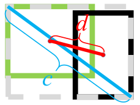

## 1. Detector Loss

손실 함수(loss function)란 모델의 출력(예측, Prediction)과 Ground Truth(GT, Annotation, Label) 사이의 차이를 나타내는 함수다. 모델 학습은 이 손실 함수를 줄이기 위해 신경망의 파라미터들을 업데이트 한다. 모델 예측과 GT 사이의 직접적인 차이를 손실함수로 쓸 수도 있지만 Cross Entropy처럼 간접적으로 둘 사이의 차이에 비례하여 커지는 다른 함수를 사용할 수도 있다. 

Object Detector는 검출, 분류, 회귀(regression) 세 가지 기능을 하고 세 가지 예측이 모두 맞아야 객체를 제대로 찾을 수 있다. 따라서 손실 함수가 하나의 함수로 이뤄지지 않고 여러 손실 함수의 합으로 전체 손실 함수가 만들어진다. 다음은 Object Detector의 세 가지 기능에 대한 설명이다.

- 검출: 모델이 출력한 multi-scale feature map에서 scale × grid_h × grid_w × anchor 마다 객체가 있는지 없는지 **Objectness**를 구분한다. Objectness는 0~1 사이의 확률값으로 출력한다.
- 분류: 모델에서 출력된 객체마다 객체의 종류를 분류한다. 각 객체 출력은 K(카테고리 개수) 차원의 **Categorical Probability**를 포함한다.
- 회귀: 검출 모델은 객체를 감싸는 **Bounding Box**를 예측한다. Bounding Box는 위치(y, x)와 크기(h, w)로 나타내는데 이미지 너비, 높이를 1로 가정하여 위치와 크기를 0~1 사이의 값으로 출력한다.

예측과 GT label에 대한 기호를 다음과 같이 정리한다.

> $y, x$: bounding box 중심점 좌표
>
> $h, w$: bounding box 높이, 너비
>
> $o$: objectness, 객체가 존재할 확률
>
> $p_k,\ k=0,...,K-1$: 객체가 k번째 클래스에 속할 확률
>
> $c$: GT에서 객체의 클래스 인덱스(class index)
>
> **GT**: $$y^*, x^*, h^*, w^* \in [0, 1], \quad o^*,p_k^* \in \left\{0, 1\right\}, \quad c^* \in \left\{0,..., K-1\right\}$$
>
> **Prediction**: $y, x, h, w, o, p_k \in [0, 1]$
>
> **Anchor**: $y^a, x^a, h^a, w^a \in [0, 1]$
>
> $N$: feature map에 포함된 전체 anchor 수 (grid_h × grid_w × anchor)
>
> $N_{pos} = \sum_i o_i^*$: GT feature map에서 실제 객체가 들어있는 anchor 수 (# positive anchors)
>
> $N_{neg} = N - N_{pos}$: GT feature map에서 객체가 없는 anchor 수 (# negative anchors)

이제 각각의 기능을 학습시키는 다양한 손실 함수에 대해서 알아보자. 같은 기능을 학습시켜도 논문마다 다양한 손실 함수를 제안하고 있으니 여러가지를 시도해보는게 좋다.

### 1.1. Bounding Box

#### 1.1.1. Faster R-CNN

$$
\mathcal{L}_{box} = {1 \over N_{pos}} \sum_{i=0}^{N} o_i^* \sum_{a \in \{y,x,h,w\}} H_{\delta}(\bar{a}_i^* - \bar{a}_i) \\
H_{\delta}(a) = \begin{cases}
{1 \over 2} a^2, & \mbox{if } |a|<\delta \\
\delta \left( |a| - {1 \over 2}\delta \right), & \mbox{otherwise}
\end{cases} \\
\bar{y}^* = (y^* - y^a) / h^a, \quad \bar{y} = (y - y^a) / h^a \ \rightarrow \ \bar{y}^* - \bar{y} =  (y^* - y) / h^a \\
\bar{x}^* = (x^* - x^a) / w^a, \quad \bar{x} = (x - x^a) / w^a \ \rightarrow \ \bar{x}^* - \bar{x} =  (x^* - x) / w^a \\
\bar{h}^* = \log(h^* / h^a), \quad \bar{h} = \log(h / h^a) \ \rightarrow \ \bar{h}^* - \bar{h} = \log(h^* / h) \\
\bar{w}^* = \log(w^* / w^a), \quad \bar{w} = \log(w / w^a)\ \rightarrow \ \bar{w}^* - \bar{w} = \log(w^* / w)
$$

Faster R-CNN에서는 RPN(Region Proposal Network)에서 1차적으로 box prediction을 한다. RPN 학습시 Prediction과 GT 값을 직접 빼지 않고 $t_a$ 라는 중간 변수를 만들어 그 차이를 손실로 사용한다. 중간 변수를 만드는 주 목적은 anchor scale에 따른 손실의 불균형을 잡아주는 것이다. y, x 좌표 오차는 anchor의 h, w로 나누어서 손실 함수가 크기가 큰 객체에 편중되지 않도록 한다. h, w도 Prediction과 GT 사이의 비율을 log에 넣어서 자연스럽게 객체 크기에 무관한 손실 함수를 만들었다.  


**Huber loss**는 regression 문제에서 자주 쓰이는 손실 함수인데, L1 norm과 L2 norm의 장점만 결합한 함수다. Faster R-CNN 논문에서는 *Robust loss function 또는 smooth L1* 이라고 표현했다.

|       | 장점                                                         | 단점                                                         |
| ----- | ------------------------------------------------------------ | ------------------------------------------------------------ |
| L1    | 오차에 대해 선형적이므로 이상치(outlier)에 덜 민감           | 0에서 미분이 불연속적<br />미분값이 상수라서 0에 정확히 수렴시키기 어려움 |
| L2    | 미분값이 오차에 비례하여 수렴속도 자동조절<br />0에서 미분이 연속적 | 오차의 제곱이므로 이상치(outlier)에 민감<br />이상치에서 너무 큰 손실 발생시켜 전체적인 학습 방해 |
| Huber | 큰 오차에 대해 선형적이므로 이상치(outlier)에 덜 민감<br />미분값이 오차에 비례하여 수렴속도 자동조절<br />0에서 미분이 연속적 | 연산량?                                                      |

다음은 세 가지 함수를 비교한 그래프다.


#### 1.1.2. YOLO v1

$$
\mathcal{L}_{box} = {1 \over N_{pos}} \sum_{i=0}^{N} o_i^* \left\{
\left(y_i^* - y_i\right)^2 + \left(x_i^* - x_i\right)^2 + 
\left(\sqrt{h_i^*} - \sqrt{h_i}\right)^2 + \left(\sqrt{w_i^*} - \sqrt{w_i}\right)^2
\right\}
$$

YOLO 초기 모델에서는 bounding box에 대한 손실 함수를 위와 같이 정의하였다. YOLO는 정해진 anchor box가 없고 단지 grid 마다 B(=2)개의 box를 예측하도록 만들었다. 그래서 anchor box의 크기를 이용한 scale normalization을 못하지만 객체 크기가 큰 물체의 높이, 너비 오차에 의한 손실의 비중이 너무 커지지 않도록 너비, 높이에 square root를 씌웠다.

#### 1.1.3. YOLO v3

$$
\mathcal{L}_{box} = \sum_{s \in \left\{l, m, s\right\}} {1 \over N_{s,pos}} \sum_{i=0}^{N_s} o_i^*
\sum_{a \in \{y,x,h,w\}} (\hat{a}_i^* - \hat{a}_i)^2 \\

y^* = \sigma(\hat{y}^*) + c_y, \quad y = \sigma(\hat{y}) + c_y \\
x^* = \sigma(\hat{x}^*) + c_y, \quad x = \sigma(\hat{x}) + c_x \\
h^* = h^a * e^{\hat{h}^*}, \quad h = h^a * e^{\hat{h}} \\
w^* = w_a * e^{\hat{w}^*}, \quad w = w^a * e^{\hat{w}}
$$

YOLO v3에서는 세 가지 스케일의 feature map이 나오기 때문에 앞에 스케일에 대한 합이 추가되었다. 위 식에서 $\hat{a}$는 모델에서 마지막 convolution을 통과한 raw feature 값이고 $a$는 이를 bounding box의 크기나 좌표로 decode한 결과다. GT에서는 $$a^*$$가 주어진 값이고 $$\hat{a}^*$$는 decoding 과정을 역으로 계산하여 얻을 수 있다. 손실 함수에서는 bounding box의 크기, 좌표의 차이가 아니라 raw feature 값의 차이를 사용한다.   raw feature는 스케일의 영향도 받지 않고 $$-\infty \sim +\infty$$ 사이의 값을 가질 수 있기 때문에 큰 오차들을 빠르게 감소시킬 수 있다.  

#### 1.1.4. Complete IoU

검출 모델에서 실제 객체를 잘 검출했는지를 판단하는 기준은 GT box와 Predicted box 사이의 IoU(Intersection over Union)다. 결국 Bounding box loss의 목적은 GT box와 Predicted box를 일치시켜 IoU를 높이는 것이다. 그래서 YOLO 처럼 bounding box의 위치, 크기의 오차를 줄이기 보다는 IoU 자체를 손실 함수에 적용하는 방법이 연구되었다. 

1. IoU loss : IoU는 두 box(GT, Prediction)가 아예 겹치지 않으면 미분이 0이라서 학습이 되지 않는다.  
   $$
   IoU = {|B^{gt} \cap B| \over |B^{gt} \cup B|} \\
   \mathcal{L}_{IoU} = 1 - IoU
   $$
   
2. GIoU loss: 두 box가 떨어진 상태에서도 겹치는 부분이 생기도록 유도하는 penalty 함수를 추가한다. C는 두 box를 포함하는 최소의 box다.  
   $$
   \mathcal{L}_{GIoU} = 1 - IoU + {|C - B^gt \cup B| \over |C|}
   $$
   
3. DIoU loss: 두 box의 중심점 좌표가 먼저 가까워지도록 유도한다. $\rho(\cdot)$은 Euclidean distance, $\mathbf{b}^{gt}, \mathbf{b}$는 각각 GT box와 Predicted box의 중심점이고 $c$는 위에서 말한 C box의 대각선 길이다.  
   $$
   \mathcal{L}_{DIoU} = 1 - IoU + {\rho^2(\mathbf{b}^{gt}, \mathbf{b}) \over c^2}
   $$
   
4. CIoU loss: DIoU loss에서 두 box 사이의 aspect ratio (가로/세로 비율)까지 비슷하게 맞추는 penalty를 추가하였다. (여기까지 하고 보니 box regression loss에 IoU loss를 더해준 것처럼 보인다.)  $v$는 arctan으로 계산되므로 범위가 $[0,\pi/2]$ 사이에 있으므로 앞에는 최대 값의 역수를 곱해서 $v$가 $[0,1]$ 범위에 들어오게 한다. $\alpha$는 IoU가 높을 수록 $v$에 의한 손실이 커지게 만든다. 즉, 초기에는 두 박스의 중심점을 맞추는데 집중하고 IoU가 어느정도 높아지면 aspect ratio에 높은 가중치를 두고 학습한다.  
   $$
   \mathcal{L}_{CIoU} = 1 - IoU + {\rho^2(\mathbf{b}^{gt}, \mathbf{b}) \over c^2} + \alpha v \\
   v = {4 \over \pi^2} \left(\arctan {w^* \over h^*} - \arctan {w \over h} \right)^2, \quad
   \alpha = {v \over 1-IoU+v}
   $$



CIoU loss가 bounding box loss 중에는 가장 효과적이라고 알려져있기 때문에 본 강의에서 구현한 YOLO v3에서도 loss는 CIoU를 사용하였다.


### 1.2. Objectness

#### 1.2.1. Faster R-CNN

$$
\mathcal{L}_{obj} = \sum_{i=0}^{256} -\left\{ (1 - o_i^*) \log o_{i,0} + o_i^* \log o_{i,1} \right\} \\
o_{i,k} = {\exp(o_{i,k}) \over \exp(\hat{o}_{i,0}) + \exp(\hat{o}_{i,1})}
$$

Faster R-CNN에서는 RPN 학습시 objectness를 두 채널로 출력 후 softmax를 이용해 두 개의 확률($$o_{i,0},\ o_{i,1}$$)로 변환한다. 이후 GT Objectness와의 cross entropy를 적용하여 손실 함수를 구한다.  

Positive와 negative anchor의 불균형을 해결하기 위해 mini-batch 단위로 256개의 anchor를 랜덤하게 샘플링하여 학습시킨다. 가급적 positive vs negative 비율이 1:1이 되도록 샘플링하는데 $N_{pos} < 128$ 이면 negative anchor들을 추가하여 256개를 맞춘다.  

Positive anchor는 두 가지 기준으로 선정한다. 1) GT anchor 마다 IoU가 가장 높은 Prediction anchor, 2) 그외 GT와 IoU가 0.7 이상인 Prediction anchor. Negative anchor는 positive anchor가 아닌 것 중에서 어떤 GT anchor와도 IoU가 0.3 이하인 Prediction anchor 중에 선택한다.

#### 1.2.2. YOLO v1

$$
\mathcal{L}_{obj} = \sum_{i|o_i^*==1} \left(o_i^* - o_i \right)^2 + 
\lambda_{noobj} \sum_{i|o_i^*==0} \left(o_i^* - o_i \right)^2, \quad \lambda_{noobj}=0.5
$$

YOLO v1에서는 objectness가 하나의 채널로 출력된다. Head feature에서 objectness에 해당하는 채널에 sigmoid 함수를 적용하여 입력값에 비례하는 0~1 사이의 확률로 변환한다.  

YOLO v1에서는 Objectness 학습을 단순히 regression 문제로 보고 예측과 GT 사이의 L2 distance를 손실 함수로 사용했다. 다만 압도적 다수인 negative anchor의 영향을 줄이기 위해 negative anchor의 가중치를 0.5로 주었다.  

#### 1.2.3. YOLO v3

YOLO v3에서는 objectness를 binary classification 문제로 보고 binary cross entropy (BCE)를 사용하여 학습을 시킨다. 논문에서는 딱히 positive vs negative 불균형에 대한 언급이 없어서 그냥 다 더하는 것으로 보인다. YOLO v3를 구현한 여러 github을 보면 Faster R-CNN 처럼 IoU가 0.3 이하인 anchor들만 negative anchor로 학습하고 GT box와 같은 위치의 Prediction anchor들을 모두 positive anchor로 학습한다. 근데 논문에서는 IoU를 이용한 구분이 별 효과가 없다고 써있다.  

본 구현에서는 Objectness loss를 다음과 같이 구현하였다.

$$
\mathcal{L}_{box} = \sum_{s \in \left\{l, m, s\right\}} \left\{
{1 \over N_{s,pos}} \sum_{i | o_i^*==1} BCE(o_i^*, o_i) 
+ {1 \over N_{s,neg}} \sum_{i | o_i^*==0} BCE(o_i^*, o_i) \right\} \\
= \sum_{s \in \left\{l, m, s\right\}} \left\{
{1 \over N_{s,pos}} \sum_{i | o_i^*==1} \log(o_i) 
+ {1 \over N_{s,neg}} \sum_{i | o_i^*==0} \log(1 - o_i) \right\} \\
BCE(o_i^*, o_i) = o_i^* \log o_i + (1 - o_i^*) \log(1 - o_i)
$$

Positive와 negative 사이의 불균형을 잡기 위해 positive anchor와 negative anchor에서 나온 BCE의 평균을 따로 내서 더하였다. 전체 anchor는 수만개인데 (256 x 832 입력 해상도에서 13,104개) 한 이미지에 포함된 실제 객체는 몇 개 혹은 몇 십개 정도이기 때문에 GT feature map에서 극소수만 objectness가 1이고 대부분이 0이 된다. Label 불균형이 심각하기 때문에 두 가지 anchor에서 나온 손실 함수를 그냥 더하면 전반적으로 모두 0으로 학습될 가능성이 있다. 하지만 위와 같이 두 가지 label에 대해 따로 평균을 내면 label 별 anchor 개수와는 무관한 값이 나오므로 positive와 negative를 균형있게 학습할 수 있다.


### 1.3. Categorical Probability

#### 1.3.1. Faster R-CNN

$$
\mathcal{L}_{cat} = \sum_{i|o_i^*==1} \sum_{k=0}^{K-1} -p_{i,k}^* \log p_{i,k} 
= \sum_{i=0}^{N} -\log p_{i,c_i^*}
$$

Faster R-CNN은 Fast R-CNN에서 RPN만 추가되었고 Detection Head는 동일하다. 아래 그림은 Fast R-CNN의 구조를 나타낸다. Region proposal 영역에서 RoI pooling으로 고정된 크기의 feature vector를 추출한다. Feature vector는 몇 개의 FC(fully connected) layer를 거친 후 softmax activation을 적용하여 K개의 확률값을 출력한다. 그리고 위 식과 같은 cross entropy 손실 함수를 통해 학습한다. 이는 전형적인 classifier를 학습하는 과정과 같다.


#### 1.3.2. YOLO v1

$$
\mathcal{L}_{cat} = \sum_{i|o_i^*==1} \sum_{k=0}^{K-1} \left(p_{i,k}^* - p_{i,k} \right)^2
$$

YOLO v1에서 categorical probability를 출력하는 채널은 카테고리 별 확률을 학습한다. 그래서 objectness와 마찬가지로 sigmoid를 activation 함수로 쓰고 확률의 오차를 손실 함수로 사용한다.

#### 1.3.3. YOLO v3

$$
\mathcal{L}_{cat} = \sum_{s \in \left\{l, m, s\right\}} \left\{
{1 \over N_{s,pos}} \sum_{i | o_i^*==1} {1 \over K} \sum_{k=0}^{K-1} BCE(p_{i,k}^*, p_{i,k}) \right\} \\
BCE(p_{i,k}^*, p_{i,k}) = p_{i,k}^* \log p_{i,k} + (1 - p_{i,k}^*) \log(1 - p_{i,k})
$$

YOLO v3는 multi-label classification을 할 수 있도록 설계됐기 때문에 activation으로 softmax가 아닌 sigmoid를 사용한다. 즉 여러 클래스를 경쟁적인 관계로 봐서 모든 클래스에 대한 확률의 합이 1이 되도록 하는 것이 아니라, 객체가 각 클래스에 속할 확률을 독립적으로 출력한다. 각 클래스에 속하는지 아닌지를 학습해야 하므로 binary cross entropy(BCE)를 손실 함수로 사용한다. Anchor마다 모든 클래스에 대해 BCE를 계산하여 평균을 낸다.


## 2. Training Log

딥러닝 모델을 그냥 막 학습해서 바로 좋은 결과가 나오는 경우는 거의 없다. 원인은 여러가지인데 모델 파라미터의 초기값이 부적절할 수도 있고 학습 데이터나 모델을 만들때 버그가 있을 수도 있고 손실 함수가 적합하지 않거나 손실 함수 사이의 균형이 맞지 않을 수 있다. 학습이 잘 안되면 모델의 중간 결과물을 확인해야 어디서 잘못되고 있는지 파악할 수 있다.  

YOLO v3처럼 여러가지 손실 함수를 혼합하여 사용하는 경우에 각각의 손실 함수 크기를 따로 보는게 도움이 된다. 객체 검출이 잘 되기 위해서는 검출, 분류, 회귀 세 가지가 모두 잘 학습되어야 하는데 어느 단계에서 문제가 있는지 알려면 각 출력 별 손실 함수를 확인해야 한다.  

손실 함수가 줄어들면 대체로 성능 지표(metric)도 좋아지지만 그 관계가 선형적이지도 않고 (손실 함수가 반이 된다고 성능이 두 배 되지는 않는다.) 가끔은 손실 함수가 줄어도 성능이 개선되지 않는 경우도 있다. 대표적으로 cross entropy의 경우, 특정 하나의 anchor에서의 손실 함수가 무한대에 가까운 값이 나올수 있기 때문에 평균적인 손실 함수 감소가 성능 지표에 도움이 안될 수도 있다. 다음 두 가지 case를 비교해보자.

1. GT label: [1 0 0], Predicted Probability: [1e-10, 0.3, 0.3] → Accuracy: 2/3
   - BCE loss: $$\mathcal{L} = -\log10^{-10} - \log 0.7 - \log 0.7 = 23.7$$
2. GT label: [1 0 0], Predicted Probability: [1e-5, 0.3, 0.7] → Accuacy: 1/3
   - BCE loss: $$\mathcal{L} = -\log10^{-5} - \log 0.7 - \log 0.3 = 13.1$$

Case 1에서는 셋 중 두 개가 맞았지만 손실 함수가 높고 Case 2는 셋 중 하나만 맞았지만 손실 함수가 상대적으로 낮다. 이렇게 손실 함수와 성능 지표가 decouple 될 수 있기 때문에 출력 별 성능 지표를 따로 계산해서 기록하는 것도 모델이 학습되면서 성능이 개선되고 있는지 확인하는데 도움이 된다.  

이러한 목적을 위해 다음 항목들을 학습과 검증 과정에서 로깅(logging) 한다.

1. total_loss: 가중치가 반영된 총 손실 함수의 합
2. ciou: bounding box 예측에 대한 CIoU 손실 함수
3. object: objectness 예측에 대한 손실 함수
4. category: categorical probaility 예측에 대한 손실 함수
5. pos_obj: GT objectness가 1인 anchor에서 평균적인 objectness 예측 값
6. neg_obj: GT objectness가 0인 anchor중에서 objectness가 가장 높은 50개의 평균
7. time_m: 1 epoch을 처리하는게 걸린 시간 (분 단위)

`ciou, object, category` 모두 가중치가 반영되지 않은 개별 손실 함수이며 `pos_obj, neg_obj`는 objectness 예측의 정확도를 알아보기 위한 성능 지표다.

본 구현에서는 위 항목들을 mini batch 단위로 계산하여 기록하고 epoch 마다 평균을 구해서 (7번 제외) `history.csv`라는 파일에 저장한다. 여러 epoch을 학습하면서 각 항목의 증감 경향을 보면 학습이 의도한대로 진행되고 있는지 확인할 수 있다.

### 2.1. LogData

학습과 검증 과정에서 결과물을 분석하여 로그(log) 데이터를 축적해주는 `LogData`라는 클래스를 만들었다. `run_epoch()` 함수에서 다음과 같이 사용된다.

```python
class TrainValBase:
    def run_epoch(self, dataset):
        logger = LogData()
        for step, features in enumerate(dataset):
            start = timer()
            prediction, total_loss, loss_by_type = self.run_batch(features)
            logger.append_batch_result(step, features, prediction, total_loss, loss_by_type)
            uf.print_progress(f"training {step}/{self.epoch_steps} steps, "
                              f"time={timer() - start:.3f}, "
                              f"loss={total_loss:.3f}, ")
        print("")
        logger.finalize()
        return logger
```

`run_batch()` 함수에서 반환된 값과 GT 데이터를 이용하여 로그 데이터를 만들어 축적하는 `append_batch_result()` 함수를 매 스텝마다 실행한다. 여기서 1~4번 손실 함수 값은 입력 데이터에 들어있고 5~6번은 `features`와 `prediction`을 분석하여 계산해야 한다. 7번은 마지막에 `finalize()` 함수 실행시 객체 생성부터 지금까지 걸린 시간을 기록한다. `finalize()`에서는 또한 batch 단위로 기록된 로그 데이터들을 평균내어 epoch에 대한 요약 데이터(summary)를 만든다.  

### 2.2. LogFile

`LogData` 클래스에서 만든 로그 데이터는 `run_epoch()` 함수에서 출력된다. 학습의 메인 함수에서는 epoch 별로 나오는 로그 데이터를 파일로 저장하는 기능이 필요한데 이를 `LogFile`이라는 클래스로 구현하였다. `LogFile`은 `train_by_plan()` 함수에서 다음과 같이 사용되었다.

```python
def train_by_plan(dataset_name, end_epoch, learning_rate, loss_weights, model_save):
    ...
    log_file = LogFile()
    for epoch in range(start_epoch, end_epoch):
        train_result = trainer.run_epoch(dataset_train)
        val_result = validater.run_epoch(dataset_val)
        save_model_ckpt(ckpt_path, model)
        log_file.save_log(epoch, train_result, val_result)
```

`log_file.save_log()` 함수에서는 학습 과정서 나온 로그 데이터와 검증 과정에서 나온 로그 데이터를 합쳐 하나의 epoch 결과 데이터를 만들고 이를 pandas DataFrame에 하나의 record(row)로 추가한다. Record 추가 후 DataFrame을 `history.txt` 파일로 저장한다. 다음은 `TRAINING_PLAN`과 `history.txt` 파일의 내용이다.  

```python
    KITTI_SIMPLE = [
        ("kitti", 10, 0.0001, LossComb.STANDARD, True),
        ("kitti", 10, 0.00001, LossComb.STANDARD, True)
    ]
```


```
epoch,!category,!ciou,!neg_obj,!object,!pos_obj,!total_loss,!time_m
0,0.8044,1.7848,0.8336,1.9979,0.7404,4.5872,5.7764
1,0.7273,1.7460,0.9229,1.3031,0.8152,3.7765,5.7093
2,0.7205,1.7324,0.9253,1.2271,0.8269,3.6801,5.7105
3,0.7156,1.7223,0.9271,1.1836,0.8319,3.6215,5.7054
4,0.7043,1.7126,0.9126,1.0754,0.8439,3.4923,5.7073
5,0.6946,1.6761,0.8617,0.8405,0.8699,3.2112,5.7100
6,0.6740,1.6276,0.8229,0.6883,0.8866,2.9899,5.7080
7,0.6548,1.5879,0.7931,0.5765,0.8988,2.8191,5.7085
8,0.6369,1.5602,0.7663,0.5048,0.9066,2.7019,5.7078
9,0.6178,1.4968,0.7360,0.4322,0.9135,2.5468,5.7076
10,0.5740,1.2763,0.6750,0.3165,0.9250,2.1667,5.7941
11,0.5571,1.2533,0.6457,0.2772,0.9290,2.0876,5.7021
12,0.5438,1.2387,0.6274,0.2543,0.9316,2.0368,5.7030
13,0.5308,1.2255,0.6064,0.2329,0.9337,1.9892,5.7047
14,0.5191,1.2147,0.5887,0.2165,0.9356,1.9504,5.7044
15,0.5081,1.2037,0.5721,0.2011,0.9372,1.9128,5.6941
16,0.4982,1.1935,0.5527,0.1875,0.9386,1.8791,5.7028
17,0.4887,1.1843,0.5373,0.1763,0.9397,1.8493,5.7033
18,0.4809,1.1766,0.5275,0.1679,0.9407,1.8254,5.6939
19,0.4731,1.1672,0.5086,0.1575,0.9417,1.7979,5.7020
```

