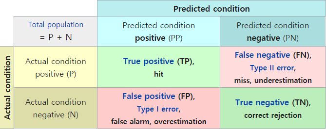
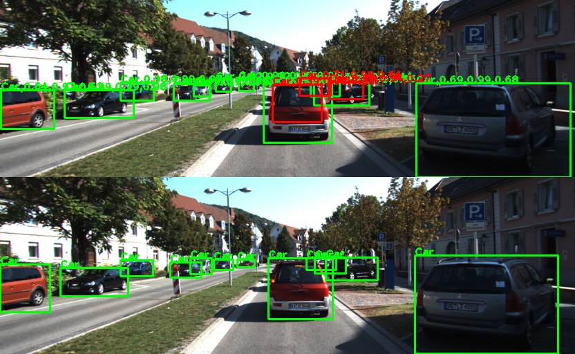
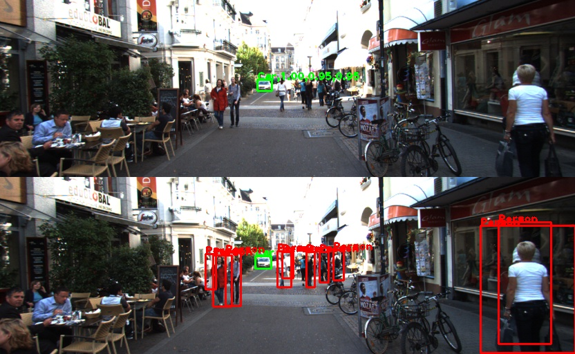

## 1. Slice Features

모델에서 예측(prediction, 이하 Pred) 데이터가 나오고 나면 이를 GT(ground truth) 데이터와 비교하여 손실 함수도 계산하고 모델의 최종 출력을 결정하여 성능도 평가해봐야 한다.  

GT와 Pred는 두 가지 종류의 객체 정보가 있다. Tfrecord에 저장되는 GT 데이터는 "bboxes"라는 key에 실제 객체정보를 일렬로 쌓은 정보를 가지고 있고 이 정보가 feature map에 분산된 데이터가 있다. YOLO v3가 세 가지 스케일을 출력하므로 feature map은 "feature_l", "feature_m", "feature_s" 세 가지가 있다. "bboxes"의 객체 정보가 세 가지 feature map의 해당 anchor에 저장되어 있고 나머지 anchor들은 모두 0으로 채워져 있다. 다음은 tfr_config.txt에 들어있는 관련 데이터의 shape을 정리한 것이다.

> "bboxes": [20, 5] 
>
> "feature_s": [32, 104, 3, 6]
>
> "feature_m": [16, 52, 3, 6]
>
> "feature_l": [8, 26, 3, 6]

GT feature map에서 마지막 차원 '6'은 (yxhw, objectness, category index)를 의미한다.  

Pred는 모델의 출력에서 세 가지 feature map들이 먼저 나온다. 손실 함수를 계산할 때는 Pred와 GT의 feature map을 이용한다. 반면 모델의 성능을 측정할 때는 모델의 최종 검출 결과가 있어야 하기 때문에 Pred feature map에 NMS(Non Maximum Suppression)를 적용하여 검출 결과인 Pred의 "bboxes"를 만든다. 이를 GT의 "bboxes"와 비교해서 TP(true positive), FP(false positive), FN(false negative) 등을 구분해야 recall과 precision을 계산할 수 있다. 다음은 GT와 Pred 데이터의 구조를 그린 것이다.


위 그림에 나온 텐서의 shape을 dictionary 형태로 정리하면 다음과 같다.

```python
grtr = {"feature_l": (batch, Hl, Wl, A, 6), "feature_m": (batch, Hm, Wm, A, 6), "feature_s": (batch, Hs, Ws, A, 6), "bboxes": (batch, N, 5)}

pred = {"feature_l": (batch, Hl, Wl, A, 9), "feature_m": (batch, Hm, Wm, A, 9), "feature_s": (batch, Hs, Ws, A, 9), "bboxes": (batch, N, 8)}
```


GT와 Pred 데이터를 이용해 손실 함수를 계산하거나, 원하는 정보를 추출하여 로깅(logging) 하거나, 검출 성능을 평가 해야한다. 이 데이터를 쓸 때마다 필요한 채널을 골라서 slicing을 해야 하는데 예를 들면 `yxhw = pred["feature_l"][..., :4]` 이런 코드가 굉장히 자주 사용된다. 이러한 코드에는 다음과 같은 문제점이 있다.

1. 같은 정보를 여러곳에서 slicing 하기 때문에 메모리가 낭비된다.
2. 원하는 정보가 몇 번째 채널에 있는지 잘 기억해서 써야한다. 실수로 채널을 잘못 써도 코드는 어떻게든 돌아가기 때문에 문제를 알아차리기 어렵다.
3. 채널 범위를 숫자로 하드 코딩하여 추후 채널 구성에 변화가 생겼을 때 수정해야 할 코드가 너무 많아진다.  

이러한 문제를 해결하기 위해 여기서는 텐서들을 의미 별로 분해(slicing)한 **feature slices**를 미리 만들어 사용한다. 그러면 slicing 기능을 한 곳으로 모을 수 있기 때문에 1, 3번 문제가 어느정도 해결이 된다. 그리고 채널 구성은 숫자로 하드 코딩하지 않고 다음과 같이 config에 파라미터로 정의한다.   

```python
class Model:
    class Output:
        FEATURE_SCALES = {"feature_s": 8, "feature_m": 16, "feature_l": 32}
        FEATURE_ORDER = ["feature_s", "feature_m", "feature_l"]
        NUM_ANCHORS_PER_SCALE = 3
        GRTR_CHANNEL_COMPOSITION = {'bbox': 4, 'object': 1, 'category': 1}
        PRED_CHANNEL_COMPOSITION = {'bbox': 4, 'object': 1, 'category': len(Tfrdata.CATEGORY_NAMES)}
        FEATURE_CHANNELS = sum([val for key, val in PRED_CHANNEL_COMPOSITION.items()])
        GRTR_BBOX_COMPOSITION = {'yxhw': 4, 'category': 1}
        PRED_BBOX_COMPOSITION = {'yxhw': 4, 'category': 1, 'object': 1, 'ctgr_prob': 1, 'score': 1}

        @classmethod
        def get_channel_composition(cls, is_gt: bool):
            if is_gt:
                return cls.GRTR_CHANNEL_COMPOSITION
            else:
                return cls.PRED_CHANNEL_COMPOSITION

        @classmethod
        def get_bbox_composition(cls, is_gt: bool):
            if is_gt:
                return cls.GRTR_BBOX_COMPOSITION
            else:
                return cls.PRED_BBOX_COMPOSITION
```


config에 정의된 composition을 이용해 utils/util_function.py의 `merge_and_slice_features()` 함수에서는 각 텐서의 채널을 분해하여 dictionary로 저장한다. 다음은 분해된 데이터의 key와 shape을 정리한 것이다.

```python
grtr = {
    "feature_l": {"yxhw": (batch, Hl×Wl×A, 4), "object": (batch, Hl×Wl×A, 1), "category": (batch, Hl×Wl×A, 1)}
    "feature_m": {"yxhw": (batch, Hm×Wm×A, 4), "object": (batch, Hm×Wm×A, 1), "category": (batch, Hm×Wm×A, 1)}
    "feature_s": {"yxhw": (batch, Hs×Ws×A, 4), "object": (batch, Hs×Ws×A, 1), "category": (batch, Hs×Ws×A, 1)}
    "bboxes": {"yxhw": (batch, N, 4), "category": (batch, N, 1)}
}

pred = {
    "feature_l": {"yxhw": (batch, Hl×Wl×A, 4), "object": (batch, Hl×Wl×A, 1), "category": (batch, Hl×Wl×A, 4)}
    "feature_m": {"yxhw": (batch, Hm×Wm×A, 4), "object": (batch, Hm×Wm×A, 1), "category": (batch, Hm×Wm×A, 4)}
    "feature_s": {"yxhw": (batch, Hs×Ws×A, 4), "object": (batch, Hs×Ws×A, 1), "category": (batch, Hs×Ws×A, 4)}
    "bboxes": {"yxhw": (batch, N, 4), "category": (batch, N, 1), "object": (batch, N, 1), "ctgr_prob": (batch, N, 1), "score": (batch, N, 1)}
}
```

feature map을 slicing 할때는 추후 연산의 편의성을 위해서 feature map의 (height, width, anchor) 차원을 하나로 합친다. 3차원 공간에 배치된 정보를 1차원으로 늘여놓는 것이다.

강의 저장소 코드에서는 이렇게 분해된 데이터로 손실 함수 계산, 데이터 로깅, 성능 계산 등을 한다.  


## 2. Non Maximum Suppression

NMS는 Pred feature map에서 나오는 수만개의 객체 예측 중에서 가장 가능성이 높은 객체들을 선별하는 과정이다. 세 가지 스케일의 feature map의 모든 anchor에서 나오는 객체 예측 중에서 다음 조건을 만족하는 것들을 골라낸다.

1. 객체 예측의 score가 임계값(score_thresh) 보다 높아야 한다. score = objectness × category probability
2. 주변 anchor 중에서 가장 높은 score를 가져야 한다. 객체 예측들을 카테고리 별로 나누고 같은 카테고리를 예측한 객체 예측의 bounding box 사이에 IoU를 구한다. 1번 조건을 만족하면서 IoU가 임계값(iou\_thresh) 보다 높은 두 bounding box가 있을 경우 둘 중에 score가 높은 것만 남기고 낮은 건은 버린다.
3. 1, 2번 조건을 만족하는 객체의 개수가 임계값(max_out) 보다 많을 경우 score가 가장 높은 max_out개의 객체만 출력한다.

이를 실행하기 위한 NMS 알고리즘은 다음과 같다.

> nms_out = []
>
> for category in categories:
>
> ​    score = objectness * category_prob[category]
>
> ​    objects = sort(objects, by=score)
>
> ​    i = 0
>
> ​    while objects[i].score > score_thresh:
>
> ​        nms_out.append(objects[i])
>
> ​        iou = compute_iou(objects[i], objects[i+1:])
>
> ​        remove all objects that iou > iou_thresh
>
> ​        i += 1

NMS 알고리즘을 그림으로 자세히 표현한 [슬라이드](https://docs.google.com/presentation/d/1aeRvtKG21KHdD5lg6Hgyhx5rPq_ZOsGjG5rJ1HP7BbA/pub?start=false&loop=false&delayms=3000&slide=id.p)를 보면 더 정확히 이해할 수 있다.

NMS는 직접 구현할 필요없이 이미 텐서플로나 파이토치에 구현이 되어있다. 텐서플로에서는 여러가지 종류의 NMS 함수를 제공한다.

- [tf.image.non_max_suppression](https://www.tensorflow.org/api_docs/python/tf/image/non_max_suppression): 가장 기본NMS, 객체의 indices 출력
- [tf.image.non_max_suppression_overlaps](https://www.tensorflow.org/api_docs/python/tf/image/non_max_suppression_overlaps): 객체를 직접 넣지 않고 overlap 데이터 입력, IoU가 아닌 다른 기준으로 중복을 제거하고 싶을 때
- [tf.image.non_max_suppression_padded](https://www.tensorflow.org/api_docs/python/tf/image/non_max_suppression_padded): 출력 indices의 길이를 일정하게 맞춤
- [tf.image.non_max_suppression_with_scores](https://www.tensorflow.org/api_docs/python/tf/image/non_max_suppression_with_scores): Soft NMS를 적용할 수 있음
- [tf.image.combined_non_max_suppression](https://www.tensorflow.org/api_docs/python/tf/image/generate_bounding_box_proposals): indices가 아닌 해당 객체의 bbox, score, class를 출력

강의 저장소 코드에서는 기본 NMS 함수를 이용해 전체 NMS 알고리즘을 만들었다. model/model_util.py에 `NonMaximumSuppression`이라는 클래스를 구현하였다. 위에서 설명한 `pred["bboxes"]`의 구조는 NMS에서 만든 것이다. 

자세한 내용은 코드를 확인한다.  


## 3. Recall / Precision

recall/precision은 검출 성능을 보여주는 대표적인 지표다. 논문에서는 보통 mAP를 주로 보여주지만 이것도 recall/precision을 바탕으로 계산되는 것이다. recall/precision 계산식은 다음과 같다.
$$
Recall = {TP \over TP+FN} = {TP \over \#GT} \\
Precision = {TP \over TP+FP} = {TP \over \#Pred}
$$
TP, FN, FP의 의미는 아래 그림을 참고한다.



NMS에서 score_thresh를 낮게 잡으면 객체들이 많이 나오므로 FN이 줄어들고 FP는 늘어나서 recall이 개선되고 precision은 악화된다. score_thresh를 높게 잡으면 반대의 효과가 난다.

강의 저장소에서는 train/logging/metric.py에서 TP, FN, FP의 개수를 세는 `count_true_positives()`함수를 만들었다. Validation 데이터에 대해 `grtr["bboxes"], pred["bboxes"]`를 함수 입력으로 넣으면  batch 별로 TP, GT, Pred 수가 출력되고 이를 누적 한 후 공식에 대입하면 recall/precision을 계산할 수 있다.


## 4. Visual Logging

Visual Logging은 검출 결과를 이미지에서 확인할 수 있게 원본 이미지에 객체 정보를 표시하여 보여주는 것이다. Epoch이 끝날때마다 validation 데이터 검출 결과를 그려서 이미지로 저장하면 검출 성능을 눈으로 확인할 수 있다. Visual logging을 위해 train/logging/visual_log.py에 `VisualLog`라는 클래스를 만들었다. 다음은 `VisualLog`의 메인 함수다. 

```python
    def __call__(self, step, grtr, pred):
        """
        :param step: integer step index
        :param grtr: slices of GT data {'image': (B,H,W,3), 'bboxes': {'yxhw': (B,N,4), ...}, 'feature_l': {'yxhw': (B,HWA,4), ...}, ...}
        :param pred: slices of pred. data {'bboxes': {'yxhw': (B,N,4), ...}, 'feature_l': {'yxhw': (B,HWA,4), ...}, ...}
        """
        splits = split_true_false(grtr["bboxes"], pred["bboxes"])
        batch = splits["grtr_tp"]["yxhw"].shape[0]

        for i in range(batch):
            image_grtr = uf.to_uint8_image(grtr["image"][i]).numpy()
            image_grtr = self.draw_boxes(image_grtr, splits["grtr_tp"], i, False, (0, 255, 0))
            image_grtr = self.draw_boxes(image_grtr, splits["grtr_fn"], i, False, (0, 0, 255))

            image_pred = uf.to_uint8_image(grtr["image"][i]).numpy()
            image_pred = self.draw_boxes(image_pred, splits["pred_tp"], i, True, (0, 255, 0))
            image_pred = self.draw_boxes(image_pred, splits["pred_fp"], i, True, (0, 0, 255))

            vlog_image = np.concatenate([image_pred, image_grtr], axis=0)
            if step % 50 == 10:
                cv2.imshow("detection_result", vlog_image)
                cv2.waitKey(100)
            filename = op.join(self.vlog_path, f"{step*batch + i:05d}.jpg")
            cv2.imwrite(filename, vlog_image)
```

`split_true_false()` 함수는 TP, FN, FP를 분리하는 함수로 NMS에서도 사용한다. 원본 이미지를 복사한 두 장의 이미지를 만들어 위아래로 붙이는데 위쪽은 Pred가 그려지고 아래는 GT가 그려진다. TP는 녹색 박스로 그리고 FN이나 FP는 빨간색으로 그린다. 박스 위에는 카테고리 이름을 붙이고 Pred에서는 그곳에서의 objectness, category probability, score를 추가로 표시한다. 다음은 검출이 잘된 이미지와 잘못된 이미지 예시다. 학습 데이터에 차만 많아서 차만 검출이 잘되고 사람은 잘 안나오고 있다. 이러한 visual logging을 통해 현재 어떤 객체가 잘 검출이 되고 어떤 부분을 놓치고 있는지 확인하여 앞으로의 개선점을 찾을 수 있다. 





다음은 20 epoch을 학습하는 동안 나온 validation의 history다. 

> epoch, ciou, object, category, total_loss, pos_obj, neg_obj, recall, precision, time_m
> 0,3.0785,1309.399,7.2837,141.3021,0.0346,0.0436,0,0,0.5219
> 1,3.0635,1304.606,7.243,1314.9126,0.0448,0.031,0,0,0.4057
> 2,3.0481,1302.2225,7.21,1312.4806,0.2336,0.0306,0,0,0.5036
> 3,3.28,1303.116,5.6063,1312.0022,0.2409,0.0368,0,0,0.4105
> 4,3.0586,1300.7815,5.3376,1309.1777,0.2712,0.0463,0.1069,0.3111,0.5093
> 5,3.0245,1297.9931,5.1579,1306.1755,0.3348,0.0387,0.2483,0.478,0.39
> 6,2.9375,1296.582,4.9857,1304.5051,0.3557,0.0347,0.3519,0.6741,0.505
> 7,2.8393,1295.9892,4.7666,1303.5951,0.4082,0.0388,0.5046,0.6026,0.3905
> 8,2.7817,1294.7286,4.6628,1302.1731,0.4566,0.0371,0.5125,0.678,0.507
> 9,2.7222,1295.0045,4.5905,1302.3172,0.4802,0.0378,0.5453,0.7007,0.3894
> 10,2.5764,1293.2612,4.4027,1300.2404,0.5166,0.0371,0.6069,0.7895,0.5192
> 11,2.5667,1293.1735,4.3735,1300.1137,0.5206,0.0365,0.6073,0.7939,0.3837
> 12,2.5579,1293.1803,4.363,1300.1012,0.5301,0.0369,0.6148,0.7866,0.5022
> 13,2.5612,1293.1067,4.3425,1300.0105,0.526,0.0357,0.6094,0.8139,0.3848
> 14,2.5553,1293.1945,4.3336,1300.0834,0.5342,0.0361,0.6165,0.8098,0.5049
> 15,2.5507,1293.261,4.3207,1300.1324,0.5438,0.0364,0.6202,0.8033,0.3914
> 16,2.5501,1293.3529,4.3025,1300.2055,0.5463,0.0362,0.6206,0.8104,0.5044
> 17,2.5387,1293.5187,4.29,1300.3474,0.5558,0.0373,0.6377,0.7939,0.3899
> 18,2.5398,1293.4718,4.277,1300.2886,0.551,0.0361,0.6227,0.8101,0.5038
> 19,2.5358,1293.506,4.2746,1300.3165,0.554,0.0355,0.6265,0.8141,0.3899

positive objectness가 높아지고 negative objectness가 낮아짐에 따라 recall/precision이 처음에는 0이 나오다가 점점 높아지는 것을 볼 수 있다.


