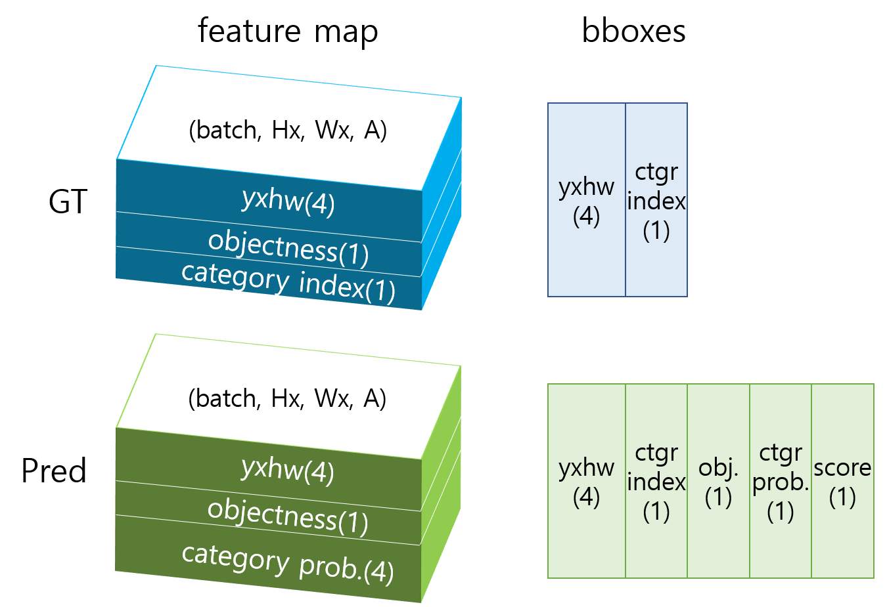

## 1. Slice Features

모델에서 예측(prediction, 이하 Pred) 데이터가 나오고 나면 이를 GT(ground truth) 데이터와 비교하여 손실 함수도 계산하고 모델의 최종 출력을 결정하여 성능도 평가해봐야 한다.  

GT와 Pred는 두 가지 종류의 객체 정보가 있다. Tfrecord에 저장되는 GT 데이터는 "bboxes"라는 key에 실제 객체정보를 일렬로 쌓은 정보를 가지고 있고 이 정보가 feature map에 분산된 데이터가 있다. YOLO v3가 세 가지 스케일을 출력하므로 feature map은 "feature_l", "feature_m", "feature_s" 세 가지가 있다. "bboxes"의 객체 정보가 세 가지 feature map의 해당 anchor에 저장되어 있고 나머지 anchor들은 모두 0으로 채워져 있다. 다음은 tfr_config.txt에 들어있는 관련 데이터의 shape을 정리한 것이다.

> "bboxes": [20, 5] 
>
> "feature_s": [32, 104, 3, 6]
>
> "feature_m": [16, 52, 3, 6]
>
> "feature_l": [8, 26, 3, 6]

GT feature map에서 마지막 차원 '6'은 (yxhw, objectness, category index)를 의미한다.  

Pred는 모델의 출력에서 세 가지 feature map들이 먼저 나온다. 손실 함수를 계산할 때는 Pred와 GT의 feature map을 이용한다. 반면 모델의 성능을 측정할 때는 모델의 최종 검출 결과가 있어야 하기 때문에 Pred feature map에 NMS(Non Maximum Suppression)를 적용하여 검출 결과인 Pred의 "bboxes"를 만든다. 이를 GT의 "bboxes"와 비교해서 TP(true positive), FP(false positive), FN(false negative) 등을 구분해야 recall과 precision을 계산할 수 있다. 다음은 GT와 Pred 데이터의 구조를 그린 것이다.



위 그림에 나온 텐서의 shape을 dictionary 형태로 정리하면 다음과 같다.

```python
grtr = {"feature_l": (batch, Hl, Wl, A, 6), "feature_m": (batch, Hm, Wm, A, 6), "feature_s": (batch, Hs, Ws, A, 6), "bboxes": (batch, N, 5)}

pred = {"feature_l": (batch, Hl, Wl, A, 9), "feature_m": (batch, Hm, Wm, A, 9), "feature_s": (batch, Hs, Ws, A, 9), "bboxes": (batch, N, 8)}
```


GT와 Pred 데이터를 이용해 손실 함수를 계산하거나, 원하는 정보를 추출하여 로깅(logging) 하거나, 검출 성능을 평가 해야한다. 이 데이터를 쓸 때마다 필요한 채널을 골라서 slicing을 해야 하는데 예를 들면 `yxhw = pred["feature_l"][..., :4]` 이런 코드가 굉장히 자주 사용된다. 이러한 코드에는 다음과 같은 문제점이 있다.

1. 같은 정보를 여러곳에서 slicing 하기 때문에 메모리가 낭비된다.
2. 원하는 정보가 몇 번째 채널에 있는지 잘 기억해서 써야한다. 실수로 채널을 잘못 써도 코드는 어떻게든 돌아가기 때문에 문제를 알아차리기 어렵다.
3. 채널 범위를 숫자로 하드 코딩하여 추후 채널 구성에 변화가 생겼을 때 수정해야 할 코드가 너무 많아진다.  

이러한 문제를 해결하기 위해 여기서는 텐서들을 의미 별로 분해(slicing)한 **feature slices**를 미리 만들어 사용한다. 그러면 slicing 기능을 한 곳으로 모을 수 있기 때문에 1, 3번 문제가 어느정도 해결이 된다. 그리고 채널 구성은 숫자로 하드 코딩하지 않고 다음과 같이 config에 파라미터로 정의한다.   

```python
class Model:
    class Output:
        FEATURE_SCALES = {"feature_s": 8, "feature_m": 16, "feature_l": 32}
        FEATURE_ORDER = ["feature_s", "feature_m", "feature_l"]
        NUM_ANCHORS_PER_SCALE = 3
        GRTR_CHANNEL_COMPOSITION = {'bbox': 4, 'object': 1, 'category': 1}
        PRED_CHANNEL_COMPOSITION = {'bbox': 4, 'object': 1, 'category': len(Tfrdata.CATEGORY_NAMES)}
        FEATURE_CHANNELS = sum([val for key, val in PRED_CHANNEL_COMPOSITION.items()])
        GRTR_BBOX_COMPOSITION = {'yxhw': 4, 'category': 1}
        PRED_BBOX_COMPOSITION = {'yxhw': 4, 'category': 1, 'object': 1, 'ctgr_prob': 1, 'score': 1}

        @classmethod
        def get_channel_composition(cls, is_gt: bool):
            if is_gt:
                return cls.GRTR_CHANNEL_COMPOSITION
            else:
                return cls.PRED_CHANNEL_COMPOSITION

        @classmethod
        def get_bbox_composition(cls, is_gt: bool):
            if is_gt:
                return cls.GRTR_BBOX_COMPOSITION
            else:
                return cls.PRED_BBOX_COMPOSITION
```


config에 정의된 composition을 이용해 utils/util_function.py의 `merge_and_slice_features()` 함수에서는 각 텐서의 채널을 분해하여 dictionary로 저장한다. 다음은 분해된 데이터의 key와 shape을 정리한 것이다.

```python
grtr = {
    "feature_l": {"yxhw": (batch, Hl×Wl×A, 4), "object": (batch, Hl×Wl×A, 1), "category": (batch, Hl×Wl×A, 1)}
    "feature_m": {"yxhw": (batch, Hm×Wm×A, 4), "object": (batch, Hm×Wm×A, 1), "category": (batch, Hm×Wm×A, 1)}
    "feature_s": {"yxhw": (batch, Hs×Ws×A, 4), "object": (batch, Hs×Ws×A, 1), "category": (batch, Hs×Ws×A, 1)}
    "bboxes": {"yxhw": (batch, N, 4), "category": (batch, N, 1)}
}

grtr = {
    "feature_l": {"yxhw": (batch, Hl×Wl×A, 4), "object": (batch, Hl×Wl×A, 1), "category": (batch, Hl×Wl×A, 4)}
    "feature_m": {"yxhw": (batch, Hm×Wm×A, 4), "object": (batch, Hm×Wm×A, 1), "category": (batch, Hm×Wm×A, 4)}
    "feature_s": {"yxhw": (batch, Hs×Ws×A, 4), "object": (batch, Hs×Ws×A, 1), "category": (batch, Hs×Ws×A, 4)}
    "bboxes": {"yxhw": (batch, N, 4), "category": (batch, N, 1), "object": (batch, N, 1), "ctgr_prob": (batch, N, 1), "score": (batch, N, 1)}
}
```

feature map을 slicing 할때는 추후 연산의 편의성을 위해서 feature map의 (height, width, anchor) 차원을 하나로 합친다. 3차원 공간에 배치된 정보를 1차원으로 늘여놓는 것이다.

강의 저장소 코드에서는 이렇게 분해된 데이터로 손실 함수 계산, 데이터 로깅, 성능 계산 등을 한다.  


## Non Maximum Suppression


