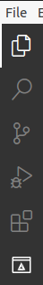
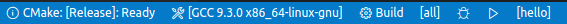

## 1. What is "code"

원래 이름은 *Visual Studio Code*, 줄여서 *vscode* 혹은 그냥 *code* 라고 한다. 실행 명령어가 `code`다. 이름에서 알 수 있다시피 Microsoft에서 만들었고 Visual Studio처럼 생겼지만 기능은 전혀 다르다. Visual Studio는 편집기, 컴파일러, 디버거 등 개발에 필요한 모든 도구가 합쳐진 IDE(Integrated Development Environment, 통합개발환경)이고 code는 잘 만든 편집기일 뿐이다. 컴파일러, 디버거 등은 시스템에 따로 설치한 뒤 code와 연동하여 사용한다. 설정을 다 해놓고 나면 Visual Studio와 큰 차이 없이 쓸 수 있다. Visual Studio는 윈도우에서만 사용가능하지만 code는 윈도우, 맥, 리눅스 등 대부분의 환경에서 사용가능하다.  

code는 2015년에 처음 발표되고 2016년에 1.0 버전이 배포되었다. 그렇게 역사가 오래된 것은 아니지만 짧은 시간에 다양한 언어에서 주로 사용되는 범용 에디터가 되었다. 그럼 그 전에는 사람들이 어떤 편집기를 쓰고 있었을까? Eclipse, Sublime Text, Atom, IntelliJ IDEA, Qt Creator 등이 있었고 물론 지금도 있다. 하지만 마소가 만든건 뭔가 달랐나보다. 몇 년 되지 않아 나처럼 Visual Studio와 마소를 싫어하는 리눅스 개발자들 사이에서도 가장 인기있는 편집기가 되었다. code는 다양한 확장(extention)을 제공하여 거의 모든 언어에 필요한 모든 도구들을 제공하다보니 가장 범용적인 편집기가 되었고 사실 이제 편집기라고 하기엔 기능이 너무 많아서 준 IDE라고 보는게 맞다. code 나오기 전에 다른 편집기들도 다양한 확장 생태계를 가지고 있었는데 지금은 양과 질에서 모두 넘사벽의 개발 툴이 되었다.

다만 code에서의 자동완성 기능은 너무 쓸데없는 후보들을 많이 보여주고 라이브러리의 함수들은 잘 안 보일때가 있어서 아쉬움이 있다.


## 2. Install code

### 2.1. 우분투에서 code 설치

우분투에서 snap 명령어를 통해 간단히 설치할 수 있다.

```
# dependency 설치
$ sudo apt-get install build-essential gdb
# code 설치
$ sudo snap install code --classic
# code 설치
$ sudo snap remove code
# 실행
$ code
```

설치해서 실행해보면 왼쪽에 아래와 같은 탭 버튼이 나오는데 왼쪽 탭의 내용을 선택한다.



원래는 5개인데 CMake 확장을 설치하여 6개가 되었다. 각각의 의미는 다음과 같다.

- Explorer: 프로젝트 디렉토리 내부의 파일들을 보여준다.
- Search: 프로젝트에서 특정 키워드를 찾거나 교체(replace)할 수 있다.
- Source Control: Git과 같은 버전관리 시스템을 GUI로 사용할 수 있다.
- Debug and Run: 디버깅 모드로 실행한다.
- Extensions: 확장 플러그인들을 검색하고 설치할 수 있다.
- CMake: CMakeLists.txt 파일이 있으면 configure나 build를 할 수 있다.

code에서 가장 중요한 메뉴는 **Command Palette** (`ctrl + shift + p`)다. command palette는 code의 모든 메뉴를 검색해서 쓸 수 있는 검색창으로 상단 메뉴에서 찾기 힘들거나 없는 메뉴들도 이곳에서 다 찾을 수 있다. 특히 GUI로 설정하는 것 외에도 JSON으로 환경설정하려면 command palette에서 `(JSON)` 표시가 있는 메뉴를 찾아야 한다.


### 2.2. 확장 설치

왼쪽에서 Extention 탭을 선택하면 다양한 확장들을 검색하여 설치 할 수 있다. 다음 세 가지 확장을 설치한다.

1. C/C++
2. CMake
3. CMake Tools

설치하고 나면 다음과 같이 **Installed** 아래 세 개의 확장이 보인다.


## 3. How to use code

여기서는 간단한 프로젝트를 구현하고 빌드하며 code를 사용하는 방법을 알아본다. 빌드 시스템은 gcc + Make + CMake를 사용한다.  

### 3.1. 프로젝트 만들기

code에서는 Visual Studio처럼 프로젝트를 만드는 과정은 없고 PyCharm처럼 그냥 특정 폴더를 열면 그곳을 워크스페이스로 사용한다. 상단 메뉴에서 File - Open Folder 를 누르고 원하는 폴더를 연다.  

### 3.2. 코드 작성

Explorer 탭에서 더블 클릭하거나 우클릭 후 New File을 눌러 두 파일을 만든다. 

**hello.cpp**

```cpp
#include <iostream>
int main()
{
    std::cout << "Hello CMake in code" << std::endl;
    return 0;
}
```

**CMakeLists.txt**

```cmake
cmake_minimum_required(VERSION 3.0)
project(hello)
set(CMAKE_CXX_COMPILER g++)
set(SOURCES hello.cpp)
add_executable(${PROJECT_NAME} ${SOURCES})
```


### 3.3. 빌드 및 실행

CMake 탭 상단에 Configure와 Build 버튼이 있다. Configure는 CMake를 통해서 Makefile을 만드는 과정이고 Build (`F7`)는 Makefile을 이용해 코드를 컴파일 및 빌드하여 실행파일을 만드는 과정이다. Configure - Build 후 실행 파일을 실행하기 위해 command palette에서 `CMake: Run without Debugging` (`shift + F5`)을 실행한다.

한 번 실행한 후에는 코드 수정 후 Configure를 하지 않고 Build나 실행을 바로 해도 자동으로 Configure가 된다. 

이 과정에서 Configure 단축키가 없는데 단축키가 없는 메뉴는 command palette에서 검색 후 오른쪽에 보이는 바퀴모양을 클릭하면 단축키를 설정할 수 있다. 나는 `CMake: Configure`는 `F8`, `CMake: Clean Rebuild`는 `shift + F8`로 설정했다.


### 3.4. 빌드 설정

화면 하단의 하늘색 상태바를 보면 단순히 상태를 표시하는 곳이 아니라 설정을 할 수 있는 메뉴라는 것을 알 수 있다. 



빌드 타입은 원래 CMakeLists.txt 스크립트에서 `CMAKE_BUILD_TYPE`이라는 변수를 통해 설정하는데 CMake 확장을 이용하는 경우 이는 무시되고 아래 상태바에서 `CMake: [Release]: Ready`를 클릭해보면 Debug/Release 중에 선택을 할 수 있다. 그 옆에 GCC로 시작하는 부분에서는 컴파일러를 선택할 수 있다.  

<https://code.visualstudio.com/docs/cpp/cmake-linux#_select-a-variant>

