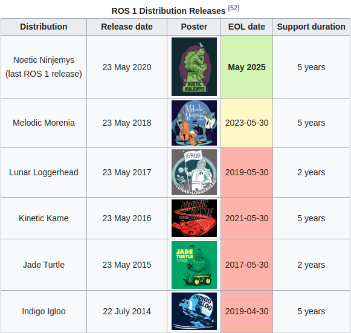
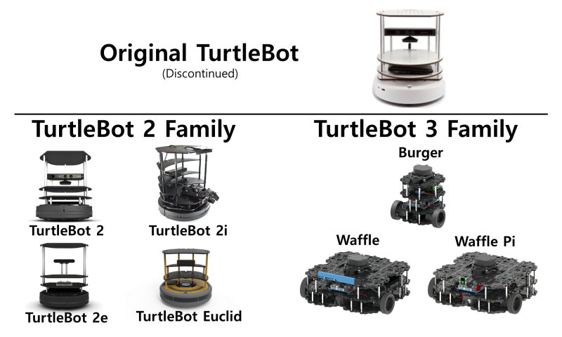

# ROS 소개

## 1. ROS 역사

2006년 스탠포드의 Kenneth Salisbury 교수의 박사과정 학생이던 Keenan Wyrobek와 Eric Berger는 로보틱스 연구를 하면서 반복되는 문제를 해결하고자 Stanford Personal Robotics Program을 시작했다. 로보틱스 연구의 문제는 새로운 프로젝트를 시작할 때마다 새로운 하드웨어 플랫폼 사용법을 익혀야 하고 기존에 구현됐던 소프트웨어를 새로 개발한 후에야 새로운 발전을 이룰 수 있다는 것이었다. Keenan Wyrobek의 표현에 따르면 90%의 시간을 기존에 다른 사람이 개발한 소프트웨어를 개발하는데 쓰고 나머지 10%를 새로운 혁신에 쓸수 있었다. 그들은 이러한 시간 낭비를 줄이기 위해 혁신적인 로봇 소프트웨어 개발 프레임워크을 만들기로 한다. PR1이라는 로봇 플랫폼을 기반으로 가정용 서비스 로봇을 개발하며 이러한 소프트웨어 프레임워크를 적용하고자 했다. (아래 사진) 스탠포드 인공지능연구소의 Morgan Quigley가 기존에 만들었던 **Switchyard**라는 시스템이 소프트웨어 프레임워크 개발의 기초가되었고 이후 Morgan Quigley는 지속적으로 ROS개발에 기여하여 이후 ROS를 관리하는 OSRF의 설립자가 된다.

Stanford Personal Robotics Program을 제대로 하려면 개발 인력을 고용해야했기 때문에 펀드를 얻기 위해 모금을 하러 다녔다. Joanna Hoffman (매킨토시 개발자)에게 5만 달러를 모금 받고 이를 바탕으로 개발을 하며 계속 모금 활동을 했다. 그들은 **"Linux of Robotics"**(로보틱스계의 리눅스)를 개발한다는 비전을 가지고 펀드를 받으려 했으나 "crazy"라는 반응이 다수였다. 그러다 2007년 Scott Hassan(구글의 초기 개발자)이 세운 Willow Garage에서 그 프로젝트를 지원하기로 하면서 두 사람은 Willow Garage로 들어가 충분한 지원아래 ROS와 PR2를 개발하게 된다.  

2008년에 초기 버전인 ROS 0.4 (Mango Tango)를 출시하고 2010년 1월 마침내 ROS 1.0 (Box Turtle)을 출시하고 두 사람의 오랜 목표였던 10대의 PR2를 세계 각지의 연구기관에 배포한다. 이와 더불어 2008년부터 진행한 인턴십 프로그램을 통해 다른 개발자들을 교육하고 개발에 참여시켰다. 그들이 다시 자신의 기관으로 돌아가서 ROS를 사용하고 전파하는 역할을 하게 함으로써 ROS의 확산에 기여하였다. 이후 ROS가 점점 다양한 곳에 쓰이게 되고 커뮤니티가 커지며 지속적으로 버전을 업데이트 시켜나간다.  

2013년에는 Willow Garage가 만든 Open Source Robotics Foundation (OSRF)에서 ROS 관리를 맡게 되고 Willow Garage는 Scott Hassan이 만든 다른 회사인 Suitable Technology로 합병된다. 이때부터 OSRF는 매년 새로운 버전의 ROS를 발표하였다. 2012년 부터는 매년 ROS 개발자들의 컨퍼런스인 ROScon이 열렸고 다양한 ROS관련 서적도 발매되었다. 2014년에는 NASA의 우주용 로봇에도 (Robonut 2) 적용되었다. 2017년에는 OSRF의 이름을 Open Robotics로 변경하였고 ROS의 다음 세대로서 실시간성을 비롯한 다양한 기술적 발전을 담은 ROS2의 첫 번째 버전이 발표되었다.

**출처**

<https://spectrum.ieee.org/automaton/robotics/robotics-software/the-origin-story-of-ros-the-linux-of-robotics>  

<https://en.wikipedia.org/wiki/Robot_Operating_System>

## 2. 그래서 ROS가 뭐라고?

ROS는 "Robot Operating System" 약자로 현재 가장 널리 사용되는 로봇 소프트웨어 프레임워크다. 이름은 운영체제(OS)지만 윈도우, 리눅스 같은 운영체제는 아니며 우분투와 같은 기존 운영체제에 설치하는 미들웨어 (middleware) 혹은 소프트웨어 프레임워크 (software framework)라고 봐야한다. 기존 운영체제의 프로세스 관리, 파일 관리, 유저 인터페이스 등을 그대로 활용하면서 그 위에 로봇 응용프로그램 개발에 필요한 다양한 인프라를 제공한다. 초기 개발의도대로 개발자들이 혁신에만 집중할 수 있도록 개발에 필요한 기본적인 인프라를 제공하고 다른 사람들이 만든 소프트웨어를 공유할 수 있는 생태계를 구축하는 것이 핵심이다. 아래 그림에 ROS의 주요 요소들이 나타나있다.

- Plumbing: ROS는 리눅스처럼 다수의 기본 유틸리티들의 조합으로 복잡한 작업을 수행한다. 그림처럼 ROS 기반으로 개발된 시스템은 다양한 노드(프로세스)가 연결된 그래프 구조를 갖는다. 하나의 프로그램에 다양한 기능을 넣는 것이 아니라 독립적으로 실행되는 단순한 노드들이 서로 유기적으로 연계되어 하나의 시스템을 이룬다.
- Tools: ROS는 개별적으로 설치할 수 있는 다양한 개발 툴을 제공한다. 대표적으로 다양한 데이터를 시각화 할 수 있는 **rviz**나, 작업공간(workspace)를 효율적으로 관리할 수 있는 **catkin** 등이 있다. 
- Capabilities: ROS에서 *Capabilities*란 대부분의 로봇에게 필요한 "능력"(혹은 기능)을 위한 high level interface가 있다는 것이다. 예를 들어 누군가 개발하는 로봇에 특정 좌표로 이동하는 기능이 필요하다고 했을 때 그 기능이 이미 패키지로 있거나 최소한 '좌표'를 전달하는 표준 메시지 형식이 정해져있다는 것이다. "Capabilities"의 중요한 목적은 다른 개발자가 만든 패키지를 사용할 때 그 패키지의 구체적인 내용이나 구현방식을 몰라도 그것을 사용하는데 문제가 없게 하는 것이다. 라이다 센서가 어떤 모델인지 몰라도 표준 라이다 데이터 형식으로 데이터를 받을 수 있기만 하면 라이다 응용 프로그램을 만드는데 문제가 없다.
- Ecosystem: ROS는 전세계의 수많은 개발자들이 참여하여 개발하는 강력한 생태계가 구축되어있다. 앞서 말한 그래프 기반 시스템과 표준화된 메시지 덕분에 다른 사람들이 만든 패키지를 가져다 쓰는게 매우 쉽다. 모든 ROS 버전을 통틀어 약 5000개의 패키지가 올라와있다.

이러한 요소들이 합쳐져 로봇 시스템 개발이 매우 편리해졌다. 예를 들어 자율주행 로봇을 만드려면 대략 다음과 같은 요소들이 필요하다. 

1. 로봇 플랫폼 제어 SW

2. 센서 제어 SW (센서 종류별로)

3. 장애물 인식 알고리즘

4. 경로 생성 알고리즘

5. 위치인식 알고리즘

6. 통합 시스템

이 모든 것은 개인이나 소수의 그룹에서 직접 개발하려면 매우 힘들것이다. 하지만 ROS 생태계에는 이 모든 모듈이 일정수준 이상으로 작동하는 패키지들이 이미 존재한다. 개발자는 아마도 저 모듈 중 한두개 정도만 성능을 향상시키거나 자신의 목적에 맞게 작동하도록 직접 개발하고 싶을 것이다. 나머지 모듈은 ROS에서 제공하는 패키지를 설치하여 노드로 띄워놓고 그 사이에 자신이 개발한 노드를 연결하여 전체 시스템을 쉽게 구현할 수 있는 것이다. 개발과정을 돕는 빌드 툴이나 시각화 툴도 존재하고 메시지나 기능에 대한 요구사항이 표준화 되어있어서 자신이 만든 향상된 패키지는 곧 바로 다른 사람이 쓸수도 있다.

## 3. ROS 버전

ROS는 최초의 1.0 Box Turtle 이후로 매년 새로운 버전이 나오고 있다. 사람들이 가장 많이 쓰는 리눅스 배포판인 우분투의 새로운 버전이 매년 4월에 출시되면 5월에 그에 맞춘 새로운 ROS가 출시된다. ROS는 거북이를 상징물로 쓰는데 세계거북이의 날인 5월 23일에 맞춰 출시한다. 버전마다 별명이 있는데 안드로이드처럼 알파벳 순서로 첫글자를 정한다. 우분투가 2년에 한번씩 LTS (Long Term Stable) 버전을 내놓고 사람들이 대부분 LTS 버전을 쓰기 때문에 ROS도 LTS 버전이 출시된 해의 ROS 버전을 주로 쓴다. 작년까지는 2016년 출시된 melodic Kame을 많이 썼고 이제는 2018년 버전인 Melodic Morenia가 주로 쓰인다. 아래는 [위키](<https://en.wikipedia.org/wiki/Robot_Operating_System>)에서 가져온 최근 ROS 버전이다.

# 터틀봇(Turtlebot) 소개

터틀봇은 Willow Garage 사의 Melonee Wise와 Tully Foote 내부 프로젝트로부터 시작했다. 2010년 Melonee는 새로 나온 Kinect 센서를 이용한 주행알고리즘을 시험하기 위해 iRobot Create에 붙여보았는데 바로 잘 작동하진 않았다. ROS로 작동시킬 수 있는 주행 플랫폼은 PR2와 Lego NXT 등이 있었지만 PR2는 너무 크고 비쌌고 NXT는 다양한 센서를 장착하기 어려웠다. Melonee와 Tully는 Create을 ROS를 위한 주행용 플랫폼으로 만들기 위해 작은 사내 프로젝트를 만들었다. 처음엔 ROS용 Create의 드라이버를 만들고 로봇의 전원이 Kinect 센서를 작동시키기엔 부족해서 전원 보드를 직접 만들었고 Odometry가 정확하지 않아서 Gyro 센서를 장착했다. 그러다 우연히 구글의 클라우드 로봇 프로젝트와 연결이 되어 개발용으로 만들었던 Create 기반 주행 플랫폼을 구글에 판매하게 되었다. 이를 계기로 터틀봇을 상품화시켜 2011년부터 판매하게 되었다.  

기존에는 주행연구를 하려면 Pioneer 3DX 같은 수백~수천만원짜리 로봇이 있어야 로봇을 제어하고 이동정보를 받을수 있었다. 반면 터틀봇은 가격이 저렴하고 다양한 PC나 센서에 연결할 수 있어 확장성이 좋았다. 무엇보다도 ROS를 이용하면 편리하게 제어할 수 있었다. 사람들은 직접 드라이버를 설치하고 로봇을 제어하는 API를 공부하지 않아도 ROS에서 제공하는 드라이버와 표준 메시지를 사용하면 로봇을 제어하고 센서 정보를 얻을 수 있게 되었다. 이러한 장점 덕분에 터틀봇은 많은 연구소에 널리 퍼졌고 이용자가 많아질수록 관련 소프트웨어가 풍부해지고 터틀봇을 사용한 논문도 많이 발표되었다.

2012년에는 국내의 유진 로봇에서 자사의 로봇 청소기 플랫폼을 기반으로 Willow Garage와 협업해 거북이(Kobuki)를 만들었다. 거북이는 터틀봇2(Turtlebot 2)로도 불렸으며 기존 터틀봇보다 플랫폼을 다양하게 확장할 수 있었다.

2017년에는 국내 로보티즈라는 회사에서 터틀봇3(Turtlebot 3)를 출시했다. 터틀봇3는 모듈형 판넬을 이용하여 조립식으로 층을 쌓아갈 수 있어 기존의 정형화된 확장 프레임을 벗어나 사용자가 자유롭게 원하는 모양을 조립할 수 있도록 설계했다. 저렴한 Raspberry Pi와 360도 Lidar 센서가 기본 장착되어 주행 어플리케이션을 더 쉽게 만들수 있게되었다.

**출처**

<https://spectrum.ieee.org/automaton/robotics/diy/interview-turtlebot-inventors-tell-us-everything-about-the-robot>  

<https://www.turtlebot.com/>

