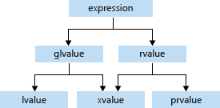

# Move Semantics


## 1. Introduction

C++11부터 *이동*이란 개념이 생겼다. 기존에는 할당 연산자(=)를 통해 *복사*만 할 수 있었다면 이제는 값비싼 복사 대신 저렴한 이동 연산을 통해 성능을 최적화 할 여지가 많아졌다. 하지만 이동 연산을 위해 C++의 문법적인 깊이가 더욱 깊어져버렸다. 이동 의미론(move semantics)를 깊이 있게 파고드는 건 추후 각자의 몫으로 남기고 여기서는 이동 의미론을 활용하는 전형적인 케이스에 대해 주로 배울 것이다.  

C++은 프로그래머가 최적화 기법들을 마음껏 적용할 수 있는 언어다. 대표적인 기법이 인라인 함수를 통해 함수 호출을 줄이는 것, 참조를 이용해 복사를 줄이는 것 등이 있다. 메모리 복사는 최적화에서 가장 중요한 이슈 중 하나다. **이동**이란 복사 없이 어떤 객체에 새로운 데이터를 주입시키는 작업이다. A라는 객체의 값을 B로 옮기는데 복사가 일어나지 않는거다. 어떻게 이런게 C++11부터 갑자기 가능해졌을까? 답을 알면 약간 실망할지도 모른다. 전형적이고 간단한 예시를 하나 들어보자.   

 

```cpp
#include <iostream>
#include <cstring>

struct Integers
{
    int *data;
    int n;
    Integers(int _n) : n(_n), data(nullptr)
    {
        std::cout << "[Integers] basic constructor: n = " << n << "\n";
        data = new int[n];
    }
    Integers(const Integers &o) : n(o.n), data(nullptr)
    {
        std::cout << "[Integers] copy constructor: n = " << n << "\n";
        data = new int[n];
        memcpy(data, o.data, n * 4);
    }
    ~Integers() { if(data) delete[] data; }
};

// you can process foo's data without copy or move
void process(Integers &bar)
{
    bar.data[1] = 3;
    std::cout << "[process] Integers, bar[1] = " << bar.data[1] << "\n";
}

struct ComplexData
{
    Integers ints;
    // you have to copy Integers to a member variable
    ComplexData(const Integers &other) : ints(other)
    {
        std::cout << "[ComplexData] create complex by copy\n";
    }
};

int main()
{
    Integers foo(10);
    process(foo);
    ComplexData baz(foo);
    return 0;
}
```

> [Integers] basic constructor: n = 10
> [process] Integers, bar[1] = 3
> [Integers] copy constructor: n = 10
> [ComplexData] create complex by copy

여기까지는 무난하다. 다수의 메모리를 사용하는 `Integers`라는 클래스가 있다. 일반 생성자와 복사 생성자를 구현했다. main 함수에서는 Integers 객체 foo를 생성해서 두 가지로 사용했다.

1. process() 함수 입력: 참조로 입력했기 때문에 복사가 일어나지 않는다. 상수가 아니기 때문에 내부에서 값도 수정가능하다. main()의 foo를 의도적으로 수정하는 함수거나 아니면 main()에서 foo가 더 이상 쓰이지 않아서 foo의 값 변화를 신경쓰지 않는 함수다.
2. ComplexData 생성자 입력: 이번에는 ComplexData 내부의 ints라는 멤버 변수를 초기화 하는데 사용됐기 때문에 복사를 피할수 없다. 복사 생성자가 실행된다.

복사를 피하고 싶은 경우 대부분 참조 변수로 전달하면 해결이 되지만 새로 만들거나 이미 만들어진 객체의 내용을 채울때는 복사를 해야만 한다. 하지만 이 경우에도 *이동* 연산을 이용하면 복사를 피할 수 있다. 이동은 어떻게 구현하고 어떻게 사용될까?

```cpp
#include <iostream>
#include <cstring>

struct Integers
{
    int *data;
    int n;
    Integers(int _n) : n(_n), data(nullptr)
    {
        std::cout << "[Integers] basic constructor: n = " << n << "\n";
        data = new int[n];
    }
    Integers(const Integers &o) : n(o.n), data(nullptr)
    {
        std::cout << "[Integers] copy constructor: n = " << n << "\n";
        data = new int[n];
        memcpy(data, o.data, n * 4);
    }
    Integers(Integers &&o) : n(o.n), data(nullptr)
    {
        std::cout << "[Integers] move constructor: n = " << n << "\n";
        data = o.data;
        o.data = nullptr;
        o.n = 0;
    }
    ~Integers() { if(data) delete[] data; }
};

struct ComplexData
{
    Integers ints;
    ComplexData(const Integers &other) : ints(other)
    {
        std::cout << "[ComplexData] create complex by copy\n";
    }
    ComplexData(Integers &&other) : ints(std::move(other))
    {
        std::cout << "[ComplexData] create complex by move\n";
    }
};

int main()
{
    Integers foo(10);
    std::cout << "---baz(foo);\n";
    ComplexData baz(foo);
    std::cout << "---bar(Integers(7));\n";
    ComplexData bar(Integers(7));
    std::cout << "---qux(std::move(foo));\n";
    ComplexData qux(std::move(foo));
    std::cout << "foo.n = " << foo.n << ", foo.data = " << foo.data << "\n";
    return 0;
}
```

> [Integers] basic constructor: n = 10
> ---baz(foo);
> [Integers] copy constructor: n = 10
> [ComplexData] create complex by copy
> ---bar(Integers(7));
> [Integers] basic constructor: n = 7
> [Integers] move constructor: n = 7
> [ComplexData] create complex by move
> ---qux(std::move(foo));
> [Integers] move constructor: n = 10
> [ComplexData] create complex by move
> foo.n = 0, foo.data = 0


새로운 예시에서는 Integers에 **이동 생성자**(`Integers(Integers &&o)`)가 추가되었다. 이동 생성자는 다른 객체의 데이터를 *훔쳐온다*. o가 가지고 있던 포인터를 복사해서 가져가고 o.data에는 nullptr을 넣어서 못 쓰게 만든다. 별게 없다. 포인터를 훔쳐가는 것 뿐이다. 그럼으로써 o.data에 할당된 메모리를 모두 복사하는 대신 포인터의 복사로 비용을 크게 줄였다. 이 말은 곧 int 등의 primitive(=built-in) type에는 별 효과가 없다는 뜻이다. 힙에 할당해야하는 큰 메모리가 있을 때 메모리 복사 대신 포인터 복사로 대체하는 것이다. 이동 생성자를 보면 `o.data = nullptr`을 제외하면 컴파일러가 자동 생성하는 복사 생성자와 비슷하다. 그렇다면 왜 원래 객체를 굳이 못 쓰게 만들까? 포인터를 복사하기 때문에 원래 객체의 포인터를 놔두면 객체의 소유권을 두 개의 포인터에서 가지게 된다. 그러면 앞서 말한 원시 포인터의 여러 단점들이 드러나기 때문에 원래 객체는 소유권을 해제하는게 안전하다.  

ComplexData 클래스에도 변화가 생겼다. 이동 연산을 통해 멤버 변수 ints를 초기화 하기 위해 `ComplexData(Integers &&other)`가 추가되었다. 참조 연산자가 두 개 붙은 && 연산자는 오른값(rvalue) 참조이며 거칠게 말해 임시 객체에 대한 참조를 의미한다.

`bar(Integers(7));`는 생성자 입력인자 자리에서 직접 생성한 Integer 객체가 들어간다. 이 객체는 임시 객체인 리터럴(literal)에 해당하며 따라서 이동 연산을 사용하는 두 번째 생성자가 호출된다. `std::move(other)`에 의해 other도 오른값 참조가 되어 Integer의 이동 생성자가 실행이 된다. 임시 객체의 데이터를 복사하지 않고 포인터만 가져가고 이후 임시 객체는 파괴될 것이기 때문에 버려져도 상관이 없다.

`qux(std::move(foo));`에서 foo는 임시 객체가 아니고 이미 존재하는 왼값(lvalue) 객체다. 하지만 std::move 함수를 통해 오른값으로 캐스팅되어 여기서도 이동 연산을 하는 두 번째 생성자가 호출된다. 이후로는 bar의 경우처럼 이동 연산이 일어난다. 이후에 다시 foo의 값을 확인해보면 nullptr이 된 것을 볼 수 있다.

아직 오른값, 왼값, std::move 등에 대해 배우지 않았기 때문에 이해하기 어렵겠지만 여기서 중요한 점은 이동 연산자(여기서는 이동 생성자)를 정의하여 필요에 따라 복사를 시킬수도 있고 이동을 시킬수도 있다는 것이다. 새로운 객체를 만들면서 원래 객체도 유지해야 한다면 복사를 해야하고 원래 객체를 유지할 필요가 없다면 이동이라는 저렴한 연산을 선택하는 것이 낫다. 그럼 이제 세부적인 내용을 알아보자.


## 2. Value Categories (Lvalue, Rvalue)

이동 연산이 생기면서 값들의 종류가 세분화됐다. 역사적으로는 단순히 할당 연산자(=)의 왼쪽에 있는 값을 왼값(lvalue), 오른쪽에 있는 값을 오른값(rvalue)라고 불렀다. 하지만 이동 연산과 복사 연산을 해야하는 상황을 컴파일러가 인식하기 위해서는 그보다는 미묘한 구분이 필요하다. 왼값, 오른값은 위치와는 약한 상관관계를 가지지만 그것이 전부는 아니며 그냥 새로운 개념의 고유명사로 인식하는 것이 낫다. 이러한 표현식의 분류를 값 범주(value category)라고 하며 실제로는 더 다양한 분류가 있다. 이들을 구분하는 주요 기준 중 하나가 식별자(identifier)가 있냐는 것인데, 식별자란 쉽게 말해 변수, 함수처럼 이름이 있어서 코드 내에서 언제든 불러낼 수 있는 객체를 말한다.  

C++에서는 모든 값을 lvalue 또는 rvalue로 분류할 수 있다.  

- lvalue: 일반적으로 lvalue는 식별자가 있어서 단일 표현식 이후에도 사라지지 않고 지속되는 객체다. 변수를 선언하면 변수를 사용하는 어떤 라인이 끝나도 그 변수는 계속 사용가능하다. lvalue의 특징은 주소값을 얻을 수 있다는 것이다. 
- rvalue: rvalue는 표현식이 종료된 이후에는 사라지는 임시적인 값이다. `int a=1`에서 1과 같은 리터럴이나, 함수의 반환값 등에 해당한다. lvalue가 아닌 모든 값은 rvalue이다. rvalue의 특징은 주소를 얻을 수 없다는 것이다.

그럼 `int a=1; int b=a;`라는 코드의 둘째줄에서 `a`는 lvalue 일까, rvalue 일까? `a`는 주소를 얻을 수 있는 lvalue이지만 오른쪽에 있기 때문에 rvalue로 사용한다. 컴파일러에서는 lvalue-to-rvalue conversion을 통해 `a`의 값을 가져온다. 그래서 *형식상으로 lvalue지만 의미적으로 rvalue이다.* 라는 괴상한 말도 할 수 있다. 반대로 `int &&c = 1;`에서 `c`의 타입은 rvalue 참조지만 주소를 얻을 수 있으므로 왼값이다.

아래 그림은 상황별로 세분화한 분류다. 하지만 lvalue와 rvalue가 타입이나 위치에 의해서만 정해지는 것이 아니라 상황별로 달라질 수 있다 정도만 이해하고 lvalue, rvalue라는 용어만 사용해도 이동 의미론 설명에 큰 지장이 없으므로 세부적인 분류는 중간중간 기회가 될 때 설명한다.




... coming soon

