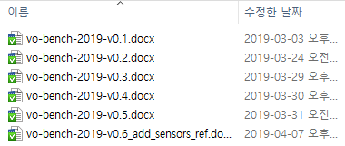
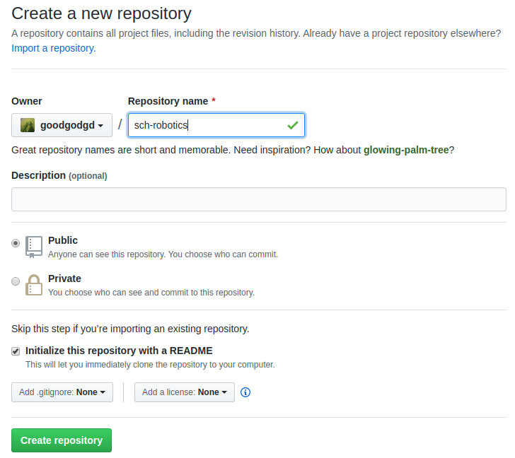
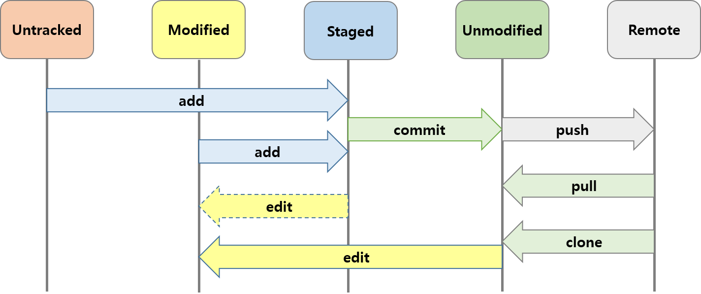
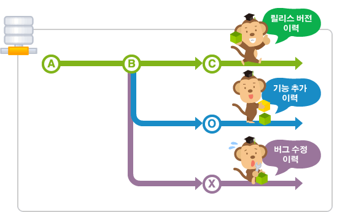
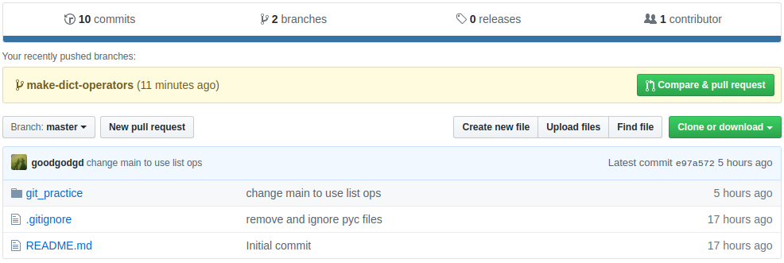
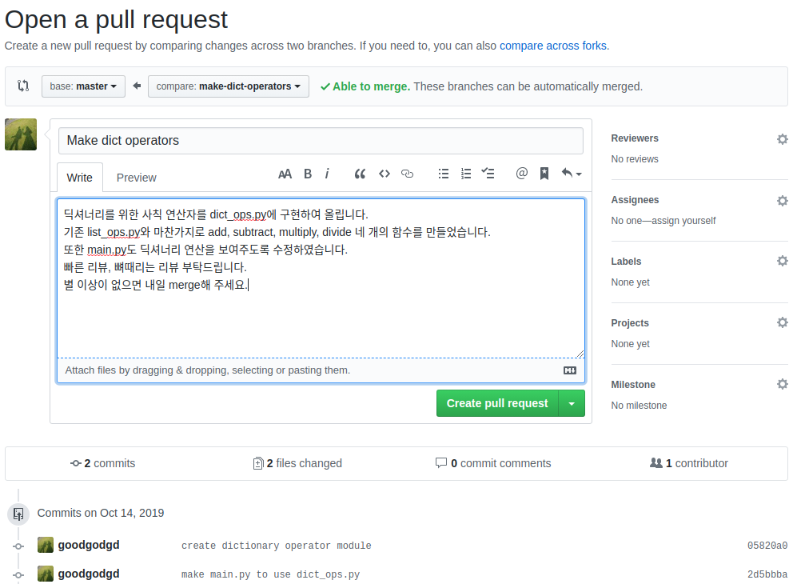
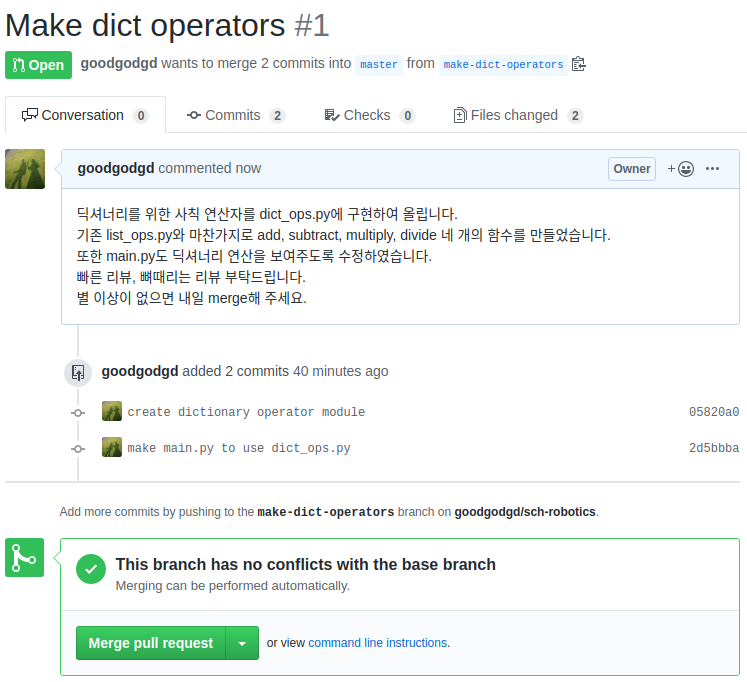

# Introduction to Git

Git에 대한 내용은 마이크로프로세서 강의자료에서 대부분의 내용을 차용한다. 마이크로프로세서 강의자료가 완전한 내용이고 여기서는 그 내용을 요약해서 ROS에 맞춰 수정하였다. 더 깊이 알고 싶다면 다음 포스트들을 참고한다.

- [Let's Git it!](https://goodgodgd.github.io/ian-lecture/archivers/git-intro) : git을 소개하고 기초 명령어들을 실습해본다.
- [Git into the Git](https://goodgodgd.github.io/ian-lecture/archivers/git-detail) : git을 이해하는데 필요한 개념 설명과 git 명령어들의 사용법이 자세히 정리되어있다.
- [Manage Project](https://goodgodgd.github.io/ian-lecture/archivers/manage-project) : 실제 마이크로프로세서를 위한 코드를 git을 통해 관리하는 실습과 설명이다.
- [Branch and Merge](https://goodgodgd.github.io/ian-lecture/archivers/git-branch) : git의 branch를 활용하는 방법을 알아본다.


## 1. Git 설치

윈도우에서는 Git 설치파일을 받아서 설치를 해야하는데 리눅스에서는 한 줄이면 끝난다.

```bash
$ sudo apt install git
```


## 2. About Git

**버전 관리 시스템**은  파일의 변화를 시간에 따라 기록하여 과거 특정 시점의 버전을 다시 불러올 수 있는 시스템이다. 일반적으로 (혹은 자연발생적으로) 사람들이 많이 쓰는 방법은 여러 버전의 파일을 따로 저장하는 것이다. 작업 중이던 파일에 큰 변경사항을 주고 싶은데 이전 버전은 남기고 싶을 때, 파일명에 버전명과 대략의 수정사항을 넣어서 사본을 만든다. 바로 이렇게.



문서 같은 경우는 딱히 다른 방법도 없고 이 방법도 잘 작동한다. 반면 프로그램 소스 코드는 워낙 수정이 잦고 여러 사람이 공동으로 작업하는 경우가 많기 때문에 혼자 취미로 개발하는게 아니라면 이렇게는 관리할 수 없다. 그래서 소스코드를 작업한 메시지와 함께 버전별로 저장하는 데이터베이스 비슷한 시스템이 나타나기 시작했고 `CVS, Subversion, Perforce` 등의 중앙집중식 버전 관리 시스템(CVCS, Centralized Version Control System)이 유행했다. 중앙집중식이라는 것은 하나의 서버에서 여러 사람이 작업한 이력을 모두 가지고 있고 각 client는 서버를 통해 다른 사람이 올린 내용을 받아볼 수 있었다.  

CVCS의 단점은 중앙 서버가 고장나면 모두가 망한다는 것이다. 그래서 나온게 분산 버전 관리 시스템(DVCS, Distributed Version Control System)이다. DVCS는 각 로컬 저장소에 모든 사람의 모든 이력이 다 저장되기 때문에 서버가 폭발한다고 해도 데이터 손실이 없다. DVCS로는 ` Git, Mecurial, Bazaar, Darcs` 등이 있었(다고 전해지)는데 지금은 Git의 점유율이 압도적이다. 왜 그럴까?  

소스 코드의 버전 관리는 소수가 개발하는 프로젝트에서도 고민거리인데 전세계에서 수백명이 개발하던 리눅스 커널 개발도 많은 고민을 했을 것이다. 1991년 태어난 리눅스는 2002년부터 BitKeeper라는 DVCS로 관리를 하다가 BitKeeper가 유료화되면서 리눅스 창시자인 **리누즈 토발즈(Linus Torvalds)**님께서 직접 버전관리 시스템을 만들었다. ~~신계에 오른~~ 최고의 개발자가 대규모 프로젝트를 염두해두고 만들었으니 당연히 성능이 좋았다. Git의 장점을 요약하면

- 대규모 프로젝트를 관리하더라도 **속도가 빠르고 적은 용량**을 유지
- 단순한 구조 (델타가 아닌 스냅샷)
- 동시 다발적인 브랜치 분기와 병합을 통한 효과적인 분산 개발시스템 제공
- 오프라인에서도 과거 이력 조회와 commit 가능
- ... 등 다 적을 수 없다.

그러나 Git에 대한 이러한 찬양은 구식 시스템을 써본 옛날 사람의 "옛날에는 말이야~" 라는 식이라서 Git으로 버전 관리를 시작하는 젊은이(?)들은 공감하기 어렵다. (CVCS가 전화기라면 Git은 스마트폰이다. 요즘 아이들은 스마트폰이 없던 세상을 공감할 수 없다.)  오늘날에는 Git이 공기처럼 당연히 쓰이고 있으므로 소프트웨어를 개발하는 사람이라면 당연히 Git을 쓸 줄 알아야 한다.


## 3. About GitHub

Git은 혼자 쓸 때는 단순히 버전 관리 시스템이지만 팀으로 사용할 때는 여러 사람들 사이의 협업 툴이다. 여러 사람이 작업한 결과를 자동으로 병합해주고 병합 과정에서 conflict가 있으면 개발자가 이를 해결하도록 유도한다. 모든 개발자가 한 근무지에서 개발하는 것이 아니라 근무지가 서로 다르거나 아니면 혼자 개발하더라도 여러 곳을 옮겨 다니면서 개발한다면 언제 어디서나 인터넷을 통해 접근할 수 있는 온라인 저장소가 필수다. 그래서 2007년 온라인 저장소인 GitHub 서비스가 시작되었고 이름처럼 Git과 GitHub은 찰떡이다. GitHub은 단순히 온라인 저장소만 지원하는게 아니라 GitHub에서 소스 코드 작성 및 변경, 브랜치 병합 등을 할 수 있으며 개발자들에게 유용한 다양한 툴들을 지원한다. (코드 변경점 시각화, 이슈 게시판, 위키 문서 등) 이만큼 얘기했으면 군소리 말고 들어가서 가입(Sign up)해보자. 가입 절차도 매우 간단하다.

<https://github.com/>


# Git / Github Basics

## 1. 저장소 만들기

깃헙(GitHub)에 로그인해서 들어가보면 다음과 같은 화면이 나온다. 이제 막 회원 가입을 했다면 아무것도 없겠지만 쓰다보면 왼쪽에는 저장소 목록이 나오고 오른쪽에는 최근 활동들이 보인다. 


상단의 초록색 `New` 버튼을 눌러 새로운 저장소를 만들어보자. 저장소 이름은 자유롭게 지어도 된다. 여기서는 `sch-robotics`라는 저장소를 만들겠다. 만들때 아래쪽의 **"Initialize this repository with a README"를 꼭 체크**해주자.




## 2. 저장소 내용 수정하기

보통 깃헙에 만든 저장소를 **"원격(Remote) 저장소"**라 하고 이 저장소를 PC에 내려받아 실제 작업이 일어나는 저장소를 **"로컬(Local) 저장소"**라 한다. 깃헙을 활용하는 가장 단순한 흐름은 다음과 같다.

1. `git clone`: 원격 저장소를 복사한 로컬 저장소를 만든다.
2. `git add` : 로컬 저장소에서 작업한 내용을 스테이지(stage)한다.
3. `git commit` : 스테이지한 전체 소스의 상태를 커밋(commit)으로 저장한다.
4. `git push` : 커밋을 원격 저장소로 올린다.

여기서는 `sch-robotics`를 저장소 이름으로 사용한다. 다른 이름으로 만든 경우 그 이름에 맞춰 진행하면 된다.

### git clone

> `git clone <repository_url> <dir_name>` : `repository_url` 주소의 원격 저장소를 복사한다. 기본적으로는 저장소 이름과 같은 디렉토리가 생기고 뒤에 `dir_name`을 지정하면 그 이름으로 디렉토리가 생긴다.

방금 깃헙에 만든 원격 저장소를 `~/workspace` 아래 `robotics-schl` 이란 디렉토리로 복제해보자. 저장소 디렉토리가 생겼는지 확인하고 그곳으로 이동한다.

```bash
$ cd ~/workspace
~/workspace$ git clone https://github.com/<your-repository> robotics-schl
~/workspace$ ls
~/workspace$ cd robotics-schl
```


### git config

> Git에 대한 설정을 변경할 수 있는 명령어. 설정할 수 있는 변수가 수백가지지만 대부분은 사용자 등록 정도만 사용한다.
>
> `git config [--global] user.name <name>` : 사용자 이름을 등록한다. `--global` 옵션을 쓰면 이 PC의 모든 로컬 저장소에 기본 사용자가 된다. `--global`을 빼면 현재 저장소에만 적용이 된다.
>
> `git config [--global] user.email <email>`: 사용자의 이메일을 등록한다. `--global`의 용도는 위와 같다.
>
> `git config [--global] --list` : Git의 모든 설정 정보를 조회한다. `--global`을 쓰면 `--global` 옵션을 주고 설정한 전역 설정 정보를 조회한다.

git으로 코드 변경사항을 저장할 때 변경을 만든 사람이 누구인지도 함께 기록해야한다. 그래서 사용자 등록을 미리 해야한다. `--global`로 옵션을 주어 PC 어디서나 같은 사용자를 쓰도록 한다.

```bash
$ git config --global user.name <name>
$ git config --global user.email <email>
```


### git status

> HEAD로부터 변경 사항이 있는 파일들을 상태별로 묶어서 보여준다. Untracked, Not staged, Staged, Changes to be commited 등의 상태가 있다. 그리고 현재 상태에서 쓸만한 명령어 추천해준다.

`git status`는 저장소의 상태를 보여주는 유용한 명령어다. 항상 저장소 상태를 변화시키는 명령어를 쓰기 전에 먼저 `git status`로 변경 전 상태와 변경 후 상태를 확인하는 습관을 들이자.

```bash
$ cd ~/workspace/robotics-schl
~/workspace/robotics-schl$ git status
~/workspace/robotics-schl$ gedit anything.py
# 내용 작성 예시
if __name__ == "__main__":
    print("hello python, hi ros.")

~/workspace/robotics-schl$ git status
```

`anything.py`를 만들기 전의 상태와 만든 후의 상태 메시지를 비교해보자.


### git add

> 지정한 파일(들)의 최신 상태를 인덱스에 업데이트한다. Untracked나 Modified 상태의 파일을 stage하여 다음 commit에 변경사항이 들어갈 수 있게 준비한다.
>
> `git add <filename>` : 특정 파일을 stage 한다.
>
> `git add <pattern like *.txt>` : 현재 디렉토리에서 패턴과 일치하는 모든 파일을 stage 한다.
>
> `git add .` or `git add -A`: 현재 디렉토리와 하위 디렉토리의 모든 변경된 파일들을 stage 한다. 

새 파일을 만든 변경 사항을 스테이지(stage)하고 상태를 확인해보자. 새로운 파일(혹은 변경된 파일)이 녹색으로 표시되는지 확인한다.

```bash
$ git add .
$ git status
```


### git commit

> 현재 인덱스 상태를 저장소에 저장한다. commit을 하면 stage한 상태까지를 저장하고 hash 혹은 checksum을 부여한다. (checksum과 hash는 비슷하게 쓰이지만 방식이 다르고 git에서는 checksum이 더 정확한 용어지만 hash라고 많이 부른다.)  Hash는 코드로부터 자동으로 생성되는 40자리 문자로서 commit의 ID 같은 역할을 한다. Hash는 `git log` 명령어를 통해 확인할 수 있다. 이 hash를 이용해 나중에 언제든 예전에 commit한 상태로 돌아갈 수 있다.
>
> `git commit -m <message>` : 현재 stage된 변경사항을 message, author, hash와 함께 저장한다.  `-m` 옵션이 없으면 Git 기본 에디터가 실행되서 그곳에서 메시지를 작성하게 한다. 그냥 커맨드에서 -m 옵션을 써서 메시지를 입력하는게 낫다.
>
> `git commit --amend -m <message>` : 직전 commit에서 빠진게 있을 때 변경 사항을 추가하고 add 한 뒤 `--amend` 옵션을 붙여 commit하면 직전 commit을 없애고 추가 변경 사항까지 합친 새로운 commit을 만든다. 변경 사항이 없더라도 단순히 commit message를 다시 쓰고자 할 때도 사용된다.

`add`를 통해 스테이지한 모든 파일의 상태를 메시지와 함께 저장한다. 커밋(commit)을 통해 저장된 상태는 나중에 언제든 다시 복원할 수 있다.

```bash
$ git commit -m 'add new file'
$ git status
```


### git push

> 로컬 저장소의 새로운 commit을 원격 저장소로 올린다. 현재 로컬 저장소의 파일 상태나 Stage 여부에 상관없이 오직 commit에 들어간 변경 사항만 원격 저장소로 올린다.
>
> `git push origin main` : Git 초보자들이 가장 많이 쓰는 명령어 중 하나이다. 저장소를 clone 받으면 `main`라는 기본 브랜치(branch)가 선택되고 원격 저장소는 자동으로 `origin`이란 이름으로 저장된다. 그래서 `main` 브랜치에서 작업 후 commit을 원격 저장소로 업로드 할 때 이 명령어를 쓰게된다.
>
> `git push <remote_repository> <local_branch>` : local_branch의 commit들을 원격 저장소의 같은 이름의 브랜치에 올린다. 예를 들어 `git push origin main`는 로컬 저장소의 `main` 브랜치에 쌓인 commit들을 원격 저장소의 `main` 브랜치(origin/main)에 올린다는 것이다. 원격 저장소에 local_branch가 없을 경우 GitHub에서 자동으로 같은 이름의 브랜치를 만들어준다.
>
> `git push <remote_repository> <local_branch>:<remote_branch>` : local_branch의 commit들을 원격 저장소의 remote_branch에 반영한다.
>
> `git push --all` : 모든 로컬 브랜치를 한번에 push 한다.

커밋을 통해 저장된 파일의 상태를 원격 저장소로 올린다. 명령 실행 후 깃헙 저장소에서 추가된 파일을 확인해보자.

```bash
$ git push origin main
```


## 3. Git 개념 정리

위 예시에서 사용한 git 명령어들을 이해하는데 필요한 개념들을 설명한다. 이 개념들을 이해해야 다른 다양한 명령어들의 의미를 이해할 수 있다.

### 3.1 파일의 상태

아래 그림을 보자. 위쪽의 사각형은 파일의 상태를 나타내고 화살표에 쓰인 단어는 "edit"을 제외하고 모두 Git의 동작(verb)이다. 모든 Git 명령어는 `git <verb> <options>` 형태이므로 마치 `주어-동사(verb)-목적어`의 영어 문장처럼 쓰인다. 그래서 중간의 큰 단위의 동작을 나타내는 인자를 *verb*라 부른다.




Git 저장소 안에서 파일은 그림처럼 네 가지 상태를 가질 수 있다.

- **Untracked**: 아직 Git으로 버전 관리되지 않은 상태이다.
- **Staged**: `git add`를 실행하면 *Untracked*나 *Modified* 상태의 파일들이 *Staged*가 된다. Stage 했을 당시의 파일 상태가 이후 commit할 때 저장이 된다. 그래서 add를 한 후에 수정을 하더라도 commit은 현재 상태가 아닌 add 한 당시의 상태를 저장한다.
- **Modified**: Stage 하지 않은 변경 사항이 있는 상태다. *Staged* 상태의 파일을 수정하면 Stage 이후의 변경 사항은 *Modified*에 속해서 하나의 파일이 *Staged* 이면서 동시에 *Modified* 상태가 된다. *Unmodified* 파일을 수정하면 완전히 *Modified* 상태가 된다.
- **Unmodified**: *Staged* 상태의 파일을 commit 하면 *Unmodified* 상태가 된다. Git은 commit 단위로 해쉬(hash)를 할당하고 버전을 관리한다. 즉 언제든 과거에 commit한 상태로 돌아갈 수 있다.

원격 저장소와 교류하는 동작(verb)은 네 가지가 있다.

- **pull**: 원격 저장소의 commit을 로컬 저장소에 다운로드 받고 내용을 합친다.
- **push**: 로컬 저장소의 commit을 원격 저장소로 올려서 합친다. 로컬 저장소에 없는 commit이 원격 저장소에 있다면 먼저 pull을 실행해야 push 할 수 있다.
- **clone**: 원격 저장소를 복사한 로컬 저장소를 만든다.
- **fetch**: pull은 사실 원격 저장소의 commit을 내려받는 fetch와 내용을 합치는 merge 두 명령을 한번에 실행한 것이다. fetch만 하게 되면 현재 로컬 저장소의 파일에는 변화가 생기지 않는다.


### 3.2 저장소 공간

지금까지는 파일의 관점에서 파일의 상태 변화를 알아보았다. 아래 그림은 Git 저장소 내부의 세 가지 **공간**을 나타낸 것이다.


- **작업 트리, Work Tree**: 현재 사용자에게 보이는 파일들이 있는 공간이다. 이곳에는 다양한 상태의 파일들이 섞여있다.
- **인덱스, Index**: 가장 최근 commit에 Stage 한 내용까지 반영된 공간이다. 파일을 add 하면 그 당시의 상태가 이곳으로 복사된다. commit 하기 전까지 add 한 변경 사항이 이곳에 쌓인다.
- **저장소, Repository**: commit을 하게 되면 Staged 파일들이 새로운 commit으로 저장되고 HEAD가 새 commit으로 변경된다. 저장소에는 commit들이 쌓인다.
- **HEAD**: 그림에서 저장소 대신 HEAD가 쓰이기도 하는데 HEAD는 현재 작업하는 로컬 브랜치의 최신 commit을 가리키는 포인터다.


## 4. git 활용

### 4.1. 다른 곳에서 이어서 작업하기 (집)

Git/GitHub은 여럿이 협동하여 작업할 때 가장 유용하지만 혼자 작업할 때도 유용하게 쓸 수 있다. 일단 Git을 통해 기본적인 버전관리를 할 수 있는 것은 물론이고 마치 파일 클라우드에 올려놓으면 어느 PC에서나 파일에 접근할 수 있듯이 깃헙을 사용하면 어디서나 소스코드를 받아서 작업을 이어서 할 수 있다. 여기서는 여러 PC에서 작업을 이어서 하는 방법을 설명하고 그러면서 git의 다양한 명령어에 대해 알아볼 것이다.  

예를들어 여러분이 **"학교"와 "집" 두 개의 PC에서 작업**한다고 하고 방금 작업했던 `~/workspace/robotics-schl` 경로를 "학교" 로컬 저장소로 생각하고 `~/workspace/robotics-home` 경로를 "집" 로컬 저장소로 여기고 두 개의 로컬 저장소를 옮겨가면서 작업하는 것을 실습해보고자 한다.  

여기서는 한 사람이 두 장소에서 작업하는 상황을 가정했지만 "두 장소"를 "두 사람"으로 봐도 된다. 즉 여럿이 같이 작업할 때는 "집"을 "나"로 "학교"를 "동료"로 바꿔도 동일한 흐름으로 저장소를 관리할 수 있다.  

 `~/workspace/robotics-home` 에서 프로젝트에 새로운 내용을 추가하기 위해 원격 저장소를 새로운 이름으로 복제하고 새로운 스크립트를 작성한다.

```bash
$ cd ~/workspace
~/workspace$ git clone https://github.com/<your-repository> robotics-home
~/workspace$ cd robotics-home
~/workspace/robotics-home$ gedit add_lists.py
```

다음은 `add_lists.py` 예시다. 작성후 저장한다.

```python
def add_lists(foo, bar):
	minlen = min(len(foo), len(bar))
	dst = []
	for i in range(minlen):
		dst.append(foo[i] + bar[i])
	return dst

if __name__ == "__main__":
	dst = add_lists([1,2,3], [4,5,6])
	print(dst)
```

다음엔 기존에 있던 `anything.py`를 변경한다. (`gedit anything.py`)

```python
from add_lists import add_lists

if __name__ == "__main__":
    result = add_lists(['wel', 't', 'r'], ['come', 'o', 'os'])
    print(result)
```

스크립트를 실행해본다.

```bash
~/workspace/robotics-home$ python3 anything.py 
```


### git diff

> diff는 두 상태의 차이를 보여주는 verb다. 변경 사항을 확인할 때 매우 유용하다.
>
> `git diff` : 작업 트리와 인덱스의 차이점 보기 (Unstaged 변경 사항 보기)
>
> `git diff --cached` : 인덱스와 저장소(HEAD)의 차이점 보기 (Staged 변경 사항 보기)
>
> `git diff HEAD` : 작업 트리와 저장소(HEAD)의 차이점 보기
>
> `git diff <start> [end]` : start로부터의 변경 사항이나 start와 end 사이의 변경 사항을 본다. start와 end는 commit hash나 HEAD~n, 브랜치 명, 태그 명이 될 수 있다.

`git diff`를 통해서 변경사항을 확인할 수 있다. `git add` 하지 않은 변경사항은 `git diff`로 보고 `git add`가 된 변경사항은 `git diff --cached`로 확인할 수 있다. 변경사항 확인 후 커밋까지 한다.

```bash
~/workspace/robotics-home$ git diff
+from add_lists import add_lists
+
 if __name__ == "__main__":
-    print("hello python, hi ros.")
+    result = add_lists(['wel', 't', 'r'], ['come', 'o', 'os'])
+    print(result)

~/workspace/robotics-home$ git add .
~/workspace/robotics-home$ git diff
~/workspace/robotics-home$ git diff --cached
~/workspace/robotics-home$ git status
...
	new file:   __pycache__/add_lists.cpython-36.pyc
	new file:   add_lists.py
	modified:   anything.py

~/workspace/robotics-home$ git commit -m 'make function add_lists'
```

`git status`로 상태를 봤을 때 불필요한 pyc 파일이 추가된 것을 볼 수 있다. pyc는 파이썬의 효율을 높이기 위해 스크립트를 미리 컴파일하여 라이브러리처럼 만들어놓은 것이다. 이렇게 소스코드 외에 부가적인 파일들이 생기면 저장소의 용량이 커지고 명령어를 처리하는 시간도 길어진다. 그래서 가급적 소스코드만 남기고 나머지는 삭제 하거나 "무시"하는 게 좋다. 특히 C++을 쓸때 CMake 중간 생성물이나 빌드로 만들어지는 타겟은 꼭 git이 관리하는 파일에서 제외시켜야 한다.

### git rm

> rm은 remove의 약자로 파일을 삭제하고 삭제한 상태를 stage한다. 즉 파일을 삭제한 후 `git add .` 한 것과 같다.  Git으로 버전 관리되는 파일은 가급적 rm을 이용해 삭제하는 것이 좋다.
>
> `git rm <file_name>` : 지정한 파일을 삭제하고 삭제한 상태를 stage한다.
>
> `git rm <file_pattern>` : 패턴과 일치하는 모든 파일을 삭제하고 stage한다. 예를들어 `git rm *.txt` 라고 하면 모든 텍스트 파일을 삭제하는 것이다.
>
> `git rm -rf <dir_name>` : 디렉토리를 삭제할 때는 -rf 옵션을 줘야한다.
>
> `git rm --cached <file_name>` : 실제 파일은 삭제하지 않고 파일을 인덱스에서 제외하여 Untracked 상태로 만든다.

pyc 파일이 들어있는 `__pycache__` 디렉토리를 삭제해보자. 그냥 `rm`으로 삭제하기보다 `git rm`으로 삭제하는 것이 낫다.

```bash
~/workspace/robotics-home$ git rm -rf __pycache__
~/workspace/robotics-home$ ls
```

### .gitignore

하지만 삭제를 하더라도 또다시 `python3 anything.py`를 실행하면 pyc 파일이 다시 생길 것이다. 매번 삭제할 수는 없으므로 git에서 이런 파일들을 **무시**하도록 해야한다. 이때 무시해야할 파일(이나 디렉토리)의 이름(이나 패턴)의 목록을 `.gitignore`라는 파일에 저장한다.

```bash
~/workspace/robotics-home$ gedit .gitignore
# 파일 내용 작성 후 닫기
__pycache__
*.pyc

~/workspace/robotics-home$ python3 anything.py
~/workspace/robotics-home$ ls
~/workspace/robotics-home$ git status
...
Changes to be committed:
  (use "git reset HEAD <file>..." to unstage)

	deleted:    __pycache__/add_lists.cpython-36.pyc

Untracked files:
  (use "git add <file>..." to include in what will be committed)

	.gitignore
```

`__pycache__` 디렉토리가 새로 생겼음에도 상태 표시에서 이를 무시하고 있음을 확인할 수 있다.

"집"에서의 작업이 완료되면 이를 원격 저장소로 푸쉬(push)한다.

```bash
~/workspace/robotics-home$ git add .
~/workspace/robotics-home$ git commit -m 'remove and ignore pyc files'
~/workspace/robotics-home$ git push origin main
```

다시 깃헙으로 돌아가서 페이지를 리프레시 해보자. 파일 구성이 변한것을 확인할 수 있다.


### 4.2. 다시 돌아와서 작업하기 (학교)

"집"에서 작업 후 다시 "학교" 돌아와서 작업을 재개하고자 한다. 아직 "집"에서 작업하여 원격 저장소에 올린 내용을 "학교" 로컬 저장소에 반영하지는 않았다. 여기는 아직 `anything.py` 밖에 없는 상태다.  

원격 저장소의 업데이트 한 내용을 내려받기 전에 "학교" 로컬 저장소에서 간단한 수정 후 커밋을 해본다.

```bash
$ cd ~/workspace/robotics-schl
~/workspace/robotics-schl$ gedit anything.py
# 수정 예시
if __name__ == "__main__":
    print("hello python, hi ros.")
    print("Python is the best language for ros")

~/workspace/robotics-schl$ git status
~/workspace/robotics-schl$ git diff
~/workspace/robotics-schl$ git add .
~/workspace/robotics-schl$ git commit -m 'edit anything.py'
```

이제 원격 저장소에 업데이트 한 내용을 "학교" 로컬 저장소에 반영하려 한다. `git pull`을 사용한다.

### git pull

> 원격 저장소의 새로운 변경 사항(commit)들을 로컬 저장소에 내려받고 작업 트리에 그 내용을 반영한다. Pull을 실행하기 전에 반드시 로컬 저장소의 상태는 모든 것이 commit이 된 "Unmodified" 상태여야 pull을 할 수 있다. Pull은 사실 모든 commit을 내려받는 `git fetch`와 내려받은 commit들과 현재 로컬 파일에 반영하는 (합치는) `git merge FETCH_HEAD` 두 명령어를 결합한 것이다. 따라서 pull에는 merge와 관련된 옵션들이 있다.
>
> `git pull` : 원격 저장소의 모든 브랜치의 commit들을 로컬 저장소에 받고 각 브랜치를 모두 merge 한다. 원격의 main은 로컬의 main와 합치고 원격의 some_branch는 로컬의 some_branch와 합친다.
>
> `git pull <remote> <local_branch>` : 특정 local_branch만 변경 사항(commit)을 내려받고 합친다.
>
> `git pull [--ff / --no-ff / --only-ff]` : merge 방식에 fast-forward 방식과 non-fast-forward 방식이 있는데 두 방식에 대한 설명은 [이곳](<https://backlog.com/git-tutorial/kr/stepup/stepup1_4.html>)에서 확인할 수 있다. `--only-ff`는 fast-forward 방식이 가능할 때만 merge를 하라는 것이다.

`git pull`을 하면 두 저장소의 수정사항이 서로 상충하기 때문에 "CONFLICT"라는 메시지가 뜬다.

```bash
# main의 경우는 'git pull'만 해도 된다.
~/workspace/robotics-schl$ git pull origin main
...
From https://github.com/goodgodgd/sch-robotics
   834f2d3..512fb8d  main     -> origin/main
Auto-merging anything.py
CONFLICT (content): Merge conflict in anything.py
Automatic merge failed; fix conflicts and then commit the result.
```

메시지를 종합해보면 `anything.py`라는 파일에 충돌(conflict)이 일어났으니 충돌을 고치고 커밋을 하라는 것이다. 현재 `anything.py`의 상태는 이렇다.

```python
from add_lists import add_lists

if __name__ == "__main__":
<<<<<<< HEAD
    print("hello python, hi ros.")
    print("Python is the best language for ros")
=======
    result = add_lists(['wel', 't', 'r'], ['come', 'o', 'os'])
    print(result)
>>>>>>> 512fb8d328e1e28832e831d7a46db55a13675bc9
```

첫 번째 줄은 "학교" 로컬 저장소에는 없었지만 `from add_lists import add_lists`라는 줄을 추가해도 두 저장소의 코드가 충돌하지 않는다.  

하지만 충돌 표시가 된 곳은 같은 줄을 서로 다르게 수정했기 때문에 어느 저장소의 코드가 최종버전인지를 사용자가 선택해서 코드를 완성해줘야 한다.  `=======`을 기준으로 위쪽(HEAD)은 현재 저장소에서 수정한 내용이고 아래쪽은 원격 저장소의 내용이다. 여기서는 `add_lists`를 활용하기 위해 원격 저장소의 내용을 선택하여 `anything.py`를 다음과 같이 만든다.

```python
from add_lists import add_lists

if __name__ == "__main__":
    result = add_lists(['wel', 't', 'r'], ['come', 'o', 'os'])
    print(result)
```

충돌 상황이 정리되면 바로 커밋을 해야한다.

```bash
~/workspace/robotics-schl$ git status
~/workspace/robotics-schl$ git add .
~/workspace/robotics-schl$ git commit -m 'merge conflict'
```


### git mv

> mv는 move의 약자로 파일을 이동하고 이동한 상태를 stage한다. 버전 관리되는 파일을 A 디렉토리에서 B 디렉토리로 옮겨버리면 A에서는 파일이 삭제되고 B에는 새 파일이 추가된 것으로 인식한다. 이를 stage하기 위해서는 역시 `git add -A`를 해줘야한다. 그러므로 파일을 이동할 때는 가급적 mv를 이용하는 것이 좋다. 
>
> mv는 또한 단순히 파일의 이름을 바꾸는데도 사용된다. 같은 경로에 다른 이름으로 옮기면 파일명 변경이 된다.
>
> `git mv <src_file> <dst_file>` : src_file을 dst_file로 이름을 바꾼다.
>
> `git mv <src_file> <dst_dir>` : src_file을 dst_dir 디렉토리로 옮긴다.
>
> `git mv <src_file> <dst_dir/dst_file>` : src_file을 dst_dir 디렉토리 아래 dst_file이란 이름으로 옮긴다.

`anything.py`의 역할이 `add_lists.py` 모듈을 실행하는 메인 함수 역할을 하게 됐으니 이름을 수정해주는 것이 자연스럽다. 그리고 지금까지 작업한 스크립트들을 `git_practice` 라는 디렉토리로 옮겨둔다.

```bash
~/workspace/robotics-schl$ git mv anything.py main.py
~/workspace/robotics-schl$ mkdir git_practice
~/workspace/robotics-schl$ git mv main.py git_practice
~/workspace/robotics-schl$ git mv add_lists.py git_practice
~/workspace/robotics-schl$ git status
...
	renamed:    add_lists.py -> git_practice/add_lists.py
	renamed:    anything.py -> git_practice/main.py
```

`git mv`와 `git rm`은 리눅스 명령어와 사용법이 같다. 단지 이동이나 삭제한 변경사항을 스테이지 해주는 것만 다를 뿐이다.

마지막으로 최종본을 원격 저장소에 올리고 이것을 "집" 로컬 저장소에도 적용해보자.

```bash
~/workspace/robotics-schl$ git commit -m 'move files to git practice'
~/workspace/robotics-schl$ git push origin main

~/workspace/robotics-schl$ cd ~/workspace/robotics-home
~/workspace/robotics-home$ git pull
~/workspace/robotics-home$ tree
.
├── git_practice
│   ├── add_lists.py
│   └── main.py
```

여기서는 두 내용이 같은 줄을 다르게 수정하여 충돌하는 내용이 없기 때문에 `git pull`을 하면 바로 변경사항이 로컬 저장소에 반영이 된다.

# GitHub and Branch

## 1. 브랜치(Branch) 개념

브랜치는 여러 사람이 협업하는데 있어서 필수적인 기법이다. 지금까지 실습한 내용은 모두 `main`라는 메인 브랜치에서만 작업을 한 것이다. 하지만 여러 사람이 하나의 브랜치에서 동시에 작업을 하게 되면 여러 문제가 발생할 것이다. 여러 사람이 작업중에 누군가 완성되지 않은 코드를 원격 저장소에 올리고 그걸 다른 작업중인 사람들이 받게되면 에러가 날 수도 있고 동작이 달라질 수 있다. 다른 사람이 작업중에 불필요한 영향을 많이 받아 작업 효율이 크게 저하된다.  

브랜치를 쓰면 이러한 문제를 해결할 수 있다. 브랜치는 메인 브랜치의 특정 버전에서 분기(branching)하여 새로운 기능을 넣거나 이슈를 해결하는 등의 하나의 **작업 단위**를 진행하며 자유롭게 commit할 수 있는 **독립적인 작업공간**이다. 자신의 브랜치를 만들어 그곳에서 작업하는 동안에는 남의 눈치를 보지 않고 마음껏 코딩을 해도 된다. 기능이 어느정도 완성되면 코드 정리와 동작 테스트를 한 후 다른 사람들의 동의를 얻어 자신이 만든 변경사항을 메인 브랜치에 합친다. 그리고 다시 새로운 브랜치를 만들어 새로운 기능을 만들거나 이슈를 해결한다. 이것이 일반적인 git을 활용한 작업 흐름이다.  

각 개발자는 자신이 단위 기능을 만드는 동안에는 다른 사람의 영향을 받지 않고 새로운 기능에만 집중할 수 있다. 프로젝트 관리 측면에서는 메인 브랜치를 작업 중인 브랜치와 분리하여 메인 브랜치의 안정성을 보장할 수 있다. 메인 브랜치를 업데이트 할 때는 작업 중간 상태가 아닌 작업이 완료된 상태의 코드를 보고 판단하면 되므로 프로젝트 관리를 효율적으로 할 수 있다.

커밋과 브랜치를 비교해보면, 커밋(commit)은 작은 단위의 변경사항을 짧은 메시지와 함께 기록한다. 브랜치는 새로운 기능이나 특정 이슈 해결이라는 최소단위의 토픽(topic)을 잡고 브랜치 내부에서 여러 커밋을 쌓아서 그 기능을 완성한다. 토픽 브랜치를 메인 브랜치에 합친다는 것은 토픽 브랜치의 커밋을 메인 브랜치에 추가한다는 것이다. 그래서 커밋은 작은 단위(함수, 클래스)의 변경 사항이고 브랜치는 기능, 이슈 단위의 변경 사항이라고 볼 수 있다.




## 2. 브랜치 만들어 작업하기

먼저 기본적인 브랜치를 다루면 명령어부터 익혀본다. `git branch`는 일반적인 브랜치 관리 명령어고 `git checkout`은 브랜치를 전환하는데 쓴다.

### git branch

> Git을 이용한 협업의 핵심인 브랜치를 관리하는 verb다.
>
> `git branch` : 로컬 저장소의 브랜치 목록을 보여준다.
>
> `git branch -r` : 원격 저장소의 브랜치 목록을 보여준다.
>
> `git branch <branch_name>` : 새로운 브랜치를 만든다. 
>
> `git branch -m <old_name> <new_name>` : 브랜치의 이름을 변경한다.
>
> `git branch -d <branch_name>` : 브랜치를 삭제한다. HEAD에 병합되지 않은 브랜치를 삭제하려면 (즉 브랜치의 commit을 영구적으로 삭제하려면) `-D` 옵션을 준다.

### git checkout

> HEAD를 다른 commit 혹은 브랜치로 옮기고 작업 트리를 그 commit의 snapshot으로 복원한다. 목적지를 다른 브랜치로 지정하면 그 브랜치의 최신 commit으로 HEAD가 옮겨지고 작업 트리가 바뀐다. 그래서 주로 작업 브랜치를 변경하는데 주로 쓰인다.
>
> `git checkout <other_branch>` : other_branch로 작업 브랜치를 바꾸고 작업 트리 영역을 other_branch의 최신 commit 상태로 복원한다.
>
> `git checkout -b <new_branch>` : 현재 상태에서 새로운 브랜치를 생성하고 그곳으로 브랜치를 옮긴다. HEAD의 commit이 변하지 않고 단지 브랜치만 바뀐다. 그래서 작업 트리도 변하지 않는다.
>
> `git checkout HEAD -- <filename>` : 파일의 상태를 HEAD (최신 commit)으로 복원하는 명령어다. 잘못된 변경 사항이 있을 때 주로 쓴다.

두 명령어를 실습해보자.

```bash
$ cd ~/workspace/robotics-schl
# 브랜치 목록 보기, 현재 브랜치 확인
~/workspace/robotics-schl$ git branch
# 'new-feature'라는 브랜치 만들기
~/workspace/robotics-schl$ git branch new-feature
~/workspace/robotics-schl$ git branch
# 'new-feature'로 브랜치 전환하기
~/workspace/robotics-schl$ git checkout new-feature
~/workspace/robotics-schl$ git branch
# 'new-feature'를 'new-topic'으로 이름 바꾸기
~/workspace/robotics-schl$ git branch -m new-feature new-topic
~/workspace/robotics-schl$ git branch
# 'main'으로 브랜치 전환하기
~/workspace/robotics-schl$ git checkout main
~/workspace/robotics-schl$ git branch
# 'new-topic'로 브랜치 삭제하기
~/workspace/robotics-schl$ git branch -D new-topic
~/workspace/robotics-schl$ git branch
```


### 브랜치에서 작업하기

브랜치를 만들어 파이썬 학습시 만들었던 `list_ops.py`를 구현 후 이를 메인 브랜치에 합치는 실습을 해보자. 먼저 `make-list-operators`라는 브랜치를 만들어 바로 전환한다.

```bash
# 브랜치 만들고 만든 브랜치로 전환 한 줄에 처리
~/workspace/robotics-schl$ git checkout -b make-list-operators
```

기본 실습에서 만든 `add_lists.py`에 기능을 추가하기 전에 먼저 이름을 `list_ops.py`로 수정한다.

```bash
~/workspace/robotics-schl$ cd git_practice
~/workspace/robotics-schl/git_practice$ git mv add_lists.py list_ops.py
~/workspace/robotics-schl/git_practice$ gedit list_ops.py
```

더하기 빼기 기능을 구현한다.

```python
# list_ops.py
def add(foo, bar):
    out = []
    for f, b in zip(foo, bar):
        out.append(f + b)
    return out

def subtract(foo, bar):
    out = []
    for f, b in zip(foo, bar):
        out.append(f - b)
    return out
```

변경 사항을 커밋한다.

```bash
~/workspace/robotics-schl/git_practice$ git add .
~/workspace/robotics-schl/git_practice$ git commit -m 'implement add and subtract'
```

추가로 곱하기 나누기 기능도 구현한다.

```python
# 아래쪽에 추가
def multiply(foo, bar):
    out = []
    for f, b in zip(foo, bar):
        out.append(f * b)
    return out

def divide(foo, bar):
    out = []
    for f, b in zip(foo, bar):
        out.append(f / b)
    return out
```

변경 사항을 커밋한다.

```bash
~/workspace/robotics-schl/git_practice$ git add .
~/workspace/robotics-schl/git_practice$ git commit -m 'implement multiply and substract'
```

`main.py`도 새로운 함수를 쓰도록 수정한다.

```python
# main.py
import list_ops as lo

if __name__ == "__main__":
    foo = [1,2,3]
    bar = [4,5,6]
    print("foo+bar=", lo.add(foo, bar))
    print("foo-bar=", lo.subtract(foo, bar))
    print("foo*bar=", lo.multiply(foo, bar))
    print("foo/bar=", lo.divide(foo, bar))
```

변경 사항을 커밋하고 로그를 확인해본다.

```bash
~/workspace/robotics-schl/git_practice$ git add .
~/workspace/robotics-schl/git_practice$ git commit -m 'change main to use list ops'
~/workspace/robotics-schl/git_practice$ git log
commit e97a572fda2c2eb127a7f4c09eb3828daa9272e2 (HEAD -> main, make-list-operators)
Author: goodgodgd <goodgodgd@yonsei.ac.kr>
Date:   Mon Oct 14 12:46:32 2019 +0900
    change main to use list ops

commit fa8a82f31c9526f61c8a0e14ebe0ab2cffc7bdd6
Author: goodgodgd <goodgodgd@yonsei.ac.kr>
Date:   Mon Oct 14 12:46:02 2019 +0900
    implement multiply and substract

commit 55f779972a6dea3f5c78cff0a37575ee94065f24
Author: goodgodgd <goodgodgd@yonsei.ac.kr>
Date:   Mon Oct 14 12:45:14 2019 +0900
    implement add and subtract

commit 2cbd36fdf533fcd6cf879146dbc9b877ca0536d8 (origin/main, origin/HEAD)
Author: goodgodgd <goodgodgd@yonsei.ac.kr>
Date:   Mon Oct 14 01:09:47 2019 +0900
    move files to git practice
```


### git merge

> `git merge <other_branch>` : 현재 branch에서 other_branch의 commit들을 병합한다.
>
> `git merge [--ff / --no-ff / --ff-only] <other_branch>` : 병합하는 방식을 지정한다. 기본은 --ff (fast-forward)인데 --no-f (non-fast-forward)와의 차이는 [이곳](<https://backlog.com/git-tutorial/kr/stepup/stepup1_4.html>)에서 보는 것이 좋다. `--only-ff`는 fast-forward 방식이 가능할 때만 merge를 하라는 것이다.
>
> `git merge --squash <other_branch>` : other_branch의 모든 commit들을 하나의 commit으로 합쳐서 병합한다.

`git merge`는 두 개의 브랜치를 합칠 때 쓴다. 메인 브랜치로 전환 후 토픽 브랜치인 `make-list-operators` 브랜치를 병합한다. 병합 전에 `git pull`을 실행하여 다른 사람이 올린 변경 사항을 모두 병합 후 내가 만든 토픽 브랜치를 합쳐야 코드를 최신상태로 업데이트 할 수 있다.

```bash
~/workspace/robotics-schl/git_practice$ cd ..
~/workspace/robotics-schl$ git checkout main
~/workspace/robotics-schl$ git pull
~/workspace/robotics-schl$ git merge make-list-operators
~/workspace/robotics-schl$ git status
~/workspace/robotics-schl$ git push origin main
```

이때도 두 개의 브랜치가 서로 같은 줄을 다르게 수정했다면 `git pull`에서 경험했던 충돌(conflict)이 일어날 수 있다. 사실 `git pull`도 알고 보면 원격 저장소의 내용을 내려받는 `git fetch`와 브랜치를 흡수하는 `git merge` 두 명령어를 한번에 실행하는 것이다.

병합을 하고 나면 두 `main` 브랜치에도 변경사항이 반영됐음을 확인할 수 있다.  

여러사람이 협력하는 프로젝트에서는 이렇게 새로운 브랜치를 만들어 독립적으로 작업하고 단위 작업이 마무리가 됐을 때 메인 브랜치에 합치는 일이 동시다발적으로 일어난다.


## 3. Pull Request 만들기

앞에서는 커맨드에서 직접 `git merge`를 통해 브랜치를 병합시켰지만 여러 개발자들이 협력할 때는 이렇게 하지 않는다. 브랜치를 만드는 이유는 기능을 변경/추가하거나 어떤 이슈를 해결하기 위함이다. 브랜치를 만들 때 이루고자하는 목적이 있는 것이다. 브랜치의 목적을 달성하고 메인 브랜치에 합칠 때 어떤 목적을 위해 어떻게 구현을 했는지 다른 사람들에게 알리고 동의를 얻어야 메인 브랜치에 합칠수 있다. 이때 단순히 커밋 메시지와 코드만 보고는 브랜치의 기능을 쉽게 파악할 수 없기 때문에 간단한 설명을 담은 문서가 필요하다.  

그래서 팀으로 일하는 개발자들은 브랜치를 합칠 때 자신이 임의로 합치지 않고 **Pull Request (PR)**라는 문서를 작성하여 저장소 관리자나 동료들에게 공유하고 동의를 구한다. git에서 "pull"이란 다른 저장소의 변경사항을 내 저장소에 반영한다는 의미가 있으므로 "Pull Request"란 내가 만든 브랜치의 변경사항을 원격의 메인 브랜치에 반영할 수 있도록 요청한다는 뜻이다.  

"문서"라는 것이 워드나 슬라이드처럼 거창한 것이 아니라 깃헙(GitHub) 게시판에 내가 이 브랜치에서 이러이러한 작업을 했다고 설명하는 글을 쓰는 것이다. 깃헙에서는 관리 권한을 가진 사람이 깃헙 원격 저장소에서 병합(merge)할 수 있는 기능도 제공한다. 그래서 커맨드에서 `git merge`를 사용할 일이 별로 없다.  

PR을 작성하게 되면 프로젝트의 개발 이력도 자연스럽게 기록이 된다. 누가 이 프로젝트에 언제 무엇을 기여했는지는 커밋 이력보다 PR을 보면 더 쉽게 알 수 있다. PR을 평소에 잘 작성해두면 회사에서 나중에 워드나 슬라이드 같은 공식 보고서를 만드는데도 큰 도움이 된다.  

여기서는 깃헙을 이용한 브랜치 관리를 실습을 통해 익혀본다.


### 새 브랜치 작업하기

앞서 만들었던 `~/workspace/robotics-schl`에서 이어서 작업을 한다. 리스트 연산을 하는 `list_ops.py`를 만들었으니 이번에는 딕셔너리 연산자를 만들어보자.

```bash
$ cd ~/workspace/robotics-schl
~/workspace/robotics-schl$ git status
# 이렇게 나오는 상태여야 한다.
On branch main
Your branch is up to date with 'origin/main'.

nothing to commit, working tree clean

~/workspace/robotics-schl$ git checkout -b make-dict-operators
~/workspace/robotics-schl$ git branch
* make-dict-operators
  make-list-operators
  main
~/workspace/robotics-schl$ gedit git_practice/dict_ops.py
```

`dict_ops.py`를 다음과 같이 작성해보자.

```python
# dict_ops.py
def add(foo, bar):
    out = {}
    for key in foo.keys():
        if key in bar:
            out[key] = foo[key] + bar[key]
    return out

def subtract(foo, bar):
    out = {}
    for key in foo.keys():
        if key in bar:
            out[key] = foo[key] - bar[key]
    return out

def multiply(foo, bar):
    out = {}
    for key in foo.keys():
        if key in bar:
            out[key] = foo[key] * bar[key]
    return out

def divide(foo, bar):
    out = {}
    for key in foo.keys():
        if key in bar:
            out[key] = foo[key] / bar[key]
    return out
```

변경 사항을 커밋한다.

```bash
~/workspace/robotics-schl$ git add .
~/workspace/robotics-schl$ git commit -m 'create dictionary operator module'
```

`main.py`도 딕셔너리 연산을 쓰도록 다음과 같이 수정한다.

```python
# main.py
import list_ops as lo
import dict_ops as do

if __name__ == "__main__":
    foo = [1,2,3]
    bar = [4,5,6]
    print(f"foo: {foo}, bar: {bar}")
    print("foo+bar=", lo.add(foo, bar))
    print("foo-bar=", lo.subtract(foo, bar))
    print("foo*bar=", lo.multiply(foo, bar))
    print("foo/bar=", lo.divide(foo, bar))
    
    foo = {"Java": 79, "Cpp": 45, "Python": 99}
    bar = {"Java": 36, "Python": 56, "Ruby": 63}
    print(f"foo: {foo}, bar: {bar}")
    print("foo+bar=", do.add(foo, bar))
    print("foo-bar=", do.subtract(foo, bar))
    print("foo*bar=", do.multiply(foo, bar))
    print("foo/bar=", do.divide(foo, bar))
```

변경 사항을 커밋한다.

```bash
~/workspace/robotics-schl$ git add .
~/workspace/robotics-schl$ git commit -m 'make main.py to use dict_ops.py'
```


### GitHub에 PR 작성하기

이제 작업한 브랜치를 원격 저장소로 올린다. 바로 `main` 브랜치에 합치지 않고 원격 저장소에 브랜치를 Pull Request와 함께 올려서 내가 한 일을 정리하고 다른 사람의 리뷰를 받을 수 있게 하는 것이다.  

원격 저장소로 브랜치를 올리려면 `git push origin <branch_name>` 명령어를 쓴다. `origin`은 `git clone`을 할 때 자동지정된 원격 저장소의 이름인데 `git remote -v` 명령어를 통해 `origin`의 실제 주소를 볼 수 있다.

``` bash
~/workspace/robotics-schl$ git remote -v
origin	https://github.com/goodgodgd/sch-robotics.git (fetch)
origin	https://github.com/goodgodgd/sch-robotics.git (push)


~/workspace/robotics-schl$ git push origin make-dict-operators
...
To https://github.com/goodgodgd/sch-robotics.git
 * [new branch]      make-dict-operators -> make-dict-operators
```


이제 깃헙에 들어가보면 다음과 같이 `make-dict-operators` 브랜치를 위한 `Compare & pull request`라는 메뉴를 볼 수 있다.



클릭해서 들어가면 다음과 같이 글을 쓸 수 있다. 이곳에 작업한 내용을 글로 정리하고 다른 사람들에게 요청할 사항을 남긴다.



`Create pull request`를 누르면 PR이 완성된다. 다른 사람들은 여기서 PR을 읽고 커밋을 확인하고 코드 변경사항을 확인해서 리뷰 후 댓글을 남기거나 관리권한을 가진 사람이 `Merge pull request`를 눌러 `main` 브랜치에 합쳐줄 수도 있다.



merge를 하고 나면 다음과 같이 화면이 바뀌고 main 브랜치의 코드도 변했음을 볼 수 있다.


로컬 저장소의 `main` 브랜치도 업데이트 하고 싶다면 `main` 브랜치에서 `git pull`을 실행한다.

```bash
~/workspace/robotics-schl$ git checkout main
~/workspace/robotics-schl$ git pull origin main
Updating e97a572..7f2ae54
Fast-forward
 git_practice/dict_ops.py | 27 +++++++++++++++++++++++++++
 git_practice/main.py     | 11 ++++++++++-
 2 files changed, 37 insertions(+), 1 deletion(-)
 create mode 100644 git_practice/dict_ops.py
```


---

여기까지 git과 깃헙의 사용법을 알아보았다. 세부적으로 들어가면 더 배워야 할것들이 많지만 일단은 여기있는 내용들을 숙지한다면 사용에 큰 문제는 없을 것이고 자세한 사항은 구글에 ~~영어로~~ 검색하면 다 나온다.

