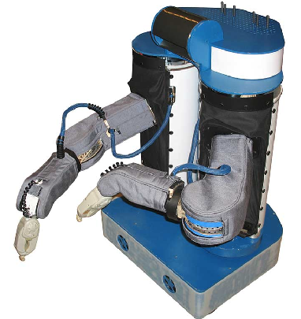
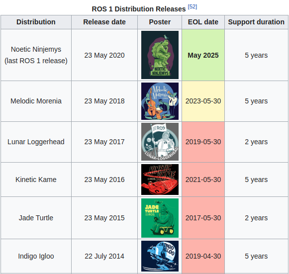

## 1. ROS 소개

ROS2 위키에서는 ROS를 다음과 같이 정의한다.

> ROS is an open-source, meta-operating system for your robot. It provides the services you would expect from an operating system, including hardware abstraction, low-level device control, implementation of commonly-used functionality, message-passing between processes, and package management. It also provides tools and libraries for obtaining, building, writing, and running code across multiple computers.   
>
> <http://wiki.ros.org/ROS/Introduction>
>
> ROS는 로봇을 위한 오픈 소스, 메타 운영 시스템이다. 하드웨어 추상화, 하위 디바이스 제어, 자주 사용되는 기능에 대한 구현(센싱, 인식, 지도 작성 등), 프로세스 사이의 메시지 전달, 패키지 관리 등의 기능을 제공한다. 또한 다양한 개발환경에서 코드를 개발하기 위한 개발 도구와 라이브러리를 제공한다.

ROS는 Robot Operating System의 줄임말인데 그렇다고 해서 ROS가 흔히 생각하는 리눅스나 윈도우 같은 운영체제는 아니다. ROS는 기존 운영체제 위에서 로봇을 위한 기능을 추가해주는 메타 운영체제(Meta Operating System)다. 기존 운영체제의 프로세스 관리, 파일 시스템, 유저 인터페이스 등의 기능을 활용하면서 위 정의에서 말한 기능들을 추가한다. 운영체제와 사용자 어플리케이션 사이에 있기 때문에 이러한 컨셉을 미들웨어(middleware)라고도 한다.

**ROS의 목적**은 "로보틱스 소프트웨어 개발을 전 세계 레벨에서 공동 작업이 가능하도록 하는 환경을 구축하는 것"이다. ROS는 로봇 소프트웨어 플랫폼, 미들웨어, 프레임워크 등에 그치지 않고 기본적인 미들웨어와 개발도구 뿐만 아니라 이를 바탕으로 만들어진 모든 것이 ROS다. ROS는 특정 소프트웨어를 말하는 것이 아니라 전세계 개발자들이 참여하는 개발 생태계가 ROS의 본질이라고 할 수 있다. ROS의 본질적인 목적은 로보틱스 연구, 개발에서 코드 재사용을 극대화하는 것에 초점이 맞춰져있다. 남이 이미 개발한 것을 내가 다시 구현할 필요가 없다는 것이다. ROS라는 생태계에서 전세계 개발자들이 코드를 공유하고 각자 기존 소프트웨어를 기반으로 새로운 개발에만 집중할 수 있는 환경을 만드는 것이다.  

ROS에서는 이러한 목적을 달성하기 위해 다른 소프트웨어 프레임워크와는 다르게 개발자들이 개발한 기능을 라이브러리가 아닌 독립적인 프로세스로 실행 가능한 노드로 제공한다. 기능을 함수나 클래스로 제공하지 않고 실행 파일로 제공한다는 것이다. 함수에 입력인자를 넣고 출력을 받는 대신 실행 파일을 프로세스로 실행하고 다른 프로세스에서 통신을 통해 입력 데이터를 넣고 다시 통신을 통해 출력 데이터를 받는 방식이다. 만약 라이브러리로 제공한다면 (파이썬에서는 패키지) 그것은 특정 언어에서만 사용할 수 있을 것이다. 하지만 각자 독립적인 프로세스로 실행 후 통신 프로토콜만 맞춘다면 다른 언어로 실행한 프로세스간에도 통신이 가능하다. 예컨데 남이 만든 C++ 프로그램을 내가 만든 파이썬 프로그램에서 활용할 수 있다.

**함수와 IPC를 그림으로 비교**

ROS를 이용한 개발의 **장점**은 무엇일까? 예를 들어 자율주행 로봇을 만드려면 대략 다음과 같은 요소들이 필요하다. 

1. 로봇 플랫폼 제어 SW

2. 센서 제어 SW (센서 종류별로)

3. 장애물 인식 알고리즘

4. 경로 생성 알고리즘

5. 위치인식 알고리즘

6. 통합 시스템

이 모든 것은 개인이나 소수의 그룹에서 직접 개발하려면 매우 힘들것이다. 하지만 ROS 생태계에는 이 모든 모듈이 일정수준 이상으로 작동하는 패키지들이 이미 존재한다. 개발자는 아마도 저 모듈 중 한두개 정도만 성능을 향상시키거나 자신의 목적에 맞게 작동하도록 직접 개발하고 싶을 것이다. 나머지 모듈은 ROS에서 제공하는 패키지를 설치하여 노드로 띄워놓고 그 사이에 자신이 개발한 노드를 연결하여 전체 시스템을 쉽게 구현할 수 있는 것이다. 개발과정을 돕는 빌드 툴이나 시각화 툴도 존재하고 메시지나 기능에 대한 요구사항이 표준화 되어있어서 자신이 만든 향상된 패키지는 곧 바로 다른 사람이 쓸수도 있다.

## 2. ROS 역사

2006년 스탠포드의 Kenneth Salisbury 교수의 박사과정 학생이던 Keenan Wyrobek와 Eric Berger는 로보틱스 연구를 하면서 반복되는 문제를 해결하고자 Stanford Personal Robotics Program을 시작했다. 로보틱스 연구의 문제는 새로운 프로젝트를 시작할 때마다 새로운 하드웨어 플랫폼 사용법을 익혀야 하고 기존에 구현됐던 소프트웨어를 새로 개발한 후에야 새로운 발전을 이룰 수 있다는 것이었다. Keenan Wyrobek의 표현에 따르면 90%의 시간을 기존에 다른 사람이 개발한 소프트웨어를 개발하는데 쓰고 나머지 10%를 새로운 혁신에 쓸수 있었다. 그들은 이러한 시간 낭비를 줄이기 위해 혁신적인 로봇 소프트웨어 개발 프레임워크을 만들기로 한다. PR1이라는 로봇 플랫폼을 기반으로 가정용 서비스 로봇을 개발하며 이러한 소프트웨어 프레임워크를 적용하고자 했다. (아래 사진) 스탠포드 인공지능연구소의 Morgan Quigley가 기존에 만들었던 **Switchyard**라는 시스템이 소프트웨어 프레임워크 개발의 기초가되었고 이후 Morgan Quigley는 지속적으로 ROS개발에 기여하여 이후 ROS를 관리하는 OSRF의 설립자가 된다.

Stanford Personal Robotics Program을 제대로 하려면 개발 인력을 고용해야했기 때문에 펀드를 얻기 위해 모금을 하러 다녔다. Joanna Hoffman (매킨토시 개발자)에게 5만 달러를 모금 받고 이를 바탕으로 개발을 하며 계속 모금 활동을 했다. 그들은 **"Linux of Robotics"**(로보틱스계의 리눅스)를 개발한다는 비전을 가지고 펀드를 받으려 했으나 "crazy"라는 반응이 다수였다. 그러다 2007년 Scott Hassan(구글의 초기 개발자)이 세운 **Willow Garage**에서 그 프로젝트를 지원하기로 하면서 두 사람은 Willow Garage로 들어가 충분한 지원아래 ROS와 PR2를 개발하게 된다.  

2008년에 초기 버전인 ROS 0.4 (Mango Tango)를 출시하고 2010년 1월 마침내 ROS 1.0 (Box Turtle)을 출시하고 두 사람의 오랜 목표였던 10대의 PR2를 세계 각지의 연구기관에 배포한다. 이와 더불어 2008년부터 진행한 인턴십 프로그램을 통해 다른 개발자들을 교육하고 개발에 참여시켰다. 그들이 다시 자신의 기관으로 돌아가서 ROS를 사용하고 전파하는 역할을 하게 함으로써 ROS의 확산에 기여하였다. 이후 ROS가 점점 다양한 곳에 쓰이게 되고 커뮤니티가 커지며 지속적으로 버전을 업데이트 시켜나간다.  

2013년에는 Willow Garage가 만든 **Open Source Robotics Foundation (OSRF)**에서 ROS 관리를 맡게 되고 Willow Garage는 Scott Hassan이 만든 다른 회사인 Suitable Technology로 합병된다. 이때부터 OSRF는 매년 새로운 버전의 ROS를 발표하였다. 2012년 부터는 매년 ROS 개발자들의 컨퍼런스인 ROScon이 열렸고 다양한 ROS관련 서적도 발매되었다. 2014년에는 NASA의 우주용 로봇에도 (Robonut 2) 적용되었다. 2017년에는 OSRF의 이름을 **Open Robotics**로 변경하였고 ROS의 다음 세대로서 실시간성을 비롯한 다양한 기술적 발전을 담은 ROS 2의 첫 번째 버전이 발표되었다.

**출처**

<https://spectrum.ieee.org/automaton/robotics/robotics-software/the-origin-story-of-ros-the-linux-of-robotics>  

<https://en.wikipedia.org/wiki/Robot_Operating_System>

## 3. ROS 버전

ROS의 버전 주기는 ROS가 공식적으로 지원하는 운영체제인 우분투(Ubuntu)의 새 버전 릴리즈와 동일하게 1년에 2번(4월, 10월) 이뤄졌다. 하지만 업데이트가 너무 빈번해 소프트웨어 사이의 호환성이 문제가 되자 2013년 Hydro Medusa부터는 우분투 4월 버전이 나온 후 5월 23일(세계 거북이의 날)에 한번씩만 새로운 버전을 릴리즈하고 있다. 우분투는 짝수 해에 LTS (Long Term Support) 버전이 나오는데 이 버전의 사용자가 많아서 ROS도 주로 짝수 해의 버전이 주로 사용된다. 최근에 가장 많이 사용된 우분투와 ROS 버전은 다음과 같다.

- Ubuntu 16.04 - ROS Kinetic Kame
- Ubuntu 18.04 - ROS Melodic Morenia
- Ubuntu 20.04 - ROS 2 Foxy Fitzroy

이 강의에서는 **ROS 2 Foxy Fitzroy** 버전을 사용할 것이다.

아래는 [위키](<https://en.wikipedia.org/wiki/Robot_Operating_System>)에서 가져온 최근 ROS와 ROS 2 버전이다. 

## 4. ROS 2 변화

### 4.1. 개발환경 변화

ROS 1은 2007년, ROS 2는 2015년에 첫 배포판이 나왔고 한동안 두 가지 버전이 병행 개발되다가 ROS 1은 2020년 Noetic Ninjemys을 마지막으로 개발이 완료됐다. 앞으로는 ROS 2만 새로운 버전이 나올 것이다. ROS 2는  ROS 1과는 병행 설치 가능하며 브릿지를 통해서 서로 통신도 가능하지만 근본적인 설계가 다른 시스템이다. 기존의 ROS 1을 보완하지 않고 새롭게 ROS 2가 개발된 이유는 로봇 개발환경과 사용자의 요구사항이 크게 바뀌었기 때문이다.  

ROS 1은 Willow Garage 사가 개인 서비스 로봇인 PR2 개발에 필요한 미들웨어 형태의 개발 프레임워크를 다양한 개발 툴과 함께 오픈 소스로 공개하면서부터 시작됐다. 따라서 PR2의 영향으로 다음과 같은 개발환경에 최적화 되어있었다.

- 단일 로봇
- 고성능 컴퓨터
- 리눅스 환경
- 실시간 제어 불필요
- 안정된 네트워크 환경
- 주로 대학이나 연구소와 같은 비상업적 연구 용도

하지만 오늘날의 로봇 개발환경은 크게 달라졌다. 로봇이 학술분야를 넘어서 제조, 농업, 드론, 서비스 등의 상용분야에서 다양하게 사용되고 있다. 이러한 변화에 따라 새로운 로봇 개발환경 및 요구사항은 다음과 같다.

- 다수의 로봇
- 임베디드 시스템 적용
- 실시간 제어
- 불안정한 네트워크에서도 동작할 수 있는 유연함
- 멀티 플랫폼 (리눅스, 윈도우, macOS)
- 최신 기술 지원(DDS 등)
- 상업용 제품 지원

이러한 요구사항을 반영하기 위해서는 대규모 API 변경이 필요한데 ROS 1에서 이를 변경하게 되면 기존 시스템과의 호환성이 떨어지므로 새로운 ROS를 개발하기로 한 것이다.

### 4.2. ROS 2 특징

1. 플랫폼: ROS 1은 주로 우분투에서만 사용하고 윈도우에서는 제한적으로 사용할 수 있었는데 ROS 2는 윈도우, 리눅스, macOS 까지 모두 사용가능하다.
2. 실시간성: ROS 2에서는 여러 조건이 있지만 실시간성을 지원한다. ROS 1도 실시간에 가깝게 제어가 가능했으나 여기서 말하는 "실시간"이란 시간 지연이 없음을 보장하는 시스템을 말한다.
3. 통신(DDS): ROS 1에서는 자체 개발한 TCPROS와 같은 통신 라이브러리를 사용했지만 ROS 2에서는 산업용으로 사용되는 통신 미들웨어 DDS를 사용하고 있다. DDS를 사용함으로써 자연스럽게 기존의 문제들이 많이 해결됐다.
   1. ROS master 제거: DDS에서 노드 간의 감지 기능을 갖고 있어서 ROS 1에서 노드 정보를 관리했던 마스터 불필요
   2. 조건이 맞으면 실시간 데이터 전송 가능, "실시간"이란 시간 지연이 없음을 보장하는 것
   3. 보안: ROS 1에서는 같은 네트워크 안에 있으면 프로세스간의 통신을 아무나 볼 수 있었으나 DDS는 자체적인 보안 기능이 있음
   4. QoS (Quality of Service): 데이터의 무결성과 전송 속도 사이의 우선 순위 결정 가능
4. 언어 버전: C++03 :arrow_right: C++14 / Python 2.7 :arrow_right: Python 3.5+
5. 빌드 도구: catkin_make, catkin_tools :arrow_right: ament_cmake, colcon

그 외에도 vcstool, lifecycle, component, launch, embedded system 등 다양한 변화가 일어났다.

## 5. ROS 2 구성

ROS 2는 400여 개의 [ROS 2 Common Packages](https://www.ros.org/reps/rep-2005.html)로 구성되어 있다. 다음은 ROS의 핵심부터 주변부까지 단계별로 대표적인 소프트웨어/패키지들을 정리한 것이다.

1. Core: ROS 시스템의 근간

   - DDS (Data Distribution Service): 프로세스 사이의 통신
   - RMW (ROS Middleware): DDS를 ROS에서 사용하기 위한 추상화 레이어
   - RCL (ROS Client Libraries): 사용자 프로그램에서 RMW를 사용하기 위한 언어별 라이브러리

2. Interface: 프로세스간 통신에 사용되는 공통의 메시지 타입, 사용자가 새로운 타입을 정의할 수도 있지만 가급적 주어진 기본 타입을 활용하는 것이 호환성이 좋다.

   - std_msgs: int, float, string 등의 기본 타입 정의
   - sensor_msgs: 카메라, 라이다 등의 센서 데이터를 위한 메시지 타입 정의
   - geometry_msgs: 점, 벡터 등의 공간기하학적 정보 전달을 위한 메시지 타입 정의

3. Build system: ROS 소프트웨어를 개발하기 위한 개발 도구들

   - ament_cmake: CMake 기반 C++ 빌드 시스템
   - colcon: 빌드 시스템을 이용하여 다수의 패키지들을 관리하고 빌드하는 도구

4. Tools: 많은 사용자들에게 필요하지만 구현하기 벅찬 패키지들, ROS 운영주체에서 직접 개발하여 제공

   - rviz: ROS의 기본 메시지 타입들에 대한 시각화, 예를 들면 라이다 데이터에 대한 3차원 시각화
   - rqt: ROS의 모든 상태를 GUI로 확인하고 수정할 수 있는 도구 집합
   - gazebo: 가상의 공간에서 로봇 소프트웨어 개발을 지원하는 시뮬레이션 툴

   - navigation: 자율주행에 필요한 위치인식, 지도구축, 경로계획 등의 기능 제공

   - moveit: 관절 로봇(로봇 팔)을 제어하기 위한 알고리즘 제공

5. 사용자 패키지: 사용자가 개발하여 공유한 패키지

   - drivers: 센서나 로봇 등의 하드웨어를 제어할 수 있는 운영체제 별 드라이버 + ROS 인터페이스로 하드웨어에 데이터를 입출력해주는 노드, 주로 제조사에서 제공
   - turtlebot3: 터틀봇에 필요한 다양한 기능과 메시지 묶음

## 6. 터틀봇(Turtlebot) 소개

터틀봇은 Willow Garage 사의 Melonee Wise와 Tully Foote 내부 프로젝트로부터 시작했다. 2010년 Melonee는 새로 나온 Kinect 센서를 이용한 주행알고리즘을 시험하기 위해 iRobot Create에 붙여보았는데 바로 잘 작동하진 않았다. ROS로 작동시킬 수 있는 주행 플랫폼은 PR2와 Lego NXT 등이 있었지만 PR2는 너무 크고 비쌌고 NXT는 다양한 센서를 장착하기 어려웠다. Melonee와 Tully는 Create을 ROS를 위한 주행용 플랫폼으로 만들기 위해 작은 사내 프로젝트를 만들었다. 처음엔 ROS용 Create의 드라이버를 만들고 로봇의 전원이 Kinect 센서를 작동시키기엔 부족해서 전원 보드를 직접 만들었고 Odometry가 정확하지 않아서 Gyro 센서를 장착했다. 그러다 우연히 구글의 클라우드 로봇 프로젝트와 연결이 되어 개발용으로 만들었던 Create 기반 주행 플랫폼을 구글에 판매하게 되었다. 이를 계기로 터틀봇을 상품화시켜 2011년부터 판매하게 되었다.  

기존에는 주행연구를 하려면 Pioneer 3DX 같은 수백~수천만원짜리 로봇이 있어야 로봇을 제어하고 이동정보를 받을수 있었다. 반면 터틀봇은 가격이 저렴하고 다양한 PC나 센서에 연결할 수 있어 확장성이 좋았다. 무엇보다도 ROS를 이용하면 편리하게 제어할 수 있었다. 사람들은 직접 드라이버를 설치하고 로봇을 제어하는 API를 공부하지 않아도 ROS에서 제공하는 드라이버와 표준 메시지를 사용하면 로봇을 제어하고 센서 정보를 얻을 수 있게 되었다. 이러한 장점 덕분에 터틀봇은 많은 연구소에 널리 퍼졌고 이용자가 많아질수록 관련 소프트웨어가 풍부해지고 터틀봇을 사용한 논문도 많이 발표되었다.

2012년에는 국내의 유진 로봇에서 자사의 로봇 청소기 플랫폼을 기반으로 Willow Garage와 협업해 거북이(Kobuki)를 만들었다. 거북이는 터틀봇2(Turtlebot 2)로도 불렸으며 기존 터틀봇보다 플랫폼을 다양하게 확장할 수 있었다.

2017년에는 국내 로보티즈라는 회사에서 터틀봇3(Turtlebot 3)를 출시했다. 터틀봇3는 모듈형 판넬을 이용하여 조립식으로 층을 쌓아갈 수 있어 기존의 정형화된 확장 프레임을 벗어나 사용자가 자유롭게 원하는 모양을 조립할 수 있도록 설계했다. 저렴한 Raspberry Pi와 360도 Lidar 센서가 기본 장착되어 주행 어플리케이션을 더 쉽게 만들수 있게되었다.  

2022년에는 Clearpath라는 회사에서 Turtlebot 4를 출시하기 위해 준비중이다.

**출처**

<https://spectrum.ieee.org/automaton/robotics/diy/interview-turtlebot-inventors-tell-us-everything-about-the-robot>  

<https://www.turtlebot.com/>

