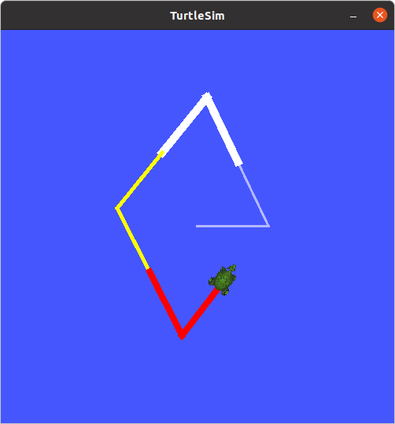

## ROS 개념

ROS를 본격적으로 사용하기 전에 알아야한 ROS의 개념과 용어에 대해 알아본다.

### 1. 노드 (Node)

최소 단위의 실행 가능한 프로세스 혹은 실행파일이다. ROS에서는 최소한의 실행 단위로 프로그램을 나누어 구현한다. ROS를 사용할 때 보통 여러가지 노드를 동시에 실행하고 노드들 사이의 통신을 통해 하나의 완성된 시스템을 이룬다.  

예를 들어 라이다 기반 자율주행 시스템을 만든다고 하면, 라이다 드라이버 노드, 위치인식 및 지도구축 노드, 경로계획 노드, 모터 드라이버 노드 등이 필요하다. ROS는 이렇게 노드들의 역할을 세분화시켜 노드들 간의 의존성을 줄이고 독립성을 높여 다른 목적의 작업에도 일부 노드를 재사용할 수 있게 한다. 예를 들면 경로계획 노드는 라이다 데이터, 현재 위치 데이터, 지도 데이터만 표준 형식으로 받으면 로봇이 아닌 자동차의 경로계획에도 사용할 수 있는 것이다.  

### 2. 패키지 (Package)

ROS 소프트웨어를 구성하는 기본 단위다. ROS 응용 프로그램은 패키지 단위로 개발된다. 우분투의 패키지 개념과 비슷하다. 패키지는 하나 이상의 노드를 포함할 수도 있고 없을 수도 있다. 패키지는 노드 외에도 메시지 정의 파일, 런치(launch) 파일과 같은 실행 및 설정 파일들을 포함한다. 

### 3. 메시지(Message)

여러 노드들이 연동되는 ROS 시스템에서는 노드 사이의 데이터를 주고 받을 수 있어야 한다. 노드들 사이에 주고 받는 데이터를 메시지라고 하고 그 형식을 메시지 타입(Message Type)이라고 한다. 기본 메시지 타입은 Integer, Floating type, Boolean, String 등이 있으며 이들을 묶어 구조화된 메시지나 메시지 배열도 쓸 수 있다.  

메시지는 통신 방식에 따라 토픽(Topic), 서비스(Service), 액션(Action) 등이 있다.  

### 4. 파라미터 (Parameter)

ROS 1에서 파라미터는 원래 마스터(master)라는 중심 노드에서 관리하던 변수들이고 모든 노드 사이에서 공유되는 값이다. ROS 2에서는 마스터가 없어졌기 때문에 파라미터도 개별 노드 중심으로 변화했다. ROS 2에서 파라미터는 각 노드가 가진 파라미터 서버에서 관리한다. 파라미터는 주로 각 노드에서 사용하는 설정 값으로 사용되고 외부에서 명령어나 프로그램을 통해 값을 읽어(get)오거나 변경(set)가능하다. 실행 중인 노드를 중지하고 다시 빌드하지 않아도 내부 설정값을 수정할 수 있는 것이다. 또한 노드는 파라미터 클라이언트를 통해 다른 노드가 가지고 있는 파라미터 값을 읽거나 수정 가능하다. 이를 이용하면 파라미터가 ROS 시스템에서 전역 변수처럼 사용될 수 있다.

### 5. 네임 (Name)

노드, 메시지(토픽, 서비스, 액션), 파라미터 등은 모두 네임이 있다. 네임은 실행 중인 ROS 프로세스에서 사용되는 모든 ROS 자원(노드, 메시지, 파라미터)이 가지고 있는 이름 혹은 식별자라고 할 수 있다.    

입문자들이 헷갈리는 점은 노드나 메시지에서 이름이 두 가지씩 보인다는 것이다. 노드의 경우 **실행 파일명**이 있고 그것이 실행됐을 때 프로세스가 가지는 **노드 네임**이 있다. 두 가지는 별개의 것으로 일반적으로 비슷하게 짓지만 전혀 다른 이름이어도 상관없다. 메시지의 경우에도 메시지 형식을 정의한 메시지 타입명이 있고 ROS에서 어떤 메시지 타입을 이용해 토픽이나 서비스 방식으로 통신을 할 때 **토픽 네임, 서비스 네임** 등이 따로 있다.  

ROS 1에서는 네임 중복을 막기 위해 같은 네임을 가진 자원이 할당되면 기존의 자원은 종료/해제 되었다. 하지만 ROS 2에서는 네임의 중복도 허용하지만 특별한 경우를 제외하고는 바람직하지 않으므로 가급적 네임을 다르게 지정해주는 것이 좋다.  

### 6. 인터페이스 (interface)

ROS 2 노드 간에 데이터를 주고 받기 위해서는 토픽, 서비스, 액션이라는 통신 방식을 이용한다. 이때 사용되는 데이터 형태를 ROS 2 인터페이스(interface)라고 한다. 토픽, 서비스, 액션은 각각 msg, srv, action 인터페이스라는 다른 인터페이스 형식을 가지고 있다. 인터페이스는 다음과 같이 하나 이상의 필드 타입과 필드 이름으로 구성되어 있다.  

```
fieldtype1 fieldname1
fieldtype2 fieldname2
fieldtype3 fieldname3
```

필드 타입으로 기본 built-in 타입을 쓰거나 기존에 정의한 다른 인터페이스도 쓸 수 있다. C/C++의 구조체를 생각하면 이해하기 쉽다. ROS 2에서 정의된 built-in 타입과 각 언어별로 매칭되는 타입은 다음과 같다. 인터페이스에 대한 자세한 내용은 토픽, 서비스, 액션에서 더 다룰것이다.


자료: <https://docs.ros.org/en/foxy/Concepts/About-ROS-Interfaces.html#field-types> 


## ROS 통신 방식

### 1. 토픽 (Topic)

- **용도**: **토픽은 지속적인 비동기식 단방향 통신**을 위한 통신 방식이다. ROS에서 가장 많이 사용되는 통신 방식으로 주로 센서 데이터를 알고리즘 노드로 보내거나 어떤 알고리즘에서 처리한 결과를 다음 알고리즘으로 보낼때 많이 사용된다.  
- **구성**: 토픽에는 메시지를 보내는 **퍼블리셔(Publisher, 발행자)**와 메시지를 수신하는 **서브스크라이버(Subscriber, 구독자)**가 있다. 1:1 통신이 기본이지만 1:N, N:1, N:N 통신도 가능하다. 특정 네임을 가진 토픽을 여러 노드에서 발행할 수도 있고 여러 노드에서 구독할 수도 있다. 노드는 다수의 토픽에 대해 퍼블리셔와 서브스크라이버 역할을 할 수 있다. 퍼블리셔 혹은 서브스크라이버만 할수도 있고 두 가지를 동시에 할수도 있다. 예를들어 자율주행 알고리즘을 가진 노드라면 센서 데이터를 서브스크라이브(subscribe)하고 주변 상황을 판단하여 로봇에게 이동 속도를 퍼블리시(publish) 할 수 있다. 
- **인터페이스**: 토픽은 **msg(message) 인터페이스**를 사용하여 노드 사이에 데이터를 전달한다. msg 인터페이스는 C언어 구조체와 비슷하게 한 개 이상의 필드(field)를 가지고 있어 여러가지 데이터를 담을 수 있다. msg 인터페이스는 패키지의 msg 폴더 아래 *.msg 파일에 간단히 필드 타입과 필드 이름을 적어 정의할 수 있다. 패키지를 빌드하면 ROS 시스템은 msg 파일을 자동으로 각 언어별 클래스로 변환해준다. 예를 들면 msg를 정의한 "Point.msg"와 이를 빌드해서 만든 "Point_.h"는 다음과 같다. ROS 프로그램에서는 이렇게 만들어진 헤더 파일을 인클루드하여 코드에서 데이터를 다룰 수 있다. 

```
# /opt/ros/foxy/share/geometry_msgs/msg/Point.msg
float64 x
float64 y
float64 z

# /opt/ros/foxy/include/geometry_msgs/msg/dds_connext/Point_.h
... (생략)
class Point_ 
{
	... (생략)
    DDS_Double   x_ ;
    DDS_Double   y_ ;
    DDS_Double   z_ ;
};
```

앞으로 msg 인터페이스는 편의상 **메시지 타입**으로 부르기로 한다.  


자료: <https://docs.ros.org/en/foxy/Tutorials/Topics/Understanding-ROS2-Topics.html>


### 2. 서비스 (Service)

- **용도**: **서비스는 동기식 양방향 통신** 방식이다. 주로 특정 조건을 만족했을 때 일회성으로 이를 알리거나 그에 따른 명령을 내리고 응답을 받는 수단으로 사용된다. 여기서 동기식(synchronous)이란 요청을 보내고 응답을 받을때까지 기다린다는 뜻이다. 토픽은 퍼블리셔가 메시지를 보내고 수신을 확인하거나 응답을 기다리지 않고 바로 다음으로 넘어간다.
- **구성**: 서비스를 **요청(request)**하는 **서비스 클라이언트(service client)**와 요청에 대한 **응답(response)**을 해주는 **서비스 서버(service server)**로 구성된다. 서비스는 서버와 클라이언트가 1:1 혹은 1:N으로 연결될 수 있다. 특정 네임을 가지는 서비스 서버에 여러 클라이언트가 요청을 보낼 수 있다. 노드는 여러개의 서비스 서버와 클라이언트를 가질 수 있다. 어떤 노드가 서비스 서버이면서 클라이언트일 수도 있다.
- **인터페이스**: 서비스는 **srv(service) 인터페이스**를 사용하여 데이터를 주고 받는다. srv 인터페이스는 요청과 응답에 필요한 두 개의 msg 인터페이스를 결합한 것과 같다. srv 인터페이스는 패키지의 srv 폴더 아래 *.srv 파일에 `---`로 구분되는 두 가지 msg 인터페이스를 적어서 정의할 수 있다. 패키지를 빌드하면 자동으로 ROS 시스템은 srv 파일을 자동으로 각 언어별 클래스로 변환해준다. 예를 들면 srv를 정의한 "AddTwoInts.srv"와 이를 빌드해서 만든 "AddTwoInts_.h"는 다음과 같다.

```
# /opt/ros/foxy/share/example_interfaces/srv/AddTwoInts_Response.msg
int64 a
int64 b
---
int64 sum

# /opt/ros/foxy/include/example_interfaces/srv/dds_connext/AddTwoInts_.h
... (생략)
class AddTwoInts_Request_ 
{
    DDS_LongLong   a_ ;
    DDS_LongLong   b_ ;
};
... (생략)
class AddTwoInts_Response_ 
{
	DDS_LongLong   sum_ ;
};
```

앞으로 srv 인터페이스는 편의상 **서비스 타입**으로 부르기로 한다.  


자료: <https://docs.ros.org/en/foxy/Tutorials/Services/Understanding-ROS2-Services.html>

### 3. 액션 (Action)

- **용도**: 액션은 토픽과 서비스를 결합한 통신 방식이다. 액션 클라이언트에서 목표(goal)를 지정하면 서버에서는 특정 작업을 수행하면서 중간 결과값인 피드백(feedback)을 보내고 작업이 완료되면 결과(result)를 전송해준다. 액션은 주로 결과를 얻기까지 시간이 오래걸리는 작업을 요청할 때 사용된다. 만약 서비스로 그런 작업을 요청하면 코드가 요청하는 곳에서 응답이 올 때까지 멈춰버리기 때문에 다른 작업을 할 수 없다.
- **구성**: 액션을 요청하는 액션 클라이언트(action client)와 이에 응답하는 액션 서버(action server)로 구성된다. 액션 클라이언트는 서비스 클라이언트 3개(Action Goal, Action CancelGoal, Action Result)와 토픽 서브스크라이버 2개(Action GoalStatus, Action Feedback)로 구성되어있다. 반대로 액션 서버는 이에 대응하는 서비스 서버 3개와 토픽 퍼블리셔 2개로 구성되어있다. 
- **인터페이스**: srv 인터페이스가 msg 인터페이스 2개로 만들어진다면 action 인터페이스는 요청, 결과, 피드백에 해당하는 msg 인터페이스 3개가 필요하다. 예를 들면 action을 정의한 "RotateAbsolute.action" 파일은 다음과 같다.

```
# /opt/ros/foxy/share/turtlesim/action/RotateAbsolute.action
# The desired heading in radians
float32 theta
---
# The angular displacement in radians to the starting position
float32 delta
---
# The remaining rotation in radians
float32 remaining
```

앞으로 action 인터페이스는 편의상 **액션 타입**으로 부르기로 한다.  


자료: <https://docs.ros.org/en/foxy/Tutorials/Understanding-ROS2-Actions.html>


## ROS 명령어

ROS 1에서는 CLI (Command Line Interface)가 `rosrun, rosnode, rostopic` 등으로 종류별로 세분화된 명령어(실행파일)가 있었다. ROS 2에서는 이를 모두 `ros2 {command} ({verb}) ({options})` 형식으로 변경하여 `ros2`라는 하나의 명령어 안에서 뒤에 오는 세부 명령어에 따라 모든 명령어를 쓸수 있도록 했다. 여기서는 두 번째 자리에 오는 `{command}` 별로 명령어들을 알아본다.  

ROS는 여러개의 노드가 동시에 돌아가는 경우가 대부분이기 때문에 여러개의 터미널이 필요하다. 우분투에서 기본 제공하는 터미널인 "gnome-terminal"이 탭(tab) 기능을 제공하긴 하지만 여러개의 터미널을 관리하기에는 여전히 불편하다. 그래서 ROS를 쓸 때는 주로 칸을 나눌수 있는 터미네이터(terminator)를 사용한다. 설치해서 써보자. `ctrl+shift+o`가 상하로 나누기, `ctrl+shift+e`가 좌우 나누기 단축키다.  

```
$ sudo apt install terminator
```


### 1. run

<table>
<colgroup>
<col width="35%" />
<col width="65%" />
</colgroup>
<thead>
<tr class="header">
<th>command</th>
<th>description</th>
</tr>
</thead>
<tbody>
<tr>
<td markdown="span">ros2 run {package} {node}</td>
<td markdown="span">특정 패키지의 특정 노드 실행</td>
</tr>
</tbody>
</table>
ros2 run 명령어를 통해 특정 패키지의 특정 노드를 실행할 수 있다. 다음 명령어로 turtlesim 패키지의 turtlesim_node와 turtle_teleop_key 노드를 실행해보자.  

**이 포스트의 모든 실습에서 아래 두 개의 노드가 실행되어 있어야 한다. **

터미널1에서  

```
$ ros2 run turtlesim turtlesim_node
```

터미널2에서  

```
$ ros2 run turtlesim turtle_teleop_key
```

실행해서 방향키로 거북이를 조종해보자.


실행중인 노드와 노드 사이의 통신(토픽)을 시각적으로 확인하고 싶을 때는 rqt_graph를 실행해보자. 원래는 `ros2 rqt_graph rqt_graph`로 실행해야 하지만 자주 사용되는 ROS 툴들은 앞의 명령어를 생략한 지정명령어가 있다.

```
$ rqt_graph
```


### 2. node

<table>
<colgroup>
<col width="35%" />
<col width="65%" />
</colgroup>
<thead>
<tr class="header">
<th>command</th>
<th>description</th>
</tr>
</thead>
<tbody>
<tr>
<td markdown="span">ros2 node list</td>
<td markdown="span">실행중인 노드 목록 출력</td>
</tr>
<tr>
<td markdown="span">ros2 node info {package_name}</td>
<td markdown="span">실행중인 노드 중 지정한 노드의 정보 출력</td>
</tr>
</tbody>
</table>

현재 개발환경에서 실행 중인 노드 목록을 보기 위해서는 `ros2 node list` 명령어를 사용하면 된다. 앞서 세 가지 노드를 작동시킨 상태에서 실행하면 다음과 같은 결과를 볼 수 있다.

```
$ ros2 node list
/rqt_gui_py_node_69689
/teleop_turtle
/turtlesim
```

rqt_graph는 rqt 플러그인 형태로 실행되어 뒤에 프로세스 아이디가 붙는다. 여기서 확인할 수 있는 것은 노드를 실행할 때의 이름과 노드 목록에서 보이는 *네임*이 다르다는 것이다. `ros2 run`에서는 노드의 실행 파일 이름이 들어가고 `ros2 node`에서는 실행중인 노드 프로세스에 붙는 네임이 사용된다. 다음은 실행파일과 네임을 비교한 표다. 

| 실행 파일         | 네임                   |
| ----------------- | ---------------------- |
| turtlesim_node    | /turtlesim             |
| turtle_teleop_key | /teleop_turtle         |
| rqt_graph         | /rqt_gui_py_node_{pid} |

만약 여기서 turtlesim_node를 하나 더 실행하고 싶다면 똑같이 `ros2 run turtlesim turtlesim_node`를 실행하면 된다. 하지만 이 경우 두 개의 turtlesim_node 프로세스가 "/turtlesim"이라는 동일한 네임을 가지게 된다. 네임이 같으면 두 노드를 구분해서 사용할 수 없다. 이럴때는 명령어에서 네임을 수정해서 실행할 수 있다.  

```
$ ros2 run turtlesim turtlesim_node __node:=new_turtle
```


둘 다 "/teleop_turtle"이란 같은 노드에서 같은 토픽을 받아서 움직이므로 비슷하게 움직인다. (똑같지는 않다.) 이후 노드 목록을 확인하면 다음과 같다.  

```
$ ros2 node list
/rqt_gui_py_node_69689
/teleop_turtle
/new_turtle
/turtlesim
```

rqt_graph 결과는 다음과 같다.


실행중인 노드의 정보를 확인하기 위해서는 `ros2 node info` 명령어에 노드 네임을 지정하면 된다. 출력되는 내용은 주로 다른 노드와 통신할 수 있는 메시지에 관한 것들이다.

```
$ ros2 node info /turtlesim 
/turtlesim
  Subscribers:
    /parameter_events: rcl_interfaces/msg/ParameterEvent
    /turtle1/cmd_vel: geometry_msgs/msg/Twist
  Publishers:
    /parameter_events: rcl_interfaces/msg/ParameterEvent
    /rosout: rcl_interfaces/msg/Log
    /turtle1/color_sensor: turtlesim/msg/Color
    /turtle1/pose: turtlesim/msg/Pose
  Service Servers:
    /clear: std_srvs/srv/Empty
    /kill: turtlesim/srv/Kill
    /reset: std_srvs/srv/Empty
    /spawn: turtlesim/srv/Spawn
    /turtle1/set_pen: turtlesim/srv/SetPen
    /turtle1/teleport_absolute: turtlesim/srv/TeleportAbsolute
    /turtle1/teleport_relative: turtlesim/srv/TeleportRelative
    /turtlesim/describe_parameters: rcl_interfaces/srv/DescribeParameters
    /turtlesim/get_parameter_types: rcl_interfaces/srv/GetParameterTypes
    /turtlesim/get_parameters: rcl_interfaces/srv/GetParameters
    /turtlesim/list_parameters: rcl_interfaces/srv/ListParameters
    /turtlesim/set_parameters: rcl_interfaces/srv/SetParameters
    /turtlesim/set_parameters_atomically: rcl_interfaces/srv/SetParametersAtomically
  Service Clients:

  Action Servers:
    /turtle1/rotate_absolute: turtlesim/action/RotateAbsolute
  Action Clients:
```


### 3. topic

<table>
<colgroup>
<col width="35%" />
<col width="65%" />
</colgroup>
<thead>
<tr class="header">
<th>command</th>
<th>description</th>
</tr>
</thead>
<tbody>
<tr>
<td markdown="span">ros2 topic list</td>
<td markdown="span">사용 가능한 토픽 목록 출력</td>
</tr>
<tr>
<td markdown="span">ros2 topic info {topic_name}</td>
<td markdown="span">지정한 토픽의 정보 출력</td>
</tr>
<tr>
<td markdown="span">ros2 topic type {topic_name} {msg type} {data}</td>
<td markdown="span">지정한 토픽의 msg 타입 출력</td>
</tr>
<tr>
<td markdown="span">ros2 topic echo {topic_name}</td>
<td markdown="span">지정한 토픽의 데이터 출력</td>
</tr>
<tr>
<td markdown="span">ros2 topic pub {topic_name}</td>
<td markdown="span">지정한 토픽의 토픽 퍼블리시</td>
</tr>
<tr>
<td markdown="span">ros2 topic delay {topic_name}</td>
<td markdown="span">지정한 토픽의 지연시간 출력</td>
</tr>
<tr>
<td markdown="span">ros2 topic bw {topic_name}</td>
<td markdown="span">지정한 토픽의 대역폭 출력</td>
</tr>
<tr>
<td markdown="span">ros2 topic hz {topic_name}</td>
<td markdown="span">지정한 토픽의 주기 출력</td>
</tr>
</tbody>
</table>

turtlesim 실행 후 새로운 터미널에서 토픽 명령어를 실습해보자. 먼저 현재 실행중인 모든 노드에서 퍼블리시하거나 서브스크라이브 할 수 있는 모든 토픽 목록을 확인해본다. `-t` 옵션을 넣으면 메시지 타입까지 보여준다.

```
$ ros2 topic list -t
/parameter_events [rcl_interfaces/msg/ParameterEvent]
/rosout [rcl_interfaces/msg/Log]
/turtle1/cmd_vel [geometry_msgs/msg/Twist]
/turtle1/color_sensor [turtlesim/msg/Color]
/turtle1/pose [turtlesim/msg/Pose]
```

토픽의 네임을 지정하여 특정 토픽에 대한 정보를 확인할 수 있다. 토픽 메시지 타입, 퍼블리셔와 서브스크라이버 개수를 확인할 수 있다.

```
$ ros2 topic info /turtle1/cmd_vel 
Type: geometry_msgs/msg/Twist
Publisher count: 1
Subscription count: 1
```

특정 토픽의 메시지 내용을 터미널에서 확인할 수도 있다. 다음은  "/teleop_turtle" 노드에서 위쪽:arrow_up:, 왼쪽:arrow_left:을 한 번씩 눌렀을 때 나온 결과다.

```
$ ros2 topic echo /turtle1/cmd_vel
linear:
  x: 2.0
  y: 0.0
  z: 0.0
angular:
  x: 0.0
  y: 0.0
  z: 0.0
---
linear:
  x: 0.0
  y: 0.0
  z: 0.0
angular:
  x: 0.0
  y: 0.0
  z: 2.0
---
```

토픽 내용을 보는 것뿐만 아니라 터미널에서 직접 퍼블리시 하는 것도 가능하다. 토픽 퍼블리시는 ROS 프로그램에서 노드를 실행하여 노드에서 퍼블리시를 하는 것이 보통이다. 하지만 가끔 어떤 메시지를 보냈을 때 서브스크라이버를 가진 노드가 의도한대로 작동하는지 테스트 해볼때 터미널에서 명령어를 사용하기도 한다.  

```
$ ros2 topic pub --once /turtle1/cmd_vel geometry_msgs/msg/Twist "{linear: {x: 2.0, y: 0.0, z: 0.0}, angular: {x: 0.0, y: 0.0, z: 1.8}}"
```

 `--once` 옵션은 토픽을 한 번만 발행하는 옵션이다. 선속도와 각속도가 모두 있으므로 거북이는 다음과 같이 곡선을 따라 움직이게 된다.  


지속적인 퍼블리시를 위해서는 `--once` 대신 `--rate N` 옵션을 주면 주기적으로 같은 토픽을 퍼블리시 할 수 있다. N은 1초당 퍼블리시하는 횟수다.  

```
$ ros2 topic pub --rate 1 /turtle1/cmd_vel geometry_msgs/msg/Twist "{linear: {x: 2.0, y: 0.0, z: 0.0}, angular: {x: 0.0, y: 0.0, z: 1.8}}"
```

이렇게 하면 거북이가 원을 따라 계속 움직이는 것을 볼 수 있다.  

### 4. service

<table>
<colgroup>
<col width="35%" />
<col width="65%" />
</colgroup>
<thead>
<tr class="header">
<th>command</th>
<th>description</th>
</tr>
</thead>
<tbody>
<tr>
<td markdown="span">ros2 service list</td>
<td markdown="span">사용 가능한 서비스 목록 출력</td>
</tr>
<tr>
<td markdown="span">ros2 service type {service_name}</td>
<td markdown="span">지정 서비스의 타입 출력</td>
</tr>
<tr>
<td markdown="span">ros2 service call {service_name} {srv type} {data}</td>
<td markdown="span">지정한 서비스의 서비스 요청 전달</td>
</tr>
<tr>
<td markdown="span">ros2 service find {service_name}</td>
<td markdown="span">지정한 서비스 타입의 서비스 출력</td>
</tr>
</tbody>
</table>

turtlesim 실행 후 새로운 터미널에서 서비스 명령어를 실습해보자. 현재 실행중인 노드들의 서비스 목록을 확인한다. 토픽과 마찬가지로 `-t` 옵션을 붙이면 srv 타입까지 볼 수 있다.

```
$ ros2 service list -t
/clear [std_srvs/srv/Empty]
/kill [turtlesim/srv/Kill]
/reset [std_srvs/srv/Empty]
/spawn [turtlesim/srv/Spawn]
/teleop_turtle/describe_parameters [rcl_interfaces/srv/DescribeParameters]
/teleop_turtle/get_parameter_types [rcl_interfaces/srv/GetParameterTypes]
/teleop_turtle/get_parameters [rcl_interfaces/srv/GetParameters]
/teleop_turtle/list_parameters [rcl_interfaces/srv/ListParameters]
/teleop_turtle/set_parameters [rcl_interfaces/srv/SetParameters]
/teleop_turtle/set_parameters_atomically [rcl_interfaces/srv/SetParametersAtomically]
/turtle1/set_pen [turtlesim/srv/SetPen]
/turtle1/teleport_absolute [turtlesim/srv/TeleportAbsolute]
/turtle1/teleport_relative [turtlesim/srv/TeleportRelative]
/turtlesim/describe_parameters [rcl_interfaces/srv/DescribeParameters]
/turtlesim/get_parameter_types [rcl_interfaces/srv/GetParameterTypes]
/turtlesim/get_parameters [rcl_interfaces/srv/GetParameters]
/turtlesim/list_parameters [rcl_interfaces/srv/ListParameters]
/turtlesim/set_parameters [rcl_interfaces/srv/SetParameters]
/turtlesim/set_parameters_atomically [rcl_interfaces/srv/SetParametersAtomically]
```

특정 서비스의 서비스 타입만 확인하고 싶을 때는 다음과 같이 쓴다.  

```
$ ros2 service type /clear
std_srvs/srv/Empty
```

역으로, 서비스 타입을 이용해 서비스를 검색할수도 있다.

```
$ ros2 service find std_srvs/srv/Empty 
/clear
/reset
```

터미널에서 토픽 뿐만 아니라 서비스도 직접 요청 가능하다. "/reset" 서비스를 이용하면 turtlesim의 상태를 초기화하고 새로운 거북이가 등장한다.

```
$ ros2 service call /reset std_srvs/srv/Empty 
requester: making request: std_srvs.srv.Empty_Request()

response:
std_srvs.srv.Empty_Response()
```

거북이의 이동 궤적을 나타내는 선의 색과 두께를 바꿔보자.

```
$ ros2 service call /turtle1/set_pen turtlesim/srv/SetPen "{r: 255, g: 255, b: 255, width: 10}"
waiting for service to become available...
requester: making request: turtlesim.srv.SetPen_Request(r=255, g=255, b=255, width=10, off=0)
response:
turtlesim.srv.SetPen_Response()

$ ros2 service call /turtle1/set_pen turtlesim/srv/SetPen "{r: 255, g: 255, b: 0, width: 5}"
requester: making request: turtlesim.srv.SetPen_Request(r=255, g=255, b=0, width=5, off=0)
response:
turtlesim.srv.SetPen_Response()

$ ros2 service call /turtle1/set_pen turtlesim/srv/SetPen "{r: 255, g: 0, b: 0, width: 8}"
waiting for service to become available...
requester: making request: turtlesim.srv.SetPen_Request(r=255, g=0, b=0, width=8, off=0)
response:
turtlesim.srv.SetPen_Response()
```




### 5. action

<table>
<colgroup>
<col width="35%" />
<col width="65%" />
</colgroup>
<thead>
<tr class="header">
<th>command</th>
<th>description</th>
</tr>
</thead>
<tbody>
<tr>
<td markdown="span">ros2 action list</td>
<td markdown="span">사용 가능한 액션 목록 출력</td>
</tr>
<tr>
<td markdown="span">ros2 action info {action_name}</td>
<td markdown="span">지정 액션의 정보 출력</td>
</tr>
<tr>
<td markdown="span">ros2 action send_goal {action_name} {action_type} {data}</td>
<td markdown="span">지정 액션의 액션 목표 전송</td>
</tr>
</tbody>
</table>

turtlesim 실행 후 실행 중인 노드에서 사용중인 액션 목록을 확인해보자. turtlesim에서는 절대각도로 회전하는 "rotate_absolute"라는 액션이 있다.

```
$ ros2 action list
/turtle1/rotate_absolute
```

"/teleop_turtle" 노드에서 액션을 통해 "/turtlesim" 노드에 거북이의 절대 각도를 지정할 수 있다. 키보드 F 주변의 8개 문자가 각기 다른 절대각도를 의미하는 단축키다. "/teleop_turtle" 노드에서 "E, R, T, D, G, C, V, B" 문자들을 눌러 거북이가 어떤 방향을 향하는지 확인해보자. 해당 키를 누르면 액션이 실행되고 거북이가 지정한 각도에 도착하고 나서야 액션이 종료되는 것을 볼 수 있다.  

이 액션에 대해 더 자세히 알아보자. `ros2 action info`를 통해 액션을 사용하는 노드를 알아내고 `ros2 node info`를 통해 액션의 타입을 알아내고 `ros2 interface show`를 통해 액션의 자세한 구성을 볼 수 있다.

```
$ ros2 action info /turtle1/rotate_absolute 
Action: /turtle1/rotate_absolute
Action clients: 1
    /teleop_turtle
Action servers: 1
    /turtlesim

$ ros2 node info /turtlesim 
/turtlesim
  (생략)
  Action Servers:
    /turtle1/rotate_absolute: turtlesim/action/RotateAbsolute
  Action Clients:

$ ros2 interface show turtlesim/action/RotateAbsolute 
# The desired heading in radians
float32 theta
---
# The angular displacement in radians to the starting position
float32 delta
---
# The remaining rotation in radians
float32 remaining
```

액션의 구성을 알았으니 이번엔 터미널에서 액션 요청을 보내서 거북이가 지정한 각도로 회전했는지 확인해보자.  

```
$ ros2 action send_goal /turtle1/rotate_absolute turtlesim/action/RotateAbsolute "{theta: 1.5708}"
Waiting for an action server to become available...
Sending goal:
     theta: 1.5708

Goal accepted with ID: 496dc72099904686b5f797b9718ee90b

Result:
    delta: -1.5520002841949463

Goal finished with status: SUCCEEDED
```


### 6. interface

<table>
<colgroup>
<col width="35%" />
<col width="65%" />
</colgroup>
<thead>
<tr class="header">
<th>command</th>
<th>description</th>
</tr>
</thead>
<tbody>
<tr>
<td markdown="span">ros2 interface list</td>
<td markdown="span">사용 가능한 모든 인터페이스 목록 출력</td>
</tr>
<tr>
<td markdown="span">ros2 interface package {package_name}</td>
<td markdown="span">특정 패키지에서 사용가능한 인터페이스 목록 출력</td>
</tr>
<tr>
<td markdown="span">ros2 interface packages</td>
<td markdown="span">인터페이스가 정의된 패키지들의 목록 출력</td>
</tr>
<tr>
<td markdown="span">ros2 interface proto {package_name}</td>
<td markdown="span">지정 패키지의 프로토타입 출력</td>
</tr>
<tr>
<td markdown="span">ros2 interface show {interface_name}</td>
<td markdown="span">지정 인터페이스의 데이터 형식 출력</td>
</tr>
</tbody>
</table>

turtlesim 실행 후 새로운 터미널에서 interface 명령어를 실습해보자. 먼저 현재 ROS 2 시스템에서 사용가능한 모든 인터페이스 목록 출력한다.

```
$ ros2 interface list
Messages:
    action_msgs/msg/GoalInfo
    action_msgs/msg/GoalStatus
    action_msgs/msg/GoalStatusArray
	(생략)
Services:
    action_msgs/srv/CancelGoal
    composition_interfaces/srv/ListNodes
    composition_interfaces/srv/LoadNode
	(생략)
Actions:
    action_tutorials_interfaces/action/Fibonacci
    example_interfaces/action/Fibonacci
    tf2_msgs/action/LookupTransform
    turtlesim/action/RotateAbsolute 
```

인터페이스를 하나라도 정의하는 패키지들의 목록을 확인해보자.

```
$ ros2 interface packages
action_msgs
action_tutorials_interfaces
actionlib_msgs
builtin_interfaces
(생략)
```

"turtlesim" 패키지에서 정의하는 인터페이스들을 확인해보자.

```
$ ros2 interface package turtlesim 
turtlesim/srv/TeleportRelative
turtlesim/srv/Spawn
turtlesim/msg/Color
turtlesim/msg/Pose
turtlesim/srv/Kill
turtlesim/srv/SetPen
turtlesim/action/RotateAbsolute
turtlesim/srv/TeleportAbsolute
```

turtlesim을 실행했을 때 거북이의 속도는 "/turtle1/cmd_vel"이라는 토픽으로 보내고 있고 이것의 인터페이스는 "geometry_msgs/msg/Twist"다. 이 인터페이스의 구성을 확인해보자. `show` verb는 파일에 저장된 인터페이스 정의를 그대로 보여주고 `proto` verb는 필드가 다른 인터페이스면 다른 인터페이스의 내부 내용과 기본값까지 보여준다. 

```
$ ros2 interface show geometry_msgs/msg/Twist
# This expresses velocity in free space broken into its linear and angular parts.

Vector3  linear
Vector3  angular

$ ros2 interface proto geometry_msgs/msg/Twist
"linear:
  x: 0.0
  y: 0.0
  z: 0.0
angular:
  x: 0.0
  y: 0.0
  z: 0.0
"
```

서비스 인터페이스와 액션 인터페이스도 확인해보자. 서비스는 `---` 구분자를 이용해 요청(request)와 응답(response) 메시지를 구분한다. 액션은 `---` 구분자를 이용해 목표(goal), 결과(result), 피드백(feedback) 메시지를 구분한다.

```
$ ros2 interface show turtlesim/srv/Spawn 
float32 x
float32 y
float32 theta
string name # Optional.  A unique name will be created and returned if this is empty
---
string name

$ ros2 interface show turtlesim/action/RotateAbsolute 
# The desired heading in radians
float32 theta
---
# The angular displacement in radians to the starting position
float32 delta
---
# The remaining rotation in radians
float32 remaining
```


### 7. param

<table>
<colgroup>
<col width="35%" />
<col width="65%" />
</colgroup>
<thead>
<tr class="header">
<th>command</th>
<th>description</th>
</tr>
</thead>
<tbody>
<tr>
<td markdown="span">ros2 param list</td>
<td markdown="span">사용 가능한 파라미터 목록 출력</td>
</tr>
<tr>
<td markdown="span">ros2 param describe {node_name} {parameter_name}</td>
<td markdown="span">지정 파라미터 정보 출력</td>
</tr>
<tr>
<td markdown="span">ros2 param get {node_name} {parameter_name}</td>
<td markdown="span">지정 파라미터 읽기</td>
</tr>
<tr>
<td markdown="span">ros2 param set {node_name} {parameter_name} {value}</td>
<td markdown="span">지정 파라미터 쓰기</td>
</tr>
<tr>
<td markdown="span">ros2 param dump {node_name} (--output-dir {path-to-save})</td>
<td markdown="span">지정 노드의 현재 파라미터를 파일로 저장</td>
</tr>
<tr>
<td markdown="span">ros2 param delete {parameter_name}</td>
<td markdown="span">지정 파라미터 삭제</td>
</tr>
</tbody>
</table>

turtlesim 실행 후 현재 실행 중인 노드에서 사용하고 있는 파라미터 목록을 확인해보자.  

```
$ ros2 param list
/teleop_turtle:
  scale_angular
  scale_linear
  use_sim_time
/turtlesim:
  background_b
  background_g
  background_r
  use_sim_time
```

특정 파라미터의 자세한 정보를 확인해보자. 파라미터는 특정 노드에 속해있기 때문에 노드 네임도 입력해야한다. 파라미터에 대한 설명, 타입, 최대, 최소값, 최소 변화량 등을 확인할 수 있다.  

```
$ ros2 param describe /turtlesim background_b
Parameter name: background_b
  Type: integer
  Description: Blue channel of the background color
  Constraints:
    Min value: 0
    Max value: 255
    Step: 1
```

파라미터의 값을 확인하고 수정도 해보자. (get, set) "background_x" 파라미터는 "/turtlesim" 노드의 배경색을 나타낸다. 배경색을 노란색으로 바꿔보자.

```
$ ros2 param get /turtlesim background_r
Integer value is: 69
$ ros2 param get /turtlesim background_g
Integer value is: 86
$ ros2 param get /turtlesim background_b
Integer value is: 255

$ ros2 param set /turtlesim background_r 200
Set parameter successful
$ ros2 param set /turtlesim background_g 200
Set parameter successful
$ ros2 param set /turtlesim background_b 0
Set parameter successful
```


`ros2 param set` 명령어를 통해 파라미터 값을 바꿀 수 있지만 노드 종료 후 다시 실행하면 다시 배경색이 기본값으로 초기화된다. 만약 같은 설정을 이후에도 사용하고 싶다면 현재의 파라미터를 파일에 저장한 후 다시 노드를 실행할 때 저장된 파라미터 값을 불러올 수 있다. "/turtlesim" 노드의 파라미터를 저장하고 그 내용을 확인해보자.

```
$ ros2 param dump /turtlesim 
Saving to:  ./turtlesim.yaml

$ cat turtlesim.yaml 
/turtlesim:
  ros__parameters:
    background_b: 0
    background_g: 200
    background_r: 200
    use_sim_time: false
```

`--output-dir` 옵션을 주면 저장 경로를 지정할 수도 있다. 파일명은 지정하지 못하고 디렉토리까지만 지정할 수 있다.

```
$ ros2 param dump --output-dir ~/robot_ws /turtlesim
Saving to:  /home/ian/robot_ws/turtlesim.yaml
```

"/turtlesim" 노드 종료 후 다시 실행할 때 파라미터 파일을 지정하면 저장한 파라미터를 복원할 수 있다.  

```
$ ros2 run turtlesim turtlesim_node --ros-args --params-file ./turtlesim.yaml
```


### 8. bag

<table>
<colgroup>
<col width="35%" />
<col width="65%" />
</colgroup>
<thead>
<tr class="header">
<th>command</th>
<th>description</th>
</tr>
</thead>
<tbody>
<tr>
<td markdown="span">ros2 param record {topic_name}</td>
<td markdown="span">지정 파라미터 읽기</td>
</tr>
<tr>
<td markdown="span">ros2 bag play {bag_file}</td>
<td markdown="span">지정 파라미터 정보 출력</td>
</tr>
<tr>
<td markdown="span">ros2 bag info {bag_file}</td>
<td markdown="span">사용 가능한 파라미터 목록 출력</td>
</tr>
</tbody>
</table>

ROS에서는 퍼블리시 되는 토픽을 파일 형태로 저장하고 필요할 때 저장된 토픽을 다시 불러와서 동일한 타이밍에 같은 데이터를 퍼블리시 할 수 있는 기능이 있다. 주로 실제 센서에서 데이터를 저장해뒀다가 이를 다시 똑같이 재생(퍼블리시)하면 서브스크라이버 노드 입장에서는 같은 상황을 반복 재연 가능하기 때문에 알고리즘을 개발하거나 성능을 테스트할 때 큰 도움이 된다. 어떤 알고리즘을 개발할 때 매번 실제 센서로부터 값을 가져와야 한다면 센서를 켜고 연결하고 세팅하는 것도 번거로울 뿐만 아니라 문제 상황이 발생했을 때 이를 디버깅하는 것도 어렵다. 아무리 사람이 비슷한 환경에서 비슷하게 조작을 해도 센서는 기본적으로 노이즈가 있기 때문에 절대 똑같은 데이터는 나오지 않는다. 다른 데이터로 알고리즘을 평가하면 결과가 좋아져도 알고리즘이 개선됐는지 데이터가 좋아졌는지 확인하기 어렵다. 그래서 ROS에서는 특별히 토픽에 대해서만 데이터를 저장할 수 있는 기능을 제공한다.  

turtlesim을 실행하고 "teleop_turtle" 노드에서 퍼블리시 하는 "/turtle1/cmd_vel"이라는 토픽을 녹화해보자. 현재 폴더에 "rosbag2_yyyy_mm_dd-hh_mm_ss" 형식의 디렉토리가 생기고 그 안에 비슷한 이름의 bag 파일이 생성된다.

```
$ ros2 bag record /turtle1/cmd_vel
[INFO]: Opened database 'rosbag2_2022_01_18-03_52_59/rosbag2_2022_01_18-03_52_59_0.db3' for READ_WRITE.
[INFO]: Listening for topics...
[INFO]: Subscribed to topic '/turtle1/cmd_vel'
```

"rosbag2_yyyy_mm_dd-hh_mm_ss" 대신 저장하는 디렉토리와 파일의 이름을 지정하고 싶다면 `-o` 옵션을 주면 된다.

```
$ ros2 bag record -o cmd_vel /turtle1/cmd_vel
```

저장한 bag 파일의 정보를 확인해보자. 명령어 실행시 저장 디렉토리에 .shm, .wal 파일도 생성되는 것을 볼 수 있는데 이는 데이터를 저장하는 SQLite에서 자동 생성하는 것이다.  

```
$ ros2 bag info rosbag2_2022_01_18-03_52_59/rosbag2_2022_01_18-03_52_59_0.db3 
[INFO]: Opened database 'rosbag2_2022_01_18-03_52_59/rosbag2_2022_01_18-03_52_59_0.db3' for READ_ONLY.

Files:             rosbag2_2022_01_18-03_52_59/rosbag2_2022_01_18-03_52_59_0.db3
Bag size:          16.0 KiB
Storage id:        sqlite3
Duration:          11.35s
Start:             Jan 18 2022 03:53:05.990 (1642445585.990)
End:               Jan 18 2022 03:53:17.25 (1642445597.25)
Messages:          15
Topic information: Topic: /turtle1/cmd_vel | Type: geometry_msgs/msg/Twist | Count: 15 | Serialization Format: cdr
```

저장된 bag 파일을 불러와서 재생하고 같은 결과가 나오는지 확인해보자. 끝이 좀 잘리긴 했지만 비슷한 경로를 그리는 것을 볼 수 있다.


### 9. pkg

<table>
<colgroup>
<col width="35%" />
<col width="65%" />
</colgroup>
<thead>
<tr class="header">
<th>command</th>
<th>description</th>
</tr>
</thead>
<tbody>
<tr>
<td markdown="span">ros2 pakcage create {package_name}</td>
<td markdown="span">새로운 ROS 2 패키지 생성</td>
</tr>
<tr>
<td markdown="span">ros2 pakcage executables {package_name}</td>
<td markdown="span">지정 패키지의 실행 파일 목록 출력</td>
</tr>
<tr>
<td markdown="span">ros2 pakcage list</td>
<td markdown="span">사용 가능한 패지키 목록 출력</td>
</tr>
<tr>
<td markdown="span">ros2 pakcage prefix {package_name}</td>
<td markdown="span">지정 패키지의 저장 위치 출력</td>
</tr>
<tr>
<td markdown="span">ros2 pakcage xml {package_name}</td>
<td markdown="span">지정 패키지의 패키지 정보 파일 출력</td>
</tr>
</tbody>
</table>

